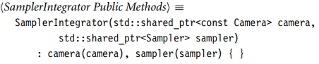
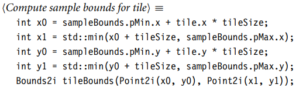

# INTRODUCTION

## 1. LITERATE PROGRAMMING

本书和==RTR4==不同，会使用`literate programming metalanguage`来描述详细的算法，大概形式如下：


## 2. PHOTOREALISTIC RENDERING AND THE RAY-TRACING ALGORITHM

老生常谈，不做赘述。


## 3. PBRT: 系统前瞻


==pbrt==在概念上可以分为两个**执行阶段**。首先，它解析用户提供的场景描述文件。**场景描述**是一个文本文件，它指定了构成场景的几何形状，材质属性，照亮它们的灯光，虚拟摄像机在场景中的位置，以及整个系统中使用的所有单个算法的参数。输入文件中的每条语句都直接映射到附录B中的一个例程；这些例程组成了描述场景的**程序接口**。

一旦场景被指定，**第二阶段**的执行开始，==主渲染==循环执行。这个阶段通常是**pbrt**花费大部分运行时间的阶段，本书的大部分内容描述了在这个阶段执行的**代码**。

在==程序的角度==上：

- pbrt的main()函数可以在main/pbrt.cpp文件中找到。这个函数非常简单;它首先循环argv中提供的命令行参数，在Options结构中初始化值，并存储参数中提供的文件名。

    > `<Process command-line arguments>`是直接的，没有在书中进行解释

- ==options==结构然后被传递给`pbrtInit()`函数，该函数执行**系统范围**的初始化。``main()``函数然后解析给定的**场景描述**，从而创建一个场景和一个积分器。在所有渲染完成后，``pbrtCleanup()``在系统退出之前，进行最后的清理。

### 场景表示

- ==\<Main Program\>==

    ```c++
    <Main program> ≡
        int main(int argc, char *argv[]) {
            Options options;
            std::vector<std::string> filenames;
            <Process command-line arguments> 
            pbrtInit(options);
            <Process scene description>
            pbrtCleanup();
            return 0;
        }
    ```

- \<Process scene description\>

    ```c++
    <Process scene description> ≡ 
        if (filenames.size() == 0) {
        	<Parse scene from standard input>
        } 
    	else {
       		<Parse scene from input files>
        }
    ```

- \<Parse scene from input file>

    ```c++
    <Parse scene from input files> ≡ 21
    	for (const std::string &f : filenames)
    		if (!ParseFile(f))
    			Error("Couldn’t open scene file \"%s\"", f.c_str());
    
    ```

- 当场景文件被解析时，对象被创建来代表场景中的灯光和几何原语。这些都存储在**场景对象**中，它是由`RenderOptions::MakeScene()`创建的

    

- 场景使用来自c++标准库的[`shared_ptr`](https://blog.csdn.net/shaosunrise/article/details/85228823)实例向量存储所有的灯光

    

- 场景中的每个几何对象都由一个==基元==表示，该基元组合了两个对象：一个指定其几何形状的**形状**，以及一个描述其外观的**材质**

    

- 构造函数在`worldBound`成员变量中，缓存场景几何的==边界框==。

    

- 在渲染开始之前，对光源做一些**额外的初始化**是很有用的。场景构造函数调用Preprocess()``方法：

    

- ==Scene类==提供了两个与**射线-基元**交汇有关的方法。它的`Intersect()`方法在场景中追踪给定的射线，并返回一个布尔值，指示该射线是否与任何基元相交。如果是，它就会填写所提供的`SurfaceInteraction`结构，其中包含沿射线最近的交点的信息。

    

- 另外一个方法是`Scene::IntersectP()`，它只返回是否相交，不会处理其它额外信息，所以很适合阴影：

    

### 积分器接口和采样积分器

- 呈现场景的图像是由==实现Integrator接口的类==的实例处理的。Integrator是一个抽象基类，它定义了所有积分器必须提供的`Render()`方法。在本节中，我们将定义一个积分器——**采样积分器**。

    

- 积分器必须提供的方法是`Render()`；它传递一个对场景的引用，用来计算场景的图像，或者更普遍地说，一组**场景照明**的测量值。==这个接口故意保持非常通用，以允许广泛的实现==，例如，可以实现一个积分器，只在场景中分布的**稀疏位置集**进行测量，而不是生成常规的2D图像。


在本章中，我们将重点介绍`Integrator`的子类`SamplerIntegrator`，以及实现了`SamplerIntegrator接口`的`whitteintegrator`。采样器积分器的名称来源于：它的**呈现过程**是由采样器的**样本流**驱动的；每一个**采样**识别图像上的一个点，在这个点上，**积分器**应该计算**到达的光**，以形成**图像**。


`SamplerIntegrator`存储一个指向**采样器**的指针。采样器的作用是微妙的，但是它的实现可以从本质上影响系统**生成的图像**的质量。首先，采样器负责在**图像平面**上选择**光线跟踪**的点。其次，它负责提供**积分器**用来估计**光传输积分值**的样本位置。例如，一些积分器需要在光源上选择随机点来计算区域灯的照明。生成这些样本的**良好分布**是渲染过程的一个重要部分，可以显著地影响整体效率。


==相机对象==控制观看和镜头参数，如位置、方向、焦点和视场。`Camera类`中的`Film成员变量`处理图像存储，负责将最终图像写入文件，并可能在计算图像时将其显示在屏幕上。


`SamplerIntegrator构造函数`将指向这些对象的指针存储在`成员变量`中。`SamplerIntegrator`是在`RenderOptions::MakeIntegrator()`方法中创建的，该方法由`pbrtWorldEnd()`调用，当从输入文件解析**场景描述**并准备呈现场景时，**输入文件解析器**将调用该方法。



`SamplerIntegrator`可以选择实现`Preprocess()`方法。它在场景被**完全初始化后**调用，并给积分器提供了一个机会，来进行与场景相关的计算，比如分配额外的数据结构，这些数据结构依赖于场景中的灯的数量，或者预先计算场景中**辐射度分布**的粗略表示。不需要做这些事情的实现可以不执行这个方法。


### 主渲染循环

在场景和积分器被分配和初始化之后，将调用`Integrator:: Render()`方法，启动==pbrt==执行的第二阶段：==主渲染循环==。在每一个图像平面上的一系列位置，该方法使用相机和采样器，来生成一个`ray`到场景中，然后使用`Li()`来确定**沿射线**到达图像平面上的==光量==。这个值传递给`Film`。图1.17总结了该方法中使用的主要类以及它们之间的数据流。


为了在具有多个**处理核心**的系统上并行地进行渲染，图像被分解成**像素的小块**。每个`tiles`都可以独立和并行处理。`ParallelFor()`函数，将在a .6节中详细描述，它实现了一个==parallel for循环==，其中多个迭代可以并行运行。c++ lambda表达式提供循环体。这里，`ParallelFor()`的一个变体在**2D域**上循环，用于迭代**图像块**。


在决定**图像块的大小**时需要权衡两个因素：负载平衡和每个贴图的开销。**一方面**，我们希望拥有比系统中处理器数量多得多的块：一般来说，一些`tiles`的处理时间可能比其他要短；负责场景相对简单的部分图像，通常比场景相对复杂的**部分图像**的处理时间要少。因此，如果贴图的数量等于处理器的数量，那么一些处理器会在其他处理器之前完成，处于空闲状态。

一方面，太小的`tiles`也是低效的。处理核心有一个小的固定开销，来决定下一步应该运行哪个循环迭代；`tiles`越多，需要的费用就越多。

==pbrt==总是使用`16 × 16`的`tiles`；这种粒度适用于几乎所有的图像，除了分辨率非常低的图像。`Film`的`GetSampleBounds`返回要采样的**像素范围**。


`Li()方法`的实现通常需要为每个**亮度计算**临时分配**少量的内存**。产生的**大量内存分配**很容易超过系统的常规内存分配例程（例如，malloc()或new），这些例程必须维护和同步复杂的**内部数据结构**，以跟踪**处理器**之间的**空闲内存区域集**。幼稚的实现可能会在内存分配器中花费相当大的计算时间。

为了解决这个问题，我们将`MemoryArena类`的一个实例传递给`Li()方法`。`MemoryArena实例`管理**内存池**，以实现比**标准库例程**更高的性能分配。

`Arena`的**内存池**总是被完整地释放，这样就不需要复杂的内部数据结构。该类的实例只能由**单线程**并发访问使用，而不允许进行**额外的同步**。我们为每个可以直接使用的**循环迭代**创建了一个惟一的`MemoryArena`，这也确保了arena只能被单个线程访问。:arrow_down:


大多数`Sampler`的实现都会发现保持一些**状态**是很有用的，比如当前被采样的像素坐标，这意味着多个处理线程不能同时使用一个`Sampler`。因此，`Samplers`提供了一个`Clone()方法`来创建一个给定Sampler的新实例；它需要一个种子，用来为**伪随机数生成器**提供种子，这样就可以在每个`tiles`中生成不同的**伪随机数序列**。(请注意，并不是所有的Samplers都使用伪随机数，那些不使用伪随机数的Samplers只是忽略了种子) :arrow_down:


接下来，根据`tile indices`计算处**循环迭代**中要采样的**像素范围**，在这个计算中必须考虑到==两个问题==：首先，要采样的**整体像素范围**可能不等于整个图像的分辨率。例如，用户可能已经指定了一个 "裁剪窗口"，只对像素的子集进行采样。其次，如果**图像分辨率**不是 16 的精确倍数，那么右侧和底部图像的`tiles`就不会是完整的` 16 × 16`。



最后，从`Film`得到`FilmTile`，这个类提供了一个小的**内存缓冲区**，来存储当前`tile`的像素值。一旦渲染完成，`tile`就会被合并到`film`的存储中；然后处理对`Image`的==串行化并发更新==。


现在可以进行渲染了。该实现使用基于范围的for循环，遍历`tile`中的所有像素，该**循环**自动使用`Bounds2类`提供的迭代器。**克隆的采样器**会被通知：它应该开始为当前像素生成样本，并依次处理样本，直到`StartNextSample()`返回`false`。:arrow_down:


`CameraSample`结构体记录`film`上的位置，**相机**会生成对应的射线`ray`。它还存储了**时间**和**镜头位置样本值**，分别用于渲染带有移动物体的场景，和模拟**非针孔孔径的相机模型**。


**相机接口**提供了两个方法来生成射线：`Camera::GenerateRay()`：为给定的**图像采样位置**返回一个射线；`Camera::GenerateRayDifferential()`，它返回一个==射线微分==，它包含了生成射线的信息。之后，`ScaleDifferentials()`方法缩放了射线微分，来考虑在每个像素取多个样本的情况下，`film plane`上样本之间的**实际间距**。

相机也会返回一个和射线相关联的==浮点权重值==，对于**简单的相机模型**，每条射线的权重是相等的，而**实际相机模型**，到达图像中心的射线多于边缘的（中心的权重大于边缘的），所以会产生一种特殊效果，也就是==vignetting==。回到正题，这个**返回的权重**会在之后使用，来**缩放**射线对图像的贡献。


下一步，来决定沿着这条射线，到达`image plane`的辐射率`radiance`。这个过程由`Li()`负责：


`Li()`是一个纯虚方法，它返回给定光线原点的**入射辐射率**。参数如下：

- `ray`。对应射线
- `scene`。要渲染的场景
- `sampler`。用**蒙特卡罗积分法**求解**光输运方程**的==采样生成器==。
- `arena`。内存区域
- `depth`。在进行`Li()`之前的射线`bounce`数。


关于不正确的辐射值，进行处理报错。可以去看实际代码。

知道辐射率之后，对图像进行更新。`FilmTile::AddSample()`更新`tile's image`的像素值，具体细节将在`7.8,7.9`进行阐述。


最后，释放内存：


一个贴图`tile`中所有样本的辐射值被计算出来，==FilmTile==就被交给`film`的`MergeFilmTile()`方法，该方法将`tile`的像素添加到最终图像中。


### 一种用于WHITTED光追的积分器


后文会有很多积分器，这里我们提出一种基于**WHITTED光追**算法的**积分器**。这种积分器可以精确地计算镜面（如玻璃、镜子和水）反射和透射的光，但它不包括其他类型的间接照明。


==Whitted积分器==的工作原理是：沿反射和折射光线方向**递归计算亮度**，直到到达最大深度（一般设定是5）。


这个积分器也要实现`Li()`方法：


首先是找到与场景的交点，如果没有，则需要返回一个辐射值，可以看做是无限大的光源，如天空。`Light::Le()`可以返回这个值。


然后是考虑光的散射情况。


发现交点后，来根据**表面材质**散射光。==ComputeScatteringFunctions()==方法处理此任务，计算**纹理函数**以确定**表面属性**，然后初始化**BSDF表示**。这种方法通常需要为构成这种表示的对象分配内存;


如果光线碰巧击中了**发射体**（如区域光源），**积分器**通过调用`SurfaceInteraction:: Le()`方法来计算`emitted radiance`。如果对象不是发射的，这个方法返回一个`black spectrum`。


对于每个光，**积分器**调用`light::Sample_Li()`方法来计算落在渲染点上的**光的辐射度**。这个方法还返回从渲染点到光源的**方向向量**$w_i$。我们还需要一个`VisibilityTester`对象来判断渲染点和光源之间的可见性，

