# 采样和重建


尽管像==pbrt==这样的渲染器的最终输出是一个**彩色像素的2D网格**，但入射亮度实际上是在`film`平面上定义的**连续函数**。**从该连续函数计算离散像素值的方式**可以显著地影响由渲染器生成的最终图像的质量；如果不仔细执行此过程，就会出现**伪影**。相反地，如果执行得很好，那么相对少量的额外计算就可以大大提高渲染图像的质量。

本章首先介绍==抽样理论==，即从**定义在连续域上的函数**中取**离散样本值**，然后利用这些样本重建**与原函数相似的新函数**的理论。本章定义的[`Sampler`](http://www.pbr-book.org/3ed-2018/Sampling_and_Reconstruction/Sampling_Interface.html#Sampler)s根据采样理论的原理，结合==低偏差点集==（一种特殊的均匀分布的采样点）的思想，通过多种方式生成**n维样本向量**。本章描述了**五种采样器**的实现，它们覆盖了解决采样问题的各种方法。

[toc]

## 1 .采样理论

数字图像表示为一组像素值，通常在一个**矩形网格**上排列。当数字图像显示在物理设备上时，这些值被用来确定显示器上的像素所发射的光谱功率。在思考数字图像时，**重要的是要区分图像像素和显示像素**，前者代表**特定采样位置的函数值**，后者则是**发出具有一定分布的光的物理对象**。(例如，在液晶显示器中，当以斜角观看显示器时，颜色和亮度可能会发生很大的变化)。显示器使用**图像像素值**在显示表面上构造一个新的**图像函数**。这个函数是在显示器上的所有点定义的。这种将**样本值集合**转换回**连续函数**的过程称为==重构==。

为了计算**数字图像**中的**离散像素值**，有必要对**原始连续定义的图像函数**进行==采样==。在`pbrt`中，就像大多数**其他的光线追踪渲染器**一样，获取**图像函数信息**的唯一方法是通过**追踪光线**进行采样。例如，没有一般的方法可以计算`film plane`上两点之间图像函数**变化的界限**。虽然只需在像素位置精确地取样就可以生成图像，但通过**在不同的位置取更多的样本**，并将这些关于**图像函数的附加信息**纳入到最终的像素值中，就可以得到更好的结果。事实上，为了获得最佳的质量结果，**像素值的计算**应使显示设备上的**重建图像**尽可能地接近虚拟相机`film plane`上的**场景原始图像**。请注意，这与期望**显示器的像素**在其位置上采取**图像函数的实际值**是一个微妙的不同目标。==处理这种差异是本章实现的算法的主要目标==。

> Note that this is a subtly different goal from expecting the display’s pixels to take on the image function’s actual value at their positions. Handling this difference is the main goal of the algorithms implemented in this chapter.

由于**取样**和**重建**过程涉及到**近似**，它引入了被称为`aliasing`的错误，它可以以多种方式表现出来，包括动画中的**锯齿状边缘**或**闪烁**。这些错误的出现是因为**采样过程**无法捕捉到**连续定义的图像函数的所有信息**。

作为这些理论的一个例子，考虑一个**一维函数**$f(x)$（我们可以互换地称之为**信号**），我们可以在**函数域**中的任意位置$x^/$求值$f(x^/)$。每个这样的位置$x^/$称为**采样位置**，其值为**采样值**$f(x^/)$。如下图，对曲线`f`采样，然后对采样点使用线性插值，重建得到$f^/$。


==傅里叶分析==可以用来评估**重构函数**和**原始函数**之间的==匹配质量==。本节将介绍**傅里叶分析的主要思想**，以完成采样和重构过程的某些部分，但将省略许多属性的证明，并跳过与**pbrt中使用的采样算法**不直接相关的细节。

### 频域和傅里叶变换

==傅里叶变换==是**傅里叶分析**的基础之一，它在**频域**中表示一个函数。(我们会说，函数通常在**空间域**中表示）。考虑下图中所示的两个函数。图7.(a)的函数变化相对缓慢，而图(b)的函数变化快得多。**变化较慢的函数**含有较多低频成分：


**大多数函数**可以分解为==移位正弦波==的**加权和**。这个显著的事实是由`Joseph Fourier`首先描述的，而**傅里叶变换**将函数转换成这种表示方式。通过函数的这种**频率空间表示形式**，可以深入了解函数的一些特征：**正弦函数中的频率分布与原函数中的频率分布相对应**。利用这种形式，可以利用**傅里叶分析**来洞察采样和重建过程中**引入的误差**，以及如何减少这种误差对感知的影响。

一维函数$f(x)$的**傅里叶变换**是


回顾：$e^{ix}=cosx+isinx,i=\sqrt{-1}$。这里我们只考虑==偶函数==，这种情况下的傅里叶变换`f`没有**虚数项**。新函数`F`是频率`w`的函数。我们用这样的方式表示**傅里叶变换算子**：$F\{f(x)\}=F(w)$。F是==线性算子==。

上面的方程被称为==傅里叶分析方程==，或者只是**傅里叶变换**。我们也可以用==傅里叶合成方程==，或者傅里叶反变换，从频域变换回空间域：


表7.1显示了一些重要的函数及其频率空间表示。很多这样的函数都是基于==狄拉克分布==——一个特殊的函数$\int\delta(x)dx=1，\forall x \neq0,\delta(x)=0$。这些性质的一个重要结果是：


==delta分布==不能表示为一个标准的数学函数，而通常被认为是以原点为中心、宽度接近`0`的**单位面积方框函数的极限**。


### 理想采样与重构

利用频域分析，我们可以正式地研究**采样的性质**。回想一下，**采样过程**要求我们选择一组等间距的采样位置，并计算这些位置上的函数值。形式上，这对应于用函数乘以一个“==shah==”，或“脉冲序列”函数。其定义是：


`T`定义了采样频率，这个乘法在等距点上产生一个**无穷序列的函数值**：


这些样本值可以通过选择**重构滤波器函数**==r(x)==，并计算卷积，来定义重构函数f (x)


其中==卷积运算==⊗的定义是：


傅里叶分析中使用的一个重要思想是：两个函数F{F(x)，g(x)}的**乘积的傅里叶变换**可以被证明是它们各自傅里叶变换F(ω)和g(ω)的**卷积**:


同样，空间域的卷积等价于频域的乘法：


利用这些思想，在空间域中的**原始采样步骤**，即shah函数和原始函数f(x)的乘积，可以等价地用F(ω)与另一个**shah函数在频率空间中的卷积**来描述。

==周期为T的函数的傅里叶变换是另一个周期为1/T的函数==。记住周期之间的倒数关系是很重要的：**这意味着如果样本在空间域中距离较远，它们在频率域中就会距离较近**

因此，**采样信号的频域**表示由F(ω)和这个**新的shah函数**的卷积给出。用==delta函数==卷积只是得到**一个函数的副本**，所以**用shah函数卷积**会得到一个==无限的原函数副本序列==，其间距等于**shah的周期**（下图）。这就是一系列样本的频域空间表示方法


现在我们已经有了函数频谱的**无限副本集**，那么我们如何重建原始函数呢？从图7.6来看，答案是显而易见的：只要舍弃所有的**频谱副本**，除了以原点为中心的副本，就可以得到原始的==F(ω)==。为了丢弃除了中心的频谱副本之外的所有副本，我们乘以一个适当宽度的`box`函数（图7.7）。


box函数定义如下：

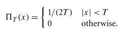

这个乘法步骤对应于空间域**与重构滤波器的卷积**。这是理想的采样和重建过程。总结:


在**空间域**中应用等效过程，同样可以精确恢复f(x)。因为`box`函数的傅里叶反变换是==sinc函数==，所以**理想的空间重构**是：


不幸的是，由于**sinc函数**具有无限范围，因此必须使用所有采样值f(i)来计算空间域中f(˜ x)的任何特定值。对于实际的实现来说，==空间范围有限的滤波器==是比较理想的，即使它们不能完美地重建原始函数。

在图形学中，一个常用的替代方法是使用==box函数==进行重构，有效地对**x周围某个区域内**的所有采样值进行**平均**，这是个非常糟糕的选择，考虑**box滤波器**在频域中的行为可以看出：这种技术试图通过乘以一个==sinc==来隔离函数频谱的中心副本，这不仅对**选择函数频谱中心副本**不好，而且还包括了它的其他副本（无限）的**高频贡献**。

### 锯齿

除了**sinc函数**区域无限大的问题外，理想采样和重建方法最严重的一个实际问题是：==信号带限的假设==。对于不受频带限制的信号，或者没有以**足够高的采样率**对其频率内容进行采样的信号，**前面描述的过程将重建一个与原始信号不同的函数**。

:star:**成功重构的关键**是能够准确地**恢复原始频谱F(ω)**，将采样频谱与一个适当宽度的箱函数相乘。请注意，在图 7.6 中，信号的频谱副本被空隙隔开，所以完美的重建是可能的。然而，如果原始函数是以较低的采样率进行采样，**那么考虑一下会发生什么**。回想一下，**周期为T的Shah函数T的傅里叶变换是一个周期为1/T的新Shah函数。这意味着，如果在空间域中，样本之间的间距增大，那么在频域中，样本间距就会减小，从而将频谱F(ω)的副本推得更近。如果副本靠得太近，它们就会开始重叠。**


当这个新的频谱与**box函数**相乘时，其结果是一个与==原始F(ω)==相似但不相等的频谱：**原始信号中的高频细节**泄漏到**重建信号频谱的低频区域**。这些新的低频伪影被称为`aliases`（==因为高频被 "伪装 "成低频==）。图7.9显示了重建一维函数$f(x)=1+cos(4x^2)$的`aliasing`效应（欠采样`undersampling`）。

解决**频谱重叠问题**的一个办法：提高采样率，直到**频谱的副本**相距足够远，不至于重叠，从而彻底消除`aliasing`。事实上，==采样定理==告诉了我们到底需要什么样的速率。该定理说，只要==均匀采样点的频率ωs==大于信号中==最大频率ω0==的==两倍==，就可以从采样中完美地重建原始信号。这个最小采样频率称为==奈奎斯特频率==。

对于非频带限制的信号（==ω0=∞==），不可能以足够高的采样率来进行完美重建。不幸的是，**在计算机图形学中，很少有函数是有频带限制的**。特别是，**任何包含不连续域的函数都不可能频带限制**，因此我们无法对其进行完美的采样和重建。这是有道理的，因为**函数的不连续**总是落在两个样本之间，而==样本没有提供关于不连续位置的信息==。因此，除了增加采样率之外，还需要应用其他方法。

### 抗锯齿技术

当我们希望精确时，我们称**采样伪影**为==前锯齿==，**重建伪影**为==后锯齿==。任何修复这些错误的尝试都被广泛地归为==抗锯齿==。本节将回顾一些抗锯齿技术，而不仅仅是增加采样率。

#### 非均匀采样

通过非均匀的方式改变**样本之间的间距**，可以减少`aliasing`对视觉的影响。如果`ξ`表示0和1之间的一个随机数，那么基于脉冲序列的**非均匀样本集**就是


均匀采样和非均匀采样都会产生不正确的重建信号。然而，==非均匀采样往往会将有规律的`aliasing`伪影变成噪声==，这对HSV干扰较小。

#### 自适应采样

另一种方法是==自适应超采样==：如果我们能够识别出信号中频率高于**奈奎斯特极限**的区域，我们就可以在这些区域采集更多的样本，而不需要增加所有采样频率。在实践中，要让这种方法很好地发挥作用是很困难的，因为找到**需要超采样的地方**是很困难的。**大多数技术都是基于对相邻采样值的检查**，并找到两个采样值之间有显著变化的地方，假设信号在该区域有高频率。

一般来说，**相邻的样本值**不能确定地告诉我们：它们之间到底发生了什么：即使数值相同，函数之间也可能有巨大的变化。另外，相邻的样本可能具有实质上不同的值，而实际上并不存在任何`aliasing`。

#### 预过滤:star:

:star:另一种方法是==对原始函数进行过滤==（**即模糊**），以便**在所使用的采样率下**，**不留下无法准确捕捉的高频**。这种方法在第10章的纹理函数中得到了应用。虽然**这种技术通过从函数中删除信息来改变被采样函数的特性**，但模糊通常比`aliasing`更不令人反感。

回想一下，我们想要将**原始函数的频谱**与**宽度合适的box滤波器**相乘，以便去除奈奎斯特限制以上的频率。在空间域中，这相当于将原始函数与一个==sinc滤波器==进行卷积


在实践中，我们可以使用一种**有限范围的滤波器**，效果很好。这种滤波器的**频率空间表示**可以帮助澄清它对**理想sinc滤波器**行为的近似程度。


图7.10显示了函数$1+cos(4x^2)$与第7.8节将介绍的**有限范围的sinc变体**的卷积。请注意，高频细节已经被消除；这个函数可以以图7.9中使用的采样率进行采样和重构，而不会产生混叠。

### 在图像合成中的应用

我们有一个图像，我们可以把它看作是**2D (x, y)图像位置**到**亮度值L**的函数。好消息是，通过射线跟踪器，可以任何(x，y)点计算这个函数。坏消息是，在采样之前，一**般不可能对f进行预过滤**，以去除其中的高频。因此，本章中的采样器将使用两种策略，即在最终图像中**增加采样率**，以及**非均匀分布采样**。

将**场景函数的定义**概括为一个更高维度的函数是很有用的，这个函数也取决于时间t和(u, v)镜头位置。对于一个特定的图像位置，该点的辐射度通常会随着时间（如果场景中有移动的物体）和镜头位置（如果相机有一个有限孔径镜头）的变化而变化。

更普遍的是，因为在第14章到第16章中定义的许多积分器使用==统计技术==来估计给定射线的辐射度，当重复给出相同的射线时，它们可能返回不同的辐射度值。如果我们进一步扩展场景亮度函数，使其包含积分器使用的样本值，我们将得到一个更高维度的图像函数


### 渲染中aliasing的来源

**几何学**是渲染图像中最常见的原因之一。当投射到图像平面上时，**物体的边界会引入一个阶跃函数**。不仅如前所述，**阶跃函数具有无限的频率域**，而且更糟糕的是，完美的重建滤波器在应用时，会引起伪影：在重建函数中出现==环状伪影==，这种效应被称为`Cibbs`现象。图7.11显示了一个1D函数的这种效应的例子。


场景中非常小的物体也会造成`几何aliasing`。如果几何体足够小，以至于它落在**图像平面上的样本之间**，它可能会在动画的多个帧中不可预知地消失和重新出现。

锯齿的另一个来源可能来自**物体的纹理和材质**。`Shading aliasing`可能是由**没有被正确过滤的纹理贴图**引起的（解决这个问题是第10章的大部分内容），或者是由闪亮表面上的小亮点引起的。如果取样率不够高，无法充分采样这些特征，就会产生锯齿。此外，**物体投下的尖锐阴影会在最终图像中引入另一个阶梯函数**，而从阴影边界检测**阶跃函数**比较困难。

### UNDERSTANDING PIXELS

在本章的其余部分，**有两个关于像素的观点是必须牢记的**。首先，必须记住，**构成图像的像素**是图像平面上**离散点的图像函数的采样**，没有与像素相关的 "面积"。正如阿尔维-雷-史密斯（Alvy Ray Smith，1995）指出的那样，==把像素看成是面积有限的小正方形是一种不正确的心理模型，会导致一系列的错误==。通过用信号处理的方法介绍本章的主题，我们试图为一个更准确的心理模型打下基础。


第二个问题是，**最终图像中的像素**自然是在**像素网格上的离散整数（x，y）坐标**处定义的，但本章中的==Samplers==是在**连续的浮点（x，y）位置**生成图像样本的。在这**两个域之间映射**的自然方法是将**连续坐标舍入到最近的离散坐标**；这很吸引人，因为它将恰好与离散坐标具有相同值的连续坐标映射到该离散坐标上。结果是，**给定一组跨越[x0，x1]范围的离散坐标，覆盖该范围的连续坐标集是[x0 - 1/2，x1 + 1/2)**。因此，任何为给定的**离散像素范围**生成连续样本位置的代码，都会遍布`1/2`的偏移量。很容易忘记其中的一些，导致细微的错误。

如果我们将**连续坐标c**截断为**离散坐标d**


将离散转换为连续：


## 2. 采样接口

正如在第7.1.5节中所介绍的，**pbrt中实现的渲染方法涉及到在图像平面上二维点以外的其他维度上选择采样点**。各种不同的算法都会被用来生成这些点，但是所有这些算法的实现都继承自一个定义了它们接口的==抽象Sampler类==。核心采样声明和函数在文件core/sampler.h和core/sampler.cpp中，每个采样生成的实现都在自己的源文件中，在samplers/目录下。

采样器的任务是在$[0,1)^n$中生成一个**n维样本序列**，为每个**图像样本**生成一个这样的样本向量，每个样本的维数n可能不同，这取决于**光传输算法**执行的计算。


因为样本值必须严格小于1，所以定义一个常数`OneMinusEpsilon`是很有用的，它表示**小于1的最大可表示浮点常数**。随后，我们将采样向量值夹在不大于这个值的范围内。


**采样器最简单的实现**就是：在每次需要**采样向量的额外分量**时，返回[0，1]中的均匀随机值。这样的采样器可以产生正确的图像，但需要更多的采样（因此，需要更多的射线跟踪和更多的时间）来产生与更复杂的采样器相同质量的图像。**使用更好的采样模式的运行时间花费与均匀随机数等低质量模式的运行时间花费大致相同**；因为计算每个图像样本的辐射度比计算样本的分量值要贵得多，所以做这项工作是有好处的。

下面假设这些样本向量的一些特征：

+ 前两个维度专门用于选择当前像素区域内的图像上的一个点；第三个维度用于计算拍摄样本的时间；第四和第五个维度给出了景深的(u，v)镜头位置。
+ 有些抽样算法在某些维度产生的样本比在其他维度产生的样本要好。在系统的其他地方，我们假设在一般情况下，较早的维度有最合适的样本值。(?)

还要注意的是，由采样器生成的**n维样本**通常不会显式表示或完整地存储，而是根据**光传输算法的需要**逐渐生成。

### 评估样本模式：差异性


**傅里叶分析**为我们提供了一种评估**二维采样模式质量**的方法，但它所带来的影响仅限于：通过在**有限频带频率范围**内，增加更多均匀间隔的样本，来量化**所能带来的改善**。考虑到**图像边缘**存在无限大的频率内容，以及**蒙特卡罗光传输算法**需要(n > 2)维样本向量，**单靠傅里叶分析是不够的**。

给定一个渲染器和一个放置样本的候选算法，评估**算法有效性**的一种方法是：使用该采样模式渲染一幅图像，并计算图像与使用大量样本渲染的参考图像相比的误差。我们将在本章后面使用这种方法来比较采样算法，不过它只能告诉我们算法在一个特定场景下的效果如何，在没有经过渲染过程的情况下，它并不能让我们感受到采样点的质量。

在傅立叶分析之外，数学家发展了一个叫做==差异==`discrepancy`的概念，可以用来评估n维采样模式的质量。**分布良好的模式具有低差异值**，因此**样本模式生成问题**可以被认为是一个**寻找合适的低差异模式的问题**。

==差异的基本思想==是，在一个n维空间$[0,1)^n$中的**一组点的质量**可以通过观察域$[0,1)^n$的区域，计算每个区域内的**点的数量**，并将每个区域的体积与里面的样本点的数量进行比较来评估。一般来说，一**个给定的体积分数**，和内部的**样本点总数的分数**应该大致相同。我们尝试使用模式，使**实际容量**和**点估算的容量**之间的==最大差异最小化==。图7.15给出了二维的例子。


为了计算一组点的差异，我们首先选择一个形状B族（family of shapes B ），是$[0,1)^n$的子集。例如，经常使用在原点有一个角的`box`。这对应于：


对于一个采样序列$P=x_1,....,x_N$，P和B之间的差异是：


其中，$\#\{x_i\in b\})$是$b$内点的数量，而$V(b)$是$b$的体积。当**形状B的集合**是以原点为角的`set of boxes`时，这个值被称为==星形差==，$D^*(P)$。B的另一个流行选项是**所有轴对齐框的集合**。

对于一些特定的点集，**差异**可以解析计算出来。例如，考虑一维的点集：
$$
x_i=\frac{i}{N}
$$
可以看到$x_i$的星差是：


该序列的星差可以通过稍微修改来改善：


在一维中，一系列点的==星点差==的界限已被证明是：


对于构造不那么简单的点序列、多维度更高的序列以及比盒形更不规则的形状，通常必须通过构造大量**形状b**，计算它们的差异，并报告**发现的最大值**，来对**差异**进行==数字估计==。

**单纯的差异性并不一定是一个好的度量标准**：一些**低差异性的点集**会表现出一些**样本的丛生**，其中两个或多个样本可能非常接近。一个样本与另一个样本越近，就越不可能提供关于**被抽样函数**的有用信息。因此，计算一组点中==任何两个样本之间的最小距离==也被证明是衡量**采样模式质量**的有用指标；最小距离越大，越好。

有许多算法可以生成==泊松盘采样模式==`Poisson disk`，这些模式在这个指标上得分很高。通过构造，在**泊松盘模式**中没有两个点比某个距离更近。研究表明，==眼睛中的视杆细胞和视锥细胞以类似的方式分布==，这进一步证实了这种分布对成像是一个不错的分布。在实践中，我们发现**泊松圆盘模式**对于二维图像的采样工作得很好，但与在**更复杂的渲染现场**进行**高维采样的低差异模式**相比，它的有效性较低。

### 基本的采样器接口

==Sampler基类==不仅定义了采样器的接口，而且为采样器的实现提供了一些常用的功能。

所有采样器实现必须向**构造函数**提供最终图像中**每个像素将生成的采样数**。我们使用一个精度为`64`位的变量，来存储采样计数。


:one:当**渲染算法**准备好对某个像素开始工作时，它首先调用`StartPixel()`，需要提供图像中**像素的坐标**。


`Get1D()`方法返回当前样本向量下一个维度的样本值，`Get2D()`返回两个维度的样本值.


在`pbrt`中，我们不支持来自采样器的**3D或更高维度采样值**的请求，因为这里实现的渲染算法类型通常不需要这些采样值。如果有必要，来自**低维组件的多个值**可以用来构建**高维采样点**。

Sampler基类提供了一个方法来初始化给定像素的`CameraSample`。


:two:如果需要==样本数组==，必须在渲染开始前请求它们。Request[12]DArray()方法应该在渲染开始之前，为每个这样的维度的数组调用——例如，在重写`SamplerIntegrator:.Preprocess()`方法的方法中。例如，在一个有**两个区域光源**的场景中，积分器将**四条阴影光线**追踪到**第一个光源**，**八个阴影光线**追踪到**第二个光源**，积分器将要求为每个图像样本提供**两个 2D 样本数组**，分别有`4`个和`8`个样本。(之所以需要一个二维阵列，是因为需要两个维度来参数化光的表面)。


`Sampler::RoundCount()`方法有助于传达这个信息。需要样本数组的代码应该调用这个方法，并提供**所需的样本数**，让`Sampler`有机会将**样本数**调整到一个**更好的数字**。然后，**返回的值**应该被用作实际向`Sampler`请求的样本数，**默认的实现是不变地返回给定的计数**。


在渲染过程中，可以调用`Get[12]DArray()`方法来获取一个指针。沿着`Get1D()`和`Get2D()`的思路，这些方法返回一个**指向样本数组的指针**，其大小由初始化期间相应调用`Request[12]DArray()`的参数`n`给出。调用者还必须向 "get "方法提供数组大小，该方法用于验证**返回的缓冲区**是否具有**预期的大小**。


:three:当一个样本的工作完成后，积分器调用`StartNextSample()`。这个调用通知采样器，后续的**采样组件请求**应该从当前像素的下一个样本的第一个维度开始返回值。这个方法返回真值，直到**每个像素最初请求的样本数**被生成为止（此时，调用者应该开始在另一个像素上工作）。


**Sampler的实现**存储了关于当前样本的各种状态：哪个像素正在被采样，样本的多少维度已经被使用，等等。一个`Sampler`被**多个线程**同时使用是不安全的。`Clone()`方法生成了一个**初始Sampler**的新实例，供渲染线程使用；它为`Sampler`的随机数生成器（如果有的话）取一个种子值，这样不同的线程就可以看到不同的**随机数序列**。在多个`image tiles`上重复使用**相同的伪随机数序列**可能会导致微妙的图像伪影，例如重复的噪声模式。


有些**光传输算法**在进入下一个像素之前，并不使用一个像素中的所有样本，而是在像素间跳转，每次在像素中取**一个样本**。`SetSampleNumber()`方法允许积分器设置当前像素中**要生成下一个像素的样本索引**。一旦`sampleNum`大于或等于每个像素的**原始请求样本数**，该方法就会返回`false`。


### 采样器的实现

:one:**Sampler基类**在其内部提供了一些方法的实现。首先，`StartPixel()`方法实现记录正在采样的**当前像素的坐标**，并将当前生成的像素中的采样数`currentPixelSampleIndex`重置为零。注意，这是一个带有实现的虚拟方法；重写这个方法的子类需要显式调用`Sampler::StartPixel()`。


当**像素采样**提前或显式设置时，`currentPixelSampleIndex`也会相应更新。与`StartPixel()`一样，方法`StartNextSample()`和`SetSampleNumber()`都是虚实现，也必须由Sampler子类中对它们的重载实现明确调用。


:two:**基类Sampler实现**还负责记录对**样本组件数组**的请求，并为它们的值分配存储空间。请求的样本数组的大小存储在`samples1DArraySizes`和`samples2DArraySizes`中，整个像素的数组样本的内存分配在`sampleArray1D`和`sampleArray2D`中。每次分配中的前n个值用于像素中第一个样本，以此类推


当通过`Get[12]DArray()`方法访问当前样本中的数组时，`array1D Offset`和`array2DOffset`被更新为**保存下一个要返回的、样本向量数组的索引**。


当**启动一个新像素**或当前像素中的**样本数**发生变化时，这些数组偏移量必须重置为`0`。


返回**合适的数组指针**是先根据当前样本向量中消耗了多少样本，来选择合适的数组，然后根据**当前像素样本索引**返回合适的实例。


> 为什么会有样本数组呢？例如，就后面的像素采样器来说，我们只有维度和采样数两个维度，也就是说，我们只需考虑为每个像素，考虑生成N个采样（采样又是M维度），但我们继续考虑，当射线击中一个表面时，除了反射方向外，我们可能还需要考虑面积光源（K边形），所以我们还需要为生成额外K组$N_i$个$M_i$维度采样。

:star:采样数组理解`1`

### 像素采样器

同时生成采样向量的所有维度的采样值。`PixelSampler类`实现了一些对**实现这些类型的采样器**有用的功能。

**渲染算法**将使用的**样本向量的维数**并不是提前知道的。事实上，它只是由`Get1D()`和`Get2D()`调用的次数以及**所请求的数组**来隐含决定的。因此，`PixelSampler constructor` 取一个最大的维数，`Sampler` 将计算**非数组样本值**。如果所有这些维度的组件都被消耗掉了，那么`PixelSampler`只会返回**额外维度的均匀随机值**。

对于每个**预计算的维度**，构造函数分配一个向量来存储样本值，像素中的每个样本都有一个值。这些向量的索引为`sample1D[dim][pixelSample]`。


继承自`PixelSampler`的**Sampler实现的关键责任**就是：在它们的`StartPixel()`方法中填充`samples1D`和`samples2D`数组。


给定`PixelSampler`子类计算出的数组中的样本值，`Get1D()`的实现只是返回连续维度的值，直到所有**计算出的维度**都被消耗掉，这时会返回**统一的随机值**。


### 全局采样器

:one:其他生成采样的算法在很大程度上不是==基于像素的==，而是**自然生成**分布**在整个图像中**的**连续样本**，连续访问**完全不同的像素**。（这样的采样器将一个**额外的采样**放置在**n维样本空间**中，使其填满最大的洞，这导致**后续的样本**在不同的像素内:?:）

到目前为止，这些采样算法在**采样器接口**上有些问题：例如，考虑一个取样器，它为**前两个维度**生成`表7.2`==中间列==所示的一系列样本值。这些采样值乘以每个维度上的图像分辨率，就得到了图像平面上的采样位置（为了简单起见，这里我们考虑的是**2×3的图像**），请注意，对于这里的采样器（实际上是`HaltonSampler`），**每六个采样**会访问每个像素。如果我们要渲染一个每个像素三个采样的图像，那么为了生成像素`（0，0）`的样本，我们需要生成索引为`0，6，12`的样本。


考虑到这样的采样器的存在，我们可以定义采样器接口，这样它就**可以为每个采样器指定要渲染的像素**，而不是相反

采用目前的设计有很好的理由：这种方法可以很容易地将`film`分解成小的图像`tiles`，进行==多线程渲染==，每个线程计算局部区域的像素，可以有效地合并到最终图像中。因此，我们必须要求这种采样器**不按顺序生成样本**，这样每个像素的所有样本都会连续生成。

:two:`GlobalSampler`有助于在**Sampler接口的期望**和**这些类型的采样器的自然操作**之间**架起桥梁**。它提供了所有**纯虚 Sampler 方法**的实现，并以**三个新的纯虚方法**来实现这些方法，而它的子类必须实现这些方法。


有两个方法是实现者必须提供的。

+ 第一个方法，`GetIndexForSample()`，执行从**当前像素和给定的样本索引**，到**总体样本向量集的全局索引**的==反向映射==。例如，对于`生成表7.2`中的Sampler，如果`currentPixel`是`(0，2)`，那么`GetIndexForSample(0)`将返回`2`，因为样本索引2的对应像素样本坐标(0.25，0.666667)对应的是落在该像素区域的第一个样本。
  

+ 此密切相关的是`SampleDimension()`，它返回序列中==indexth采样向量==的**给定维度的采样值**。因为前两个维度是用来偏移到当前像素中的，所以它们会被特殊处理：这个方法返回的值应该是**当前像素中的采样偏移量**，而不是原始的$[0,1)^2$样本值。对于表 7.2 中的例子，`SampleDimension(4,1)`将返回` 0.333333`，因为索引 4 的样本的第二个维度就是像素(0, 1)的偏移。
  

:three:当开始为一个像素生成采样时，需要重置**样本的维数**，找到该像素中第一个样本的索引。与所有采样器一样，**样本数组的值**都是接下来生成的


`dimension` 成员变量跟踪下一个维度，**采样器实现**将被要求生成一个样本值；当`Get1D()`和`Get2D()`被调用时，它将被递增。`intervalSampleIndex`记录了当前像素中，对应于当前样本$s_i$的**样本索引**。


有必要决定将**样本向量的哪些维度**用于**数组采样**。在假设**早期的维度**比**后期的维度**质量更好的情况下，为`CameraSample`预留前几个维度是很重要的，因为**这些样本值的质量往往对最终的图像质量有很大影响**。

:four:因此，从`arrayStartDim`开始的第一个维度用于常规的一维和二维采样，随后的维度用于先做一维，再做二维数组采样。最后，从`arrayEndDim`开始的更高维度用于进一步的非数组1D和2D采样。当**GlobalSampler构造函数**运行时，不可能计算`arrayEndDim`，因为积分器还没有请求**数组采样**。因此，这个值是在 `StartPixel() `方法中计算的。


实际上，生成数组样本只是计算**当前样本维度**中所需值的数量


:star:采样数组进一步分析：采样数组的第一维（最左边）是额外的处理数，比如需要额外考虑4个面积光；第二维是每个额外考虑所需的采样值，其大小不是一致的，等同于：射线数 * 每射线采样数。

:five:当像素采样发生变化时，需要重置当前的**采样维度计数器**，并计算像素内下一个采样的采样索引。


考虑到这个机制，获取**常规的1D样本值**只是跳过分配给数组样本的维度，并将当前样本索引和维度传递给实现的`SampleDimension()`方法。


目前疑惑：采样数组的采样值的获取问题，以及表示问题——对每个额外处理来说，每个射线的每次采样只存储了一个符点数？为什么不是一个浮点数向量，就像常规的采样那些。


## 3. stratified sampling

:one:第一个实现的采样器将**像素区域**细分为**矩形区域**，并在每个区域内生成**单个样本**。这些区域通常称为`strata`，这种采样器称为==分层取样器==。分层背后的关键思想是：通过将**采样域**细分为**不重叠的区域**，并从每个区域中提取**单个样本**，我们不太可能完全错过**图像的重要特征**，因为样本保证不都是紧密地在一起。换句话说，**在附近进行多次采样没有好处**。

**分层采样器**将每个样本随机放置在每个`stratum`的一个点上，方法是其中心点随机抖动。这种抖动导致的**不均匀性**有助于将`aliasing`转换为噪声。采样器还提供了一种不抖动的模式，提供**均匀采样**；这种模式主要用于不同采样技术之间的比较，而不是渲染高质量的图像。

直接将**分层方法**应用到**高维采样**中会导致**难以处理的采样数**。例如，如果我们将5D图像、镜头和时间样本空间在每个维度上分为`4`个层次，那么每个像素的样本总数为$4^5=1024$。我们可以通过在某些维度上减少取样（或者不对某些维度进行分层）来减少这种影响，但这样我们就会失去分层的好处。这种问题被称为**维度诅咒**。

:two:我们可以在不处理**过多的总采样**，通过计算**域的维度子集的低维度分层模式**，然后随机关联**每个维度集的采样**，来保留**分层的主要优点**。(这个过程有时被称为==填充==)。下图显示了基本思路：我们可能希望每个像素只取4个样本，但仍然要在所有维度上对样本进行分层。我们独立地生成`4`个二维分层的图像样本，`4`个一维分层的时间样本，以及`4`个二维分层的镜头样本。然后我们将每个图像样本随机关联一个时间和镜头样本值。结果是每个像素的样本，共同对**样本空间**有很好的覆盖。

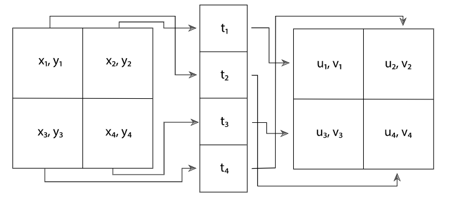

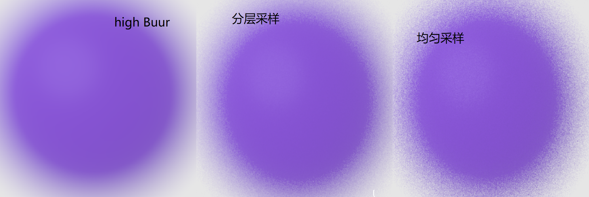

下图显示了几种采样模式的比较。第一种是**完全随机的模式**，结果是很糟糕的；一些地区的样本很少，而其他地区的样本很多。第二种是**均匀的分层模式**。在最后一种情况下，均匀模式已经被抖动了，每个样本的位置上都增加了一个随机偏移，使其保持在其单元内。这比纯随机模式的整体分布要好，同时又保留了分层的好处，不过还是有一些**样本聚集**和**样本不足**。

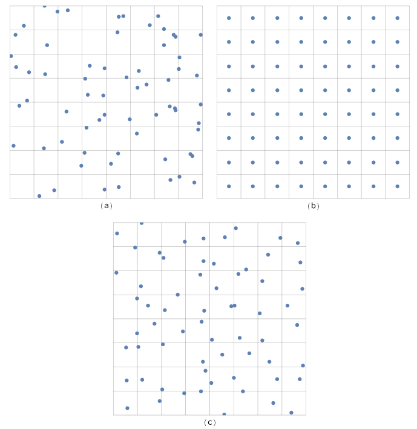

:three:开始代码吧：

```c++
<<StratifiedSampler Declarations>>= 
    class StratifiedSampler : public PixelSampler {
    public:
    	<<StratifiedSampler Public Methods>> 
    private:
   		<<StratifiedSampler Private Data>> 
    };

<<StratifiedSampler Public Methods>>= 
    StratifiedSampler(int xPixelSamples, int yPixelSamples,
    bool jitterSamples, int nSampledDimensions)
    : PixelSampler(xPixelSamples * yPixelSamples, nSampledDimensions),
    xPixelSamples(xPixelSamples), yPixelSamples(yPixelSamples),
    jitterSamples(jitterSamples) { }

<<StratifiedSampler Private Data>>= 
    const int xPixelSamples, yPixelSamples;
    const bool jitterSamples;

<<StratifiedSampler Method Definitions>>= 
    void StratifiedSampler::StartPixel(const Point2i &p) {
        <<Generate single stratified samples for the pixel>> 
        <<Generate arrays of stratified samples for the pixel>> 
        PixelSampler::StartPixel(p);
    }
```

在生成**初始分层样本**后，对其进行随机洗牌；这是本节开始描述的**填充方法**。

```c++
<<Generate single stratified samples for the pixel>>= 
    for (size_t i = 0; i < samples1D.size(); ++i) {
        StratifiedSample1D(&samples1D[i][0], xPixelSamples * yPixelSamples,
        rng, jitterSamples);
        Shuffle(&samples1D[i][0], xPixelSamples * yPixelSamples, 1, rng);
    }
    for (size_t i = 0; i < samples2D.size(); ++i) {
        StratifiedSample2D(&samples2D[i][0], xPixelSamples, yPixelSamples,
        rng, jitterSamples);
        Shuffle(&samples2D[i][0], xPixelSamples * yPixelSamples, 1, rng);
    }
```

1D和2D==分层采样例程==都是在域内**给定的层`strata `数上**循环，并在每个层中放置一个采样点。

```c++
<<Sampling Function Definitions>>= 
    void StratifiedSample1D(Float *samp, int nSamples, RNG &rng,
    bool jitter) {
        Float invNSamples = (Float)1 / nSamples;
        for (int i = 0; i < nSamples; ++i) {
            Float delta = jitter ? rng.UniformFloat() : 0.5f;
            samp[i] = std::min((i + delta) * invNSamples, OneMinusEpsilon);
        }
    }

<<Sampling Function Definitions>>+=  
    void StratifiedSample2D(Point2f *samp, int nx, int ny, RNG &rng,
    bool jitter) {
        Float dx = (Float)1 / nx, dy = (Float)1 / ny;
        for (int y = 0; y < ny; ++y)
            for (int x = 0; x < nx; ++x) {
                Float jx = jitter ? rng.UniformFloat() : 0.5f;
                Float jy = jitter ? rng.UniformFloat() : 0.5f;
                samp->x = std::min((x + jx) * dx, OneMinusEpsilon);
                samp->y = std::min((y + jy) * dy, OneMinusEpsilon);
                ++samp;
                }
    }
```

`Shuffle()函数`随机地对一个**计数样本值的数组**进行换算，每个数组都有`nDimensions`维度。

```c++
<<Sampling Inline Functions>>= 
    template <typename T>
    void Shuffle(T *samp, int count, int nDimensions, RNG &rng) {
        for (int i = 0; i < count; ++i) {
            int other = i + rng.UniformUInt32(count - i);
            for (int j = 0; j < nDimensions; ++j)
            	std::swap(samp[nDimensions * i + j], samp[nDimensions * other + j]);
        }
	}
```

:four:样本数组给我们带来了一个难题：for example, if an integrator asks for an array of 64 2D sample values in the sample vector for each sample in a pixel, the sampler has two different goals to try to fulfill：

+ 数组中的样本本身最好是**二维分布良好**的。这里的分层将提高每个**单独样本向量**的**计算结果的质量**。
+ 我们希望确保**图像样本数组中的每个样本**与**图像中邻近样本的任何样本值**都不太相似。相反，我们希望这些点相对于它们的邻居是==均匀分布==的，这样在单个像素周围的区域，就可以很好地覆盖整个样本空间。

**分层采样器**并没有试图同时解决这两个问题，而是只解决了**第一个问题**。本章后面的其他采样器将用更复杂的技术重新讨论这个问题，并在不同程度上同时解决这两个问题。

第二种复杂的情况是，调用者可能要求**每个图像样本的数量是任意的**，所以分层可能不容易应用。我们可以只生成一个`n×1`或`1×n`的**分层模式**，但这只能给我们带来一个维度上的分层的好处，而不能保证其他维度。`StratifiedSampler::RoundSize()`方法可以将请求四舍五入到整数平方的下一个数字，但我们将使用一种叫做==拉丁超立方体采样==（`LHS`）的方法，它可以在**任何维度**上生成**任意数量的样本**，并具有**合理的良好分布**。

`LHS`将**每个维度的轴线**统一划分为`n`个区域，并在`n`个区域中沿**对角线**各生成一个==抖动样本==，如下图左侧所示。然后将这些样本在每个维度中**随机洗牌**，形成一个具有**良好分布的模式**。`LHS`的一个优点是，当样本被投射到**采样维度的任何一个轴**上时，它可以最大限度地减少**样本的聚集**。这个特性与**分层取样**相反，在分层取样中，一个二维模式中的`2n`个$n\times n$样本可能会投射到**每个轴上基本相同的点**。图7.21显示了分层采样模式的最坏情况。

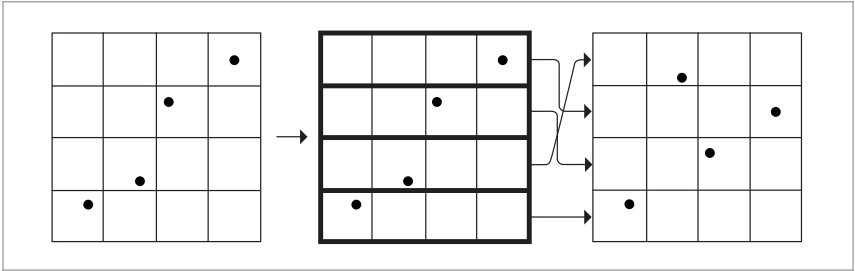

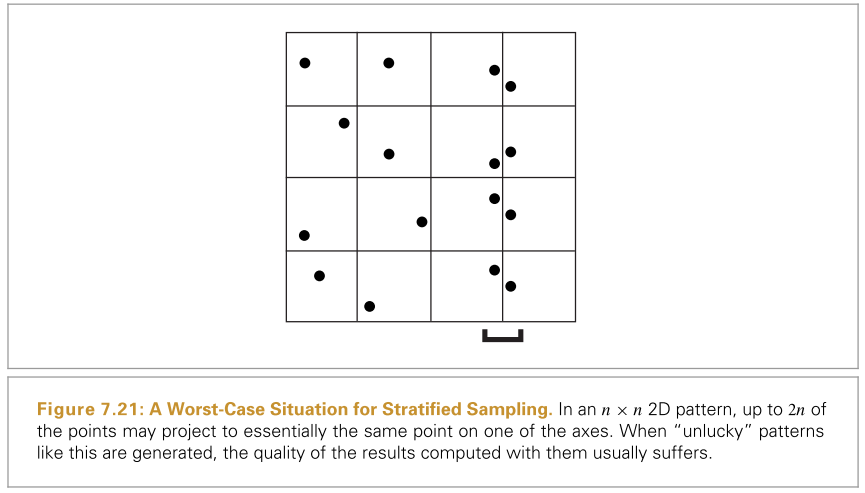

:five:尽管解决了**剧集问题**，但`LHS`并不一定是对**分层采样**的改进，很容易构造出**样本位置基本是对角线**的情况，而且采样域的大面积附近没有样本。特别是，随着`n`的增加，`LHS`与**分层模式**相比，效果越来越差。

通用的`LatinHypercube()`函数在任意维上生成任意数量的**LHS样本**。因此，sample数组中的元素数量应该是`nSamples*nDim`。

```c++
<<Sampling Function Definitions>>+=  
    void LatinHypercube(Float *samples, int nSamples, int nDim, RNG &rng) {
        <<Generate LHS samples along diagonal>> 
        <<Permute LHS samples in each dimension>> 
    }

<<Generate LHS samples along diagonal>>= 
    Float invNSamples = (Float)1 / nSamples;
    for (int i = 0; i < nSamples; ++i)
        for (int j = 0; j < nDim; ++j) {
            Float sj = (i + (rng.UniformFloat())) * invNSamples;
            samples[nDim * i + j] = std::min(sj, OneMinusEpsilon);
   		}
```

为了进行**换元**`permutation`，这个函数在样本上循环，每次对一个维度的样本点进行**随机换元**。请注意，这与前面的**Shuffle()例程**不同：那个例程只做一次换位，将每个样本中的**所有nDim样本点**保持在一起，而这里则是每次对一个维度的样本点进行**nDim的单独换位**（图7.22）。

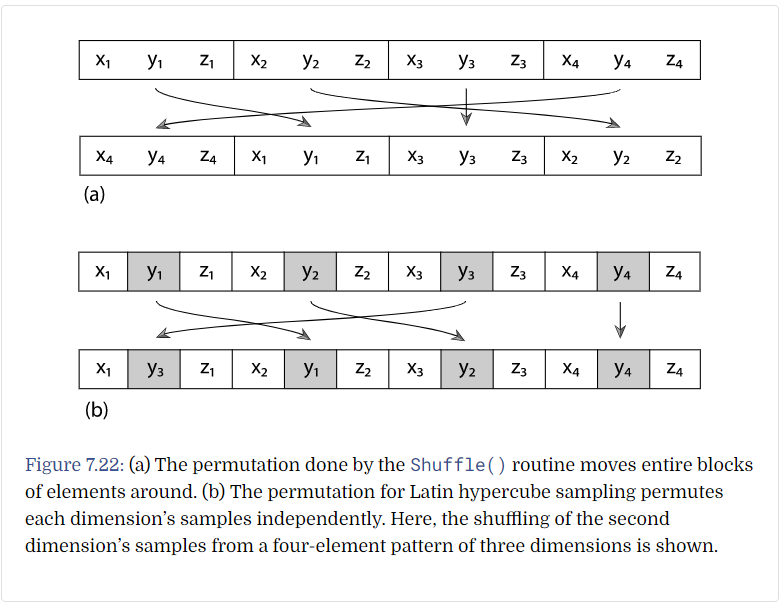

```c++
<<Permute LHS samples in each dimension>>= 
    for (int i = 0; i < nDim; ++i) {
        for (int j = 0; j < nSamples; ++j) {
            int other = j + rng.UniformUInt32(nSamples - j);
            std::swap(samples[nDim * j + i], samples[nDim * other + i]);
        }
    }
```

有了`LatinHypercube()`函数，我们现在可以编写代码来计算**当前像素的样本数组**。一维样本进行分层后**随机洗牌**，二维样本采用**拉丁超立方采样**。

```c
<<Generate arrays of stratified samples for the pixel>>= 
    for (size_t i = 0; i < samples1DArraySizes.size(); ++i)
        for (int64_t j = 0; j < samplesPerPixel; ++j) {
            int count = samples1DArraySizes[i];
            StratifiedSample1D(&sampleArray1D[i][j * count], count, rng,
                               jitterSamples);
            Shuffle(&sampleArray1D[i][j * count], count, 1, rng);
        }
	for (size_t i = 0; i < samples2DArraySizes.size(); ++i)
        for (int64_t j = 0; j < samplesPerPixel; ++j) {
            int count = samples2DArraySizes[i];
            LatinHypercube(&sampleArray2D[i][j * count].x, count, 2, rng);
        }
```

### 采样数组理解3

时至今日，似乎对于采用数组有了理解，首先一开始，一维和二维采样数组都是空的。

+ 首先，加入了一个区域灯，假如我们需要对其分配的采样向量是$(x,y,t,u,v)$，所以我们需要调用`request1DArray`一次（`t`），调用`request2DArray`两次（$(x,y)$和$(u,v)$）。
+ 然后对于$(x,y)$，我们需要采样`N`次，所以`samples2DArraySizes`存入`N`，但注意的是我们这里的采样次数还要更高一级：因为一般情况下，我们为了提高质量，需要采样`M `次，但这里的`N`更高一层，例如：对于一个方形灯，我应该对四个角都采样`M`次。
+ 底层采样，对于一条射线，进行多次采样（对其维度进行扰动），但无论如何没有考虑第二个对象，而是以自身出发；高层采样，则是需要考虑第二个对象，例如区域灯。这里的概念仅仅是为了解释本人的说法。
+ 所以说，我们应该在`Sample2DArray`中的第一个成员中，放入$N\times M$个`Point`。
+ 同理对于$(u,v)$，`Sample2DArray`中的第二个成员中，放入$N_1\times M_1$个`Point`。

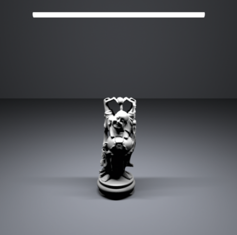


## 4. The Halton Sampler

本节介绍==HaltonSampler==，它是基于直接生成**低差异点集**的算法。与`StratifiedSampler`生成的点不同，`HaltonSampler`生成的点不仅保证**不会聚集**，而且同时在样本向量的所有维度上**分布良好**——而不是像`StratifiedSampler`那样每次只考虑一个或两个维度。

### Hammersley and Halton Sequences

:one:==Halton序列==和==Hammersley序列==是两个密切相关的**低差异点集**。两者都是基于一种被称为==基数逆==`radical inverse`的结构，它基于这样一个事实：即一个正整数值`a`可以用基数`b`来表示，结合数字序列：$d_m(a)...d_2(a)d_1(a)$：

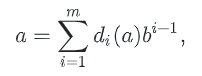

其中，$d_a(a)$的大小范围是$[0,b-1]$。以`b`为基数的**根式反函数**（`radical inverse function`）$\Phi(b)$通过反映**小数点附近的这些数字**，将一个非负整数`a`转换为`[0,1)`中的小数值：

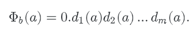

数字$d_i(a)$对`radical inverse`的贡献是$d_i(a)/b$。

:two:最简单的低差异序列之一是==van der Corput序列==，它是由以`2`为底的**根式反函数**给出的一维序列：

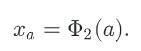

表7.3显示了**van der Corput序列**的前几个值。注意它是如何递归地将一维直线的间隔分成两半，在每个间隔的中心生成一个采样点的。

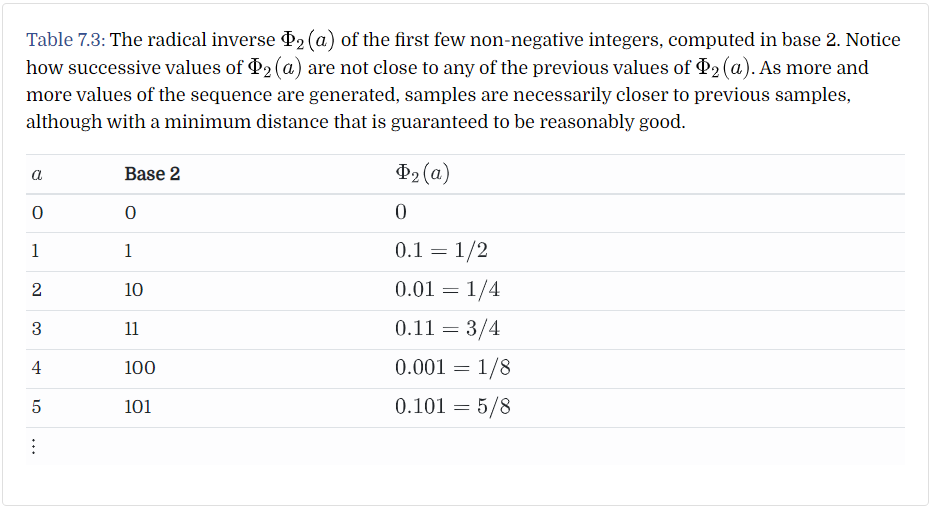

这个序列的差异是：

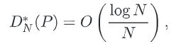

n维的差异为：

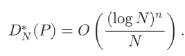

:three:为了在一个**n维的哈尔顿序列**中生成点，我们使用`radical inverse base`$b$，对模式的每个维度使用**不同的基数**。所用的基数必须都是**相对质数**，所以选择使用前`n`个质数(p1，...，pn)：

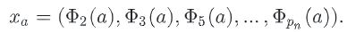

==Halton序列==最有用的特点之一是：即使事先不知道所需的**样本总数**，它也可以使用；序列的所有前缀都有很好的分布，所以当额外的样本被添加到序列中时，将保持较低的差异。
一个n维的Halton序列的差异：

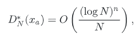

:four:如果样本数量`N`是固定的，可以使用==Hammersley点集==，差异稍微小一些。哈默斯利点集是：

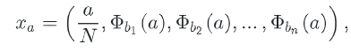

其中`N`是要采集的样本总数，和之前一样，所有的基$b_i$都是相对质数。图7.25(a)是二维哈尔顿序列的前216个点的图。图7.25(b)是哈默斯利序列的前256个点的图。


:five:函数`RadicalInverse()`使用**baseIndexth素数**作为基数，计算给定数字`a`的根的逆。该函数使用一个庞大的switch语句实现，其中`baseIndex`映射到适当的质数，然后单独的`RadicalInverseSpecialized()`模板函数实际计算根的逆。

```c++
<<Low Discrepancy Function Definitions>>= 
    Float RadicalInverse(int baseIndex, uint64_t a) {
    	switch (baseIndex) {
            case 0:
            <<Compute base-2 radical inverse>> 
            case 1: return RadicalInverseSpecialized<3>(a);
            case 2: return RadicalInverseSpecialized<5>(a);
            case 3: return RadicalInverseSpecialized<7>(a);
            <<Remainder of cases for RadicalInverse()>> 
        }
    }
```

对于基数2的**基数反演**` radical inverse`，我们可以利用计算机中数字已经用基数`2`表示的事实，更有效地计算基数反演。对于一个64位的值a，我们可以从公式(7.6)中得到以下结果。

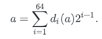

首先考虑将`a`的位数反转的结果，仍然将其视为一个整数值，这就得到了

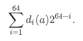

除以$2^{64}$，得到$\Phi_2(a)$：

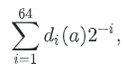

**整数的位**可以通过一系列的**逻辑位操作**有效地进行反转。`ReverseBits32()`函数的第一行，将32位整数的位数进行反转，将下16位与上16位的值进行交换。下一行同时将结果的前8位与后8位互换，第三8位与第四位互换。这个过程一直持续到最后一行，将相邻的位进行互换。为了理解这段代码，写出各种十六进制常数的二进制值是很有帮助的。例如，`0xff00ff00`的二进制值是`11111110000000011111100000000`；很容易看出，用这个值进行位性OR，可以掩盖掉第一个和第三个**8位的量**。

```c++
<<Low Discrepancy Inline Functions>>= 
    inline uint32_t ReverseBits32(uint32_t n) {
        n = (n << 16) | (n >> 16);
        n = ((n & 0x00ff00ff) << 8) | ((n & 0xff00ff00) >> 8);
        n = ((n & 0x0f0f0f0f) << 4) | ((n & 0xf0f0f0f0) >> 4);
        n = ((n & 0x33333333) << 2) | ((n & 0xcccccccc) >> 2);
        n = ((n & 0x55555555) << 1) | ((n & 0xaaaaaaaa) >> 1);
        return n;
    }
```

**64位值的位数**就可以通过将两个32位的分量分别反转，然后进行互换。

``` c++
<<Low Discrepancy Inline Functions>>+=  
    inline uint64_t ReverseBits64(uint64_t n) {
        uint64_t n0 = ReverseBits32((uint32_t)n);
        uint64_t n1 = ReverseBits32((uint32_t)(n >> 32));
        return (n0 << 32) | n1;
    }
```

和之前说的一样，翻转过后要除以$2^{64}$：

```c++
<<Compute base-2 radical inverse>>= 
	return ReverseBits64(a) * 0x1p-64;
```

:six:对于其他基数，`RadicalInverseSpecialized()`模板函数通过计算从$d_1$开始的数字$d_i$，并计算一个系列$v_i$，其中$v_1=d_1,v_2=bd_1+d_2$，具体如下，从而计算出`radical inverse`。

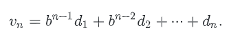

（例如，以`10`为基数时，它会将值`1234`转换为`4321`）此值可以完全使用**整型算法**找到，不会累积任何舍入误差。

最终的` radical inverse`可以通过转换为**浮点数**并乘以$1/b^n$，其中`n`是数值的位数，得到公式（7.7）中的数值。在处理数字时，这个乘法项将在` invBaseN `中建立起来。

```c++
<<Low Discrepancy Static Functions>>= 
template <int base>
static Float RadicalInverseSpecialized(uint64_t a) {
    const Float invBase = (Float)1 / (Float)base;
    uint64_t reversedDigits = 0;
    Float invBaseN = 1;
    while (a) {
        uint64_t next = a / base;
        uint64_t digit = a - next * base;
        reversedDigits = reversedDigits * base + digit;
        invBaseN *= invBase;
        a = next;
    }
    return std::min(reversedDigits * invBaseN, OneMinusEpsilon);
}
```

> 上诉函数，就是让输入的数字，在指定基下的表示翻转过来，然后除以$base^{64}$，转化成小数。

函数` InverseRadicalInverse()`将取某个基数中的反转整数位，与 `RadicalInverseSpecialized()`模板函数中的值相关联，然后乘以$1/b^n$因子，转换为 [0, 1) 中的浮点值。需要注意的是，为了能够正确地计算出反值，必须知道原值的总位数：例如，**1234**和**123400**在经过`Radical Inverse()`算法的纯整数部分后都被转换为4321，尾部的零变成了前导零，这就失去了这些零。

```c++
<<Low Discrepancy Inline Functions>>+=  
template <int base> inline uint64_t
InverseRadicalInverse(uint64_t inverse, int nDigits) {
    uint64_t index = 0;
    for (int i = 0; i < nDigits; ++i) {
        uint64_t digit = inverse % base;
        inverse /= base;
        index = index * base + digit;
    }
    return index;
}
```

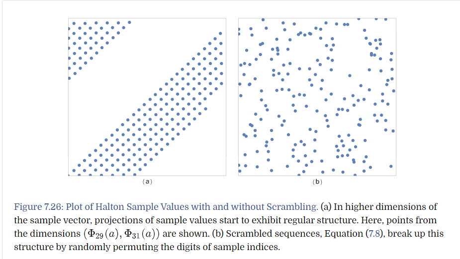

:seven:**汉默斯利和霍尔顿序列的缺点**是，随着基数`b`的增加，**样本值可以表现出惊人的规则模式**。这个问题可以用打乱的Halton和Hammersley序列来解决，在这种序列中，当计算根的逆时，对数字应用一个排列` permutation`：

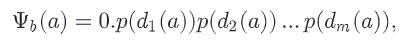

其中`p`是数字的**排列组合**` permutation`。请注意，每个数字都使用相同的排列组合，并且**相同的排列组合**用于生成给定基数`b`中的所有同位点，图7.26:arrow_up:显示了用**Halton序列**进行扰动的效果。

在下面，我们将使用**随机排列**，尽管特定的排列结构可以提供稍好的结果；`ComputeRadicalInversePermutations()`函数计算==随机的换元表==。它为所有的**排列组合**初始化一个连续数组，其中前两个值是整数0和1的排列组合，对于`b=2`，接下来的三个值是0，1，2的排列组合，对于`b=3`，依次类推。在下面的**for循环**的入口处，`p`指向当前素数基的、初始化的permutation数组的开始。

```c++
<<Low Discrepancy Function Definitions>>+=  
std::vector<uint16_t> ComputeRadicalInversePermutations(RNG &rng) {
    std::vector<uint16_t> perms;
    <<Allocate space in perms for radical inverse permutations>> 
    uint16_t *p = &perms[0];
    for (int i = 0; i < PrimeTableSize; ++i) {
        <<Generate random permutation for th prime base>> 
        p += Primes[i];
    }
    return perms;
}
```

**排列数组的总大小**由预先计算的素数表末尾的素数之和给出：

```c++
<<Allocate space in perms for radical inverse permutations>>= 
    int permArraySize = 0;
    for (int i = 0; i < PrimeTableSize; ++i)
    	permArraySize += Primes[i];
    perms.resize(permArraySize);

<<Low Discrepancy Declarations>>= 
    static constexpr int PrimeTableSize = 1000;
    extern const int Primes[PrimeTableSize];

<<Low Discrepancy Data Definitions>>= 
    const int Primes[PrimeTableSize] = {
        2, 3, 5, 7, 11,
        <<Subsequent prime numbers>> 
	};
```

生成每个置换很容易：我们只需将`p`初始化为**当前质数长度**的恒等置换，然后随机洗牌它的值。

``` c++
<<Generate random permutation for th prime base>>= 
    for (int j = 0; j < Primes[i]; ++j)
    	p[j] = j;
    Shuffle(p, Primes[i], 1, rng);
```

`ScrambleRadicalInverse()函数`本质上与`RadicalInverse()`相同，只是它将每个数字放入给定基数的置换表中。

```c++
<<Low Discrepancy Function Definitions>>+= 
Float ScrambledRadicalInverse(int baseIndex, uint64_t a,
const uint16_t *perm) {
    switch (baseIndex) {
        case 0: return ScrambledRadicalInverseSpecialized<2>(perm, a);
        case 1: return ScrambledRadicalInverseSpecialized<3>(perm, a);
        case 2: return ScrambledRadicalInverseSpecialized<5>(perm, a);
        case 3: return ScrambledRadicalInverseSpecialized<7>(perm, a);
        <<Remainder of cases for ScrambledRadicalInverse()>> 
    }
}
```

下面的实现还说明了在`perm`将数字0映射到非零值时可能出现的一种特殊情况。在这种情况下，迭代在`a`达到`0`时过早停止，错误地丢失了一个无限长的、值为perm[0]的数字后缀。幸运的是，这是一个具有简单解析解的几何级数，其值在最后一行中添加。

```c++
<<Low Discrepancy Static Functions>>+= 
    template <int base>
    static Float ScrambledRadicalInverseSpecialized(const uint16_t *perm, uint64_t a) {
        const Float invBase = (Float)1 / (Float)base;
        uint64_t reversedDigits = 0;
        Float invBaseN = 1;
        while (a) {
            uint64_t next = a / base;
            uint64_t digit = a - next * base;
            reversedDigits = reversedDigits * base + perm[digit];
            invBaseN *= invBase;
            a = next;
        }
        return std::min(invBaseN * (reversedDigits +
        invBase * perm[0] / (1 - invBase)), OneMinusEpsilon);
    }
```


### 哈尔顿采样器的实现

==HaltonSampler==使用**Halton序列**生成样本向量。与**分层取样器**不同，它是完全确定的；它在操作中不使用**伪随机数**。然而，霍尔顿采样可能导致`aliasing`，如果图像没有**充分的采样**。

```c++
<<HaltonSampler Declarations>>= 
class HaltonSampler : public GlobalSampler {
public:
	<<HaltonSampler Public Methods>> 
private:
    <<HaltonSampler Private Data>> 
    <<HaltonSampler Private Methods>> 
};

<<HaltonSampler Method Definitions>>= 
    HaltonSampler::HaltonSampler(int samplesPerPixel,
    const Bounds2i &sampleBounds)
    : GlobalSampler(samplesPerPixel) {
        <<Generate random digit permutations for Halton sampler>> 
        <<Find radical inverse base scales and exponents that cover sampling area>> 
        <<Compute stride in samples for visiting each pixel area>> 
        <<Compute multiplicative inverses for baseScales>> 
    }
```

所有==HaltonSampler实例==共享`permutation tables for the scrambled radical inverses`，并在构造函数第一次运行时计算。对于pbrt的需求，这种方法很好：当前的实现仅对图像的不同块使用不同的采样器实例，我们希望始终使用相同的排列。

```c++
<<Generate random digit permutations for Halton sampler>>= 
    if (radicalInversePermutations.size() == 0) {
    RNG rng;
    radicalInversePermutations = ComputeRadicalInversePermutations(rng);
}

<<HaltonSampler Private Data>>= 
	static std::vector<uint16_t> radicalInversePermutations;
```

实用程序方法`PermutationForDimension()`返回一个指向给定维的排列数组开始的指针。

```c++
<<HaltonSampler Private Methods>>= 
const uint16_t *PermutationForDimension(int dim) const {
    if (dim >= PrimeTableSize)
    Severe("HaltonSampler can only sample %d dimensions.",
    PrimeTableSize);
    return &radicalInversePermutations[PrimeSums[dim]];
}
```

为了能够快速地找到**给定维度的偏移量**，**素数的和**是很有帮助的。

```c
<<Low Discrepancy Data Definitions>>+= 
const int PrimeSums[PrimeTableSize] = {
    0, 2, 5, 10, 17,
    <<Subsequent prime sums>> 
};
```

为了将**样本的前两个维度**从$[0,1)$映射到**像素坐标**上，`HaltonSampler`会在每个维度上找到比**图像分辨率**或`kMaxResolution`较低者大的**最小尺度因子**$(2^j,3^k)$。 缩放后，图像范围外的**任何样本**将被简单地忽略。

对于在一个维度或两个维度上分辨率都大于`kMaxResolution`的图像，霍尔顿点将在图像上重复。此**分辨率限制**有助于在计算的样本值中保**持足够的浮点精度**。

```c++
<<Find radical inverse base scales and exponents that cover sampling area>>= 
    Vector2i res = sampleBounds.pMax - sampleBounds.pMin;
    for (int i = 0; i < 2; ++i) {
        int base = (i == 0) ? 2 : 3;
        int scale = 1, exp = 0;
        while (scale < std::min(res[i], kMaxResolution)) {
            scale *= base;
            ++exp;
        }
        baseScales[i] = scale;
        baseExponents[i] = exp;
    }
```

```c++
<<HaltonSampler Private Data>>+=  
	Point2i baseScales, baseExponents;

<<HaltonSampler Local Constants>>= 
	static constexpr int kMaxResolution = 128;
```

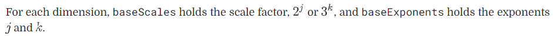

为了了解为什么`HaltonSampler`使用这个方案将样本映射到**像素坐标**，考虑用`radical inverse base b`乘以因子$b_n$计算的值的**缩放效果**。如果以`b`为底表示的`a`的数字是$d_i(a)$，那么回想一下，`radical inverse`是`0.d1(a)d2(a)…`，以b为底。如果我们把这个值乘以$b^2$，例如，我们有`d1(a)d2(a).d3(a)…`；前两位数字移到了小数点的左边，值的小数部分从$d_3(a)$开始

这个操作，按$b^n$缩放，构成了能够确定**样本索引**落在**哪些像素的核心**。考虑到上面例子中的前两位数字，我们可以看到，缩放值的**整数部分**范围从0到$b^2-1$，随着`a`的增加，它在基数`b`中的最后两位数字，每$b^2$个值中都会出现一次特定的值（也就是==周期==嘛）。

给定一个值x，$0<=x<=b^2-1$，我们在可以找到`a`，其整数部分和`x相等`。例如：在基`b`上定义x为：$d_2(x)d_(x)$，如果$d_1(a)=d_2(x)$，$d_2(a)=d_1(x)$，则说明找到了（因为比较的是`x`和`a’s radical inverse`，所以是反着比较）

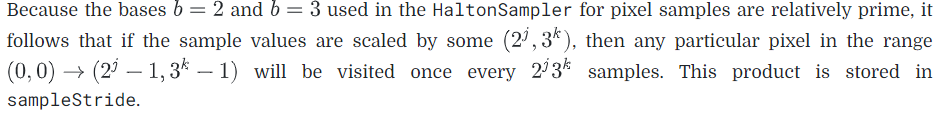

```c#
<<Compute stride in samples for visiting each pixel area>>= 
	sampleStride = baseScales[0] * baseScales[1];

<<HaltonSampler Private Data>>+=  
	int sampleStride;

<<HaltonSampler Private Data>>+=  
	int multInverse[2];
```

落在`currentPixel`中的第一个**Halton样本的样本索引**存储在`offsetForCurrentPixel`中。在为当前像素中的第一个样本首次计算此偏移量之后，在**Halton序列**中的`sampleStride`样本的增量处找到该像素中的后续样本

```c++
<<HaltonSampler Method Definitions>>+=  
int64_t HaltonSampler::GetIndexForSample(int64_t sampleNum) const {
    if (currentPixel != pixelForOffset) {
    	<<Compute Halton sample offset for currentPixel>> 
    	pixelForOffset = currentPixel;
    }
    return offsetForCurrentPixel + sampleNum * sampleStride;
}
```

```c++
<<HaltonSampler Private Data>>+= 
    mutable Point2i pixelForOffset = Point2i(std::numeric_limits<int>::max(),
    std::numeric_limits<int>::max());
    mutable int64_t offsetForCurrentPixel;
```

计算给定像素`(x, y)`中第一个样本的索引，其中样本已经被缩放为$(2^j,3^k)$，涉及计算x的最后j位基数2的倒数，我们用$x_r$表示，以及y的最后k位**基数3的倒数**，$y_r$。这样我们就得到了一个方程组

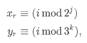

其中，满足这些方程的索引` i `是缩放后位于给定像素内的**样本的索引**。在本书中，我们不包括求解i  <<*Compute Halton sample offset for `currentPixel`*>>的代码；关于用于求解i的算法的细节，请参见Gr¨unschloß等人（2012）。

**样本偏移量的计算**并没有考虑到**随机数字的排列**，所以这里计算的样本值中并不包括这些。另外，由于前两个维度的**低baseExponents[i]数字**被用来选择哪个像素被采样，所以在计算前两个维度的样本向量的`radical inverse`之前，必须舍弃这些数字，因为`SampleDimension()`方法应该返回**被采样像素内的分数偏移**。更高的维度只是直接采样，包括随机排列。

```c++
<<HaltonSampler Method Definitions>>+= 
Float HaltonSampler::SampleDimension(int64_t index, int dim) const {
    if (dim == 0)
    	return RadicalInverse(dim, index >> baseExponents[0]);
    else if (dim == 1)
    	return RadicalInverse(dim, index / baseScales[1]);
    else
    	return ScrambledRadicalInverse(dim, index,
    	PermutationForDimension(dim));
}
```

