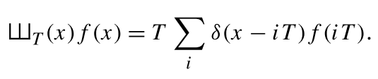
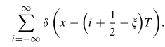
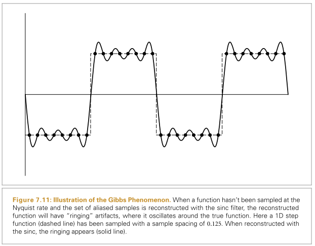

# 采样和重建

尽管像==pbrt==这样的渲染器的最终输出是一个**彩色像素的2D网格**，但入射亮度实际上是在`film`平面上定义的**连续函数**。**从该连续函数计算离散像素值的方式**可以显著地影响由渲染器生成的最终图像的质量；如果不仔细执行此过程，就会出现**伪影**。相反地，如果执行得很好，那么相对少量的额外计算就可以大大提高渲染图像的质量。

本章首先介绍==抽样理论==，即从**定义在连续域上的函数**中取**离散样本值**，然后利用这些样本重建**与原函数相似的新函数**的理论。本章定义的[`Sampler`](http://www.pbr-book.org/3ed-2018/Sampling_and_Reconstruction/Sampling_Interface.html#Sampler)s根据采样理论的原理，结合==低偏差点集==（一种特殊的均匀分布的采样点）的思想，通过多种方式生成**n维样本向量**。本章描述了**五种采样器**的实现，它们覆盖了解决采样问题的各种方法。

[toc]

## 1 .采样理论

数字图像表示为一组像素值，通常在一个**矩形网格**上排列。当数字图像显示在物理设备上时，这些值被用来确定显示器上的像素所发射的光谱功率。在思考数字图像时，**重要的是要区分图像像素和显示像素**，前者代表**特定采样位置的函数值**，后者则是**发出具有一定分布的光的物理对象**。(例如，在液晶显示器中，当以斜角观看显示器时，颜色和亮度可能会发生很大的变化)。显示器使用**图像像素值**在显示表面上构造一个新的**图像函数**。这个函数是在显示器上的所有点定义的。这种将**样本值集合**转换回**连续函数**的过程称为==重构==。

为了计算**数字图像**中的**离散像素值**，有必要对**原始连续定义的图像函数**进行==采样==。在`pbrt`中，就像大多数**其他的光线追踪渲染器**一样，获取**图像函数信息**的唯一方法是通过**追踪光线**进行采样。例如，没有一般的方法可以计算`film plane`上两点之间图像函数**变化的界限**。虽然只需在像素位置精确地取样就可以生成图像，但通过**在不同的位置取更多的样本**，并将这些关于**图像函数的附加信息**纳入到最终的像素值中，就可以得到更好的结果。事实上，为了获得最佳的质量结果，**像素值的计算**应使显示设备上的**重建图像**尽可能地接近虚拟相机`film plane`上的**场景原始图像**。请注意，这与期望**显示器的像素**在其位置上采取**图像函数的实际值**是一个微妙的不同目标。==处理这种差异是本章实现的算法的主要目标==。

> Note that this is a subtly different goal from expecting the display’s pixels to take on the image function’s actual value at their positions. Handling this difference is the main goal of the algorithms implemented in this chapter.

由于**取样**和**重建**过程涉及到**近似**，它引入了被称为`aliasing`的错误，它可以以多种方式表现出来，包括动画中的**锯齿状边缘**或**闪烁**。这些错误的出现是因为**采样过程**无法捕捉到**连续定义的图像函数的所有信息**。

作为这些理论的一个例子，考虑一个**一维函数**$f(x)$（我们可以互换地称之为**信号**），我们可以在**函数域**中的任意位置$x^/$求值$f(x^/)$。每个这样的位置$x^/$称为**采样位置**，其值为**采样值**$f(x^/)$。如下图，对曲线`f`采样，然后对采样点使用线性插值，重建得到$f^/$。

==傅里叶分析==可以用来评估**重构函数**和**原始函数**之间的==匹配质量==。本节将介绍**傅里叶分析的主要思想**，以完成采样和重构过程的某些部分，但将省略许多属性的证明，并跳过与**pbrt中使用的采样算法**不直接相关的细节。

### 频域和傅里叶变换

==傅里叶变换==是**傅里叶分析**的基础之一，它在**频域**中表示一个函数。(我们会说，函数通常在**空间域**中表示）。考虑下图中所示的两个函数。图7.(a)的函数变化相对缓慢，而图(b)的函数变化快得多。**变化较慢的函数**含有较多低频成分：

**大多数函数**可以分解为==移位正弦波==的**加权和**。这个显著的事实是由`Joseph Fourier`首先描述的，而**傅里叶变换**将函数转换成这种表示方式。通过函数的这种**频率空间表示形式**，可以深入了解函数的一些特征：**正弦函数中的频率分布与原函数中的频率分布相对应**。利用这种形式，可以利用**傅里叶分析**来洞察采样和重建过程中**引入的误差**，以及如何减少这种误差对感知的影响。

一维函数$f(x)$的**傅里叶变换**是

回顾：$e^{ix}=cosx+isinx,i=\sqrt{-1}$。这里我们只考虑==偶函数==，这种情况下的傅里叶变换`f`没有**虚数项**。新函数`F`是频率`w`的函数。我们用这样的方式表示**傅里叶变换算子**：$F\{f(x)\}=F(w)$。F是==线性算子==。

上面的方程被称为==傅里叶分析方程==，或者只是**傅里叶变换**。我们也可以用==傅里叶合成方程==，或者傅里叶反变换，从频域变换回空间域：

表7.1显示了一些重要的函数及其频率空间表示。很多这样的函数都是基于==狄拉克分布==——一个特殊的函数$\int\delta(x)dx=1，\forall x \neq0,\delta(x)=0$。这些性质的一个重要结果是：

==delta分布==不能表示为一个标准的数学函数，而通常被认为是以原点为中心、宽度接近`0`的**单位面积方框函数的极限**。

### 理想采样与重构

利用频域分析，我们可以正式地研究**采样的性质**。回想一下，**采样过程**要求我们选择一组等间距的采样位置，并计算这些位置上的函数值。形式上，这对应于用函数乘以一个“==shah==”，或“脉冲序列”函数。其定义是：

`T`定义了采样频率，这个乘法在等距点上产生一个**无穷序列的函数值**：

这些样本值可以通过选择**重构滤波器函数**==r(x)==，并计算卷积，来定义重构函数f (x)

其中==卷积运算==⊗的定义是：

傅里叶分析中使用的一个重要思想是：两个函数F{F(x)，g(x)}的**乘积的傅里叶变换**可以被证明是它们各自傅里叶变换F(ω)和g(ω)的**卷积**:

同样，空间域的卷积等价于频域的乘法：

利用这些思想，在空间域中的**原始采样步骤**，即shah函数和原始函数f(x)的乘积，可以等价地用F(ω)与另一个**shah函数在频率空间中的卷积**来描述。

==周期为T的函数的傅里叶变换是另一个周期为1/T的函数==。记住周期之间的倒数关系是很重要的：**这意味着如果样本在空间域中距离较远，它们在频率域中就会距离较近**

因此，**采样信号的频域**表示由F(ω)和这个**新的shah函数**的卷积给出。用==delta函数==卷积只是得到**一个函数的副本**，所以**用shah函数卷积**会得到一个==无限的原函数副本序列==，其间距等于**shah的周期**（下图）。这就是一系列样本的频域空间表示方法

现在我们已经有了函数频谱的**无限副本集**，那么我们如何重建原始函数呢？从图7.6来看，答案是显而易见的：只要舍弃所有的**频谱副本**，除了以原点为中心的副本，就可以得到原始的==F(ω)==。为了丢弃除了中心的频谱副本之外的所有副本，我们乘以一个适当宽度的`box`函数（图7.7）。

box函数定义如下：

这个乘法步骤对应于空间域**与重构滤波器的卷积**。这是理想的采样和重建过程。总结:

在**空间域**中应用等效过程，同样可以精确恢复f(x)。因为`box`函数的傅里叶反变换是==sinc函数==，所以**理想的空间重构**是：

不幸的是，由于**sinc函数**具有无限范围，因此必须使用所有采样值f(i)来计算空间域中f(˜ x)的任何特定值。对于实际的实现来说，==空间范围有限的滤波器==是比较理想的，即使它们不能完美地重建原始函数。

在图形学中，一个常用的替代方法是使用==box函数==进行重构，有效地对**x周围某个区域内**的所有采样值进行**平均**，这是个非常糟糕的选择，考虑**box滤波器**在频域中的行为可以看出：这种技术试图通过乘以一个==sinc==来隔离函数频谱的中心副本，这不仅对**选择函数频谱中心副本**不好，而且还包括了它的其他副本（无限）的**高频贡献**。

### 锯齿

除了**sinc函数**区域无限大的问题外，理想采样和重建方法最严重的一个实际问题是：==信号带限的假设==。对于不受频带限制的信号，或者没有以**足够高的采样率**对其频率内容进行采样的信号，**前面描述的过程将重建一个与原始信号不同的函数**。

:star:**成功重构的关键**是能够准确地**恢复原始频谱F(ω)**，将采样频谱与一个适当宽度的箱函数相乘。请注意，在图 7.6 中，信号的频谱副本被空隙隔开，所以完美的重建是可能的。然而，如果原始函数是以较低的采样率进行采样，**那么考虑一下会发生什么**。回想一下，**周期为T的Shah函数T的傅里叶变换是一个周期为1/T的新Shah函数。这意味着，如果在空间域中，样本之间的间距增大，那么在频域中，样本间距就会减小，从而将频谱F(ω)的副本推得更近。如果副本靠得太近，它们就会开始重叠。**

当这个新的频谱与**box函数**相乘时，其结果是一个与==原始F(ω)==相似但不相等的频谱：**原始信号中的高频细节**泄漏到**重建信号频谱的低频区域**。这些新的低频伪影被称为`aliases`（==因为高频被 "伪装 "成低频==）。图7.9显示了重建一维函数$f(x)=1+cos(4x^2)$的`aliasing`效应（欠采样`undersampling`）。

解决**频谱重叠问题**的一个办法：提高采样率，直到**频谱的副本**相距足够远，不至于重叠，从而彻底消除`aliasing`。事实上，==采样定理==告诉了我们到底需要什么样的速率。该定理说，只要==均匀采样点的频率ωs==大于信号中==最大频率ω0==的==两倍==，就可以从采样中完美地重建原始信号。这个最小采样频率称为==奈奎斯特频率==。

对于非频带限制的信号（==ω0=∞==），不可能以足够高的采样率来进行完美重建。不幸的是，**在计算机图形学中，很少有函数是有频带限制的**。特别是，**任何包含不连续域的函数都不可能频带限制**，因此我们无法对其进行完美的采样和重建。这是有道理的，因为**函数的不连续**总是落在两个样本之间，而==样本没有提供关于不连续位置的信息==。因此，除了增加采样率之外，还需要应用其他方法。

### 抗锯齿技术

当我们希望精确时，我们称**采样伪影**为==前锯齿==，**重建伪影**为==后锯齿==。任何修复这些错误的尝试都被广泛地归为==抗锯齿==。本节将回顾一些抗锯齿技术，而不仅仅是增加采样率。

#### 非均匀采样

通过非均匀的方式改变**样本之间的间距**，可以减少`aliasing`对视觉的影响。如果`ξ`表示0和1之间的一个随机数，那么基于脉冲序列的**非均匀样本集**就是

均匀采样和非均匀采样都会产生不正确的重建信号。然而，==非均匀采样往往会将有规律的`aliasing`伪影变成噪声==，这对HSV干扰较小。

#### 自适应采样

另一种方法是==自适应超采样==：如果我们能够识别出信号中频率高于**奈奎斯特极限**的区域，我们就可以在这些区域采集更多的样本，而不需要增加所有采样频率。在实践中，要让这种方法很好地发挥作用是很困难的，因为找到**需要超采样的地方**是很困难的。**大多数技术都是基于对相邻采样值的检查**，并找到两个采样值之间有显著变化的地方，假设信号在该区域有高频率。

一般来说，**相邻的样本值**不能确定地告诉我们：它们之间到底发生了什么：即使数值相同，函数之间也可能有巨大的变化。另外，相邻的样本可能具有实质上不同的值，而实际上并不存在任何`aliasing`。

#### 预过滤:star:

:star:另一种方法是==对原始函数进行过滤==（**即模糊**），以便**在所使用的采样率下**，**不留下无法准确捕捉的高频**。这种方法在第10章的纹理函数中得到了应用。虽然**这种技术通过从函数中删除信息来改变被采样函数的特性**，但模糊通常比`aliasing`更不令人反感。

回想一下，我们想要将**原始函数的频谱**与**宽度合适的box滤波器**相乘，以便去除奈奎斯特限制以上的频率。在空间域中，这相当于将原始函数与一个==sinc滤波器==进行卷积

在实践中，我们可以使用一种**有限范围的滤波器**，效果很好。这种滤波器的**频率空间表示**可以帮助澄清它对**理想sinc滤波器**行为的近似程度。

图7.10显示了函数$1+cos(4x^2)$与第7.8节将介绍的**有限范围的sinc变体**的卷积。请注意，高频细节已经被消除；这个函数可以以图7.9中使用的采样率进行采样和重构，而不会产生混叠。

### 在图像合成中的应用

我们有一个图像，我们可以把它看作是**2D (x, y)图像位置**到**亮度值L**的函数。好消息是，通过射线跟踪器，可以任何(x，y)点计算这个函数。坏消息是，在采样之前，一**般不可能对f进行预过滤**，以去除其中的高频。因此，本章中的采样器将使用两种策略，即在最终图像中**增加采样率**，以及**非均匀分布采样**。

将**场景函数的定义**概括为一个更高维度的函数是很有用的，这个函数也取决于时间t和(u, v)镜头位置。对于一个特定的图像位置，该点的辐射度通常会随着时间（如果场景中有移动的物体）和镜头位置（如果相机有一个有限孔径镜头）的变化而变化。

更普遍的是，因为在第14章到第16章中定义的许多积分器使用==统计技术==来估计给定射线的辐射度，当重复给出相同的射线时，它们可能返回不同的辐射度值。如果我们进一步扩展场景亮度函数，使其包含积分器使用的样本值，我们将得到一个更高维度的图像函数

### 渲染中aliasing的来源

**几何学**是渲染图像中最常见的原因之一。当投射到图像平面上时，**物体的边界会引入一个阶跃函数**。不仅如前所述，**阶跃函数具有无限的频率域**，而且更糟糕的是，完美的重建滤波器在应用时，会引起伪影：在重建函数中出现==环状伪影==，这种效应被称为`Cibbs`现象。图7.11显示了一个1D函数的这种效应的例子。

场景中非常小的物体也会造成`几何aliasing`。如果几何体足够小，以至于它落在**图像平面上的样本之间**，它可能会在动画的多个帧中不可预知地消失和重新出现。

锯齿的另一个来源可能来自**物体的纹理和材质**。`Shading aliasing`可能是由**没有被正确过滤的纹理贴图**引起的（解决这个问题是第10章的大部分内容），或者是由闪亮表面上的小亮点引起的。如果取样率不够高，无法充分采样这些特征，就会产生锯齿。此外，**物体投下的尖锐阴影会在最终图像中引入另一个阶梯函数**，而从阴影边界检测**阶跃函数**比较困难。

### UNDERSTANDING PIXELS

在本章的其余部分，**有两个关于像素的观点是必须牢记的**。首先，必须记住，**构成图像的像素**是图像平面上**离散点的图像函数的采样**，没有与像素相关的 "面积"。正如阿尔维-雷-史密斯（Alvy Ray Smith，1995）指出的那样，==把像素看成是面积有限的小正方形是一种不正确的心理模型，会导致一系列的错误==。通过用信号处理的方法介绍本章的主题，我们试图为一个更准确的心理模型打下基础。

第二个问题是，**最终图像中的像素**自然是在**像素网格上的离散整数（x，y）坐标**处定义的，但本章中的==Samplers==是在**连续的浮点（x，y）位置**生成图像样本的。在这**两个域之间映射**的自然方法是将**连续坐标舍入到最近的离散坐标**；这很吸引人，因为它将恰好与离散坐标具有相同值的连续坐标映射到该离散坐标上。结果是，**给定一组跨越[x0，x1]范围的离散坐标，覆盖该范围的连续坐标集是[x0 - 1/2，x1 + 1/2)**。因此，任何为给定的**离散像素范围**生成连续样本位置的代码，都会遍布`1/2`的偏移量。很容易忘记其中的一些，导致细微的错误。

如果我们将**连续坐标c**截断为**离散坐标d**

将离散转换为连续：

## 2. 采样接口

正如在第7.1.5节中所介绍的，**pbrt中实现的渲染方法涉及到在图像平面上二维点以外的其他维度上选择采样点**。各种不同的算法都会被用来生成这些点，但是所有这些算法的实现都继承自一个定义了它们接口的==抽象Sampler类==。核心采样声明和函数在文件core/sampler.h和core/sampler.cpp中，每个采样生成的实现都在自己的源文件中，在samplers/目录下。

采样器的任务是在$[0,1)^n$中生成一个**n维样本序列**，为每个**图像样本**生成一个这样的样本向量，每个样本的维数n可能不同，这取决于**光传输算法**执行的计算。

因为样本值必须严格小于1，所以定义一个常数`OneMinusEpsilon`是很有用的，它表示**小于1的最大可表示浮点常数**。随后，我们将采样向量值夹在不大于这个值的范围内。

**采样器最简单的实现**就是：在每次需要**采样向量的额外分量**时，返回[0，1]中的均匀随机值。这样的采样器可以产生正确的图像，但需要更多的采样（因此，需要更多的射线跟踪和更多的时间）来产生与更复杂的采样器相同质量的图像。**使用更好的采样模式的运行时间花费与均匀随机数等低质量模式的运行时间花费大致相同**；因为计算每个图像样本的辐射度比计算样本的分量值要贵得多，所以做这项工作是有好处的。

下面假设这些样本向量的一些特征：

+ 前两个维度专门用于选择当前像素区域内的图像上的一个点；第三个维度用于计算拍摄样本的时间；第四和第五个维度给出了景深的(u，v)镜头位置。
+ 有些抽样算法在某些维度产生的样本比在其他维度产生的样本要好。在系统的其他地方，我们假设在一般情况下，较早的维度有最合适的样本值。(?)

还要注意的是，由采样器生成的**n维样本**通常不会显式表示或完整地存储，而是根据**光传输算法的需要**逐渐生成。

### 评估样本模式：差异性

**傅里叶分析**为我们提供了一种评估**二维采样模式质量**的方法，但它所带来的影响仅限于：通过在**有限频带频率范围**内，增加更多均匀间隔的样本，来量化**所能带来的改善**。考虑到**图像边缘**存在无限大的频率内容，以及**蒙特卡罗光传输算法**需要(n > 2)维样本向量，**单靠傅里叶分析是不够的**。

给定一个渲染器和一个放置样本的候选算法，评估**算法有效性**的一种方法是：使用该采样模式渲染一幅图像，并计算图像与使用大量样本渲染的参考图像相比的误差。我们将在本章后面使用这种方法来比较采样算法，不过它只能告诉我们算法在一个特定场景下的效果如何，在没有经过渲染过程的情况下，它并不能让我们感受到采样点的质量。

在傅立叶分析之外，数学家发展了一个叫做==差异==`discrepancy`的概念，可以用来评估n维采样模式的质量。**分布良好的模式具有低差异值**，因此**样本模式生成问题**可以被认为是一个**寻找合适的低差异模式的问题**。

==差异的基本思想==是，在一个n维空间$[0,1)^n$中的**一组点的质量**可以通过观察域$[0,1)^n$的区域，计算每个区域内的**点的数量**，并将每个区域的体积与里面的样本点的数量进行比较来评估。一般来说，一**个给定的体积分数**，和内部的**样本点总数的分数**应该大致相同。虽然不可能总是这样，但我们仍然可以尝试使用模式，使**实际容量**和**点估算的容量**之间的==最大差异最小化==。图7.15给出了二维的例子。

