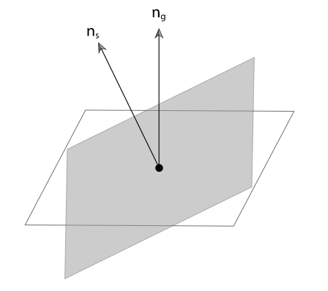
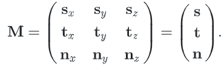
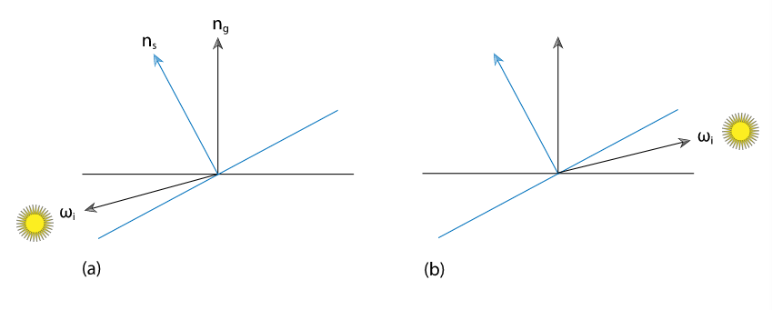
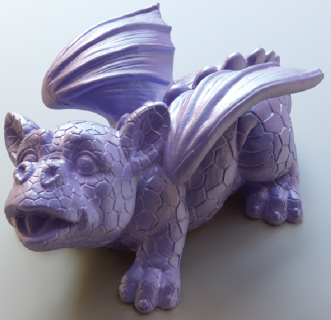

# 材质

上一章介绍的`BRDFs`和`BTDFs`只解决了描述**表面如何散射光**的部分问题。尽管它们描述了光线如何在表面上的一个特定点上散射，**渲染器**需要确定哪些`brdf`和`btdf`在表面上的一个点上存在，以及它们的参数是什么。在本章中，我们将描述一个**过程着色机制**来解决这个问题。

pbrt方法背后的基本思想是，**一个表面着色器**绑定到场景中的**每个原语**。**表面着色器**由`Material`接口类的**一个实例**表示，它有一个方法，在表面上**取一个点**，并创建一个`BSDF`对象（可能是`BSSRDF`），表示在该点的散射。`BSDF`类持有一组`bxdf`，它们的**贡献求和**以给出**完整的散射函数**。`Materials`，反过来，使用**纹理类的实例**来确定表面上**特定点的材质属性**。例如，`ImageTexture`可以用来调节**表面漫反射的颜色**。

这是一个与**许多渲染系统**使用的**不同的着色范例**；通常的做法是将**表面着色器**和**照明积分器**的功能结合到一个模块中，并让**着色器**返回点上**反射光的颜色**。然而，通过**分离这两个组件**并让`Material`返回一个`BSDF`，`pbrt`能够更好地处理**各种轻传输算法**。


## 1. BSDF

==BSDF类==表示`BRDFs`和`BTDFs`的集合。以这种方式对它们进行分组，允许**系统的其余部分**直接使用组合`BSDFS`，而不必考虑构建它们的所有组件。同样重要的是，**BSDF类**对系统的其他部分**隐藏**了一些**着色法线的细节**。**着色法线**，无论是来自三角形网格中的每个顶点的法线，还是来自**凹凸贴图**，都可以极大地提高渲染场景的视觉丰富度，但因为它们是一个**特别的构造**，所以**很难将它们整合到物理上**。

**BSDF构造函数**接收一个`SurfaceInteraction`对象，该对象包含表面上点的**差分几何信息**，以及一个参数`eta`，该参数给出了边界上的**相对折射率**。对于**不透明的表面**，`Eta`不被使用，调用者应该提供一个`1`的值。构造函数计算一个**以渲染法线为轴的正交坐标系**；这个坐标系对于**BxDF坐标系**的方向转换非常有用。在本节中，我们将使用惯例，$n_s$表示**着色法线**，$n_g$表示**几何法线**。



```c++
<<BSDF Public Methods>>= 
BSDF(const SurfaceInteraction &si, Float eta = 1)
    : eta(eta), ns(si.shading.n), ng(si.n),
      ss(Normalize(si.shading.dpdu)), ts(Cross(ns, ss)) { }

<<BSDF Public Data>>= 
const Float eta;

<<BSDF Private Data>>= 
const Normal3f ns, ng;
const Vector3f ss, ts;
```

**BSDF实现**只存储**有限数量**的单个`BxDF`组件。如果给它更多的组件，可以很容易地扩展它以分配更多的空间，尽管到目前为止，pbrt中的任何`Material`实现都不需要这样做，而且目前的`8`个限制对于几乎所有实际应用程序来说已经足够了。

```c++
<<BSDF Public Methods>>+=  
void Add(BxDF *b) {
    Assert(nBxDFs < MaxBxDFs);
    bxdfs[nBxDFs++] = b;
}

<<BSDF Private Data>>+=  
int nBxDFs = 0;
static constexpr int MaxBxDFs = 8;
BxDF *bxdfs[MaxBxDFs];
```

下列方法返回BSDF存储的、匹配特定`BxDFType`标志集的**BxDFs的数量**：

```c++
<<BSDF Public Methods>>+=  
int NumComponents(BxDFType flags = BSDF_ALL) const;
```

`BSDF`也有一些方法可以在`BxDF`使用的**本地坐标系**中进行转换。回顾一下，在这个坐标系中，表面法线是沿着`z`轴的$(0,0,1)$，主切线是$(1,0,0)$，次切线是$(0,1,0)$。给定世界空间中的`3`个**正交矢量**`s`、`t`和`n`，将**世界空间中的矢量**转换为**局部反射空间**的矩阵`M`为



在这种情况下，我们不需要计算`M`的**反转置**来转换法线。因为`M`是一个**正态矩阵**（它的行和列是相互正交的，并且是单位长度），**它的逆等于转置**，所以它已经是它自己的反转置。

```c++
<<BSDF Public Methods>>+=  
Vector3f WorldToLocal(const Vector3f &v) const {
    return Vector3f(Dot(v, ss), Dot(v, ts), Dot(v, ns));
}
```

```c++
<<BSDF Public Methods>>+=  
Vector3f LocalToWorld(const Vector3f &v) const {
    return Vector3f(ss.x * v.x + ts.x * v.y + ns.x * v.z,
                    ss.y * v.x + ts.y * v.y + ns.y * v.z,
                    ss.z * v.x + ts.z * v.y + ns.z * v.z);
}
```

**着色法线**在实践中会造成各种不理想的假象。下图（`a`）显示了一个**漏光**`light leak`：**几何法线**表明$w_i$和$w_o$​​​​位于**表面的相对两侧**，所以如果表面不是透射性的，**光线应该没有贡献**。然而，如果我们**直接计算散射方程**，关于以着色法线为中心的半球，我们将错误纳入来自$w_i$​的光线。这个案例表明，在渲染计算中，$n_s$不能仅仅作为$n_g$的直接替代品。



上图（b）显示了一个类似的棘手情况：**着色法线**表示不应该有光线反射给观众，因为它和照明不在同一个半球，而几何法线表示它们在同一个半球。直接使用$n_s$会在发生这种情况的表面上造成**难看的黑点**。

幸运的是，对这些问题有一个**优雅的解决方案**。在计算`BSDF`时，我们可以使用**几何法线**来决定我们应该计算反射还是透射：如果$w_i$和$w_o$相对于$n_g$位于同一半球，我们计算`BRDF`，否则我们计算`BTDF`。然而，在计算散射方程时，**法线和入射方向的点积**仍然是用**着色法线**来取。

计算一对**给定方向的BSDF**的方法就会直接出现：它首先将**世界空间的方向向量**转换为**本地的BSDF空间**，然后确定它应该使用`BRDFs`还是`BTDFs`。然后，它在适当的集合上循环，计算它们的贡献之和：

```c++
<<BSDF Method Definitions>>= 
Spectrum BSDF::f(const Vector3f &woW, const Vector3f &wiW, 
                 BxDFType flags) const {
    Vector3f wi = WorldToLocal(wiW), wo = WorldToLocal(woW);
    bool reflect = Dot(wiW, ng) * Dot(woW, ng) > 0;
    Spectrum f(0.f);
    for (int i = 0; i < nBxDFs; ++i)
        if (bxdfs[i]->MatchesFlags(flags) &&
            ((reflect && (bxdfs[i]->type & BSDF_REFLECTION)) ||
            (!reflect && (bxdfs[i]->type & BSDF_TRANSMISSION))))
            f += bxdfs[i]->f(wo, wi);
    return f;
}
```

`pbrt`还提供了**BSDF方法**来返回**BSDF的反射率**。两个相应的方法只是在`BxDFs`上循环，并将其`BxDF::rho()`方法返回的值相加；这里不包括其直接的实现。这些方法为`BxDFs` 获取**样本数组**，以便在需要时用于**蒙特卡洛抽样算法**（回顾8.1.1节中定义的`BxDF::rho()`接口，它也获取这种样本）。

```c++
<<BSDF Public Methods>>+=  
Spectrum rho(int nSamples, const Point2f *samples1,
             const Point2f *samples2, BxDFType flags = BSDF_ALL) const;
Spectrum rho(const Vector3f &wo, int nSamples, const Point2f *samples,
             BxDFType flags = BSDF_ALL) const;
```


### 1.1 BSDF内存管理

对于与**场景中的几何体**相交的每一条射线，在计算沿射线携带的辐射度的过程中，积分器将创建一个或多个**BSDF对象**。这些BSDFs中的每一个反过来都有一些`BxDFs`存储在里面，这些BxDFs是由**交汇点上的材料**创造的。

一个天真的实现会使用`new`和`delete`来动态地分配`BSDF`和它所持有的每个`BxDF`的**存储空间**。不幸的是，这种方法的**效率低得令人无法接受**——在**动态内存管理例程**中会为一系列**小的内存分配**花费太多的时间。相反，这里的实现使用了基于A.4.3节中描述的`MemoryArena`类的专门分配方案。一个`MemoryArena`被传递到**为BSDFs分配内存的方法**中。例如，`SamplerIntegrator::Render()`方法为每个图像`tile`创建一个`MemoryArena`并将其传递给积分器，积分器再将其传递给`Material`。

为了方便分配`BSDF`和`BxDF`的代码（例如本章中的`Materials`），有**一个宏**隐藏了使用**内存场**的一些混乱情况。而不是像这样使用`new`操作符来分配这些对象。

```c++
BSDF *b = ARENA_ALLOC(arena, BSDF);
BxDF *lam = ARENA_ALLOC(arena, LambertianReflection)(Spectrum(0.5f));
```

`ARENA ALLOC()` 宏使用**放置操作符**`new`在**返回的内存位置**运行**对象的构造函数**。

```c++
<<Memory Declarations>>= 
#define ARENA_ALLOC(arena, Type) new (arena.Alloc(sizeof(Type))) Type
```


## 2. 材质接口和实现

抽象材质类：

```c++
<<Material Declarations>>= 
class Material {
public:
    <<Material Interface>> 
};
```

材料必须实现一个方法：`ComputeScatteringFunctions()`。这个方法被赋予一个**SurfaceInteraction对象**，该对象包含了一个形状表面上的**交点的几何属性**。该方法负责确定**该点的反射属性**，并用**相应的BSDF类实例**来初始化`SurfaceInteraction::bsdf`成员变量。如果材料包括**次表面散射**，那么`SurfaceInteraction::bssrdf`成员也应该被**初始化**。

有三个额外的参数被传递给这个方法。

- 一个`MemoryArena`，用于为`BSDFs`和`BSSRDFs`分配内存。
- 传输模式（`TransportMode`）参数，该参数表明表面交点是沿着**从摄像机开始的路径**还是**从光源开始的路径**找到的；这个细节对`BSDF`和`BSSRDF`的计算方式有影响——见第16.1节。
- 最后，`allowMultipleLobes`参数表明，当有`BxDF`时，材料是否应该使用**将多种散射类型聚集到一个BxDF中的BxDF**。(这种BxDF的一个例子是`FresnelSpecular`，它包括**镜面反射和透射**）。这些BxDFs在与**蒙特卡洛光传输算法**一起使用时可以提高最终结果的质量，但在与`DirectLightingIntegrator`和`WhittedIntegrator`一起使用时，会在图像中**引入噪声**。因此，允许积分器通过这个参数来控制是否使用这种`BxDFs`。

```c++
<<Material Interface>>= 
virtual void ComputeScatteringFunctions(SurfaceInteraction *si,
    MemoryArena &arena, TransportMode mode,
    bool allowMultipleLobes) const = 0;
```

由于`Integrator`**使用的交点**通常是`SurfaceInteraction`类的**一个实例**，我们将在该类中添加一个方便的方法`ComputeScatteringFunctions()`。它的实现首先调用`SurfaceInteraction`的`ComputeDifferentials()`方法来计算**图像平面上交点**周围的表面区域的**投影尺寸信息**，以用于**纹理抗锯齿**。接下来，它将请求转发给基元，而基元又会调用**其材料的计算散射函数**（`ComputeScatteringFunctions`）方法。(例如，见`GeometricPrimitive::ComputeScatteringFunctions()`实现）)

```c++
<<SurfaceInteraction Method Definitions>>+=  
void SurfaceInteraction::ComputeScatteringFunctions(
        const RayDifferential &ray, MemoryArena &arena,
        bool allowMultipleLobes, TransportMode mode) 
{
    ComputeDifferentials(ray);
    primitive->ComputeScatteringFunctions(this, arena, mode, allowMultipleLobes);
}
```


### 2.1 哑光材质Matte

它是`pbrt`中**最简单的材料**，描述了一个**纯粹的漫反射表面**。

```c++
<<MatteMaterial Declarations>>= 
class MatteMaterial : public Material {
public:
    <<MatteMaterial Public Methods>> 
private:
    <<MatteMaterial Private Data>> 
};
```

这个材料的参数是**光谱漫反射值**`spectral diffuse reflection`，$Kd$​，和**标量粗糙度值**，$sigma$​。如果$sigma$为零，`MatteMateria`l就会创建一个`LambertianReflection BRDF`；否则就会使用**OrenNayar模型**。和本章中的**其他Material实现**一样，它也需要一个**可选的标量纹理**，定义了**表面上的偏移函数**。如果它的值不是`nullptr`，**这个纹理**就会被用来根据它定义的函数计算**每个点的着色法线**。

```c++
<<MatteMaterial Public Methods>>= 
MatteMaterial(const std::shared_ptr<Texture<Spectrum>> &Kd,
              const std::shared_ptr<Texture<Float>> &sigma,
              const std::shared_ptr<Texture<Float>> &bumpMap)
    : Kd(Kd), sigma(sigma), bumpMap(bumpMap) { }

<<MatteMaterial Private Data>>= 
std::shared_ptr<Texture<Spectrum>> Kd;
std::shared_ptr<Texture<Float>> sigma, bumpMap;
```

`ComputeScatteringFunctions()`方法将这些碎片放在一起、确定**凹凸贴图**对着色几何的影响，计算纹理，分配并返回**适当的BSDF**：

```c++
<<MatteMaterial Method Definitions>>= 
void MatteMaterial::ComputeScatteringFunctions(SurfaceInteraction *si,
        MemoryArena &arena, TransportMode mode,
        bool allowMultipleLobes) const 
{
    <<Perform bump mapping with bumpMap, if present>> 
    <<Evaluate textures for MatteMaterial material and allocate BRDF>> 
}
```

如果一个**凹凸贴图**被提供给`MatteMaterial`构造函数，则调用`Material:: bump()`方法来计算点上的**阴影法线**。下一节将定义此方法。

```c++
<<Perform bump mapping with bumpMap, if present>>= 
if (bumpMap)
    Bump(bumpMap, si);
```

接下来，对提供**漫反射光谱**`diffuse reflection spectrum`和**粗糙度值**的纹理进行计算；纹理的实现可以返回**常量值**、从`image map`中查找数值、或者进行**复杂的程序性着色计算**。鉴于这些值，需要做的就是**分配一个BSDF**，然后分配适当类型的`Lambertian BRDF`并提供给**BSDF**。

```c++
<<Evaluate textures for MatteMaterial material and allocate BRDF>>= 
si->bsdf = ARENA_ALLOC(arena, BSDF)(*si);
Spectrum r = Kd->Evaluate(*si).Clamp();
Float sig = Clamp(sigma->Evaluate(*si), 0, 90);
if (!r.IsBlack()) {
    if (sig == 0)
        si->bsdf->Add(ARENA_ALLOC(arena, LambertianReflection)(r));
    else
        si->bsdf->Add(ARENA_ALLOC(arena, OrenNayar)(r, sig));
}
```

### 2.2 塑料材质

塑料可以被建模为**漫反射**和**光泽散射函数**的混合物，参数控制**特定的颜色**和**镜面高光的大小**。`PlasticMaterial`的参数是**两个反射率**，$Kd$和$Ks$，它们分别控制**漫反射和光泽镜面反射的数量**。

接下来是一个**粗糙度参数**，决定了**镜面高光的大小**。它可以通过两种方式指定。首先，如果`remapRoughness`参数为`true`，那么**给定的粗糙度**应该从`0`到`1`变化，**粗糙度值越高，高光越大**。另外，如果参数为`false`，那么**粗糙度**将被用来直接初始化**microfacet分布**的$\alpha$参数（回顾8.4.2节）。



```c++
<<PlasticMaterial Public Methods>>= 
PlasticMaterial(const std::shared_ptr<Texture<Spectrum>> &Kd,
                const std::shared_ptr<Texture<Spectrum>> &Ks,
                const std::shared_ptr<Texture<Float>> &roughness,
                const std::shared_ptr<Texture<Float>> &bumpMap,
                bool remapRoughness)
    : Kd(Kd), Ks(Ks), roughness(roughness), bumpMap(bumpMap),
      remapRoughness(remapRoughness) { }

<<PlasticMaterial Private Data>>= 
std::shared_ptr<Texture<Spectrum>> Kd, Ks;
std::shared_ptr<Texture<Float>> roughness, bumpMap;
const bool remapRoughness;
```

`PlasticMaterial::ComputeScatteringFunctions()`方法遵循与`MatteMaterial::ComputeScatteringFunctions()`相同的基本结构：它调用`bump-mapping`函数，计算纹理，然后分配`BxDFs`来初始化`BSDF`。

```c++
<<PlasticMaterial Method Definitions>>= 
void PlasticMaterial::ComputeScatteringFunctions(
        SurfaceInteraction *si, MemoryArena &arena, TransportMode mode,
        bool allowMultipleLobes) const {
    <<Perform bump mapping with bumpMap, if present>> 
    si->bsdf = ARENA_ALLOC(arena, BSDF)(*si);
    <<Initialize diffuse component of plastic material>> 
    <<Initialize specular component of plastic material>> 
}
```

在材料实现中，跳过创建**不会造成散射的BxDF组件**。因此，只有当$kd$ 非零时，才会产生`Lambertian`分量。

```c++
<<Initialize diffuse component of plastic material>>= 
Spectrum kd = Kd->Evaluate(*si).Clamp();
if (!kd.IsBlack())
    si->bsdf->Add(ARENA_ALLOC(arena, LambertianReflection)(kd));
```

和漫反射组件一样，如果**镜面反射组件**对整个BSDF没有贡献，它就会被跳过。

```c++
<<Initialize specular component of plastic material>>= 
Spectrum ks = Ks->Evaluate(*si).Clamp();
if (!ks.IsBlack()) {
    Fresnel *fresnel = ARENA_ALLOC(arena, FresnelDielectric)(1.f, 1.5f);
    <<Create microfacet distribution distrib for plastic material>> 
    BxDF *spec =
        ARENA_ALLOC(arena, MicrofacetReflection)(ks, distrib, fresnel);
    si->bsdf->Add(spec);
}

<<Create microfacet distribution distrib for plastic material>>= 
Float rough = roughness->Evaluate(*si);
if (remapRoughness)
    rough = TrowbridgeReitzDistribution::RoughnessToAlpha(rough);
MicrofacetDistribution *distrib =
    ARENA_ALLOC(arena, TrowbridgeReitzDistribution)(rough, rough);
```

### 2.3 混合材质

能够结合**两种不同权重的材料**是非常有用的。==混合材料==（`MixMaterial`）需要**两个其他的材料**和一个**光谱值的纹理**，并在**被着色的点**上使用由**纹理返回的光谱**来混合两个材料。

```c++
<<MixMaterial Declarations>>= 
class MixMaterial : public Material {
public:
    <<MixMaterial Public Methods>> 
private:
    <<MixMaterial Private Data>> 
};
```

```c++
<<MixMaterial Public Methods>>= 
MixMaterial(const std::shared_ptr<Material> &m1,
            const std::shared_ptr<Material> &m2,
            const std::shared_ptr<Texture<Spectrum>> &scale)
    : m1(m1), m2(m2), scale(scale) { }

<<MixMaterial Private Data>>= 
std::shared_ptr<Material> m1, m2;
std::shared_ptr<Texture<Spectrum>> scale;

<<MixMaterial Method Definitions>>= 
void MixMaterial::ComputeScatteringFunctions(SurfaceInteraction *si,
        MemoryArena &arena, TransportMode mode,
        bool allowMultipleLobes) const 
{
    <<Compute weights and original BxDFs for mix material>> 
    <<Initialize si->bsdf with weighted mixture of BxDFs>> 
}
```

`ComputeScatteringFunctions()`以它的两个组成材料开始，初始化它们各自的`bsdf`：

```c++
<<Compute weights and original BxDFs for mix material>>= 
Spectrum s1 = scale->Evaluate(*si).Clamp();
Spectrum s2 = (Spectrum(1.f) - s1).Clamp();
SurfaceInteraction si2 = *si;
m1->ComputeScatteringFunctions(si, arena, mode, allowMultipleLobes);
m2->ComputeScatteringFunctions(&si2, arena, mode, allowMultipleLobes);
```

然后，它使用`ScaledBxDF`**适配器类**对第一个材料`m1`的BSDF中的**BxDF**进行缩放，然后对第二个`BSDF`中的`BxDF`进行缩放，将所有这些**BxDF组件**添加到`si->bsdf`中。

```c++
<<Initialize si->bsdf with weighted mixture of BxDFs>>= 
int n1 = si->bsdf->NumComponents(), n2 = si2.bsdf->NumComponents();
for (int i = 0; i < n1; ++i)
    si->bsdf->bxdfs[i] =
        ARENA_ALLOC(arena, ScaledBxDF)(si->bsdf->bxdfs[i], s1);
for (int i = 0; i < n2; ++i)
    si->bsdf->Add(ARENA_ALLOC(arena, ScaledBxDF)(si2.bsdf->bxdfs[i], s2));
```

`MixMaterial::ComputeScatteringFunctions()`的实现需要直接访问`BSDF`类的`bxdfs` 成员变量。因为这是**唯一需要这种访问的类**，所以我们只是让`MixMaterial`成为`BSDF`的**友元**，而不是添加一些访问器和设置方法。

```c++
<<BSDF Private Data>>+= 
friend class MixMaterial;
```

### 2.4 Fourier材质

//todo

### 2.5 其他材质

除了这些材料，在`pbrt`中还有`8`个材料实现，都在 `materials/ directory`中。我们不会在这里展示它们的所有实现，因为它们都是在上面的材料实现中**介绍的基本主题的变化**。这些材质包括：

- 玻璃材质`GlassMaterial`。**完美的或有光泽的镜面反射**和**透射**，由**菲涅尔项**加权，以实现精确的角度变化。
- 金属材质`GlassMaterial`，**基于导体的菲涅尔方程**和`Torrance–Sparrow model`。与塑料不同，**金属不包括漫反射成分**。参见scene/spds/metals/目录中的文件，以获取各种金属的**折射率 **$\eta$​​和**吸收系数** $k$的测量光谱数据。
- 镜子材料`MirrorMaterial`。一个简单的镜子，以**完美的镜面反射**为模型。
- 基板材料`SubstrateMaterial`。**一个分层模型**，根据**观察角度**在**光泽镜面反射**和**漫反射**之间变化（基于`FresnelBlend BRDF`）。
- `SubsurfaceMaterial`和`KdSubsurfaceMaterial`。返回BSSRDF的材料，描述表现出**次表面散射的材料**。
- `TranslucentMateria`l。描述通过表面的**漫反射**、**光泽镜面反射**和**透射**的材料。
- `UberMaterial`。一个 "厨房水槽 "材料，**代表了前面许多材料的结合**。这是一种**高度参数化的材质**，在将其他文件格式的场景转换为pbrt的时候特别有用。

