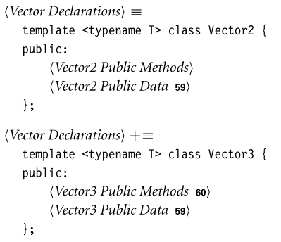
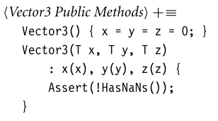
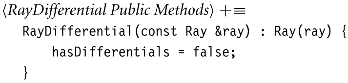
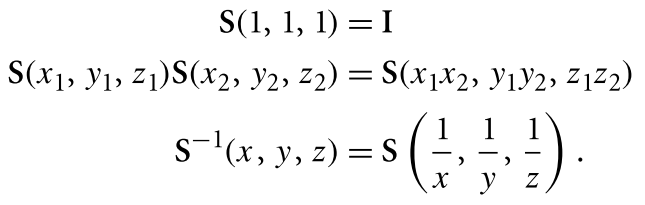

# 几何和变换

本节主要讲组成系统的基本元：点、向量、射线。主要文件是`core/geometry`和`core/transform`。


## 1. 坐标系统

在一般的n维情况下，坐标系的原点$p_o$及其`n`个**线性无关的基向量**定义了一个n维的**仿射空间**。

根据z轴的指向，坐标系可以分为**左手坐标系**和**右手坐标系**。PBRT使用的是左手坐标系。


## 2. 向量




通过了索引的操作：


为了方便起见，许多广泛使用的**vector类型**都被赋予了`typedef`，这样它们在其他地方的代码中就有了更简洁的名称。


构造函数，需要判断元素是否为**浮点数**。




关于其它重载运算符：

```c++
Vector3<T> operator+(const Vector3<T> &v) const {
    DCHECK(!v.HasNaNs());
    return Vector3(x + v.x, y + v.y, z + v.z);
}
Vector3<T> &operator+=(const Vector3<T> &v) {
    DCHECK(!v.HasNaNs());
    x += v.x;
    y += v.y;
    z += v.z;
    return *this;
}
template <typename U>
Vector3<T> &operator*=(U s) {
    DCHECK(!isNaN(s));
    x *= s;
    y *= s;
    z *= s;
    return *this;
}
template <typename U>
Vector3<T> operator/(U f) const {
    CHECK_NE(f, 0);
    Float inv = (Float)1 / f;
    return Vector3<T>(x * inv, y * inv, z * inv);
}
```

然后是向量的两个重要方法：**点乘**和**叉乘**。其中，对于叉乘：


```c++
template <typename T>
inline T Dot(const Vector3<T> &v1, const Vector3<T> &v2) {
    DCHECK(!v1.HasNaNs() && !v2.HasNaNs());
    return v1.x * v2.x + v1.y * v2.y + v1.z * v2.z;
}

template <typename T>
inline Vector3<T> Cross(const Vector3<T> &v1, const Vector3<T> &v2) {
    DCHECK(!v1.HasNaNs() && !v2.HasNaNs());
    double v1x = v1.x, v1y = v1.y, v1z = v1.z;
    double v2x = v2.x, v2y = v2.y, v2z = v2.z;
    return Vector3<T>((v1y * v2z) - (v1z * v2y), (v1z * v2x) - (v1x * v2z),
                      (v1x * v2y) - (v1y * v2x));
}
```

向量的归一化：


向量的重排：


还提供了一个方法来构造**坐标系**，需要传入一个已经归一化的向量：


## 3. 点

和向量比较相似。对于减法，需要和向量进行配合：


线性插值：


关于浮点的一些操作：


## 4. 法线

和向量很相似，但它和具体表面有关，在很多地方都表现和向量不同。


## 5. 射线

组成：代表原点的`Point3f`和方向的`Vector3f`。


一般来说，会约定最大标量值：


同时还有包含射线起点的==材质==：（将在第十一章进行介绍）


构造函数：


通过设定t值，获取射线上的某个点：


### 射线微分

为了针对纹理更好的抗锯齿，设计了射线类的子类`RayDifferential`，包含了关于**两条辅助射线**的额外信息。这两条辅助射线是`film plane`上主射线在`x,y`方向上的偏移。


构造函数最初将`hasDifferentials`设置为`false`，因为相邻的射线是未知的。



第一章的光追中使用的`ScaleDifferentials`方法：


## 6. 包围盒


PBRT使用`axis-aligned bounding boxes`（==AABBs==），盒子的边缘相互垂直并与**坐标系轴**对齐。这里，我们使用两点表示包围盒（对角线的两个端点）。


通过用最大和最小的表示数初始化两个点，任何涉及空框的操作（例如`Union()`）都会产生正确的结果：


如果调用者通过两个点来定义方框，构造函数需要找到它们组件的最小值和最大值：


`Corner()`方法的作用是：返回边框的8个角中的一个的坐标。


`Union`方法根据传入的一个点，返回一个新的包围盒（==并集==）：


`Intersect()`方法返回==交集包围盒==：


一些范围判断函数具体见书P 79。

`Expand()`方法来扩展包围盒：


`Diagonal()`方法返回==对角向量==：


其它方法：`SurfaceArea()`、`Volume()`、`MaximumExtent()`、`Lerp()`


## 7. 变换

### 齐次坐标

对于点，可以表示为如下内积：


对于向量，可以表示如下内积：


三个$s_i$和一个`o或1`组成==齐次坐标==，齐次表示的第四个坐标有时称为**权值**，对于点来说，这个值可以是任何标量。将==齐次点==转化为**普通点**，需要将前三个分量除以权重。


我们将利用这些事实，来了解一个**变换矩阵**如何描述一个坐标系中的点和向量映射到另一个坐标系。考虑如下矩阵：


直接读取矩阵的列显示了基向量和当前坐标系的原点是如何通过矩阵进行转换：


一般来说，通过描述基是如何变换的，我们知道任何点或向量是如何被变换的。因为当前坐标系中的点和向量是用当前坐标系的坐标系表示的，直接对它们进行变换就等于对当前坐标系的基进行变换，然后在变换后的基中找到它们的坐标。


### 基本操作

在变换中对两个矩阵进行转置，以计算新的变换很有用


### 位移

位移有几个基本性质：


### 缩放




测试==变换中是否有缩放项==是很有用的；一个简单的方法是变换三个坐标轴，看看它们的长度是否有明显的不同。

### 轴旋转


对于左手坐标系，绕x轴旋转的矩阵如下：


### 自由旋转和Look-At变换

具体见书 P91。


## 8. 应用变换

大致形式如下：


和向量不同，==法线的变换是个特殊情况==，如下：


但我们可以基于$n\cdot t=n^T\cdot t=0$，然后对于一般的的变换矩阵$M$和我们需要知道的、适用于法线的变换矩阵$S$，可以有如下推断：


由于$n\cdot t=n^T\cdot t=0$，所以$S^TM=I$，$S^T=M^{-1}$，$S=(M^{-1})^T$。总结来说，==对于法线的变换，我们需要对一般的变换矩阵求逆，然后求转置==。


### 其它操作


## 9. 动画变换

pbrt支持场景中的摄像机和几何原语的==关键帧矩阵动画==。对于这种动画，难题是**帧与帧之前的插值问题**（两者的路径可能有无数个）。但这个问题的解决不是很困难，由于两个原因：

首先，在像==pbrt==这样的渲染器中，我们通常有一个**相机快门开启时的关键帧矩阵**，和一个**快门关闭时的关键帧矩阵**；我们只需要在单个图像的时间内对两者进行插值，


其次，在基于物理的渲染器中，我们需要**插值矩阵对**的时间越长，**虚拟相机快门**打开的时间就越长，最终图像中的动态模糊就会越多；增加的运动模糊经常隐藏插值的错误。

对关键帧矩阵定义的转换进行插值的==最直接的方法==——**直接插值矩阵的各个组件**——并不是一个好方法，因为它通常会导致意想不到的和不期望的结果。

pbrt中用于变换插值的方法是基于==矩阵分解==——给出任意的变换矩阵，将其分解为尺度(S)、旋转(R)、平移(T)变换的串联：
$$
M=SRT
$$
每一个分量都是独立插值的，然后通过将三个结果矩阵相乘得到**复合内插矩阵**。对于变换和缩放，可以直接对其各个成员进行插值。而对于旋转矩阵是更困难的，所以下面我们介绍==四元数==。

### 四元数

$$
q=(x,y,z,w)=w+xi+yj+zk,
$$

一些特点如下：$i^2=j^2=k^2=ijk=-1$，$ij=k$，$ji=-k$。通过将两个任意四元数的定义扩展为实分量和虚分量，可以得到其乘积的表达式：


在旋转中，绕单位轴`v`旋转角度$2\theta$，可以表示为单位四元数：$(v\sin\theta,\cos\theta)$。以下==四元数乘积==等价于对**齐次坐标形式的点p**进行旋转：
$$
p^/=qpq^{-1}
$$
此外，几个旋转四元数的乘积产生另一个四元数，它等价于按顺序进行旋转。四元数定义于`core/quaternion`