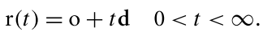
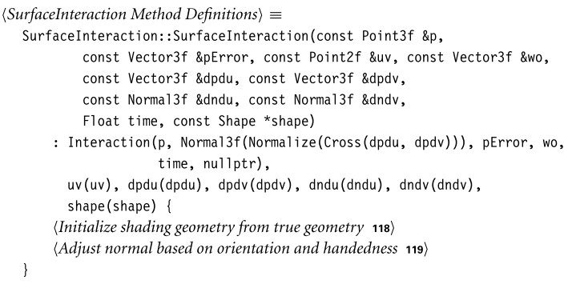

# 几何和变换

本节主要讲组成系统的基本元：点、向量、射线。主要文件是`core/geometry`和`core/transform`。


## 1. 坐标系统

在一般的n维情况下，坐标系的原点$p_o$及其`n`个**线性无关的基向量**定义了一个n维的**仿射空间**。

根据z轴的指向，坐标系可以分为**左手坐标系**和**右手坐标系**。PBRT使用的是左手坐标系。


## 2. 向量


通过了索引的操作：


为了方便起见，许多广泛使用的**vector类型**都被赋予了`typedef`，这样它们在其他地方的代码中就有了更简洁的名称。


构造函数，需要判断元素是否为**浮点数**。


关于其它重载运算符：

```c++
Vector3<T> operator+(const Vector3<T> &v) const {
    DCHECK(!v.HasNaNs());
    return Vector3(x + v.x, y + v.y, z + v.z);
}
Vector3<T> &operator+=(const Vector3<T> &v) {
    DCHECK(!v.HasNaNs());
    x += v.x;
    y += v.y;
    z += v.z;
    return *this;
}
template <typename U>
Vector3<T> &operator*=(U s) {
    DCHECK(!isNaN(s));
    x *= s;
    y *= s;
    z *= s;
    return *this;
}
template <typename U>
Vector3<T> operator/(U f) const {
    CHECK_NE(f, 0);
    Float inv = (Float)1 / f;
    return Vector3<T>(x * inv, y * inv, z * inv);
}
```

然后是向量的两个重要方法：**点乘**和**叉乘**。其中，对于叉乘：


```c++
template <typename T>
inline T Dot(const Vector3<T> &v1, const Vector3<T> &v2) {
    DCHECK(!v1.HasNaNs() && !v2.HasNaNs());
    return v1.x * v2.x + v1.y * v2.y + v1.z * v2.z;
}

template <typename T>
inline Vector3<T> Cross(const Vector3<T> &v1, const Vector3<T> &v2) {
    DCHECK(!v1.HasNaNs() && !v2.HasNaNs());
    double v1x = v1.x, v1y = v1.y, v1z = v1.z;
    double v2x = v2.x, v2y = v2.y, v2z = v2.z;
    return Vector3<T>((v1y * v2z) - (v1z * v2y), (v1z * v2x) - (v1x * v2z),
                      (v1x * v2y) - (v1y * v2x));
}
```

向量的归一化：


向量的重排：


还提供了一个方法来构造**坐标系**，需要传入一个已经归一化的向量：


## 3. 点

和向量比较相似。对于减法，需要和向量进行配合：


线性插值：


关于浮点的一些操作：


## 4. 法线

和向量很相似，但它和具体表面有关，在很多地方都表现和向量不同。


## 5. 射线

组成：代表原点的`Point3f`和方向的`Vector3f`。




一般来说，会约定最大标量值：


同时还有包含射线起点的==材质==：（将在第十一章进行介绍）


构造函数：


通过设定t值，获取射线上的某个点：


### 射线微分

为了针对纹理更好的抗锯齿，设计了射线类的子类`RayDifferential`，包含了关于**两条辅助射线**的额外信息。这两条辅助射线是`film plane`上主射线在`x,y`方向上的偏移。


构造函数最初将`hasDifferentials`设置为`false`，因为相邻的射线是未知的。


第一章的光追中使用的`ScaleDifferentials`方法：


## 6. 包围盒


PBRT使用`axis-aligned bounding boxes`（==AABBs==），盒子的边缘相互垂直并与**坐标系轴**对齐。这里，我们使用两点表示包围盒（对角线的两个端点）。


通过用最大和最小的表示数初始化两个点，任何涉及空框的操作（例如`Union()`）都会产生正确的结果：


如果调用者通过两个点来定义方框，构造函数需要找到它们组件的最小值和最大值：


`Corner()`方法的作用是：返回边框的8个角中的一个的坐标。


`Union`方法根据传入的一个点，返回一个新的包围盒（==并集==）：


`Intersect()`方法返回==交集包围盒==：


一些范围判断函数具体见书P 79。

`Expand()`方法来扩展包围盒：


`Diagonal()`方法返回==对角向量==：


其它方法：`SurfaceArea()`、`Volume()`、`MaximumExtent()`、`Lerp()`


## 7. 变换

### 齐次坐标

对于点，可以表示为如下内积：


对于向量，可以表示如下内积：


三个$s_i$和一个`o或1`组成==齐次坐标==，齐次表示的第四个坐标有时称为**权值**，对于点来说，这个值可以是任何标量。将==齐次点==转化为**普通点**，需要将前三个分量除以权重。


我们将利用这些事实，来了解一个**变换矩阵**如何描述一个坐标系中的点和向量映射到另一个坐标系。考虑如下矩阵：


直接读取矩阵的列显示了基向量和当前坐标系的原点是如何通过矩阵进行转换：


一般来说，通过描述基是如何变换的，我们知道任何点或向量是如何被变换的。因为当前坐标系中的点和向量是用当前坐标系的坐标系表示的，直接对它们进行变换就等于对当前坐标系的基进行变换，然后在变换后的基中找到它们的坐标。


### 基本操作

在变换中对两个矩阵进行转置，以计算新的变换很有用


### 位移

位移有几个基本性质：


### 缩放


测试==变换中是否有缩放项==是很有用的；一个简单的方法是变换三个坐标轴，看看它们的长度是否有明显的不同。

### 轴旋转


对于左手坐标系，绕x轴旋转的矩阵如下：


### 自由旋转和Look-At变换

具体见书 P91。


## 8. 应用变换

大致形式如下：


和向量不同，==法线的变换是个特殊情况==，如下：


但我们可以基于$n\cdot t=n^T\cdot t=0$，然后对于一般的的变换矩阵$M$和我们需要知道的、适用于法线的变换矩阵$S$，可以有如下推断：


由于$n\cdot t=n^T\cdot t=0$，所以$S^TM=I$，$S^T=M^{-1}$，$S=(M^{-1})^T$。总结来说，==对于法线的变换，我们需要对一般的变换矩阵求逆，然后求转置==。


### 其它操作


## 9. 动画变换:star:

pbrt支持场景中的摄像机和几何原语的==关键帧矩阵动画==。对于这种动画，难题是**帧与帧之前的插值问题**（两者的路径可能有无数个）。但这个问题的解决不是很困难，由于两个原因：

首先，在像==pbrt==这样的渲染器中，我们通常有一个**相机快门开启时的关键帧矩阵**，和一个**快门关闭时的关键帧矩阵**；我们只需要在单个图像的时间内对两者进行插值，


其次，在基于物理的渲染器中，我们需要**插值矩阵对**的时间越长，**虚拟相机快门**打开的时间就越长，最终图像中的动态模糊就会越多；增加的运动模糊经常隐藏插值的错误。

对关键帧矩阵定义的转换进行插值的==最直接的方法==——**直接插值矩阵的各个组件**——并不是一个好方法，因为它通常会导致意想不到的和不期望的结果。

pbrt中用于变换插值的方法是基于==矩阵分解==——给出任意的变换矩阵，将其分解为尺度(S)、旋转(R)、平移(T)变换的串联：
$$
M=SRT
$$
每一个分量都是独立插值的，然后通过将三个结果矩阵相乘得到**复合内插矩阵**。对于变换和缩放，可以直接对其各个成员进行插值。而对于旋转矩阵是更困难的，所以下面我们介绍==四元数==。

### 四元数

$$
q=(x,y,z,w)=w+xi+yj+zk,
$$

一些特点如下：$i^2=j^2=k^2=ijk=-1$，$ij=k$，$ji=-k$。通过将两个任意四元数的定义扩展为实分量和虚分量，可以得到其乘积的表达式：


在旋转中，绕单位轴`v`旋转角度$2\theta$，可以表示为单位四元数：$(v\sin\theta,\cos\theta)$。以下==四元数乘积==等价于对**齐次坐标形式的点p**进行旋转：
$$
p^/=qpq^{-1}
$$
此外，几个旋转四元数的乘积产生另一个四元数，它等价于按顺序进行旋转。四元数定义于`core/quaternion`


现在有了四元数，我们需要将其变为矩阵，应用到我们的动画变换中：


可以通过`Quaternion::ToTransform()`来调用上诉操作。四元数类还提供了**接受矩阵参数的构造函数**，具体就不多说了：‘


### 四元数插值


最后一个四元数成员函数是`Slerp()`，使用==球形线性插值==操作两个四元数。这种插值具有两个特点：

+ 插值后的旋转路径具有转矩最小化的特点：在两个旋转之间的路径是旋转空间中**最短的路径**。
+ 这种插值具有恒定的角速度。

具体，插值公式如下：


或者，我们可以按照上图，先求出`q1`的垂直四元数：


然后，就可以以这两者为坐标系，求出任意的插值四元数：


实际编码过程中，如果两个四元数接近平行，为了防止出现数值错误，我们使用常规的线性插值，否则使用这里的球形线性插值。


### 动画插值

到这里为止，我们可以开始实现`AnimatedTransform`类，在其中，我们需要对变换矩阵进行分解：


我们将在这里只处理==仿射变换==，这是我们这里所需要的；==透视变换==通常与这些对象的动画不相关。我们将按照如下顺序对复合矩阵进行分解：
$$
M=TRS
$$


提取平移变换是简单的，因为这个操作单独存在于第四列：


接下来，我们要提取**纯旋转分量**，我们将使用一种叫做==极坐标分解==的技术来做这个。只要下列公式收敛（$M_{i+1}$的值不再变化），就说明得到了：$M_i=R$。


那么，最后的==缩放矩阵==就很好得到了，因为$M=RS$，所以$S=R^{-1}M$。


如果我们提取的两个旋转的点积是负的，那么它们之间的`slerp`不会取两个对应旋转之间的**最短路径**。对其中一个取相反数进行解决。


让我们来实现实际的插值成员函数：


首先，是输入的时间要合法，不能超出范围：


之后就是调用之前的方法：


### 移动边界框

移动边界框是很有用的，例如我们在进行射线相交测试时，可以先判断射线是否和包围盒相交，再进行复杂的插值原语（以检查实际的相交）。`AnimatedTransform::MotionBounds()`进行这个计算。

首先考虑两个简单情况：1、关键帧相等（可以视为静止）。2、仅包含缩放和平移的运动

具体更多，这里暂时跳过。

TODO。


## 10. 相交

`SurfaceInteraction`表示2D平面上一个点的局部信息。其基类是`Interaction`，最常用的一个构造函数如下：


所有相交类都有的成员：一个点和一个关联的时间：


### 表面相交类

==表面相交类==还存储由表面参数化得到的`(u, v)坐标`，以及点的参数偏导数——` ∂p/∂u`和`∂p/∂v`。


还存储了这个点位于的`Shape`，以及法线的偏导数：


最常用的==构造函数==如下：



`SurfaceInteraction`存储了**表面法线的第二个实例**和**各种偏导数**来表示这些量可能的扰动值，可以通过**凹凸贴图**或**顶点法线的插值**来生成。


`shading`几何值在构造函数中初始化，以匹配原始的表面几何。如果存在`shading`几何，它通常在SurfaceInteraction构造函数运行后一段时间才会被计算。`SetShadingGeometry()`将很快被定义，用于更新`shading`几何。


由于我们只渲染封闭几何体的`front face`，所以我们需要检查法线的朝向，让其指向`shape`外部。然而，还有一个因素影响着法线的方向，在这里也必须考虑到：如果物体的坐标系由**默认的左手坐标系**转换到**右手坐标系**，我们需要更改法线的朝向。

为了了解为什么会这样，考虑一个尺度矩阵`S(1,1，−1)`。有如下公式：


如果满足这两个条件中的一个，法线的方向就会被交换；如果两者都满足，它们的影响就会抵消。


当一个`shading coordinate frame`被计算时，`SurfaceInteraction`通过它的`SetShadingGeometry()`方法被更新


和初始化时相似，先叉乘计算，然后更具朝向和坐标系进行翻转，最后根据用户传入的参数，决定在需要时应该翻转哪个


我们将添加==Transform方法==，来转换`SurfaceInteractions`。大多数成员都可以直接转化或复制，但考虑到 pbrt 在计算交点时使用的**约束浮点误差的方法**，转化 `p` 和 `pError `成员变量需要特别注意。在==第3.9节==讨论**浮点舍入误差**时，定义了处理这个问题的代码。


