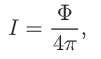
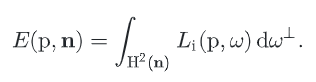
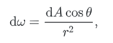

# 颜色和辐射度学

在本章中，我们将介绍`4`个描述**电磁辐射**的关键量：通量`flux`、强度`intensity`、辐照度`irradiance`和辐射度`radiance`。这些辐射量都由它们的==光谱功率分布==（`SPD`）描述：**波长的分布函数**，描述每个波长上的光量。

## 1. 光谱表示

现实世界对象的`spd`可能非常复杂；下图为**荧光灯发射**的光谱分布图和**柠檬皮反射率**的光谱分布图。使用`SPDs`进行计算的渲染器需要一种紧凑、高效和准确的方法来表示这样的函数。在实践中，需要在这些品质之间进行一些权衡。


研究这些问题的==一般框架==可以建立在寻找代表`spd`的良好**基函数**的问题上。**基函数背后的思想**是将可能无限维空间的**SPD函数**映射到系**数的低维空间**，$c_i\in R$。例如，一个普通的基函数就是常函数，$B(\lambda)=1$。任意的`SPD`在这个基中可以用一个等于其平均值的系数$c$来表示，因此它的近似值为：$cB(\lambda)=c$。

本章中，我们将介绍两种可以用于**pbrt**中光谱的表示方法。==RGBSpectrum==，它遵循了典型的计算机图形学的做法，用代表红、绿、蓝三色混合的系数来表示SPD；==SampledSpectrum==，它将SPD表示为**一组波长范围内的点样本**。

### 光谱类型

在整个==pbrt==中，我们一直小心翼翼地用**频谱类型**来实现所有涉及`SPD`的计算，使用一组特定的内置运算符（加法、乘法等）。**频谱类型**隐藏了所使用的**特定频谱表示**的细节，因此改变系统的这个细节只需要改变频谱的实现，其他代码可以保持不变。频谱类型的实现在文件`core/spectrum.h`和`core/spectrum.cpp`中。

在pbrt中，通过文件`core/pbrt.h`中的`typedef`来选择使用哪种频谱表示法，默认情况下，pbrt使用更有效但不太准确的`RGB表示法`

```c++
<<Global Forward Declarations>>= 
typedef RGBSpectrum Spectrum;
// typedef SampledSpectrum Spectrum;
```

我们在编写系统的时候，并没有考虑到在运行时选择使用哪种`Spectrum`实现；如果要切换到不同的表示方式，整个系统必须重新编译。这种设计的一个好处是，许多不同的Spectrum方法可以被编译器==内联==为短函数来实现，而不是作为独立的函数，必须通过相对缓慢的==虚拟方法调用机制==来调用。**内联这样经常使用的短函数可以给性能带来很大的提升**。第二个优点是，系统中持有**频谱类型实例**的结构可以直接持有它们，而不需要根据运行时选择的频谱表示方式**动态分配**它们。

### CoefficientSpectrum实现

本章实现的两种表示都基于**存储固定数量的SPD样本**。因此，我们将从定义==CoefficientSpectrum模板类==开始，它将一个光谱表示为**nSpectrumSamples模板参数**给出的特定数量的样本。`RGBSpectrum`和`SampledSpectrum`都是通过继承它实现的。

```c++
<<Spectrum Declarations>>= 
    template <int nSpectrumSamples> class CoefficientSpectrum {
    public:
        <<CoefficientSpectrum Public Methods>> 
        <<CoefficientSpectrum Public Data>> 
    protected:
        <<CoefficientSpectrum Protected Data>> 
    };
```

提供了一个构造函数：它初始化所有波长的频谱，并使其具有`constant`值。

```c++
<<CoefficientSpectrum Public Methods>>= 
    CoefficientSpectrum(Float v = 0.f) { 
        for (int i = 0; i < nSpectrumSamples; ++i)
            c[i] = v;
    }
<<CoefficientSpectrum Protected Data>>= 
	Float c[nSpectrumSamples];
```

需要对**频谱对象**进行各种各样的**算术运算**。首先，我们定义了添加**光谱分布对**的运算。

```c++
<<CoefficientSpectrum Public Methods>>+=  
    CoefficientSpectrum &operator+=(const CoefficientSpectrum &s2) {
        for (int i = 0; i < nSpectrumSamples; ++i)
            c[i] += s2.c[i];
        return *this;
    }
<<CoefficientSpectrum Public Methods>>+=  
    CoefficientSpectrum operator+(const CoefficientSpectrum &s2) const {
        CoefficientSpectrum ret = *this;
        for (int i = 0; i < nSpectrumSamples; ++i)
            ret.c[i] += s2.c[i];
        return ret;
    }
```

类似地，减法、乘法、除法和一元否定都按此方式定义。这些方法与已经展示的方法非常相似，所以我们在这里不包括它们。pbrt还提供了相等性和不相等性检验，这里也不包括。

知道**处处为零的SPD**通常是很有用的。例如，如果一个表面的反射率为零，光传输程序可以避免计算，因为反射光线的贡献最终会乘以零，因此不需要追踪。

```c++
<<CoefficientSpectrum Public Methods>>+=  
    bool IsBlack() const {
        for (int i = 0; i < nSpectrumSamples; ++i)
            if (c[i] != 0.) return false;
        return true;
    }
```

一些更高深的运算：

```c++
<<CoefficientSpectrum Public Methods>>+=  
    friend CoefficientSpectrum Sqrt(const CoefficientSpectrum &s) { 
        CoefficientSpectrum ret;
        for (int i = 0; i < nSpectrumSamples; ++i)
            ret.c[i] = std::sqrt(s.c[i]);
        return ret;
    }
```

在两个`spd`之间使用一个参数$t$进行线性插值是非常有用的。

```c++
<<Spectrum Inline Functions>>= 
inline Spectrum Lerp(Float t, const Spectrum &s1, const Spectrum &s2) {
    return (1 - t) * s1 + t * s2;
}
```

最后，我们提供了一个调试例程，用于检查SPD的样本值中是否有任何一个是`not-a-number`（`NaN浮点值`）。这种情况可能会因为意外的除以`0`而发生；整个系统中的`Assert()`使用这个方法来捕捉这种情况的发生地点。

```c++
<<CoefficientSpectrum Public Methods>>+=  
    bool HasNaNs() const {
        for (int i = 0; i < nSpectrumSamples; ++i)
            if (std::isnan(c[i])) return true;
        return false;
    }
```

提供了一个公共常量nSamples，它给出了用于表示SPD的样本数量，以及一个用于访问单个样本值的operator[]方法。

```c++
<<CoefficientSpectrum Public Data>>= 
	static const int nSamples = nSpectrumSamples;
<<CoefficientSpectrum Public Methods>>+= 
    Float &operator[](int i) {
        return c[i];
    }
```

这个**采样访问器**的存在意味着隐含的假设，即**频谱表示**是==一组线性缩放固定基函数的系数==。例如，如果一个频谱实现将`SPD`表示为**高斯和**，其中系数$c_i$交替缩放高斯并设置其宽度。


## 2. SampledSpectrum类

`SampledSpectrum`表示在起始波长和结束波长之间==均匀间隔采样的SPD==。波长范围从`400 nm`到`700 nm`这是HSV最敏感的视觉光谱范围。样本的数量，==60==，通常足够准确地代表**复杂的SPDs渲染**。

```c++
<<Spectrum Utility Declarations>>= 
    static const int sampledLambdaStart = 400;
    static const int sampledLambdaEnd = 700;
    static const int nSpectralSamples = 60;
```

```c++
<<Spectrum Declarations>>+=  
    class SampledSpectrum : public CoefficientSpectrum<nSpectralSamples> {
    public:
        <<SampledSpectrum Public Methods>> 
    private:
        <<SampledSpectrum Private Data>> 
    };
```

```c++
<<SampledSpectrum Public Methods>>= 
	SampledSpectrum(Float v = 0.f) : CoefficientSpectrum(v) { }
```

我们经常得到一组$(\lambda_i,v_i)$集作为光谱数据。`FromSampled()`方法取==给定波长λ==下的**SPD样本值v**的数组，并用它们定义一个分段线性函数来表示`SPD`。对于`SampledSpectrum`中的每个SPD样本，使用下面定义的`AverageSpectrumSamples()`效用函数来计算分段线性函数在每个SPD样本所负责的波长范围内的平均值。

```c++
<SampledSpectrum Public Methods>>+=  
    static SampledSpectrum FromSampled(const Float *lambda,
                                       const Float *v, int n) {
        <<Sort samples if unordered, use sorted for returned spectrum>> 
        SampledSpectrum r;
        for (int i = 0; i < nSpectralSamples; ++i) {
            <<Compute average value of given SPD over th sample’s range>> 
        }
        return r;
    }
```

`AverageSpectrumSamples()`函数要求按**波长**对值$(\lambda_i,v_i)$进行**排序**。函数的作用是：检查它们是否存在；如果没有，`SortSpectrumSamples()`对它们进行排序。这里我们不包括这两个函数的实现，因为它们很简单。

```c++
<<Sort samples if unordered, use sorted for returned spectrum>>= 
    if (!SpectrumSamplesSorted(lambda, v, n)) {
        std::vector<Float> slambda(&lambda[0], &lambda[n]);
        std::vector<Float> sv(&v[0], &v[n]);
        SortSpectrumSamples(&slambda[0], &sv[0], n);
        return FromSampled(&slambda[0], &sv[0], n);
    }
```

为了计算第`i`个光谱样本的值，我们计算它负责`lambda0`到`lambda1`的**波长范围**，并使用`AverageSpectrumSamples()`函数来计算给定分段==线性SPD==在该范围内的平均值。这是**采样**和**重构**的一个一维实例，这个主题将在第7章中进行更详细的讨论。

```c++
<<Compute average value of given SPD over th sample’s range>>= 
    Float lambda0 = Lerp(Float(i) / Float(nSpectralSamples), 
                         sampledLambdaStart, sampledLambdaEnd);
    Float lambda1 = Lerp(Float(i + 1) / Float(nSpectralSamples), 
                         sampledLambdaStart, sampledLambdaEnd);
    r.c[i] = AverageSpectrumSamples(lambda, v, n, lambda0, lambda1);
```


```c++
<<Spectrum Method Definitions>>= 
    Float AverageSpectrumSamples(const Float *lambda, const Float *vals,
            int n, Float lambdaStart, Float lambdaEnd) {
        <<Handle cases with out-of-bounds range or single sample only>> 
        Float sum = 0;  
        <<Add contributions of constant segments before/after samples>> 
        <<Advance to first relevant wavelength segment>> 
        <<Loop over wavelength sample segments and add contributions>> 
        return sum / (lambdaEnd - lambdaStart);
    }
```

该函数首先**检查和处理**要平均的波长范围超出所提供的波长范围的边缘情况，或者只有一个样本的情况，这种情况下的平均值是很容易计算的。

```c++
<<Handle cases with out-of-bounds range or single sample only>>= 
    if (lambdaEnd   <= lambda[0])     return vals[0];
    if (lambdaStart >= lambda[n - 1]) return vals[n - 1];
    if (n == 1) return vals[0];
```

处理完这些情况后，下一步是检查**要平均的部分范围**是否超过了第一个和/或最后一个样本值。如果是这样，我们累积常数段(`s`)的贡献，按**超出范围的波长范围**缩放。

```c++
<<Add contributions of constant segments before/after samples>>= 
    if (lambdaStart < lambda[0])
        sum += vals[0] * (lambda[0] - lambdaStart);
    if (lambdaEnd > lambda[n-1])
        sum += vals[n - 1] * (lambdaEnd - lambda[n - 1]);
```

跳过那些不在**HSV可见范围**内的波段：

```c++
int i = 0;
while (lambdaStart > lambda[i + 1]) ++i;
```

下面的循环对**平均范围重叠**的每一个线性段进行迭代，对于每一个线性段，它通过对这两个点的函数值进行平均，计算出波长范围 `segLambdaStart` 到 `segLambdaEnd` 的平均值。这些值又由`interp()`计算，`interp()`是一个在给定波长的两个端点之间线性插值的**lambda函数**。

```c++
<<Loop over wavelength sample segments and add contributions>>= 
    auto interp = [lambda, vals](Float w, int i) {
        return Lerp((w - lambda[i]) / (lambda[i + 1] - lambda[i]),
                    vals[i], vals[i + 1]);
    };
    for (; i+1 < n && lambdaEnd >= lambda[i]; ++i) {
        Float segLambdaStart = std::max(lambdaStart, lambda[i]);
        Float segLambdaEnd =   std::min(lambdaEnd,   lambda[i + 1]);
        sum += 0.5 * (interp(segLambdaStart, i) + interp(segLambdaEnd, i)) *
            (segLambdaEnd - segLambdaStart);
    }
```

### XYZ Color

**HSV**的一个显著特性：仅用三个浮点数就可以表示人类感知的颜色。色彩感知的==三刺激理论==认为，所有可见的**spd**都可以用三个值$(x_{\lambda},y_{\lambda},z_{\lambda})$准确地代表。给定一个==发射型SPD==$S(\lambda)$，可以通过如下公式获得这三个值：{**5.1**}


这些曲线是由**国际委员会CIE标准机构**在一系列人体试验后确定的，如下图所示。这些**匹配曲线**与人类视网膜上三种**颜色敏感锥**的反应大体相似。值得注意的是，具有==本质上不同分布的spd==可能有非常相似的$x_{\lambda},y_{\lambda},z_{\lambda}$值。对于人类观察者来说，这些==spd==在视觉上看起来是一样的。这样的**光谱对**被称为==异向子==` metamers`。


这让我们想到了一个关于**SPD的表示**的微妙之处。虽然==XYZ==可以很好表示给定`SPD`，但它并不是好的光谱计算的**基函数**。例如，尽管XYZ值可以描述**柠檬皮**或**荧光灯**的感知颜色，但它们各自的**XYZ值的乘积**很可能会给出一个明显不同的XYZ颜色，而不是通过乘以**更精确地表示它们的SPD**，然后计算XYZ值。（Redo）

==pbrt==提供标准$X_{\lambda},Y_{\lambda},Z_{\lambda}$响应曲线，每隔`1 nm`采样，从`360 nm`到`830 nm`。以下数组中第`i`个样本的波长由`CIE_lambda`的第`i`个元素给出；通过这种方式显式表示**样本的波长**，可以很容易地将**XYZ样本**传递到`AverageSpectrumSamples()`等函数中，这些函数以波长数组作为参数。

```c++
<<Spectral Data Declarations>>= 
    static const int nCIESamples = 471;
    extern const Float CIE_X[nCIESamples];
    extern const Float CIE_Y[nCIESamples];
    extern const Float CIE_Z[nCIESamples];
    extern const Float CIE_lambda[nCIESamples];
```

`SampledSpectrum`使用这些样本来计算其光谱表示中的==XYZ匹配曲线==。

```c++
<<SampledSpectrum Private Data>>= 
	static SampledSpectrum X, Y, Z;
```

**SampledSpectrum XYZ**匹配曲线在`SampledSpectrum::Init()`方法中计算，该方法在系统启动时由A.2节中定义的`pbrtInit()`函数调用。

```c++
<<SampledSpectrum Public Methods>>+=  
    static void Init() {
        <<Compute XYZ matching functions for SampledSpectrum>> 
        <<Compute RGB to spectrum functions for SampledSpectrum>> 
    }
<<General pbrt Initialization>>= 
    SampledSpectrum::Init();
```

给定了`SampledSpectrum`的波长范围和样本数量，计算**每个样本的匹配函数值**只是计算样本的**波长范围**和使用`average espectrumsamples()`例程的问题。

```c++
<<Compute XYZ matching functions for SampledSpectrum>>= 
    for (int i = 0; i < nSpectralSamples; ++i) {
        Float wl0 = Lerp(Float(i) / Float(nSpectralSamples), 
                         sampledLambdaStart, sampledLambdaEnd);
        Float wl1 = Lerp(Float(i + 1) / Float(nSpectralSamples), 
                         sampledLambdaStart, sampledLambdaEnd);
        X.c[i] = AverageSpectrumSamples(CIE_lambda, CIE_X, nCIESamples,
                                        wl0, wl1);
        Y.c[i] = AverageSpectrumSamples(CIE_lambda, CIE_Y, nCIESamples,
                                        wl0, wl1);
        Z.c[i] = AverageSpectrumSamples(CIE_lambda, CIE_Z, nCIESamples,
                                        wl0, wl1);
    }
```

pbrt中的所有**频谱实现**必须提供一种方法，将它们的==SPD==转换为系数$(x_{\lambda},y_{\lambda},z_{\lambda})$。例如，在更新图像像素的过程中会调用此方法。当一种光谱代表了来自相机的光线，`Film`将**SPD**转换为**XYZ系数**，这是最终将它们转换为**RGB值**的第一步。

为了计算==XYZ系数==，`SampledSpectrum`用**黎曼和**计算方程(**5.1**)中的积分:


```c++
<<SampledSpectrum Public Methods>>+=  
    void ToXYZ(Float xyz[3]) const {
        xyz[0] = xyz[1] = xyz[2] = 0.f;
        for (int i = 0; i < nSpectralSamples; ++i) {
            xyz[0] += X.c[i] * c[i];
            xyz[1] += Y.c[i] * c[i];
            xyz[2] += Z.c[i] * c[i];
        }
        Float scale = Float(sampledLambdaEnd - sampledLambdaStart) /
                      Float(CIE_Y_integral * nSpectralSamples);
        xyz[0] *= scale;
        xyz[1] *= scale;
        xyz[2] *= scale;
    }
```

**XYZ颜色**的系数`y`与==亮度==密切相关，**亮度衡量一种颜色的感知亮度**。亮度在**5.4.3**节中有更详细的描述。

```c++
<<SampledSpectrum Public Methods>>+=  
    Float y() const { 
        Float yy = 0.f;
        for (int i = 0; i < nSpectralSamples; ++i)
            yy += Y.c[i] * c[i];
        return yy * Float(sampledLambdaEnd - sampledLambdaStart) /
            Float(nSpectralSamples);
    }
```

### RGB Color

当我们在显示器上显示**RGB颜色**时，实际显示的光谱基本上是由**三条光谱响应曲线**的==加权和==决定的，三条光谱响应曲线分别代表**红、绿、蓝**，它们是由显示器的荧光粉、LED或LCD元素或等离子细胞发出的。下图绘制了LED显示器和LCD显示器发出的**红、绿、蓝分布**。


使用用户提供的**RGB值**来描述特定的颜色，实际上只有在了解他们选择RGB值时，**所使用的显示器的特性**的情况下，才有意义。（不知道我用啥显示器，无法准确描述RGB所代表的SPD）

给定一个**SPD**的表示$(x_{\lambda},y_{\lambda},z_{\lambda})$，我们可以将其转换为相应的==RGB系数==。


```c++
<<Spectrum Utility Declarations>>+=  
    inline void XYZToRGB(const Float xyz[3], Float rgb[3]) {
        rgb[0] =  3.240479f*xyz[0] - 1.537150f*xyz[1] - 0.498535f*xyz[2];
        rgb[1] = -0.969256f*xyz[0] + 1.875991f*xyz[1] + 0.041556f*xyz[2];
        rgb[2] =  0.055648f*xyz[0] - 0.204043f*xyz[1] + 1.057311f*xyz[2];
    }
```

```c++
<<Spectrum Utility Declarations>>+=  
    inline void RGBToXYZ(const Float rgb[3], Float xyz[3]) {
        xyz[0] = 0.412453f*rgb[0] + 0.357580f*rgb[1] + 0.180423f*rgb[2];
        xyz[1] = 0.212671f*rgb[0] + 0.715160f*rgb[1] + 0.072169f*rgb[2];
        xyz[2] = 0.019334f*rgb[0] + 0.119193f*rgb[1] + 0.950227f*rgb[2];
    }
```

```c++
<<SampledSpectrum Public Methods>>+=  
    void ToRGB(Float rgb[3]) const { 
        Float xyz[3];
        ToXYZ(xyz);
        XYZToRGB(xyz, rgb);
    }
```

也可以使用`ToRGBSpectrum()`方法轻松创建`RGBSpectrum`。

```c++
<<SampledSpectrum Public Methods>>+=  
	RGBSpectrum ToRGBSpectrum() const;
```

从RGB或XYZ值转换到SPD是困难的，之前我们说过，一个RGB值可以对应多个SPD。因此**转换函数**具有许多理想的条件：

- 如果所有的RGB系数都有相同的值，那么最终的**SPD**应该是==常数==。
- 一般来说，我们希望计算出的**SPD**是平滑的。大多数现实世界的物体有相对平滑的光谱。

在这里，我们实现了Smits(1999)提出的==一种将RGB转换为SPD的方法==，试图实现上述目标。这种方法是基于这样的观察，即**一个好的开始**是：计算红、绿、蓝三色的**单个SPD**，这些SPD是平滑的，并且可以用给定的RGB系数计算它们的加权和，然后再转换回RGB，从而得到一个接近原始RGB系数的结果。他通过数值优化程序找到了这样的光谱。

Smits注意到，这个基本方法还可以做**两个额外的改进**。首先，与其用**计算出的红、绿、蓝SPDs的和**来表示**恒定的光谱**，它们的和并不是完全恒定的，不如用**恒定的SPDs**来表示恒定的光谱。其次，像黄色（红绿混合）这样由两种原色混合而成的颜色的混合，用它们自己预先计算的平滑spd值比用两种相应原色的spd值之和更好地表示。

以下数组存储**符合这些标准的spd**，其样品波长为`RGB2Speclambda[]`

```c++
<<Spectral Data Declarations>>+=  
    static const int nRGB2SpectSamples = 32;
    extern const Float RGB2SpectLambda[nRGB2SpectSamples];
    extern const Float RGBRefl2SpectWhite[nRGB2SpectSamples];
    extern const Float RGBRefl2SpectCyan[nRGB2SpectSamples];
    extern const Float RGBRefl2SpectMagenta[nRGB2SpectSamples];
    extern const Float RGBRefl2SpectYellow[nRGB2SpectSamples];
    extern const Float RGBRefl2SpectRed[nRGB2SpectSamples];
    extern const Float RGBRefl2SpectGreen[nRGB2SpectSamples];
    extern const Float RGBRefl2SpectBlue[nRGB2SpectSamples];
```

如果一个**给定的RGB颜色**描述**来自光源的照度**，如果使用代表性照明源的**光谱功率分布**来定义 "白色"，而不是像上面用于**反射率的表格**那样使用一个**恒定的光谱**来计算转换表，则可以获得更好的结果。`RGBIllum2Spect `阵列使用 ==D65 光谱功率分布==，它已被 CIE 标准化，代表正午的阳光。==D65 光源==将在第 12.1.2 节中详细讨论。

```c++
<<Spectral Data Declarations>>+= 
    extern const Float RGBIllum2SpectWhite[nRGB2SpectSamples];
    extern const Float RGBIllum2SpectCyan[nRGB2SpectSamples];
    extern const Float RGBIllum2SpectMagenta[nRGB2SpectSamples];
    extern const Float RGBIllum2SpectYellow[nRGB2SpectSamples];
    extern const Float RGBIllum2SpectRed[nRGB2SpectSamples];
    extern const Float RGBIllum2SpectGreen[nRGB2SpectSamples];
    extern const Float RGBIllum2SpectBlue[nRGB2SpectSamples];
```

从`SampledSpectrum::Init()`中调用的片段<<Compute RGB to spectrum functions for SampledSpectrum>>并不包含在这里；它通过使用`AverageSpectrumSamples()`函数对`RGBRefl2Spect`和`RGBIllum2Spect`分布重新采样，来初始化以下`SampledSpectrum`值。

```c++
<<SampledSpectrum Private Data>>+=  
    static SampledSpectrum rgbRefl2SpectWhite, rgbRefl2SpectCyan;
    static SampledSpectrum rgbRefl2SpectMagenta, rgbRefl2SpectYellow;
    static SampledSpectrum rgbRefl2SpectRed, rgbRefl2SpectGreen;
    static SampledSpectrum rgbRefl2SpectBlue;
<<SampledSpectrum Private Data>>+= 
    static SampledSpectrum rgbIllum2SpectWhite, rgbIllum2SpectCyan;
    static SampledSpectrum rgbIllum2SpectMagenta, rgbIllum2SpectYellow;
    static SampledSpectrum rgbIllum2SpectRed, rgbIllum2SpectGreen;
    static SampledSpectrum rgbIllum2SpectBlue;
```

`SampledSpectrum::FromRGB()`方法从**给定的RGB值**转换为**完整的SPD**。除了RGB值之外，它还取一个**枚举值**，表示RGB值是代表**表面反射率**还是**光源**；相应的`rgbIllum2Spect`或`rgbRefl2Spect`值被用于转换。

```c++
<<Spectrum Utility Declarations>>+= 
	enum class SpectrumType { Reflectance, Illuminant };

<<Spectrum Method Definitions>>+=  
    SampledSpectrum SampledSpectrum::FromRGB(const Float rgb[3],
                                             SpectrumType type) {
        SampledSpectrum r;
        if (type == SpectrumType::Reflectance) {
            <<Convert reflectance spectrum to RGB>> 
        } else {
            <<Convert illuminant spectrum to RGB>> 
        }
        return r.Clamp();
    }
```

这里我们来展示一下**反射率的转换过程**。对照度的计算是一样的，只是使用的转换值不同。首先，实现时要确定**红、绿、蓝通道**是最小的。

```c++
<<Convert reflectance spectrum to RGB>>= 
    if (rgb[0] <= rgb[1] && rgb[0] <= rgb[2]) {
        <<Compute reflectance SampledSpectrum with rgb[0] as minimum>> 
    } else if (rgb[1] <= rgb[0] && rgb[1] <= rgb[2]) {
        <<Compute reflectance SampledSpectrum with rgb[1] as minimum>> 
    } else {
        <<Compute reflectance SampledSpectrum with rgb[2] as minimum>> 
    }
```

下面是**红色组件**最小的情况下的代码。(绿色和蓝色的情况是类似的，这里不包括在内。)如果红色是最小的，我们知道绿色和蓝色的值大于红色。因此，我们可以通过将==RGBrefl2Specwhite==中的红色分量乘以**白色光谱的值**赋值给**最终的SPD**，从而开始将其转换为返回值。

```c++
<<Compute reflectance SampledSpectrum with rgb[0] as minimum>>= 
r += rgb[0] * rgbRefl2SpectWhite;
if (rgb[1] <= rgb[2]) {
    r += (rgb[1] - rgb[0]) * rgbRefl2SpectCyan;
    r += (rgb[2] - rgb[1]) * rgbRefl2SpectBlue;
} else {
    r += (rgb[2] - rgb[0]) * rgbRefl2SpectCyan;
    r += (rgb[1] - rgb[2]) * rgbRefl2SpectGreen;
}
```

完成这一步后，**剩下的RGB值**是$(0,g-r,b-r)$。该代码依次确定剩下的两个组件中哪个最小。这个值，乘以青色（绿色和蓝色）光谱，加到结果中，剩下的是$(0,g-b,0)$或$(0,0,b-g)$。根据绿色通道或蓝色通道是否非零，**绿色或蓝色SPD**按余数缩放，转换完成。

```c++
<<Compute reflectance SampledSpectrum with rgb[0] as minimum>>= 
    r += rgb[0] * rgbRefl2SpectWhite;
    if (rgb[1] <= rgb[2]) {
        r += (rgb[1] - rgb[0]) * rgbRefl2SpectCyan;
        r += (rgb[2] - rgb[1]) * rgbRefl2SpectBlue;
    } else {
        r += (rgb[2] - rgb[0]) * rgbRefl2SpectCyan;
        r += (rgb[1] - rgb[2]) * rgbRefl2SpectGreen;
    }
```

给定从RGB转换的方法，从XYZ颜色转换是很容易的。我们首先将XYZ转换为RGB，然后使用`FromRGB()`方法。

```c++
<<SampledSpectrum Public Methods>>+= 
    static SampledSpectrum FromXYZ(const Float xyz[3],
            SpectrumType type = SpectrumType::Reflectance) {
        Float rgb[3];
        XYZToRGB(xyz, rgb);
        return FromRGB(rgb, type);
    }
```

最后，我们提供了一个构造函数，它从`RGBSpectrum类`的实例进行转换，同样使用上面的基础结构。

```c++
<<Spectrum Method Definitions>>+=  
SampledSpectrum::SampledSpectrum(const RGBSpectrum &r, SpectrumType t) {
    Float rgb[3];
    r.ToRGB(rgb);
    *this = SampledSpectrum::FromRGB(rgb, t);
}
```


## 3. RGBSpectrum实现

==RGBSpectrum==的实现在这里用红、绿、蓝三色分量的**加权和**来表示**SPD**。回想一下，这种表示方式是不明确的：给定两个不同的计算机显示器，让它们显示相同的RGB值不会导致它们发出相同的SPD。因此，为了让一组RGB值指定一个实际的SPD，我们必须知道它们**所定义的显示器原色**；这一信息通常不会与RGB值一起提供。

不过，RGB表示法还是很方便的：几乎所有的3D建模和设计工具都使用RGB颜色，而且大多数3D内容都是用RGB来指定的。此外，它的计算和存储效率很高，只需要三个浮点值来表示。我们对 `RGBSpectrum `的实现继承自 `CoefficientSpectrum`，指定了三个组件来存储。因此，前面定义的所有算术运算都可以自动用于`RGBSpectrum`。

```c++
<<Spectrum Declarations>>+= 
    class RGBSpectrum : public CoefficientSpectrum<3> {
    public:
        <<RGBSpectrum Public Methods>> 
    };
<<RGBSpectrum Public Methods>>= 
    RGBSpectrum(Float v = 0.f) : CoefficientSpectrum<3>(v) { }
    RGBSpectrum(const CoefficientSpectrum<3> &v) 
        : CoefficientSpectrum<3>(v) { }
```

除了基本的算术运算符之外，`RGBSpectrum`还需要提供转换为`XYZ`和`RGB`表示的方法。对于`RGBSpectrum`来说，这些方法都是微不足道的。请注意，`FromRGB()`需要一个像本方法的`SampledSpectrum实例`一样的`SpectrumType参数`。虽然在这里没有使用，但这两个类的FromRGB()方法必须有匹配的签名，以便系统的其余部分可以一致地调用它们，无论使用的是哪种光谱表示法

```c++
<<RGBSpectrum Public Methods>>+=  
    static RGBSpectrum FromRGB(const Float rgb[3],
            SpectrumType type = SpectrumType::Reflectance) {
        RGBSpectrum s;
        s.c[0] = rgb[0];
        s.c[1] = rgb[1];
        s.c[2] = rgb[2];
        return s;
    }
```

```c++
<<RGBSpectrum Public Methods>>+=  
    void ToRGB(Float *rgb) const {
        rgb[0] = c[0];
        rgb[1] = c[1];
        rgb[2] = c[2];
    }
```

```c++
<<RGBSpectrum Public Methods>>+=  
    const RGBSpectrum &ToRGBSpectrum() const {
        return *this;
    }
```

要从任意**采样 SPD** 创建 **RGB 频谱**，`FromSampled() `将频谱转换为` XYZ`，然后再转换为 `RGB`。它使用`InterpolateSpectrumSamples()`实用函数（ utility function）以`1nm`为步长评估CIE匹配函数值所在的每个波长的片状线性采样光谱。然后，它使用这个值来计算黎曼和，以近似XYZ积分。

```c++
<<RGBSpectrum Public Methods>>+= 
static RGBSpectrum FromSampled(const Float *lambda, const Float *v,
                               int n) {
    <<Sort samples if unordered, use sorted for returned spectrum>> 
    Float xyz[3] = { 0, 0, 0 };
    for (int i = 0; i < nCIESamples; ++i) {
        Float val = InterpolateSpectrumSamples(lambda, v, n,
                                               CIE_lambda[i]);
        xyz[0] += val * CIE_X[i];
        xyz[1] += val * CIE_Y[i];
        xyz[2] += val * CIE_Z[i];
    }
    Float scale = Float(CIE_lambda[nCIESamples-1] - CIE_lambda[0]) /
        Float(CIE_Y_integral * nCIESamples);
    xyz[0] *= scale;
    xyz[1] *= scale;
    xyz[2] *= scale;
    return FromXYZ(xyz);    
}
```

`InterpolateSpectrumSamples()`对波长和SPD值$(\lambda_i,v_i)$进行可能**不规律的采样**，并返回**SPD**在给定波长$\lambda$处的值，在bracket $\lambda$的两个采样值之间进行**线性插值**

```c++
<<Spectrum Method Definitions>>+=  
    Float InterpolateSpectrumSamples(const Float *lambda, const Float *vals,
                                     int n, Float l) {
        if (l <= lambda[0])     return vals[0];
        if (l >= lambda[n - 1]) return vals[n - 1];
        int offset = FindInterval(n,
            [&](int index) { return lambda[index] <= l; });
        Float t = (l - lambda[offset]) / (lambda[offset+1] - lambda[offset]);
        return Lerp(t, vals[offset], vals[offset + 1]);
    }
```


## 4. 辐射度学（Radiometry）

==辐射测量学==提供了一套**理念和数学工具**来描述**光的传播和反射**。它构成了本书其余部分将使用的渲染算法的推导基础。有趣的是，辐射测量学最初并不是利用**光的物理学**从第一原理中推导出来的，而是建立在基于**粒子在空间中流动（这种光的抽象）上**。因此，像**光的偏振**这样的效应并不能自然融入这个框架中，后来在辐射度学和==麦克斯韦方程==之间建立了联系，使==辐射度学==有了坚实的物理学基础。

==辐射转移==`Radiative transfer `是对辐射能量转移的**现象学研究**。它基于辐射学原理，在几何光学层面上运行。将**光的波光学模型**中的现象纳入其中并不罕见，但这些结果需要用**辐射传递的基本抽象语言**来表达。

通过这种方式，可以描述**光**与**大小与光的波长大致相同的物体**的相互作用，从而建立像==色散==和==干涉==这样的模型。在更精细的层面上，需要用==量子力学==来描述光与原子的相互作用。幸运的是，直接模拟量子力学原理对于解决计算机图形学中的渲染问题来说是不必要的，因此避免了这种方法的难缠性。

在==pbrt==中，我们假定几何光学是描述**光**和**光散射**的合适模型。这导致了一些关于光的行为的基本假设，这些假设将在整个系统中被隐式地使用：

- **线性**：光学系统的两个输入的综合效应总是等于每个单独输入的效应之和。$f(a+b)=f(a)+f(b)$
- **能量守恒**：当光从**表面**或**参与介质**散射时，散射永远不会产生比它们开始时更多的能量。
- 不极化`No polarization`：忽略**电磁场的极化**；因此，光唯一相关的特性是它按波长分布的特性。
- **没有荧光或磷光**：光线在一个波长上的行为与光线在其他波长或时间上的行为完全无关。与偏振一样，加入这些效应并不难，但它们对系统的实用价值相对较小。
- **稳态**：假定环境中的光已经达到平衡，所以**它的亮度分布不会随着时间而改变**。在现实场景中，这几乎是瞬间发生的，所以它在实践中没有限制。注意，**磷光也违反了稳态假设**。

==采用几何光学模型的最大损失是衍射和干涉效应难以解释。==


### 基本物理量

有四个辐射量是渲染的核心：通量、辐照度、强度和辐射度。所有这些==辐射量在一般情况下都依赖于波长==。在本章的其余部分，我们将不明确这种依赖性，但这一特性是重要的，要牢记。

#### 能量 Energy

我们的出发点是能量，以**焦耳(J)**为单位。照明源发射**光子**，每一个光子都有特定的波长$\lambda$并携带特定的能量。所有的基本辐射量实际上都是测量光子的不同方法。波长$\lambda$的光子携带能量：
$$
Q=\frac{hc}{\lambda}
$$


#### 通量Flux

==辐射通量==，也称为**功率**，是单位时间内通过**表面或空间区域**的**能量总量**。辐射通量可以通过取单位时间内的差分能量的极限来找到：


它的单位是焦耳/秒`(J/s)`，或者更常见的是**瓦(W)**。

光源的总发射量一般用通量来描述。图5.6显示了点光源通过光周围**假想球体**的总能量的通量。注意,通量测量的总量在图5.6的两个领域是相同的。


#### Irradiance and Radiant Exitance

任何**通量**的测量都需要测量光子每次所经过的**面积**。给定一个有限的面积`A`，我们可以定义此面积上的==平均功率密度== $E=\Phi/A$。这个量要么是==辐照度==（E），到达一个表面的**通量的面积密度**，要么是==辐射出度==（M），离开一个表面的通量的面积密度。这些测量的单位是$W/m^2$。

对于上图中的点光源例子，由于外球面表面积较大，**外球面上一点的辐照度小于内球面上一点的辐照度**。特别地，如果点源在各个方向上都照出了相同的`illumination`，那么对于一个具有半径$r$的球体


更一般的定义如下：


==irradiance方程==也可以帮助我们理解==朗伯定律==的起源，该定律说，到达一个表面的光能量与光线方向与表面法线夹角的余弦成正比。


考虑一个具有面积A和通量$\Phi$的光源，照亮一个表面。如果光线直接照在表面上，$A=A_1$：


如果存在角度，$A_2=A/cos\theta$：


#### 立体角和强度 Intensity


为了定义强度，我们首先需要定义==立体角==的概念。**立体角就是平面上的二维角到球面上的角的延伸**。平面角是一个物体相对于某个位置所面对的总角度。考虑点$p$周围的单位圆；如果我们把阴影部分投影到圆上，圆的投影就会覆盖圆的一段长度$s$。$s$的弧长为物体所面对的**角度**。平面角是以弧度`radians`来测量的。


==立体角==将2D单位圆扩展为3D单位球。==总面积$s$是物体所对的立体角==。立体角是用`steradians `(==sr==)来测量的。整个球面对应着一个立体角$4\pi sr$，一个半球对应着一个立体角$2\pi sr$。

现在考虑一个**无限小的光源**发射光子。如果我们把光源集中在**单位球体**内，我们就可以计算出发射功率的==角密度==。强度用`I`表示。它有单位$W/sr$。在整个球面上，我们有



更一般的表示：


==光强==描述了光的方向分布，**但只对点光源有意义**。


#### 辐射度 Radiance

最后，也是最重要的辐射度量是==辐射度==。**辐照度和辐射出度**给出了一点上每个微分区域的微分功率，但它们并不能区分功率的方向分布。辐射度采取这最后一步，并根据立体角测量**辐照度或辐射出度**：


我们用$E_w$来表示垂直于方向`w`的表面的辐照度。换句话说，**辐射度**并不是根据入射表面$p$的**辐照度**来测量的。实际上，这种**测量面积的变化**有助于消除辐射度定义中、朗伯定律中的==cos项==。辐射度是单位面积，单位立体角的通量密度。根据通量，它被定义为：


### 入射和出射辐射函数

当光线与场景中的表面相互作用时，**辐射度函数L通常在表面边界上是不连续的**。因此，在**不连续处**取**单边极限**来区分辐射函数的**正下方**是有意义的：


$n_p$是点$p$处的法线。

我们倾向于通过区分**到达点的亮度**和**离开点的亮度**来解决这个模糊。考虑物体表面上的一点$p$。到达点的辐射有一定的分布，可以用**位置和方向的函数**来描述，$L_i(p,w)$。描述该点的出射反射亮度的函数表示为$L_o(p,w)$。


这些更直观的入射和导出辐射函数与**单边极限**之间有一个简单的关系：


另一个要记住的性质是，在空间中没有表面的点（即在自由空间中），L是连续的，即$L^+=L^-$：


### 亮度和光度学 Luminance and Photometry

**所有的辐射度量**，比如通量，辐射度，等等都有相应的==光度测量==。**光度学**是根据HSV对**可见电磁辐射的感知**来进行研究的学科。通过对**光谱响应曲线**$V(\lambda)$积分，可以将每个**光谱辐射量**转换为**对应的光度量**，描述了人眼对不同波长的相对灵敏度。

Luminance measures how bright a spectral power distribution appears to a human observer.。例如，亮度说明了这样一个事实，即**具有特定能量的绿色波长的SPD**在人类看来比**具有相同能量的蓝色波长的SPD**更亮。

我们定义亮度为$Y$，它和spectral radiance $L(\lambda)$相关：


**亮度**和**光谱响应曲线**$V(\lambda)$与**颜色的XYZ**表示密切相关(第5.2.1节)。CIE $Y(\lambda)$曲线和$V(\lambda)$成正比：


我们在本章中介绍的所有辐射量都有光学度量；表5.2总结了它们。


## 5. 处理辐射积分

渲染中最常见的任务之一是计算**辐射量的积分**。在本节中，将介绍一些技巧，使这个任务变得更容易。为了说明这些技术的使用，我们将使用一个**点辐照度的计算**作为一个例子。（$cos\theta$项是$dA^{\bot}$）


### 投影立体角的积分

辐射量积分中的**各种余弦项**往往会分散**积分中所表达的内容**。使用==投影实心角==而不是**实心角**来测量**被积分的物体所覆盖的区域**可以避免这个问题。**物体的投影实心角是通过将物体投影到单位球体上来确定的**，就像实心角一样，但是将所得形状投影到垂直于表面法线的**单位圆盘**上（下图5）。关于余弦加权实心角的、方向半球上的积分可以改写为投影实心角上的积分。


投影立体角与立体角有关：
$$
dw^{\bot}=|cos\theta|dw
$$
==辐照度-辐射度积分==可以更简单地写成：



就像我们用入射`radiance`来计算**辐照度**一样，我们也可以通过对物体表面面积`A`的积分，来计算某物体在**法线周围半球上**发射的总通量


### 球坐标上的积分


$$
dw=\sin{\theta} d{\theta}d\phi
$$
半球辐照度积分可以等价地写成：


如果辐射从各个方向都相同，则方程简化为$E=\pi L_i$。新建一个坐标转换函数：

```c++
<<Geometry Inline Functions>>+=  
    inline Vector3f SphericalDirection(Float sinTheta, 
            Float cosTheta, Float phi) {
        return Vector3f(sinTheta * std::cos(phi), 
                        sinTheta * std::sin(phi),
                        cosTheta);
    }

<<Geometry Inline Functions>>+=  
    inline Vector3f SphericalDirection(Float sinTheta, Float cosTheta, 
            Float phi, const Vector3f &x, const Vector3f &y,
            const Vector3f &z) {
        return sinTheta * std::cos(phi) * x +
               sinTheta * std::sin(phi) * y + cosTheta * z;
    }
```

方向到球面角的转换可由下列方法求得：


```c++
<<Geometry Inline Functions>>+=  
    inline Float SphericalTheta(const Vector3f &v) {
        return std::acos(Clamp(v.z, -1, 1));
    }
<<Geometry Inline Functions>>+= 
    inline Float SphericalPhi(const Vector3f &v) {
        Float p = std::atan2(v.y, v.x);
        return (p < 0) ? (p + 2 * Pi) : p;
    }
```


### 区域积分

最后一个**可以简化计算的积分变换**是将**方向积分**转化为**面积积分**。再次考虑辐照度积分，并想象有一个四边形，它的辐射度是恒定的，我们想计算一个**点的辐照度**。将这个值作为方向上的积分计算并不简单，因为给定一个特定的方向，确定这个四边形在那个方向上是否可见是很重要的。将辐照度作为四边形面积的积分来计算要容易得多

微分面积与微分立体角（从一点`p`上看）有关




因此，我们可以把**四边形光源**的辐照度积分写成：


## 6. 表面反射

当光入射到表面时，表面会散射光，将部分光反射回环境中。有**两个主要的效应**需要被描述来模拟这种反射：==反射光的光谱分布==和==它的方向分布==。例如，柠檬的皮肤大部分吸收蓝色波长的光，但反射了大部分红色和绿色波长的光。因此，当它被白光照射时，其颜色是黄色的。无论从哪个方向观察，皮肤的颜色都是差不多的，尽管对于某些方向来说，可以看到一个高光--一个比黄色更白的明亮区域。相反，从镜子中的某一点反射的光几乎完全取决于观察方向。在镜子上的一个固定的点上，随着观察角度的改变，镜子中反射的物体也会发生相应的变化。

半透明表面的反射更为复杂；从皮肤和树叶到蜡和液体等各种材料都表现出表面下的光传输，即在某一点进入表面的光会在一定距离外离开。例如，考虑一下，用手电筒照在嘴里如何使人的脸颊变亮，因为进入脸颊内侧的光穿过皮肤，然后从脸部出来）。

**有两种描述这些光反射机制的抽象**：==BRDF==和==BSSRDF==，分别在5.6.1和5.6.2节中描述。BRDF描述的是某一点的表面反射，忽略了表面下光传输的影响；对于这种传输机制影响不大的材料，这种简化带来的误差很小，使得渲染算法的实现效率更高。BSSRDF对BRDF进行了概括，并描述了半透明材料的光反射这一更为普遍的环境。

### The BRDF


若将该方向$w_i$视为**方向的微分锥**，则其处的**微分辐照度**为：


==基于物理的BRDFs==有两个重要特性：

+ Reciprocity：$f_r(p,w_i,w_o)=f_r(p,w_o,w_i)$。

+ 能量守恒：==反射光的总能量小于或等于入射光的能量==。对于所有的方向$w_o$：

  


描述透射光分布的==表面双向透射率分布函数==（`BTDF`）可以用与BRDF类似的方式定义。为方便在方程中，我们将BRDF和BTDF一起考虑时记为$f(p,w_o,w_i)$，我们称之为==双向散射分布函数==（`BSDF`）。


在这里，$cos\theta$取==绝对值==。这样做是因为在`pbrt`中，**表面法线**不会被重新定向到与$w_i$同侧。我们可以在入射方向的球面上对这个方程进行积分，


这是渲染的基本公式；它描述了光线在某一点上的==入射分布==是如何根据表面的散射特性转化为==传出分布==的。


### The BSSRDF


==双向散射表面反射分布函数==（BSSRDF）是描述具有大量**次表面传输散射**的一种形式


==BSSRDF散射方程==的推广需要对**表面积**和**入射方向**进行积分，将2D散射方程转化为4D积分。由于要集成更多的两个维度，在渲染算法中使用它实质上更加复杂。

随着点$p_i$与点$p_o$之间距离的增大，$S(p_o,w_o,p_i,w_i)$值一般会减小