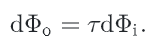

# 反射模型

在我们定义相关接口之前，先简要回顾一下它们是如何适应**整个系统**的。如果使用了`SamplerIntegrator`，将为每条射线调用`SamplerIntegrator::Li()`方法。在找到与**几何原语**最近的交集后，它调用与原语相关的**表面着色器**。表面着色器是作为`Material`子类的一个方法实现的，**负责决定表面上特定点的`BSDF`是什么**；它返回一个`BSDF`对象，该对象包含`brdf`和`btdf`，这些`brdf`已经被**分配并初始化**。积分器然后使用`BSDF`计算==散射光==（基于入射光）。


## 1. 基本接口

我们将首先为`BRDF`和`BTDF`定义接口。`brdf`和`btdf`共享一个公共基类`BxDF`。

```c++
class BxDF {
public:
       virtual ~BxDF() { }
       BxDF(BxDFType type) : type(type) { }
       bool MatchesFlags(BxDFType t) const {
           return (type & t) == type;
       }
       virtual Spectrum f(const Vector3f &wo, const Vector3f &wi) const = 0;
       virtual Spectrum Sample_f(const Vector3f &wo, Vector3f *wi, const Point2f &sample, Float *pdf, BxDFType *sampledType = nullptr) const;
       virtual Spectrum rho(const Vector3f &wo, int nSamples, const Point2f *samples) const;
       virtual Spectrum rho(int nSamples, const Point2f *samples1, const Point2f *samples2) const;
       virtual Float Pdf(const Vector3f &wi, const Vector3f &wo) const;

       const BxDFType type;

};
```

一些**光传输算法**需要区分`BRDF`和`BTDF`。因此，所有`BxDF`都有一个`BxDF::type`成员，

```c++
<<BSDF Declarations>>= 
enum BxDFType {
    BSDF_REFLECTION   = 1 << 0,
    BSDF_TRANSMISSION = 1 << 1,
    BSDF_DIFFUSE      = 1 << 2,
    BSDF_GLOSSY       = 1 << 3,
    BSDF_SPECULAR     = 1 << 4,
    BSDF_ALL          = BSDF_DIFFUSE | BSDF_GLOSSY | BSDF_SPECULAR |
                        BSDF_REFLECTION | BSDF_TRANSMISSION,
};
```

`BxDF`提供的==关键方法==是`BxDF::f()`。它返回给定**方向对**的**分布函数的值**。该接口隐式假设不同波长的光是解**耦的**，**一个波长的能量不会被不同的波长反射**。通过这样的假设，**返回值**可以直接用**频谱**`spectrum`来表示。特殊的荧光材料需要返回一个$N\times N$矩阵，该矩阵编码了`spectral samples`之间的能量转移（其中`n`是光谱表示中的**采样数**）。

不是所有`bxdf`都可以用`f()`方法求值。例如，**完美的镜面物体**，如镜子、玻璃或水，只会将单个入射方向的光散射到单个输出方向。这种`bxdf`最好用==delta分布==来描述——除了**反射方向**之外，**delta分布**为`0`。这些`BxDF`需要在`pbrt`中进行特殊处理，所以也将提供`BxDF::Sample_f()`方法。这种方法既可用于处理**由delta分布描述的散射**，也可用于从沿多个方向散射光的BxDF中随机取样；这**第二种应用**将在第14.1节讨论**蒙特卡洛BSDF取样**时解释。

`Sample_f()`计算给定出射方向$w_0$的**入射光方向**$w_i$，并返回这对方向的**BxDF值**。对于**delta分布**，`BxDF`有必要以这种方式选择**入射方向**$w_i$，因为调用者没有机会生成。

### 1.1 反射

将`4D BRDF`或`BTDF`的**总体行为**（定义为**成对方向上的函数**）还原为**单一方向**上的`2D`函数，甚至还原为**描述其总体散射行为的常数**，可能会很有用。

**半球方向反射率**是一个二维函数，它给出了半球上**恒定光照**所导致的**特定方向的总反射**，或者说，等同于半球上来自特定方向的光的总反射。它被定义为：


`BxDF::rho()`方法计算反射函数$\rho_{hd}$。一些`bxdf`可以用闭合形式计算这个值，尽管大多数使用**蒙特卡罗积分**来计算**近似值**。

```c++
virtual Spectrum rho(const Vector3f &wo, int nSamples, const Point2f *samples) const;
```

一个表面的**半球-半球反射率**，表示为$\rho_{dd}$，是一个**光谱值**，给出**入射光从各个方向都相同时**，入射光被一个表面反射的比例。它是：


如果没有提供方向，则`BxDF::rho()`方法进行计算$\rho_{hh}$（重载方法）

```c++
virtual Spectrum rho(int nSamples, const Point2f *samples1, const Point2f *samples2) const;
```

### 1.2 BxDF Scaling Adapter

将一个给定的`BxDF`与一个**频谱值**进行缩放，也是很有用的。`ScaledBxDF`**包装器**持有一个`BxDF *`和一个频谱，并实现了这个功能。这个类被`MixMaterial`（定义在第9.2.3节）使用，它基于**两种材料的加权组合**来创建`BSDF`。

```c++
class ScaledBxDF : public BxDF {
public:
    ScaledBxDF(BxDF *bxdf, const Spectrum &scale) 
    : BxDF(BxDFType(bxdf->type)), bxdf(bxdf), scale(scale) {}
private:
    BxDF *bxdf;
    Spectrum scale;
};
```

`ScaledBxDF`方法的实现很简单，这里只包含`f()`：

```c++
Spectrum ScaledBxDF::f(const Vector3f &wo, const Vector3f &wi) const {
    return scale * bxdf->f(wo, wi);
}
```


## 2. Specular Reflection and Transmission

Snell’s law：


一般来说，**折射率**随光的波长而变化。因此，入射光通常在两种不同介质之间的边界处**向多个方向散射**，这种效应称为==色散==。图形学中的常见做法是**忽略这种波长相关性**，因为这种影响通常**对视觉准确性并不重要**，而忽略它会大大**简化光传输计算**。

|  |  |
| ------------------------------------------------------------ | ------------------------------------------------------------ |

### 2.1 菲涅尔反射

除了反射和透射的方向外，还有必要计算入射光**反射或透射的比例**。对于物理上准确的反射或折射，这些是与**方向有关的**，不能用**恒定比例量**。菲涅尔方程描述了从一个表面反射的光量；它们是**麦克斯韦方程**在光滑表面的解。

鉴于**折射率**和入射光线与表面法线的**角度**，**菲涅尔方程**规定了材料在入射光线的**两种不同偏振状态**下的相应反射率。因为在大多数环境中，偏振的视觉效果是有限的，在pbrt中，我们将做一个**常见的假设**，即**光是无偏振的**；也就是说，相对于光波来说，它是随机取向的。在这个简化的假设下，**菲涅尔反射率是平行和垂直偏振项的平方的平均值**。

在这一点上，有必要对几类重要的材料进行区分：

- 第一类是**电介质**，它是不导电的材料。它们有**实值的折射率**（通常在`1-3`的范围内），并能**透射**一部分入射光线。
- 第二类包括导体，如**金属**。材料是**不透明的**，并将相当一部分的照明**反射**回来。一部分光也被**透射**到导体的内部，在那里被**迅速吸收**。吸收通常发生在**材料的顶部**`0.1 m`处，因此**只有极薄的金属薄膜才能够透射可观的光**。`pbrt`中忽略了这种效应，只对**导体的反射部分**进行建模。
- **导体**如硅或锗是第三类，本书中不会考虑它们。

**导体和电介质**都由同一套**菲涅耳方程**控制。尽管如此，当**折射率**保证为**实值**时，我们为介质创建一个**特殊的计算函数**。为了计算两种介质界面的**菲涅耳反射率**，我们需要知道两种介质的**折射率**。**电介质的菲涅尔反射率**公式为


$r_{||}$是平行偏振光的菲涅尔反射率，$r_{\bot}$是垂直偏振光的菲涅尔反射率。对于非偏振光，菲涅尔反射率为


折射率就是$1-F_r$。

函数`FrDielectric()`计算**电介质**材料和非偏振光的**菲涅尔反射公式**：

```c++
//<<BxDF Utility Functions>>= 
Float FrDielectric(Float cosThetaI, Float etaI, Float etaT) {
    cosThetaI = Clamp(cosThetaI, -1, 1);
    
    //Potentially swap indices of refraction
    bool entering = cosThetaI > 0.f;
    if (!entering) {
        std::swap(etaI, etaT);
        cosThetaI = std::abs(cosThetaI);
    }
    
    //Compute cosThetaT using Snell’s law
    Float sinThetaI = std::sqrt(std::max((Float)0, 1 - cosThetaI * cosThetaI));
    Float sinThetaT = etaI / etaT * sinThetaI;
    
    //Handle total internal reflection
    if (sinThetaT >= 1)
              return 1;
    
    Float Rparl = ((etaT * cosThetaI) - (etaI * cosThetaT)) /
                  ((etaT * cosThetaI) + (etaI * cosThetaT));
    Float Rperp = ((etaI * cosThetaI) - (etaT * cosThetaT)) /
                  ((etaI * cosThetaI) + (etaT * cosThetaT));
    return (Rparl * Rparl + Rperp * Rperp) / 2;
}
```

为了求出**透射角的余弦值**（`cosThetaT`），首先必须确定**入射方向**是在**介质的外部还是内部**，这样就可以适当地解释这两种折射率。**入射角余弦的符号**表示入射射线位于介质的哪一边


当光从一种介质传播到另一种**折射率较低的介质**时，接近`grazing`的光线**全反射**。这种情况在这里通过一个大于`1`来检测。

我们现在关注一般情况下的**复折射率**$\overline{\eta}=\eta +ik$。除了实部，一般的菲涅耳公式也依赖于虚部`k`，也就是**吸收系数**。

**导体和电介质边界处的菲涅耳反射系数**由


$\eta+ik=\overline{\eta}_t / \overline{\eta_i}$是用**复数除法**计算的**相对折射率**。然而，一般来说，$\overline{\eta_i}$将是**电介质**，所以可以用一个**实数除法**来代替。

这个计算是由`FrConductor()`函数实现的；它的实现直接对应上诉等式。

```c++
Spectrum FrConductor(Float cosThetaI, const Spectrum &etaI, const Spectrum &etaT, const Spectrum &k);
```

为了方便起见，我们将定义一个**抽象的菲涅耳类**，它提供了一个计算**菲涅耳反射系数**的接口。使用此接口的实现有助于**简化**后续`brdf`的实现。

```c++
class Fresnel {
public:
       virtual ~Fresnel();
       virtual Spectrum Evaluate(Float cosI) const = 0;

};
```

提供的唯一方法是`Fresnel::Evaluate()`。给定入射方向和表面法线的**夹角余弦值**，它返回**表面反射的光量**。

#### Fresnel Conductors

```c++
class FresnelConductor : public Fresnel {
public:
       Spectrum Evaluate(Float cosThetaI) const;
       FresnelConductor(const Spectrum &etaI, const Spectrum &etaT,
           const Spectrum &k) : etaI(etaI), etaT(etaT), k(k) { }

private:
    Spectrum etaI, etaT, k;
};
```

```c++
Spectrum FresnelConductor::Evaluate(Float cosThetaI) const {
    return FrConductor(std::abs(cosThetaI), etaI, etaT, k);
}
```

#### Fresnel Dielectrics

 略

#### A Special Fresnel Interface

`FresnelNoOp`对所有传入方向返回`100%`的**反射**。虽然这在物理上是不可能的，但它是一个**方便的功能**。

```c++
class FresnelNoOp : public Fresnel {
public:
    Spectrum Evaluate(Float) const { return Spectrum(1.); }
};
```


### 2.2 Specular Reflection

我们现在可以实现`Specular Reflection`类，它描述了物理上合理的`Specular Reflection`，使用**菲涅耳接口**来计算**被反射的光的比例**。首先，我们将推导出描述`Specular Reflection`的`BRDF`。


这样的`BRDF`可以用**狄拉克分布**来构造。回顾7.1节，`delta distribution`有一个有用的属性


但是，与标准函数相比，`delta distribution`需要特殊的处理。考虑上诉方程的积分：如果我们试图用**梯形规则**或其他**数值积分技术**来计算它，根据delta分布的定义，非特殊点的值都是`0`。

直观地说，我们希望`Specular Reflection BRDF`除**完美反射方向**外处处为`0`，这就建议使用**delta分布**。第一种猜测可能是使用**delta函数**来限制**入射方向**为**镜面反射方向**。这将产生`BRDF`：


虽然这看起来很吸引人，但把它代入散射方程，就会发现**一个问题**：


这是**不正确**的，因为它包含一个**额外的因子**$cos\theta_r$。然而，我们可以去掉这个因子来找到**正确的BRDF**来得到**完美的镜面反射**：


```c++
class SpecularReflection : public BxDF {
public:
    //<<SpecularReflection Public Methods>> 
       SpecularReflection(const Spectrum &R, Fresnel *fresnel) 
           : BxDF(BxDFType(BSDF_REFLECTION | BSDF_SPECULAR)), R(R),
             fresnel(fresnel) { }
       Spectrum f(const Vector3f &wo, const Vector3f &wi) const { 
           return Spectrum(0.f); 
       }
       Spectrum Sample_f(const Vector3f &wo, Vector3f *wi, const Point2f &sample,
                         Float *pdf, BxDFType *sampledType) const;
       Float Pdf(const Vector3f &wo, const Vector3f &wi) const {
           return 0;
       }

private:
    //<<SpecularReflection Private Data>> 
       const Spectrum R;
       const Fresnel *fresnel;

};
```

实现了`Sample_f()`方法，该方法根据**delta分布**选择适当的方向。它将输出变量$w_i$设置为$w_o$关于表面法线的反射。`*pdf`值设置为`1`;

```c++
Spectrum SpecularReflection::Sample_f(const Vector3f &wo,
        Vector3f *wi, const Point2f &sample, Float *pdf,
        BxDFType *sampledType) const {
    //<<Compute perfect specular reflection direction>> 
       *wi = Vector3f(-wo.x, -wo.y, wo.z);

    *pdf = 1;
    return fresnel->Evaluate(CosTheta(*wi)) * R / AbsCosTheta(*wi);
}
```

```c#
inline Vector3f Reflect(const Vector3f &wo, const Vector3f &n) {
    return -wo + 2 * Dot(wo, n) * n;
}
```

### 2.3 Specular Transmission

我们现在将推导`specular transmission`的`BTDF`。斯涅尔定律是推导的基础。**斯涅尔定律**不仅给出了**透射射线的方向**，而且还可以用来说明**沿射线的亮度**随着射线在**不同折射率的介质**之间的变化而变化。


我们用$\tau$来表示由**菲涅耳方程**给出的**入射能量**传输到**输出方向**的**比例**，因此$\tau=1-F_r(w_i)$，则**透射微分通量**为：



如果我们使用**`radiance`的定义**，我们有


将**实体角**展开：


现在我们可以对**斯涅尔定律**进行微分，它给出了一个关系式：


对于镜面反射的BRDF，我们需要划分出一个$cos\theta_i$项，来获得镜面透射的**正确BTDF**：


这个方程中的$1-F_r(w_i)$项对应于一个**容易观察到的效果**：在接近垂直的角度上，透射更强。例如，如果你直视一个清澈的湖水，你可以看到很远的地方，但在**掠射角**，大部分光被反射，就像镜子一样。


```c++
class SpecularTransmission : public BxDF {
public:
   
    SpecularTransmission(const Spectrum &T, Float etaA, Float etaB,
                         TransportMode mode) 
        : BxDF(BxDFType(BSDF_TRANSMISSION | BSDF_SPECULAR)), T(T), etaA(etaA),
    etaB(etaB), fresnel(etaA, etaB), mode(mode) {
    }
    
    Spectrum f(const Vector3f &wo, const Vector3f &wi) const { 
        return Spectrum(0.f); 
    }
    
    Spectrum Sample_f(const Vector3f &wo, Vector3f *wi, const Point2f &sample,
                      Float *pdf, BxDFType *sampledType) const;
    Float Pdf(const Vector3f &wo, const Vector3f &wi) const {
        return 0;
    }

private:
       const Spectrum T;
       const Float etaA, etaB;
       const FresnelDielectric fresnel;
       const TransportMode mode;

};
```

对于构造函数，`T`是**传输比例因子**。`TransportMode`参数表示**入射光线**是否相交于`BxDF`的计算点，它是从**光源**开始的，还是从**相机**开始的。这种区别对`BxDF`的贡献的计算方式有影响。

与镜面反射一样，`::f()`总是返回`0`，因为`BTDF`是一个缩放的**delta分布**。下列方程描述了射线从一种介质传到另一种介质时，**辐射亮度的变化情况**。然而，事实证明，这种缩放适用于**从光源开始的光线**，但它**不适用于从相机开始的光线**。


```c++
Spectrum SpecularTransmission::Sample_f(const Vector3f &wo,
        Vector3f *wi, const Point2f &sample, Float *pdf,
        BxDFType *sampledType) const {
    
    // Figure out which  is incident and which is transmitted
    bool entering = CosTheta(wo) > 0;
    Float etaI = entering ? etaA : etaB;
    Float etaT = entering ? etaB : etaA;

    //Compute ray direction for specular transmission
    if (!Refract(wo, Faceforward(Normal3f(0, 0, 1), wo), etaI / etaT, wi))
        return 0;

    *pdf = 1;
    Spectrum ft = T * (Spectrum(1.) - fresnel.Evaluate(CosTheta(*wi)));
    //Account for non-symmetry with transmission to different medium//
    
    if (mode == TransportMode::Radiance)
           ft *= (etaI * etaI) / (etaT * etaT);

    return ft / AbsCosTheta(*wi);
}
```


对于折射方程，通过上图可以推导：


`Refract()`函数计算折射方向$w_t$，给定入射方向$w_i$，与$w_i$同半球的表面法线`n`，以及`eta`——入射和透射介质的**折射率之比**。**布尔型返回值**表示在`*wt`中是否返回了**有效的折射光线**；在**全内反射**的情况下为假。

```c++
inline bool Refract(const Vector3f &wi, const Normal3f &n, Float eta,
        Vector3f *wt) {
    <<Compute cos using Snell’s law>> 
    *wt = eta * -wi + (eta * cosThetaI - cosThetaT) * Vector3f(n);
    return true;
}
```

**斯涅尔定律**两边平方，我们就可以计算$cos\theta_t$：


```c++
<<Compute cos using Snell’s law>> = 
    Float cosThetaI = Dot(n, wi);
    Float sin2ThetaI = std::max(0.f, 1.f - cosThetaI * cosThetaI);
    Float sin2ThetaT = eta * eta * sin2ThetaI;
    //<<Handle total internal reflection for transmission>> 
	if (sin2ThetaT >= 1) return false;
    Float cosThetaT = std::sqrt(1 - sin2ThetaT);
```


### 2.4 Fresnel-Modulated Specular Reflection and Transmission

为了提高第14、15和16章中一些**蒙特卡洛光传输算法**的效率，有一个**单一的BxDF**来表示**镜面反射和镜面透射**，其中**散射类型的相对权重**由` dielectric Fresnel equations`来调制。

```c++
class FresnelSpecular : public BxDF {
public:

    FresnelSpecular(const Spectrum &R, const Spectrum &T, Float etaA,
                    Float etaB, TransportMode mode) 
        : BxDF(BxDFType(BSDF_REFLECTION | BSDF_TRANSMISSION | BSDF_SPECULAR)),
    R(R), T(T), etaA(etaA), etaB(etaB), fresnel(etaA, etaB),
    mode(mode) { }

    Spectrum f(const Vector3f &wo, const Vector3f &wi) const { 
        return Spectrum(0.f); 
    }
    Spectrum Sample_f(const Vector3f &wo, Vector3f *wi, const Point2f &u,
                      Float *pdf, BxDFType *sampledType) const;
    Float Pdf(const Vector3f &wo, const Vector3f &wi) const {
        return 0;
    }

private:
    const Spectrum R, T;
    const Float etaA, etaB;
    const FresnelDielectric fresnel;
    const TransportMode mode;

};
```

因为一些**实现细节**依赖于第13章介绍的**蒙特卡罗积分原理**，所以示例`f()`方法的实现在第`14.1.3`节。

