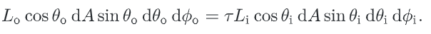
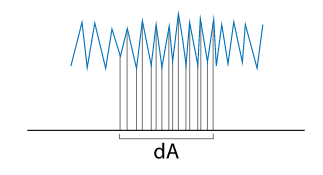
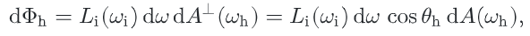
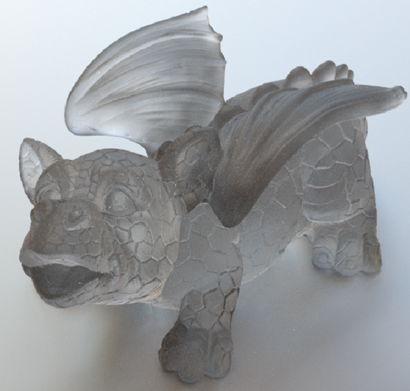
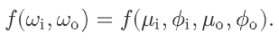

# 反射模型

在我们定义相关接口之前，先简要回顾一下它们是如何适应**整个系统**的。如果使用了`SamplerIntegrator`，将为每条射线调用`SamplerIntegrator::Li()`方法。在找到与**几何原语**最近的交集后，它调用与原语相关的**表面着色器**。表面着色器是作为`Material`子类的一个方法实现的，**负责决定表面上特定点的`BSDF`是什么**；它返回一个`BSDF`对象，该对象包含`brdf`和`btdf`，这些`brdf`已经被**分配并初始化**。积分器然后使用`BSDF`计算==散射光==（基于入射光）。


## 1. 基本接口

我们将首先为`BRDF`和`BTDF`定义接口。`brdf`和`btdf`共享一个公共基类`BxDF`。

```c++
class BxDF {
public:
       virtual ~BxDF() { }
       BxDF(BxDFType type) : type(type) { }
       bool MatchesFlags(BxDFType t) const {
           return (type & t) == type;
       }
       virtual Spectrum f(const Vector3f &wo, const Vector3f &wi) const = 0;
       virtual Spectrum Sample_f(const Vector3f &wo, Vector3f *wi, const Point2f &sample, Float *pdf, BxDFType *sampledType = nullptr) const;
       virtual Spectrum rho(const Vector3f &wo, int nSamples, const Point2f *samples) const;
       virtual Spectrum rho(int nSamples, const Point2f *samples1, const Point2f *samples2) const;
       virtual Float Pdf(const Vector3f &wi, const Vector3f &wo) const;

       const BxDFType type;

};
```

一些**光传输算法**需要区分`BRDF`和`BTDF`。因此，所有`BxDF`都有一个`BxDF::type`成员，

```c++
<<BSDF Declarations>>= 
enum BxDFType {
    BSDF_REFLECTION   = 1 << 0,
    BSDF_TRANSMISSION = 1 << 1,
    BSDF_DIFFUSE      = 1 << 2,
    BSDF_GLOSSY       = 1 << 3,
    BSDF_SPECULAR     = 1 << 4,
    BSDF_ALL          = BSDF_DIFFUSE | BSDF_GLOSSY | BSDF_SPECULAR |
                        BSDF_REFLECTION | BSDF_TRANSMISSION,
};
```

`BxDF`提供的==关键方法==是`BxDF::f()`。它返回给定**方向对**的**分布函数的值**。该接口隐式假设不同波长的光是解**耦的**，**一个波长的能量不会被不同的波长反射**。通过这样的假设，**返回值**可以直接用**频谱**`spectrum`来表示。特殊的荧光材料需要返回一个$N\times N$矩阵，该矩阵编码了`spectral samples`之间的能量转移（其中`n`是光谱表示中的**采样数**）。

不是所有`bxdf`都可以用`f()`方法求值。例如，**完美的镜面物体**，如镜子、玻璃或水，只会将单个入射方向的光散射到单个输出方向。这种`bxdf`最好用==delta分布==来描述——除了**反射方向**之外，**delta分布**为`0`。这些`BxDF`需要在`pbrt`中进行特殊处理，所以也将提供`BxDF::Sample_f()`方法。这种方法既可用于处理**由delta分布描述的散射**，也可用于从沿多个方向散射光的BxDF中随机取样；这**第二种应用**将在第14.1节讨论**蒙特卡洛BSDF取样**时解释。

`Sample_f()`计算给定出射方向$w_0$的**入射光方向**$w_i$，并返回这对方向的**BxDF值**。对于**delta分布**，`BxDF`有必要以这种方式选择**入射方向**$w_i$，因为调用者没有机会生成。

### 1.1 反射

将`4D BRDF`或`BTDF`的**总体行为**（定义为**成对方向上的函数**）还原为**单一方向**上的`2D`函数，甚至还原为**描述其总体散射行为的常数**，可能会很有用。

**半球方向反射率**是一个二维函数，它给出了半球上**恒定光照**所导致的**特定方向的总反射**，或者说，等同于半球上来自特定方向的光的总反射。它被定义为：


`BxDF::rho()`方法计算反射函数$\rho_{hd}$。一些`bxdf`可以用闭合形式计算这个值，尽管大多数使用**蒙特卡罗积分**来计算**近似值**。

```c++
virtual Spectrum rho(const Vector3f &wo, int nSamples, const Point2f *samples) const;
```

一个表面的**半球-半球反射率**，表示为$\rho_{dd}$，是一个**光谱值**，给出**入射光从各个方向都相同时**，入射光被一个表面反射的比例。它是：


如果没有提供方向，则`BxDF::rho()`方法进行计算$\rho_{hh}$（重载方法）

```c++
virtual Spectrum rho(int nSamples, const Point2f *samples1, const Point2f *samples2) const;
```

### 1.2 BxDF Scaling Adapter

将一个给定的`BxDF`与一个**频谱值**进行缩放，也是很有用的。`ScaledBxDF`**包装器**持有一个`BxDF *`和一个频谱，并实现了这个功能。这个类被`MixMaterial`（定义在第9.2.3节）使用，它基于**两种材料的加权组合**来创建`BSDF`。

```c++
class ScaledBxDF : public BxDF {
public:
    ScaledBxDF(BxDF *bxdf, const Spectrum &scale) 
    : BxDF(BxDFType(bxdf->type)), bxdf(bxdf), scale(scale) {}
private:
    BxDF *bxdf;
    Spectrum scale;
};
```

`ScaledBxDF`方法的实现很简单，这里只包含`f()`：

```c++
Spectrum ScaledBxDF::f(const Vector3f &wo, const Vector3f &wi) const {
    return scale * bxdf->f(wo, wi);
}
```


## 2. Specular Reflection and Transmission

Snell’s law：


一般来说，**折射率**随光的波长而变化。因此，入射光通常在两种不同介质之间的边界处**向多个方向散射**，这种效应称为==色散==。图形学中的常见做法是**忽略这种波长相关性**，因为这种影响通常**对视觉准确性并不重要**，而忽略它会大大**简化光传输计算**。

|  |  |
| ------------------------------------------------------------ | ------------------------------------------------------------ |

### 2.1 菲涅尔反射

除了反射和透射的方向外，还有必要计算入射光**反射或透射的比例**。对于物理上准确的反射或折射，这些是与**方向有关的**，不能用**恒定比例量**。菲涅尔方程描述了从一个表面反射的光量；它们是**麦克斯韦方程**在光滑表面的解。

鉴于**折射率**和入射光线与表面法线的**角度**，**菲涅尔方程**规定了材料在入射光线的**两种不同偏振状态**下的相应反射率。因为在大多数环境中，偏振的视觉效果是有限的，在pbrt中，我们将做一个**常见的假设**，即**光是无偏振的**；也就是说，相对于光波来说，它是随机取向的。在这个简化的假设下，**菲涅尔反射率是平行和垂直偏振项的平方的平均值**。

在这一点上，有必要对几类重要的材料进行区分：

- 第一类是**电介质**，它是不导电的材料。它们有**实值的折射率**（通常在`1-3`的范围内），并能**透射**一部分入射光线。
- 第二类包括导体，如**金属**。材料是**不透明的**，并将相当一部分的照明**反射**回来。一部分光也被**透射**到导体的内部，在那里被**迅速吸收**。吸收通常发生在**材料的顶部**`0.1 m`处，因此**只有极薄的金属薄膜才能够透射可观的光**。`pbrt`中忽略了这种效应，只对**导体的反射部分**进行建模。
- **导体**如硅或锗是第三类，本书中不会考虑它们。

**导体和电介质**都由同一套**菲涅耳方程**控制。尽管如此，当**折射率**保证为**实值**时，我们为**介质**创建一个**特殊的计算函数**。为了计算两种介质界面的**菲涅耳反射率**，我们需要知道两种介质的**折射率**。**电介质的菲涅尔反射率**公式为


$r_{||}$是**平行偏振光**的菲涅尔反射率，$r_{\bot}$是**垂直偏振光**的菲涅尔反射率。对于**非偏振光**，**菲涅尔反射率**为


折射率就是$1-F_r$。

函数`FrDielectric()`计算**电介质**材料和非偏振光的**菲涅尔反射公式**：

```c++
//<<BxDF Utility Functions>>= 
Float FrDielectric(Float cosThetaI, Float etaI, Float etaT) {
    cosThetaI = Clamp(cosThetaI, -1, 1);
    
    //Potentially swap indices of refraction
    bool entering = cosThetaI > 0.f;
    if (!entering) {
        std::swap(etaI, etaT);
        cosThetaI = std::abs(cosThetaI);
    }
    
    //Compute cosThetaT using Snell’s law
    Float sinThetaI = std::sqrt(std::max((Float)0, 1 - cosThetaI * cosThetaI));
    Float sinThetaT = etaI / etaT * sinThetaI;
    
    //Handle total internal reflection
    if (sinThetaT >= 1)
              return 1;
    
    Float Rparl = ((etaT * cosThetaI) - (etaI * cosThetaT)) /
                  ((etaT * cosThetaI) + (etaI * cosThetaT));
    Float Rperp = ((etaI * cosThetaI) - (etaT * cosThetaT)) /
                  ((etaI * cosThetaI) + (etaT * cosThetaT));
    return (Rparl * Rparl + Rperp * Rperp) / 2;
}
```

为了求出**透射角的余弦值**（`cosThetaT`），首先必须确定**入射方向**是在**介质的外部还是内部**，这样就可以适当地解释这两种折射率。**入射角余弦的符号**表示入射射线位于介质的哪一边


当光从一种介质传播到另一种**折射率较低的介质**时，接近`grazing`的光线**全反射**。这种情况在这里通过一个大于`1`来检测。

我们现在关注一般情况下的**复折射率**$\overline{\eta}=\eta +ik$。除了实部，一般的菲涅耳公式也依赖于虚部`k`，也就是**吸收系数**。

**导体和电介质边界处的菲涅耳反射系数**由


$\eta+ik=\overline{\eta}_t / \overline{\eta_i}$是用**复数除法**计算的**相对折射率**。然而，一般来说，$\overline{\eta_i}$将是**电介质**，所以可以用一个**实数除法**来代替。

这个计算是由`FrConductor()`函数实现的；它的实现直接对应上诉等式。

```c++
Spectrum FrConductor(Float cosThetaI, const Spectrum &etaI, const Spectrum &etaT, const Spectrum &k);
```

为了方便起见，我们将定义一个**抽象的菲涅耳类**，它提供了一个计算**菲涅耳反射系数**的接口。使用此接口的实现有助于**简化**后续`brdf`的实现。

```c++
class Fresnel {
public:
       virtual ~Fresnel();
       virtual Spectrum Evaluate(Float cosI) const = 0;

};
```

提供的唯一方法是`Fresnel::Evaluate()`。给定入射方向和表面法线的**夹角余弦值**，它返回**表面反射的光量**。

#### Fresnel Conductors

```c++
class FresnelConductor : public Fresnel {
public:
       Spectrum Evaluate(Float cosThetaI) const;
       FresnelConductor(const Spectrum &etaI, const Spectrum &etaT,
           const Spectrum &k) : etaI(etaI), etaT(etaT), k(k) { }

private:
    Spectrum etaI, etaT, k;
};
```

```c++
Spectrum FresnelConductor::Evaluate(Float cosThetaI) const {
    return FrConductor(std::abs(cosThetaI), etaI, etaT, k);
}
```

#### Fresnel Dielectrics

 略

#### A Special Fresnel Interface

`FresnelNoOp`对所有传入方向返回`100%`的**反射**。虽然这在物理上是不可能的，但它是一个**方便的功能**。

```c++
class FresnelNoOp : public Fresnel {
public:
    Spectrum Evaluate(Float) const { return Spectrum(1.); }
};
```


### 2.2 Specular Reflection

我们现在可以实现`Specular Reflection`类，它描述了物理上合理的`Specular Reflection`，使用**菲涅耳接口**来计算**被反射的光的比例**。首先，我们将推导出描述`Specular Reflection`的`BRDF`。


这样的`BRDF`可以用**狄拉克分布**来构造。回顾7.1节，`delta distribution`有一个有用的属性


但是，与标准函数相比，`delta distribution`需要特殊的处理。考虑上诉方程的积分：如果我们试图用**梯形规则**或其他**数值积分技术**来计算它，根据delta分布的定义，非特殊点的值都是`0`。

直观地说，我们希望`Specular Reflection BRDF`除**完美反射方向**外处处为`0`，这就建议使用**delta分布**。第一种猜测可能是使用**delta函数**来限制**入射方向**为**镜面反射方向**。这将产生`BRDF`：


虽然这看起来很吸引人，但把它代入散射方程，就会发现**一个问题**：


这是**不正确**的，因为它包含一个**额外的因子**$cos\theta_r$。然而，我们可以去掉这个因子来找到**正确的BRDF**来得到**完美的镜面反射**：


```c++
class SpecularReflection : public BxDF {
public:
    //<<SpecularReflection Public Methods>> 
       SpecularReflection(const Spectrum &R, Fresnel *fresnel) 
           : BxDF(BxDFType(BSDF_REFLECTION | BSDF_SPECULAR)), R(R),
             fresnel(fresnel) { }
       Spectrum f(const Vector3f &wo, const Vector3f &wi) const { 
           return Spectrum(0.f); 
       }
       Spectrum Sample_f(const Vector3f &wo, Vector3f *wi, const Point2f &sample,
                         Float *pdf, BxDFType *sampledType) const;
       Float Pdf(const Vector3f &wo, const Vector3f &wi) const {
           return 0;
       }

private:
    //<<SpecularReflection Private Data>> 
       const Spectrum R;
       const Fresnel *fresnel;

};
```

实现了`Sample_f()`方法，该方法根据**delta分布**选择适当的方向。它将输出变量$w_i$设置为$w_o$关于表面法线的反射。`*pdf`值设置为`1`;

```c++
Spectrum SpecularReflection::Sample_f(const Vector3f &wo,
        Vector3f *wi, const Point2f &sample, Float *pdf,
        BxDFType *sampledType) const {
    //<<Compute perfect specular reflection direction>> 
       *wi = Vector3f(-wo.x, -wo.y, wo.z);

    *pdf = 1;
    return fresnel->Evaluate(CosTheta(*wi)) * R / AbsCosTheta(*wi);
}
```

```c#
inline Vector3f Reflect(const Vector3f &wo, const Vector3f &n) {
    return -wo + 2 * Dot(wo, n) * n;
}
```

### 2.3 Specular Transmission

我们现在将推导`specular transmission`的`BTDF`。斯涅尔定律是推导的基础。**斯涅尔定律**不仅给出了**透射射线的方向**，而且还可以用来说明**沿射线的亮度**随着射线在**不同折射率的介质**之间的变化而变化。


我们用$\tau$来表示由**菲涅耳方程**给出的**入射能量**传输到**输出方向**的**比例**，因此$\tau=1-F_r(w_i)$，则**透射微分通量**为：


如果我们使用**`radiance`的定义**，我们有


将**实体角**展开：



现在我们可以对**斯涅尔定律**进行微分，它给出了一个关系式：


对于镜面反射的BRDF，我们需要划分出一个$cos\theta_i$项，来获得镜面透射的**正确BTDF**：


这个方程中的$1-F_r(w_i)$项对应于一个**容易观察到的效果**：在接近垂直的角度上，透射更强。例如，如果你直视一个清澈的湖水，你可以看到很远的地方，但在**掠射角**，大部分光被反射，就像镜子一样。


```c++
class SpecularTransmission : public BxDF {
public:
   
    SpecularTransmission(const Spectrum &T, Float etaA, Float etaB,
                         TransportMode mode) 
        : BxDF(BxDFType(BSDF_TRANSMISSION | BSDF_SPECULAR)), T(T), etaA(etaA),
    etaB(etaB), fresnel(etaA, etaB), mode(mode) {
    }
    
    Spectrum f(const Vector3f &wo, const Vector3f &wi) const { 
        return Spectrum(0.f); 
    }
    
    Spectrum Sample_f(const Vector3f &wo, Vector3f *wi, const Point2f &sample,
                      Float *pdf, BxDFType *sampledType) const;
    Float Pdf(const Vector3f &wo, const Vector3f &wi) const {
        return 0;
    }

private:
       const Spectrum T;
       const Float etaA, etaB;
       const FresnelDielectric fresnel;
       const TransportMode mode;

};
```

对于构造函数，`T`是**传输比例因子**。`TransportMode`参数表示**入射光线**是否相交于`BxDF`的计算点，它是从**光源**开始的，还是从**相机**开始的。这种区别对`BxDF`的贡献的计算方式有影响。

与镜面反射一样，`::f()`总是返回`0`，因为`BTDF`是一个缩放的**delta分布**。下列方程描述了射线从一种介质传到另一种介质时，**辐射亮度的变化情况**。然而，事实证明，这种缩放适用于**从光源开始的光线**，但它**不适用于从相机开始的光线**。


```c++
Spectrum SpecularTransmission::Sample_f(const Vector3f &wo,
        Vector3f *wi, const Point2f &sample, Float *pdf,
        BxDFType *sampledType) const {
    
    // Figure out which  is incident and which is transmitted
    bool entering = CosTheta(wo) > 0;
    Float etaI = entering ? etaA : etaB;
    Float etaT = entering ? etaB : etaA;

    //Compute ray direction for specular transmission
    if (!Refract(wo, Faceforward(Normal3f(0, 0, 1), wo), etaI / etaT, wi))
        return 0;

    *pdf = 1;
    Spectrum ft = T * (Spectrum(1.) - fresnel.Evaluate(CosTheta(*wi)));
    //Account for non-symmetry with transmission to different medium//
    
    if (mode == TransportMode::Radiance)
           ft *= (etaI * etaI) / (etaT * etaT);

    return ft / AbsCosTheta(*wi);
}
```


对于折射方程，通过上图可以推导：


`Refract()`函数计算折射方向$w_t$，给定入射方向$w_i$，与$w_i$同半球的表面法线`n`，以及`eta`——入射和透射介质的**折射率之比**。**布尔型返回值**表示在`*wt`中是否返回了**有效的折射光线**；在**全内反射**的情况下为假。

```c++
inline bool Refract(const Vector3f &wi, const Normal3f &n, Float eta,
        Vector3f *wt) {
    <<Compute cos using Snell’s law>> 
    *wt = eta * -wi + (eta * cosThetaI - cosThetaT) * Vector3f(n);
    return true;
}
```

**斯涅尔定律**两边平方，我们就可以计算$cos\theta_t$：


```c++
<<Compute cos using Snell’s law>> = 
    Float cosThetaI = Dot(n, wi);
    Float sin2ThetaI = std::max(0.f, 1.f - cosThetaI * cosThetaI);
    Float sin2ThetaT = eta * eta * sin2ThetaI;
    //<<Handle total internal reflection for transmission>> 
	if (sin2ThetaT >= 1) return false;
    Float cosThetaT = std::sqrt(1 - sin2ThetaT);
```


### 2.4 Fresnel-Modulated Specular Reflection and Transmission

为了提高第14、15和16章中一些**蒙特卡洛光传输算法**的效率，有一个**单一的BxDF**来表示**镜面反射和镜面透射**，其中**散射类型的相对权重**由` dielectric Fresnel equations`来调制。

```c++
class FresnelSpecular : public BxDF {
public:

    FresnelSpecular(const Spectrum &R, const Spectrum &T, Float etaA,
                    Float etaB, TransportMode mode) 
        : BxDF(BxDFType(BSDF_REFLECTION | BSDF_TRANSMISSION | BSDF_SPECULAR)),
    R(R), T(T), etaA(etaA), etaB(etaB), fresnel(etaA, etaB),
    mode(mode) { }

    Spectrum f(const Vector3f &wo, const Vector3f &wi) const { 
        return Spectrum(0.f); 
    }
    Spectrum Sample_f(const Vector3f &wo, Vector3f *wi, const Point2f &u,
                      Float *pdf, BxDFType *sampledType) const;
    Float Pdf(const Vector3f &wo, const Vector3f &wi) const {
        return 0;
    }

private:
    const Spectrum R, T;
    const Float etaA, etaB;
    const FresnelDielectric fresnel;
    const TransportMode mode;

};
```

因为一些**实现细节**依赖于第13章介绍的**蒙特卡罗积分原理**，所以示例`f()`方法的实现在第`14.1.3`节。


## 3. Lambertian Reflection

最简单的`brdf`之一是==朗伯模型==。它模拟了一个**完美的漫反射表面**，使入射光在各个方向上**均匀散射**。虽然这种反射模型在物理上并不可信，但它是对许多现实世界表面的**合理近似**，如**哑光油漆**。

```c++
class LambertianReflection : public BxDF {
public: 
       LambertianReflection(const Spectrum &R) 
           : BxDF(BxDFType(BSDF_REFLECTION | BSDF_DIFFUSE)), R(R) { }
       Spectrum f(const Vector3f &wo, const Vector3f &wi) const;
       Spectrum rho(const Vector3f &, int, const Point2f *) const { return R; }
       Spectrum rho(int, const Point2f *, const Point2f *) const { return R; }

private:
       const Spectrum R;

};
```

`lambertan reflection`的**反射分布函数**很简单，因为它的值是**常数**。但是，必须返回$R/\pi$，而不是提供给构造函数的反射值。

```c++
Spectrum LambertianReflection::f(const Vector3f &wo,
                                 const Vector3f &wi) const {
    return R * InvPi;
}
```

**朗伯式BRDF**的**方向-半球和半球-半球反射率值**的解析计算是很简单的，因此本文省略了推导。

```c++
Spectrum rho(const Vector3f &, int, const Point2f *) const { return R; }
Spectrum rho(int, const Point2f *, const Point2f *) const { return R; }
```


## 4. Microfacet Models


**microfacet模型**的两个主要组件是**facet分布表示**和**BRDF**, BRDF描述光线如何从单个`microfacet`散射。鉴于这些，我们的任务是推导出一个**封闭形式的表达式**。**完美的镜面反射**是`microfacet BRDF`最常用的，尽管**镜面透射**对于建模许多**半透明材料**很有用，而`Oren Nayar`模型将`microfacet`视为**Lambertian反射器**。

要计算这种模型的反射，需要考虑**microfacet级别的局部照明效果**（下图）。`microfacet`可能被另一个`facet`遮挡，可能位于相邻的`microfacet`的阴影中，或者**互反射**可能导致`microfacet`反射的光比直接照度和低水平的`microfacet BRDF`预测的更多。


### 4.1 Oren–Nayar Diffuse Reflection

Oren和Nayar观察到现实世界的物体**并不表现出完美的Lambertian反射**。具体来说，**当照明方向接近观察方向时，粗糙的表面通常会显得更亮**。他们开发了一种反射模型，该模型用**v形的microfacet**描述粗糙表面，该`microfacet`由一个**球形高斯分布**描述，只有一个参数，即`microfacet  orientation angle`的**标准偏差**$\sigma$。

在v型假设下，只考虑**相邻的microfacet可以相互反射**；Oren和Nayar利用这一点推导出一个BRDF模型。结果模型考虑了**microfacet之间的遮蔽、阴影和互反射**，没有解析解，但发现下面的近似很适合它：


| Lambertian                                                   | Oren–Nayar                                                   |
| ------------------------------------------------------------ | ------------------------------------------------------------ |
|  |  |

```c++
OrenNayar(const Spectrum &R, Float sigma) 
    : BxDF(BxDFType(BSDF_REFLECTION | BSDF_DIFFUSE)), R(R) {
    sigma = Radians(sigma);
    Float sigma2 = sigma * sigma;
    A = 1.f - (sigma2 / (2.f * (sigma2 + 0.33f)));
    B = 0.45f * sigma2 / (sigma2 + 0.09f);
}

const Spectrum R;
Float A, B;
```

```c++
Spectrum OrenNayar::f(const Vector3f &wo, const Vector3f &wi) const {
    Float sinThetaI = SinTheta(wi);
    Float sinThetaO = SinTheta(wo);
    
    //Compute cosine term of Oren–Nayar model
    Float maxCos = 0;
    if (sinThetaI > 1e-4 && sinThetaO > 1e-4) {
        Float sinPhiI = SinPhi(wi), cosPhiI = CosPhi(wi);
        Float sinPhiO = SinPhi(wo), cosPhiO = CosPhi(wo);
        Float dCos = cosPhiI * cosPhiO + sinPhiI * sinPhiO;
        maxCos = std::max((Float)0, dCos);
    }

    //Compute sine and tangent terms of Oren–Nayar model
    Float sinAlpha, tanBeta;
    if (AbsCosTheta(wi) > AbsCosTheta(wo)) {
        sinAlpha = sinThetaO;
        tanBeta = sinThetaI / AbsCosTheta(wi);
    } else {
        sinAlpha = sinThetaI;
        tanBeta = sinThetaO / AbsCosTheta(wo);
    }

    return R * InvPi * (A + B * maxCos * sinAlpha * tanBeta);
}
```


### 4.2 Microfacet Distribution Functions

表现出完美镜面反射和透射的**微面反射模型**在模拟各种**光泽`glossy`材料**方面是有效的，包括金属、塑料和磨砂玻璃。在讨论这些模型的辐射测量细节之前，我们首先要介绍**封装其几何属性的抽象概念**。这里的代码包括两个广泛使用的**microfacet模型**的实现。所有这些代码都在`core/microfacet.h`和`core/microfacet.cpp`文件中。

`MicrofacetDistribution`定义了**microfacet实现**提供的接口以及它们的一些常见功能。

```c++
class MicrofacetDistribution {
public:
    //<<MicrofacetDistribution Public Methods>> 
       virtual Float D(const Vector3f &wh) const = 0;
       virtual Float Lambda(const Vector3f &w) const = 0;
       Float G1(const Vector3f &w) const {
           return 1 / (1 + Lambda(w));
       }
       Float G(const Vector3f &wo, const Vector3f &wi) const {
           return 1 / (1 + Lambda(wo) + Lambda(wi));
       }
       virtual Vector3f Sample_wh(const Vector3f &wo,
           const Point2f &u) const = 0;
       Float Pdf(const Vector3f &wo, const Vector3f &wh) const;

protected:
   // <<MicrofacetDistribution Protected Methods>> 
       MicrofacetDistribution(bool sampleVisibleArea)
           : sampleVisibleArea(sampleVisibleArea) { }

   // <<MicrofacetDistribution Protected Data>> 
       const bool sampleVisibleArea;

};
```

**microfacet表面**的一个重要特征是由**分布函数**$D(w_h)$表示的，它给出了具有表面法线$w_h$的`microfacet`的`differential area`。在`pbrt`中，**microfacet分布函数**与**BxDFs**定义在同一个**BSDF坐标系**中；因此，一个**完美光滑的表面**可以用一个**非零分布**$D(w_h)$来描述，只有当它等于**表面法线**$w_h$时：$D(w_h)=\delta(w_h-(0,0,1))$



**Microfacet分布函数**必须被**归一化**，以确保它们在物理上是可行的。直观地说，如果我们沿法线方向$n$考虑**微表面上的入射光线**，那么每个光线必须恰好与**microfacet表面**相交一次。更正式地说，给定微表面的`differential area` $dA$，则该区域上方的**microfacet面投影区域**必须等于$dA$。数学上，这符合以下要求


Beckmann和Spizzichino提出了一种基于**microfacet slopes高斯分布**的分布函数：

```c++
<<MicrofacetDistribution Declarations>>+=  
class BeckmannDistribution : public MicrofacetDistribution {
public:
   // <<BeckmannDistribution Public Methods>> 
       static Float RoughnessToAlpha(Float roughness) {
           roughness = std::max(roughness, (Float)1e-3);
           Float x = std::log(roughness);
           return 1.62142f + 0.819955f * x + 0.1734f * x * x +
               0.0171201f * x * x * x + 0.000640711f * x * x * x * x;
       }
    
       BeckmannDistribution(Float alphax, Float alphay, bool samplevis = true)
           : MicrofacetDistribution(samplevis), alphax(alphax), alphay(alphay) {
       }
    
       Float D(const Vector3f &wh) const;
       Vector3f Sample_wh(const Vector3f &wo, const Point2f &u) const;

private:
   // <<BeckmannDistribution Private Methods>> 
       Float Lambda(const Vector3f &w) const;

   // <<BeckmannDistribution Private Data>> 
       const Float alphax, alphay;

};
```

==Beckmann Spizzichino模型==的传统定义是：


其中，$\sigma$为microfacet的`RMS slope`，然后：$\alpha=\sqrt{2}\sigma$。定义一个**各向异性分布**是有用的。对应的**各向异性microfacet分布函数**为


```c++
<<MicrofacetDistribution Method Definitions>>= 
Float BeckmannDistribution::D(const Vector3f &wh) const {
    Float tan2Theta = Tan2Theta(wh);
    if (std::isinf(tan2Theta)) return 0.;
    Float cos4Theta = Cos2Theta(wh) * Cos2Theta(wh);
    return std::exp(-tan2Theta * (Cos2Phi(wh) / (alphax * alphax) +
                                  Sin2Phi(wh) / (alphay * alphay))) /
        (Pi * alphax * alphay * cos4Theta);
}
```

另一个**有用的microfacet分布函数**是Trowbridge和Reitz提出的。其各向异性变式：


与**Beckmann Spizzichino模型**相比，**Trowbridge Reitz有更高的尾部**，在远离表面法线的方向上，它下降到零的速度更慢。这一特性与现实世界中的许多表面的特性非常匹配。这两个microfacet分布函数见下图。


```c++
class TrowbridgeReitzDistribution : public MicrofacetDistribution {
public:
    //<<TrowbridgeReitzDistribution Public Methods>> 
       static inline Float RoughnessToAlpha(Float roughness);
       TrowbridgeReitzDistribution(Float alphax, Float alphay,
               bool samplevis = true)
           : MicrofacetDistribution(samplevis), alphax(alphax), alphay(alphay) {
       }
       Float D(const Vector3f &wh) const;
       Vector3f Sample_wh(const Vector3f &wo, const Point2f &u) const;

private:
   // <<TrowbridgeReitzDistribution Private Methods>> 
       Float Lambda(const Vector3f &w) const;

    //<<TrowbridgeReitzDistribution Private Data>> 
       const Float alphax, alphay;

};
```

```c++
Float TrowbridgeReitzDistribution::D(const Vector3f &wh) const {
    Float tan2Theta = Tan2Theta(wh);
    if (std::isinf(tan2Theta)) return 0.;
    const Float cos4Theta = Cos2Theta(wh) * Cos2Theta(wh);
    Float e = (Cos2Phi(wh) / (alphax * alphax) +
               Sin2Phi(wh) / (alphay * alphay)) * tan2Theta;
    return 1 / (Pi * alphax * alphay * cos4Theta * (1 + e) * (1 + e));
}
```

### 4.3 Masking and Shadowing

Smith的`masking-shadowing`函数$G_1(w,w_h)$给出了从$w$方向上法线为$w_h$的、可见的microfacet的比例。通常情况下，**microfacet可见的概率**与它的方向$w_h$无关，我们可以将这个函数写成$G_1(w)$。复习下相关知识：


+是正向看的面积（不考虑遮挡），-是背向看的面积，所以：


正如我们之前知道的，通常我们需要一个辅助函数$\Lambda$，其衡量**每一个可见的microfacet区域**的不可见掩蔽microfacet区域。


**Lambda()方法**计算这个函数。它的实现特定于**每个microfacet分布**。我们有：（变换上诉公式）


```c++
Float G1(const Vector3f &w) const {
    return 1 / (1 + Lambda(w));
}
```

**单纯的微观面分布**并没有提出足够的条件来暗示一个特定的函数；许多函数都可以满足**面积积分方程**中的约束条件。例如，如果我们假设微表面上附近各点的高度没有相关性，那么就有可能找到唯一的给定D的$\Lambda$。 尽管基本假设在现实中并不真实——**对于实际的微表面，一个点的高度通常与附近各点的高度很接近**——结果$\Lambda$函数与**实际表面的测量反射**相比，相当精确。

对于**各向同性的Beckmann-Spizzichino分布**，在**附近点高度不相关的假设**下，$\Lambda$为：


**Beckmann Spizzichino函数的pbrt计算**是基于上诉方程的**有理多项式近似**，这是更有效的计算，因为它避免了调用`std::erf()`和`std::exp()`，这两个计算都是相当昂贵的。

```c++
Float BeckmannDistribution::Lambda(const Vector3f &w) const {
    Float absTanTheta = std::abs(TanTheta(w));
    if (std::isinf(absTanTheta)) return 0.;
    
    //<<Compute alpha for direction w>> 
    Float a = 1 / (alpha * absTanTheta);
    if (a >= 1.6f)
        return 0;
    return (1 - 1.259f * a + 0.396f * a * a) /
           (3.535f * a + 2.181f * a * a);
}
```

**各向异性分布的遮蔽-阴影函数**最容易计算的是：取其**相应的各向同性函数**，并根据$\alpha_x$和$\alpha_y$值**拉伸底层微表面**。等价地，我们可以计算出感兴趣方向的内插$\alpha$值，并将其与**各向同性的函数**一起使用；更多细节见本章末的 "进一步阅读 "部分。

```c++
<<Compute alpha for direction w>>= 
Float alpha = std::sqrt(Cos2Phi(w) * alphax * alphax +
                        Sin2Phi(w) * alphay * alphay);
```

在高度不相关假设下，Trowbridge Reitz分布的$\Lambda$形式是相当简单的


```c++
Float TrowbridgeReitzDistribution::Lambda(const Vector3f &w) const {
    Float absTanTheta = std::abs(TanTheta(w));
    if (std::isinf(absTanTheta)) return 0.;
    <<Compute alpha for direction w>> 
    Float alpha2Tan2Theta = (alpha * absTanTheta) * (alpha * absTanTheta);
    return (-1 + std::sqrt(1.f + alpha2Tan2Theta)) / 2;
}
```

如果我们假设一个microfacet在两个方向上都可见的概率等于它**在每个方向上都独立可见的概率**，那么我们有


> 关于$G_2$，见RTR4

如果`microfacet`上的**给定点越高，microfacet的可见性就越高**，那么可以推导出更精确的模型。这个假设导致了这个模型：


这个近似在实践中是相当准确的，我们将在pbrt中使用这个近似。关于这个函数的推导以及定义函数的更复杂的方法，请参阅本章末尾的进一步阅读部分。

```c++
<<MicrofacetDistribution Public Methods>>+=  
Float G(const Vector3f &wo, const Vector3f &wi) const {
    return 1 / (1 + Lambda(wo) + Lambda(wi));
}
```

### 4.4 The Torrance–Sparrow Model

orrance和Sparrow开发了**早期的microfacet模型**来模拟**金属表面**。==他们将表面建模为完美光滑的镜像microfacet的集合==。因为microfacet是完美镜面反射，只有那些法线等于半角向量才能造成完美镜面反射。


`Torrance–Sparrow Model`的推导有许多有趣的步骤；我们将在这里详细讨论它。首先，考虑以半角$w_h$为方向的`microfacet`上的**入射微分通量**$d\Phi_h$：



方向为$w_h$的microfacet的**微分面积**为：（为啥有$dw_h$）


前两项描述了具有适当方向的、每单位面积的微面的**微分面积**，而$dA$将其转换为**微分面积**，因此：


如果我们假设**每个microfacet**都按照**菲涅耳定律**单独反射光线，则输出的通量为：


再次使用辐射度的定义，反射出的辐射度是：


在`14.1.1`节中，我们将推导出**镜面反射**下$dw_h$和$dw_o$之间的一个重要关系：


我们可以把这个关系代入上一个方程并化简，给出：


我们现在可以应用**BRDF的定义**，方程(5.8)，并添加**几何衰减项**，从而得到==Torrance Sparrow BRDF==：


**Torrance Sparrow模型**的一个优点是**它的推导不依赖于所使用的特定的microfacet分布**。此外，**它不依赖于特定的菲涅耳函数**，因此**它可以用于导体和电介质**。然而，在推导中使用的$dw_h$和$dw_o$之间的关系**依赖于microfacet的镜面反射的假设**。

代码实现：

```c++
class MicrofacetReflection : public BxDF {
public:
    //<<MicrofacetReflection Public Methods>> 
       MicrofacetReflection(const Spectrum &R,
               MicrofacetDistribution *distribution, Fresnel *fresnel)
           : BxDF(BxDFType(BSDF_REFLECTION | BSDF_GLOSSY)), R(R), 
             distribution(distribution), fresnel(fresnel) { }
       Spectrum f(const Vector3f &wo, const Vector3f &wi) const;
       Spectrum Sample_f(const Vector3f &wo, Vector3f *wi, const Point2f &u,
                         Float *pdf, BxDFType *sampledType) const;
       Float Pdf(const Vector3f &wo, const Vector3f &wi) const;

private:
    //<<MicrofacetReflection Private Data>> 
       const Spectrum R;
       const MicrofacetDistribution *distribution;
       const Fresnel *fresnel;

};
```

```c++
  Spectrum MicrofacetReflection::f(const Vector3f &wo,
        const Vector3f &wi) const {
    Float cosThetaO = AbsCosTheta(wo), cosThetaI = AbsCosTheta(wi);
    Vector3f wh = wi + wo;
    
    //需要明确地处理两种边缘情况，即在掠射角度下产生的入射方向和外向方向，以避免从BRDF的评估中产生NaN值。
    if (cosThetaI == 0 || cosThetaO == 0) return Spectrum(0.);
    if (wh.x == 0 && wh.y == 0 && wh.z == 0) return Spectrum(0.);
    
    wh = Normalize(wh);
    Spectrum F = fresnel->Evaluate(Dot(wi, wh));
    return R * distribution->D(wh) * distribution->G(wo, wi) * F /
           (4 * cosThetaI * cosThetaO);
}
```

也可以定义一个BTDF，用于表现出**完美镜面透射的微面**的透射。在这种情况下，$dw_h$和$dw_o$：


在**Torrance Sparrow BRDF**的推导中，这个关系可以用来代替方程：


其中，$\eta=\eta_i/\eta_o$。对于镜面透射，**半角矢量**为：


```c++
<<BxDF Declarations>>+=  
class MicrofacetTransmission : public BxDF {
public:
    <<MicrofacetTransmission Public Methods>> 
       MicrofacetTransmission(const Spectrum &T,
               MicrofacetDistribution *distribution, Float etaA, Float etaB,
               TransportMode mode)
           : BxDF(BxDFType(BSDF_TRANSMISSION | BSDF_GLOSSY)),
             T(T), distribution(distribution), etaA(etaA), etaB(etaB),
             fresnel(etaA, etaB), mode(mode) { }
       Spectrum f(const Vector3f &wo, const Vector3f &wi) const;
       Spectrum Sample_f(const Vector3f &wo, Vector3f *wi, const Point2f &u,
                         Float *pdf, BxDFType *sampledType) const;
       Float Pdf(const Vector3f &wo, const Vector3f &wi) const;

private:
    <<MicrofacetTransmission Private Data>> 
       const Spectrum T;
       const MicrofacetDistribution *distribution;
       const Float etaA, etaB;
       const FresnelDielectric fresnel;
       const TransportMode mode;

};
```

| reflection                                                   | transmission                                                 |
| ------------------------------------------------------------ | ------------------------------------------------------------ |
|  |  |

下图模拟**远处环境的光源照射下**的**各向同性和各向异性microfacet模型**的两个球体的外观。


## 5. Fresnel Incidence Effects

图形学中的**许多BRDF模型**没有考虑到**菲涅尔反射**减少了**到达分层物体底层的光量**这一事实。考虑一下一张**抛光的木桌**或一堵**有光泽的墙**：如果你正面看它们的表面，你主要看到的是**木材或油漆的颜色**。当你把你的视角移向**掠射角**时，看到的**底层颜色就会减少**，因为它被**菲涅尔效应**带来的、**越来越多的光泽反射**所淹没。


在本节中，我们将实现Ashikhmin和Shirley（2000年，2002年）开发的BRDF模型，该模型包含一个**漫反射底层表面**和其**上方的光泽镜面**。**漫反射表面的反射效果**由**菲涅尔效应后剩下的能量**来调节。上图显示了这一思路：当**入射方向接近法线**时，大部分光线被传输到漫反射层，**漫反射项占主导地位**。当**入射方向接近平面**时，**光泽反射是主要的反射模式**。

```c++
class FresnelBlend : public BxDF {
public:
       FresnelBlend(const Spectrum &Rd, const Spectrum &Rs, 
                    MicrofacetDistribution *distrib);
    
       Spectrum f(const Vector3f &wo, const Vector3f &wi) const;
    
       Spectrum SchlickFresnel(Float cosTheta) const {
           auto pow5 = [](Float v) { return (v * v) * (v * v) * v; };
           return Rs + pow5(1 - cosTheta) * (Spectrum(1.) - Rs);
       }
    
       Spectrum Sample_f(const Vector3f &wi, Vector3f *sampled_f, const Point2f &u,
                         Float *pdf, BxDFType *sampledType) const;
    
       Float Pdf(const Vector3f &wi, const Vector3f &wo) const;

private:

       const Spectrum Rd, Rs;
       MicrofacetDistribution *distribution;

};
```

该模型采用**两种光谱**，分别代表**漫反射**和**镜面反射**，以及`glossy`层的`microfacet`分布。

```c++
FresnelBlend::FresnelBlend(const Spectrum &Rd, const Spectrum &Rs,
                           MicrofacetDistribution *distribution) 
    : BxDF(BxDFType(BSDF_REFLECTION | BSDF_GLOSSY)),
      Rd(Rd), Rs(Rs), distribution(distribution) { }
```

该模型是基于一个**光滑镜面项**和一个**漫反射项**的加权和。考虑到互易性和能量守恒，`glossy`镜面推导为：


**Ashikhmin和Shirley模型**的关键是推导了一个**扩散项**，使模型仍然服从**互易性和能量守恒**。推导依赖于Schlick(1993)对**菲涅耳反射方程的近似**，他将菲涅耳反射**近似为**：


有了这个菲涅耳项，下面方程中的**漫反射项**成功地以**物理上可信的方式**模拟了**基于菲涅耳的、减少的漫反射**：


```c++
Spectrum SchlickFresnel(Float cosTheta) const {
    auto pow5 = [](Float v) { return (v * v) * (v * v) * v; };
    return Rs + pow5(1 - cosTheta) * (Spectrum(1.) - Rs);
}

Spectrum FresnelBlend::f(const Vector3f &wo, const Vector3f &wi) const {
    auto pow5 = [](Float v) { return (v * v) * (v * v) * v; };
    
    Spectrum diffuse = (28.f/(23.f*Pi)) * Rd *
        (Spectrum(1.f) - Rs) * 
        (1 - pow5(1 - .5f * AbsCosTheta(wi))) *
        (1 - pow5(1 - .5f * AbsCosTheta(wo)));
    
    Vector3f wh = wi + wo;
    if (wh.x == 0 && wh.y == 0 && wh.z == 0) return Spectrum(0);
    
    wh = Normalize(wh);
    Spectrum specular = distribution->D(wh) /
        (4 * AbsDot(wi, wh) *
         std::max(AbsCosTheta(wi), AbsCosTheta(wo))) *
         SchlickFresnel(Dot(wi, wh));
    
    return diffuse + specular;
}
```


## 6. Fourier Basis BSDFs

虽然像**Torrance Sparrow**和**Oren Nayar**这样的**反射模型**可以准确地代表许多材料，**但一些材料的BRDF形状并不匹配这些模型**。对于这样的材料，一种选择是将**它们的BSDF值**存储在一个**大型3D或4D查找表**中，尽管这种方法需要大量的存储。

因此，有一个更紧凑的表示，准确地表示BSDF是非常可取的。本节介绍**傅里叶余弦函数**，它用**傅里叶基的缩放余弦项和**表示**傅里叶余弦函数**。这种表示是精确的，空间效率高的，并且可以很好地与**蒙特卡罗积分**一起工作。下图是例子。


在这里，我们不会讨论**BSDFs**是如何转化为这种表示方法的，但我们将**重点讨论它在渲染中的使用**。关于这些问题的**更多细节**，请参见本章末尾的 **"进一步阅读 "部分**。

**傅里叶BSDF**代表**各向同性的BSDF**，通过入射方向和出射方向的**球面坐标**来确定**BSDF的参数**，其中$\mu_i,\mu_0$是入射和出射方向的`zenith angles`（**天顶角**），$\phi_i,\phi_o$是入射和出射的`azimuth angles`（**平面角**）：



**各向同性的假设**意味着函数可以**更简单**：


**各向同性bsdf**通常也是方位差的**偶函数**：


给定这些性质，**BSDF与余弦衰减的乘积**表示为**方位角差**的傅里叶级数：{**21**}


由于我们考虑的是各向同性（偶函数），只需要余弦项，不需要正弦项。$a_o(\mu_i\mu_o),...,a_{m-1}(\mu_i,\mu_o)$表示特定**一对天顶角余弦**的**傅里叶系数**。

接下来，对**函数**$a_k$的**输入参数**进行**离散化**。我们选择一组**天顶角余弦**$\overline{\mu}={\mu_0,...,\mu_{n-1}}$，并存储每对$0<=i,j<=n$的值$a_k(\mu_i,\mu_j)$。因此，我们可以把每一个$a_k$看作一个$n\times n$矩阵，**整个BRDF表示**由$m$个这样的矩阵组成。每种描述材料对入射照明响应的不同方位角振荡频率。

**达到令人满意的精度**所需的**最大阶数**`m`是不同的：**它取决于特定的天顶角**，因此，对于**给定的一对方向**，需要根据**BSDF的复杂度**来调整**系数的个数**。

为了看到这样做的价值，考虑**近乎完美的镜面反射**：$\mu_i=\mu_o$。许多系数都是必要的，以准确表示镜面层。对于`specular lobe`，只在$\phi=\pi$附近的一小部分方向上非常大（其他为`0`）。当$\mu_i$和$\mu_0$没有对齐时，只需要**一个单项**来表示`BSDF`为`0`。对于**较平滑的BSDF**，大多数的$\mu_i$和$\mu_o$需要**多个系数**a来准确表示其$\phi$分布，但对于$a_k$，其**平滑性**意味着一般**不需要太多的系数**。==傅立叶bsdf表示==利用了这个特性，并且只存储**所需的稀疏系数集**，以达到期望的精度。因此，对于大多数实际BSDF数据类型，式{**21**}的表示是**相当紧凑的**。

`FourierBSDFTable`是一个**helper结构**，它保存**以这种方式表示的BSDF**的所有数据。它是一个简单的结构体——收集数据，直接访问调用代码，它提供了一些**实用方法**：

```c++
struct FourierBSDFTable {
       Float eta;
       int mMax;
       int nChannels;
       int nMu;
       Float *mu;
       int *m;
       int *aOffset;
       Float *a;
       Float *a0;
       Float *cdf;
       Float *recip;

       static bool Read(const std::string &filename, FourierBSDFTable *table);
       
       const Float *GetAk(int offsetI, int offsetO, int *mptr) const {
           *mptr = m[offsetO * nMu + offsetI];
           return a + aOffset[offsetO * nMu + offsetI];
       }
    
       bool GetWeightsAndOffset(Float cosTheta, int *offset, Float weights[4]) const;

};
```

`Read()`方法**初始化**存储在给定文件中的**BSDF的结构**。如果`BSDF`表示两种不同**介质边界处的散射**，那么`FourierBSDFTable::eta`成员变量给出了表面边界上的**相对折射率**，`mMax`给出了**任意一对方向**$\mu_i$和$\mu_0$的最大阶数`m`。

```c++
Float eta;
int mMax;
```

`nChannels`给出了可用的光谱通道的数量；在这个实现中，它要么是1，代表一个单色的BSDF，要么是3，代表一个RGB颜色的BSDF。在这里，三通道的变体实际上存储了亮度、红色和蓝色，而不是红色、绿色和蓝色--直接表示亮度对于第14.1.4节中定义的蒙特卡洛取样程序是有用的，因为它提供了所有颜色通道的函数的总体信息。相应的绿色可以很容易地从亮度、红色和蓝色计算出来，我们很快就会看到。

