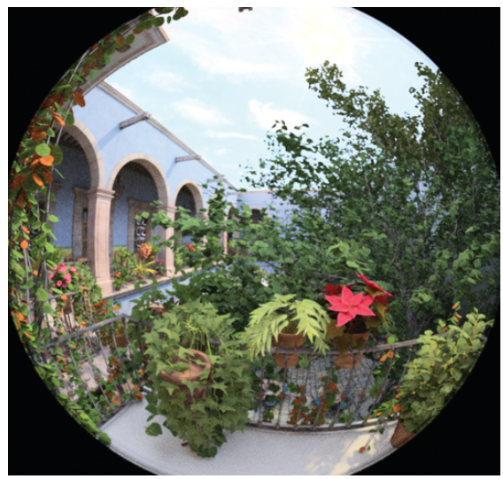
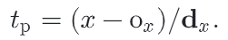

# 相机


在第一章中，我们描述了计算机图形学中常用的**针孔摄像机模型**。这个模型很容易描述和模拟，但它忽略了镜头对**通过镜头的光线**所产生的重要影响，而这些影响是在真实的摄像机中发生的。例如，用针孔相机渲染的一切都在焦点上——这种状态在真实的镜头系统中是不可能的。更普遍的是，离开透镜系统的`radiance `分布与进入透镜系统的辐射度分布有很大的不同；

==相机镜头系统==也会引入各种像差，影响它们形成的图像；例如，`vignetting`会导致图像边缘**变暗**，因为通过胶片或传感器边缘的光线比通过图像中心的光线少。镜头也可以引起针垫`pincushion`或筒变形，这导致**直线成像为曲线**。尽管镜头设计师努力减少设计中的像差，但他们仍然可以对图像产生有意义的影响。

本章介绍了==Camera类==和它的两个关键方法。`Camera::GenerateRay()` 和` Camera::GenerateRayDifferential()`。第一个方法计算出`film plane`上的样本位置所对应的**世界空间射线**。通过根据不同的==图像形成模型==，以不同的方式生成这些射线，**pbrt中的摄像机可以为同一个3D场景创建多种类型的图像**。第二种方法不仅可以生成这种射线，而且还可以计算出射线所采样的图像区域的信息；例如，这种信息被用于第10章的抗锯齿计算。在16.1.1节中，将介绍一些额外的Camera方法，以支持**双向光传输算法**。

[toc]

## 1. 相机模型

```c++
<<Camera Declarations>>= 
    class Camera {
    public:
        <<Camera Interface>> 
        <<Camera Public Data>> 
    };
```

基本的相机构造函数有几个参数，这些参数适用于所有的相机类型。其中最重要的一个是在场景中放置相机的==转换==，它存储在CameraToWorld成员变量中。相机存储一个`AnimatedTransform`（而不仅仅是一个常规的Transform），这样相机本身就可以随着时间移动。

现实世界的相机有一个==快门==，可以在短时间内打开，将胶片曝光在光下。这种非零曝光时间的一个结果是==运动模糊==：过程中，相对于相机运动的物体被模糊。因此，所有的相机都储存了快门开启和关闭的时间，并负责产生光线和相关的时间，以采样场景。如果在快门开启时间和关闭时间之间有一个合适的光线时间分布，就可以计算出运动模糊的图像。

摄像机还包含一个指向==Film类==实例的指针来表示最终图像（Film在第7.9节中描述），以及一个指向==Medium实例==的指针来表示摄像机所在的散射介质（Medium在第11.3节中描述）。

```c++
<<Camera Interface>>= 
    Camera(const AnimatedTransform &CameraToWorld, Float shutterOpen,Float shutterClose, Film *film, const Medium *medium);
<<Camera Public Data>>= 
    AnimatedTransform CameraToWorld;
    const Float shutterOpen, shutterClose;
    Film *film;
    const Medium *medium;
```

需要实现的第一个方法是`Camera::GenerateRay()`，它应该计算与给定样本对应的光线。

```c++
<<Camera Interface>>+=  
virtual Float GenerateRay(const CameraSample &sample,
                          Ray *ray) const = 0;
```

`CameraSample结构`保存了指定一个**相机射线**所需的所有样本值。它的 `pFilm` 成员给出了胶片`film`上的点。`plens`指出光线所经过的**镜头上的点**（对于包含镜头概念的相机），`CameraSample::time`给出了光线应该对场景进行采样的时间；实现应该使用这个值在`shutterOpen-shutterClose`时间范围内进行线性插值。

`GenerateRay()`还返回一个==浮点值==，它影响沿着生成的光线到达胶片平面的辐射度对最终图像的贡献度。简单的摄影机模型可以只返回一个` 1` 的值，但是模拟真实物理镜头系统的摄影机，比如第 6.4 节中的摄影机，会根据镜头的光学特性设置这个值来表示光线通过镜头时的光量。

```c++
<<Camera Declarations>>+=  
    struct CameraSample {
        Point2f pFilm;
        Point2f pLens;
        Float time;
    };
```

`GenerateRayDifferential()`方法像`GenerateRay()`一样计算一个**主射线**，但也计算在`film plane`上x和y方向上偏移一个像素的**相应射线**。这些关于摄影机光线在胶片上的位置变化的信息有助于给系统的其他部分提供一个概念，即一个特定的摄影机光线样本代表了多少胶片区域，这对于抗锯齿纹理图的查找特别有用。

```c++
<<Camera Method Definitions>>= 
Float Camera::GenerateRayDifferential(const CameraSample &sample, 
        RayDifferential *rd) const {
    Float wt = GenerateRay(sample, rd);
    <<Find camera ray after shifting one pixel in the direction>> 
    <<Find camera ray after shifting one pixel in the direction>> 
    rd->hasDifferentials = true;
    return wt;    
}
```

```c++
<<Find camera ray after shifting one pixel in the  direction>>= 
    CameraSample sshift = sample;
    sshift.pFilm.x++;
    Ray rx;
    Float wtx = GenerateRay(sshift, &rx);
    if (wtx == 0) return 0;
    rd->rxOrigin = rx.o;
    rd->rxDirection = rx.d;
```

### 相机坐标空间

我们已经利用了两个重要的建模坐标空间，对象空间和世界空间。现在我们将引入一个额外的坐标空间，==相机空间==，相机在它的原点。


## 2. 投影相机模型

引入投影矩阵相机类`ProjectveCamera`，并在此基础上定义两个相机模型。一种是实现==正交投影==，另一种是实现==透视投影==，这是两种应用广泛的经典投影。

```c++
<<Camera Declarations>>+= 
class ProjectiveCamera : public Camera {
public:
    <<ProjectiveCamera Public Methods>> 
protected:
    <<ProjectiveCamera Protected Data>> 
};
```

另外三个坐标系（总结在图6.1中）对于定义和讨论投影相机是很有用的：

+ 屏幕空间：屏幕空间定义在`film plane`上。相机将相机空间中的物体投射到`film plane`上；屏幕窗口内的部分可以在生成的图像中看到。屏幕空间的深度值$z$为`0 ~ 1`，分别对应于近、远**剪切平面**上的点。注意，尽管这被称为屏幕空间，但它仍然是一个==3D坐标系统==，因为数值是有意义的。
+ 归一化设备坐标（==NDC==）空间：这是被渲染的实际图像的坐标系统。
+ 光栅空间：这几乎与NDC空间相同，除了坐标范围是从（0,0）到（res.x,res.y）


除了==Camera基类==所需的参数外，`ProjectiveCamera`还需要**投影变换矩阵**、图像的屏幕空间范围以及与**景深相关的其他参数**。景深将在本节结束部分描述和实现，它模拟了真实镜头系统中发生的失焦物体的模糊

```c++
<<ProjectiveCamera Public Methods>>= 
    ProjectiveCamera(const AnimatedTransform &CameraToWorld, const Transform &CameraToScreen, const Bounds2f &screenWindow, Float shutterOpen, Float shutterClose, Float lensr, Float focald, Film *film, const Medium *medium) : Camera(CameraToWorld, shutterOpen, shutterClose, film, medium), CameraToScreen(CameraToScreen) {
        <<Initialize depth of field parameters>> 
        <<Compute projective camera transformations>> 
    }
```

```c#
<<Compute projective camera transformations>>= 
    <<Compute projective camera screen transformations>> 
    RasterToCamera = Inverse(CameraToScreen) * RasterToScreen;
<<ProjectiveCamera Protected Data>>= 
	Transform CameraToScreen, RasterToCamera;
```

在构造函数中需要计算的惟一重要转换是==屏幕到光栅投影==。在下面的代码中，注意转换的组合，我们从屏幕空间中的一个点开始，转换使屏幕的左上角位于原点，然后按屏幕宽度和高度的倒数缩放，给我们一个点x和y坐标在0和1之间（这些是NDC坐标）。

```c++
<<Compute projective camera screen transformations>>= 
ScreenToRaster = Scale(film->fullResolution.x, 
                       film->fullResolution.y, 1) *
    Scale(1 / (screenWindow.pMax.x - screenWindow.pMin.x),
          1 / (screenWindow.pMin.y - screenWindow.pMax.y), 1) *
    Translate(Vector3f(-screenWindow.pMin.x, -screenWindow.pMax.y, 0));
RasterToScreen = Inverse(ScreenToRaster);
<<ProjectiveCamera Protected Data>>+=  
Transform ScreenToRaster, RasterToScreen;
```


### 正交相机


正投影相机构造函数使用`Orthographic()`函数生成正投影变换矩阵，稍后将定义该函数。

```c++
<<OrthographicCamera Public Methods>>= 
OrthographicCamera(const AnimatedTransform &CameraToWorld,
        const Bounds2f &screenWindow, Float shutterOpen,
        Float shutterClose, Float lensRadius, Float focalDistance,
        Film *film, const Medium *medium)
    : ProjectiveCamera(CameraToWorld, Orthographic(0, 1),
                       screenWindow, shutterOpen, shutterClose,
                       lensRadius, focalDistance, film, medium) {
    <<Compute differential changes in origin for orthographic camera rays>> 
}
```

``` c++
<<Transform Method Definitions>>+=  
    Transform Orthographic(Float zNear, Float zFar) {
        return Scale(1, 1, 1 / (zFar - zNear)) *
               Translate(Vector3f(0, 0, -zNear));
    }
```

```c++
<<Compute differential changes in origin for orthographic camera rays>>= 
    dxCamera = RasterToCamera(Vector3f(1, 0, 0));
    dyCamera = RasterToCamera(Vector3f(0, 1, 0));
    <<OrthographicCamera Private Data>>= 
    Vector3f dxCamera, dyCamera;
```

现在，我们可以通过代码在**光栅空间**中取一个样点，并将其转化为==相机射线==。下图总结了这个过程。首先，将栅格空间的样点位置转化为相机空间的点，给出一个位于近平面上的点，这个点就是相机射线的原点。


如果在这个场景中启用了景深，那么光线的原点和方向将被修改，这样景深就被模拟了。景深将在本节后面解释。==光线的时间值==是通过相机在快门打开和关闭时间之间线性插值来设定的。最后，射线在返回之前被转换到世界空间。

```c++
<<OrthographicCamera Definitions>>= 
Float OrthographicCamera::GenerateRay(const CameraSample &sample,
        Ray *ray) const {
    <<Compute raster and camera sample positions>> 
    *ray = Ray(pCamera, Vector3f(0, 0, 1));
    <<Modify ray for depth of field>> 
    ray->time = Lerp(sample.time, shutterOpen, shutterClose);
    ray->medium = medium;
    *ray = CameraToWorld(*ray);
    return 1;
}
```

一旦所有的变换矩阵都建立好了，就很容易将栅格空间的样本点变换到相机空间。

```c++
<<Compute raster and camera sample positions>>= 
    Point3f pFilm = Point3f(sample.pFilm.x, sample.pFilm.y, 0);
    Point3f pCamera = RasterToCamera(pFilm);
```

`GenerateRayDifferential()`的实现执行同样的计算来生成主摄像机射线。利用在正投影相机构造器中计算的偏移量找到差分射线原点，然后将全射线微分变换到世界空间。

```c++
<<OrthographicCamera Definitions>>+= 
    Float OrthographicCamera::GenerateRayDifferential(
            const CameraSample &sample, RayDifferential *ray) const {
        <<Compute main orthographic viewing ray>> 
        <<Compute ray differentials for OrthographicCamera>> 
        ray->time = Lerp(sample.time, shutterOpen, shutterClose);
        ray->hasDifferentials = true;
        ray->medium = medium;
        *ray = CameraToWorld(*ray);
        return 1;
    }

<<Compute ray differentials for OrthographicCamera>>= 
if (lensRadius > 0) {
    <<Compute OrthographicCamera ray differentials accounting for lens>> 
} else {
    ray->rxOrigin = ray->o + dxCamera;
    ray->ryOrigin = ray->o + dyCamera;
    ray->rxDirection = ray->ryDirection = ray->d;
}
```

### 透视相机

==透视投影==与正射投影相似，它将空间体积投射到一个二维胶片平面上。然而，它包括了==前缩短==的效果：近大远小。与正射投影不同的是，**透视投影不保留距离或角度**，平行线不再保持平行。

```c++
<<PerspectiveCamera Method Definitions>>= 
PerspectiveCamera::PerspectiveCamera(
        const AnimatedTransform &CameraToWorld,
        const Bounds2f &screenWindow, Float shutterOpen,
        Float shutterClose, Float lensRadius, Float focalDistance,
        Float fov, Film *film, const Medium *medium)
    : ProjectiveCamera(CameraToWorld, Perspective(fov, 1e-2f, 1000.f),
                       screenWindow, shutterOpen, shutterClose,
                       lensRadius, focalDistance, film, medium) {
    <<Compute differential changes in origin for perspective camera rays>> 
    <<Compute image plane bounds at z=1  for PerspectiveCamera>> 
}
```

场景中的点被投射到垂直于轴`z`的观察平面上。`Perspective()`函数计算这种转换；它需要一个以fov为单位的视场角以及与**近z平面**和**远z平面**的距离。


```c++
<<Transform Method Definitions>>+= 
    Transform Perspective(Float fov, Float n, Float f) {
        <<Perform projective divide for perspective projection>> 
        <<Scale canonical perspective view to specified field of view>> 
    }
```


```c++
<<Perform projective divide for perspective projection>>= 
    Matrix4x4 persp(1, 0,           0,              0,
                    0, 1,           0,              0,
                    0, 0, f / (f - n), -f*n / (f - n),
                    0, 0,           1,              0);
```

```c++
<<Scale canonical perspective view to specified field of view>>= 
Float invTanAng = 1 / std::tan(Radians(fov) / 2);
return Scale(invTanAng, invTanAng, 1) * Transform(persp);
```

与`OrthographicCamera`类似，关于当我们在胶片平面上移动像素时，透视相机生成的相机射线如何变化的信息可以在构造函数中预先计算。这里，我们计算相机空间中近透视平面上位置的变化与像素位置的移动有关。

```c++
<<Compute differential changes in origin for perspective camera rays>>= 
dxCamera = (RasterToCamera(Point3f(1, 0, 0)) -
            RasterToCamera(Point3f(0, 0, 0)));
dyCamera = (RasterToCamera(Point3f(0, 1, 0)) -
            RasterToCamera(Point3f(0, 0, 0)));
```

在透视投影中，所有的射线都从原点$(0,0,0)$出发。射线的方向由原点到近平面上的点`pCamera`的矢量给出，该点对应于提供的`CameraSample`的`pFilm`位置。换句话说，射线的矢量方向与这个点的位置分量相等，所以我们不需要做无用的减法来计算方向，而是直接从点pCamera初始化方向。

```c++
<<PerspectiveCamera Method Definitions>>+=  
    Float PerspectiveCamera::GenerateRay(const CameraSample &sample,
            Ray *ray) const {
        <<Compute raster and camera sample positions>> 
        *ray = Ray(Point3f(0, 0, 0), Normalize(Vector3f(pCamera)));
        <<Modify ray for depth of field>> 
        ray->time = Lerp(sample.time, shutterOpen, shutterClose);
        ray->medium = medium;
        *ray = CameraToWorld(*ray);
        return 1;
    }
```

```c++
<<PerspectiveCamera Public Methods>>= 
    Float GenerateRayDifferential(const CameraSample &sample,
                                  RayDifferential *ray) const;
<<Compute offset rays for PerspectiveCamera ray differentials>>= 
    if (lensRadius > 0) {
        <<Compute PerspectiveCamera ray differentials accounting for lens>> 
    } else {
        ray->rxOrigin = ray->ryOrigin = ray->o;
        ray->rxDirection = Normalize(Vector3f(pCamera) + dxCamera);
        ray->ryDirection = Normalize(Vector3f(pCamera) + dyCamera);
    }
```


### 薄透镜模型和景深

理想的针孔相机只允许光线通过一个点到达胶片是不现实的；虽然有可能使相机用非常小的光圈达到这种行为，小光圈允许相对较少的光到达胶片传感器。在小光圈的情况下，需要长时间的曝光才能捕捉到足够的光子来准确地捕捉图像，这反过来又会导致当相机快门打开时，场景中移动的物体产生模糊。

真正的相机有镜头系统，通过一个有限的光圈将光线聚焦到胶片上。**相机设计者面临着一个权衡**：光圈越大，到达胶片的光线越多，需要的曝光时间越短。然而，镜头只能在一个平面（焦平面）上聚焦，场景中的物体离这个平面越远，就越模糊。**光圈越大，这种效果越明显：与镜头系统对焦的深度不同的物体会变得越来越模糊**。

对于目前介绍的简单相机模型，我们可以应用光学中的一个经典近似，即==薄透镜近似==，用传统的计算机图形投影模型来模拟**有限孔径的效果**。薄透镜近似将光学系统建模为**一个具有球面轮廓的单透镜**，其中透镜的厚度相对于透镜的曲率半径较小。

在薄透镜近似的情况下，平行于光轴并通过透镜的入射光线聚焦在透镜后面的一个点上，称为==焦点==。焦点在镜头后面的距离，f ，就是镜头的==焦距==。如果把胶片平面放在镜头后面的距离等于焦距，那么无限远的物体就会对焦，因为它们在胶片上只对一个点成像。


透镜的场景侧的深度为`z`，而`film`侧为$z^/$。


我们可以使用==高斯透镜方程==:arrow_up:来求解透镜与胶片之间的距离，该距离使聚焦平面处于某一位置，即焦距(图6.7)。


一个不在焦平面上的点被成像到**胶片平面**上的一个**圆盘**上，而不是一个点。这个圆盘的边界被称为==混淆圈==。混沌圈的大小受光线通过的光圈直径、焦距和物体与镜头之间的距离影响。


图6.9显示了用于渲染景观场景的景深。注意这个效果是如何把观众的眼睛吸引到图像中心的焦点草上的。


在实践中，物体不需要精确地在焦点平面上出现锐焦；只要模糊圈小于`film`传感器上的像素，物体就会被聚焦。物体从透镜上聚焦到焦点的**距离范围**称为透镜==景深==。

==高斯透镜方程==也让我们可以计算出混乱圆的大小；给定一个透镜，它的焦距f是在一定距离$z_f$上聚焦的，`film`平面是在$z_f^/$。给定深度`z`上的另一个点，高斯透镜方程给出了透镜聚焦到这个点的距离$z^/$。这个点要么在`film`平面的前面，要么在后面；下图显示了在后面的情况。


通过==高斯透镜方程==：


注意，混淆圈的直径与透镜的直径成正比。透镜直径通常用透镜的f-number`n`表示，n表示的直径是焦距的分数：$d_l=f/n$。

下图显示了一个50mm焦距，25mm孔径的透镜，聚焦于$z_f=1m$。注意，**模糊与焦平面周围的深度是不对称的，在焦平面前的物体比在焦平面后的物体增长得更快**。


在射线跟踪器中对薄透镜进行建模是非常直接的：所有需要做的就是在透镜上选择一个点，并找到适当的射线，从该点开始在透镜上，使聚焦平面上的物体在胶片上聚焦（图6.12）。因此，投影相机的景深需要两个额外的参数：一个是设定镜头光圈的大小，另一个是设定焦距。


```c++
<<ProjectiveCamera Protected Data>>+= 
	Float lensRadius, focalDistance;
<<Initialize depth of field parameters>>= 
    lensRadius = lensr;
    focalDistance = focald;
```

一般来说，为了对镜头进行充分采样，以获得平滑的景深，需要对每个图像像素追踪许多射线。

```c++
<<Modify ray for depth of field>>= 
    if (lensRadius > 0) {
        <<Sample point on lens>> 
        <<Compute point on plane of focus>> 
        <<Update ray for effect of lens>> 
    }
```

`ConcentricSampleDisk()`函数，在第13章中定义，取一个样本位置$(u,v)$（$[0,1)^2$），并将其映射到一个以原点为中心的**2D单位圆盘**上。为了把它变成**透镜上的一个点**，这些坐标是按**透镜半径**缩放的。==CameraSample类==在`pLens`成员变量中提供了镜头采样参数。

```c++
<<Sample point on lens>>= 
Point2f pLens = lensRadius * ConcentricSampleDisk(sample.pLens);
```

**射线的原点**是透镜上的这个点，现在需要确定新射线的正确方向。现在有必要确定新射线的正确方向。我们知道，从给定的图像样本中通过镜头的所有射线必须汇聚在聚焦平面上的同一个点。此外，我们知道射线通过透镜中心时，方向不会发生变化，所以找到合适的会聚点就是将针孔模型中未受干扰的射线与焦平面相交，然后将新射线的方向设为从透镜上的点到交点的矢量。

对于这个简单的模型，焦点平面垂直于坐标轴`z`，光线从原点出发，所以通过透镜中心的光线与焦点平面相交是很简单的。交集的值`t`由：


```c++
<<Compute point on plane of focus>>= 
    Float ft = focalDistance / ray->d.z;
    Point3f pFocus = (*ray)(ft);
```

现在可以初始化射线了。原点设置为透镜上的采样点，方向设置为光线通过焦点平面上的点pFocus。

```c++
<<Update ray for effect of lens>>= 
    ray->o = Point3f(pLens.x, pLens.y, 0);
    ray->d = Normalize(pFocus - ray->o);
```

> 一个不在焦平面的点映射到胶片屏幕的圆形区域内，实际上就是胶片区域中对应那些不在聚焦范围内物体的区域，对应了透镜上一块圆形区域上的光线，所以我们将胶片平面的一个点，取其周围的随机一个点，映射到透镜上（作为新射线的起点），至于终点，则是焦点平面和旧射线的交点。


## 3. 环境相机

在这一节中，我们将描述一个相机模型，它沿着场景中**一个点的所有方向**追踪光线，给出一个从那个点可见的、所有物体的2D视图。考虑场景中相机位置周围的一个球体；在球体上选择点，可以给出光线追踪的方向。如果我们用球坐标参数化球，球上的每个点对应$(\theta,\phi)$，其中$\theta\in[0,\pi]$和$\phi\in[0,2\pi]$。


```c++
<<EnvironmentCamera Declarations>>= 
    class EnvironmentCamera : public Camera {
    public:
        <<EnvironmentCamera Public Methods>> 
    };
```

`EnvironmentCamera`是直接从`Camera类`派生出来的，而不是从`ProjectiveCamera`类派生出来的。这是因为==环境投影==是非线性的，不能由一个$4\times 4$矩阵来捕捉。

```c++
<<EnvironmentCamera Public Methods>>= 
    EnvironmentCamera(const AnimatedTransform &CameraToWorld,
            Float shutterOpen, Float shutterClose, Film *film,
            const Medium *medium)
        : Camera(CameraToWorld, shutterOpen, shutterClose, film, medium) {
    }
```

```c++
<<EnvironmentCamera Method Definitions>>= 
    Float EnvironmentCamera::GenerateRay(const CameraSample &sample,
            Ray *ray) const {
        <<Compute environment camera ray direction>> 
        *ray = Ray(Point3f(0, 0, 0), dir, Infinity,
                   Lerp(sample.time, shutterOpen, shutterClose));
        ray->medium = medium;
        *ray = CameraToWorld(*ray);
        return 1;
    }
```

为了计算这条射线的$(\theta,\phi)$坐标，从**光栅图像样本位置**计算==NDC坐标==，然后缩放到覆盖$(\theta,\phi)$范围。然后用球坐标公式计算光线方向，最后将方向转换到世界空间。

```c++
<<Compute environment camera ray direction>>= 
Float theta = Pi * sample.pFilm.y / film->fullResolution.y;
Float phi = 2 * Pi * sample.pFilm.x / film->fullResolution.x;
Vector3f dir(std::sin(theta) * std::cos(phi), std::cos(theta),
             std::sin(theta) * std::sin(phi));
```


## 4. 真实相机

**薄透镜模型**可以渲染景深模糊的图像，但它是一个相当粗略的近似。对于==实际相机镜头系统==，它由一系列的镜头元素组成，每个元素修改**通过它的辐射分布**。（图6.15显示了一个22mm焦距广角镜头的8个元素的横截面。）即使是最基本的手机相机也往往有五个单独的镜头元件，而单反镜头可能有十个或更多。


本节将讨论`RealisticCamera`的实现，它可以模拟光通过透镜系统进行聚焦，以呈现下面的图像。它的实现是基于==光线跟踪==，摄像机跟踪通过透镜元件的光线路径，考虑到**不同折射率的介质**（空气、不同类型的玻璃）之间的界面的折射，直到光线路径离开光学系统，或被光圈挡板或镜头外壳吸收**。离开前透镜元件的光线**代表了相机响应曲线的样本，可与入射辐射的积分器（如`SamplerIntegrator`）一起使用。



```c++
<<RealisticCamera Declarations>>= 
    class RealisticCamera : public Camera {
    public:
        <<RealisticCamera Public Methods>> 
    private:
        <<RealisticCamera Private Declarations>> 
        <<RealisticCamera Private Data>> 
        <<RealisticCamera Private Methods>> 
    };
```

除了通常的**变换**，`Film`，以及快门打开和关闭时间，**RealisticCamera构造函数**还需要一个**镜头系统描述文件**的文件名，到所需**对焦平面**的距离，以及**光圈的直径**。`SimpleWeighting`参数的效果将在后面的13.6.6节中描述，在第13章中介绍了与**蒙特卡罗积分**有关的前言，在6.4.7节中介绍了图像形成的**辐射度量**。

```c++
<<RealisticCamera Method Definitions>>= 
    RealisticCamera::RealisticCamera(const AnimatedTransform &CameraToWorld,
            Float shutterOpen, Float shutterClose, Float apertureDiameter,
            Float focusDistance, bool simpleWeighting, const char *lensFile,
            Film *film, const Medium *medium)
        : Camera(CameraToWorld, shutterOpen, shutterClose, film, medium),
          simpleWeighting(simpleWeighting) {
        <<Load element data from lens description file>> 
        <<Compute lens–film distance for given focus distance>> 
        <<Compute exit pupil bounds at sampled points on the film>> 
    }
<<RealisticCamera Private Data>>= 
	const bool simpleWeighting;
```

从**磁盘**加载**镜头描述文件**后，**构造函数**调整**镜头**和`film`之间的距离，使**聚焦平面**处于所需的深度，即`focusDistance`，然后预先计算一些信息，即从`film plane`上的不同点看，镜头元件中最接近`film`的哪些区域将光线从场景带到`film`上。在引入背景材料后，在6.4.4和6.4.5节将分别定义片段 <<Compute lens–film distance for given focus distance>>和 <<Compute exit pupil bounds at sampled points on the film\>>。


### 透镜系统表示

一个==镜头系统==是由一系列**镜头元件**组成的，其中每个元件通常是某种形式的玻璃。镜头系统设计者面临的挑战是，在受空间限制的**胶卷或传感器**上设计一系列能形成**高质量图像**的元素（例如，为了保持手机薄，手机相机的厚度非常有限)。

最容易制造的**透镜的横截面**是**球形**的，透镜系统通常围绕着光轴$z$对称。在坐标系统中，透镜与`film`对齐，透镜沿着轴位于`film`（$z=0$）的左侧，$-z$。

==透镜系统==通常用各个**透镜元件**（或空气）之间的一系列界面`interface`来表示，而不是对每个元件有一个明确的表示。表6.1显示了定义每个`interface`的数量。表中最后一项定义了最右边的`interface`，如图6.17所示：它是一个**半径等于曲率半径**的球体的一个截面


`LensElementInterface`结构表示**单个镜头元素接口**。

```c++
<<RealisticCamera Private Declarations>>= 
    struct LensElementInterface {
        Float curvatureRadius;
        Float thickness;
        Float eta;
        Float apertureRadius;
    };
```

> 片段<\<Load element data from lens description file>>，这里不包括，它读取**镜头元素**并初始化`RealisticCamera::elementInterfaces`数组。关于文件格式的细节，请参见源代码中的注释，它与表6.1的结构相似，并请参见pbrt发行版中的目录`scene/lenses`，以获得一些镜头描述的例子。

对从文件中读取的值进行了两个调整：首先，**镜头系统**传统上以**毫米**为单位进行描述，但**pbrt**假设场景以`米`为单位进行测量。因此，除折射率外的数据都按比例$1/1000$缩放。第二，将**元件的直径**除以2；在代码中，半径是一个更方便的数值。

```c++
<<RealisticCamera Private Data>>+=  
	std::vector<LensElementInterface> elementInterfaces;
```

一旦加载了**元素接口描述**，掌握一些与**镜头系统**相关的数值是很有用的。`LensRearZ()`和`LensFrontZ()`分别返回镜头系统后部和前部元素的==z深度==。请注意，返回的深度位于**相机空间**，而不是**镜头空间**，因此具有正值。

```c++
<<RealisticCamera Private Methods>>= 
    Float LensRearZ() const {
        return elementInterfaces.back().thickness;
    }
```

找出**前面元素**的`z`位置，需要对**所有元素厚度**进行求和（见图6.18）。


```c++
<<RealisticCamera Private Methods>>+=  
    Float LensFrontZ() const {
        Float zSum = 0;
        for (const LensElementInterface &element : elementInterfaces)
            zSum += element.thickness;
        return zSum;
    }
```

### 通过透镜跟踪光线

给定一条从镜头系统的`film`侧开始的光线，`TraceLensesFromFilm()`依次计算与每个元素的交点，如果光线的路径在通过镜头系统的途中被阻断，则终止该光线并返回`false`。否则返回`true`，并在相机空间中用**退出的光线**初始化`*rOut`。在遍历过程中，`elementZ`跟踪当前镜头元素的`z`截距。因为光线是从`film`开始的，所以**镜头的遍历顺序与`elementInterfaces`中的存储顺序相反**。

```c++
<<RealisticCamera Method Definitions>>+=  
    bool RealisticCamera::TraceLensesFromFilm(const Ray &rCamera,
            Ray *rOut) const {
        Float elementZ = 0;
        <<Transform rCamera from camera to lens system space>> 
        for (int i = elementInterfaces.size() - 1; i >= 0; --i) {
            const LensElementInterface &element = elementInterfaces[i];
            <<Update ray from film accounting for interaction with element>> 
        }
        <<Transform rLens from lens system space back to camera space>> 
        return true;
    }
```

因为在pbrt的相机空间中，相机是指向$+z$轴的，而镜头是沿着$-z$轴的，所以射线原点和方向的`z`分量需要==取反==。虽然这是一个足够简单的转换，可以直接应用，但我们更喜欢一个显式的转换，以明确意图。

```c++
<<Transform rCamera from camera to lens system space>>= 
    static const Transform CameraToLens = Scale(1, 1, -1);
    Ray rLens = CameraToLens(rCamera);
```

因为我们从后往前访问元素，所以元素的厚度必须从`elementZ`中减去，才能计算元素交互作用之前的`z`截距。

```c++
<<Update ray from film accounting for interaction with element>>= 
    elementZ -= element.thickness;
    <<Compute intersection of ray with lens element>> 
    <<Test intersection point against element aperture>> 
    <<Update ray path for element interface interaction>> 
```

给定元素的**z轴截距**，下一步就是沿着与**`element interface`（or the plane of the aperture stop）相交**的射线计算参数`t`值。对于`aperture stop`，使用射线平面测试。对于球面接口，`IntersectSphericalElement()`执行此测试，并在找到交集时返回表面法线；法线将被用于计算折射光线的方向。

```c++
<<Compute intersection of ray with lens element>>= 
    Float t;
    Normal3f n;
    bool isStop = (element.curvatureRadius == 0);
    if (isStop)
        t = (elementZ - rLens.o.z) / rLens.d.z;
    else {
        Float radius = element.curvatureRadius;
        Float zCenter = elementZ + element.curvatureRadius;
        if (!IntersectSphericalElement(radius, zCenter, rLens, &t, &n))
            return false;
    }
```

`IntersectSphericalElement()`方法通常类似于`Sphere::Intersect()`，尽管它专门用于**元素的中心**是沿着`z`轴的事实。

```c++
<<RealisticCamera Method Definitions>>+=  
    bool RealisticCamera::IntersectSphericalElement(Float radius,
            Float zCenter, const Ray &ray, Float *t, Normal3f *n) {
        <<Compute t0 and t1 for ray–element intersection>> 
        <<Select intersection  based on ray direction and element curvature>> 
        <<Compute surface normal of element at ray intersection point>> 
        return true;
    }
```

唯一需要注意的是：**在选择返回哪个交点时存在一个问题**——最近的交点不一定在`element interface`上；例如，从场景中靠近并相交于一个==凹透镜==（负曲率半径）的光线，应该返回**两个相交点中较远的**，如下图。


```c++
<<Select intersection  based on ray direction and element curvature>>= 
bool useCloserT = (ray.d.z > 0) ^ (radius < 0);
*t = useCloserT ? std::min(t0, t1) : std::max(t0, t1);
if (*t < 0)
    return false;
```

每个**透镜元件**围绕**光轴**延伸**一定的半径**；如果与元件的交点在这个半径之外，那么射线实际上将与透镜外壳相交并终止。同理，如果射线与`aperture stop`相交，也会终止。因此，这里我们根据**当前元素的极限**来测试交点，如果射线存活，则终止射线，或将其原点更新为当前交点。

```c++
<<Test intersection point against element aperture>>= 
    Point3f pHit = rLens(t);
    Float r2 = pHit.x * pHit.x + pHit.y * pHit.y;
    if (r2 > element.apertureRadius * element.apertureRadius)
        return false;
    rLens.o = pHit;
```

如果当前的元素是==光圈==，**射线的路径**不会因为穿过`element’s interface`而受到影响。对于**玻璃（或者塑料）透镜元件**，当光线从一种折射率的介质到另一种折射率的介质时，它的方向会在`interface`上改变。

第8.2节讨论了：在两种介质边界处，**折射率的变化**如何改变**射线的方向**和**射线所携带的辐射量**（在这种情况下，我们可以忽略辐射度的变化，因为如果光线进入透镜系统时和离开时处于相同的介质中，它就会被抵消——在这里，两者都是空气。) `Refract()`函数在**第8.2.3节**中定义；注意它期望**入射方向将指向远离表面**，所以在传递给它之前，射线方向要**取反**。在存在全内反射`total internal reflection`的情况下，该函数返回false，在这种情况下，射线路径终止。否则，将返回折射方向`w`。

一般来说，通过这样的界面的光有的被**透射**，有的被**反射**。在这里，==我们忽略反射，并假设完全透射==。虽然是一个近似值，但这是一个合理的假设：透镜在制造时一般都会有镀膜，以将反射减少到光线所携带的辐射的`25%`左右。(然而，模拟这**少量的反射**对于捕捉==镜头眩光==等效果是很重要的。)

```c++
<<Update ray path for element interface interaction>>= 
    if (!isStop) {
        Vector3f w;
        Float etaI = element.eta;
        Float etaT = (i > 0 && elementInterfaces[i - 1].eta != 0) ?
            elementInterfaces[i - 1].eta : 1;
        if (!Refract(Normalize(-rLens.d), n, etaI / etaT, &w))
            return false;
        rLens.d = w;
    }
```

如果**光线**已经成功地从前镜头元素`front lens element`中出来，它只需要从**镜头空间**转换到**相机空间**。

```c++
<<Transform rLens from lens system space back to camera space>>= 
    if (rOut != nullptr) {
        static const Transform LensToCamera = Scale(1, 1, -1);
        *rOut = LensToCamera(rLens);
    }
```

`TraceLensesFromScene()`方法与`TraceLensesFromFilm()`方法非常相似，这里不列出。**主要的区别在于它是从前到后而不是从后到前遍历元素**。请注意，它假设传递给它的光线已经在相机空间中；如果光线是从世界空间开始的，则由调用者负责执行变换。返回的射线在摄影机空间内，使后镜头元素朝向`film`。

```c
<<RealisticCamera Private Methods>>+= 
	bool TraceLensesFromScene(const Ray &rCamera, Ray *rOut) const;
```


### 厚透镜近似

第6.2.3节中使用的==薄透镜近似==是基于简化的假设，即透镜系统**沿光轴的厚度**为`0`。**透镜系统的厚透镜近似略为准确**，因为它考虑了透镜系统的**z范围**。在这里介绍了厚透镜的基本概念后，我们将在6.4.4节中使用厚透镜近似来确定透镜系统与`film`的距离，以便在所需焦距上聚焦。

==厚透镜近似==用**两对沿光轴的距离**来表示透镜系统——焦点（$f_z,f_z^/$）和主平面的深度（$p_z,p_z^/$）；这是透镜系统的两个基本点。如果平行于光轴的光线通过一个理想的透镜系统，所有的光线都会与光轴相交于同一个点，这就是**焦点**。(实际上，真实的透镜系统并不完全理想，**不同高度的入射光线**会沿着小范围的`z`值与光轴相交——这就是==球面像差==)。 给定一个特定的透镜系统，我们可以从两边追踪**平行于光轴的光线**通过它，并计算它们与**z轴**的交点，从而找到==焦点==。


将平行于光轴的入射光线延伸至透镜，直到它们相交，就可以找到每个主平面；相交的z深度就是对应主平面的深度。

> 带撇变量表示镜头系统薄膜侧的点，而没带撇变量表示被成像场景中的点

给定离开透镜的光线，找到焦点，需要首先计算$t_f$，如果进入的光线只沿光轴向`x`偏移，那么我们希望找到这样的$t_f$，$o_x+t_fd_x=0$。因此：


同样地，为了找到离开透镜的光线与原光线`x`高度相同的主平面：



一旦这两个`t`值被计算出来，射线方程就可以用来找到相应点的`z`坐标。

```c++
<<RealisticCamera Method Definitions>>+=  
    void RealisticCamera::ComputeCardinalPoints(const Ray &rIn,
            const Ray &rOut, Float *pz, Float *fz) {
        Float tf = -rOut.o.x / rOut.d.x;
        *fz = -rOut(tf).z;
        Float tp = (rIn.o.x - rOut.o.x) / rOut.d.x;
        *pz = -rOut(tp).z;
    }
```

`ComputeThickLensApproximation()`方法计算透镜系统的两对基点。

```c++
<<RealisticCamera Method Definitions>>+=  
    void RealisticCamera::ComputeThickLensApproximation(Float pz[2],
            Float fz[2]) const {
        <<Find height  from optical axis for parallel rays>> 
        <<Compute cardinal points for film side of lens system>> 
        <<Compute cardinal points for scene side of lens system>> 
    }
```

首先，我们必须选择一个沿x轴的高度来追踪光线。它应该离 `x=0 `足够远，以便有足够的数值精度来准确计算离开镜头系统的光线与 z 轴相交的位置，但又不能太高，以至于它击中了通过镜头系统的`aperture stop` 。在这里，我们使用`film`**对角线范围**的一小部分：

```c++
<<Find height x from optical axis for parallel rays>>= 
    Float x = .001 * film->diagonal;
```

为了构造从**场景**进入镜头系统的射线`rScene`，我们从镜头前面偏移了一点。(回想一下，传递到`TraceLensesFromScene()`的光线应该在**相机空间**中。)

```c++
<<Compute cardinal points for film side of lens system>>= 
    Ray rScene(Point3f(x, 0, LensFrontZ() + 1), Vector3f(0, 0, -1));
    Ray rFilm;
    TraceLensesFromScene(rScene, &rFilm);
    ComputeCardinalPoints(rScene, rFilm, &pz[0], &fz[0]);
```

从镜头系统的胶片一侧开始的等效过程给出了另外两个基点：

```c++
<<Compute cardinal points for scene side of lens system>>= 
    rFilm = Ray(Point3f(x, 0, LensRearZ() - 1), Vector3f(0, 0, 1));
    TraceLensesFromFilm(rFilm, &rScene);
    ComputeCardinalPoints(rFilm, rScene, &pz[1], &fz[1]);
```

### 对焦

镜头系统可以在场景中的给定深度上聚焦，方法是相对于`film`移动该系统，使在**期望聚焦深度**上的一点成像到`film`平面上的一点。高斯透镜方程(6.3)给出了一个关系，我们可以求解一个厚透镜的聚焦。

对于厚透镜，高斯透镜方程描述了从场景中某一点`z`到它聚焦到的点$z^/$的距离


对于薄透镜近似，$p_z=p_z^/=0$。如果我们知道主平面的位置$(p_z,p_z^/)$和透镜`f`的焦距，并且想要沿着光轴在一定深度`z`上聚焦，那么我们就需要确定系统要平移多少（$\delta$）


`film`侧的焦点应该在胶片上，所以$z^/=0$和$z=z_f$，即给定的焦点深度。唯一未知的是$\delta$：


`FocusThickLens()`使用这种近似方法对**镜头系统**进行聚焦。计算$\delta$后，它返回从胶片上沿轴的偏移量，镜头系统应该放在那里。

```c++
<<RealisticCamera Method Definitions>>+=  
    Float RealisticCamera::FocusThickLens(Float focusDistance) {
        Float pz[2], fz[2];
        ComputeThickLensApproximation(pz, fz);
        <<Compute translation of lens, delta, to focus at focusDistance>> 
        return elementInterfaces.back().thickness + delta;
    }
```

```c++
<<Compute translation of lens, delta, to focus at focusDistance>>= 
    Float f = fz[0] - pz[0];
    Float z = -focusDistance;
    Float delta = 0.5f * (pz[1] - z + pz[0] -
        std::sqrt((pz[1] - z - pz[0]) * (pz[1] - z - 4 * f - pz[0])));
```

现在我们终于可以在==RealisticCamera构造函数==中实现聚焦镜头系统的片段

```c++
<<Compute lens–film distance for given focus distance>>= 
	elementInterfaces.back().thickness = FocusThickLens(focusDistance);
```

### The Exit Pupil

从**胶片平面**上的一个给定点来看，并不是所有射向**后透镜元件**的光线都会成功地离开透镜系统；有些会被**光圈挡板**挡住或与**透镜系统外壳**相交。反过来，并不是**后置镜头元件**上的所有点都能将`radiance`传递到胶片上。后置镜头上确实能将光传到镜头系统的点被称为==出口瞳孔==；它的大小和位置在不同视点的`film plane`都会有变化。类似地，==entrance pupil==是前镜头元件上的区域，从场景中的某个点发出的光线会到达胶片上。


需要注意的一个重要之处是，由于**透镜系统**是通过沿**光轴平移**来聚焦的，当透镜系统的焦点调整时，**出瞳的形状和位置就会改变**。因此，在聚焦后计算这些边界是至关重要的。

```c++
<<Compute exit pupil bounds at sampled points on the film>>= 
    int nSamples = 64;
    exitPupilBounds.resize(nSamples);
    ParallelFor(
        [&](int i) {
            Float r0 = (Float)i / nSamples * film->diagonal / 2;
            Float r1 = (Float)(i + 1) / nSamples * film->diagonal / 2;
            exitPupilBounds[i] = BoundExitPupil(r0, r1);
        }, nSamples);
<<RealisticCamera Private Data>>+= 
	std::vector<Bounds2f> exitPupilBounds;
```

`BoundExitPupil()`方法计算了从胶片平面上的某一点看到的**出口瞳孔的二维边界框**。**边界框**是通过在与**后镜头元件相切的平面上的一组点上**追踪**通过镜头系统的光线**来计算的。**通过镜头系统的光线的边界框给出了出口瞳孔的近似边界**，见下图：


//todo


### 生成射线

现在我们有了通过镜头系统跟踪光线的机器，并从**胶片平面上的点**对**出瞳内的点**进行采样，将一个相机采样转换成离开相机的光线是相当直接的：我们需要计算样品在`film`平面上的位置，并从这一点产生一条射线到**后透镜元件**，然后通过透镜系统跟踪。

```c++
<<RealisticCamera Method Definitions>>+= 
Float RealisticCamera::GenerateRay(const CameraSample &sample,
        Ray *ray) const {
    <<Find point on film, pFilm, corresponding to sample.pFilm>> 
    <<Trace ray from pFilm through lens system>> 
    <<Finish initialization of RealisticCamera ray>> 
    <<Return weighting for RealisticCamera ray>> 
}
```

`CameraSample::pFilm` 的值是相对于**图像的整体分辨率**而言的，单位是像素。在这里，我们使用的是传感器的物理模型，所以我们先将其转换为$[0,1)^2$的采样。下一步，通过用这个样本值在其区域内线性插值，找到`film`上的对应点。

```c++
<<Find point on film, pFilm, corresponding to sample.pFilm>>= 
Point2f s(sample.pFilm.x / film->fullResolution.x,
          sample.pFilm.y / film->fullResolution.y);
Point2f pFilm2 = film->GetPhysicalExtent().Lerp(s);
Point3f pFilm(-pFilm2.x, pFilm2.y, 0);
```

`SampleExitPupil()`则为我们提供了**与后透镜元件相切的平面上的一个点**，这又让我们确定了**射线的方向**。反过来，**我们可以追踪这条射线通过镜头系统**。如果光线被光圈挡板阻挡或者没有通过镜头系统，GenerateRay()就会返回一个0的权重。

```c++
<<Trace ray from pFilm through lens system>>= 
    Float exitPupilBoundsArea;
    Point3f pRear = SampleExitPupil(Point2f(pFilm.x, pFilm.y), sample.pLens,
                                    &exitPupilBoundsArea);
    Ray rFilm(pFilm, pRear - pFilm, Infinity,
              Lerp(sample.time, shutterOpen, shutterClose));
    if (!TraceLensesFromFilm(rFilm, ray))
        return 0;
```

如果光线成功地离开透镜系统，那么细节必须处理，以完成它的初始化。

```c++
<<Finish initialization of RealisticCamera ray>>= 
    *ray = CameraToWorld(*ray);
    ray->d = Normalize(ray->d);
    ray->medium = medium;
```

<<Return weighting for RealisticCamera ray \>>将在后面的第13.6.6节中定义。

### 相机测量方程

鉴于这种更准确地模拟真实图像形成的过程，还值得更仔细地定义`film`或相机传感器测量的**辐射度**。从出口瞳孔`exit pupil`到`film`上的光线携带着**来自场景的辐射**；从`film`平面上的一点考虑，因此有**一组辐射入射的方向**。从`exit pupil`发出的**辐射度分布**受**胶片上的点**所看到的**虚焦模糊量的影响**——下图 显示了从胶片上的两个点看到的出口瞳孔辐射度的两种表现。


给定==入射辐射度函数==，我们可以定义`film`平面上某一点的辐照度。如果我们从辐射度的定义开始，等式 (5.4)，我们可以使用等式 (5.6)将实心角的积分转换为面积的积分（在这种情况下，是指与后透镜元件相切的平面面积，该平面的边界是出口瞳孔，$A_e$）。这就得到了`film`平面上某点 p 的辐照度E 。


首先，$\theta=\theta^/$，我们可以进一步利用$p$和$p^/$之间的距离等于从**薄膜平面**到**出瞳**的**轴向距离**除以$cos\theta$这一事实：


对于相机，**胶片的范围**相对于**距离z**来说是比较大的，$cos^4\theta$可以有意减少入射辐照度，这个因素也有助于==渐晕==。大多数现代数码相机通过预置的**校正因子**来校正这种效果，增加传感器边缘的像素值。

在快门打开的时间内对胶片上某一点的辐照度进行积分，就会得到==通量==，


`film`实际上测量小面积的辐射能。取上式，对传感器像素面积积分，有：

