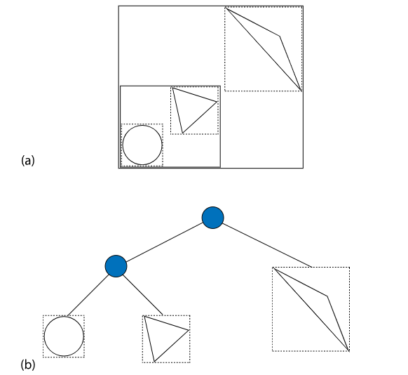
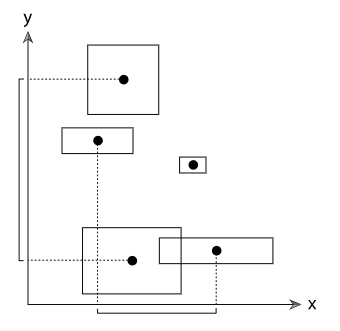
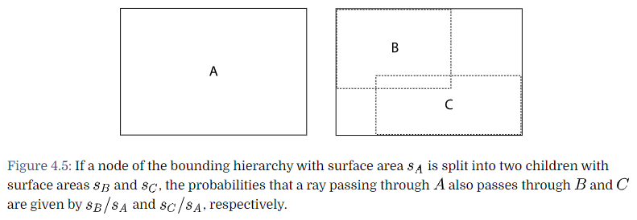
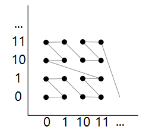
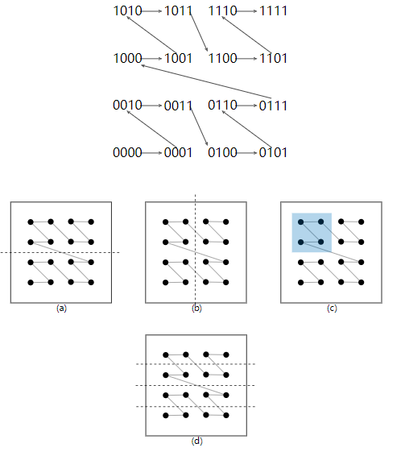
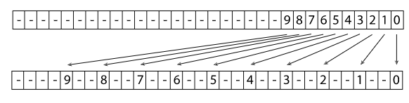

# Primitives and Intersection Acceleration

要直接呈现的`shape`由`GeometricPrimitive类`表示。这个类将`shape`与其外观属性的描述组合在一起。为了使pbrt的几何和渲染部分能够清晰地分开，这些外观属性被封装在`Material类`中，这将在第9章中描述。

`TransformedPrimitive类`处理了`Shapes`在场景中的两个更普遍的用途：带有==动画变换矩阵==的`shapes`和==对象实例化==。

本章还介绍了`Aggregate类`，它代表了一个可以容纳许多基元的容器。==pbrt==使用这个类作为加速结构的**基础数据结构**，这有助于减少测试射线与场景中所有对象的交集的复杂性。本章描述了两个加速器的实现，一个是==BVHAccel==，基于在场景中物体周围建立一个**层次边界框**，另一个是==KdTreeAccel==，基于**自适应递归空间细分**。虽然已经提出了许多其他的加速结构，但今天几乎所有的射线示踪器都使用这两种结构之一。本章末尾的进一步阅读部分对其他可能性有广泛的参考。


## 1. 基元接口和几何基元

抽象的`Primitive`类是几何处理和渲染子系统之间的桥梁。

```c++
class Primitive {
public: 
       virtual ~Primitive();
       virtual Bounds3f WorldBound() const = 0;
       virtual bool Intersect(const Ray &r, SurfaceInteraction *) const = 0;
       virtual bool IntersectP(const Ray &r) const = 0;
       virtual const AreaLight *GetAreaLight() const = 0;
       virtual const Material *GetMaterial() const = 0;
       virtual void ComputeScatteringFunctions(SurfaceInteraction *isect,
           MemoryArena &arena, TransportMode mode,
           bool allowMultipleLobes) const = 0;
};
```

第一个方法获得世界坐标下的包围盒，最重要的用途之一是将基元置于加速数据结构之下。

接下来的两个方法提供了**射线相交测试**。这两个基类的一个区别是`Shape::Intersect()`在`Float *输出变量`中返回沿着光线到交点的参数距离，而Primitive::Intersect()负责在找到交点时用这个值更新`ray::tMax`。

在找到交点时，基元的`Intersect()`方法也负责初始化附加的`SurfaceInteraction成员变量`，包括指向**射线击中的基元**的指针。

```c++
<<SurfaceInteraction Public Data>>+=  
const Primitive *primitive = nullptr;
```

当这个基元是发光材质时，`AreaLight()`指向一个区域灯，描述此基元的发光贡献，否则为空。

当`GetMaterial()`返回空时，**忽略与基元的射线交点**；基元的功能只是为**参与的介质**勾勒出一个空间。这个方法也被用来通过比较它们的材质指针，来检查两条射线是否相交于同一个对象。

第三个与材料相关的方法，`ComputeScatteringFunctions()`，初始化在表面交点上**材料的光散射特性的表示**。BSDF对象描述了交点处的**局部光散射特性**。其中`TransportMode`参数指明交点处的光追路径起源于相机，还是光源。

该点的**BSDF**和**BSSRDF指针**存储在传递给`ComputeScatteringFunctions()`的`SurfaceInteraction`中：

```c++
<<SurfaceInteraction Public Data>>+=  
BSDF *bsdf = nullptr;
BSSRDF *bssrdf = nullptr;
```

### 几何基元

==GeometricPrimitive类==表示场景中的单个`shape`（如球体）。在用户提供的场景描述中，为每个`shape`分配一个`GeometricPrimitive`。

```c++
class GeometricPrimitive : public Primitive {
public:
       virtual Bounds3f WorldBound() const;
       virtual bool Intersect(const Ray &r, SurfaceInteraction *isect) const;
       virtual bool IntersectP(const Ray &r) const;
       GeometricPrimitive(const std::shared_ptr<Shape> &shape,
               const std::shared_ptr<Material> &material,
               const std::shared_ptr<AreaLight> &areaLight,
               const MediumInterface &mediumInterface)
           : shape(shape), material(material), areaLight(areaLight),
             mediumInterface(mediumInterface) {
       }
       const AreaLight *GetAreaLight() const;
       const Material *GetMaterial() const;
       void ComputeScatteringFunctions(SurfaceInteraction *isect, MemoryArena &arena,
           TransportMode mode, bool allowMultipleLobes) const;

private:
       std::shared_ptr<Shape> shape;
       std::shared_ptr<Material> material;
       std::shared_ptr<AreaLight> areaLight;
       MediumInterface mediumInterface;
};
```

多出来的是：==MediumInterface属性==对基元内部和外部参与媒体的信息进行编码。

==Primitive接口==的大部分与几何处理有关的方法都只是转发到相应的**Shape方法**。例如，`GeometricPrimitive::Intersect()`调用其封装的`Shape::Intersect()`方法来做实际的交点测试，并初始化一个`SurfaceInteraction`来描述交点。它还使用返回的**参数化命中距离**来更新`Ray::tMax`成员。在 `Ray::tMax `中存储到最接近交点的距离的好处是，这可以轻松地避免对沿射线的任何基元执行交点测试，这些基元比任何已找到的交点更远。

```c++
bool GeometricPrimitive::Intersect(const Ray &r,   SurfaceInteraction *isect) const {
        Float tHit;
        if (!shape->Intersect(r, &tHit, isect))
            return false;
        r.tMax = tHit;
        isect->primitive = this;
        //Initialize SurfaceInteraction::mediumInterface after Shape intersection
        if (mediumInterface.IsMediumTransition())
            isect->mediumInterface = mediumInterface;
        else
            isect->mediumInterface = MediumInterface(r.medium);
        return true;
}
```

### TransformedPrimitive：对象实例化和动画基元

`TransformedPrimitive` 拥有一个基元，还包括一个 `AnimatedTransform`，它被注入到**底层基元**与其**在场景中的表示**之间。这种额外的变换实现了两个有用的功能：==对象实例化==和==具有动画变换的基元==。

回想一下，第3章的`shape`本身就有**对象到世界的变换**应用于它们。如果一个`shape`被一个`TransformedPrimitive`所持有，那么`shape`的世界空间概念并不是实际的场景世界空间——只有在`TransformedPrimitive`的变换也被应用之后，`shape`才真正在世界空间中。对于这里的应用来说，`shape`完全不知道被应用的额外变换是有意义的。对于动画`shape`来说，在这里将所有动画变换的处理隔离到一个类中，比要求所有`shape`都支持` AnimatedTransform `要简单得多。同样，对于实例基元，让`shape`知道所有实例变换的作用有限：我们不希望 TriangleMesh 为每个实例变换制作一份顶点位置的副本，并将它们全部变换到世界空间，因为这将否定对象实例化所节省的内存。

```c++
class TransformedPrimitive : public Primitive {
public:
       TransformedPrimitive(std::shared_ptr<Primitive> &primitive,
               const AnimatedTransform &PrimitiveToWorld)
           : primitive(primitive), PrimitiveToWorld(PrimitiveToWorld) { }
       bool Intersect(const Ray &r, SurfaceInteraction *in) const;
       bool IntersectP(const Ray &r) const;
       const AreaLight *GetAreaLight() const { return nullptr; }
       const Material *GetMaterial() const { return nullptr; }
       void ComputeScatteringFunctions(SurfaceInteraction *isect, MemoryArena &arena,
           TransportMode mode, bool allowMultipleLobes) const {
           Severe("TransformedPrimitive::ComputeScatteringFunctions() shouldn't be called");
       }
       Bounds3f WorldBound() const { 
           return PrimitiveToWorld.MotionBounds(primitive->WorldBound());
       }

private:
       std::shared_ptr<Primitive> primitive;
       const AnimatedTransform PrimitiveToWorld;
};
```

`TransformedPrimitive`的关键任务是将它所实现的**Primitive接口**和**它持有指针的Primitive**进行桥接，核算它所持有的附加变换的效果。`TransformedPrimitive`的`PrimitiveToWorld`变换定义了从这个**特定几何体实例的坐标系**到**世界空间**的变换。如果基元成员有自己的变换，那应该解释为从对象空间到`TransformedPrimitive`的坐标系的变换。完整的向世界空间的转换需要这两种转换一起进行。

因此，`TransformedPrimitive::Intersect()`方法将给定的射线转换为`primitives坐标系`，并将转换后的射线传递到其`Intersect()例程`。如果发现命中，转换后的射线的`tMax值`需要复制到**原始射线**`r`中。

```c++
bool TransformedPrimitive::Intersect(const Ray &r, 
           SurfaceInteraction *isect) const {
        //Compute ray after transformation by PrimitiveToWorld>> 
        Transform InterpolatedPrimToWorld;
        PrimitiveToWorld.Interpolate(r.time, &InterpolatedPrimToWorld);
        Ray ray = Inverse(InterpolatedPrimToWorld)(r);

        if (!primitive->Intersect(ray, isect))
            return false;
        r.tMax = ray.tMax;
        //Transform instance’s intersection data to world space>> 
        if (!InterpolatedPrimToWorld.IsIdentity())
            *isect = InterpolatedPrimToWorld(*isect);
        return true;
}
```

`TransformedPrimitive`的`GetAreaLight()`、`GetMaterial()`和`ComputeScatteringFunctions()`方法不应该被调用。射线实际击中的基元的相应方法应该被调用。


## 2. Aggregates

==加速结构==是任何光线追踪器的==核心组件==之一。如果没有算法来减少不必要的**射线交点测试**的数量，那么追踪一条射线通过场景所需的时间将与场景中基元的数量成**线性关系**，因为射线需要依次对每个基元进行测试，以找到最接近的交点。然而，在大多数场景中，这样做是极其浪费的，因为射线根本不会经过绝大多数基元。**加速结构的目标是允许快速、同时拒绝基元组，并对搜索过程进行排序，以便很可能首先找到附近的交点，从而有可能忽略较远的交点**。

由`ray–object intersections`在射线跟踪器中占了大部分的执行时间，因此对射线交汇加速的算法进行了大量的研究。

大体上，这个问题主要有两种方法：==空间细分==和==对象细分==。

- ==空间细分算法==将三维空间分解为区域，并记录基元与哪些区域重叠。在某些算法中，还可根据重叠的基元数量对区域进行**自适应细分**。当需要找到射线交集时，将计算射线经过的这些区域的序列，并仅测试重叠区域中的基元是否有交集。
- ==对象细分==是基于将场景中的对象逐步分解成更小的组成对象集。例如，一个房间的模型可能被分解为四面墙、一个天花板和一把椅子。如果一条射线不与房间的边界体积相交，那么它的所有基元都可以被剔除。否则，射线将针对它们中的每一个进行测试。例如，如果它击中了椅子的边界体积，那么它可能会针对椅子的每条腿、座位和背部进行测试。否则，椅子就会被剔除。
- 本章中的==KdTreeAccel==是基于空间细分的方法，==BVHAccel==是基于对象细分的方法。、

==Aggregate类==提供了一个将多个`Primitive对象`分组的接口。因为 `Aggregate `本身实现了 `Primitive `接口，所以在 pbrt 的其他地方不需要为**交集加速**提供特殊支持。积分器可以像场景中只有一个`Primitive`一样编写，检查交集，而不需要关心如何真正找到它们。此外，通过这种方式实现加速，只需向 pbrt 添加一个新的` Aggregate 基元`，就可以很容易地试验新的加速技术。

```c++
class Aggregate : public Primitive {
public:
       const AreaLight *GetAreaLight() const;
       const Material *GetMaterial() const;
       void ComputeScatteringFunctions(SurfaceInteraction *isect,
           MemoryArena &arena, TransportMode mode, bool allowMultipleLobes) const;

};
```

与`TransformedPrimitives`一样，Aggregate的`intersection`方法将`SurfaceInteraction::primitive`指针设置为射线实际击中的基元，而不是本身持有的基元。因为pbrt使用这个指针来获取被击中的基元的信息，所以Aggregates的GetAreaLight()、GetMaterial()和ComputeScatteringFunctions()方法永远不应该被调用


## 3. Bounding Volume Hierarchies

==边界体积层次结构==(BVHs)是一种基于**基元细分**的射线交汇加速方法，其中基元被分割成**不相干集**的层次结构。图 4.2 显示了一个简单场景的**BVHs**。基元存储在叶子中，每个节点都存储了其下方节点中基元的边界框。



基元细分的一个特点是：每个基元在层次结构中只出现一次（空间细分则相反）。`BVHs`比`kd-tree`更有效，`kd-tree`通常比`BVHs`提供更快的射线相交测试，但需要更长的时间来构建；另一方面，与`kd树`相比，`BVHs`通常在数值上更稳健，更不容易因**舍入误差**而错过相交。

BVH加速器定义在`accelerator`中，除了要存储的基元和**基元的最大数量**外，其构造函数还取一个**枚举值**，用于描述在分割基元以构建树时，要使用的**四种算法**中的哪一种。默认值 ==SAH== 表示应使用第 4.3.2 节中讨论的基于 "表面积启发式 "的算法。另一种方法==HLBVH==（在4.3.3节中讨论）可以更有效地构建树（也更容易并行化），但它构建的树没有SAH那么有效。其余两种方法使用更少的计算来构建树，但创建的树质量相当低。

```c++
<<BVHAccel Public Types>>= 
enum class SplitMethod { SAH, HLBVH, Middle, EqualCounts };

<<BVHAccel Method Definitions>>= 
BVHAccel::BVHAccel(const std::vector<std::shared_ptr<Primitive>> &p,
         int maxPrimsInNode, SplitMethod splitMethod)
     : maxPrimsInNode(std::min(255, maxPrimsInNode)), primitives(p),
       splitMethod(splitMethod) {
    if (primitives.size() == 0)
        return;
    <<Build BVH from primitives>> 
       <<Initialize primitiveInfo array for primitives>> 
          std::vector<BVHPrimitiveInfo> primitiveInfo(primitives.size());
          for (size_t i = 0; i < primitives.size(); ++i)
              primitiveInfo[i] = { i, primitives[i]->WorldBound() };

       <<Build BVH tree for primitives using primitiveInfo>> 
          MemoryArena arena(1024 * 1024);
          int totalNodes = 0;
          std::vector<std::shared_ptr<Primitive>> orderedPrims;
          BVHBuildNode *root;
          if (splitMethod == SplitMethod::HLBVH)
              root = HLBVHBuild(arena, primitiveInfo, &totalNodes, orderedPrims);
          else
              root = recursiveBuild(arena, primitiveInfo, 0, primitives.size(),
                                    &totalNodes, orderedPrims);
          primitives.swap(orderedPrims);
          

       <<Compute representation of depth-first traversal of BVH tree>> 
          nodes = AllocAligned<LinearBVHNode>(totalNodes);
          int offset = 0;
          flattenBVHTree(root, &offset);
}
<<BVHAccel Private Data>>= 
const int maxPrimsInNode;
const SplitMethod splitMethod;
std::vector<std::shared_ptr<Primitive>> primitives;
```

### BVH构建

首先，是BVH基元信息结构体：

```c++
struct BVHPrimitiveInfo {
    BVHPrimitiveInfo(size_t primitiveNumber, const Bounds3f &bounds)
        : primitiveNumber(primitiveNumber), bounds(bounds),
          centroid(.5f * bounds.pMin + .5f * bounds.pMax) { }
    size_t primitiveNumber;
    Bounds3f bounds;
    Point3f centroid;
};
```

现在可以开始构建层次结构。如果选择了**HLBVH构造算法**，就会调用`HLBVHBuild()`来构建树。对这些函数的初始调用会传递所有要存储在树中的基元。它们返回一个指向树根的指针，该指针用`BVHBuildNode`结构表示。树节点应该用提供的`MemoryArena`进行分配，创建的总数应该存储在`*totalNodes`中。

树构建过程的一个重要副作用是，通过 `orderedPrims` 参数返回一个新的**基元指针数组**；该数组存储基元，以便**叶节点中的基元**占据数组中的连续范围。建树后，它将与**原始基元数组**交换。

```c++
<<Build BVH tree for primitives using primitiveInfo>>= 
MemoryArena arena(1024 * 1024);
int totalNodes = 0;
std::vector<std::shared_ptr<Primitive>> orderedPrims;
BVHBuildNode *root;
if (splitMethod == SplitMethod::HLBVH)
    root = HLBVHBuild(arena, primitiveInfo, &totalNodes, orderedPrims);
else
    root = recursiveBuild(arena, primitiveInfo, 0, primitives.size(),
                          &totalNodes, orderedPrims);
primitives.swap(orderedPrims);
```

每一个`BVHBuildNode`都表示BVH的一个节点。除了左右子树和`Bound`，**内部节点**还记录了坐标轴，沿着该坐标轴，基元被划分为分布给它们的两个子节点，此信息用于改进**遍历算法**的性能。`firstPrimOffset, nPrimitives;`被叶子节点拿来记录它所存储的基元：

```c++
struct BVHBuildNode {
    <<BVHBuildNode Public Methods>> 
    Bounds3f bounds;
    BVHBuildNode *children[2];
    int splitAxis, firstPrimOffset, nPrimitives; //orderPrim数组中的偏移量，和此节点重叠的基元数
};
```

初始化叶子节点：

```c++
void InitLeaf(int first, int n, const Bounds3f &b) {
    firstPrimOffset = first;
    nPrimitives = n;
    bounds = b;
    children[0] = children[1] = nullptr;
}
```

初始化内部节点：

```c++
void InitInterior(int axis, BVHBuildNode *c0, BVHBuildNode *c1) {
    children[0] = c0;
    children[1] = c1;
    bounds = Union(c0->bounds, c1->bounds);
    splitAxis = axis;
    nPrimitives = 0;
}
```

`recursiveBuild()`是一种类似分治的递归算法，核心是怎么划分成两部分。`totalNodes` 跟踪已创建的 BVH 节点的总数；使用这个数字，以便稍后可以准确地分配更紧凑的 `LinearBVHNodes` 的正确数量。最后，`OrderPrims 数组`用于存储基元引用，因为基元被存储在树的叶子节点中。这个数组最初是空的；当创建叶子节点时，递归构建会将与其重叠的基元添加到数组的末尾，使得叶子节点只需将一个**偏移量**存储到这个数组中，并将一个基元计数代表与其重叠的基元集。回顾一下，当树构建完成后，`BVHAccel::primitives` 会被这里创建的有序基元数组所取代

```c++
BVHBuildNode *BVHAccel::recursiveBuild(MemoryArena &arena,
        std::vector<BVHPrimitiveInfo> &primitiveInfo, int start,
        int end, int *totalNodes,
        std::vector<std::shared_ptr<Primitive>> &orderedPrims) {
    BVHBuildNode *node = arena.Alloc<BVHBuildNode>();
    (*totalNodes)++;
    //Compute bounds of all primitives in BVH node
       Bounds3f bounds;
       for (int i = start; i < end; ++i)
           bounds = Union(bounds, primitiveInfo[i].bounds);

    int nPrimitives = end - start;
    if (nPrimitives == 1) {
        <<Create leaf BVHBuildNode>> 
           int firstPrimOffset = orderedPrims.size();
           for (int i = start; i < end; ++i) {
               int primNum = primitiveInfo[i].primitiveNumber;
               orderedPrims.push_back(primitives[primNum]);
           }
           node->InitLeaf(firstPrimOffset, nPrimitives, bounds);
           return node;

    } else {
        <<Compute bound of primitive centroids, choose split dimension dim>> 
           Bounds3f centroidBounds;
           for (int i = start; i < end; ++i)
               centroidBounds = Union(centroidBounds, primitiveInfo[i].centroid);
           int dim = centroidBounds.MaximumExtent();

        <<Partition primitives into two sets and build children>> 
           int mid = (start + end) / 2;
           if (centroidBounds.pMax[dim] == centroidBounds.pMin[dim]) {
               <<Create leaf BVHBuildNode>> 
               int firstPrimOffset = orderedPrims.size();
               for (int i = start; i < end; ++i) {
                   int primNum = primitiveInfo[i].primitiveNumber;
                   orderedPrims.push_back(primitives[primNum]);
               }
               node->InitLeaf(firstPrimOffset, nPrimitives, bounds);
               return node;
           } else {
               <<Partition primitives based on splitMethod>> 
               node->InitInterior(dim,
                                  recursiveBuild(arena, primitiveInfo, start, mid,
                                                 totalNodes, orderedPrims),
                                  recursiveBuild(arena, primitiveInfo, mid, end,
                                                 totalNodes, orderedPrims));
           }
    }
    return node;
}
```

在这里，我们选择三个坐标轴中的一个用于对基元进行**分区**。我们选择与**最大范围**相关联的轴。(另一种方法是尝试所有三个轴，并选择一个给出最好的结果，但在实践中，这种方法工作得很好。)这种方法在许多场景中都有很好的分割效果;图4.3说明了该策略。



这里分区的一般目标是选择一个基元分区，该分区的两个**结果基元集**的**边界框**不会有太多的重叠——如果有大量的重叠，那么在遍历树时，将更大可能需要遍历两个子树。具体怎么分区，这里就不展开` <<Partition primitives based on splitMethod>> `，后面进行描述。

一个简单的 `splitMethod` 是 ==Middle==，它首先沿**分割轴**计算**基元质点**的中点。该方法在片段  `<<Partition primitives through node’s midpoint>>`中实现。根据基元的质点是在中点之上还是之下，基元被分为两组。`std::partition() `C++ 标准库函数很容易完成这种分割，它接收一个数组中的元素范围和一个比较函数，并对数组中的元素进行排序，使所有对给定谓词函数返回真值的元素出现在该范围内。` std::partition() `返回一个指向**对谓词有假值**的第一个元素的指针，它被转换为一个偏移量进入 `primitiveInfo` 数组，这样我们就可以将其传递给递归调用。图4.4说明了这种方法，包括这种方法好用和不好用的情况。

```c++
Float pmid = (centroidBounds.pMin[dim] + centroidBounds.pMax[dim]) / 2;
BVHPrimitiveInfo *midPtr =
    std::partition(&primitiveInfo[start], &primitiveInfo[end-1]+1,
        [dim, pmid](const BVHPrimitiveInfo &pi) {
            return pi.centroid[dim] < pmid;
        });
mid = midPtr - &primitiveInfo[0];
if (mid != start && mid != end)
    break;
```

如果基元都有很大的重叠边界框，则此拆分方法可能无法将基元分成两组。在这种情况下，执行过程会落入 `SplitMethod::EqualCounts` 方法中再次尝试。这个方法很简单，五五开——在指定轴下，较小质点坐标的基元一组，而较大的一组。这个方案也可以通过标准库调用 `std::nth_element()`轻松实现。它需要一个开始、中间和结束的指针，以及一个比较函数。它对数组进行排序，使中间指针处的元素是在数组完全排序的情况下会出现的元素，并且使中间元素之前的所有元素都比中间元素小，而中间元素之后的所有元素都比它大。

```c++
<<Partition primitives into equally sized subsets>>= 
mid = (start + end) / 2;
std::nth_element(&primitiveInfo[start], &primitiveInfo[mid], 
                 &primitiveInfo[end-1]+1,
                 [dim](const BVHPrimitiveInfo &a, const BVHPrimitiveInfo &b) { 
                     return a.centroid[dim] < b.centroid[dim];
         });
```

### 表面积启发式

==SAH模型==估计了执行**射线交汇测试**的计算费用，包括遍历**树的节点**所花费的时间，以及对基元进行**特定分区**花费的时间。构建加速结构的算法就可以遵循总成本最小化的目标。通常情况下，使用==贪婪算法==，使被单独构建的层次结构的**每个单节点的成本**最小化。

SAH成本模型背后的想法很直接：在构建**自适应加速结构**的任何一点上，我们可以只为当前区域和几何体创建一个叶子节点。在这种情况下，任何经过这个区域的射线都将对所有重叠的基元进行测试，并将产生以下成本：
$$
\sum_{i=1}^{N}t_{isect}(i),
$$
另一种选择是分割该地区。在这种情况下，射线会产生成本：（P是通过子节点区域的概率，且可以假设所有基元的`t`都一样）
$$
c(A,B)=t_{trav}+p_A\sum_{i=1}^{N_A}t_{isect}(a_i)+p_B\sum_{i=1}^{N_B}t_{isect}(b_i),
$$
在通过B的同时，也通过A的概率，和他们的表面积之比相关：
$$
p(A|B)=\frac{s_A}{s_B}
$$
这样，考虑下图，对于一块区域A，射线通过它的同时，还通过两个子区域`B`和`C`的概率可以轻松计算：



通过考虑多个候选分区，找到沿**所选轴**的基元分区，该分区可提供最小的 **SAH 成本估计**。然而，一旦它细化到一小部分基元，实现就会切换到**分区为同等大小的子集**。此时应用 SAH 的增量计算成本是不值得的。

```c++
<<Partition primitives using approximate SAH>>= 
if (nPrimitives <= 4) {
    <<Partition primitives into equally sized subsets>> //已知，上面有的`equal`方法
} else {
    <<Allocate BucketInfo for SAH partition buckets>> 
    <<Initialize BucketInfo for SAH partition buckets>> 
    <<Compute costs for splitting after each bucket>> 
    <<Find bucket to split at that minimizes SAH metric>> 
    <<Either create leaf or split primitives at selected SAH bucket>> 
}
```

这里的实现将沿轴将范围划分为少量相同范围的桶。然后它只考虑桶边界上的分区。这种方法比考虑所有的分区更有效，而通常仍然产生几乎同样有效的分区。

```c++
<<Allocate BucketInfo for SAH partition buckets>>= 
constexpr int nBuckets = 12;
struct BucketInfo {
    int count = 0;
    Bounds3f bounds;
};
BucketInfo buckets[nBuckets];
```

对于范围内的每个原语，我们确定其质心所在的桶，并更新桶的边界以包含原语的边界。

```c++
<<Initialize BucketInfo for SAH partition buckets>>= 
for (int i = start; i < end; ++i) {
    int b = nBuckets * 
        centroidBounds.Offset(primitiveInfo[i].centroid)[dim];
    if (b == nBuckets) b = nBuckets - 1;
    buckets[b].count++;
    buckets[b].bounds = Union(buckets[b].bounds, primitiveInfo[i].bounds);
}
```

对于每个桶，我们现在已经有了基元数和各自边界框。我们希望使用 SAH 来估计在每个桶边界进行拆分的成本。下面的片段循环了所有的 bucket，并初始化 cost[i] 数组，以存储在第 i 个 bucket 之后进行拆分的估计 SAH 成本。它没有考虑最后一个 bucket 之后的拆分，因为根据定义，最后一个 bucket 不会拆分基元）。

我们任意将**相交估计代价**设为`1`，然后将**遍历估计代价**设为`1/8`。（它们中的一个总是可以设置为1，因为估计遍历和相交代价的相对大小，而不是绝对大小决定了它们的效果）。

```c#
<<Compute costs for splitting after each bucket>>= 
Float cost[nBuckets - 1];
for (int i = 0; i < nBuckets - 1; ++i) {
    Bounds3f b0, b1;
    int count0 = 0, count1 = 0;
    for (int j = 0; j <= i; ++j) {
        b0 = Union(b0, buckets[j].bounds);
        count0 += buckets[j].count;
    }
    for (int j = i+1; j < nBuckets; ++j) {
        b1 = Union(b1, buckets[j].bounds);
        count1 += buckets[j].count;
    }
    cost[i] = .125f + (count0 * b0.SurfaceArea() +
                       count1 * b1.SurfaceArea()) / bounds.SurfaceArea() * 1.f;
}
```

然后，就是寻找最低`cost`：

```c++
<<Find bucket to split at that minimizes SAH metric>>= 
Float minCost = cost[0];
int minCostSplitBucket = 0;
for (int i = 1; i < nBuckets - 1; ++i) {
    if (cost[i] < minCost) {
        minCost = cost[i];
        minCostSplitBucket = i;
    }
}
```

最后，是进行抉择：递归分区，还是创建叶子节点。创建叶子节点的开销默认是相交数，所以，只有当当前最小分区开销小于叶子节点开销，且分区的基元数大于阈值，才创建分区：

```c++
<<Either create leaf or split primitives at selected SAH bucket>>= 
Float leafCost = nPrimitives;
if (nPrimitives > maxPrimsInNode || minCost < leafCost) {
    BVHPrimitiveInfo *pmid = std::partition(&primitiveInfo[start],
        &primitiveInfo[end-1]+1, 
        [=](const BVHPrimitiveInfo &pi) {
            int b = nBuckets * centroidBounds.Offset(pi.centroid)[dim];
            if (b == nBuckets) b = nBuckets - 1;
            return b <= minCostSplitBucket;
        });
    mid = pmid - &primitiveInfo[0];
} else {
    <<Create leaf BVHBuildNode>> 
}
```

### Linear Bounding Volume Hierarchies

虽然使用==表面面积启发式方法==构建**包围体层次结构**得到了非常好的结果，但这种方法确实有两个缺点:首先，许多`pass`在场景基元上被用来计算树的所有层次的**SAH成本**。其次，自顶向下的BVH构造很难很好地并行化。

==线性包围体层次结构==（LBVHs）被开发来解决这些问题。在**LBVHs**中，树是通过少量的轻量`pass`来构建的；树的构造时间与基元的数量成**线性关系**。此外，该算法快速地将原语划分成可以独立处理的簇。这种处理可以很容易地并行化，并且非常适合GPU实现。

LBVHs背后的==关键思想是把BVH的构造变成一个排序问题==。由于没有单一的排序函数来对多维数据进行排序，LBVHs是基于`Morton`编码的，Morton编码将n维度上的邻近点映射到沿着一维线上的邻近点上，那里有一个明显的排序函数。在原语排序之后，空间附近的原语簇位于已排序数组的连续段中。

`Morton`编码基于一个简单的变换：给定一个n维坐标，它们的**莫顿编码**表示是通过以`2`为基底的==坐标位交错==来找到的，例如对于$(x,y)$，其编码值如下：
$$
...y_3x_3y_2x_2y_1x_1y_0x_0.
$$
参见下图，可以知道莫顿排序类似于`Z`，而且在空间上相近的点，在序列中也挨着：



一种解释这些基于位的属性的方法是使用morton编码的值，给定一组已排序的Morton索引，我们可以通过对数组中的每个端点执行二分搜索来找到图(c)所示区域对应的点的范围。



我们将构建一个分层线性边界体积层次结构(==HLBVH==)。使用这种方法，基于morton曲线的聚类首先用于为层次结构的较低层次构建树(在下文中称为`treelets`)，然后使用**表面积启发式**创建树的最高层次。`HLBVHBuild()`方法实现了这种方法，并返回结果树的根节点。

```c++
<<BVHAccel Method Definitions>>+=  
BVHBuildNode *BVHAccel::HLBVHBuild(MemoryArena &arena, 
        const std::vector<BVHPrimitiveInfo> &primitiveInfo,
        int *totalNodes,
        std::vector<std::shared_ptr<Primitive>> &orderedPrims) const {
    <<Compute bounding box of all primitive centroids>> 
    <<Compute Morton indices of primitives>> 
    <<Radix sort primitive Morton indices>> 
    <<Create LBVH treelets at bottom of BVH>> 
    <<Create and return SAH BVH from LBVH treelets>> 
}
```

因为Morton编码操作在整数坐标上，我们首先需要限定所有基元的质心，以便我们可以量化关于总体边界的质心位置。

```c++
<<Compute bounding box of all primitive centroids>>= 
Bounds3f bounds;
for (const BVHPrimitiveInfo &pi : primitiveInfo)
    bounds = Union(bounds, pi.centroid);
```

并行莫顿编码：

```c++
<<Compute Morton indices of primitives>>= 
std::vector<MortonPrimitive> mortonPrims(primitiveInfo.size());
ParallelFor(
    [&](int i) {
        <<Initialize mortonPrims[i] for ith primitive>> 
           constexpr int mortonBits = 10;
           constexpr int mortonScale = 1 << mortonBits;
           mortonPrims[i].primitiveIndex = primitiveInfo[i].primitiveNumber;
           Vector3f centroidOffset = bounds.Offset(primitiveInfo[i].centroid);
           mortonPrims[i].mortonCode = EncodeMorton3(centroidOffset * mortonScale);

    }, primitiveInfo.size(), 512);
```

```c++
<<BVHAccel Local Declarations>>+=  
    struct MortonPrimitive {
        int primitiveIndex;
        uint32_t mortonCode;
    };
```

我们为`x,y,z`各分配了10位，总共30位，因为质点在包围盒中的`offset`的范围是`[0,1]`，所以需要乘以$2^{10}$以匹配`10位`，来得到整型坐标。为了计算3D Morton编码，首先我们将定义一个辅助函数：`LeftShift3()`接受一个32位值，并返回将第`i`位移到第`3i`位的结果，在其他位保留0。图4.9说明了该操作：



```c++
<<BVHAccel Utility Functions>>= 
    inline uint32_t LeftShift3(uint32_t x) {
        if (x == (1 << 10)) --x;
        x = (x | (x << 16)) & 0b00000011000000000000000011111111;
        x = (x | (x <<  8)) & 0b00000011000000001111000000001111;
        x = (x | (x <<  4)) & 0b00000011000011000011000011000011;
        x = (x | (x <<  2)) & 0b00001001001001001001001001001001;
        return x;
    }
```

然后，编码函数就很简单了：

```c++
<<BVHAccel Utility Functions>>+=  
    inline uint32_t EncodeMorton3(const Vector3f &v) {
        return (LeftShift3(v.z) << 2) | (LeftShift3(v.y) << 1) |
                LeftShift3(v.x);
    }
```

一旦计算了Morton索引，我们将使用基数排序，根据Morton索引值对`mortonPrims`排序。我们发现，对于BVH的构造，我们的基数排序实现明显比使用系统标准库中的`std::sort()`要快。

```c++
<<Radix sort primitive Morton indices>>= 
	RadixSort(&mortonPrims);
```

`bitsPerPass`设置了每次处理的位数；值为6时，我们有5次机会对30位进行排序。

```c++
<<BVHAccel Utility Functions>>+= 
    static void RadixSort(std::vector<MortonPrimitive> *v) {
        std::vector<MortonPrimitive> tempVector(v->size());
        constexpr int bitsPerPass = 6;
        constexpr int nBits = 30;
        constexpr int nPasses = nBits / bitsPerPass;
        for (int pass = 0; pass < nPasses; ++pass) {
            <<Perform one pass of radix sort, sorting bitsPerPass bits>> 
        }
        <<Copy final result from tempVector, if needed>> 
    }
```

具体如何做，见[书](http://www.pbr-book.org/3ed-2018/Primitives_and_Intersection_Acceleration/Bounding_Volume_Hierarchies.html)

给定已排序的原语数组，我们将找到具有附近质心的原语簇，然后在每个簇中的原语上创建**LBVH**。这个步骤很适合并行化，因为通常有许多集群，每个集群都可以独立处理。

```c++
<<Create LBVH treelets at bottom of BVH>>= 
	<<Find intervals of primitives for each treelet>> 
	<<Create LBVHs for treelets in parallel>> 
```

每个基元簇由` LBVHTreelet `表示。它对集群中第一个基元的 mortonPrims 数组中的**索引**以及后续基元的**数量**进行编码。

```c++
<<BVHAccel Local Declarations>>+=  
    struct LBVHTreelet {
       int startIndex, nPrimitives;
       BVHBuildNode *buildNodes;
    };
```

```c++
<<Find intervals of primitives for each treelet>>= 
    std::vector<LBVHTreelet> treeletsToBuild;
    for (int start = 0, end = 1; end <= (int)mortonPrims.size(); ++end) {
        uint32_t mask = 0b00111111111111000000000000000000;
        if (end == (int)mortonPrims.size() ||
            ((mortonPrims[start].mortonCode & mask) !=
             (mortonPrims[end].mortonCode & mask))) {
            <<Add entry to treeletsToBuild for this treelet>> 
               int nPrimitives = end - start;
               int maxBVHNodes = 2 * nPrimitives - 1;
               BVHBuildNode *nodes = arena.Alloc<BVHBuildNode>(maxBVHNodes, false);
               treeletsToBuild.push_back({start, nPrimitives, nodes});

            start = end;
        }
    }
```

以上，相当于划分区域，我们取高`12`位为1，则当低位无论如何变化，我们的判断都不会为真，所以说，这里我们将这个区域划分成了$2^{12}=4096$个空间`cells`，每个维度是$2^4=16$个`cells`。

构建LBVH的工作线程有两个地方必须相互协调。首先，需要计算所有LBVHs中的节点总数，并通过传递给`HLBVHBuild()`的`totalNodes`指针返回。其次，当为`LBVHs`创建叶子节点时，需要orderedPrims数组的一个连续段来记录叶子节点中基元的索引。 Our implementation uses atomic variables for both—`atomicTotal` to track the number of nodes and `orderedPrimsOffset` for the index of the next available entry in `orderedPrims`.

```c++
<<Create LBVHs for treelets in parallel>>= 
    std::atomic<int> atomicTotal(0), orderedPrimsOffset(0);
    orderedPrims.resize(primitives.size());
    ParallelFor(
        [&](int i) {
            <<Generate ith LBVH treelet>> 
               int nodesCreated = 0;
               const int firstBitIndex = 29 - 12;
               LBVHTreelet &tr = treeletsToBuild[i];
               tr.buildNodes = 
                   emitLBVH(tr.buildNodes, primitiveInfo, &mortonPrims[tr.startIndex],
                            tr.nPrimitives, &nodesCreated, orderedPrims,
                            &orderedPrimsOffset, firstBitIndex);
               atomicTotal += nodesCreated;

        }, treeletsToBuild.size());
    *totalNodes = atomicTotal;
```

`emitLBVH()`算法实现了树状图的构建，该算法在空间的某个区域内取以质心为中心的原语，然后用分裂面将其依次分割，将当前空间区域沿其中一条轴线的中心分割成两半。

还剩下一点内容，Todo。


## 4. Kd-Tree Accelerator

