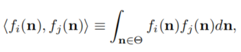
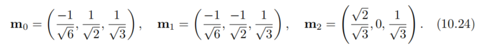
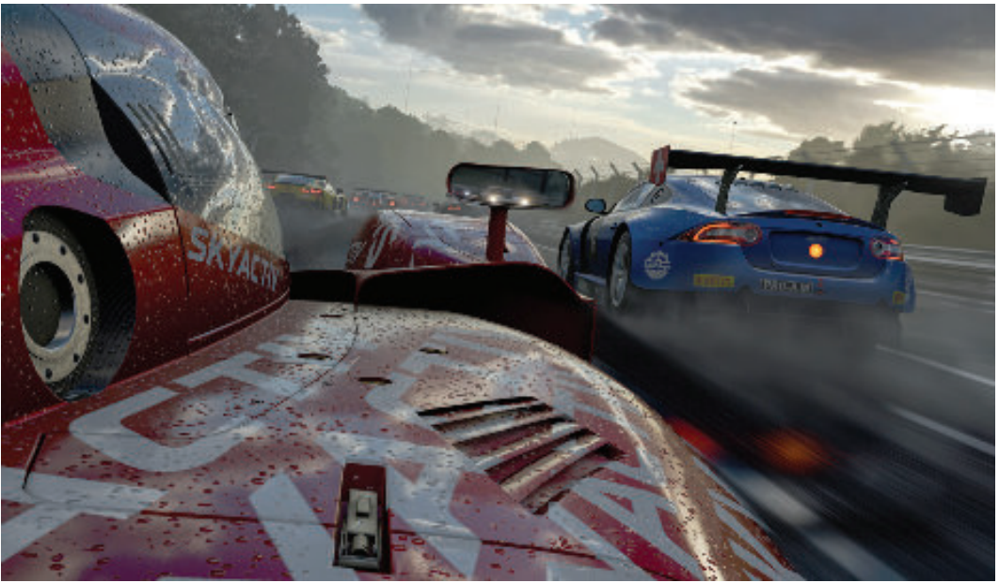

# Chapter 10——Local Illumination

[toc]

承接上文，我们无需对一个频率没有界限的渲染函数进行采样，可以进行预先积分`pre-integrate`；为了形成更真实的光照模型，我们需要在表面入射方向的半球上对BRDF求积分。而在实时领域内，我们倾向于对其求一个闭合解`closed-form solutions`或拟合解。

本章致力于探索这样的解决方案。通常，为了找到便宜的解决方案，我们需要对光的发射` light emitter`，BRDF进行近似。

## 1. Area Light Sources

光源主要由两种。第一种，` infinitesimal light sources`（punctual and directional），它的亮度由颜色c~light~表示（正对着光源的，白色的朗伯表面，对光源的反射光），它对v方向输出光的亮度的贡献为：$L_o(v)=\pi f(l_c,v)c_{light}(n\cdot l_c)$。第二种，区域光，其亮度由`radiance`$L_l$表示，它对v方向输出光的亮度的贡献为：对$f(l,v)L_l(n\cdot l)^+$进行w的积分。

==在实时领域中，经常在小光源（或punctual）上应用高粗糙度来模拟区域光，然而这是有问题的——它将材质属性与特定的照明设置结合起来了（高度耦合）==。

对于兰伯表面这样的特殊情况，使用点光源（替代区域光）是精确的。对于这样的表面，出射辐射率与辐照度成正比：
$$
L_o(v)=\frac{\rho _{ss}}{\pi}E \quad (10.2)
$$

向量辐照度：`vector irradiance`向量辐照度的概念是有用的，来了解辐照度E` irradiance`如何表现区域光的存在。向量辐照度是由G神提出的，称为光矢量`light vector`，并由A神进一步推广。==利用向量辐照度，可以将任意大小和形状的区域光，准确地转换为点光源或方向光源==

Imagine a distribution of radiance L~i~ coming into a point p in space。对于每一个以入射光l为中心的，无限小的立体角dl， a vector is constructed that is aligned with l and has a length equal to the (scalar) radiance incoming from that direction times dl。最后，所有向量相加得到==矢量辐照度E==：
$$
e(p)=\int_{l\in \Theta}{L_i(p,l)ldl}\quad (10.4)
$$

通过点积，向量辐照度可以用来计算，通过点p的、任意朝向的平面的净辐照度`net irradiance`:arrow_down:
$$
E(p,n)-E(p,-n)=n\cdot e(p)\quad (10.5)
$$
其中，n就是平面的法线。净辐照度对于渲染是没有用的。而大多数情况下（p和-n间的夹角大于90^o^），$E(p.-n)=0$，所以：
$$
E(p,n)=n\cdot e(p) \quad (10.6)
$$
彩色光在所有点上通常具有相同的相对光谱分布，这意味着我们可以将L~i~分解为颜色$c^,$和与波长无关的辐射分布$L_i^,$（10.7）

我们现在可以==将任意形状和大小的面积光源转换为方向光源，并且没有引入任何误差==。一个简单的例子：对于一个球形光（中心在$p_l$，半径是$r_l$，球上任意一点的辐射率是$L_l$），则可转化如下：（10.8）

区域光的近似：对于理想的郎伯平面，可以使用一个不基于物理，但有效的方法来近似区域光（之前的Fig 4）：`wrap lighting`。寒霜的一个实现如下：
$$
E=\pi c_{light}(\frac{(n\cdot l)+k_{wap}}{1+k_{wap}})^+ \quad (10.9)
$$
另一个简单的形式：
$$
E=\pi c_{light}(\frac{1+(n\cdot l)}{2})\quad(10.10)
$$

###  1.1 Glossy Materials

在光滑平面`Glossy surfaces`上，区域光的主要特征是高光，且高光的大小和形状，近似等于区域光（当然，边缘模糊）。（下图：左为修改的Phong模型，右为未修改的）

在实时渲染中，大多数区域光的模拟，都是使用对一个`Punctual Light`进行设置，来模拟其效果。

粗糙度重映射：最早的一个近似是虚幻中使用的`Mittring’s roughness modification`。基本思想：

+ 1，首先找到一个锥体，包含大多数入射到表面采样半球的辐照度；
+ 2，然后我们在镜面波瓣的周围，拟合一个类似的圆锥，包含大部分"BRDF":arrow_down:；
+ 3，这样做之后，我们可以通过找到一个具有不同粗糙度的BRDF波瓣，来近似光源和材料BRDF之间的卷积，该波瓣有一个相应的圆锥，其`solid angle `= 光源波瓣角 + 材料波瓣角。

基于这个原理，K神在GGX BRDF和球形区域光的情况下，对粗糙度进行了简单的调整：

这种近似的效果相当好，而且便宜，但==不适用于像镜子一样的材料==。这是因为镜面波瓣总是平滑的，不能模拟：区域光源在表面上的强烈反射，引起的高光（因为光滑，所以尾部信息不会丢失，所以这种平面能够反映波瓣的尾部）。而且，大多数微面BRDF模型的高光波瓣，都有一个较长的尾部，这使得==粗糙度重映射==`roughness remapping`的效果较差（毕竟用锥体进行了裁剪，失去了尾部的信息，如下图中:arrow_down:）。

most representative point：其基本思想是——使用一个基于渲染点而改变的光矢量`light vector`，来表示区域光。修改光矢量，使其朝向区域光的表面上，产生最大能量贡献的点（上图右:arrow_up:）。这个点在哪呢？

+ P神的想法是产生最小反射角的点（反射光和光表面法线的夹角）；
+ K神进行了优化。以视点向量，计算点P的“反射光”，在这条射线上找到离球形光源最近的点P~cr~，再在球形表面上找到离P~cr~最近的点P~cs~（如下图:arrow_down:）。

这种方法已经可以用于各种各样的几何光，所以了解他们的理论背景是很重要的。这种方法的思想类似==蒙特卡洛重要性采样==。而一个更加便利的优化是：视线的反射光，打中光源，才考虑调整光矢量，否则就直接将光源视作点光源。（具体的，特别是基于定积分的`mean value theorem`的讨论，见书 P 385，这几段没怎么看懂）

> 关于中值定理这段，我的个人理解是：我们在最近点周围进行重要性采样，结果需要进行积分（一开始，我还以为是只采样一个最近点，还想着，着这样效果会好吗？还是太年轻），这个时候，根据中值定理，只需要对采样区域面积进行积分，然后乘上中值就可以得到区域光下，该点的辐照度。

这个技术的缺陷，和粗糙度重映射导致的过度模糊相反，可能导致高光峰值部分过度"陡峭"。一些改进技术，其中一个有点意思——考虑的是$N\cdot H$值最大的光源表面点。

### 1.2 General Light Shapes

目前讨论的技术，最大的问题是——只考虑灯光是球形的。现实中的光源通常是形状各异的，而且也不是均匀发射的。

而在计算机图形学，特别是实时领域，我们需要权衡：是选择针对特殊情况的精确结果，还是选择一般情况的拟合结果。（==通用性、精确性间的权衡==）

对球形光最简单的扩展就是胶囊光`Tube Light`。对于`Lambertian BRDFs`，p神提出了一个封闭形式的积分拟合，这相当于用适当的衰减函数，从线段端点的两个点光源来评估照明：

而对于`Phone Specular BRDF`的积分，p神提出了一种基于`most representative point`的方法，基本思路是：在线段灯上取一个点光源，这个光源满足它到对应得向量和反射向量的夹角最小。

> 值得注意得是，在我的理解下，这里的所有反射向量和一般情况的不同，这里应该是view vector的在渲染点的反射向量。

k神进行了改进，以效率换准确率——寻找的点，是离反射向量最近的点，并加入一个缩放因子，来拟合能量守恒。

平面区域灯：相对线性灯和环形灯，一个在现实生活中用途更为广泛的是`planar area lights`，其几何形状可以是长方形、圆形、或者任意。

D神提出了第一个实用的拟合 **[380]**。这个方法也基于代表点，并从`mean value theorem`开始，寻找光照积分的全局最大值，以此作为代表点。对于`Lambertian BRDFs`，其积分是：(图13:arrow_down:)

仔细看看公式，不难发现，其实是两个决定因素：1，$(n\cdot l)^+$测试的是光源上点的入射向量和表面点法线的夹角，越小越好，其最佳点记为P~c~；2，$\frac{1}{r^2_l}$测试的是光源上点到表面渲染点的距离，也是越小越好，其最佳点记为P~r~。那么，全局最大点，应该位于这两点的连线上，$p_{max}=t_m\cdot p_c+(1-t_m)\cdot p_r$。D神使用数值积分来为许多不同的配置找到最佳代表点，然后找到一个平均效果最好的t~m~。D神的一些跟进研究，包括对`textured card lights`的适配，见书 P 388。

`polygonal area lights`的拟合：Lambert在理想漫反射平面的封闭拟合；A神的拓展，在高光上进行拟合，非实时；L神在性能上进行优化，满足实时需求。**[967]  [74]**  **[1004]**

LCTs：以上所有的算法，都基于假设对模型进行简化，然后通过对结果积分进行拟合。==H神提出了一种不同的、通用的、精确的思路==——` linearly transformed cosines`（LTCs）。基本思路：首先设计一类球面函数，这类函数既具有很强的表现力(即可以有多种形状)，又可以很容易地集成在任意球面多边形上:arrow_down:。**[711]**

LTCs只用了一个3×3矩阵变换的余弦叶，所以它们可以在半球上调整大小、拉伸和旋转，以适应各种形状。简单余弦叶的积分与球面多边形的积分是很成熟的。==H神最关键的观察是：用变换矩阵对积分进行拓展，并不会改变积分的复杂性==。

==我们可以用矩阵的逆，来变换多边形域，并消去积分内的矩阵，返回一个简单的余弦叶作为被积函数。==

对于一般的BRDFs和区域光，唯一剩下的工作是：找到方法（近似），将球体上的BRDF函数表达为一个或多个LTCs，这项工作可以离线完成，并在以BRDF参数为索引进行制表：粗糙度、入射角或其他。

LTCs方法比代表点的效果好，但更耗时。

## 2. Environment Lighting

以上区域光讨论的积分，所有方向都是恒定的辐射率，而在实际场景中，场景光（间接光）的辐射率通常不是常数。尽管我们在这里将讨论环境光，但我们并不会引入GI算法。==核心区别是：本节的所有渲染公式没有依赖其他表面的知识，but rather on a small set of light primitives。==

最简单的环境光方法就是`ambient light`。别看只是一个简单的常数，但确实提升了场景的真实性。

`ambient light`的具体视觉效果取决于我们使用的BRDF。对于`Lambertian`表面来说：

而对于任意的BRDF，其等式如下：

可以简化成$L_o(v)=L_A\cdot R(v)$，早期的实时渲染程序将$R(v)$视为一个常数，称为`ambient color`，c~amb~。

##  3. Spherical and Hemispherical Functions

为了扩展环境照明，我们需要一种方法来表示从任何方向射入物体的辐射率`radiance`。首先，==我们将radiance看作是对方向进行积分的函数==，而不是表面位置`surfaceposition`。这样做的前提是：照明环境是无限远的。（意思就是，光源足够远，视为一个点，所以只考虑方向）

Spherical Functions：定义在单位球面上，用S来表示定义域。无论是生成一个值，还是多个值，这些函数的工作方式都不变。

假设在`Lambertian surface`的情况下，球面函数可以通过一个预先计算的radiance函数来计算环境照明，e.g., radiance convolved with a cosine lobe, for each possible surface normal direction。球面函数在全局光照算法中也得到了广泛的应用。

与球函数相关的是用于`hemisphere`函数。我们把这些表示称为球基`spherical bases`，因为它们是定义在球上的函数的向量空间的基。将一个函数转换为一个给定的`representation`称为投影`projection`，从一个给定的表示求函数的值称为重构`reconstruction`。

每种表示都有自己的一组权衡。我们在给定的`basis`上，可能寻找的属性是：

+ 高效的编码(投影)和解码(查找)
+ The ability to represent arbitrary spherical functions with few coefficients and low reconstruction error。
+ 投影的旋转不变性`Rotational invariance`。这个等价性意味着一个近似的函数，例如球谐函数，在旋转时不会改变。
+ Ease（简化） of computing sums and products of encoded functions
+ 球面积分和卷积计算的简化

### 3.1 Simple Tabulated Forms

表示球形(或半球形)函数最直接的方法是：选择几个方向并为每个方向存储一个值。然后怎么求函数值呢？在`evaluation direction`周围找到若干个样本，并用某种形式进行插值，重新构造该值。

这种表示法很简单，但是很有表现力。添加或乘这样的球形函数就像添加或乘相应的<u>表格项</u>` tabulated entries`一样简单。

表格形式也有缺点。在低分辨率下，硬件滤波所提供的质量通常是不可接受的。在处理光照时，卷积是一种常见的操作，计算卷积的计算复杂度与样本的数量成正比，可能会令人望而却步。此外，投影在旋转下不是不变的。通过在投影和重构过程中，使用与每个样本相关联的核函数，可能缓解这些问题。然而，更常见的是，使用足够多的采样。

通常，当我们需要存储复杂的、高频率的函数时，就会使用表格形式。如果我们需要用很少的参数，对球面函数进行压缩编码，可以使用更复杂的基` bases`。

`ambient cube `==(AC)==是最简单的表格形式之一，由六个沿主轴方向的平方余弦波瓣构成。对于任何给定的方向，只有三个瓣是相关的。在数学上，`ambient cube `可定义为：（10.16）

其中c~+~和c~-~包含了立方体面的六个值，sel~+~(c~+~，c~-~ ，d)是一个向量函数，根据d中各分量是否为正，对其每个分量假定c~+~或c~-~的值。 **[1656]**

对AC的简单拓展是，对8个点，而不是6个面进行采样；`ambient dice`==（AD）== **[808]**

### 3.2 Spherical Bases

有无数种方法可以将函数投射到==表示==`representations`（使用固定数量的值的）上。我们所需要的是一个数学表达式，它跨越了我们的球面域，其中一些参数是可以改变的。然后，我们可以通过拟合，来逼近任何给定函数——即找到参数的值，使表达式和给定函数之间的误差最小。

最简单的选择是使用一个常量：
$$
F_c(\theta,\phi)=c\cdot 1
$$
我们可以通过在单位球上，对函数进行平均，来推导该函数在轴上的投影。$c=\frac{1}{4\pi}\int_{\Omega}f(\theta,\phi)$。周期函数的`average c`也被称为直流分量`DC component`。这个基具有简单的优点，甚至考虑到了一些特性（易重构、加法、乘积、旋转不变性）。==但是，它不能很好地表达大多数球函数，因为它只是用平均值代替==。我们可以用a和b这两个系数，构造一个稍微复杂一点的近似：
$$
F_{hemi}(\theta,\phi)=a+\frac{cos(\theta)+1}{2}(b-a)
$$
这创造了一个可以在两极编码精确值的表示法。这种选择更有表现力，但现在投影更复杂，而且不是对所有旋转都不变。一般来说，当我们讨论函数空间的一组基时，意思是我们有一组函数，它们的线性组合（加权和）以用来表示给定域中的其他函数。本节的其余部分将探讨一些==可用于近似球面上的函数==的基。

#### Spherical Radial Basis Functions

表格重构的低质量，是由于GPU的双线性插值。其他函数也可以用来加权样本进行重建。这样的函数可以产生比双线性滤波更高质量的结果，而且它们还有其他优点。==为此目的经常使用的一组函数是球面径向基函数==`spherical radial basis functions `==(SRBFs)==。它们是径向对称的，这使得它们只具有一个参数，即它们所指向的轴与求值方向之间的角度。

基`basis`是由一组分布在球体上的，叫做波瓣的函数组成的。函数的表示由每个波瓣的一组参数组成。这个集合可以包含它们的方向，但是它使投影变得更加困难（需要非线性的全局优化）。

由于这个原因，波瓣方向通常被认为是固定的，均匀地分布在球面上，并使用其他参数，如每个波瓣的大小或它的`spread`，即覆盖的角度。==重建==是通过==对给定方向的所有波瓣求值，并对结果求和==来进行的

#### Spherical Gaussians

 SRBF波瓣的一个特别常见的选择是`spherical Gaussian`==（SG）==，在方向统计中也称为`von-Mises-Fisher`分布。一个单波瓣可以定义为
$$
G(v,d,\lambda)=e^{\lambda(v\cdot d-1)}
$$

其中v是评估方向`evaluation direction`，d是波瓣方向轴，λ≥0是波瓣锐度（控制其角宽度，也称为`concentration parameter`或`spread`）。了构造球面基，对给定数目的球面高斯函数，进行线性组合：
$$
F_G(v)=\sum_k{w_kG(v,d_k,\lambda_k)}
$$
将一个球面函数投影到这个表达式中，需要找到使重构误差最小的参数集$\{w_k,d_k,\lambda_k\}$。这一过程通常通过数值优化来完成，通常使用非线性最小二乘优化算法(如Levenberg-Marquardt)。实际使用过程中，最好是：选择一组固定宽度和方向的高斯波瓣，作为基。

> 所以说，我们实际编程中，使用的是什么呢？在实际运行过程中，应该是重建，但在科研中，对于某一些材质地拟合，则是投影。

这种表示的一个优点是：SGs上的许多操作具有简单的分析形式。两个球面高斯函数的乘积是另一个球面高斯函数：

球面高斯函数在球面上的积分也可以解析计算：

这意味着两个球面高斯函数乘积的积分也有一个简单的公式。如果我们可以将光辐射度表示为球面高斯，那么我们就可以将它的乘积与以相同表示方式编码的BRDF集成在一起，进行照明计算**[1408，1838]**。由于这些原因，SG已经在许多研究项目**[582，1838]**以及工业应用中得到了应用

==X神提出了各向异性的球面高斯函数==，它是用两个补充轴t和b，对单一方向d进行扩展，这两个轴共同形成一个标准正交切线坐标系：**[1940]**

#### Spherical Harmonics

球面谐波（SH）是球面上的正交基函数集。通过考虑这两个函数相乘的积分，得出两个函数内积的定义:

球面函数的形式略有不同，但基本概念是相同的：

一个标准正交集，其特点如下：

请注意，图10.20中所示的标准正交基函数并不重叠。==这个条件对于一个非负函数的标准正交集是必要的，因为任何重叠都意味着一个非零的内积==。如果函数存在负值，则可以重叠，并仍然是一个标准正交集。这种重叠通常会导致更好的近似，因为它允许基是光滑的。==具有不相交域的基往往会引起不连续==。

==标准正交基的优点是：找到与目标函数最接近的近似的过程是直接的==。投影时，每个基函数的系数为目标函数f~target~()与相应基函数的内积：

在实践中，这个积分通常是通过蒙特卡洛抽样，对分布在球上的n个方向进行平均来计算的。球面谐波是旋转不变的，并且SH基函数的计算代价不高。关于SH的Good资源 **[1656]**。

SH基函数按频带` frequency bands`排列。第一个基函数是常数，接下来的三个是线性函数，在球面上缓慢变化，接下来的五个代表二次函数，变化稍微快一些。

当投影到球面谐波时，得到的系数代表了：投影函数的各种频率的振幅，即它的频谱。在这个谱域中，有一个基本的性质是成立的：两个函数乘积的积分等于函数投影系数的点积。这个性质允许我们有效地计算光照积分。

球面谐波和H基等频谱变换的==一个常见问题是==，它们会表现出一种被称为ringing的`visual artifact`（也称为`Gibbs phenomenon`）。如果原始信号包含快速变化，不能用带限近似来表示，则重建将显示振荡。在极端情况下，这种重建函数甚至会产生负值。==可以使用各种预过滤方法来解决这个问题==。

#### Other Spherical Representations

见书 P  401

###  3.3 Hemispherical Bases

直接使用上诉球面函数，来构造半球表示是浪费的，所以还是使用根据半球进行设计的表示方法。

#### Ambient/Highlight/Direction

==ambient/highlight/direction (AHD) basis==是最常用的方法，==最常见的用途是存储辐照度==。其内容：一个恒定的环境光，加上一个方向光（拟合“高亮”方向的辐照度），以及大多数入射光集中的方向。

==AHD通常需要存储8个参==数。两个用于方向向量的角度，两个用于环境光和方向光的RGB。

这个方法的计算是昂贵的。 In practice, heuristics are used instead。**[809]**

#### Radiosity Normal Mapping/Half-Life 2 Basis

Va神在《半条命2》系列游戏中，使用了一种新颖的表现方式，即在`radiosity normal mapping`的背景`context`下，表达`directional irradiance`。

它通过在切线空间中采样三个方向，来表示曲面上的半球面函数。参见图10.22。在切空间中相互垂直的三个基向量的坐标为

对于重建，给定切线空间方向d，我们可以插值这些值——沿三个基向量——E~0~ E~1~ E~2~：**（10.25）**

Green==[579]==指出，如果在切向空间的d方向，预先计算以下三个值，则上诉公式计算成本可以大大降低:

这种表示法产生的结果优于低阶半球面谐波。

#### Hemispherical Harmonics/H-Basis（:star:）

==G神[518]将球面谐波转化到半球域，他们称之为半球面谐波(HSHs)==。**[518]** 

HSH基的计算比球面谐波昂贵，因为它是通过将球面的负极移到半球的外边缘来构建的。这种移位操作使得基函数是非多项式的，需要计算除法和平方根，这在GPU硬件上通常很慢。

H神引入了`H-Basis`**[627]**。

##  4. Environment Mapping

在一个或多个图像中记录一个球面函数称为环境映射`environment mapping`，因为我们通常使用纹理映射来实现表查找。==这种表现形式是最强大和最流行的环境照明形式之一==。与其他球形表示法`spherical representations`相比，它消耗内存多，但实时解码简单、快速。与存储在普通纹理的颜色不一样，存储在EM中的`radiance`通常是HDR的。

对于任何` global spherical function`，我们都有一个基本的假设——用于场景中所有物体的球函数，其入射亮度L~i~只依赖于方向。这个假设要求物体和光源的距离很远，且物体不反射自身。

依赖于环境映射的渲染技术的典型特征：不是它们表现环境照明的能力，而是我们如何对给定的材料进行集成。反射映射`Reflection mapping `是环境映射的最基本情况，我们假设BRDF是一面完美的镜子`mirror`。其反射方程大大简化：

其中，F是菲涅尔项。

==由于入射光L~i~只取决于方向，它可以存储在一个二维表中==。这种表示方法使我们能够有效渲染任何形状的镜面（并带有任意的入射辐射分布）。我们通过计算每个点的R，并在表中查找`radiance`来实现这一目的。这张表就叫做Environment Mapping，

反射映射`reflflection mapping`算法的步骤如下：

- 生成或加载一个表示环境的纹理
- 对于每个包含反射物体的像素，计算物体表面位置的法线。
- 计算视线向量的反射向量R。$R=2(n\cdot v)n-v$
- 使用R来计算环境映射的索引，该索引表示此方向上的入射亮度`radiance`
- 使用此数据作为入射辐射率（辐射度）

此技术的一个限制是：平面通常变现不佳。这是由于一大块平面只索引了EM中的一小块区域。在11章中有许多全局的优化方法。

==这种思想也被称为基于图像的照明(IBL)==，通常，这里的环境地图是从真实场景中获得得——使用摄像机捕捉360度全景、高动态范围（HDR）图像。

接下来，我们将讨论，从反射向量映射到纹理的几种流行算法。

### 4.1 Latitude-Longitude Mapping

此算法中，反射向量被转化成球坐标$(\rho,\phi)$，转化公式如下：（然后索引radiance值）

缺点：1，存储信息不均匀，例如上图的地球仪，展开后，两极地区明显拉伸了；2，公式简单，但花销却不小，主要是反三角函数。

### 4.2 Sphere Mapping

此技术的纹理生成过程：在一个完美反射球体中，正投影观察环境。得到的圆形图像也被称为`light probe`。

球体的法线N是反射View向量r和原始View向量v之间的半角向量，v在` sphere map`的空间中为(0,0,1)

当这个球在原点，且半径为1时，法线和位置相等，我们舍弃z坐标，可以计算u，v如下：

此技术的缺点：只针对单一视点有效，视点变化就不行了。In practice, the sphere map is commonly assumed to follow the camera, operating in view space。

### 4.3 Cube Mapping

这种方法是目前最流行的方法，它的投影`projection`直接在现代GPU上集成了。

也可以对一帧渲染六次，得到的效果也不错。

旧时代中，cube map的边界是个问题，因为那时的GPU不能够很好地在边界处执行双线性插值，而现代GPU都可以跨边界执行过滤。

### 4.4 Other Projections

dual paraboloid environment mapping，双抛物线环境映射，使用两张纹理，每个进行抛物线投影`parabolic projections`。创建一个类似于`Sphere Map`的圆形纹理，覆盖一个环境半球。 **[702, 704]**

视线的反射向量，其Z分量用来决定访问哪个纹理，公式如下：

上诉公式来计算`front Image`，对于`back Image`，则取z分量的相反数，代入上述公式。

==Octahedral mapping==：不是周围的环境（一个球）映射到一个正方体上，这个方法将其映射到八面体，然后将八个面cut下来，然后平铺在一张纹理中（下图右:arrow_down:）。这个纹理可以是正方形，也可以是长方形。 **[434]**

对于正方形纹理，进行映射索引时，比较简单。对于一个视线反射向量r，进行归一化：

反之，如果是正的，我们需要用变换向外“折叠”八面体的第二部分：

==这个技术没有边缘的过滤问题==，因为 the seams of the parameterization correspond with the edges of the texture used。纹理的`wrap-around`采样模式可以自动从另一边访问纹理，并执行正确的插值（这个理由才是人看得懂的）。

对于径向对称的环境，此时可以采取特殊的技术，所需的存储更少。 **[1705]** 

## 5. Specular Image-Based Lighting

当光源无限远时，环境映射也被称为`specular light probes`。之所以使用这个术语，是因为它们捕捉了场景中给定点的，各个方向上的亮度，并使用该信息来计算一般的BRDFs，但不仅限于pure mirrors or Lambertian surfaces。而`specular cube maps`则是使用环境映射技术来模拟光滑表面的反射。

为了体现表面的粗糙度，环境贴图需要进行预过滤`prefiltered`。而这种模糊应该是非线性的，不同的纹理部分应该以不同的方式进行过滤。

靠经验主义来进行过滤走不长远，最好是依据BRDF的`specular lobe`形状，来进行模糊，这样就可以在参数的调控下，模拟各种反射效果。==参数一般是五个：粗糙度，视线向量和法线的 polar angles。==

### 5.1 Prefiltered Environment Mapping

==这个技术是视线和法线独立的==，因此我们只需为不同的粗糙度生成不同的贴图，其计算方法见 书 P 416。

对于径向对称的高光波瓣，其唯一的问题，是水平裁剪`horizon clipping`。

这与我们之前讨论区域照明近似时，遇到的问题相同(Sec 10.1)，而在实时中，通常会忽略这个问题。这样做会导致在掠角处，过度明亮的渲染。

H神使用了Mip Mapping技术来模拟不同粗糙度的预过滤环境映射，其Level越高，高光波瓣越宽，表面越模糊，当与菲涅耳项结合使用时，这种反射映射在光滑表面上表现不错。。 **[704]** 

#### Convolving the Environment Map

生成预处理的环境贴图，意味着对每一个`texel`，对应一个方向v，计算环境辐射率在区域D（高光波瓣）内的积分：

这个积分是球面卷积，并在一般情况下不能进行分析，因为$L_i$对于环境图来说，仅以表格形式（`tabular form`）存在。常用的数值解法是采用蒙特卡洛方法：

其中，$l_k$是在单位球内的离散采样，$p(l_k,v)$是在$l_k$方向进行采样的相关概率函数/。我们在环境贴图中存储结果时，也必须考虑投影带来的失真，可以通过对每个texel所对应的立体角进行加权来修正。

但纯蒙特卡洛方法过于昂贵，所以可以使用重要性采样。这是蒙特卡洛积分的一种常见的方差减少技术，大多数常用的波瓣都存在重要性采样策略。然而，所有基于点采样的技术仅限于离线使用。

为了进一步降低采样方差(即噪声)，我们还可以估计样本之间的距离，并使用锥体`cone`的和而不是单一方向，来进行积分。==使用锥体对环境图进行采样，可以近似对其中一个mip进行点采样==。

M神和H神对采样进行了实时优化**[1175] [718]**。而最近Manson大神提出的==二次B样条过滤技术==，实时生成的结果已经很接近蒙特卡洛方法了。

而如果想要实时更新环境贴图，则要求高效的滤波方式。而重新生成环境贴图的一个替代方法是==在静态的环境贴图中加入高光==，这样做可以避免在运行时进行任何过滤。其局限性是由于环境贴图的假设，即灯光和物体是远距离的，因此入射光不随物体的位置而改变——这些要求意味着不能轻易使用局部光源。

`G_Buffer`环境贴图方法。**[383]**

### 5.2 Split-Integral Approximation for Microfacet BRDFs

环境照明的作用非常大，以至于已经开发了许多技术，来减少`Cube Map`预过滤中==固有的BRDF近似问题==。（以下是一个近似）

其中，$\int_{\Omega}D_{phong}(r)$为每个r进行预计算，然后存入环境立方体贴图中。如果我们研究下高光BRDF项：

注意到，即使假设$D(h)\approx D_{phong}(r)$，我们也会从照明积分中删除BRDF的重要部分——阴影项G~2~(l, v, h)和半向量菲涅耳项F(h, l)。G神等人独立推导了一个类似的`split-integral approximation`

这两个积分项都可以进行高效预计算。==前者==依赖于表面粗糙度和反射向量（假设有一个径向对称地D lobe），这个积分可以预计算，并存储在立方体映射的mip中。==第二个积分==是镜面项半球方向的反射率，$R_{spec}(v)$(9.3节)，它主要依赖于仰角$\theta$，粗糙度$\alpha$，和菲涅尔项F。除了在这里发挥作用之外，R也能用来提高Diffuse BRDF模型的精确度。关于R~spec~预计算的比较先进的技术见**[807]**。

e

这项技术适用于静态环境映射，但是当整个场景的频率内容` frequency content`比较低时，也可用于动态场景，而这对于户外情景来说并不少见。此外，这项技术最大的问题还是之前提到的径向对称，没有裁剪，这会导致边缘过亮——一个优化方法。 **[960]**

> 为什么会有5.1和5.2呢？我的理解是，前者直接对环境贴图进行预过滤存储，然后在实时运行时，使用它来进行渲染计算，比如BRDF。但是，这种使用过滤数据来计算的技术，会引入不小的误差，所以我们需要5.2，来对BRDF进行近似。在公式上，表现就是：在5.1的预过滤积分中，加上CT模型的标准高光项，也进行filter积分。

###  5.3 Asymmetric and Anisotropic Lobes

K神在采样算法上进行优化，来提高环境映射的效果，主要是两个采样算法。详见书 P 423。**[867]**

> Karis, Brian, “Real Shading in Unreal Engine 4,” SIGGRAPH Physically Based Shading in Theory and Practice course, July 2013.  Cited on p. 111, 113, 116, 325, 336, 340, 342, 352, 355, 383, 385, 388, 421, 423

对于这节看的比较快，有很多东西只是粗略扫过，以后有机会细细品读。总而言之，本小节主要内容，是各向异性的各种拟合技术的介绍。

:star:

> 关于5.3和5.2节出现的条件：n=v=l。我的理解是在5.2节出现的地方，有一句话是：可以使用任意的波瓣。这里的任意应该指的是任意角度观察到的波瓣，而我们在实际中，一般使用正视观察的波瓣，也就是正对着法线观看。而在实际使用时，则需要对这个采样值进行缩放。
>
> 而在5.3节中，出现这个也是一个道理，毕竟我们不能对每个角度存一个表，所以也最好是从n=l=v的角度存储，然后在实际使用时，也需要进行修正，一般是使用粗糙度，当然，简单这样做会引入不小的误差。

一些被提及的BRDF模型： ==Lafortune BRDF==**[954]** 、==He-Torrance model==  **[686]** 

##  6. Irradiance Environment Mapping

无论是否过滤，==高光环境贴图==都使用反射视线向量作为索引，不过存储的辐射率值不一样。未过滤的环境贴图存储的是入射辐射率，而过滤的贴图存储的是出射辐射率。

相反的是，==用于漫反射的环境贴图使用表面法线n作为索引==，存储的是辐照度值`irradiance `。因此也被称为`irradiance environment maps`。相比高光实现Glossy的固有问题——视线反射向量对应的反射情况不唯一，辐照环境映射就没有这个问题。而且==辐照度贴图要求的分辨率极低==，可以使用预过滤的高光环境贴图的最低等级Mip来存储。最后呢，对于此贴图，环境光和余弦波瓣的卷积是明确的，而无需近似。

对于贴图中的每个`texel`，我们需要在给定法线方向上，对影响表面的、所有光照的余弦加权进行求和。具体来说，通过对原始环境纹理应用一个`far-reaching filter`（覆盖整个可见半球），来创建辐照贴图:arrow_down:。滤波器包含余弦因子。

辐照环境贴图与镜面环境贴图分开存储和访问，通常以独立于视图的表示方式，如立方体图。:arrow_down:

由于辐照度环境t贴图使用了非常宽的过滤器，所以实时生成是昂贵的。K神讨论了如何在GPU上卷积生成此贴图。**[897]**

### 6.1 Spherical Harmonics Irradiance

除了使用上诉类似Cube Map的方法，还可以使用本章第三节的球协函数法。R神**[1458]**指出，仅使用前9个SH系数，辐照度环境映射的表示精度就可达到1%。

SH是一个比之前的Cube Map更紧凑的方法，并且在渲染时，可以通过计算一些简单的多项式来重建辐照度。甚至对于低频的间接光，可以只使用前4个系数来构建。

根据上节K神的理论，==辐照度函数E(n)的SH系数，可以通过入射辐射函数L(l)的SH系数乘上一个常数==，并用$\sqrt{4\pi/(2l+1)}$（$l$是频带索引）进行缩放来计算，换一个角度，就是：E(n)本身等于L(l)和$cos(\theta)^+$的卷积。（也就是说余弦波瓣的SH系数是一个常数）。而余弦的SH系数只有前九个的值是有效的，足够大，这也解释了为什么一般只用九个SH系数来表示。

> 由于夹紧的余弦函数在球面的z轴上是旋转对称的，它在SH中呈现出一种特殊的形式：它的投影在每个频带中只有一个非零系数。非零系数对应于图10.21中心列(401页)的基函数，也称为纬向谐波`zonal harmonics`。

> `ringing`：信号处理过程中常见的问题。一般是由于使用少量基函数，来拟合高频函数。

动态立方体环境映射可以投射到SH基上**[871,897,1458]**。由于立方体环境映射是入射辐射函数的离散表示，在方程10.21中对球面的积分变成了求和：

其中，t是当前·Texel的索引，$r[t]$则是指向此纹理的向量，$f_j(r[t])$则是第$j$个SH基函数，$L(t)$则是存储在此Texel中的辐射率。

然后使用之前的算法，计算辐照度系数：

之前也谈论过，这里再次强调——==将常见的光源投影到SH的过程进行简化是重要的==，我们j可以将很多远处或微弱的光源，进行计算舍弃，但是仍保留其效果。`Fill lights`就是一个重要的例子。

在SH中，进行反向推导也是简单的——从SH反投影回实际光源。==这样就产生了一个有意思的方法==：先将一个光源集投影到SH上，然后反投影几个光源来代表这个光源集，这样可以在不影响渲染的情况下，减少光源的数量。

### 6.2 Other Representations

除了SH和Cube Map，基于大部分环境贴图都是特征明显的观察（顶部是天空，底部是地面），P神提出了一个新的方法，`hemisphere lighting `。这个方法只使用两个颜色，L~sky~和L~ground~。这种情况下的辐照度积分是：**[1356]**

其中，$\theta$是天空半球轴线和表面法线的夹角。B神提出了一个更快的拟合方法 **[1752]**：

而关于高频光的保留，则涉及很多全局光照技术，将会在下一章具体分析。

## 7. Sources of Error

在开发实时渲染模型时，需要考虑的一个重要方面是：==确保不同形式的照明之间的差异不明显==。从不同的表现形式中获得连贯的光照结果，在视觉上甚至可能比每种表现形式所犯的绝对近似误差更重要。

> :star:总而言之，就是在复杂场景中，处理不同的lighting时（太阳直接光、SH漫反射环境光、CubeMap反射环境光等），线性处理得到的结果，应该是光滑的（函数是连续平缓的）。

另外一个关键点是`Occlusions`，时至今日仍然没有一个实时阴影技术可以精确考虑光源的形状。而对于环境照明，阴影的计算更是困难的，因为此时的光没有一个明确的入射方向，所以无法使用诸如阴影贴图之类的常规方法。

最后记住，我们讨论的所有模型，并不是真实世界光源的精确表示。

## Further Reading and Resources

The book ==Light Science and Magic: An Introduction to Photographic Lighting== by Hunter  is a great reference for understanding real-world photographic lights. **[791]**

For movie lighting ，==Set Lighting Technician’s Handbook: Film Lighting Equipment, Practice, and Electrical Distribution==  is a great introduction.  **[188]**

The work pioneered by Debevec in the area of image-based lighting is of great interest to anyone who needs to capture environment maps from real-world scenes. Much of this work is covered in ==a SIGGRAPH 2003 course== **[333]**, as well as in the book ==High Dynamic Range Imaging: Acquisition, Display, and Image-Based Lighting== by Reinhard et al. **[1479]**.

One resource that can help simulation are  light profiles. The Illuminating Engineering Society (IES) publishes a handbook and file format standard for lighting measurements . Data in this format is commonly available from many manufacturers. The IES standard is limited to describing lights by only their angular emission profile. It does not fully model the effect on the falloff due to optical systems, nor the emission over the light surface area. **[960, 961]**

Szirmay-Kalos ’s  state-of-the-art report on specular effects includes many references to environment mapping techniques. **[1732]**