# Chapter 11——Global Illumination

[toc]

## 1. The Rendering Equation

反射率方程是Kajiya在1986年提出的<u>全渲染方程</u>` full rendering equation`的一种受限特例。有很多不同的形式，我们使用这个版本：

其中，$L_e$是自发光，然后用以下进行替代：

这一项意味着：从$l$方向射入p的辐射强度，等于从相反法向$-l$射入其它位置的辐射强度。在这种情况下，“其他点”是由光线投射函数$r(p, l)$定义的，这个函数返回从$p$朝$l$方向，进行光线投射所击中的第一个表面点的位置，见下图：

这个公式中唯一的新成员就是$L_o(r(p,l),-l)$，它显示指出到达一个点的入射光来自另外一个点的出射光。因此，这项是递归项。光线照亮一个场景，而光子在每次碰撞中反弹，并以各种方式被吸收、反射和折射。==渲染方程的重要之处在于，它将所有可能的路径汇总在一个看起来简单的方程中==。

Transparency，reflections, and shadows是全局光照算法，因为它们需要使用来自其它物体的信息。而一个思考渲染照明的好方法就是思考光子传播的路径，如上图:arrow_up:，H神提出了一个基本思路：光子`photon`从光(L)到眼睛(E)的过程中，每一次相互作用都可以标记为漫反射(D)或镜面(S)——当然也可以加入新的种类，如`glossy`，光滑但却不是镜面效果。

算法可以用正则表达式进行简要总结，显示它们模拟的交互类型。下表是基本符号的总结：:arrow_down:

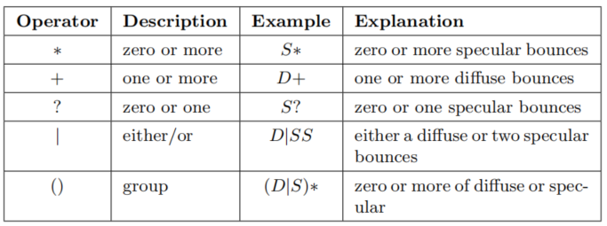

尽管H神的符号读起来很直观，但反方向理解表达式往往更容易（从右到左）。渲染方程本身可以用一个简单的表达式来概括：$L(D|S)*E$。而在实时渲染中使用全局光照时，最常用的两个策略是==简化和预计算==。

本章将举例说明如何使用这些策略来实现实时的各种全局照明效果。

下图是昂贵的路径追踪效果：

## 2. General Global Illumination

在本章中，我们提出算法，旨在解决全渲染方程。它和我们在第九章讨论的反射方程的区别是：反射方程忽略了辐射度的**来历**，而是 simply given。`full`则明确给出：渲染点的辐射率`radiance`由其它点反射或射出而来。

路径追踪等方法对于实时而言是昂贵的，所以讨论干嘛？第一个理由是，对于很多静态场景，这种算法可以作为预处理，在实时运行时，直接读取使用。第二个理由是，全局光照算法建立在严格的理论之上，都是基于渲染方程推理得到的，而在设计实时算法时也可以使用类似的方法。（而且随着硬件的方法，很多离线方法也可以应用于实时了）

两个解决渲染方程的常见方法是：有限元法和蒙特卡洛方法。<u>辐射度方法</u>` Radiosity`基于第一个方法；光线追踪及各种变体使用第二种。两者中，光线追踪要流行得多。这主要是因为==它可以在同一个框架内有效地处理一般的光传输==——包括体积散射`volumetric scattering`等效果。

> 同样经典的离线算法书籍：
>
> [400] Dutr´e, Philip, Kavita Bala, and Philippe Bekaert, ==Advanced Global Illumination==, Second
>
> Edition, A K Peters, Ltd., 2006. Cited on p. 269, 442, 512, 684
>
> 以及PBR第三版

### 2.1 Radiosity

Radiosity是第一种用于模拟漫反射表面之间Bounce的计算机图形技术。在经典的形式中，Radiosity可以计算区域光的相互反射和软阴影。其基本想法是：Light bounces around an environment. ——你打开一盏灯，照明度很快达到平衡。在这种稳定的状态下，每个表面都可以看作是一个光源。

==基本的辐射算法假设==：所有的间接光都来自于漫反射表面。这个算法在大镜面的环境下失效，但对大部分场景是一个合理的拟合。使用之前说过的标记法，此算法的光传输过程是$LD*E$。

>  [275] Cohen, Michael F., and John R. Wallace, ==Radiosity and Realistic Image Synthesis==, Academic Press Professional, 1993. Cited on p. 442, 483
>
> [1642]  Sillion, Fran¸cois, and Claude Puech, ==Radiosity and Global Illumination==, Morgan Kaufmann, 1994. Cited on p. 442, 483

辐射度法假设每个表面由一些Patches组成。对于每一个较小的区域，它计算一个单一的平均辐射值，所以这些Patches必须足够小才能捕捉到光线的所有细节。此外，它们不需要一一匹配底层的surface triangles，甚至不需要在大小上统一。

从渲染方程开始，我们可以推导Patch i 等于：:arrow_down:
$$
B_i=B_i^e+\rho_{ss}\sum_jF_{ij}B_j
$$
其中，$B_i$是patch i的辐射度，$B_i^e$是<u>辐射出射度</u>` radiant exitance`（自发辐射，类似`emit`），$\rho_{ss}$是 ==subsurface albedo==。只有光源的发射`Emission`是非零的。$F_{ij}$是Patches $i$和$j$间的形状因子`form factor`，它的定义如下：

其中，$A_i$是patch i的区域面积，$V(i,j)$是点i和点j间的可见性函数——中间没有遮挡就是1，否则就是0；角度$\theta_i,\theta_j$是两个patch的法线间的夹角（如下图:arrow_down:），$d_{ij}$是两点间的距离。

形状因子是一个纯粹的几何项，是离开Patch i的均匀漫反射辐射的部分。两块Patch的面积、距离、朝向，以及中间的任意表面都会影响形状因子。==而辐射度方法的重要部分就是：准确地确定场景中成对patch之间的形状因子。==

由于性能等诸多限制，传统的辐射度方法很少使用，但是其预计算形状因子的思想在现代实时全局光照系统很流行，后续会详细介绍。

### 2.2 Ray Tracing

Ray Casting是指从某一位置发射一条射线，来确定特定方向上的物体。而对于Ray Tracing最基本的形式，Ray从相机通过<u>像素网格</u>`pixel grid`进入场景，后面的过程可太经典了，这里就不赘述了。

传统的射线追踪只提供了简单受限的效果集：Sharp反射和折射，以及硬阴影。但是，同样的基本原理可以用于解决完整的渲染方程。Kajiya**[846]**意识到，==射出射线并评估其携带的光量的机制==，可以用来计算方程11.2中的积分。该方程是递归的，这意味着对于每一条光线，我们需要在不同的位置再次评估积分。

幸运的是，处理这个问题的数学基础已经存在——Monte Carlo methods。当光线反弹`Bounce`穿过场景时，就建立了一条路径`path`。沿着每条路径的光，提供了被积函数的一个评估，这个过程称为路径跟踪path tracing。

跟踪路径`Tracing paths`是一个非常强大的概念，它可用于渲染光滑或漫反射材料。使用这个技术，==我们可以生成软阴影，渲染透明物体以及焦散效果==。扩展路径追踪，进行体积采样，还可以处理雾和次表面散射效应。

此技术的唯一缺点是计算过于昂贵。这是因为我们从来不计算积分的实际值，而只计算它的估计值。而采样点过少，则会出现太多噪点，如上图左:arrow_up:。许多方法已经被提出，来提高效果，但不需要增加额外的路径，其中一个流行的技术是重要性抽样，其基本思想是：通过在大部分光线来源的方向射出更多的光线，可以大大减少方差。

一些相关Paper和书籍：

-  a great introduction to modern off-line ray tracing-based techniques。**[1413]**
- 我们将在本章的最后讨论交互速率下的射线和路径跟踪。

## 3. Ambient Occlusion

本章将开始讨论简单但令人信服的实时技术，并逐步过渡到复杂技术。一个基本的全局光照效果就是ambient occlusion，AO。首次是由Industrial Light & Magic公司提出 **[974]**。当光线缺乏方向性变化，无法凸显物体细节时，这种方法可以廉价提供形状信息。

### 3.1 Ambient Occlusion Theory

AO的理论背景可以直接从反射方程得到。为了简化，我们首先只考虑`Lambertian surfaces`。从这种表面发出的辐射度L~o~与表面辐照度E成正比，辐照度是入射辐射度L~i~的余弦加权积分。一般来说，它取决于表面位置p和表面法线n。同样，为了简单起见，我们假设入射辐射是常数，对于所有入射光强方向l，L~i~(l) = L~A~。计算辐照度的公式如下：

上诉公式导致了一个` flat appearance`，且没有考虑可见性。首先进行简单的扩展，只要被阻挡，就设置入射辐射率为0，而不考虑该阻挡表面反射的光，然后，我们得到了由Cook和Torrance首先提出的方程：

==可见度函数的归一化、余弦加权积分称为环境遮挡==：

这个值代表的是半球可见性的余弦加权百分比——0代表被完全遮挡，1代表完全无遮挡。对凸物体进行遮挡计算是无意义的，但对于有孔洞的物体，则是有意义的。一旦定义了k~A~，遮挡存在时的环境辐照度方程为：

比较图11.8:arrow_down:中的表面位置p~0~和p~1~。==表面朝向也有影响==，因为能见度函数要加权余弦因子。此外，下图左还能看出：点所在位置的陡峭程度（p~0~和p~1~）、所在位置的遮挡分布（p~1~和p~2~）也会对遮挡因子有影响。

除了k~A~，L神也计算了一个平均未遮挡方向，记作`bent normal`，计算方式如下（余弦加权）： **[974]**

产生的矢量（上图右:arrow_up:）可以用来代替渲染期间的几何法线，以提供更精确的结果，而没有额外的成本。

###  3.2 Visibility and Obscurance

可见性函数$v(l)$是AO项的重要部分，对于单个物体，可以直接定义成：表面位置p向方向l投射射线，是否和此物体的其它部分相交。但是，并没有考虑周围其它物体的遮挡影响。例如：一个物体放在一个平面上，考虑平面对物体的遮挡`Occlussion`，能得到更真实的效果。

但在封闭场景下，则所有点的k~A~会成0，因为所有射线都会打中物体（其实，按我的想法，就是限制射线的距离，这个先按揭不谈）。因此，M神提出了`accessibility shading`，描述了表面的角落和缝隙是如何吸附污垢或腐蚀`dirt or corrosion`。**[1211]**

Z神提出了`obscurance`的想法，通过使用距离映射函数$\rho(l)$来替代可见性函数$v(l)$，调整AO：**[1970]**

不像$v(l)$只有两个可能值，$\rho(l)$是一个基于射线移动距离的连续函数，0代表击中时的移动距离就是0，1代表所有击中点的距离都大于$d_{max}$。（下图是两个方法的区别:arrow_down:）

### 3.3 Accounting for Interreflections

尽管`Ambient Occlusion`效果可以，但比起完全的GI算法，效果总体偏暗，如下图:arrow_down:。其主要差别就是` interreflections`（被遮挡的方向，简单粗暴的设置为0引起的），这种差异可以通过增加k~A~的值来解决（上一节也是一个解决方法）。

`Tracking interreflections`是昂贵的，因为它是一个迭代问题。S神提出了一个廉价但精确的近似<u>交互反射</u>`interreflections`。它基于这样的观察：在郎伯场景的漫反射渲染下，从特定位置可见的表面位置往往具有相似的辐射度。假设阻塞方向发出的L~i~等于当前渲染点发出的L~o~，打破递归，得到解析表达式：

其中，$\rho_{ss}$是`subsurface albedo`，或者说漫反射率。或者说，替代AO项k~A~：

J神提出了一个full、离线路径追踪方法。**[835] 

###  3.4 Precomputed Ambient Occlusion

在实时领域中，通常是对AO进行预计算，烘焙到一张贴图中。而预计算最常用的方法就是`Monte Carlo`方法：

有效纳入这个Cos权重因子的方法是==重要性抽样==——光线更有可能投射到更靠近表面法线方向的地方，因为这样产生的结果可能更重要。这种采样方法被称为`Malley’s method`。大多数商业建模和渲染软件提供了预先计算环境遮挡的功能。

==预计算的数据也可以用来模拟物体间相互的AO效果==，K神将物体对周围环境的AO效果存储在一个立方体贴图中，称为`ambient occlusion field`。 **[924, 925]**

M神提出了`ambient occlusion volume`技术，直接存储AO Factor到三维网格中**[1111]** 。H神和R神提出了在引擎中实现的具体方法，**[737]   [1469]** 。

预处理AO涉及了采样和重建，因此信号处理领域的所有方法都可以用来提升质量，例如K神就提出了`least-squares baking`技术。**[875]**

Destiny是一个使用预处理AO的游戏:arrow_down:，其完整的实现细节可见 **[1658]**。

`World AO`是刺客信条系列游戏使用的一个技术。从一个自上而下的视图来渲染世界，处理产生的深度贴图，以计算大规模遮挡。通过将物体的世界空间位置投影到纹理空间，生成的世界空间AO贴图应用于所有物体。**[1692]**

###  3.5 Dynamic Computation of Ambient Occlusion

而对于动态场景，预计算失效了，而需要使用其它算法。这些算法主要分为两类：基于物体空间，基于屏幕空间。

==B神提出了一个不错的想法==。其基本思路是：将表面建模成放置在网格顶点的圆盘集合。为什么是圆盘呢？因为圆盘间的遮挡可以解析计算，避免投射光线。而直接这样做，会由于双重阴影而产生过暗的结果，B神为此进行了优化：第一个Pass，计算包括双重阴影的AO，第二个Pass，每个圆盘的贡献减少。**[210]**

而目前的算法复杂度是$N^2$，B神通过构建分层树将时间复杂度减少到了$nlogn$，而此版本也被用在了加勒比海盗的电影中 **[265]**。

E神提出了方法`signed distance fields `（SDF）：物体被存入一个三维网格，每个网格上点存储了离物体表面最近的距离（==这让我想到IQ大神的博客==）。**[444]**

W神对SDF进行了扩展，使用了`Cone Tracing`（见下图:arrow_down:）。锥跟踪的近似方法是：沿轴执行一组步骤，并在每一步检查SDF与一个半径逐渐增大的球面的相交情况。如果SDF采样的值小于球体的半径，则锥体的那部分被遮挡，遮挡因子为：==挤压立体角 / 原立体角==。==跟踪单个锥是不精确的，并且不允许包含余弦项==。由于这些原因，Wright跟踪了一组锥体，覆盖整个半球。**[1910]**

稀疏的体素八叉树方法。**[305]**

R神使用球体组合来替代原有模型，计算AO:arrow_down:。然后总体的可见性函数值是单个的结果进行相乘得到的。但单个球的可见性是用球谐函数定义的，而球谐函数的点乘是昂贵的，因此一般是对单个结果求log，然后对总体结果求幂，进行计算。此方法不仅计算环境遮挡因子，而且还计算一个完整的球形可见函数，以球面谐波表示。（具体这些谐波参数的意义，见书 P 456）  **[1482]** 

### 3.6 Screen-Space Methods

上诉基于物体的方法，其成本正比于场景的复杂度。而基于屏幕方法的代价是恒定的，与场景的细节无关，而只与渲染所用的分辨率有关。

SSAO：C神在孤岛危机中使用了SSAO，`screen-space ambient occlusion`。这个算法使用z-buffer作为唯一的输入，在全屏Pass中计算环境遮挡。每个像素的环境遮挡因子k~A~通过测试一组点来估计——这些点分布在一个围绕像素的球体中。对这些点进行深度测试，通过测试的数量 / 总数 作为输入传入函数，计算出AO值。当然，每个点是有权重的，和模糊类似，离中心越远的点，其权重越低。

方法很简单，但正由于其简易性，存在不少缺点。该通过的点没通过，或相反（导致边缘过亮，平面过暗）；权重和余弦无关等。

其他方法：

S神，A神==提出了相似算法，包含两个部分==。一个针对小的、近的物体，产生精确的AO；一个针对大物体，产生粗糙的AO，两者结合产生最后的结果。前者类似SSAO，后者类似R神的球替代法（上节），不过是在平面空间，换做用`billboards`覆盖遮挡体的影响区域。两者都没有考虑双重阴影的问题，所以效果过暗。**[1174]**

obscurance function：==L神对SSAO进行了蒙特卡洛扩展==，称之为`volumetric obscurance `，计算如下：

其中，X是一个围绕该点的三维球面邻域，$\rho$是距离映射函数，d是距离函数，$o(x)$是`obscurance function`（如果X没有被占用，则为0，反之为1。由于$\rho(d)$对于效果几乎无影响，所以可以用常数代替。SSAO随机抽取三维邻域来计算积分，而此算法通过随机采样一个像素的屏幕空间邻域，来数值计算xy维上的积分（z维是解析积分，啥意思啊？）。如果点的球面邻域不包含任何几何图形，积分就等于射线和一个表示X的球面的交点的长度（如下图左:arrow_down:）。积分只计算每条线段的未占用部分。**[1072]** 

==volumetric ambient occlusion==。此方法使用法线信息，如上图右:arrow_up:。**[1733]**

HBAO：根据`horizon mapping`技术**[1145]**，B神提出了`horizon-based ambient occlusion`，==HBAO==。这个技术假设Z缓冲区中的数据代表一个连续的高度场，可以通过确定`horizon angles`来估计某点的能见度，`horizon angles`是指切平面上方，被邻域所遮挡的最大角度：**[119]**

其中，$h(\phi)$就是`horizon angles`，$t(\phi)$是切平面和视线间的`tagent angle`，$W(w)$是衰减函数；用$1/2\pi$来归一化积分。By using a linear falloff on the distance to the point that defines the horizon for a given φ, we can compute the inner integral analytically：

剩下的积分，可以通过对多个方向采样，并找到地平线角度，进行数值计算得的。（下图左:arrow_down:）

> 这里的问题是，依据书上完全理解不了，按照图的话，还是有一定道理：首先，下图都是$\theta$平面，然后绕着$\phi$进行积分，不同的$\phi$，产生不同的$h,t$，也就是不同的$\theta$区间。这样也能合理理解上图的积分。

G神提出了一个原理相似的算法，称为`ground-truth ambient occlusion`，==GTAO==:arrow_up:。他们的目标是获得ground-truth。其假设唯一可用的信息是Z缓冲区数据形成的高度场。相对HBAO，GTAO引入了缺失的余弦因子，去除了衰减函数，并建立了遮挡积分（==以视线向量V为中心，这也符合我在上面引用中的理解==），其定义为：**[835]**

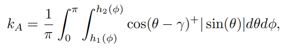

其中，$1/\pi$是由于引入了余弦项（没有引入，则是$**1/2\pi**$）。这种集成与HBAO中的方法相同，即对给定像素周围的多个方向进行采样。

在horizon-based的方法中，最昂贵的部分是：沿屏幕空间线对深度缓冲区进行采样，以确定`horizon angles`。T神提出了算法，来加速这个过程，主要的假设是：用于估计`horizon angles`的采样可以在屏幕空间中，沿直线铺设的像素之间重复使用。其算法主要分为两步，具体见书 P 462。 **[1771]**

------

总的来说，基于屏幕空间的方法需要更多的采样来提高质量，但实时性限制采样不能超过20。J神甚至说，为了让游戏得到60 FPS，只采样一次！！因此为了解决这样的冲突，屏幕空间方法通常使用某种形式的<u>空间抖动</u>`spatial dithering`。在最常见的形式中，每个屏幕像素使用一组略微不同的随机样本（径向旋转或移动），经过AO计算的的主要阶段，一个全屏滤波Pass被执行。` Joint bilateral filtering`(第12.1.1节)用于避免滤波表面的不连续点和保持锐利边缘。

==AO也可以进行时间上的超采样，如：TXAA==。这一过程通常是：通过在每一帧中应用不同的采样模式，并对遮挡因子进行指数平均。使用最后一帧的z缓冲区、摄像机变换和动态对象的运动信息，前一帧的数据被重新投射到当前视图，然后它与当前帧的结果混合——有些情况下，则应该剔除上一帧，例如：有心物体进行场景。

其实，一般来说，在完整渲染的场景中，AO引发的错误是细微的，难以被注意的，所以对这方面可以不要考虑太多。

### 3.7 Shading with Ambient Occlusion

尽管我们已经在恒定的、远处照明的情况下，得到了AO，但也可以将其应用到更复杂的照明场景中。再考虑一下反射率方程：

相比常规，我们这里引入了可见性函数$v(l)$。如果我们处理的是一个漫反射表面，则：:arrow_down:

我们可以将上式重新表示为：:arrow_down:

使用之前的AO定义，可以简化成：**{22，23}**

这种形式提供了一个新视角。==方程{22}中的积分可以看作：对入射辐射L~i~应用了一个方向滤波核K==。滤波器K以一种复杂的方式在空间和方向上改变，但它有两个重要的特性：

+ 首先，它最多覆盖p点法线周围的半球。
+ 第二，由于分母上的归一化因子，它在半球上的积分等于1。

计算这个积分最常用的方法是，用一个简单的函数来拟合K，比如这个余弦核K：

当没有入射光被遮挡时，这个拟合是精确的。此时，渲染方程计算如下：

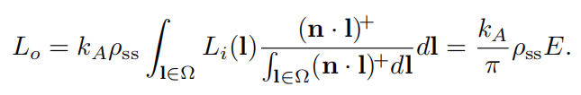

环境遮挡对Punctual或小面积光源的可见度近似很差。而我们目前讨论的都是朗伯平面，而对于高光材质而言，K还依赖于视线向量，这个时候的拟合是不够精确的。

使用`bent normal`是一种更精确地逼近滤波器K的方法。**[974]**

## 4. Directional Occlusion

尽管AO能提高渲染的真实性，但它的拟合效果在很多场景下是不够的，很多复杂的照明设置（如：Glossy）不能正确处理。如下图:arrow_down:。一种解决方案是：用更具表现力的方式来描述可见性。==这里描述的解决方案主要用于，为大面积照明或环境照明提供遮挡==。此外，这些方法还可以用于常规阴影技术不可行的情况，比如自阴影、对超大场景的阴影，阴影贴图没有足够的分辨率等情况。

###  4.1  Precomputed Directional Occlusion

`ambient aperture lighting`，这些技术比`horizon maps`的存储要求更低，但当未被遮挡的方向集不像椭圆或圆时，可能会导致不正确的阴影。 **[705, 866]**

`spherical signed distance function`等AO技术的变体。**[1838]**

球基函数对可见性的编码。 **[582, 632, 805, 1267]**

### 4.2 Dynamic Computation of Directional Occlusion

许多之前计算AO的方法可以扩展到计算方向遮挡。具体见书 P 467。

### 4.3 Shading with Directional Occlusion

有这么多不同的编码DO的方法，我们不能提供一个单一的解决方案，而将取决于我们想要达到的特殊效果。再次考虑反射方程： **{26}**

首先，我们考虑简单的情况——`punctual lights`（而且当传统阴影不行的情况下，可以使用这个，哪怕效果不好，但有无问题这个时候才最重要）。公式变为： **{27}**

而对于区域光，则:  **{28}**

而对于朗伯平面：**{29}**

Lambert**[967]**推导了一个计算球面多边形上余弦积分的公式。如果我们的区域光是多边形的，我们可以根据可见性表示来剪辑它（如下图:arrow_down:），然后只需要使用Lambert公式来得到一个精确的结果。而对于小区域灯，则可以通过将余弦项设置为常数来进行简化。

> 对于余弦积分，其计算方法和拟合方式可见论文——==Real-Time Polygonal-Light Shading with Linearly Transformed Cosines==

一般环境照明

对于环境照明，公式如下：**{30}**

这个方程中的积分类型称为` triple product integral`。如果单个函数以某种方式表示——例如球谐或小波——它就可以解析计算出来。不幸的是，这对于实时应用来说太昂贵了，尽管这样的解决方案已经在简单的设置中以交互速率运行。**[1270]**。上诉公式可以写成：**{31} {32}**

后两个公式就是球函数` spherical functions`，虽然这看起来只是一个数学技巧，但它极大简化了计算。==如果因子是用标准正交基，如球谐表示，二重积的积分可以很容易地计算出来==——系数向量的点积。（有时间去网上仔细看看球谐函数:star:）

我们依然需要计算$\overline{L_i(l)}$或$\overline{v(l)}$，但因为它们包含余弦项，所以比一般模式更加简单。如果用球面谐波（**SH**）来表示这些函数，则余弦投射`projects`到<u>带状谐波</u>`zonal harmonics`(**ZH**)——==它是球面谐波的一个子集，每个波段只有一个系数是非零的==。这个投影的系数有简单的解析公式，而且SH和ZH的点乘，比两个SH间的点乘更加简单。

而不管是采取哪个形式的公式，都会有一定的限制，例如$\overline{v}(l)$限制了法线的修改。两个方法都需要预计算，将结果提前存储，而其中一个加速方法由I神提出 **[809]**。

K神提出了一种用环境贴图表示照明，==用锥体编码可见性==的解决方案。**[904]**

高斯拟合

而在Glossy和环境照明的情况下，BRDF项不能从积分中提取出来，所以用一组高斯函数来拟合它:arrow_down:：**[582]**   **{33}**

其中， $G(d,\mu,l)$是<u>球形高斯波瓣</u>`spherical Gaussian lobe`，朝向方向d，陡峭程度$\mu$，$w$是振幅。==而对于各向同性BRDF，波瓣的形状仅依赖于法线和视线的夹角，这个可以存储在一维查找表中==。此时，可以重写公式:arrow_down:：**{34}**

G神也假设整个球形高斯的支持域上，可见函数是恒定的，然后在波瓣中心的方向计算可见函数:arrow_down:：**{35}**

W神提出了更加精确的拟合方法，特别是在可见性的处理上。**[1838]**

## 5. Diffuse Global Illumination

接下来不仅讨论遮蔽，还有<u>完整的光反射</u>`full light bounces`，==可以粗略地分为以下两个算法==：在光到达眼睛之前，光线从漫反射面或镜面上反弹`bounce`。相关路径可以写为$L(D|S)*DE$和$L(D|S)*SE$。

- 第一组解决方案假设（diffuse）：入射光线在渲染点上方的半球域上，平滑改变，或者完全忽略这种改变。
- 第二组算法假设（specular）：在入射方向上剧烈变化。

由于存在这些差异极大的约束，因此分开这两组是有益的，我们在这一节介绍漫反射全局照明的方法，下一节介绍高光，最后一节介绍统一的方法。

### 5.1 Surface Prelighting

辐射度和路径追踪都是离线方法，而在实时领域使用它们最常用的方法是预计算光线相关信息，==用这种方法对静态场景进行预计算被称为<u>烘焙</u>==`baking`。

而这种方法通常是有限制的，只能用于游戏中的==静态对象==，而==动态对象==只作为接收者，它们不会遮挡光线，也不会产生间接照明效果。可以预计算的、最简单的光照信息就是`irradiance`，如下图:arrow_down:——对于平坦的Lambertian表面，以及表面颜色，它充分描述了材质对光的反应。因为光源的效果是独立于其他光源的，==所以动态光可以添加到预先计算的辐照度E之上==。

==为什么辐照度贴图和albedo不相乘再存储呢==？因为辐照度贴图通常只应用在某一个地方，而albedo贴图通常应用在很多地方，所以要分开存储。

==但目前很少预计算辐照度E==，因为根据定义，辐照度是给定法线方向进行计算的，我们不能使用法线映射来提供高频细节，这也意味着只能预先计算平面的辐照度。如果要在动态几何上使用烘焙照明`baking`，则需要其他方法来存储它。

###  5.2 Directional Surface Prelighting

为了在Lambertian表面上使用`perlighting`和法线贴图，我们想要一种方法来表示：辐照度如何随着表面法线变化。==为了给动态对象提供间接光照，我们还需要为每一个可能的表面方向提供它的值==。令人高兴的是，我们已经有了表示这些函数的工具，正是10.3节的球谐函数等方法。

==最普遍的方法是存储完整的球面辐照度信息，例如利用球面谐波，也可以使用`H-basis。`==但这两个方法都会产生`ringing`（10.6.1），虽然预过滤可以缓和这种效果，但也平滑了照明，这有时是不可取的。

> 关于球谐光照的使用和数学，具体见数学/计算机图形学下的`球谐函数`

==进一步减少Cost的方法有==：`半条命2`使用的半球基，存储了三个颜色值（9个参数）。`AHD`基是另外一个流行的选择，如下图:arrow_down:。这两个方法可以详见（10.3.3） **[806]**

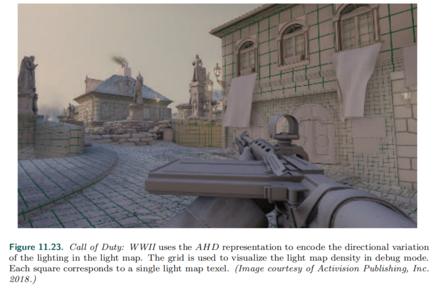

C神在`Far Cry`中使用了更为简单的方法，每个采样只需存储六个值，Unity中也使用了类似的方法。**[1227]**

==而如果在视觉质量上更进一步==，则是`The Order: 1886`中使用的方法:arrow_down:。**[1268]**

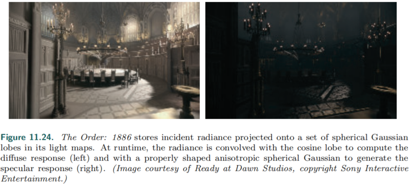

在很多商业游戏上使用成功的算法，`Ambient dice`。**[808]**

> 这里只是简单的介绍，详细的可见书 P 477~478

> :star:个人关于这章的理解：对于5.1的方法，其考虑的是平坦`flat`平面，限制之大不用多说；而本节5.2考虑的则是具有复杂法线分布的平面，然后进行烘焙预处理，根据不同的方法，存储不同的数据，例如：球谐参数，半条命2方法的三个RGB值。实时运行时，再根据预存储的数据进行计算。所以此两节的方法都只适用于静态场景。

### 5.3 Precomputed Transfer

虽然预先计算的照明看起来令人惊叹，但也是静态的。任何几何形状或照明的改变都可能使整个解决方案无效——就像在现实世界中一样，拉开窗帘会让整个房间充满光（全局的照明变化）。

> 主要就是考虑光的动态变化

我们做出假设：场景的几何不改变，只改变光照。可以预先分析<u>相互反射</u>`interreflections`或次表面散射等物间效应，并将结果存储起来。==将入射光照转化为整个场景的辐射度分布的函数==称为转移函数`transfer function`。将其进行预处理就被称为precomputed radiance transfer（**PRT**）。

一般过程：所有直接光被`injectes`进场景，然后在整个场景上应用转移函数。这个直接光可以来自环境贴图，或者任意的光照设置。

==关于PRT的内容可见S神的课程==**[1651]**:star:，其中使用球谐函数来进行描述，但不仅于此。这个==基本思想==是简单的：如果直接灯由一定数量的`building block`灯组成，我们可以预计算单独一个灯对场景的影响，如下图:arrow_down:。至于每个每个灯的单独计算，可以考虑使用11.2节的暴力方法，最终结果可以是单独解的求和。

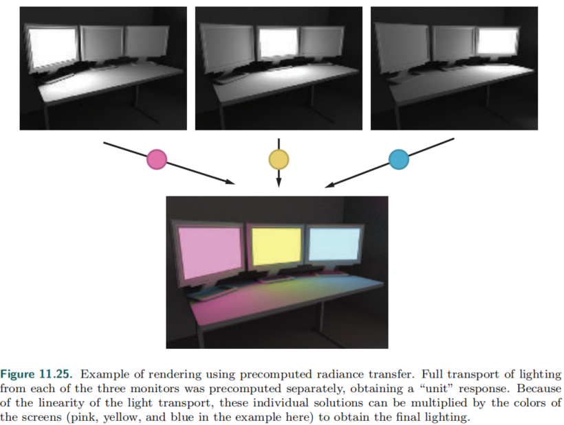

 具体可以写作公式：
$$
L(p)=\sum_i{L_i(p)w_i}
$$
其中，唯一需要注意的是$w_i$，含义是当前亮度。$L_i$可以说是组成了此场景的基向量，任意照明可由此==向量组==线性组合而成。

最初的PRT论文使用了同样的推理，他们存储场景如何响应周围光线，其分布由==球面谐波基函数==定义。通过对一些SH波段进行这样的处理，他们可以呈现出一个任意照明的场景。他们将这种照明投射到球面谐波上，将每个结果系数乘以各自的归一化单位贡献，然后将这些加在一起，就像我们对显示器所做的那样。

但==最初的方法需要极大的内存需求==，这个问题一年后被解决了，使用了==主成分分析==principal component analysis（==PCA==），传递系数可以考虑为多维空间中的点（例如$9\times 9$矩阵可以考虑成81维空间的点），它们形成了维度较低的聚类。这种聚类就像沿线分布的三维点，==实际上都在三维空间的一维子空间中==。

> PCA可以有效地发现这种统计关系。一旦发现了一个子空间，就可以用更少的数量来表示点的坐标，因为我们可以用较少的数量来存储子空间中的位置。

对于PCA的一个优化，`local deformable precomputed radiance transfer`（**LDPRT**）。

**PRT**已经在游戏中得到了广泛使用，特别是具有户外场景的游戏——变化的天气系统（荒野大镖客3），一些例子：**[533,1154]**。此外，SIGGRAPH上关于PRT的**课程[870]**:star:；开发一些算法的研究**[1019,1020]**。

原始PRT假设的都是无限远环境光的情景（==不确定照明的初始来源==），对于室内场景不适用。而室内场景的算法，俺们也接触过，unity的光探针`light probe`就是代表例子。书中例子**[941]**。

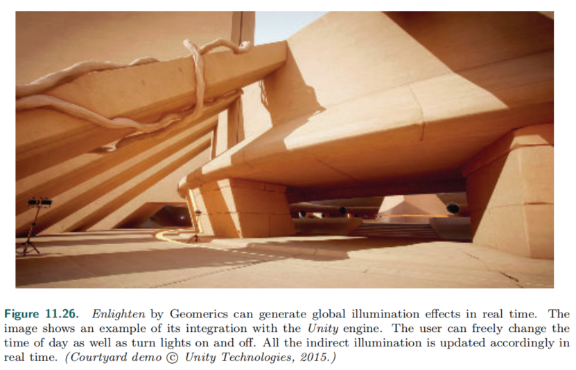

------

==另一类流行的方法是预先计算表面之间的传输==。在这种类型的系统中，实际的光源变得无关紧要。具体的一些技术可以见书 P 482~484。相关的一些论文链接：**[1073]**（移动端）、**[1021]**（昂贵）、progressive radiosity **[275, 1642]**

### 5.4 Storage Methods

无论是要使用==完全的预计算照明==，还是要预先计算==传输信息==，结果数据都必须以某种形式存储。==对GPU友好的格式是必须的。==

light map是==存储预先计算的照明==的常见方式之一，且通常不需要使用mip map，因为其分辨率通常是很低的:arrow_down:。为了在纹理中存储光照，对象需要提供一个` unique parameterization`。当把一个漫反射颜色纹理映射到一个模型上时，==对于网格的不同部分使用相同的纹理区域通常是很好的==，特别是此纹理是具有重复性质时。==但复用光贴图是困难的==，光照对网格上的每个点都是独特的，所以每个三角形都需要在光照贴图上占据独特的区域。==创建参数化的过程==：将网格分割成更小的块；接下来，对每个块进行独立参数化，确保各部分在纹理空间中不重叠**[1057,1617]**。在纹理空间中产生的元素称为图表`charts`或外壳`shells`。最后，所有的图表被打包成一个共同的纹理:arrow_down:。

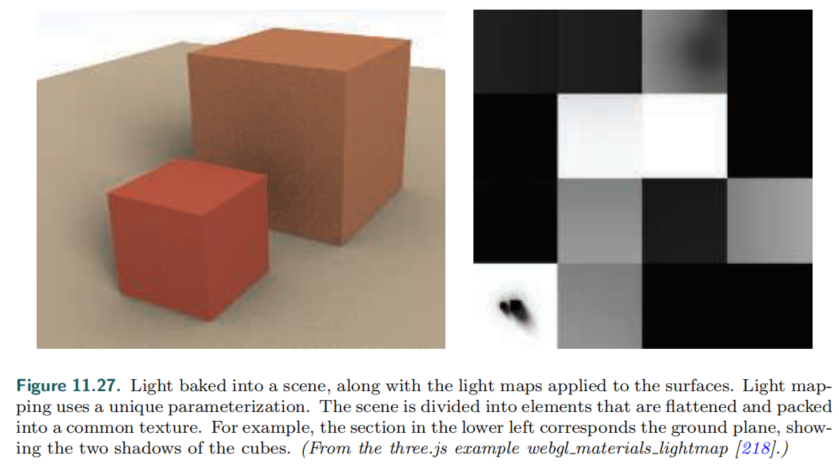

实际使用的过程中，==需要考虑过滤问题==，特别是要防止不同的shells间的重叠以及`bleeding`，其中一个方法如下图:arrow_down:。

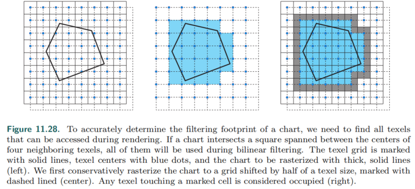

将`charts`打包进一个纹理是一个==完全NP问题==（意味着没有明确算法）。针对复杂情况，一些加速的实时算法**[183,233]**。

而`light maps`的另一个问题是`seams`:arrow_down:。一些算法：**[806]**（post-process），**[1058]**，==[1467]==（grid-preserving parameterization）

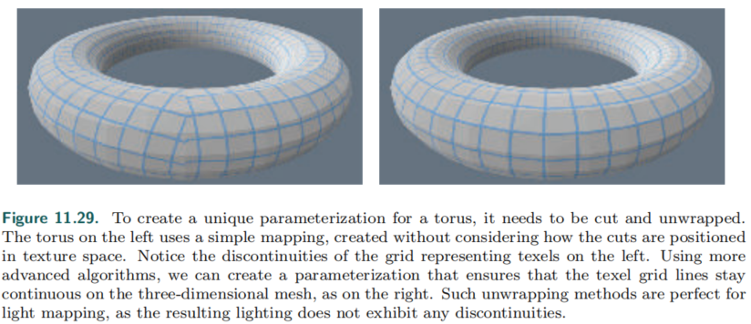

------

irradiance volume：Greger等人**[594]**提出了`irradiance volume`，它用==辐照环境贴图的稀疏空间采样==，来表示五维（三个空间和两个方向）的辐照度函数。**即**在空间上有一个三维网格，在每个网格点上都有一个辐照度环境贴图。==动态对象从最近的贴图中，插值计算辐照度值==。

> 关于八叉树。**[1304,1305]**

在原始的`irradiance volume`中，Greger等人将每个样本点的辐照度E存储在一个小纹理中，如今，体积光照数据最常存储在三维纹理中，因此对体积进行采样可以使用GPU的加速过滤。==采样点的辐照度函数最常见的表示方式包括==： **[766, 808, 1193, 1268, 1643]**

- 二阶或三阶的SH
- 球形高斯（SG）
- Ambient cube or ambient dice。(**10.3.1**)

E神在游戏`LittleBigPlanet`中对辐照度体积进行了优化，每个采样点存储的是一个平均辐照度，而不是辐照贴图。一个近似的==方向性因子==由辐照场的梯度计算，即场变化最迅速的方向。**[444]**

==在体积结构中存储表面照明有些棘手==。不少表面，有时有着非常不同的光线特征，会占据同一个体素，这使得我们不清楚应该存储哪些数据。当从这样的体素中取样时，光线经常是不正确的。这种情况特别经常发生在**明亮的户外**和**黑暗的室内**之间的墙壁附近，结果要么是外面的暗斑，要么是里面的亮斑。==处理这个问题最常见的方法是沿着法线移动采样位置==，或者调整插值期间使用的三线性混合权值——这通常是不完美的，可能需要手动调整几何图形来掩盖问题。Hooker**[766]**在辐照度`volumes`中增加了额外的剪裁平面，将其影响限制在凸面多面体的内部。K神**[926]**讨论了各种策略以减少出`bleeding`。

容纳照明的**体积结构**不必是规则的。一个**流行的选择**是：将它存储在一个不规则的点云中，然后连接起来形成一个四面体:arrow_down:。​

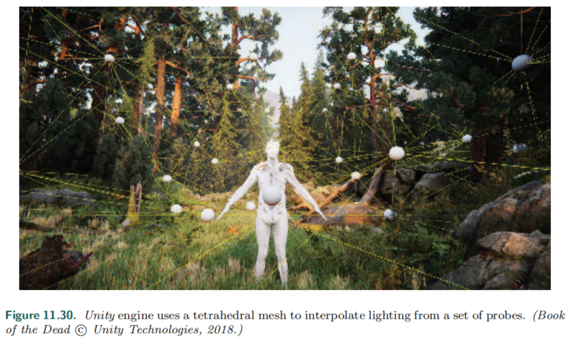

不进行优化的话，寻找采样的光源所在的四面体的过程是一个**昂贵的迭代**，如下图:arrow_down:。一旦确认四面体，就使用四个顶点进行插值

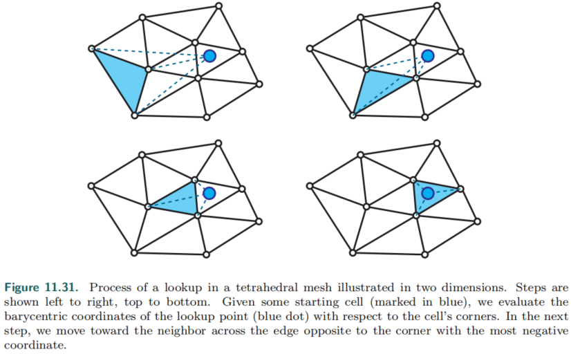

预计算和存储照明的位置可以**手动或自动设置**，通常被称为照明探针，或**光探针**`light probes`，该术语不应与 "light probe"（10.4.2）混淆，后者是记录环境贴图中的远处光照（或者说，环境贴图的一种技术）。

从一个四面体网格中采样的光线质量，==高度依赖于该网格的结构==，而不仅仅是探针的密度。具体更多细节可见书P 490。

==对静态和动态几何图形使用不同的存储方法是一种常见做法==。例如，静态网格使用光照贴图，而动态对象使用体积存储。虽然很流行，但这种方案会在不同类型的几何图形之间造成不一致。其中一些差异可以通过**正则化**来消除。

**AO**和定向遮挡**DO**共享漫反射光的许多空间特性。如第11.3.4节所述，上述所有方法都可以用于存储它们。

### 5.5 Dynamic Diffuse Global Illumination

物体变化？用户自定义？预计算太耗时？所以需要考虑**动态漫反射GI**——要么不需要任何预处理，要么准备阶段足够快，可以每帧执行（这个准备阶段应该不是为了针对预处理，而是物体变化时，要能足够快，来应付这种变化）。

一个最早的方法基于`Instant Radiosity`，核心想法是：从光源发出射线，在打中的任意位置上放置一个**虚拟点光源**`VPLs`，并存储在纹理中。渲染时，使用它来模拟一次`bounce`，这是个离线方法，但启发了`reflective shadow maps`（**RSM**）**[321]**。

RSM：此方法的思想和阴影贴图的思想近似，但在第一次Pass中，存储的不仅是深度，还有击中点的反射率、法线、直接照明。然后在第二次Pass中，每个纹理`texel`当做一个间接光源。当然，对于每一个点，我们只需要考虑其中的一个小子集的影响。更为好的**优化**是：==将这个纹理模拟成几个屏幕空间的点光源==。

该方法的**主要缺点**是不能提供间接照明的**遮挡**，但无伤大雅。同时，间接光源的数量应该足够多，否则光源移动，会产生闪烁`artifacts`。一个游戏使用实例**[1938]**。

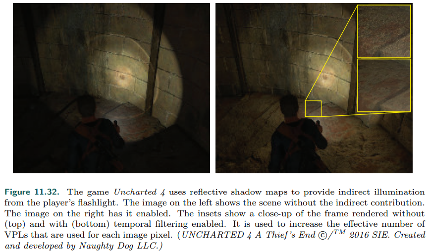

为了解决间接光的遮挡缺失问题，提出了一些解决方法。 **[962]**（dual-paraboloid shadow map） ，**[1498]**（imperfect shadow maps）

###  5.6 Light Propagation Volumes

==辐射传输理论==`Radiative transfer theory `是模拟电磁辐射在介质中传播的一般方法。它解释了散射、发射`emission`和吸收。但除了最简单的情况外，在实时**模拟**这些方法成本太高。然而，一些`in the field`使用的方法被证明在实时领域是有效。

Light propagation volumes（LPV），其**灵感**来自辐射传播中的`discrete ordinate methods`。思路：场景被分解成一个规则的**三维单元网格**。每个单元存储了经过它的辐射率的**方向分布**`directional distribution `。**[854]**

- 在第一步中，光线被注入到**包含直接光照亮的表面**的单元格`CELL`中。可以使用**RSM**来找到这些单元格。注入的光线是表面反射的亮度`radiance`。因此，==它在法线周围形成一个分布==，并从材质的`albedo`获得它的颜色。
- 接下来，光线被传播`propagated`。每个单元**分析**相邻单元的**radiance fields**。然后，修改自己的分布，以考虑来自各个方向的辐射。
- 每一次迭代，只传播到相邻的单元格中。因此需要多次迭代:arrow_down:。

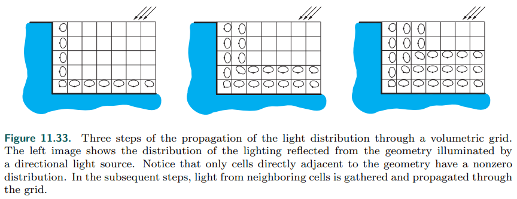

这种方法的重要优点是：它为每个单元生成一个完整的辐射场。这意味着我们可以使用任意的BRDF进行渲染。

一个变体：单元格的体积不再固定，而是逐渐变大。**[855]**

==原来的实现没有考虑到遮挡的间接照明==。修改后的方法使用了来自**RSM**的深度信息，以及来自相机位置的深度缓冲，来增加关于遮挡的信息到体块`volumes`中。这个信息是不完整的，但是在预处理过程中，场景也可以被体素化，从而使用更精确的表示

这种方法与其他体积方法有**相同的问题**，其中最大的问题是**bleed**。不幸的是，==增加网格分辨率会导致其他问题==。当使用更小的单元时，成本明显更高。该方法还存在**锯齿问题**。网格的有限分辨率，加上辐射的粗定向表示，会导致信号在相邻单元间移动时，发生退化`degradation`。==Spatial artifacts==，例如**斜条纹**（可太常见了），可能在多次迭代后出现。==其中一些问题可以通过在传播结束后，执行空间过滤来解决==。

### 5.7 Voxel-Based Methods

G神提出的`voxel cone tracing global illumination`（**VXGI**）也使用体素来表示场景。几何体存储在稀疏八叉树`sparse voxel octree`中（13.10）。**关键概念**是：这个结构提供了一个类似于mip map的场景表示，这样就可以快速测试空间的遮挡情况。体素也包含了所代表的几何体的**反射光量**的信息。 **[304]** （具体实现细节见 书 P 494 - 495）

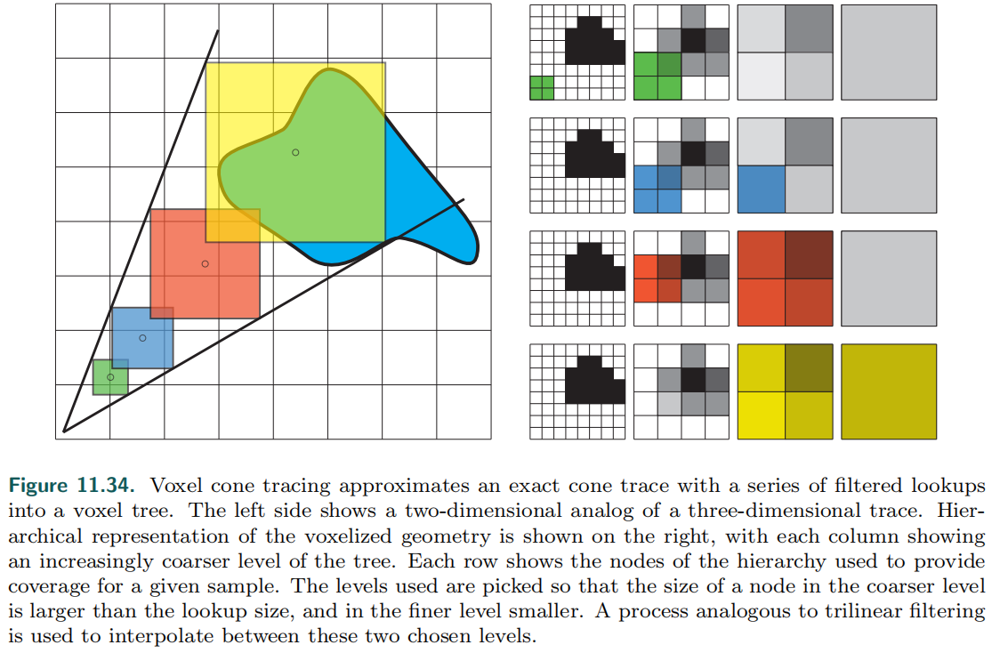

==一个简单的算法过程介绍==：

+ 对于每个像素，追踪数个射线锥。
+ 对于每个锥，沿着锥的轴对树进行一系列查找，查找提供此方向上的`filtered`**辐射率**，以及**被遮挡的百分比**——用来减弱光。
+ 当累积亮度时，首先乘以遮挡因子。这一策略不能检测到由多个**局部遮挡**造成的**全遮挡**，但结果是可信的。

早期虚幻引擎的一个使用。每个像素只跟踪一个圆锥射线，而通过全局滤波来优化效果。**[1229]**

此类方法的==最大问题==是：**查找的高消耗**——在遍历**分层数据**结构时，大部分时间都花在：等待从内存中提取下一个节点上。

一些优化算法见书 P 496。

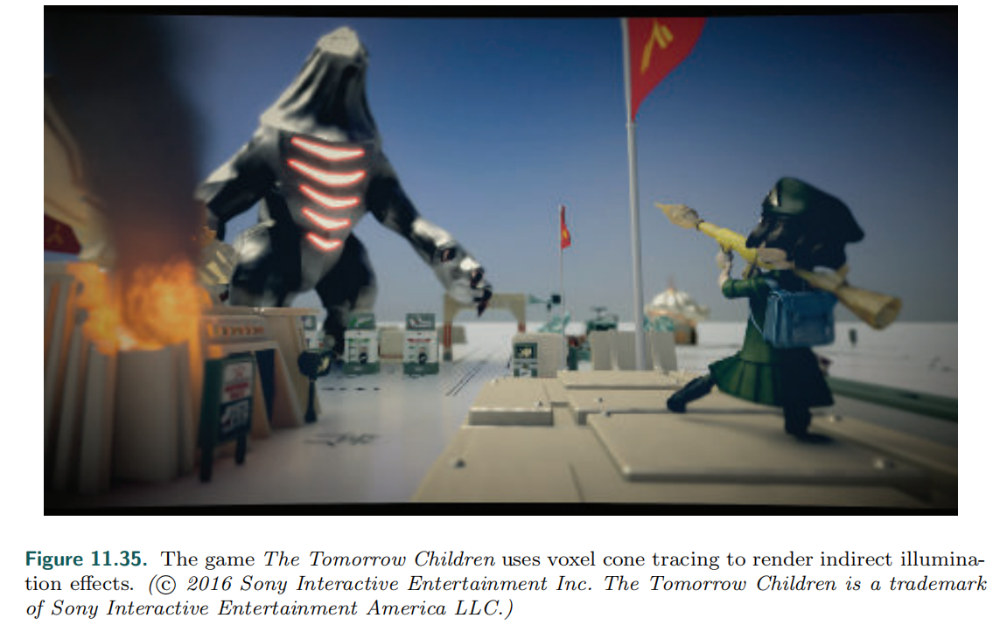

### 5.8 Screen-Space Methods

用途不大。

### 5.9 Other Methods

3.5的计算AO的方法扩展到计算GI diffuse。

##  6. Specular Global Illumination

本节将聚焦于视相关效果，需要一个能够携带**高频信息**的辐射率表示方法。不同于漫反射方法，这里的技术只考虑一个小空间角方向的入射光。

使用一些辐射率表示方法，如：AHD、HL2，可以粗略地表示全局视相关效果，但会有诸多`artifacts`。滤波可以**优化**，但更为常见的是使用更高的精度来表示辐射率：使用球形高斯（SG）波瓣以及X神的方法**[1940]**，可以得到对**经典BRDF高光波瓣**的有效拟合。此时，可以假设F项和G项是常数，可以得到如下公式：

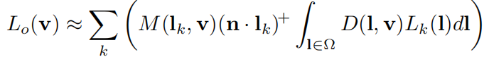

其中，M是G和F的组合，$L_k(l)$是第k个球形高斯。X神还提出了`anisotropic spherical Gaussian`（**ASG**）来对D进行建模，最后提出了对积分项（ASG和SG的点积）的有效拟合。

> :star:关于更精确的数据表达，可以来模拟简介高光，从2020.12初看的那篇关于`PRT`的论文就可见一斑：论文中考虑的就是两种情况，漫反射和Glossy，后者不就是视相关的高光效果嘛。

###  6.1 Localized Environment Maps

到目前讨论的所有方法，都无法处理**抛光材料**，都不能很好编码入射光的**细节**。