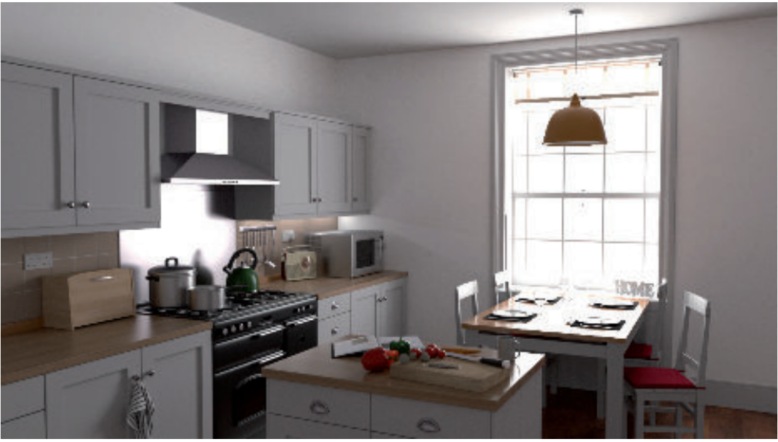

# Chapter 11——Global Illumination

[toc]

## 1. The Rendering Equation

反射率方程是Kajiya在1986年提出的<u>全渲染方程</u>` full rendering equation`的一种受限特例。有很多不同的形式，我们使用这个版本：

其中，$L_e$是自发光，然后用以下进行替代：

这一项意味着：从$l$方向射入p的辐射强度，等于从相反法向$-l$射入其它位置的辐射强度。在这种情况下，“其他点”是由光线投射函数$r(p, l)$定义的，这个函数返回从$p$朝$l$方向，进行光线投射所击中的第一个表面点的位置，见下图：

这个公式中唯一的新成员就是$L_o(r(p,l),-l)$，它显示指出到达一个点的入射光来自另外一个点的出射光。因此，这项是递归项。光线照亮一个场景，而光子在每次碰撞中反弹，并以各种方式被吸收、反射和折射。==渲染方程的重要之处在于，它将所有可能的路径汇总在一个看起来简单的方程中==。

Transparency，reflections, and shadows是全局光照算法，因为它们需要使用来自其它物体的信息。而一个思考渲染照明的好方法就是思考光子传播的路径，如上图:arrow_up:，H神提出了一个基本思路：光子`photon`从光(L)到眼睛(E)的过程中，每一次相互作用都可以标记为漫反射(D)或镜面(S)——当然也可以加入新的种类，如`glossy`，光滑但却不是镜面效果。

算法可以用正则表达式进行简要总结，显示它们模拟的交互类型。下表是基本符号的总结：:arrow_down:

尽管H神的符号读起来很直观，但反方向理解表达式往往更容易（从右到左）。渲染方程本身可以用一个简单的表达式来概括：$L(D|S)*E$。而在实时渲染中使用全局光照时，最常用的两个策略是==简化和预计算==。

本章将举例说明如何使用这些策略来实现实时的各种全局照明效果。

下图是昂贵的路径追踪效果：

## 2. General Global Illumination

在本章中，我们提出算法，旨在解决全渲染方程。它和我们在第九章讨论的反射方程的区别是：反射方程忽略了辐射度的**来历**，而是 simply given。`full`则明确给出：渲染点的辐射率`radiance`由其它点反射或射出而来。

路径追踪等方法对于实时而言是昂贵的，所以讨论干嘛？第一个理由是，对于很多静态场景，这种算法可以作为预处理，在实时运行时，直接读取使用。第二个理由是，全局光照算法建立在严格的理论之上，都是基于渲染方程推理得到的，而在设计实时算法时也可以使用类似的方法。（而且随着硬件的方法，很多离线方法也可以应用于实时了）

两个解决渲染方程的常见方法是：有限元法和蒙特卡洛方法。<u>辐射度方法</u>` Radiosity`基于第一个方法；光线追踪及各种变体使用第二种。两者中，光线追踪要流行得多。这主要是因为==它可以在同一个框架内有效地处理一般的光传输==——包括体积散射`volumetric scattering`等效果。

> 同样经典的离线算法书籍：
>
> [400] Dutr´e, Philip, Kavita Bala, and Philippe Bekaert, ==Advanced Global Illumination==, Second
>
> Edition, A K Peters, Ltd., 2006. Cited on p. 269, 442, 512, 684
>
> 以及PBR第三版

### 2.1 Radiosity

Radiosity是第一种用于模拟漫反射表面之间Bounce的计算机图形技术。在经典的形式中，Radiosity可以计算区域光的相互反射和软阴影。其基本想法是：Light bounces around an environment. ——你打开一盏灯，照明度很快达到平衡。在这种稳定的状态下，每个表面都可以看作是一个光源。

==基本的辐射算法假设==：所有的间接光都来自于漫反射表面。这个算法在大镜面的环境下失效，但对大部分场景是一个合理的拟合。使用之前说过的标记法，此算法的光传输过程是$LD*E$。

>  [275] Cohen, Michael F., and John R. Wallace, ==Radiosity and Realistic Image Synthesis==, Academic Press Professional, 1993. Cited on p. 442, 483
>
> [1642]  Sillion, Fran¸cois, and Claude Puech, ==Radiosity and Global Illumination==, Morgan Kaufmann, 1994. Cited on p. 442, 483

辐射度法假设每个表面由一些Patches组成。对于每一个较小的区域，它计算一个单一的平均辐射值，所以这些Patches必须足够小才能捕捉到光线的所有细节。此外，它们不需要一一匹配底层的surface triangles，甚至不需要在大小上统一。

从渲染方程开始，我们可以推导Patch i 等于：:arrow_down:
$$
B_i=B_i^e+\rho_{ss}\sum_jF_{ij}B_j
$$
其中，$B_i$是patch i的辐射度，$B_i^e$是<u>辐射出射度</u>` radiant exitance`（自发辐射，类似`emit`），$\rho_{ss}$是 ==subsurface albedo==。只有光源的发射`Emission`是非零的。$F_{ij}$是Patches $i$和$j$间的形状因子`form factor`，它的定义如下：

其中，$A_i$是patch i的区域面积，$V(i,j)$是点i和点j间的可见性函数——中间没有遮挡就是1，否则就是0；角度$\theta_i,\theta_j$是两个patch的法线间的夹角（如下图:arrow_down:），$d_{ij}$是两点间的距离。

形状因子是一个纯粹的几何项，是离开Patch i的均匀漫反射辐射的部分。两块Patch的面积、距离、朝向，以及中间的任意表面都会影响形状因子。==而辐射度方法的重要部分就是：准确地确定场景中成对patch之间的形状因子。==

由于性能等诸多限制，传统的辐射度方法很少使用，但是其预计算形状因子的思想在现代实时全局光照系统很流行，后续会详细介绍。

### 2.2 Ray Tracing

Ray Casting是指从某一位置发射一条射线，来确定特定方向上的物体。而对于Ray Tracing最基本的形式，Ray从相机通过<u>像素网格</u>`pixel grid`进入场景，后面的过程可太经典了，这里就不赘述了。

传统的射线追踪只提供了简单受限的效果集：Sharp反射和折射，以及硬阴影。但是，同样的基本原理可以用于解决完整的渲染方程。Kajiya**[846]**意识到，==射出射线并评估其携带的光量的机制==，可以用来计算方程11.2中的积分。该方程是递归的，这意味着对于每一条光线，我们需要在不同的位置再次评估积分。

幸运的是，处理这个问题的数学基础已经存在——Monte Carlo methods。当光线反弹`Bounce`穿过场景时，就建立了一条路径`path`。沿着每条路径的光，提供了被积函数的一个评估，这个过程称为路径跟踪path tracing。

跟踪路径`Tracing paths`是一个非常强大的概念，它可用于渲染光滑或漫反射材料。使用这个技术，==我们可以生成软阴影，渲染透明物体以及焦散效果==。扩展路径追踪，进行体积采样，还可以处理雾和次表面散射效应。

此技术的唯一缺点是计算过于昂贵。这是因为我们从来不计算积分的实际值，而只计算它的估计值。而采样点过少，则会出现太多噪点，如上图左:arrow_up:。许多方法已经被提出，来提高效果，但不需要增加额外的路径，其中一个流行的技术是重要性抽样，其基本思想是：通过在大部分光线来源的方向射出更多的光线，可以大大减少方差。

一些相关Paper和书籍：

-  a great introduction to modern off-line ray tracing-based techniques。**[1413]**
- 我们将在本章的最后讨论交互速率下的射线和路径跟踪。

## 3. Ambient Occlusion

本章将开始讨论简单但令人信服的实时技术，并逐步过渡到复杂技术。一个基本的全局光照效果就是ambient occlusion，AO。首次是由Industrial Light & Magic公司提出 **[974]**。当光线缺乏方向性变化，无法凸显物体细节时，这种方法可以廉价提供形状信息。

### 3.1 Ambient Occlusion Theory

AO的理论背景可以直接从反射方程得到。为了简化，我们首先只考虑`Lambertian surfaces`。从这种表面发出的辐射度L~o~与表面辐照度E成正比，辐照度是入射辐射度L~i~的余弦加权积分。一般来说，它取决于表面位置p和表面法线n。同样，为了简单起见，我们假设入射辐射是常数，对于所有入射光强方向l，L~i~(l) = L~A~。计算辐照度的公式如下：

上诉公式导致了一个` flat appearance`，且没有考虑可见性。首先进行简单的扩展，只要被阻挡，就设置入射辐射率为0，而不考虑该阻挡表面反射的光，然后，我们得到了由Cook和Torrance首先提出的方程：

==可见度函数的归一化、余弦加权积分称为环境遮挡==：

这个值代表的是半球可见性的余弦加权百分比——0代表被完全遮挡，1代表完全无遮挡。对凸物体进行遮挡计算是无意义的，但对于有孔洞的物体，则是有意义的。一旦定义了k~A~，遮挡存在时的环境辐照度方程为：

比较图11.8:arrow_down:中的表面位置p~0~和p~1~。==表面朝向也有影响==，因为能见度函数要加权余弦因子。此外，下图左还能看出：点所在位置的陡峭程度（p~0~和p~1~）、所在位置的遮挡分布（p~1~和p~2~）也会对遮挡因子有影响。

除了k~A~，L神也计算了一个平均未遮挡方向，记作`bent normal`，计算方式如下（余弦加权）： **[974]**

产生的矢量（上图右:arrow_up:）可以用来代替渲染期间的几何法线，以提供更精确的结果，而没有额外的成本。

###  3.2 Visibility and Obscurance

可见性函数$v(l)$是AO项的重要部分，对于单个物体，可以直接定义成：表面位置p向方向l投射射线，是否和此物体的其它部分相交。但是，并没有考虑周围其它物体的遮挡影响。例如：一个物体放在一个平面上，考虑平面对物体的遮挡`Occlussion`，能得到更真实的效果。

但在封闭场景下，则所有点的k~A~会成0，因为所有射线都会打中物体（其实，按我的想法，就是限制射线的距离，这个先按揭不谈）。因此，M神提出了`accessibility shading`，描述了表面的角落和缝隙是如何吸附污垢或腐蚀`dirt or corrosion`。**[1211]**

Z神提出了`obscurance`的想法，通过使用距离映射函数$\rho(l)$来替代可见性函数$v(l)$，调整AO：**[1970]**

不像$v(l)$只有两个可能值，$\rho(l)$是一个基于射线移动距离的连续函数，0代表击中时的移动距离就是0，1代表所有击中点的距离都大于$d_{max}$。（下图是两个方法的区别:arrow_down:）

### 3.3 Accounting for Interreflections

尽管`Ambient Occlusion`效果可以，但比起完全的GI算法，效果总体偏暗，如下图:arrow_down:。其主要差别就是` interreflections`（被遮挡的方向，简单粗暴的设置为0引起的），这种差异可以通过增加k~A~的值来解决（上一节也是一个解决方法）。

`Tracking interreflections`是昂贵的，因为它是一个迭代问题。S神提出了一个廉价但精确的近似<u>交互反射</u>`interreflections`。它基于这样的观察：在郎伯场景的漫反射渲染下，从特定位置可见的表面位置往往具有相似的辐射度。假设阻塞方向发出的L~i~等于当前渲染点发出的L~o~，打破递归，得到解析表达式：

其中，$\rho_{ss}$是`subsurface albedo`，或者说漫反射率。或者说，替代AO项k~A~：

J神提出了一个full、离线路径追踪方法。**[835] 

。

###  3.4 Precomputed Ambient Occlusion

在实时领域中，通常是对AO进行预计算，烘焙到一张贴图中。而预计算最常用的方法就是`Monte Carlo`方法：

有效纳入这个Cos权重因子的方法是==重要性抽样==——光线更有可能投射到更靠近表面法线方向的地方，因为这样产生的结果可能更重要。这种采样方法被称为`Malley’s method`。大多数商业建模和渲染软件提供了预先计算环境遮挡的功能。

==预计算的数据也可以用来模拟物体间相互的AO效果==，K神将物体对周围环境的AO效果存储在一个立方体贴图中，称为`ambient occlusion field`。 **[924, 925]**

M神提出了`ambient occlusion volume`技术，直接存储AO Factor到三维网格中**[1111]** 。H神和R神提出了在引擎中实现的具体方法，**[737]   [1469]** 。

预处理AO涉及了采样和重建，因此信号处理领域的所有方法都可以用来提升质量，例如K神就提出了`least-squares baking`技术。**[875]**

Destiny是一个使用预处理AO的游戏:arrow_down:，其完整的实现细节可见 **[1658]**。

`World AO`是刺客信条系列游戏使用的一个技术。从一个自上而下的视图来渲染世界，处理产生的深度贴图，以计算大规模遮挡。通过将物体的世界空间位置投影到纹理空间，生成的世界空间AO贴图应用于所有物体。**[1692]**

###  3.5 Dynamic Computation of Ambient Occlusion

而对于动态场景，预计算失效了，而需要使用其它算法。这些算法主要分为两类：基于物体空间，基于屏幕空间。

==B神提出了一个不错的想法==。其基本思路是：将表面建模成放置在网格顶点的圆盘集合。为什么是圆盘呢？因为圆盘间的遮挡可以解析计算，避免投射光线。而直接这样做，会由于双重阴影而产生过暗的结果，B神为此进行了优化：第一个Pass，计算包括双重阴影的AO，第二个Pass，每个圆盘的贡献减少。**[210]**

而目前的算法复杂度是$N^2$，B神通过构建分层树将时间复杂度减少到了$nlogn$，而此版本也被用在了加勒比海盗的电影中 **[265]**。

E神提出了方法`signed distance fields `（SDF）：物体被存入一个三维网格，每个网格上点存储了离物体表面最近的距离（==这让我想到IQ大神的博客==）。**[444]**

W神对SDF进行了扩展，使用了`Cone Tracing`（见下图:arrow_down:）。锥跟踪的近似方法是：沿轴执行一组步骤，并在每一步检查SDF与一个半径逐渐增大的球面的相交情况。如果SDF采样的值小于球体的半径，则锥体的那部分被遮挡，遮挡因子为：==挤压立体角 / 原立体角==。==跟踪单个锥是不精确的，并且不允许包含余弦项==。由于这些原因，Wright跟踪了一组锥体，覆盖整个半球。**[1910]**

稀疏的体素八叉树方法。**[305]**

R神使用球体组合来替代原有模型，计算AO:arrow_down:。然后总体的可见性函数值是单个的结果进行相乘得到的。但单个球的可见性是用球谐函数定义的，而球谐函数的点乘是昂贵的，因此一般是对单个结果求log，然后对总体结果求幂，进行计算。此方法不仅计算环境遮挡因子，而且还计算一个完整的球形可见函数，以球面谐波表示。（具体这些谐波参数的意义，见书 P 456）  **[1482]** 

### 3.6 Screen-Space Methods

上诉基于物体的方法，其成本正比于场景的复杂度。而基于屏幕方法的代价是恒定的，与场景的细节无关，而只与渲染所用的分辨率有关。

SSAO：C神在孤岛危机中使用了SSAO，`screen-space ambient occlusion`。这个算法使用z-buffer作为唯一的输入，在全屏Pass中计算环境遮挡。每个像素的环境遮挡因子k~A~通过测试一组点来估计——这些点分布在一个围绕像素的球体中。对这些点进行深度测试，通过测试的数量 / 总数 作为输入传入函数，计算出AO值。当然，每个点是有权重的，和模糊类似，离中心越远的点，其权重越低。

方法很简单，但正由于其简易性，存在不少缺点。该通过的点没通过，或相反（导致边缘过亮，平面过暗）；权重和余弦无关等。

其他方法：

S神，A神==提出了相似算法，包含两个部分==。一个针对小的、近的物体，产生精确的AO；一个针对大物体，产生粗糙的AO，两者结合产生最后的结果。前者类似SSAO，后者类似R神的球替代法（上节），不过是在平面空间，换做用`billboards`覆盖遮挡体的影响区域。两者都没有考虑双重阴影的问题，所以效果过暗。**[1174]**

obscurance function：==L神对SSAO进行了蒙特卡洛扩展==，称之为`volumetric obscurance `，计算如下：

其中，X是一个围绕该点的三维球面邻域，$\rho$是距离映射函数，d是距离函数，$o(x)$是`obscurance function`（如果X没有被占用，则为0，反之为1。由于$\rho(d)$对于效果几乎无影响，所以可以用常数代替。SSAO随机抽取三维邻域来计算积分，而此算法通过随机采样一个像素的屏幕空间邻域，来数值计算xy维上的积分（z维是解析积分，啥意思啊？）。如果点的球面邻域不包含任何几何图形，积分就等于射线和一个表示X的球面的交点的长度（如下图左:arrow_down:）。积分只计算每条线段的未占用部分。**[1072]** 

==volumetric ambient occlusion==。此方法使用法线信息，如上图右:arrow_up:。**[1733]**

HBAO：根据`horizon mapping`技术**[1145]**，B神提出了`horizon-based ambient occlusion`，==HBAO==。这个技术假设Z缓冲区中的数据代表一个连续的高度场，可以通过确定`horizon angles`来估计某点的能见度，`horizon angles`是指切平面上方，被邻域所遮挡的最大角度：**[119]**

其中，$h(\phi)$就是`horizon angles`，$t(\phi)$是切平面和视线间的`tagent angle`，$W(w)$是衰减函数；用$1/2\pi$来归一化积分。By using a linear falloff on the distance to the point that defines the horizon for a given φ, we can compute the inner integral analytically：

剩下的积分，可以通过对多个方向采样，并找到地平线角度，进行数值计算得的。（下图左:arrow_down:）

> 这里的问题是，依据书上完全理解不了，按照图的话，还是有一定道理：首先，下图都是$\theta$平面，然后绕着$\phi$进行积分，不同的$\phi$，产生不同的$h,t$，也就是不同的$\theta$区间。这样也能合理理解上图的积分。

G神提出了一个原理相似的算法，称为`ground-truth ambient occlusion`，==GTAO==:arrow_up:。他们的目标是获得ground-truth。其假设唯一可用的信息是Z缓冲区数据形成的高度场。相对HBAO，GTAO引入了缺失的余弦因子，去除了衰减函数，并建立了遮挡积分（==以视线向量V为中心，这也符合我在上面引用中的理解==），其定义为：**[835]**

其中，$1/\pi$是由于引入了余弦项（没有引入，则是$1/2\pi$）。这种集成与HBAO中的方法相同，即对给定像素周围的多个方向进行采样。

在horizon-based的方法中，最昂贵的部分是：沿屏幕空间线对深度缓冲区进行采样，以确定`horizon angles`。T神提出了算法，来加速这个过程，主要的假设是：用于估计`horizon angles`的采样可以在屏幕空间中，沿直线铺设的像素之间重复使用。其算法主要分为两步，具体见书 P 462。 **[1771]**

------

总的来说，基于屏幕空间的方法需要更多的采样来提高质量，但实时性限制采样不能超过20。J神甚至说，为了让游戏得到60 FPS，只采样一次！！因此为了解决这样的冲突，屏幕空间方法通常使用某种形式的<u>空间抖动</u>`spatial dithering`。在最常见的形式中，每个屏幕像素使用一组略微不同的随机样本（径向旋转或移动），经过AO计算的的主要阶段，一个全屏滤波Pass被执行。` Joint bilateral filtering`(第12.1.1节)用于避免滤波表面的不连续点和保持锐利边缘。

==AO也可以进行时间上的超采样，如：TXAA==。这一过程通常是：通过在每一帧中应用不同的采样模式，并对遮挡因子进行指数平均。使用最后一帧的z缓冲区、摄像机变换和动态对象的运动信息，前一帧的数据被重新投射到当前视图，然后它与当前帧的结果混合——有些情况下，则应该剔除上一帧，例如：有心物体进行场景。

其实，一般来说，在完整渲染的场景中，AO引发的错误是细微的，难以被注意的，所以对这方面可以不要考虑太多。

### 3.7 Shading with Ambient Occlusion

尽管我们已经在恒定的、远处照明的情况下，得到了AO，但也可以将其应用到更复杂的照明场景中。再考虑一下反射率方程：

相比常规，我们这里引入了可见性函数$v(l)$。如果我们处理的是一个漫反射表面，则：:arrow_down:

我们可以将上式重新表示为：:arrow_down:

使用之前的AO定义，可以简化成：公式{22，23}

这种形式提供了一个新视角。==方程{22}中的积分可以看作：对入射辐射L~i~应用了一个方向滤波核K==。滤波器K以一种复杂的方式在空间和方向上改变，但它有两个重要的特性：

+ 首先，它最多覆盖p点法线周围的半球。
+ 第二，由于分母上的归一化因子，它在半球上的积分等于1。

