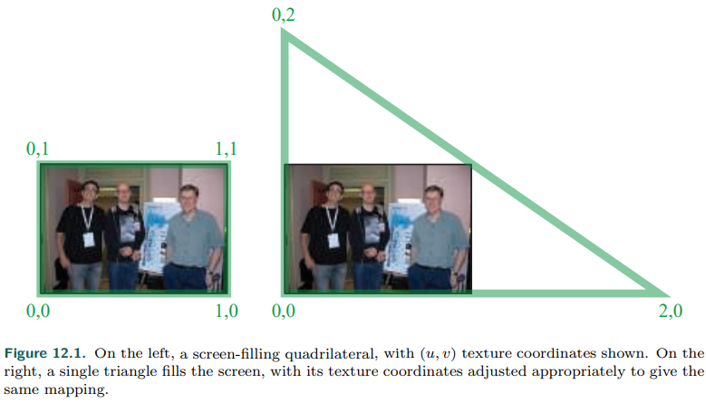
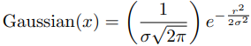
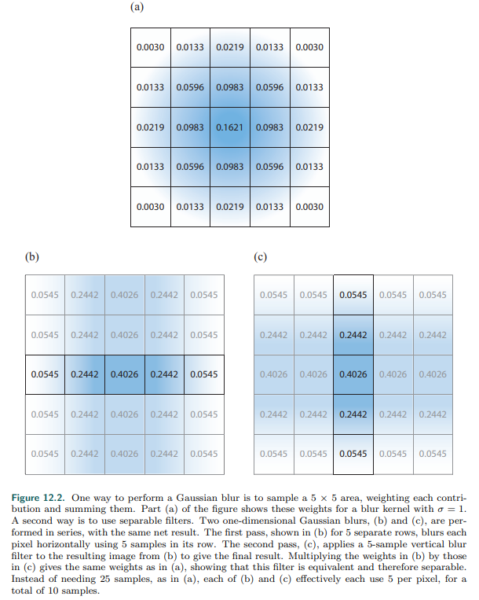
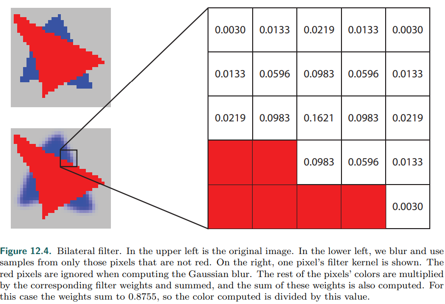
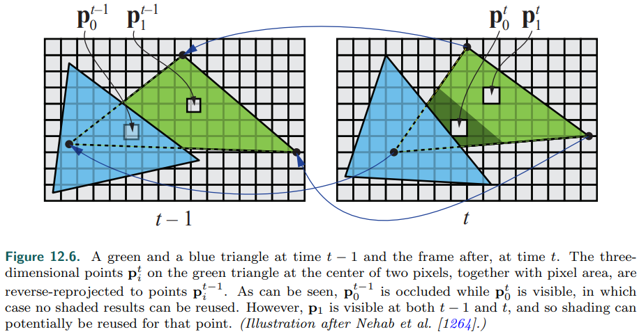
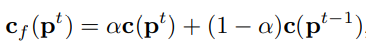

# Chapter 12——Image-Space Effects

在渲染的图像中添加<u>胶片颗粒</u>**film grain**、光晕`vignetting`和其他细微变化，可以使渲染看起来更有说服力。在本章中，我们首先讨论用**图像处理技术**修改渲染图像。

## 1. Image Processing

图像处理对输入的图像进行各种修改，而在渲染后，对图像进行修改，被称为**后处理**`post-processing`。

在GPU上使用后处理，有一些核心技术：

- 场景被渲染进一张**离屏缓冲区**`offscreen buffer`中，例如：颜色图片、深度缓冲。（对于纹理应用，使用三角形比矩形更好）

-    无论信号重建，还是出于模糊，过滤核是重要的，特别是`rotation-invariant filter kernel`，其中**高斯核**比较常用，如下：

    

    ​	其中，r是离像素中心的距离，$\sigma$是标准差，它的值越大，其钟形曲线越宽，常数项可以省略（归一化在使用时，已经隐式包含了）。实际使用时，一般时如下的离散形式：

    

- 这些内核的常见问题都是其**无限性**，一种权宜之计是对其应用`clamp`。B神提出了一个关于常用过滤核的总结:star:。**[156] [1218]**

- 一些过滤核，如高斯核:arrow_up:、box核都是**可分离的**——可以分解成两张一维纹理。这样每个像素访问纹理的次数从二维降到了一维。例如：对于$5\times 5$的核，从访问25次，降到了10次。

- **计算着色器**`Compute shaders`是很好的滤波工具，与片元着色器相比，==内核越大，性能越好==。“moving average” technique **[531, 588, 817]**。

    > 对于CS，线程组内存可用于在不同像素的**过滤计算**之间**共享图像访问**，减少带宽

==使用GPU的一个优点是==，可以使用内置的插值和mip mapping来**最小化**访问的texel数量。

- **降采样**`Downsampling `是另一个GPU支持的模糊技术。其重要想法是：生成纹理图片的更小版本。然后实际使用时，在不同的版本间进行插值，用更少的访问达到近似的效果。==这种向下采样的思想可以扩展到创建图像的mip map==，并从多个层次进行采样，以提高模糊速度。

###  1.1 Bilateral Filtering

使用**双边滤波器**`bilateral filter`可以得到**上采样**`UpSampling`结果。这个过滤器用来**保存边缘**:arrow_down:（近红色物体不执行滤波，其它则执行）。双边过滤器使用额外的信息，如深度，法线，速度，或其他数据来决定是否使用邻近的样本。

只使用深度和表面法线都与中心样本相似的邻居，这种双边滤波器也被称为**边缘保持滤波器**`edge-preserving filters`。根据不同的判断条件，也有其它类型的双边滤波器。

此技术其它的**一些应用场景**：

- 在必须保留边缘，但可以重用样本，以减少噪声的地方应用双边滤波器。
- 也被用来使用几何渲染的频率去耦着色频率。
- 近深度滤波` nearest-depth filtering`，即检索低分辨率图像中的四个样本，选择其深度最接近于高分辨率图像深度的样本。

请注意，==双边滤波器是不可分的==，因为每个像素的样本数量可以变化。

实现**后处理管道**的一种**常用方法**是使用 ping-pong buffers。简单来说，就是在两个离屏缓冲区之间应用操作，每个缓冲区都用来存放中间或最终结果。**[1303]**

> 管理和重用**瞬态资源**`transient resources`是设计现代渲染系统的一个**关键因素**

==后处理效果有哪些可以做呢==？：

- thermal imaging（热成像）
- film grain
- chromatic aberration（色差）
- edge detection
- heat shimmer and ripples（热源效果）
- help render clouds
- etc.

## 2. Reprojection Techniques

Reprojection主要基于**重用上一帧采样**的思想。它的**目标**是将渲染成本**分摊**到多个帧上（利用时间相干性），以及拟合高Cost效果。

重投影技术分为`reverse reprojection`和`forward reprojection`。

- reverse reprojection：其**基本思想**如下图:arrow_down:。大致是这样：当在第t帧渲染时，计算此帧和上一帧的顶点位置，如果两者挨得很近，就直接使用上一帧得渲染结果；如果上一帧被遮挡，也就是`cache miss`，则需要重新计算。此外，不要一直使用重用，要进行刷新。

    

    - 为了提升质量，可以使用`running-average filter`，主要做法是不断淘汰旧值，公式如下：($\alpha$通常是3/5)

    

- 