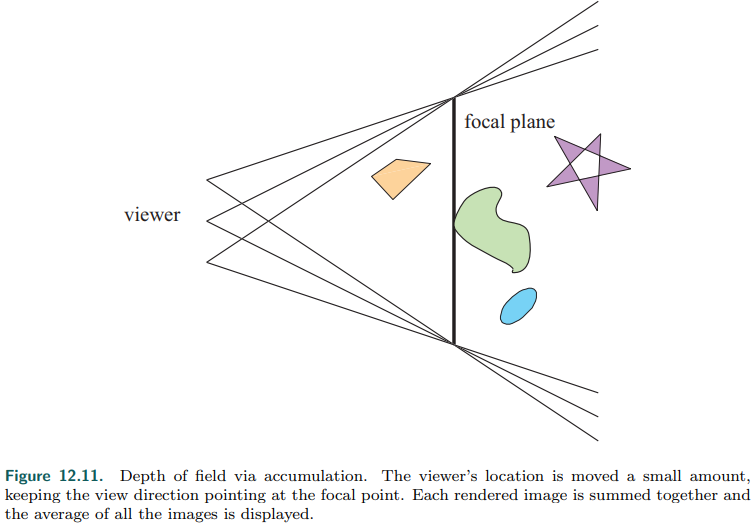
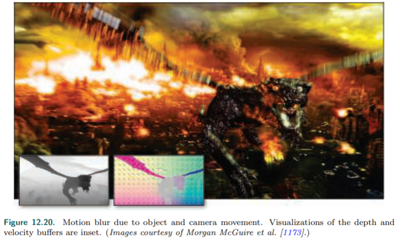

# Chapter 12——Image-Space Effects

在渲染的图像中添加<u>胶片颗粒</u>**film grain**、光晕`vignetting`和其他细微变化，可以使渲染看起来更有说服力。在本章中，我们首先讨论用**图像处理技术**修改渲染图像。

## 1. Image Processing

图像处理对输入的图像进行各种修改，而在渲染后，对图像进行修改，被称为**后处理**`post-processing`。

在GPU上使用后处理，有一些核心技术：

- 场景被渲染进一张**离屏缓冲区**`offscreen buffer`中，例如：颜色图片、深度缓冲。（对于纹理应用，使用三角形比矩形更好）

-    无论信号重建，还是出于模糊，**过滤核**是重要的，特别是`rotation-invariant filter kernel`，其中**高斯核**比较常用，如下：

    

    ​	其中，r是离像素中心的距离，$\sigma$是标准差，它的值越大，其钟形曲线越宽，常数项可以省略（归一化在使用时，已经隐式包含了）。实际使用时，一般时如下的离散形式：

    

- 这些内核的常见问题都是其**无限性**，一种权宜之计是对其应用`clamp`。B神提出了一个关于常用过滤核的总结:star:。**[156] [1218]**

- 一些过滤核，如高斯核:arrow_up:、box核都是**可分离的**——可以分解成两张一维纹理。这样每个像素访问纹理的次数从二维降到了一维。例如：对于$5\times 5$的核，从访问25次，降到了10次。

- **计算着色器**`Compute shaders`是很好的滤波工具，与片元着色器相比，==内核越大，性能越好==。“moving average” technique **[531, 588, 817]**。

    > 对于CS，线程组内存可用于在不同像素的**过滤计算**之间**共享图像访问**，减少带宽

==使用GPU的一个优点是==，可以使用内置的插值和mip mapping来**最小化**访问的texel数量。

- **降采样**`Downsampling `是另一个GPU支持的模糊技术。其重要想法是：生成纹理图片的更小版本。然后实际使用时，在不同的版本间进行插值，用更少的访问达到近似的效果。==这种向下采样的思想可以扩展到创建图像的mip map==，并从多个层次进行采样，以提高模糊速度。

###  1.1 Bilateral Filtering

使用**双边滤波器**`bilateral filter`可以得到**上采样**`UpSampling`结果。这个过滤器用来**保存边缘**:arrow_down:（近红色物体不执行滤波，其它则执行）。双边过滤器使用额外的信息，如深度，法线，速度，或其他数据来决定是否使用邻近的样本。

只使用深度和表面法线都与中心样本相似的邻居，这种双边滤波器也被称为**边缘保持滤波器**`edge-preserving filters`。根据不同的判断条件，也有其它类型的双边滤波器。

此技术其它的**一些应用场景**：

- 在必须保留边缘，但可以重用样本，以减少噪声的地方应用双边滤波器。
- 也被用来使用几何渲染的频率去耦着色频率。
- 近深度滤波` nearest-depth filtering`，即检索低分辨率图像中的四个样本，选择其深度最接近于高分辨率图像深度的样本。

请注意，==双边滤波器是不可分的==，因为每个像素的样本数量可以变化。

实现**后处理管道**的一种**常用方法**是使用 ping-pong buffers。简单来说，就是在两个离屏缓冲区之间应用操作，每个缓冲区都用来存放中间或最终结果。**[1303]**

> 管理和重用**瞬态资源**`transient resources`是设计现代渲染系统的一个**关键因素**

==后处理效果有哪些可以做呢==？：

- thermal imaging（热成像）
- film grain
- chromatic aberration（色差）
- edge detection
- heat shimmer and ripples（热源效果）
- help render clouds
- etc.

## 2. Reprojection Techniques

Reprojection主要基于**重用上一帧采样**的思想。它的**目标**是将渲染成本**分摊**到多个帧上（利用时间相干性），以及拟合高Cost效果。

重投影技术分为`reverse reprojection`和`forward reprojection`。

- reverse reprojection：其**基本思想**如下图:arrow_down:。大致是这样：当在第t帧渲染时，计算此帧和上一帧的顶点位置，如果两者挨得很近，就直接使用上一帧的渲染结果；如果上一帧被遮挡，也就是`cache miss`，则需要重新计算。此外，不要一直使用重用，要进行刷新。

    

    - 为了提升质量，可以使用`running-average filter`，主要做法是不断淘汰旧值，公式如下：($\alpha$通常是3/5)

    

- Forward reprojection：基本思路和前者一样，但是对于上一帧，不是获取它们的像素值，而是它们上一帧被采样填充到当前帧，对于遮挡重现的像素，则使用启发式的方法。**[1952]  [350]**

## 3. Lens Flare and Bloom （耀斑和辉光）

耀斑：是指光线通过透镜系统，或眼睛的间接反射，或其他*非预期路径*所造成的现象。耀斑可分为几种现象，最显著的是*光晕*`halo`和*纤毛冠*`ciliary corona`。

- 光晕是由透镜的**晶体结构**的**径向纤维**造成的。它看起来就像光周围的一圈，外面是红色的，里面是紫色的。==光晕的表观大小是恒定的==，与源的距离无关。
- 纤毛冠来自于透镜的**密度波动**，并表现为：从一点发出射线，可能延伸到光晕之外。**[1683]**

当镜头的部分，产生**内部反射**或**折射**时，相机镜头也会产生二次效果。例如，由于相机的`aperture blades`，可以出现*polygonal patterns*。**[1303]**

Bloom：是由透镜和眼睛的其他部分的**散射**引起的，在光线周围产生辉光，在场景的其他地方形成*暗淡的对比*。摄像机通过使用*电荷耦合器件*(**CCD**)将光子转换为电荷来捕捉图像。当CCD中的充电点饱和，并溢出到邻近位置时，就会在摄像机中发生**Bloom**。

> 作为一个类，*halos, coronae, and bloom*被称为**眩光效应**`glare effects`。
>
> 这些效果在摄影领域，通常是需要消除的伪影；但是在创作真实图像时，往往需要加入这些效果，来增加场景或物体的亮度**[1951]**

一些技术实现

Flare技术：K神创建了一组拥有不同纹理的方块，来代表*镜头光晕* **[899]**。然后**在**从屏幕上的光源位置到屏幕中心的**一条线上**进行定位。当光线远离屏幕中心时。这些方块小而透明，随着光线向内移动，变得更大，更不透明。其它的一些实现，**[1140] [1600] [539]**

可以通过绘制半透明的广告牌`billboard`，或对明亮的像素本身进行*后处理过滤*，以类似的方式产生**条纹**`Streaks`（在明亮的物体或灯光处的）。（*GTA5*中使用了类似的技术 **[293]**）

O神提出了steerable filter技术来产生**条纹**（如下图:arrow_down:）**[1303]**。除了billboard之外的一些其它技术，具体见书 P 526。**[1229]** 、**[1919]** 、**[598]** 、**[1012]** 、**[716]（关于实现）**

Bloom技术：实现方式和我之前接触过的一样，都是需要一个Pass，来找到亮度超过阈值的区域，对其他区域直接置为0，然后对其图像进行过滤模糊（一般是高斯），最后整合进原始图像。 **[1616, 1674]**

bloom图像可以*downsampled*几次，并从生成的一组图像中**重新采样**，从而在降低采样成本的同时，获得更广泛的模糊效果。

> 对于诸多需要过滤的技术，特别是后处理技术，我们可以对原始图像进行downsampled，然后在这种图像集上进行采样模糊，这样不仅可以降低成本，还能提升效果。

因为目标是一张看起来*曝光过度*的图像，所以在明亮的地方，这张图像的颜色会根据需要进行缩放，然后添加到原始图像中。**加法混合**使颜色饱和，然后转为白色，这通常是所需的。 **[539]、[815]**.

> 通常谈起Bloom，就离不开HDR，两者结合效果最好

## 4. Depth of Field

对于给定设置的照相机镜头，有一个*物体聚焦的范围*，即depth of field（景深）。这个范围之外的物体是模糊的——越远越模糊。

> 在摄影中，一般来说，光圈越大，景深越小。所以，白天户外场景通常只需要小光圈，因为户外光足够，由此产生了较大的景深。

因此，==控制景深效果的一种方法，是将其与色调映射联系起来==，使失焦的物体在光级降低时，变得更加模糊。另一种是手工调整。

可以使用**累计缓冲区**`accumulation buffer`来模拟景深:arrow_down:。通过改变镜头上的视图位置，并保持焦点固定，然后物体根据*离焦点的距离*进行模糊渲染。然而，与其他累积效果一样，这种方法需要对每张图像进行多次渲染，*成本很高*。

针对景深，表面可分为**三类**：近焦点场，远场，近场。第一个就是摄影师所说的**景深**。在图形学中，默认使用*具有完美焦点*的针孔相机，所以景深指的是模糊近场和远场内容。

==一个简单的解决方法就是==，预渲染图像在三个场的结果（后两个需要模糊），但缺点也很明显——*景深效果是固定的*。==另一个解决方法==是考虑景深下的表面点（通常对应一个像素），其会出现在一片区域像素内，可以限制建模为一个**填充圆**，称为**circle of confusion**。

> ==在摄影中，焦点以外区域的审美品质被称为散景`bokeh`==
>
> 便宜的相机会产生五边形的模糊，而不是完美的圆形。目前，大多数新款相机都有七个刀片`blades`，而高端机型有九个或更多刀片。更好的相机有圆形的叶片，这使得**散景**`boken`是圆形的。**[1915]**
>
> 通过孔径的光线通常是均匀分布的，而不是某种高斯分布。

==计算景深效果的一种方法==是获取表面上每个像素的位置，并将其*渲染值*扩散到这个圆或多边形内的*邻近区域*。

怎么扩散呢？ forward mapping：为每一个近场和远场像素，渲染一个**精灵**`sprite`，==每个精灵被渲染到一个单独的场层，精灵的大小由圆半径决定==。每一层**存储**所有重叠的精灵的*平均混合和*，然后层被一个接一个地合成。*缺点主要是两个*：成本高；成本不可控。

一个改进方法如上图右。假设圆圈半径受深度控制，且假设圆内像素深度一致。此类方法被称为*backward mapping* 或 *reverse mapping*。

> 目前讨论的简单拟合方法，都是单视图的，而这会损失一些信息——因为其它的视图位置可能会看到一些本来看不到的信息。而且，根据深度进行半径选择，==会产生锐边，特别是在近场和焦点场的边界处==。

关于解决锐边的一些技术。 **[209, 1178]**

- **基本思路是**：基于半径进行**分离**和**模糊**后，进行合成。利用圆半径对*原始图像*和*远场图像*进行线性插值。半径越大，远场结果使用越多。然后利用*近场图像*的**alpha**覆盖值，将近场图像混合到插值结果上。通过这种方式，近场模糊的内容正确地覆盖在后面的场景上。

==我们将讨论在电子游戏中使用的一些较新的方法(如前面的方法)==，*因为这些方法需要是有效的，健壮的，并且有可预测的成本*。

**第一种方法**：使用了一种即将提到的方法：**运动模糊**。回到`circle of confusion`的概念，把图像中的每个像素都变成对应的*混乱圆*，其强度与面积成反比。这把我们带回了*scatter*，这种思维模式在这里很有价值。给定一个像素，我们想要确定所有*重叠位置的*混乱圈，并将它们按顺序混合在一起。参见图12.15:arrow_down:。使用场景的最大混淆半径圆，对于每个像素，我们可以检查这个半径内的每个邻居，并找到它的混淆圆是否包括我们当前的位置。然后对所有影响像素的*重叠近邻样本*进行**排序和混合**。 **[832]**  **[1681]**  **[1698]**

> 这种方法是理想的，但是对发现的片段进行排序在GPU上会非常昂贵。相反，我们使用了一种被称为"*聚集的时候分散*”的方法，我们通过寻找哪些邻居会分散到像素的位置，来进行聚集。选择z深度最低的**重叠近邻**来表示最近的图像。在*z-depth*中任何与之相当接近的重叠邻居都将alpha混合贡献添加进来，取平均值，颜色和alpha存储在*前景层*中。这种混合不需要排序。所有其他重叠的邻域都会被类似地相加和取平均，然后将结果放在一个单独的*背景层*中。==前景层和背景层并不对应于近场和远场==。然后在背景图像上，合成前景图像，产生**近场模糊效果**。虽然这种方法听起来很复杂，但应用各种*采样和过滤技术*可以使其高效（直接抄的翻译，也没细看）

**第二种方法**：较老的游戏中经常使用，基于热扩散*heat diffusion*的思想。

**一种特殊的景深效应**：由明亮的光源，或场景中的反射引起，其近似的混乱圆区域的也会更亮。虽然将每个模糊的像素渲染成*精灵*是昂贵的，但这些明亮的光源*对比度更高*，因此更清楚地显示了*孔径形状*，而其他像素差别较小，因此形状不那么重要。有时，“**散景**”一词被*错误地*用来描述这些明亮的区域。检测*高对比度的区域*，并将这几个明亮的像素渲染成**精灵**，同时对其余的像素使用*gather technique*，这样就能得到一个明确的**虚化效果**，同时也很有效率:arrow_up:。**[1229, 1400, 1517]**

关于景深和散景效果，一些总结：**[1806] [1178]**。

## 5. Motion Blur

在电影领域，24FPS也能得到很好的显示效果，其中**最重要的原因**就是：它的每一帧的图像都是运动模糊图；而交互图形学领域，则不是。

> 摄影中，相机快门的开合频率一般是40到60FPS，远超24FPS。我们在电影中看的运动模糊，已经习惯，所以也希望在游戏中看到。

不进行运动模糊而进行**剧烈运动**，而产生的**抖动**，也被认为是一种`artifacts`，但不是空间而是时间上的。就像增加分辨率可以减少锯齿，但不能消除它们一样，*增加帧率*也不能消除*对运动模糊的需要*。

> 30FPS+运动模糊 > 60FPS

景深中提到的**累计缓冲区**是一个方法，但对于实时来说太贵了。只考虑运动模糊本身，而不纠结于真实感，则可以**进行优化**：**[1192]**

+ 一开始，依然累积计算8帧。
+ 然后，第九帧时，减去第一帧，并加入第九帧的渲染结果，然后求和（2到9）平均。
+ 重复这个过程（这样，每帧只需要渲染场景两次）。

> Faster techniques than rendering the frame multiple times are needed for real-time graphics. That depth of field and motion blur can both be rendered by averaging a set of views shows the similarity between the two phenomena. To render these efficiently, both effects need to scatter their samples to neighboring pixels, but we will normally gather. They also need to work with multiple layers of varying blurs, and reconstruct occluded areas given a single starting frame’s contents

**运动模糊的场景**也分很多类：相机方向改变，相机位置改变，对象位置改变，对象方向改变（*复杂度递增*）。

+ **相机方向改变**：固定场景和相机，相机朝向改变，在*整个图像*上创建有方向的模糊。过滤核的宽度取决于速度，这个方法也被称为*line integral convolution* (**LIC**)。**[219, 703]**

+ **相机位置改变**：需要考虑**视差**——远处的物体相对相机，移动较少，模糊不明显。当相机向前移动时，*视差可能被忽略*，此时放射状模糊`radial blur`可能就足够了.

  

+ **对象位置改变**：在计算机图形学中，如果一边向前看，一边横向移动，称为*pan*。通过*深度信息*控制*模糊程度*，但向前移动更为复杂。

  + R神提出使用上一帧相机的**视图矩阵**来计算*速度*。对于一个像素，转换到世界空间，然后利用这个矩阵映射回屏幕空间，两点的*差值*就是速度，用来计算模糊。**[1509]**

+ **对象方向改变**：一个直接的方法是对模糊本身进行建模和渲染。想象一把剑从空中划过，沿着剑刃边缘添加两个多边形，其每个顶点都使用*alpha不透明度*，所以当一个多边形遇到剑时，它是==完全不透明==的，而在多边形的外边缘，alpha是==完全透明==的。这个想法是，模型在移动的方向上具有透明度，模拟：剑只在（想象的）*快门打开的部分时间内*覆盖这些像素。

  + **scatter-as-you-gather approaches**：（景深时提到的思想）沿着帧内走过的路径拉伸每个样本，*类似于LIC*。快速移动的样本覆盖更多的区域，所以在每个位置的影响较小。理论上，==我们可以把一个场景中的所有样本，按排序顺序画成半透明的线段==。

    

怎么得到像素的速度呢？一个广泛使用的技术是velocity buffer。要创建这个缓冲区，需要在模型的*每个顶点*插入*屏幕空间速度*——可以通过对模型应用两个建模矩阵来计算，一个用于前一帧，另一个用于当前帧。（下图左下的彩色图是速度缓冲区的可视化结果）**[584] [1912] [294]**

对于交互式运动模糊，==我们从定时序列中取出一帧作为代表图像==，有了这个帧和速度缓冲，我们就可以重建物体对每个像素的影响，使用运动模糊的*scatter-as-you-gather system*： **[208, 1173] 、[1681]、[1408]（code）**

+ **在第一个Pass中**：计算每个$8\times8$的像素块中的最大速度（图像被划分成块），存入一个缓冲区。

+ **在第二个Pass中**，对于上一个结果缓冲区的$3\times 3$区域进行测试，来找到最大速度。这确保了*在一个块中快速移动的*物体，将被相邻的块计算。

  > 之后的模糊可以在相邻的图像块上重叠，所以这些图像块必须在足够宽的区域内找到这些移动的物体

+ **最后一个Pass**计算运动模糊。*与景深类似*，每个像素都要检查附近*可能快速移动并与像素重叠的*样本。不同的是，每个样本都有自己的**速度向量**。有不同的方法来*过滤和混合*相关样本。**一种方法**是利用最大速度的大小来确定核的方向和宽度。如果这个速度小于半像素，则不需要运动模糊；否则，沿最大速度方向进行图像采样**[1173]**。

具体关于此技术的讨论集扩展，可见书 P 542。

## Further Reading and Resources

Several textbooks are dedicated to ==traditional image processing==, such as Gonzalez and Woods **[559]**. 

In particular, we want to note Szeliski’s Computer Vision: ==Algorithms and Applications== **[1729]**, as it discusses image processing and many other topics and how they relate to synthetic rendering. The electronic version of this book is *free for download*; see our website *realtimerendering.com* for the link. 

The course notes by Paris et al. **[1355]** provide a formal introduction to ==bilateral filters==, also giving numerous examples of their use. 

The articles by McGuire et al. **[208, 1173]** and Guertin et al. [621] are lucid expositions of their respective work on ==motion blur==; code is available for their implementations. 

Navarro et al. **[1263]** provide a thorough report on ==motion blur== for both interactive and batch applications.

 Jimenez **[832]** gives a detailed, well-illustrated account of ==filtering and sampling== problems and solutions involved in *bokeh, motion blur, bloom, and other cinematic effects.* 

Wronski **[1918]** discusses restructuring a complex **post-processing pipeline** for efficiency.

For more about simulating a range of ==optical lens effects==, see the lectures presented in a SIGGRAPH course organized by Gotanda **[575]**.

