# Chapter 13——Beyond Polygons

基于三角化的网格进行渲染是流行的，但用图像来表示物体是一种更加高效的方法，而且用来表示云雾等物体是简单的。接下来将讨论如下技术：

- sprites,
- billboards,
- impostors,
- particles,
- point clouds,
- voxels

## 1. The Rendering Spectrum（渲染光谱）

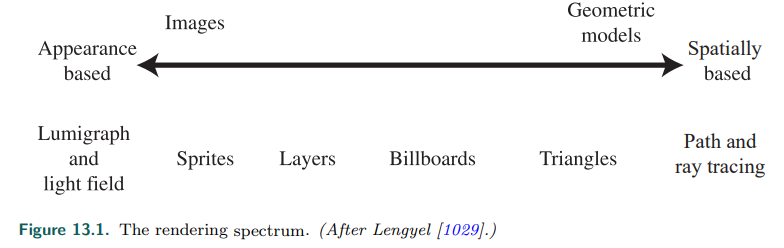

靠近物体时，希望呈现更多的物体细节；而远离物体，则无需如此。这种思想就是我们常见的**LOD**，Level of Detail。

用一幅*能快速发送到屏幕上*的图像来*表示一个物体*通常要便宜一些。接下来，将从左至右:arrow_up:进行介绍。

## 2. Fixed-View Effects

直接固定摄像机，场景只渲染一次（可以离线进行了都）。

一个与静态场景相关的概念是**gloden thread**，也被称为适应细化*adaptive refinement*，或渐进细化*progressive refinement*。这个基本想法是：在全静态场景下，随着时间的推移，图像的质量越来越高。可以进行不同的细化，例如：每帧计算的采样点不同，然后混合，产生抗锯齿的效果；进行路径追踪；应用高质量的阴影技术。

一些应用对此进行了进一步的研究，以允许在**电影级**的图像上进行*灯光交互编辑*，被称为relighting。其**理念**是，用户选择场景中的一个视图，然后进行*离线处理*，进而产生一组缓冲区或更精细的结构来表示场景。**[1454] [1366]**

## 3. Skyboxes

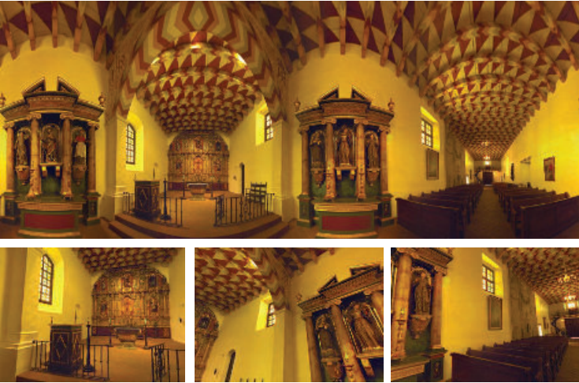

天空盒技术。

对于一个物体或一组物体，距离观察者*足够远*，彼此又*足够近*时，观察者改变位置，几乎感觉不到视差*parallax*效果。**天空盒的网格**通常*以观众为中心*，随着他们移动。skybox网格不必很大，因为通过保持相对位置，它看起来不会改变形状。

对于此技术而言，cubeMap的分辨率是很重要的，一般要符合如下公式：**{1}**

其中，fov是相机的视场。

除了cube map，也可以使用其它形状的贴图。G神使用一个*扁平的圆顶*来代表天空。这种几何形状最适合模拟*云在头顶移动*。云本身是通过组合和动画**各种二维噪音纹理**来表示的。 **[520]**

## 4. Light Field Rendering

*Lumigraph***[567]**和光场渲染**[1034]**试图从一组视点捕捉单个物体。给定一个新视点，这些技术将在存储的视图之间执行*插值处理*，以创建新的视图。其==最大的优点==是：能够捕获真实的对象，并从任何角度重新显示它。**[1729]**

近年来，人们对光场渲染有了新的研究兴趣，==因为它可以让眼睛在虚拟现实（VR）显示中正确调整焦点==。

## 5. Sprites and Layers

最简单的基于图像的渲染技术是Sprites。精灵是在屏幕上移动的图像，例如：鼠标。

一种普遍的精灵形式是**渲染**一张*始终朝向观察者*的图像。这允许精灵调整*大小和扭曲warped*，图像的alpha通道可以为精灵的各个像素提供完全或部分透明度，从而也在边缘上提供**抗锯齿效果**。

**另一种方法**是将场景看作一系列层Layers:arrow_down:。这种分层适用于*大量视点集*，每个精灵层都有一个与之关联的深度。我们可以在不需要z缓冲区的情况下建立场景：摄像机的缩放让对象变大；摄像机的进出实际上改变了前景和背景的*相对覆盖率*，这可以通过改变每个**sprite**层的覆盖率和位置来处理；当浏览者横向或纵向移动时，可以*相对移动*图层的深度。

> 后备箱在鸡的前面，鸡在卡车驾驶室的前面，驾驶室在路和树的前面

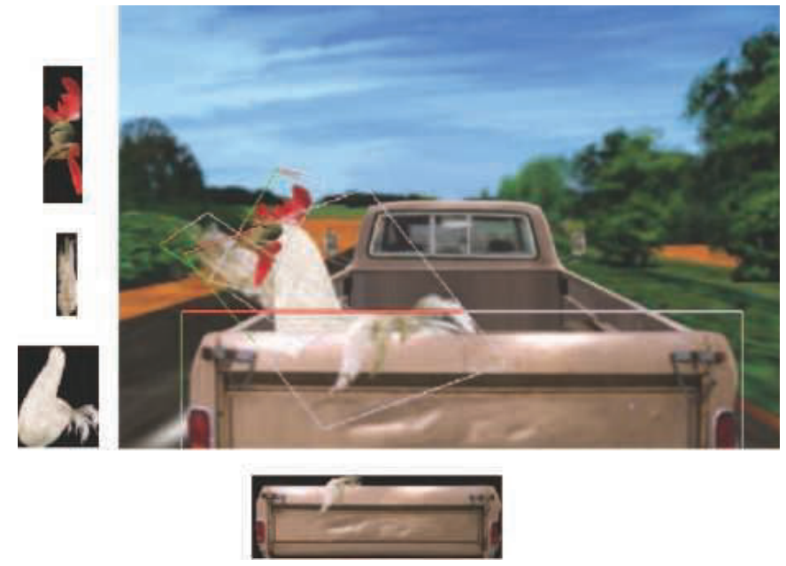

## 6. Billboarding

根据视线方向*，旋转一个纹理矩形*的技术是billboarding，这个矩形被称为==billboard==。当视图改变时，矩形的方向也随之改变。代表技术如下：*草、烟、火、雾、爆炸、能量盾、蒸汽痕迹和云*。

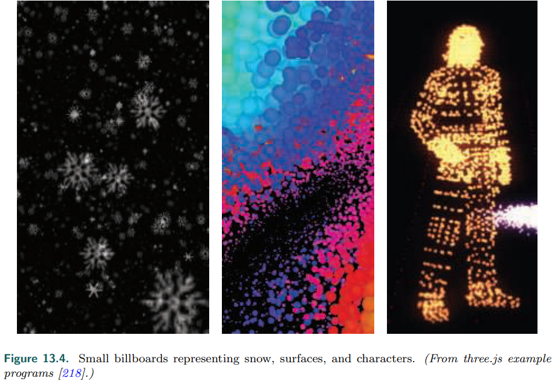

找到一个*表面法线*和一个*上方向*来定位矩形。这两个向量足以建立表面的标准正交基。然后，四边形（例如，*它的中心*）的**锚点**被用来确定它在空间中的位置。其**坐标系的求解**比较常见，如下图:arrow_down:

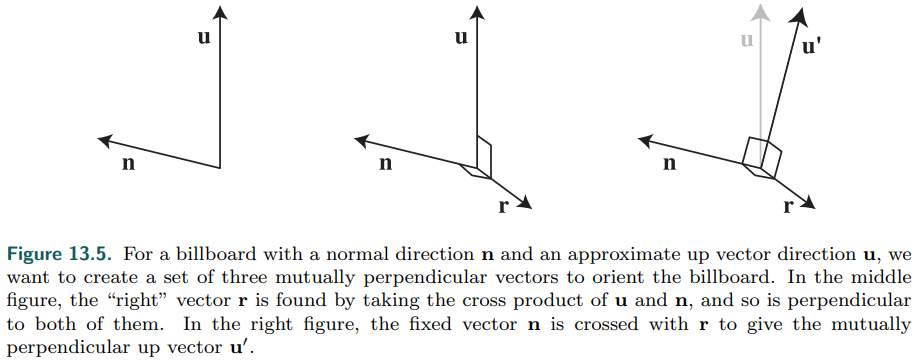
$$
M=(r,u^/,n)
$$
有了这些前期准备，剩下的**主要任务**就是决定用什么*表面法线*和*上矢量*，来定义广告牌的方向。以下章节将讨论*构建这些向量*的方法。

### 6.1 Screen-Aligned Billboard

最简单的形式是==screen-aligned billboard==。类似于之前说过的精灵技术，图像总是平行于屏幕，并且有一个**恒定的上向量**，**n**和**u**是摄像机的常数。

除了*粒子效果*外，==screen-aligned billboard==对于*注释文本*和*地图placemark*等效果也很有用，因为文本总是与屏幕对齐的，因此得名“**广告牌**”。这意味着，如果用户放大Zoom，广告牌将增加其在*世界空间*的大小。因此，==对象的大小依赖于视图==，这可能会使**截锥剔除等方案**复杂化。

> 代表使用技术：人物血条、名称

### 6.2 World-Oriented Billboard

如果摄像机向侧面倾斜，比如在*飞行模拟中*，进入一个曲线，我们就希望**广告牌云**`billboard clouds`能够*响应倾斜*。如果一个精灵代表了一个物理对象，它通常是相对于世界的向上方向，而不是摄像机的方向。**圆形精灵不会受到倾斜的影响，但其他广告牌形状会受到影响**。我们可能会希望这些广告牌保持面向观众，但也会沿着它们的视轴旋转，以保持世界的导向性。

对于这样的精灵，==一种渲染它们的方法是==：使用**世界坐标系**下的**上向量**u来推导旋转矩阵（注意，这里不是直接使用，而需要通过法线n进行推导，存在误差），法线n仍然是**视点平面法线**的反方向（使用它来调整前面的u）。

对所有*精灵*使用**相同的旋转矩阵**是有风险的。由于透视投影的性质，==距离视图轴有一定距离的对象是弯曲的==。如下图的底层，圆变成了椭圆，当然这没问题（==虚拟相机的几何视场与眼睛的显示视场相匹配，那么这些球体看起来就没有翘曲==）。但也有些情况，翘曲反而是不对的。

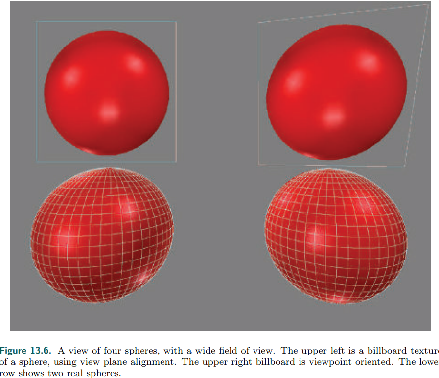

将法线修改为：从*广告板的中心*到观察者的位置。这种技术被称为viewpoint-oriented billboard。

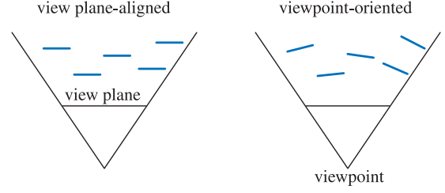

G神使用此技术来产生*火焰、烟雾和爆炸*。==以随机和混乱的方式聚集和重叠动画精灵==。**[624] [1273]**

关于纹理的透明边缘之前也讨论过，这里P神做出的优化是：使用**更加紧凑的四边形**来处理精灵，更加高效:arrow_down:。 **[439, 1379, 1382]**

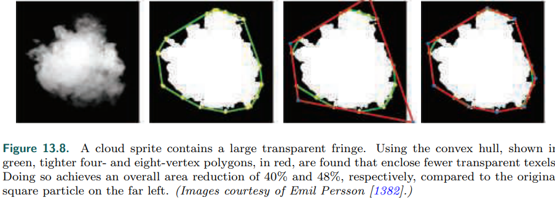

云渲染

一个常见的使用是==渲染云==。**[358] [670]**。Wang**[1839, 1840]**详细介绍了在微软的产品中使用的**云建模**和渲染技术。每片云由**5到400个**广告牌组成，只需要**16**种不同的*基本精灵纹理*，因为这些可以用**不均匀**的缩放和旋转进行修改，从而形成各种各样的云类型。基于**离云中心的距离**修改透明度，模拟云的*形成和消散*。

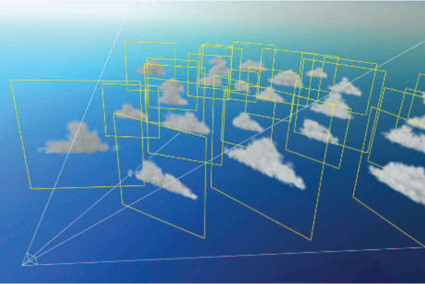

==平面广告牌并不是唯一的云渲染技术==。例如，E神**[421]**通过渲染一组**嵌套的椭圆**来生成云，这些椭圆在*viewing silhouettes*周围变得更加透明。

B神渲染了他们称之为 "**巨型粒子** "的椭圆体，然后使用**模糊**和**屏幕空间湍流纹理***turbulence texture*来渲染令人信服的云。**[90]**

P神提出使用**程序纹理**，生成云（这类可见ShaderToy）。

如第5.5和6.6节所述，为了**正确合成**，==重叠的半透明广告牌应按顺序渲染==。当**烟雾广告牌**与固体物体相交时会产生伪影。如下图，本来是一个整体的烟雾，产生了不该有的层次感。

==一个解决方案是==：让片元着色程序在处理每个广告牌时，检查底层对象的**z深度**。**公告板测试这个深度，但不将其替换为自己的深度**，也就是说，不写z-depth。如果底层对象在一个像素上接近广告牌的深度，那么*billboard fragment*就会变得更加透明。当达到最大褪色距离时，随着深度的线性衰落会导致**不连续性**。**s曲线淡出函数**避免了这个问题。使用软粒子*soft particles*的淡出，解决了*广告牌与实体相交*的问题。

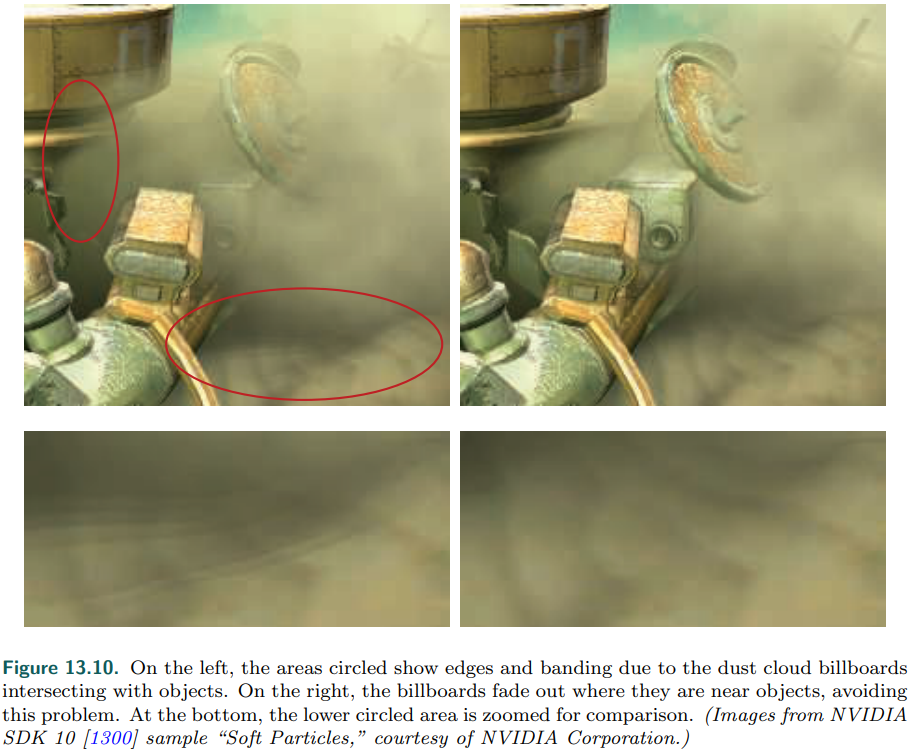

更现实的解决方案是可能的。Umenhoffer等人**[1799,1800]**提出了**球形广告牌**的想法。:star:

在*《孤岛危机》***[1227,1870]**中使用了一种略有不同的技术，使用**盒子**而不是球体来减少片元着色器的成本。

### 6.3 Axial Billboard

最后一个常用技术是Axial Billboard。在这个技术中，纹理不必始终朝向观察者，相反，它可以绕着某个*固定的世界空间轴*旋转，并在这个范围内，尽可能地对齐自己，**面向查看者**。

> 这种技术主要是用于渲染**远处的树木**

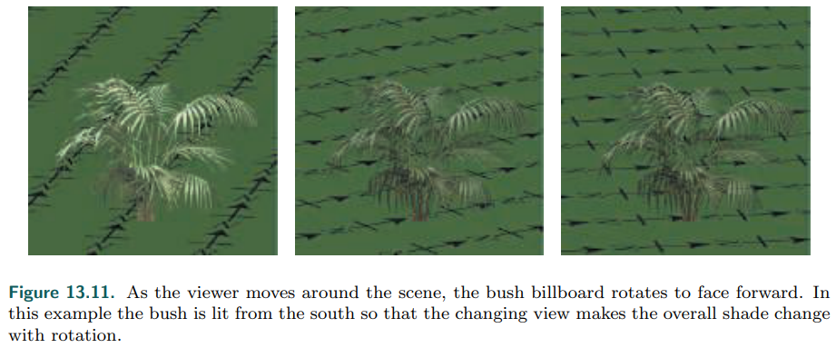

这张图:arrow_up:是一个*单一的、面向摄像机的*广告牌，不同于*第203页图6.28*所示的 "**交叉树**"。对于这种形式的**广告牌**，*世界坐标系*的**上向量**是固定的，而**视点方向被用作第二个可调节的向量**。一旦形成这个**旋转矩阵**，树就会被转换到它的位置。

> :star:关于这个和上一节的方法，其区别主要是啥？上节的*world-oriented*，是视线（法线n）固定的，然后通过右向量，进行之前讲过的算法，求得上向量。然后呢，为了更好的匹配**此上向量**和**世界坐标系的上向量**，可以通过旋转（绕n），来修改右向量，然后调整上向量，来更好的匹配。
>
> 而本节，则是逆过程。固定**上向量**为**世界上向量**，而去调整视线向量（法线n）。

因此，本技术的一个问题是，如果观看者**从树上方往下看**，就会发现这个假象。一种**解决方法**是添加树的*水平横截面纹理*。另一个是，在网格建模方法和广告版技术之间进行自动切换。**[908]**

==激光束效果==可以通过*轴向广告牌*进行渲染:arrow_down:，因为它们的外观从轴周围的任何角度来看都是一样的。

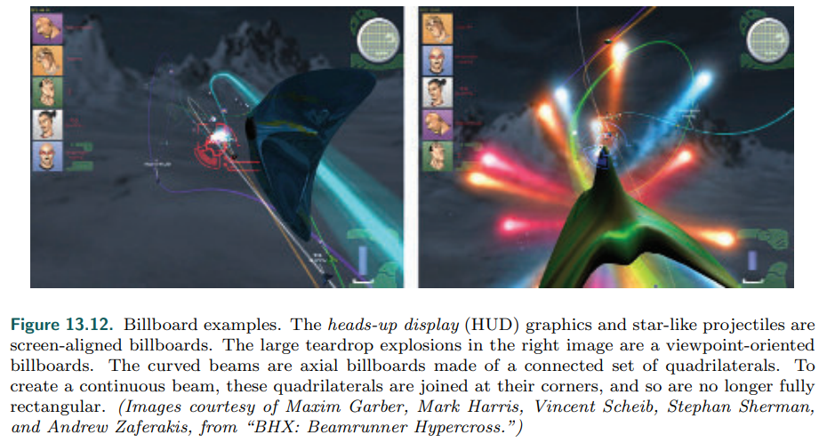

这类技术说明了这些算法及其后续算法的一个**重要思想**：片元着色器的目的是==评估真实的几何体，丢弃被表示对象边界之外的fragments==。（这段没看懂，后续再说 。书 P 560）

###  6.4 Impostors

impostor：是通过将复杂物体渲染进一张纹理，得到的广告牌。此技术可以用于对象的*几个实例或几个帧*，从而**摊销**生成它的成本。本节主要讨论此技术更新的几个策略。M神关于这个，提出了一个介绍**[1097]**。

此技术对于**快速渲染远处的物体**很有用，因为一个复杂的模型被简化为一个单一的图像。此外，如果近处的物体在运动时，观察者得到的表面区域没有变化，此时也可以使用**impostor**。

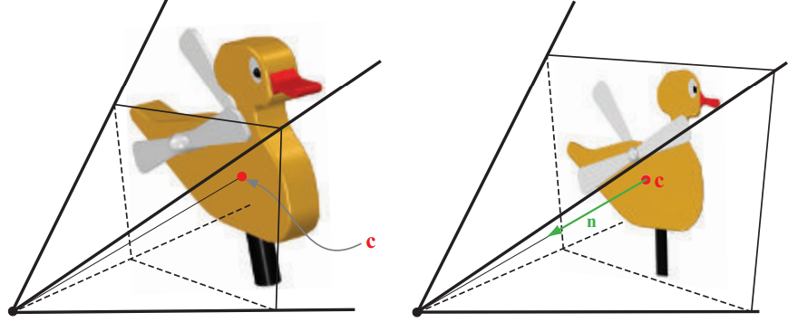

生成方法如上图。然后对这个图像应用*viewpoint-oriented billboard*。更新方法可见**[1549]**。

通常情况下，最好是在对象移动时**渲染几何图形**，在对象静态时切换到**视点替用特效** **[482]**。

B神对此技术进行了一个介绍 **[122]**。

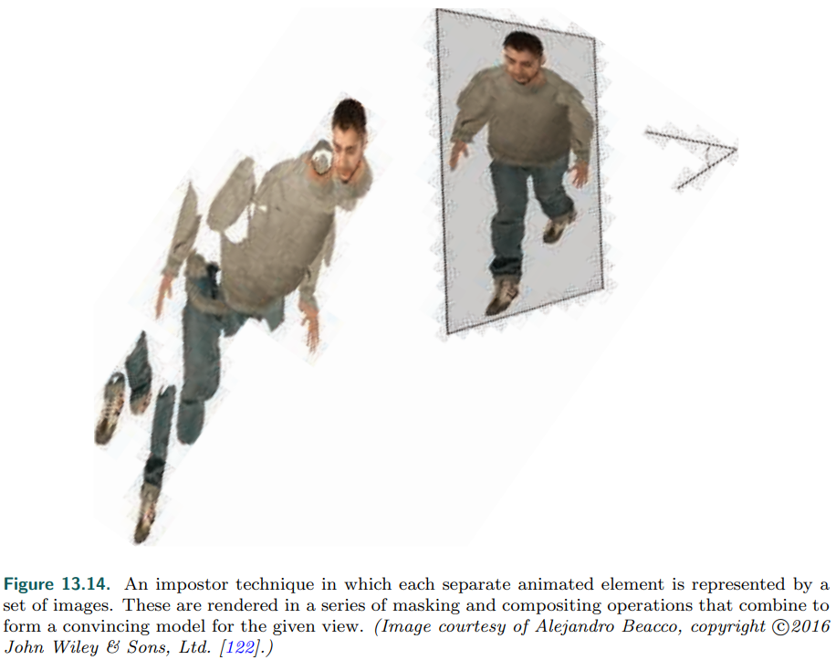

### 6.5 Billboard Representation

视点替用的**问题**在于其朝向是固定的，如果物体朝向改变，那么就需要更新。D神为了让此类技术，更加接近网格渲染，提出了billboard cloud技术 **[338]**。==一个复杂的模型通常可以用一小部分重叠的广告牌来表示==。额外信息，如*法线或位移贴图*和不同的材料，可以应用到他们的表面，使这样的模型更令人信服。

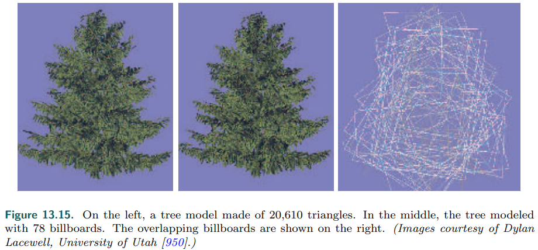

使用**广告牌云**可能导致**大量透支**，这可能是昂贵的。质量也会受到影响，因为交叉裁剪*intersecting cutouts*可能意味着：严格的*back-to-front* 的绘制顺序无法实现。 *Alpha to coverage* (第6.6节) 可以帮助渲染**复杂的Alpha纹理**。

另一种方法是**用体积纹理来表示这些物体**，并将其渲染成一系列*垂直于视线方向*的图层。**[337]**

## 7. Displacement Techniques

如果**Imposter**的纹理用**深度组件**增强，此时称为`depth sprite`或`nailboard`**[1550]**。这个时候的纹理是一张RGB:small_red_triangle:图，其中:small_red_triangle:存储了从*精灵*到*所代表的几何形状*的正确深度的**偏差**，是视点空间下的**高度场**。此技术优于imposter，因为可以更好地与周围的对象合并:arrow_down:。

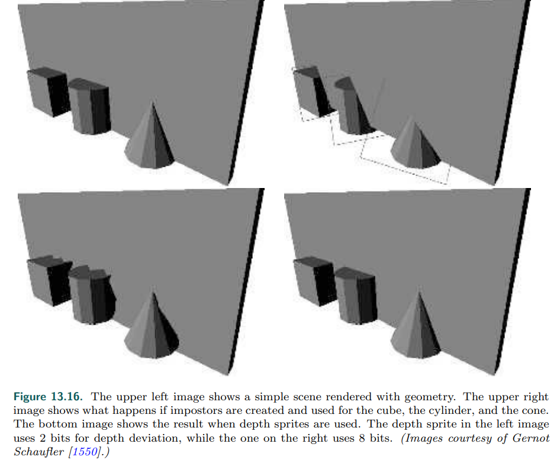

从左至右，从上至下，依次是：原始、Imposter、depth sprite 2-bit、depth sprite 8-bit。除此之外，还有*layered depth image* **[1611]**、*LDI tree* **[255]**等技术。

与深度精灵相关的是Oliveira等人引入的==浮雕纹理映射==relief texture mapping。浮雕纹理是一幅具有高度场的图像，它代表了表面的真实位置。与深度精灵不同，图像不是在广告牌上渲染的，而是面向世界空间的四边形。对象可以由一组在其接缝处匹配的浮雕纹理来定义。**[1324]** **[1425]**

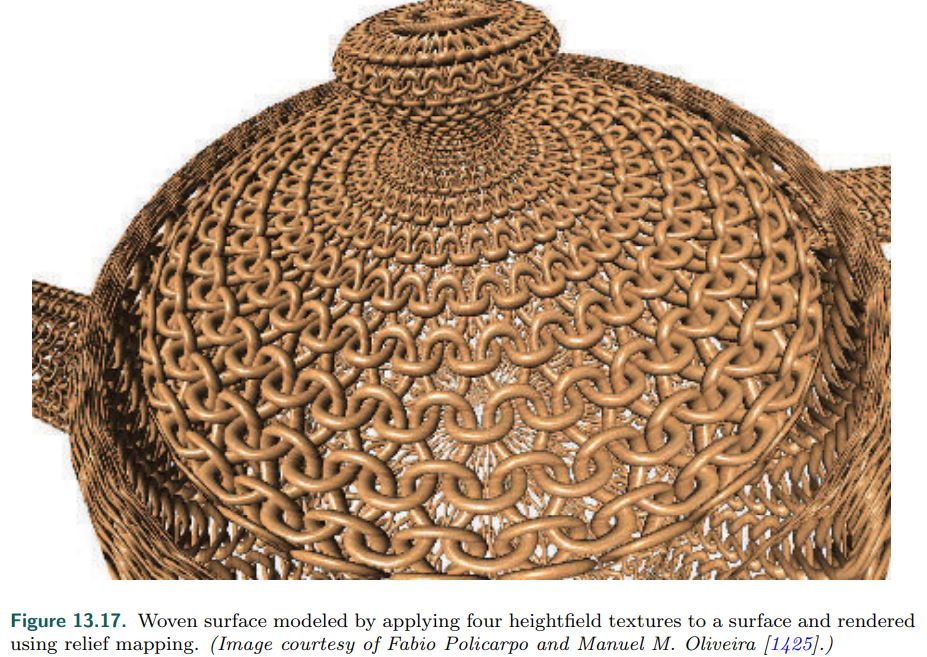

Beacco等人**[122]**在人群场景中使用*relief impostors*。在这个表示法中，模型的*颜色、法线和高场纹理*将被生成，并与盒子的每个面相关联。当一个面被渲染时，执行Ray March，来找到可见的表面。一个盒子与模型的每个刚性部分**(“骨头”)**相关联，这样就可以执行动画:arrow_down:。

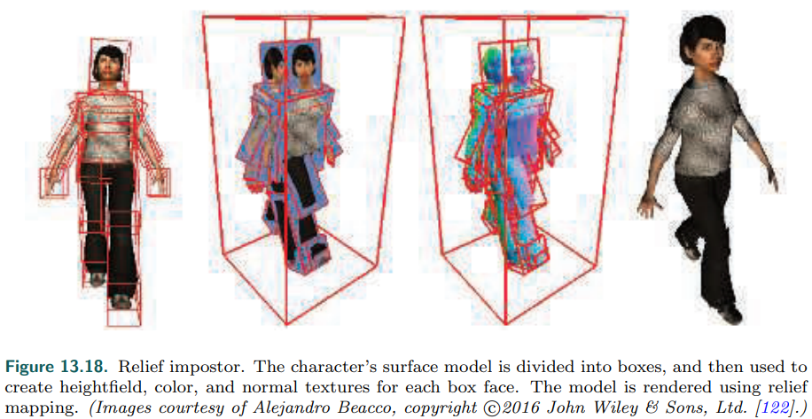

一个有趣的技术：geometry image。**[616]** **[852]**

## 8. Particle Systems

==粒子系统[1474]是一组独立的小物体，它们通过某种算法进行运动==。与本章相关的是**粒子的建模和渲染方式**。

可以使用**广告牌技术**来生成粒子系统。每个粒子的广告牌可以通过一个*几何着色器*来生成，但是在实践中，使用*顶点着色器*来生成精灵可能更快。

如果用**半透明的广告牌粒子**来表示**烟雾**等现象，==渲染透明物体的挑战必须得到解决==。 *Backto-front sorting*是一个方法，但太昂贵。Ericson**[439]**提供了一长串**高效渲染粒子**的建议，我们在这里列出一些，及其相关文章：

- 

