# Chapter 13——Beyond Polygons

基于三角化的网格进行渲染是流行的，但用图像来表示物体是一种更加高效的方法，而且用来表示云雾等物体是简单的。接下来将讨论如下技术：

- sprites,
- billboards,
- impostors,
- particles,
- point clouds,
- voxels

## 1. The Rendering Spectrum（渲染光谱）

靠近物体时，希望呈现更多的物体细节；而远离物体，则无需如此。这种思想就是我们常见的**LOD**，Level of Detail。

用一幅*能快速发送到屏幕上*的图像来*表示一个物体*通常要便宜一些。接下来，将从左至右:arrow_up:进行介绍。

## 2. Fixed-View Effects

直接固定摄像机，场景只渲染一次（可以离线进行了都）。

一个与静态场景相关的概念是**gloden thread**，也被称为适应细化*adaptive refinement*，或渐进细化*progressive refinement*。这个基本想法是：在全静态场景下，随着时间的推移，图像的质量越来越高。可以进行不同的细化，例如：每帧计算的采样点不同，然后混合，产生抗锯齿的效果；进行路径追踪；应用高质量的阴影技术。

一些应用对此进行了进一步的研究，以允许在**电影级**的图像上进行*灯光交互编辑*，被称为relighting。其**理念**是，用户选择场景中的一个视图，然后进行*离线处理*，进而产生一组缓冲区或更精细的结构来表示场景。**[1454] [1366]**

## 3. Skyboxes

天空盒技术。

对于一个物体或一组物体，距离观察者*足够远*，彼此又*足够近*时，观察者改变位置，几乎感觉不到视差*parallax*效果。**天空盒的网格**通常*以观众为中心*，随着他们移动。skybox网格不必很大，因为通过保持相对位置，它看起来不会改变形状。

对于此技术而言，cubeMap的分辨率是很重要的，一般要符合如下公式：**{1}**

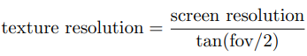

其中，fov是相机的视场。

除了cube map，也可以使用其它形状的贴图。G神使用一个*扁平的圆顶*来代表天空。这种几何形状最适合模拟*云在头顶移动*。云本身是通过组合和动画**各种二维噪音纹理**来表示的。 **[520]**

## 4. Light Field Rendering

*Lumigraph***[567]**和光场渲染**[1034]**试图从一组视点捕捉单个物体。给定一个新视点，这些技术将在存储的视图之间执行*插值处理*，以创建新的视图。其==最大的优点==是：能够捕获真实的对象，并从任何角度重新显示它。**[1729]**

近年来，人们对光场渲染有了新的研究兴趣，==因为它可以让眼睛在虚拟现实（VR）显示中正确调整焦点==。

## 5. Sprites and Layers

最简单的基于图像的渲染技术是Sprites。精灵是在屏幕上移动的图像，例如：鼠标。

一种普遍的精灵形式是**渲染**一张*始终朝向观察者*的图像。这允许精灵调整*大小和扭曲warped*，图像的alpha通道可以为精灵的各个像素提供完全或部分透明度，从而也在边缘上提供**抗锯齿效果**。

**另一种方法**是将场景看作一系列层Layers:arrow_down:。这种分层适用于*大量视点集*，每个精灵层都有一个与之关联的深度。我们可以在不需要z缓冲区的情况下建立场景：摄像机的缩放让对象变大；摄像机的进出实际上改变了前景和背景的*相对覆盖率*，这可以通过改变每个**sprite**层的覆盖率和位置来处理；当浏览者横向或纵向移动时，可以*相对移动*图层的深度。

> 后备箱在鸡的前面，鸡在卡车驾驶室的前面，驾驶室在路和树的前面

## 6. Billboarding

根据视线方向*，旋转一个纹理矩形*的技术是billboarding，这个矩形被称为==billboard==。当视图改变时，矩形的方向也随之改变。代表技术如下：*草、烟、火、雾、爆炸、能量盾、蒸汽痕迹和云*。

找到一个*表面法线*和一个*上方向*来定位矩形。这两个向量足以建立表面的标准正交基。然后，四边形（例如，*它的中心*）的**锚点**被用来确定它在空间中的位置。其**坐标系的求解**比较常见，如下图:arrow_down:

$$
M=(r,u^/,n)
$$
有了这些前期准备，剩下的**主要任务**就是决定用什么*表面法线*和*上矢量*，来定义广告牌的方向。以下章节将讨论*构建这些向量*的方法。

### 6.1 Screen-Aligned Billboard

最简单的形式是==screen-aligned billboard==。类似于之前说过的精灵技术，图像总是平行于屏幕，并且有一个**恒定的上向量**，**n**和**u**是摄像机的常数。

除了*粒子效果*外，==screen-aligned billboard==对于*注释文本*和*地图placemark*等效果也很有用，因为文本总是与屏幕对齐的，因此得名“**广告牌**”。这意味着，如果用户放大Zoom，广告牌将增加其在*世界空间*的大小。因此，==对象的大小依赖于视图==，这可能会使**截锥剔除等方案**复杂化。

> 代表使用技术：人物血条、名称

### 6.2 World-Oriented Billboard

如果摄像机向侧面倾斜，比如在*飞行模拟中*，进入一个曲线，我们就希望**广告牌云**`billboard clouds`能够*响应倾斜*。如果一个精灵代表了一个物理对象，它通常是相对于世界的向上方向，而不是摄像机的方向。**圆形精灵不会受到倾斜的影响，但其他广告牌形状会受到影响**。我们可能会希望这些广告牌保持面向观众，但也会沿着它们的视轴旋转，以保持世界的导向性。

对于这样的精灵，==一种渲染它们的方法是==：使用**世界坐标系**下的**上向量**u来推导旋转矩阵（注意，这里不是直接使用，而需要通过法线n进行推导，存在误差），法线n仍然是**视点平面法线**的反方向（使用它来调整前面的u）。

对所有*精灵*使用**相同的旋转矩阵**是有风险的。由于透视投影的性质，==距离视图轴有一定距离的对象是弯曲的==。如下图的底层，圆变成了椭圆，当然这没问题（==虚拟相机的几何视场与眼睛的显示视场相匹配，那么这些球体看起来就没有翘曲==）。但也有些情况，翘曲反而是不对的。

将法线修改为：从*广告板的中心*到观察者的位置。这种技术被称为viewpoint-oriented billboard。

G神使用此技术来产生*火焰、烟雾和爆炸*。==以随机和混乱的方式聚集和重叠动画精灵==。**[624] [1273]**

关于纹理的透明边缘之前也讨论过，这里P神做出的优化是：使用**更加紧凑的四边形**来处理精灵，更加高效:arrow_down:。 **[439, 1379, 1382]**

云渲染

一个常见的使用是==渲染云==。**[358] [670]**。Wang**[1839, 1840]**详细介绍了在微软的产品中使用的**云建模**和渲染技术。每片云由**5到400个**广告牌组成，只需要**16**种不同的*基本精灵纹理*，因为这些可以用**不均匀**的缩放和旋转进行修改，从而形成各种各样的云类型。基于**离云中心的距离**修改透明度，模拟云的*形成和消散*。

==平面广告牌并不是唯一的云渲染技术==。例如，E神**[421]**通过渲染一组**嵌套的椭圆**来生成云，这些椭圆在*viewing silhouettes*周围变得更加透明。

B神渲染了他们称之为 "**巨型粒子** "的椭圆体，然后使用**模糊**和**屏幕空间湍流纹理***turbulence texture*来渲染令人信服的云。**[90]**

P神提出使用**程序纹理**，生成云（这类可见ShaderToy）。

如第5.5和6.6节所述，为了**正确合成**，==重叠的半透明广告牌应按顺序渲染==。当**烟雾广告牌**与固体物体相交时会产生伪影。如下图，本来是一个整体的烟雾，产生了不该有的层次感。

==一个解决方案是==：让片元着色程序在处理每个广告牌时，检查底层对象的**z深度**。**公告板测试这个深度，但不将其替换为自己的深度**，也就是说，不写z-depth。如果底层对象在一个像素上接近广告牌的深度，那么*billboard fragment*就会变得更加透明。当达到最大褪色距离时，随着深度的线性衰落会导致**不连续性**。**s曲线淡出函数**避免了这个问题。使用软粒子*soft particles*的淡出，解决了*广告牌与实体相交*的问题。

更现实的解决方案是可能的。Umenhoffer等人**[1799,1800]**提出了**球形广告牌**的想法。:star:

在*《孤岛危机》***[1227,1870]**中使用了一种略有不同的技术，使用**盒子**而不是球体来减少片元着色器的成本。

### 6.3 Axial Billboard

最后一个常用技术是Axial Billboard。在这个技术中，纹理不必始终朝向观察者，相反，它可以绕着某个*固定的世界空间轴*旋转，并在这个范围内，尽可能地对齐自己，**面向查看者**。

> 这种技术主要是用于渲染**远处的树木**

这张图:arrow_up:是一个*单一的、面向摄像机的*广告牌，不同于*第203页图6.28*所示的 "**交叉树**"。对于这种形式的**广告牌**，*世界坐标系*的**上向量**是固定的，而**视点方向被用作第二个可调节的向量**。一旦形成这个**旋转矩阵**，树就会被转换到它的位置。

> :star:关于这个和上一节的方法，其区别主要是啥？上节的*world-oriented*，是视线（法线n）固定的，然后通过右向量，进行之前讲过的算法，求得上向量。然后呢，为了更好的匹配**此上向量**和**世界坐标系的上向量**，可以通过旋转（绕n），来修改右向量，然后调整上向量，来更好的匹配。
>
> 而本节，则是逆过程。固定**上向量**为**世界上向量**，而去调整视线向量（法线n）。

因此，本技术的一个问题是，如果观看者**从树上方往下看**，就会发现这个假象。一种**解决方法**是添加树的*水平横截面纹理*。另一个是，在网格建模方法和广告版技术之间进行自动切换。**[908]**

==激光束效果==可以通过*轴向广告牌*进行渲染:arrow_down:，因为它们的外观从轴周围的任何角度来看都是一样的。

这类技术说明了这些算法及其后续算法的一个**重要思想**：片元着色器的目的是==评估真实的几何体，丢弃被表示对象边界之外的fragments==。（这段没看懂，后续再说 。书 P 560）

###  6.4 Impostors

impostor：是通过将复杂物体渲染进一张纹理，得到的广告牌。此技术可以用于对象的*几个实例或几个帧*，从而**摊销**生成它的成本。本节主要讨论此技术更新的几个策略。M神关于这个，提出了一个介绍**[1097]**。

此技术对于**快速渲染远处的物体**很有用，因为一个复杂的模型被简化为一个单一的图像。此外，如果近处的物体在运动时，观察者得到的表面区域没有变化，此时也可以使用**impostor**。

生成方法如上图。然后对这个图像应用*viewpoint-oriented billboard*。更新方法可见**[1549]**。

通常情况下，最好是在对象移动时**渲染几何图形**，在对象静态时切换到**视点替用特效** **[482]**。

B神对此技术进行了一个介绍 **[122]**。

### 6.5 Billboard Representation

视点替用的**问题**在于其朝向是固定的，如果物体朝向改变，那么就需要更新。D神为了让此类技术，更加接近网格渲染，提出了billboard cloud技术 **[338]**。==一个复杂的模型通常可以用一小部分重叠的广告牌来表示==。额外信息，如*法线或位移贴图*和不同的材料，可以应用到他们的表面，使这样的模型更令人信服。

使用**广告牌云**可能导致**大量透支**，这可能是昂贵的。质量也会受到影响，因为交叉裁剪*intersecting cutouts*可能意味着：严格的*back-to-front* 的绘制顺序无法实现。 *Alpha to coverage* (第6.6节) 可以帮助渲染**复杂的Alpha纹理**。

另一种方法是**用体积纹理来表示这些物体**，并将其渲染成一系列*垂直于视线方向*的图层。**[337]**

## 7. Displacement Techniques

如果**Imposter**的纹理用**深度组件**增强，此时称为`depth sprite`或`nailboard`**[1550]**。这个时候的纹理是一张RGB:small_red_triangle:图，其中:small_red_triangle:存储了从*精灵*到*所代表的几何形状*的正确深度的**偏差**，是视点空间下的**高度场**。此技术优于imposter，因为可以更好地与周围的对象合并:arrow_down:。

从左至右，从上至下，依次是：原始、Imposter、depth sprite 2-bit、depth sprite 8-bit。除此之外，还有*layered depth image* **[1611]**、*LDI tree* **[255]**等技术。

与深度精灵相关的是Oliveira等人引入的==浮雕纹理映射==relief texture mapping。浮雕纹理是一幅具有高度场的图像，它代表了表面的真实位置。与深度精灵不同，图像不是在广告牌上渲染的，而是面向世界空间的四边形。对象可以由一组在其接缝处匹配的浮雕纹理来定义。**[1324]** **[1425]**

Beacco等人**[122]**在人群场景中使用*relief impostors*。在这个表示法中，模型的*颜色、法线和高场纹理*将被生成，并与盒子的每个面相关联。当一个面被渲染时，执行Ray March，来找到可见的表面。一个盒子与模型的每个刚性部分**(“骨头”)**相关联，这样就可以执行动画:arrow_down:。

一个有趣的技术：geometry image，将模型存入纹理，使用时，再重新建模。**[616]** **[852]**

## 8. Particle Systems

==粒子系统[1474]是一组独立的小物体，它们通过某种算法进行运动==。与本章相关的是**粒子的建模和渲染方式**。

可以使用**广告牌技术**来生成粒子系统。每个粒子的广告牌可以通过一个*几何着色器*来生成，但是在实践中，使用*顶点着色器*来生成精灵可能更快。

如果用**半透明的广告牌粒子**来表示**烟雾**等现象，==渲染透明物体的挑战必须得到解决==。 *Backto-front sorting*是一个方法，但太昂贵。Ericson**[439]**提供了一长串**高效渲染粒子**的**建议**，我们在这里列出一些，及其相关文章：

- 从厚的*剪裁纹理*中制作烟雾；避免半透明意味着不需要**排序和混合**。
- 如果需要半透明，可以考虑**添加或减法混合**，不需要排序。 **[987, 1971]**
- 动画粒子的效果一般更好。
- 为了保持帧率，为粒子数量增加一个动态上界。
- 不同的粒子系统使用同一个着色器，来减少状态改变的开销。 **[987, 1747]**
- *包含所有粒子图像的*纹理图集或数组避免*纹理更改调用*。**[986]**
- Draw smoothly varying particles such as smoke into a lower-resolution buffer and merge **[1503]**, or draw after **MSAA** is resolved.  **[1747]**

关于排序的一些技术扩展。**[987]  [394, 1180]  [920]** 

### 8.1 Shading Particles

粒子的着色器设置、粒子的阴影和自阴影、==Fourier opacity mapping==（FOM）**[816]**、体素化粒子。

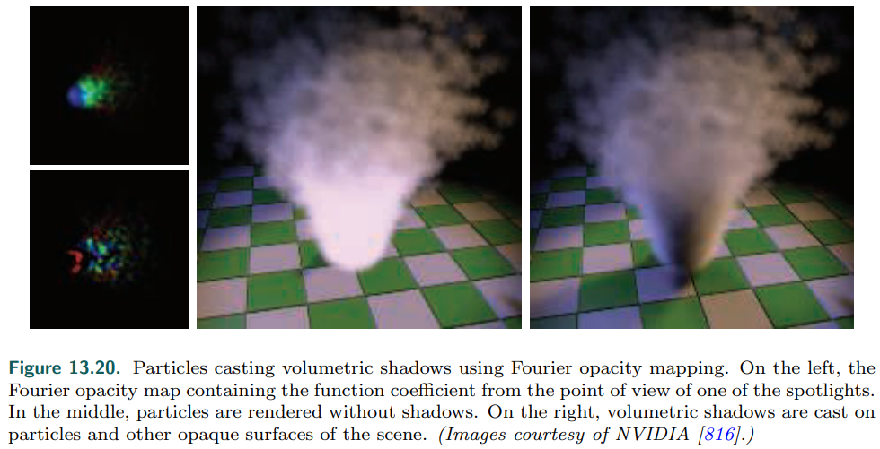

### 8.2 Particle Simulation

使用粒子对**物理过程**进行有效且令人信服的近似，是一个广泛的主题，超出了本书的意图，因此我们将为您提供一些参考资料。GPU可以为精灵生成*动画路径*，甚至可以执行*碰撞检测*。流输出*Stream output* 可以控制颗粒的出生和死亡  **[522, 700]**。==如果无序访问视图缓冲区是可用的，粒子系统可以完全基于gpu，由顶点着色器控制== **[146, 1503, 1911]**。

- 对基本模拟的快速介绍。**[211]  [986,987]**
- B神的书，讨论了模拟*水、烟、火*的基于物理的技术。**[197]**
- *《命运2》*中粒子系统的介绍，效果图如下。**[1897]**

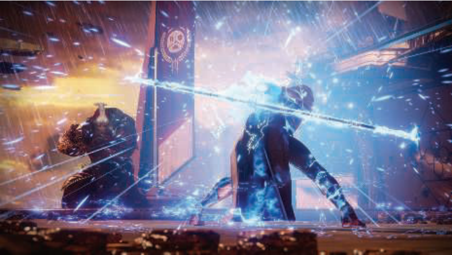

- *虚幻4*中，粒子系统的基本流程。**[1229]**
- 一种有效生成和渲染**雨水**的系统。**[1911]**
- 基于*计算着色器*的粒子系统。**[1767]**
- etc.

### 8.3 Point Rendering

在1985年，L和W神首次提出了使用**点**作为**原语**，来渲染所有东西  **[1033]**。其基本思想如下：

- 用大规模的点集来渲染表面。
- 然后使用高斯模糊，来消除点之间的*Gap*。高斯核的半径取决于点的密度（表面，以及投影到屏幕上的）。

直到18年前，这个技术才开始有点起色，一个是因为==计算力足够支持实时交互==，一个是可以获得==具有足够细节的模型==（目前有很多方法获取真实物体的**点云**）。

这些点云怎么使用呢？B神进行过滤，然后转化为网格 [**137**]；K神则是进行体素化，然后渲染体素[**930**]。我们这里主要讨论*直接渲染点云*的方法。

QSplat：是2000年的一个基于点的渲染器。它使用*球的分层树*来表示模型，树中的节点被**压缩**，以支持由数亿个点组成的渲染场景。一个点被渲染成一个具有半径的形状，称为*splat*，包括：正方形、不透明球、模糊球。==树的遍历可以在任何级别停止==，所以当时间耗尽时，可以通过停止遍历，来获得*交互式帧速率*。当用户停止移动时，渲染的质量可以被反复改进，直到到达层次结构的叶子。[**1519**]

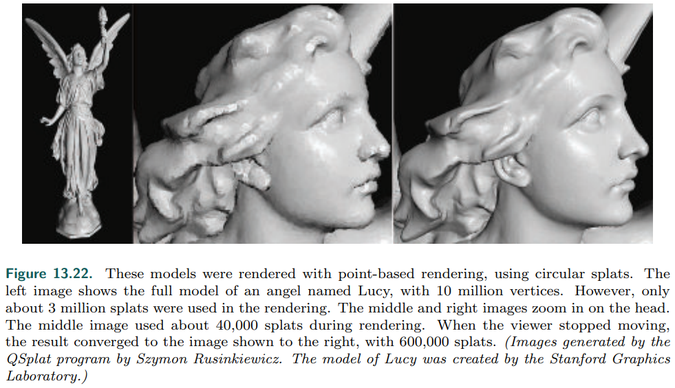

P神提出了*surfel* [**1409**]，一个类似的系统。这两篇论文确定并解决了**点云系统的一些关键问题**：管理数据集大小；从给定的点集，绘制令人信服的表面。

layered point clouds。通过从整个集合中取**n个点**来形成根节点，作为模型的*粗略表示*。（选择一个*点之间距离大致相同*的集合比*随机选择的结果*要好）。其余的点在空间上被划分为两个子节点，在每个节点上重复此过程，选择n个代表性点，并将其余的点划分为两个子集。过程如下图:arrow_down:。由于不为父节点引入新点，内存使用与*存储的点数量*成比例。。[**546**]

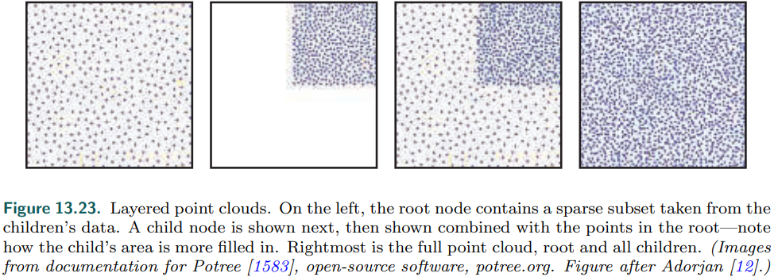

而对于现在的**点云系统**，数据集的规模之大，以至于内存根本放不下，所以**分层结构**基本是必然的。对于*点云数据结构*的*高效创建和遍历*已经进行了大量的研究，如 [**1553**]。

理论上，==Splats==可以提供*法线和半径*来定义曲面。实际上，这样的数据占用了太多的内存，只有经过大量的*预处理*才能使用。因此，通常使用固定半径的*广告牌技术*，且考虑半透明的排序和混合开销，一般使用**不透明广告板**。如下图:arrow_down:。​

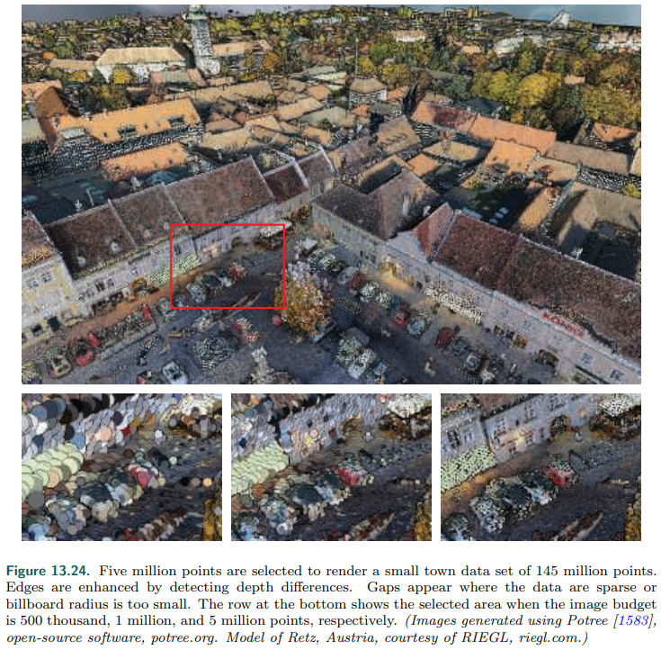

如果存储的点不包含法线，则可以使用各种渲染技术来弥补。例如，使用**SSAO**；**Eye-dome lighting**（EDL，**1583**）可进一步突显表面细节，**基本思路**：寻找当前像素的邻居像素，检测其深度，寻找其中最接近观察者的像素，对于这些像素，求它们的深度和此像素深度的插值，然后*求和平均*，*取倒数*，最后乘上一个**强度因子**，传入*EXP函数*。:arrow_down:

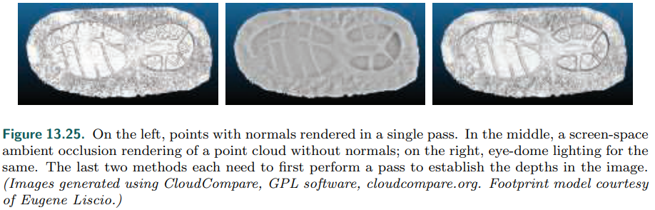

Schuetz [**1583**]==讨论了各种渲染技术，并提供了实现细节，以及一个高质量的开源系统==。

在游戏《*Dreams*》中进行实验的**点渲染系统**。每个模型都由一个*包围体层次结构* （BVH）的簇来表示，其中每个簇为**256**个点。这些点是由*有符号距离函数* **SDF**生成的（想起了IQ）。此系统的渲染基于**计算着色器** *compute shader* ，它实现了一些技术，如随机透明度，景深，环境遮挡，和不完美的阴影贴图。[**446**]

点云表示空间中的任意位置，因此很难进行渲染，因为点之间的间隙通常是未知的或不容易获得的

> 下一节的**体素**就是固定间隔的。

## 10. Voxels

每个**体素**代表一个**空间体积**，在一个三维网格中，通常是一个**立方体**。从之前的多次提及就可知，体素的应用很广泛，从粒子到3D打印的模型，都可以使用。==每个体素存储了一位==，代表这个体素的中心在不在物体中，还可以存储*颜色、普通值、带符号距离*或其他值。但**不需要存储位置**，因为它的索引就决定其位置。

### 10.1 Applications

**规则的数据网格**可以进行*与整个对象相关的*所有操作，而不仅仅是表面数据。

有限元分析 *Finite element analysis* 利用**体素**来确定物体的*抗拉强度*。

基于体素的系统有 **OpenVDB**  [**1249,1336**] 和 **NVIDIA GVDB Voxels** [**752,753**]。

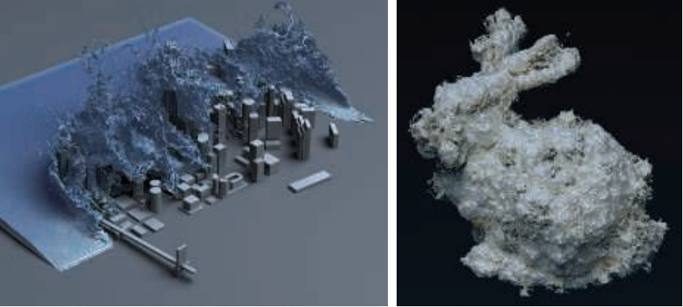

### 10.2 Voxel Storage

**体素的存储**要求足够的内存，==因为体素的分辨率是按照n^3^的速度增长的==。著名的体素游戏《*我的世界*》，每个体素存储一个标识符和*附加的方向或样式数据*。

==存储在体素网格中的数据通常具有一致性，因为相邻的位置很可能具有相似的值==。根据数据来源的不同，大多数网格可能是空的，这被称为**稀疏体积** *sparse volume*。*连贯性*和*稀疏性*都会导致紧凑的表现形式。

例如，**八叉树**(19.1.3节)可以应用于网格。在八叉树的最低层，每个*2×2×2体素样本组*可能都是相同的，这一点可以在**八叉树**和被丢弃的体素中体现出来。

==可以检测到树上的相似性，并丢弃相同的子八叉树节点==。只有在数据不同的地方，才需要存储数据。这种稀疏体素八叉树（**SVO**）表示导致了自然层次的细节表示:star:。**[87,304,308,706]**

Laine和Karras为*SVO数据结构*提供了丰富的**实现细节**和**各种扩展**。**[963]**

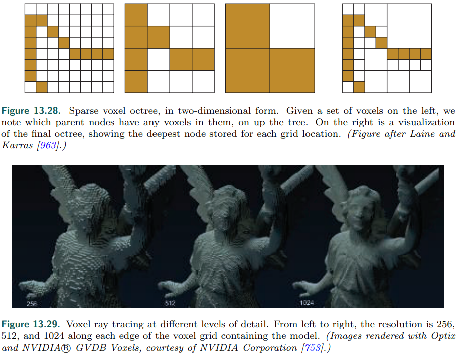

###  10.3 Generation of Voxels

体素模型的输入可以来自*各种来源*。例如，许多扫描设备在任意位置生成数据点。

==GPU可以加速点云的体素化过程==——将点云**[930]**、多边形网格或其他表示形式，转换成一组体素的过程。Loop等人使用一个更简单的系统，来创建现实世界中的*人的体素化*。**[1071]**

**Voxel网格**也可以从*图像集合*中创建，例如用**医学图像**设备生成切片，然后堆叠起来。按照同样的思路，**网状模型可以逐片渲染**，并适当记录*在模型内发现*的体素。调整近平面和远平面来绑定每个切片，检查其内容。Forest等人**[480]**给出了实现细节，指出在*现代GPU*上，==单次渲染可以渲染多达1024层==。注意，这个切片算法只识别模型的表面。==三种常见的体素化类型见图13.30==。Laine**[964]**提供了对术语、各种体素化类型，以及涉及问题的全面处理。

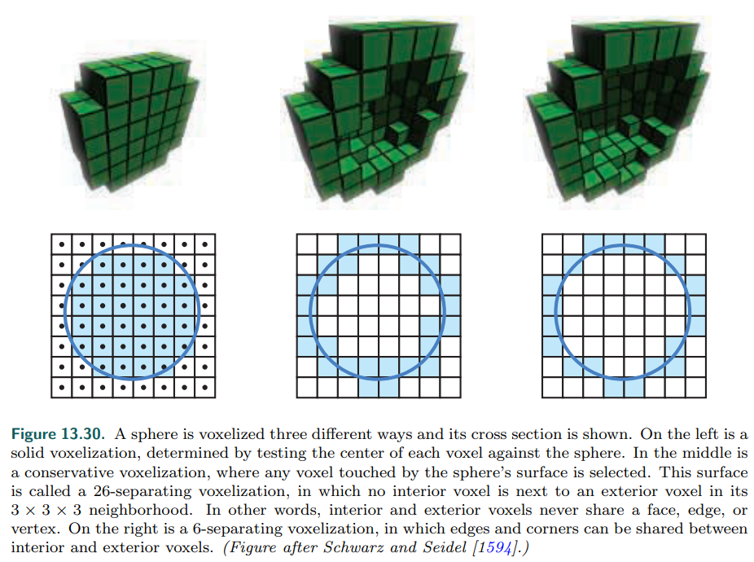

现代GPU使*更有效的体素化*成为可能：

- Schwarz **[1595]**给出了栅格化和计算**核体素化系统**的实现细节，解释了它们各自的特点。
- Rauwendaal和Bailey **[1466]** 提出了他们**混合系统的源代码**，它们提供了*并行体素化方案*的性能分析。
- Takeshige **[1737]**讨论了：如果少量的误差是可以接受的，**MSAA**如何成为保守栅格化的可行替代方案。
- Baert等人**[87]**提出了一种*创建SVO*的算法，该算法可以有效地运行在核心外，==即可以将场景进行高精度的voxelize，而不需要将整个模型驻留在内存中。==:star:

考虑到场景体素化需要大量的处理，动态对象对**基于体素的系统**来说是一个挑战：

- Gaitatzes和Papaioannou通过逐步更新*场景的体素表示*，来解决这个问题。他们使用来自**场景摄像机的渲染结果**，和阴影贴图来*清除和设置体素*。**[510]**
- ==体素根据深度缓冲进行测试==，那些*比记录的z深度更接近的*体素将被清除。然后将缓冲区中的深度位置视为一组点，并转换到世界空间。这些点*对应的体素*被确定和设置。
- 这种清除和设置的过程*依赖于视图*。
- 这种快速近似方法使*基于体素的全局光照效果*，在动态环境中以交互速率执行。

###  10.4 Rendering

==体素数据存储在一个三维数组中，存储为三维纹理==。这些数据可以以多种方式显示。这里，我们主要讨论如何渲染体素。

想象一下*最简单的体块表示*，其中每个体素包含一个标记：它是在对象内部，还是外部。有几种**常见的方式**来显示这些数据：**一种**是直接显示，来寻找最接近的体素块；**另一种技术**是将*体素立方体*转换为一组多边形。虽然使用*网格渲染*会很快，但在**体素化过程**中会产生额外的成本。如果每个体素的立方体显示为不透明，那么我们可以剔除两个立方体相邻的任何面，因为它们之间的共享正方形是不可见的。这个过程给我们留下了一个方形的壳，里面是中空的。

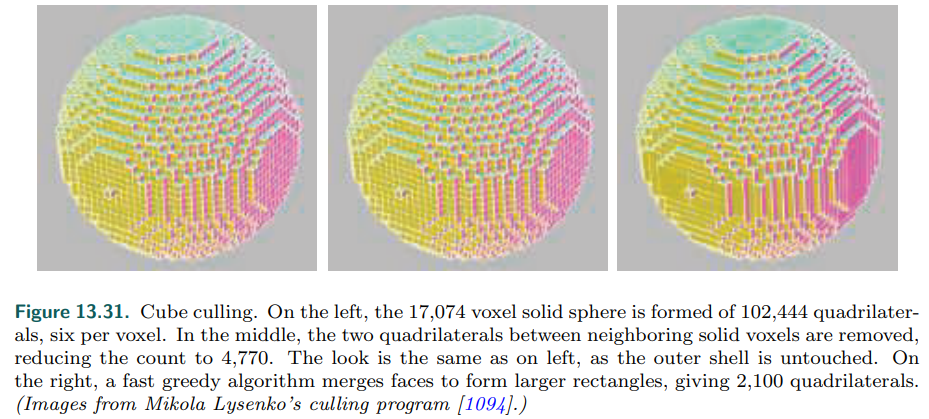

一个**更常见的方法**是：通过使用一个算法（比如： **marching cubes**）来创建一个更平滑的网格表面。这个过程称为**表面提取** *surface extraction*，或**多边形化** *polygonalization*。我们不把**体素**看作是一个**盒子**，而是把它看作是一个**采样点**。然后在2×2×2的模式下，可以用八个相邻的样本形成角*corners*。

==这八个角的状态可以定义一个通过立方体的表面==。例如，如果立方体的上四个角在外面，下四个角在里面，那么存在一个水平的正方形把立方体分成两半，就是对表面形状的很好的猜测:arrow_down:。

> 将一组立方体角，转化为对应的多边形网格是高效的。因为八个角位可以转换为0到255的索引，该索引用于访问一个表，该表指定了每个可能配置的三角形的数量和位置。

2008年，:star:Olick**[1323]**发表了一篇有影响力的演讲，讨论了如何通过**光线投射**直接渲染**SOV**，启发了进一步的工作。使用**正则化体素**测试射线非常适合GPU实现，并且可以在*交互式帧率*下完成。许多研究者已经探索了渲染的这个领域。

可以从Crassin的博士论文**[304]**和SIGGRAPH presentation**[308]**开始，讨论*基于体素的方法*。Crassin通过使用锥跟踪 cone tracing，利用了类似*mipmap*的数据特性。其想法是：

- 使用体素表示的**规则性**和定义良好的**局部性**，来定义*几何和阴影属性的*预过滤方案。
- 一条光线追踪整个场景，但它能够通过*从起点发射的圆锥体*获得*近似的能见度*。当射线在空间中移动时，其感兴趣的半径就会增大，这意味着*体素层次结构*会在链的上端采样，类似于mipmap在单个像素中*加入更多的texel时*的上端采样
- 这种类型的采样可以快速计算*软阴影和景深*，因为这些效果可以分解为**锥体跟踪问题**。区域取样对其他过程也很有价值，例如**抗锯齿**.

一些其它人的研究：

- Heitz和Neyret **[706]**描述了之前的工作，并提出了一种新的数据结构用于**锥体跟踪**，以提高*能见度计算结果*。
- Kasyan **[865]**使用**体素锥**跟踪**区域灯**，讨论了误差的来源。

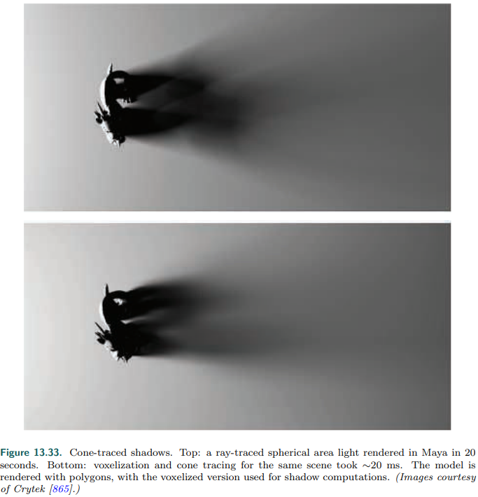

最近的趋势是在**GPU**上探索**八叉树**以外的结构。八叉树的一个*关键缺点*是：**光线追踪**等操作需要大量的**树遍历**
**跳**，因此需要==存储大量的中间节点==。

Hoetzlein **[752]**的研究表明，基于网格层次结构的**VDB树**，进行*GPU光线跟踪*可以获得显著的性能提升，并且更适合于**体数据的动态变化**。

Fogal等人 **[477]**证明，使用两遍方法，可以使用索引表，而不是八叉树，来实时呈现大量数据。

### 10.5 Other Topics

Eisemann和D’ecoret **[409]**展示了如何使用**体素表示**来执行**深度阴影映射 **(章节7.8)，用于在*半透明的重叠表面*投阴影。

可见**[850,1647]**，体素化场景的**另一个优势**是，相对于为每个光源生成阴影贴图，所有光源的阴影都可以用这个表示来测试。与直接可见的表面渲染相比，==眼睛对次要效果(如阴影和间接光照)的小错误更宽容==，而且这些任务所需的体素数据也少得多。

## Further Reading and Resources

*Image-based rendering, light fields, computational photography*, and many other topics are discussed in Szeliski’s Computer Vision: **Algorithms and Applications** **[1729]**. See our website *realtimerendering.com* for a link to the free electronic version of this worthwhile volume. 

A wide range of **acceleration techniques** taking advantage of limitations in our visual perceptual system is discussed by Weier et al. **[1864]** in their state-of-the-art report.

 Dietrich et al. **[352]** provide an overview of *image-based techniques* in the sidebars of their report on massive model rendering. We have touched upon only a few of the ways images, particles, and other nonpolygonal methods are used to simulate natural phenomena. 

 The survey of crowd rendering techniques by Beacco et al. **[122]** discusses *many variations on impostors*, level of detail methods, and much else. 

Gjøl and Svendsen’s presentation **[539]** gives *image-based sampling* and filtering techniques for a wide range of effects, including *bloom, len flares, water effects, reflections, fog, fire, and smoke*.

