# Chapter 14——Volumetric and Translucency Rendering

[toc]


<span style="color:yellow;font-size:1.3rem">Participating media</span>是光传输的参与者，它们通过*散射或吸收*来影响穿过它们的光。之前我们讨论的大多是密集介质，而*密度较低的介质*是水、雾、蒸汽，甚至是由稀疏分子组成的空气。

根据其组成的不同，介质与穿过它的光以及*与它的粒子反射*的光之间的相互作用会有所不同，这一事件通常被称为光散射**light scattering**。

如9.1节所示，**漫反射表面着色模型**是光在微观层面上散射的结果。

<span style="color:yellow;font-size:1.3rem">Everything is scattering!</span>


## 1. Light Scattering Theory

在本节中，我们将描述参与介质中*光的模拟和渲染*。辐射传输方程 *radiative transfer equation* 在**多重散射路径追踪**中，被许多作者描述**[479,743,818,1413]**。在这里，我们将专注于*单个散射*，下表:arrow_down:给出了散射方程中参与介质的属性。

> :star:值得注意的是，这里很多的属性都是**波长相关的**，这意味着它们都是RGB值。
>
> 所以，回顾之前的波长相关量，我们也会发现这个道理，确实也是。RGB颜色值本质上也是光的波长，而这些值又都是波长相关的，所以自然而然也是可以考虑成RGB量

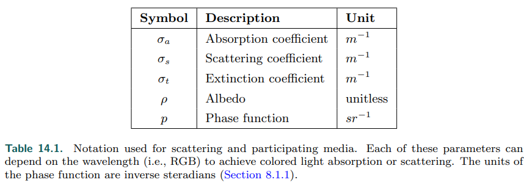


### 1.1 Participating Media Material

==有四种类型的事件，可以影响沿光线通过介质传播的辐射量==，可见上表:arrow_up:，也可见：

- **Absorption**（$\sigma_a$）：光子被介质吸收，然后转换为*热能*或其它形式的能量。
- **Out-scattering**（$\sigma_s$）：光子在介质中碰撞粒子而*散射*。这将根据描述*光反弹方向分布*（ **light bounce directions**）的相位函数p发生。（光子离开光路）
- **Emission**：当介质达到高温时，会发出光，例如火的黑体辐射。关于自发光的更多细节可见[**479**]
- **In-scattering**（$\sigma_s$）： 光子在与粒子碰撞后，可以**散射**到当前的光路径中，其值依赖于**相位函数**。（光子进入光路）

往一条光路中*添加光子*是**In-scattering**和自发光的函数。而从光路中*去除光子*，则是**消光函数** $\sigma_t=\sigma_a+\sigma_s$，表示吸收和**Out-scattering**。

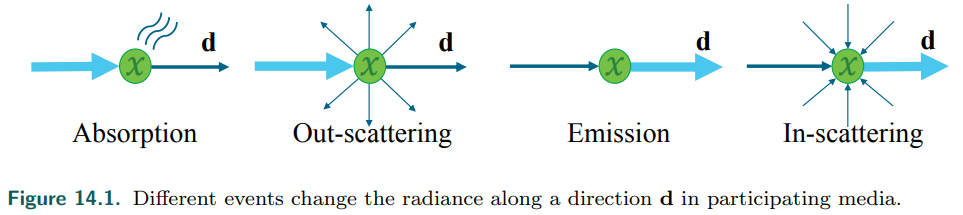

散射系数和吸收系数决定介质的**反照率** $\rho$，定义为
$$
\rho=\frac{\sigma_s}{\sigma_s+\sigma_a}
$$

> 牛奶：高散射；红酒：高吸收

这些属性都是**波长相关**的，这意味着不同频率的光，其吸收和散射系数也不同。这就需要在渲染中使用**光谱值**，但事实是，几乎所有情况下，我们都是使用**RGB值**。

之前我们没有考虑==参与介质==（也就是空气），这里进行考虑的话，散射路径的**渲染方程**如下：

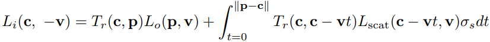

其中，$T_r(c,p)$是从给定点x到相机位置c的==透光率==`transmittance`，$L_{scat}(x,v)$是沿着视点的、给定点X的**散射光**。关于上诉方程的更多信息可见F神  [479]。

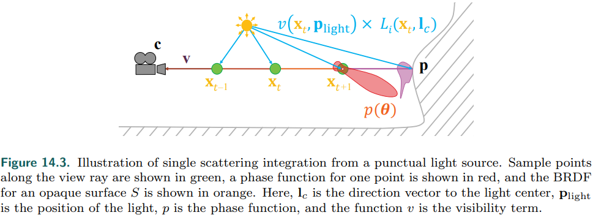


### 1.2 Transmittance

**透光率**$T_r$表示在一定距离内能通过介质的**光的比率**：

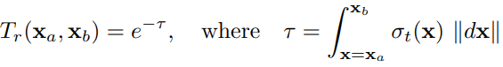

这个关系式也被称为<span style="color:yellow;font-size:1.3rem">Beer-Lambert Law</span>。==透光率需要应用在==：

- 来自不透明表面的辐射度$L_o(p,v)$。
- 在介质中（空气），由**In-scattering**产生的辐射度$L_{scat}(x,v)$。
- each path from a scattering event to the light source

而在视觉上，这些因素分别导致：

- 造成一些*类似雾*的表面遮挡。
- 会导致散射光的遮挡，这是另一种关于**介质厚度**的**视觉提示**。
- 导致参与媒体的**体积自影子**（`volumetric self-shadowing`）

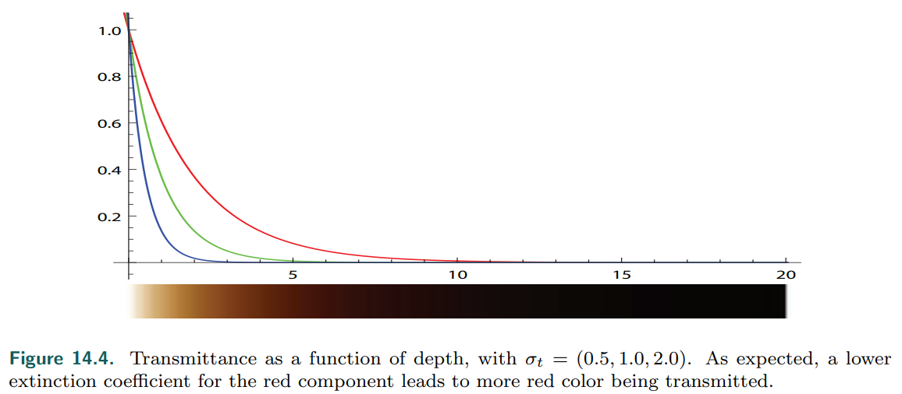


### 1.3 Scattering Events

对 ==in-scattering==进行积分：

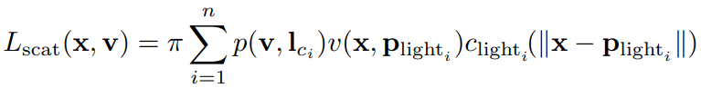

其中，$p()$是**相位函数**，$v()$是**可见性函数**，它表示光到达X的比例：

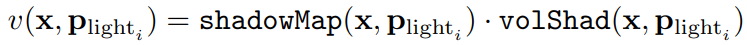

其中，$volShad=T_r$。

> 阴影由两种遮挡产生：不透明和体积遮挡
>
> 关于RayMarching，可见 **[479, 1450, 1908]**

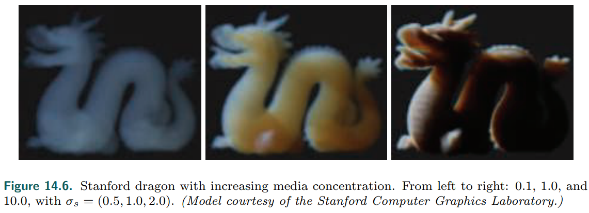

> 左边，介质比较薄，消光系数基本无，所以呈现蓝色（$\sigma_s$的B通道值更大）
>
> 右边，介质变浓变红，颜色不但变红，因为此时消光系数变大，而这个时候$\sigma_s$的B通道也会起大作用，消减的更快。

当太阳高度较高时（例如，穿过大气层的**短距离光路**，垂直于地面），==蓝光散射更多==，使天空呈现出自然的蓝色。但是，当太阳在地平线上时，由于有**很长的光路**穿过大气层，天空会显得更红，因为更多的**红光**被透射出去。这就产生了*美丽日出和日落*。


### 1.4 Phase Functions

参与介质是由*半径不同的粒子*组成的。这些粒子的**大小分布**将影响光在给定方向**散射的概率**。而在**宏观角度**描述这些的就是<span style="color:yellow;font-size:1.3rem">相位函数</span>（积分和为1）。

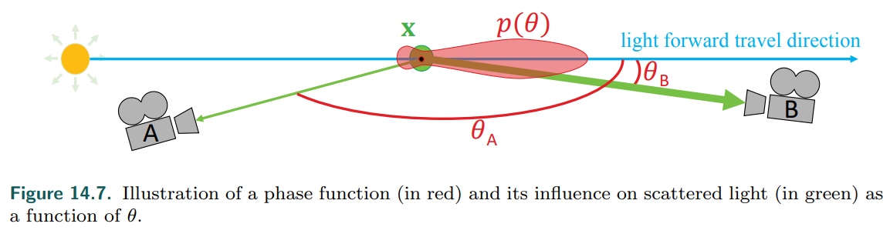

最简单的相位函数是**各项同性**的，如：

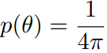

而==基于物理的相位函数==，依赖于粒子的相关大小$s_p$：
$$
s_p=\frac{2\pi r}{\lambda}
$$
其中，r是粒子半径，$\lambda$是**considered wavelength**：

- $s_p<<1$：<span style="color:red;font-size:1.2rem">Rayleigh scattering</span>（例如：空气）
- $s_p \approx 1$： <span style="color:red;font-size:1.2rem">Mie scattering</span>
- $s_p>>1$： <span style="color:red;font-size:1.2rem">geometric scattering</span>


#### Rayleigh Scattering

R神推导出光*在空气中*散射的项。这个相位函数有**两个波瓣**:arrow_down:，被称为`backward and forward scattering`。

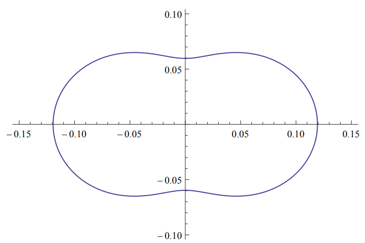

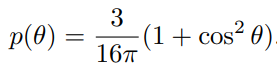

Rayleigh Scattering是**高度波长相关**的。当被视作波长$\lambda$的函数时，**Rayleigh Scattering**的散射系数$\sigma_s$和波长有如下相关关系：**{9}**


这种关系意味着：==短波长的蓝光或紫光，比长波长的红光散射得更多==。利用**光谱颜色匹配函数**，可以将上诉公式**{9}**的光谱分布转换为**RGB**：$\sigma_s=(0.490,1.017,2.339)$，


#### Mie Scattering

这种类型的散射**不是波长相关**的，通常有着大的、尖锐的方向波瓣。计算这种散射是昂贵但必要的。

介质通常具有颗粒大小的连续分布。对不同粒子的**Mie相位函数**进行平均，求得整个介质的平均相位函数。

> **MiePlot**软件可以用来模拟这种现象   **[996]**

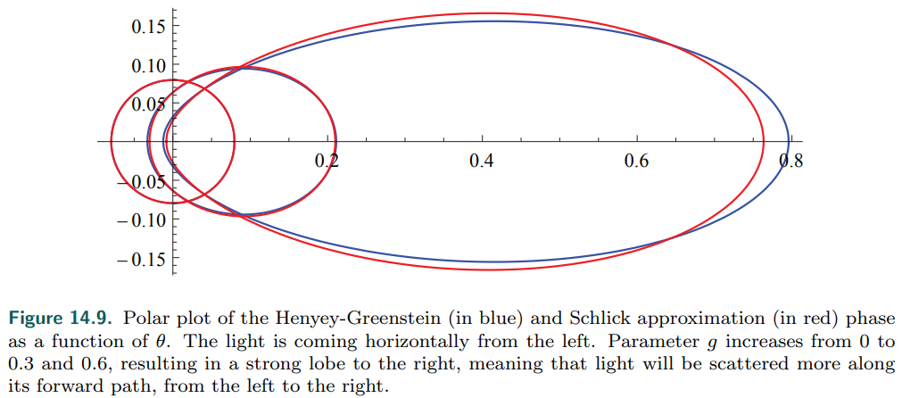

其中一个常用的相函数是<span style="color:yellow;font-size:1.3rem">Henyey-Greenstein</span>相函数，这个函数不能捕获真实世界散射行为的**复杂性**，但它可以很好地**匹配**朝主方向散射的波瓣。它可以用来表示*烟、雾*等参与介质。计算公式如下：

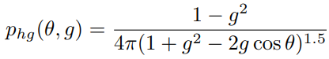

**g参数**可以用来表示**向后散射**(g < 0)，**各向同性散射**(g = 0)，或**向前散射**(g > 0)。:arrow_down:

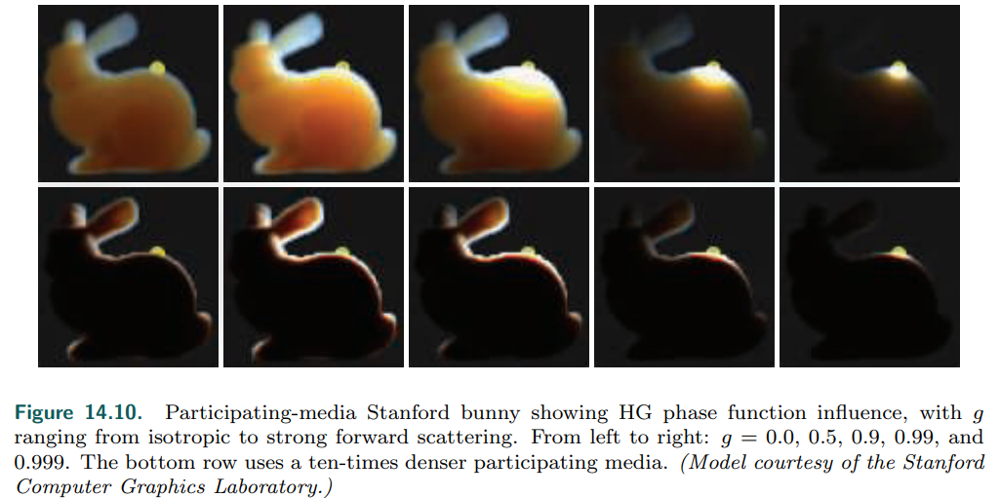


对HG进行近似的一个算法是<span style="color:yellow;font-size:1.3rem">Schlick phase function</span>：:arrow_down:  **[157]**

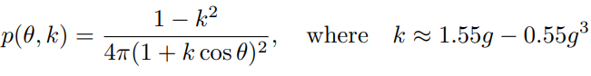

它不包括任何**复杂的幂函数**，只包括一个平方，这样计算起来要快得多。为了将这个函数映射到原来的**HG相位函数**上，==k参数需要从g计算==。

也可以混合多个**HG**或**Schlick相函数 ** **[743]**.，来表示更复杂的**一般相函数**。这使我们能够同时表示正向和反向相位函数。


#### Geometric Scattering

在这种情况下，光在每个粒子中*折射和反射*。这需要一个复杂的散射相位函数，来在**宏观水平**上模拟它。光的偏振也会影响这种类型的散射。


## 2. Specialized Volumetric Rendering

### 2.1 Large-Scale Fog

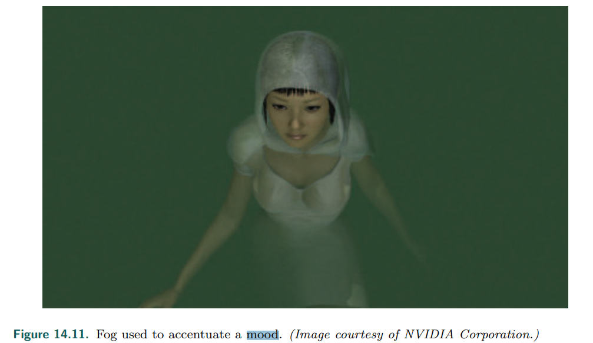

雾可以拟合成基于深度的效果，**最基本的形式**是根据离镜头的距离，在场景顶部进行雾色的**alpha混合**，通常称为==深度雾==

> 雾的作用：视觉提示；深度提示；剔除的一种形式

一个简单的使用方式，是作为透光率：:arrow_down:


f的计算方式有很多，可以使用如下**线性方式**：:arrow_down:


而更加物理的方式是指数增长， 遵循透过率的**Beer-Lambert Law** ：:arrow_down:

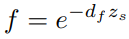

其中，标量$d_f$是用户参数，用来控制**雾的浓度**。透视视角中，雾的一个问题是==深度缓冲值是以非线性方式计算的==。

- **高度雾**代表的是：具有**参数化的高度和厚度**的单一参与介质板块。**[1871]**

- 深度雾和高度雾都是**大尺度雾效应**。我们可能想要渲染更多的==局部现象==，如分离的雾区。 **[1871]**   **[1308]**
- 关于介质是水，而不是空气的情况。**[261]  [1871]**


### 2.2 Simple Volumetric Lighting

介质中的光散射计算是复杂的，但很多情况下，可以使用有效的拟合技术。**获得体积效果**最简单的方法是：在`framebuffer`上渲染混合的透明网格，称之为<span style="color:yellow;font-size:1.3rem">splatting</span>：为了**渲染**穿过窗户、茂密的森林或聚光灯的**光柱**，一个**解决方案**是使用`camera-aligned`的粒子，每个粒子上都有纹理。每个**纹理四边形**在光轴的方向上拉伸，同时总是面对相机。**缺点是**：内存有要求。

为了解决这个问题，人们提出了使用**封闭解**，来处理光的单次散射的**后处理技术**。假设一个==球形均匀相位函数==，就有可能对散射光进行积分，使其具有正确的**透射率**:arrow_down:。

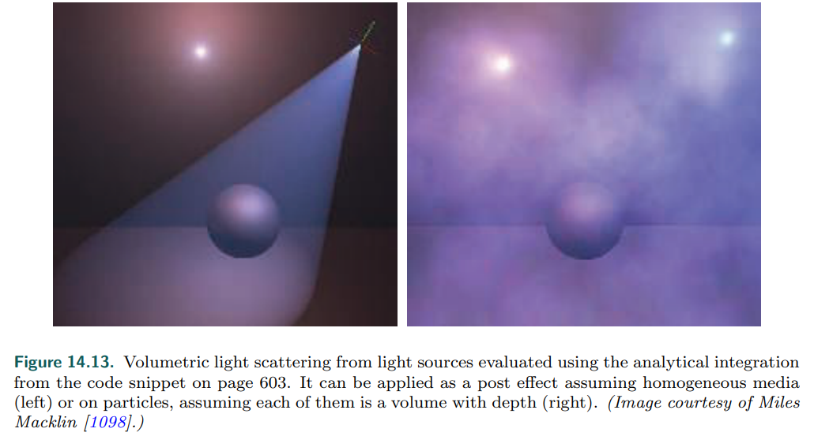


代码如下：（一些扩展，**[1722]，[1364]**， **[359]**，**[1219]**）

```c
float inScattering (vec3 rayStart , vec3 rayDir ,vec3 lightPos , float rayDistance )
{
    // Calculate coefficients .
    vec3 q = rayStart - lightPos ;
    float b = dot( rayDir , q) ;
    float c = dot(q, q) ;
    float s = 1.0f / sqrt (c - b*b) ;
    // Factorize some components .
    float x = s * rayDistance ;
    float y = s * b;
    return s * atan ( (x) / (1.0 + (x + y) * y) ) ;
}
```

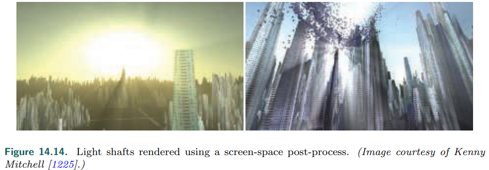


## 3. General Volumetric Rendering

在本节中，我们将介绍更多**基于物理的体积渲染技术**，试图表示**介质的材质**及其与光源的相互作用。

### 3.1 Volume Data Visualization

==Volume data visualization==是用于显示和分析体数据的工具。计算机断层扫描(**CT**)和磁共振图像(**MRI**)技术可用于创建**体内结构**的临床诊断图像。

除了*路径追踪和光子映射*，目前已经提出了几种较便宜的方法来实现**实时性能**。对于半透明现象，体积数据集可以由一组垂直于视图方向的**等距切片层**进行取样，来组成:arrow_down:。 **[797]**

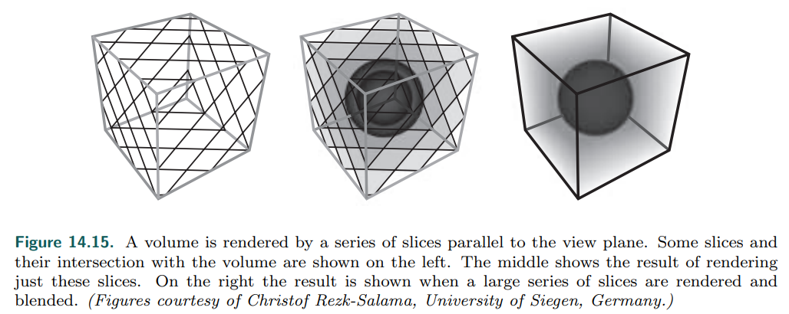

关于一维和二维transfer function，可见书 P 606。:arrow_down:

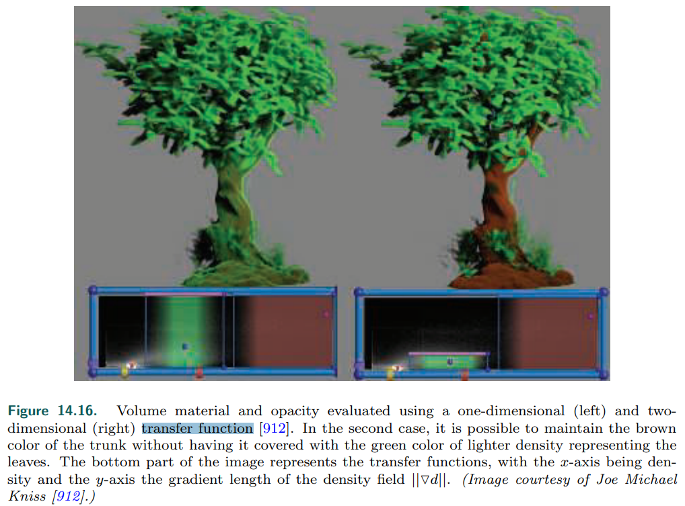


根据半角进行切边的扩展技术。**[797]** :arrow_down:

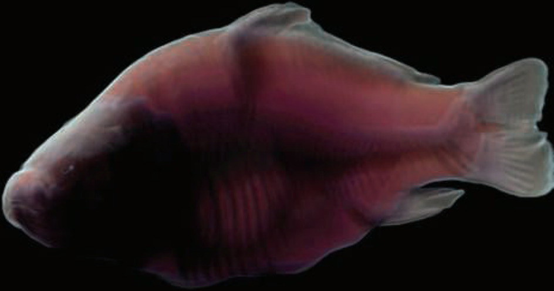


### 3.2 Participating Media Rendering

已经提出了**Splatting approaches**来处理更一般的**非均匀介质**，即沿着射线对**体积物质**进行取样。在不考虑任何输入照明的情况下，Crane等人**[303]**使用喷溅来渲染*烟、火和水*。在烟和火的情况下，每个像素上都会产生一条射线，==该射线在体积中进行射线搜索，收集颜色和遮挡==。在水的情况下，一旦射线的第一个命中点与水面相遇，**体积采样**就终止。表面法线是采样位置的**密度场梯度**。为了保证平滑的水面，使用**三次插值**来过滤密度值。

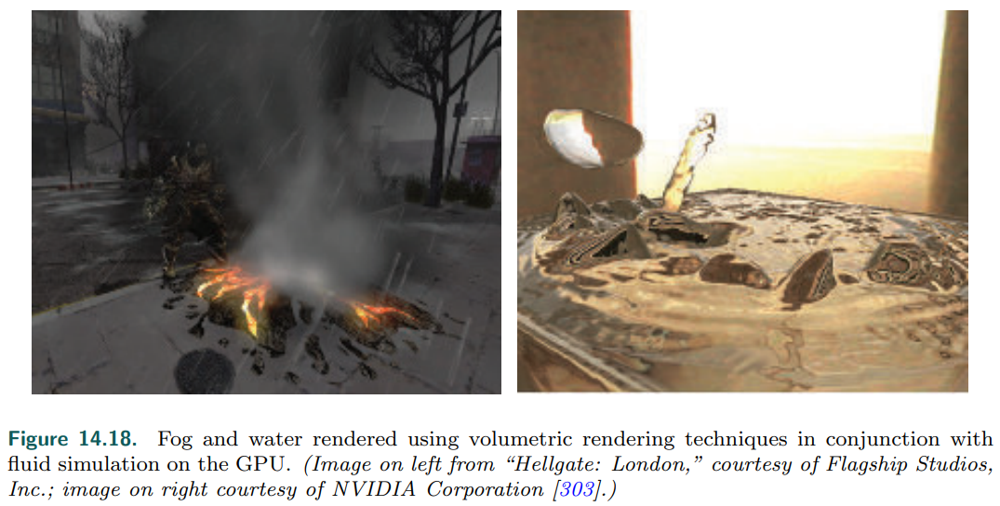

关于一些技术的讨论，见 书 P 608-609。**[765]  [1958]  [1812]  [816]**

以上方法的缺点在于，加入其它半透明表面会引发错误。所有这些算法==在透明表面上应用体光照==时都需要一些特殊处理，比如包含 **in-scattering**和透射率的体块`volume`。

以后再详细看。（Wronski[**1917**]提出了一种方法，将场景中来自太阳和光线的**散射辐射度**，像素化为**三维体纹理**V~0~（映射到视图剪辑空间））。

一种基于物理的方法，来定义参与介质的材料。[**742**] [**1802**]（*虚幻引擎*）

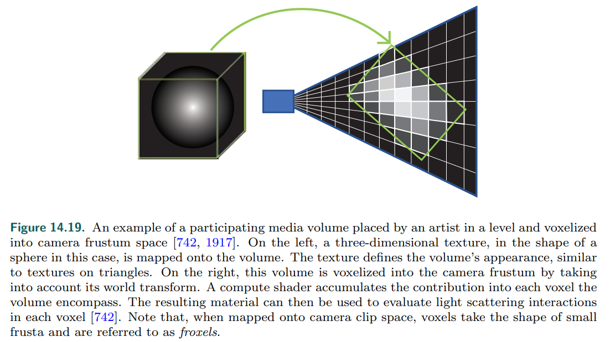

体积渲染的==动态GI光照==， **[1917]**，**[1802]** (*虚幻引擎*)

<span style="color:yellow;font-size:1.3rem">volumetric shadows</span>：H神提出了一个统一解决方法 **[742]**。根据 **clip map**分布，参与介质体积和颗粒被**体素化**成三个体积，围绕着相机层层叠叠，称为**extinction volumes**。**[1777]**。这样的解决方案使粒子和参与介质能够**自阴影**并相互投射阴影。

**体积阴影**可以使用*不透明阴影贴图*来表示。然而，如果捕捉的细节需要**高分辨率**，使用体积纹理可能很快成为限制。因此，已经提出了**替代**来更有效地表示T~r~，例如使用**正交基函数**，如傅里叶**[816]**或离散余弦变换。

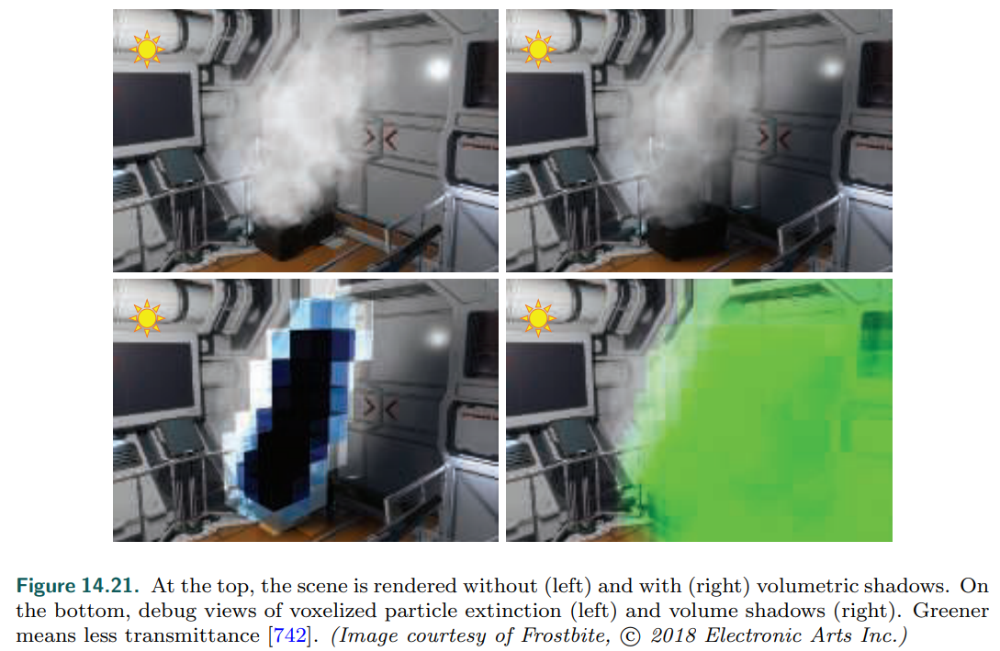


## 4. Sky Rendering

渲染世界本身需要*行星天空、大气效果和云层*。蓝天是阳光在大气（参与介质）中散射的结果。关于动态天空的渲染，已经成为*3A游戏*的标配。

### 4.1 Sky and Aerial Perspective

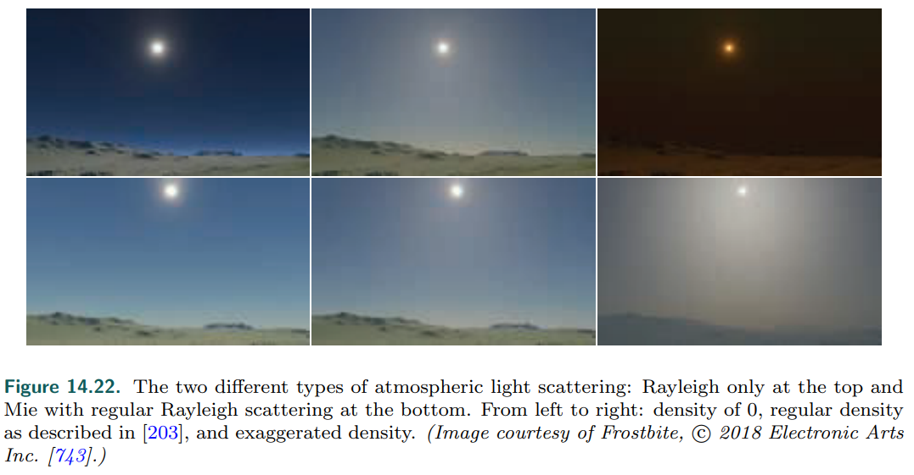

为了渲染大气效果，我们需要考虑两个方面，如上图:arrow_up:：

- 首先，拟合*阳光和大气粒子*的交互，导致波长相关的**Rayleigh scattering**。这导致了天空的颜色和一层**薄雾**，也被称为**空中透视**`aerial perspective`。
- 第二，需要地面附近**集中的大颗粒**对阳光的影响。颗粒的浓度取决于**天气情况**和**污染**，导致了波长无关的**Mie scattering**。这种现象会导致太阳周围出现明亮的光晕，特别是当粒子浓度很高时。

几个简单基于物理的实现：[**1285**]（单次散射），[**1333**]（Ray Marching），[**1871**]

<span style="color:yellow;font-size:1.3rem">Analytical techniques</span>可以使用**数学模型**  [**1443**] 计算天空亮度，或者使用*路径追踪*生成的真值图像。这里的**输入参数**，相比上一节的*参与介质*的输入参数，是受限的，例如：<span style="color:red;font-size:1.1rem">turbidity</span>表示颗粒对米氏散射的贡献，而不是$\sigma_s,\sigma_t$。

- P神 [**1443**] 提出的模型，使用`turbidity`和太阳高度来计算**天空辐射率**`radiance`。
- 通过添加额外参数，此技术的一些扩展。[**778**]

分析技术的速度是足够的，但其仅限于**地面视图**`ground views`，并且大气参数不能被改变=，来模拟*外星行星*或实现特定视觉效果。

<span style="color:yellow;font-size:1.3rem">Another techniques</span>：渲染天空的==另一种方法==是假设地球是**完美球形**，在它周围有一层由**不同的参与介质**组成的大气层。基于对大气的扩展描述，<span style="color:red;font-size:1.1rem">预计算表</span>可以被用来存储`transmittance`和散射，根据当前视图高度 **r**、视线向量相对于**穹顶**`zenith`的余弦值 $\mu_v$、太阳向量相对于穹顶的余弦值 $\mu_s$、方位角平面上视线向量和太阳向量的余弦 $\nu$。例如：从视点到大气边界的**透光率**可以**参数化为**：$r,\mu_v$。通过预处理，大气中的透过率进行积分，然后存储在二维<span style="color:red;font-size:1.1rem">LUT</span>（$T_{lut}$）中，然后实时使用。

进一步考虑散射，B神提出了使用一张<span style="color:red;font-size:1.1rem">四维 LUT</span> $S_{lut}$来存储，还提供了一种通过迭代n次来计算**n阶多次散射**的方法：1、计算单次散射表$S_{lut}$。2、通过$S_{lut}^{n-1}$计算$S_{lut}^{n}$。3、将结果添加到$S_{lut}$。重复[2]和[3] $n-1$次。结果如下图:arrow_down:。[**203**]  [**1957**]（B神方法的改进，三维LUT）

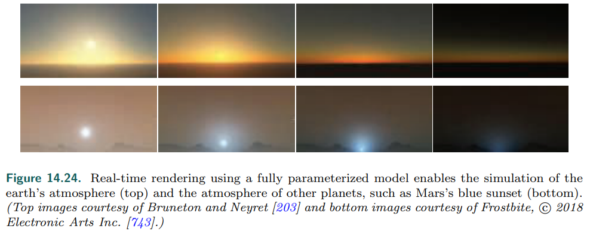

[**743**] 另外一种*实时游戏*经常使用的**三维LUT方法**：艺术家可以驱动基于物理的大气参数，以达到目标天空的视觉效果，甚至模拟外太空的大气:arrow_up:。由于参数改变，LUT也要重新计算，所以可以通过使用函数来近似积分（代替Ray March） [**1587**]。也可以使用**局部更新**的思路进行性能优化。**作为另一个优化**，为了避免对每个像素的不同**LUTs**进行多次采样，Mie和Rayleigh散射被烘焙在`camera-frustum-mapped`的**低分辨率体积纹理**的`voxels`中。使用这种类型的**体积纹理**还允许在场景中的任何透明物体上，应用**逐顶点的空中透视**。


###  4.2 Clouds

随着时间的推移，云的大尺度形状和小尺度细节都会发生变化。云是由**水滴**组成的，具有**高散射系数**和复杂的相位函数，从而产生特定的外观。我们可以使用14.1的**参与介质法**，经过测量，云具有一个$\rho=1$的**高单次散射**，范围为$[0.04,0.06]$的**消光系数**$\sigma_t$（对于`stratus`，低层次云），范围为$[0.05,0.12]$（`cumulus`，孤立的*低空棉絮状***蓬松云**）。由于$\rho \approx1$，可以假设$\sigma_s=\sigma_t$。

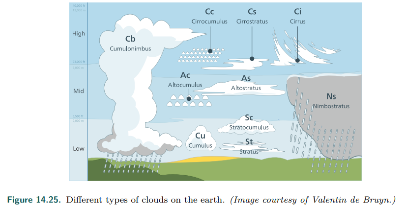

#### Clouds as Particles

H神用粒子或`Impostors`渲染云 [**670**]。另一个**基于粒子**的渲染技术由*Y神*提出，他使用被称为`volume particles`的渲染原语:arrow_down:，被存储在一个**四维LUT**中，可以检索面向视图的**方形粒子**的**散射光**和**透射率**，这种方法非常适合绘制<span style="color:red;font-size:1.2rem"> stratocumulus clouds</span>。[**1959**]

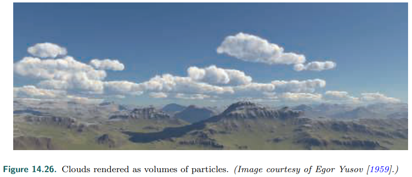

使用粒子渲染云，会出现**discretization and popping artifacts**（特别是绕云旋转时）。可以使用`volume-aware `混合来解决，这个功能是通过使用GPU的一种称为==光栅化顺序视图==的特性来实现的（3.8），**Volume-aware blending**允许在每个原语上同步*片元着色器操作*，允许确定性的自定义混合操作:arrow_down:：

- 最近的n个粒子的**深度层**被保存在一个缓冲区中，其分辨率与我们的渲染目标相同；
- 通过考虑**交叉深度**，缓冲区被读取，并用于**混合**当前渲染的粒子
- 最后再次写入下一个要渲染的粒子

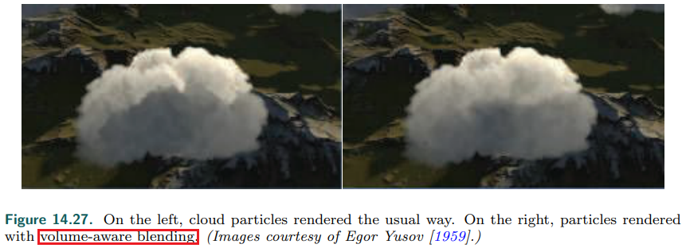


#### Clouds as Participating Media

将云视为**孤立的元素**，Bouthors等人[**184**]用两个组成部分来表示云：==一个网格（显示其整体形状）和一个超纹理==（hyperTexture[**1371**]），在网格表面下添加**高频细节**，直到（云内部的）一定深度。

这个方法可以使用`RayMarching`很好地渲染**云的边界**；而在云层内进行`RayMarching`，然后对辐射度进行积分时，可以根据**散射顺序**，采用不同的算法对散射度进行*采集*`gather`。**单次散射**可以使用14.1的**解析方法**进行积分。利用定位在**云表面**的**盘形集光器**的离线**预计算转移表**，加速**多重散射**评估。效果如下图:arrow_down:。​

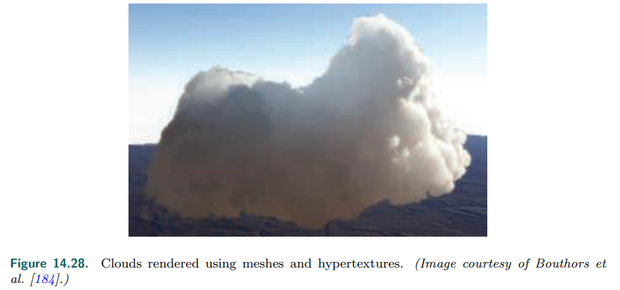

除了将云视为**孤立元素**，也可以将*云*建模成大气中的**参与介质层**。基于`ray marching`，S神使用这个方法来渲染云 [**1572**]。只需要几个参数，就可以在*动态光照条件*下，渲染复杂的、动态的、详细的云层:arrow_down:。

`layer`通过两层**程序噪声**进行构建，第一层赋予基本形状，第二层添加细节。在这个条件下，Perlin[**1373**]和Worley[**1907**]噪声混合可以很好表示*菜花状的*`cumulus`。生成这种纹理的*源代码和工具*已经被公开分享:star: [**743,1572**]。

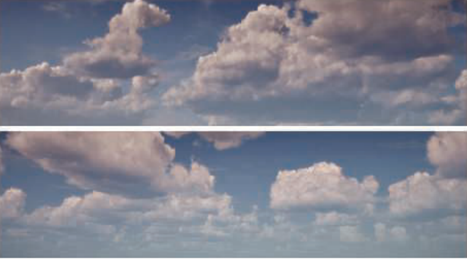

**体积阴影**可以通过往太阳进行第二次`Marching`，然后采样测试透光率，来进行计算。一些优化思路：避免第二次`Marching`[**341**]，**==局部更新==**（$4\times 4$ block）[**1572**]，时域平均 [**743**]。

云的**相位函数**是复杂的，这里我们给出两个实时方法。我们可以将公式编码为一张纹理，然后基于$\theta$进行采样。如果这样做需要太多的**内存带宽**，可以通过结合两个**Henyey-Greenstein相函数**来近似函数：[**743**]

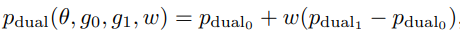

其中，两个主要的**散射离心率**`eccentricities`，$g_o~g_1$，以及混合参数$w$，是用户可控的。:arrow_down:

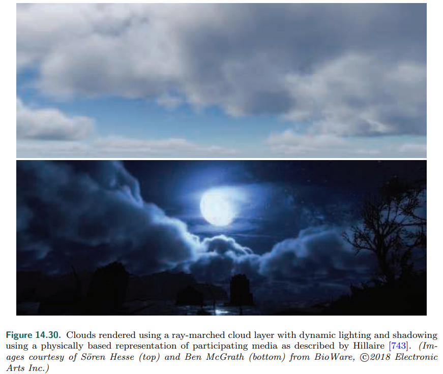

有不同的方法来近似云中**环境照明**的散射光。一个直接的方法是使用**环境贴图**的积分，


#### Multiple Scattering Approximation

云的**亮白外观**是光多次散射的结果，如果没有**多次散射**，则云层只有边界是亮的，而内部是暗的。使用*路径跟踪*来计算多次散射是非常昂贵的，W神提出了一种基于Ray March的拟合方法 [**1909**]，它对$o$个八度`octaves`的散射进行积分，并求和：**{18}**

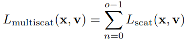

在计算$L_{scat}$时要做以下替换：
$$
\sigma^/_s=\sigma_sa^n,\sigma_e^/=\sigma_eb^n,p^/(\theta)=p(\theta c^n)
$$
其中，$a,b,c$是用户控制的参数[0,1]，为了节省资源，我们必须约束$a\leq b$，这种方案的**优点**是，它可以在**射线步进**的同时，迅速对**不同八度的散射光**进行积分。视觉提升可见:arrow_down:。​

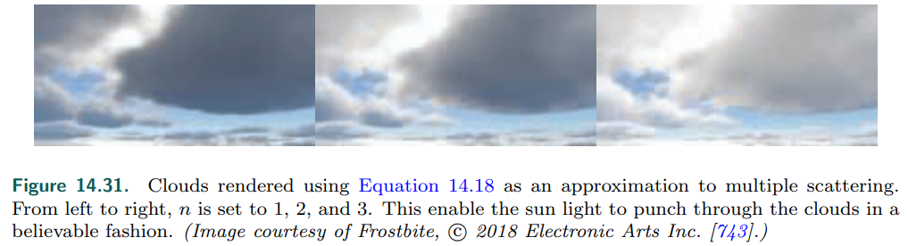


#### Clouds and Atmosphere Interactions

渲染一个有云的场景时，为了*视觉一致性*，考虑到云与大气散射的**相互作用**是很重要的，如下图:arrow_down:。​

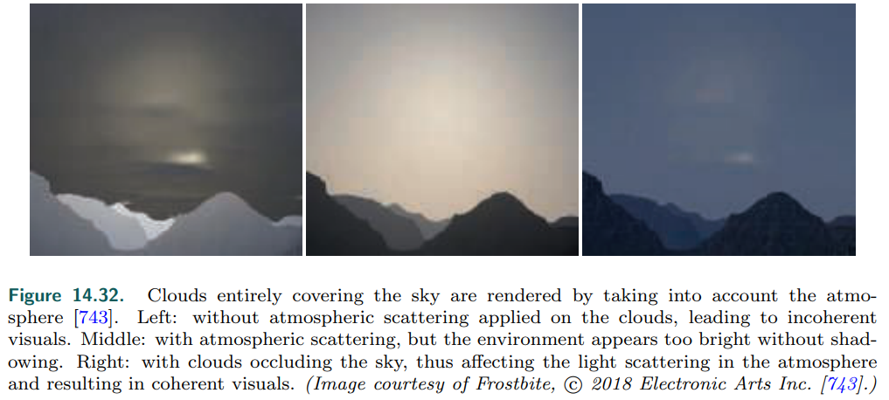

==由于云是大尺度要素，因此对云采用大气散射==。可以根据代表**平均云层深度**和**透射率**的单一深度，来应用**云层的大气散射** [**743**]。如果增加**云层覆盖**以模拟雨天:arrow_up:，云层下的阳光在**大气中的散射**应减少。只有穿过云层的光线才会散射到云层下面的大气中。照明可以通过减少**天空照明**对**空中透视**的贡献，并将散射光添加回大气，来进行调整。[**743**]

总而言之，通过先进的**基于物理的材料表示**和**照明**，可以实现云的渲染。通过使用**程序噪声**可以实现真实的云的*形状和细节*。最后，正如本节所介绍的那样，为了达到连贯的视觉效果，还必须牢记全局，如云与天空的相互作用。


## 5. Translucent Surfaces

半透明表面通常是指具有**高吸收**和**低散射系数**的材料。这些材料包括玻璃杯、水。一些扩展材料 **[1182, 1185, 1413].**


###  5.1 Coverage and Transmittance

输出颜色c~o~、表面亮度c~s~和背景颜色c~b~， **transparency-as-coverage**表面的混合操作为：

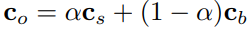

在半透明表面的情况下，混合操作将是：

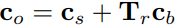

其中c~s~包含固体表面的**镜面反射**，$T_r$是一个三值透射率**颜色向量**。在一般情况下，可以使用一种通用的混合操作来同时指定**覆盖和半透明**，混合公式如下：[**1185**]	{**21**}

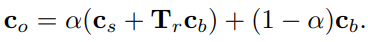

当厚度变化时，透射光可以通过计算式**14.3**计算，可化简为：

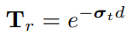

为了让艺术家进行直观的创作，Bavoil[**115**]将**目标颜色**t~c~设置为给定距离d处的**透光量**。消光系数$\sigma_t$可以计算：:arrow_down:

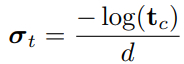

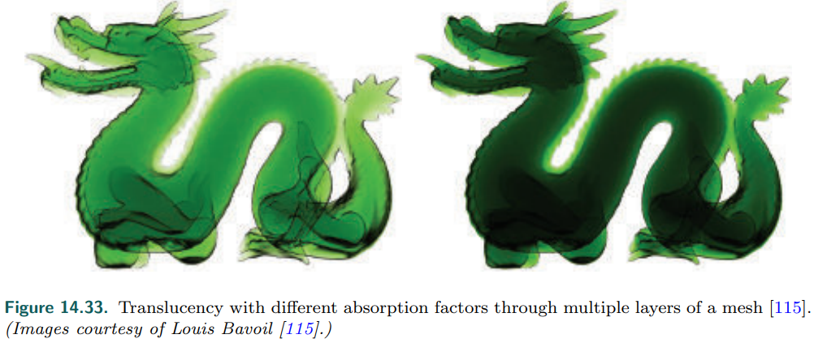

在**空壳网格**的情况下，其表面由一层薄薄的**半透明材料**组成，**背景色**应该被遮挡——作为光在介质中**传播的路径长度d**的函数。而这个路径长度会随着角度变化，D神提出了新的计算方法：[**386**]

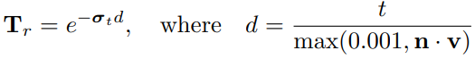

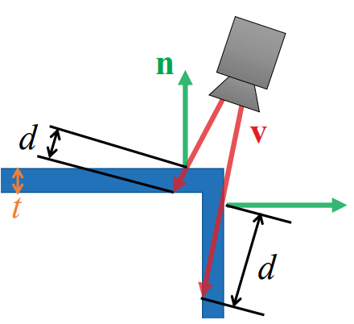

在*固体半透明网格*的情况下，计算光线通过**传输介质**的**实际距离**可以用多种方法来完成。==一个常见的方法==是首先渲染`view ray`离开体积的`surface`（**背面**），存储它的深度或位置；然后**正面**被渲染，在*着色器*中访问存储的出口深度，并且它和当前像素表面之间的**距离**被计算，然后用来计算应用于背景的**透光率**。

有几篇文章解释了处理大型水体的反射、吸收和折射。[**261,977**]

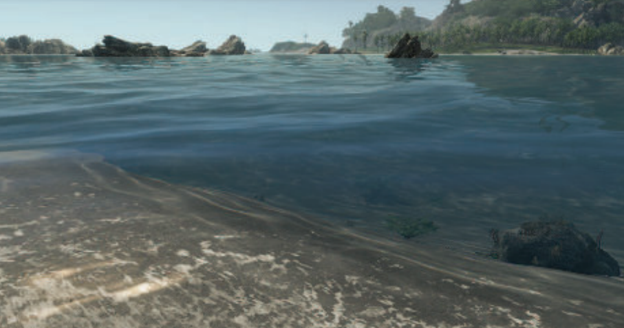


### 5.2 Refraction

对于薄的半透明物体，可以不用考虑折射；但本节则需要考虑**IOR**。

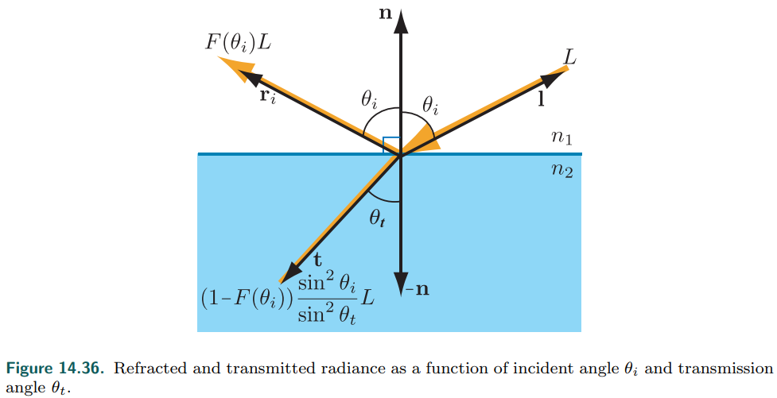

透射与入射**辐射度的比例**是不同的。由于入射光线和透射光线之间的*投影面积和实心角*不同，辐射度关系是：

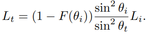

结合$Snell~law$，上诉公式可以转化为：

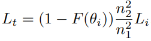

B神给出了<span style="color:red;font-size:1.2rem">计算折射向量</span>的有效方法：[**123**]
$$
t=(w-k)N-nl
$$
其中，$n=n_1/n_2$是相关折射率，且：
$$
w=n(l\cdot N)
$$

$$
k=\sqrt{1+(w-n)(w+n)}
$$

<span style="color:yellow;font-size:1.3rem">IOR随波长变化</span>，因为透明物质会根据**波长**改变光的**偏移角度**，这种现象被称为`dispersion`（**色散**）。色散会引发一种透镜问题，被称为`chromatic aberration`（**色差**），在摄影中，这种现象被称为**紫色边缘**`purple fringing`（日光下，高对比度边缘特别明显）。图形学中，一般会忽略这种现象，而为了**正确模拟**这种效果，还需要额外计算，因为进入透明表面的每一束光线都会产生一组光线，然后必须跟踪这些光线。

> 值得注意的是，一些虚拟现实渲染器应用了**逆色差变换**，以补偿头盔的镜头。[**1423,1823**]

一个常规的折射实现方法是`cubic environment map` (**EM**):arrow_down:。

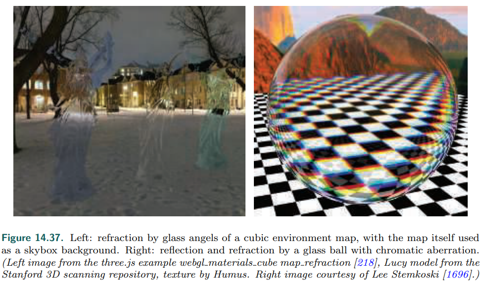

除了使用EM ，S神提出了一个**屏幕空间**的方法： [**1675**]

- 首先，正常渲染场景（不包含折射物体），存入一张纹理 $s$ 中。
- 第二，折射物体渲染进纹理 $s$ 的$alpha$通道中，初始值都为1，如果通过深度测试，则重写为0。
- 最后，折射物体完全渲染。在片元着色器中，对纹理 $s$ 进行采样，但要进行扰动，例如：缩放曲面法向切线$xy$分量（the scaled surface normal tangent xy-components），模拟折射。在这种情况下，只有$\alpha=0$的采样点的颜色才有效——这避免折射物体前方的对象。

以上技术都没有过多考虑**真实性**，毕竟没有考虑出口处的折射，但大多数情况下无所谓。许多游戏都是通过**单一图层**进行折射，而且要根据*粗糙度*对背景进行**模糊**，例如：在游戏《 *DOOM* 》中[**1682**]，在正常渲染场景后，对其进行**下采样**（分辨率减半）。

我们也可以通过使用**多层**，来处理更复杂的折射情况。每一层都可以使用*存储在纹理中*的深度和法线进行渲染，然后，可以用像**浮雕贴图**那样，追踪穿过各层的射线。储存的深度被看作是一个**高度场**，每条射线都要穿过这个高度场，直到找到一个交叉点。[**1326**]  [**1927**]

> 和其它屏幕空间方法一样，会丢失屏幕外的信息


### 5.3 Caustics and Shadows

计算半透明物体的**阴影**和**焦散**是复杂的。离线方法很多，实时也有很多对离线方法的近似。

<span style="color:yellow;font-size:1.3rem">Caustics</span>：光线从其**直线路径**上偏离，导致光线分配不均，进而产生*阴影和亮斑*。一个**反射焦散**经典例子是：咖啡杯的心形焦散:arrow_down:。​

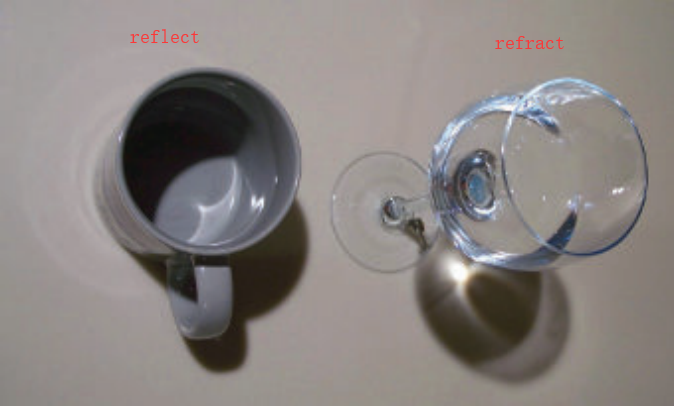

> 当会聚时，光线会集中在不透明的表面并产生**焦散**。

为了从**水面**生成焦散，可以将离线生成的、焦散的**动态纹理**作为一个`light map`应用在表面上——可能会添加到**常规光贴图**之上。许多游戏应用了这项技术，例如：《*孤岛危机3*》。层中的水域`water areas`通常使用`water volumes`进行表述。体积的顶部表面可以使用动态法线贴图来**模拟动画**（或直接物理模拟）。当**垂直投射**到水面上方和下方时，凹凸贴图产生的法线可用于 *从其方向映射到辐射贡献中* 产生**焦散**（generate caustics from their orientation mapped to a radiance contribution）。:arrow_down:

image-20201223170736330

在水下时，同样的动画水面也可以用于水中的**焦散**。Lanza[**977**]提出了一种两步生成`light shafts`的方法：

- 首先，从光源的角度，对光线的位置和折射方向进行渲染，并存到一张纹理中。**线条**可以从水面开始**栅格化**，并在视图的折射方向上延伸。
- 它们通过`additive blending`进行累积，最后使用**模糊后处理**来模糊结果。

W神提出了一个**图像空间方法**来渲染焦散。[**1928, 1929**]


## 6. Subsurface Scattering

在某些情况下，**散射的尺度**相对较小，例如对于具有*高光学深度*的介质，如人类皮肤。

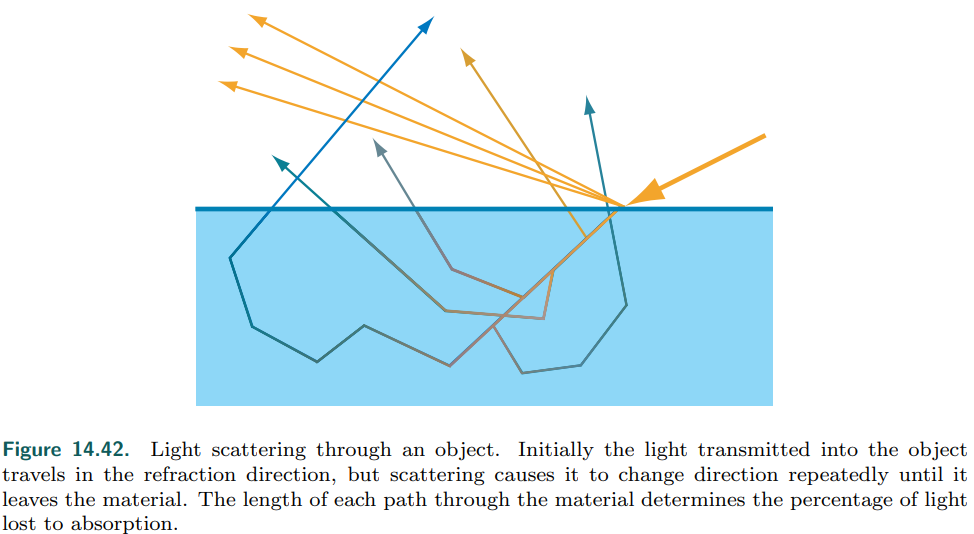

如上图所示:arrow_up:，区分*介质内光路*的重要因素是**散射次数**，可以划分为：`single scattering `和`multiple scattering`。==大多数技术都聚焦于模拟多次散射==。

> 对于皮肤而言，多次散射占主导地位

### 6.1 Wrap Lighting

**最简单的实现技术**可能是`wrap lighting`[**193**]。在已有的基础上，还需要添加一个`color shift`[**586**]，这是为了考虑光在材质中”**旅行**“时产生的**部分吸收**。例如：渲染皮肤时，需要应用一个红色的**色移**。

> 有点熟悉啊？在区域光那节也讲过。[**10.1**]

Kolchin[**922**]指出，这种效应取决于表面曲率，他推导了一个**基于物理的版本**。虽然派生表达式的计算代价有些昂贵，但其背后的思想是有用的。

### 6.2 Normal Blurring

Stam[**1686**]指出，多重散射可以模拟为**扩散过程**`diffusion`。Jensen等人[**823**]进一步发展，推导出**双向表面散射分布函数**（<span style="color:yellow;font-size:1.3rem">BSSRDF</span>）解析模型。BSSRDF是BRDF在全局次表层散射情况下的概括[**1277**]。扩散过程对**出射辐射度**有空间模糊效应。

一般来说，==模糊只应用在漫反射上==，而高光则不需要，此外法线贴图是对法线的小扰动。因此，一个==好的想法==:star:是：只对高光项应用法线贴图，而对漫反射应用原始法线。在使用其它技术时，也可以将这个想法加上去。

对许多材料来说，**多次散射**发生在*相对较小的距离内*。皮肤就是一个重要的例子，大多数散射发生在几毫米的距离内。对于这样的材料，上诉技术本身就足够了。Ma等人[**1095**]基于实测数据扩展了该方法，大佬发现：由于次表面散射，**漫反射表现**像是使用了*模糊后的法线*一样。

- 还提出了一个**实时渲染技术**，通过为高光，以及R，G，B的漫反射提供不同的法线贴图 [**245**]。
- 一般来说，漫反射各通道的法线贴图，基本都是高光法线贴图的模糊版本，因此可以只使用一个法线贴图， 不同通道选择不同的Mip，缺点是会丢失**色移**。（毕竟各通道使用的是同一张贴图）

###  6.3 Pre-Integrated Skin Shading

结合前两节的内容，P神提出了一种**预积分的皮肤渲染技术 **[**1369**]。对散射和透光率积分，并存储在一张**二维查找表**中，LUT的第一个**坐标轴**基于$n\cdot l$，第二个**轴**基于 $1/r=||\partial n/\partial p||$（表示*表面曲率*）——==曲率越高，对透射和散射颜色的影响越大==。因为每个三角形的曲率都是**恒定的**，所以这些值必须在离线情况下，进行烘焙和平滑。

为了处理**表面小细节**的次表面散射，P神对Ma的技术[**1095**]（上一节）进行调整：除了各通道使用不同的法线贴图，还根据材料的<span style="color:yellow;font-size:1.3rem">diffusion profile </span>对其进行**模糊**。

==这个技术会忽略光在阴影边界上的扩散==，因为默认情况下它只依赖于曲率。为了让散射曲线跨越**阴影边界**，半影轮廓可以用来**偏置**LUT坐标。因此，这种快速技术能够近似*下一节介绍的高质量方法*。

### 6.4 Texture-Space Diffusion

正如上一节所说，以上技术无法软化阴影边界。<span style="color:yellow;font-size:1.3rem">texture-space diffusion</span>可以解决这些问题，其中最具影响力的是L神的论文[**178,179**]。他们将多次散射的概念**形式化**为一个**模糊过程**： [**345, 586**]（*NVIDIA*）

- **表面辐照度**（漫反射光）被渲染进一张纹理中。这可以通过使用纹理坐标作为**光栅化坐标**来完成。 The real positions are interpolated separately for use in shading。
- 纹理被模糊，然后渲染时使用。滤波器的*形状和大小*取决于*材质和波长*。例如：对于皮肤，R通道的滤波器比其他两个通道更宽，导致阴影边缘（`shadow edges`）变红。
- 在大多数材料中，用于模拟**次表面散射**的正确**滤波器**，它的中心是一个*狭窄的尖峰*，底部是一个*宽而浅的基座*。

 d’ Eon大神 [**345**] 给出了这个技术最完整的实现，包括支持模拟**多层次表面结构**效果的复杂滤波器。D神[**369**]表明，这种结构产生<span style="color:orange;font-size:1.3rem">最逼真的皮肤渲染</span>:star:。虽然非常昂贵，需要大量的模糊处理。但是它很容易简化，来提高性能。

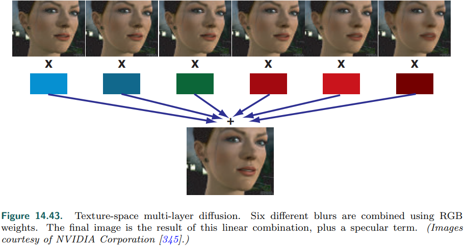

不是应用多个**高斯Pass**，H神[**631**]提出了单一的**12-sample内核**——既可以应用在纹理空间作为预处理，也可以应用在片元着色器中。

**缺点**：复杂场景的开销太大；需要两次渲染等

### 6.5 Screen-Space Diffusion

J神提出了<span style="color:orange;font-size:1.3rem">屏幕空间方法</span>[**831**]。

- 首先，场景正常渲染，而需要**次表面散射**的物体，则在`stencil buffer`中进行**标记**。
- 然后对**存储的辐射度**，进行两次屏幕空间`pass`，来模拟次表面散射——利用**模板测试**在需要的地方应用此算法。
- 额外的`pass`在水平和垂直方向上，应用两个**一维双边模糊内核**。*彩色模糊核*是可以分离的，但由于两个原因，它不能采取完全分离的方式：
    - ==线性视图深度==必须考虑：根据表面距离，将模糊拉伸到一个正确的宽度。
    - **双边过滤**避免了光线从不同深度的材料中**泄露**。
- 此外，为了滤波器不仅应用于**屏幕空间**，还应用在表面的切线上，所以必须考虑**法向方向**。

后来，提出了一个<span style="color:orange;font-size:1.3rem">可分离版本</span>[**833**]。

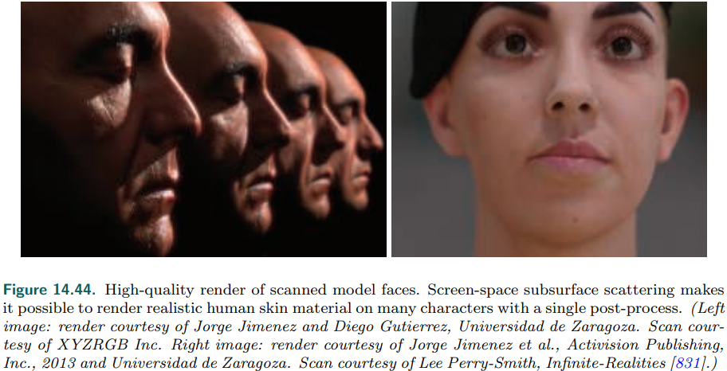

为了进一步优化过程，可以将**线性深度**存储在场景纹理的**alpha通道**中。一维模糊依赖于少量样本，因此在近距离观察人脸时，可以看到*欠采样*。为了避免这个问题，**模糊内核**可以按像素旋转 [**833**]。这种*噪声的可见性*可以通过使用*时间抗锯齿*显着降低。

使用此方法需要注意，我们只模糊**辐照度**，而不是`albedo`或高光。 [**512**]

> 一般计算：模糊后的辐照度$\times$albedo $+$ Specular lighting 

当渲染网格**漫反射照明**时，Jimenez等人提出的技术[**827**]还通过使用反表面法线**−n**，对从*对面入射的光*进行采样，增加了来自背面贡献的**次表面透射**。当然，需要对其进行微调，主要使用透光率，==而透光率则和物体内部的深度有关==——可以通过经典阴影贴图算法得到。

###  6.6 Depth-Map Techniques

以上讨论的技术考虑的都是*小散射距离*，这里我们将要考虑*更大的散射距离*，比如==光穿过手==。大多数技术关注于单次散射，而不是复杂的多次散射。

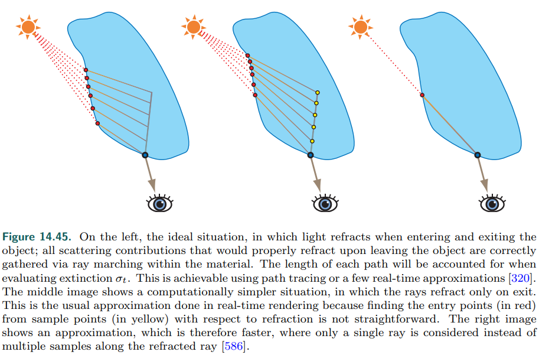

**大尺度单散射**的理想模拟*如上左图*:arrow_up:所示，所有路径效果需要累加到*单个表面点的渲染*上，吸收也需要考虑在内——路径中的吸收量取决于*路径在材料内部的长度*。计算单个渲染点的**所有折射光线**是昂贵的，甚至对**离线渲染器**来说也是如此，因此*进入材质时*的折射通常被忽略，而只考虑*离开材质时*方向的变化（如上图中:arrow_up:）[**823**]，对于按照**相位函数**散射光的介质，**散射角**也会影响散射光的量。

G神提出了更快的近似，只考虑一条光路[**586**]（如上图右:arrow_up:）。尽管这些技术没有基于物理，但效果确不错。**一个问题**是：==物体背面的细节会直接影响渲染的颜色==。《*料理鼠王*》中使用了这个技术[**609**]。皮克斯对以上技术的优化 [**1066**]。

在实时领域，对**大尺度多散射**进行模拟是困难的。D神提出了阴影贴图的扩展，称为<span style="color:orange;font-size:1.3rem">translucent shadow mapping</span> [**320**]，来构建多次散射。

- 额外的信息，如*辐照度和表面法线*，存储在` light-space`纹理。从这些纹理中取几个样本，包括**深度贴图**，然后结合形成*散射亮度的估计*。
- 这种方法的一个改进被应用于英伟达的**皮肤渲染系统**[**345**]:star:。
- M神提出了一个相似的方法，但是在屏幕空间中 [**1201**]。

树叶的次表面渲染，详细见书 P 639。

B神 [**105**] 提出了一种<span style="color:red;font-size:1.3rem">廉价的临时近似方法</span>，来模拟网格上长距离的**次表面散射**：:star:

- 首先，为每个网格生成一个存储*平均局部厚度*的**灰度纹理**，计算方式：1$-$从向内法线$-n$计算的**AO**。这个纹理称为$t_{ss}$，可以认为是*透射率的近似值*，可以应用于从表面的另一侧来的光。
- 次表面散射可以计算如下：

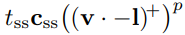

​			其中，p是**近似相函数**，$c_{ss}$是次表面反射率。

- 然后将该表达式与光的颜色、`intensit`和距离衰减相乘。
- 效果如下图:arrow_down:

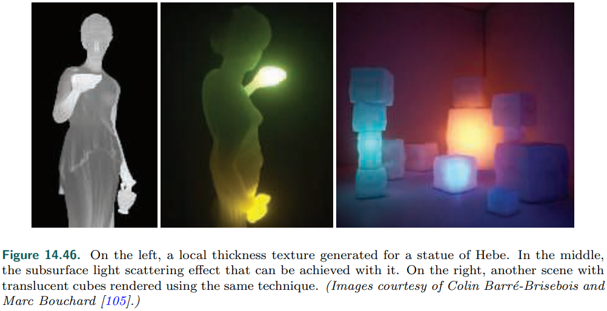


## 7. Hair and Fur

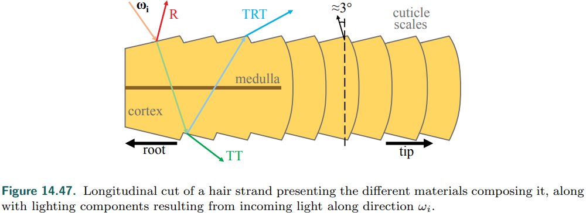

毛发和皮毛的结构在根本上是相同的。它由**三层**组成：

- 外面是==角质层==`cuticle`，它代表**纤维表面**。这个表面并不光滑，而是由*重叠的鳞片*组成，与头发的方向相比，倾斜了大约$\alpha=3^o$，使==法线向根部倾斜==。
- 中间是==皮质==` cortex`，含有赋予**纤维颜色**的黑色素。*真黑素*就是其中一种色素，它导致棕色 $\sigma_{a,e}=(0.419,0.697,1.37)$；另一种是`pheomelanin`，负责染红头发 $\sigma_{a,p}=(0.187,0.4,1.05)$
- 里面是==髓质==`medulla`。它很小，在建模人类头发时，常常被忽略[**1128**]。然而，它在**动物皮毛**中占毛量的很大一部分，在动物皮毛中具有更大的意义。

利用**双向散射分布函数**（*BSDF*）描述头发纤维的相互照明作用。

