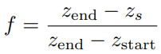

# Chapter 14——Volumetric and Translucency Rendering

[toc]


<span style="color:yellow;font-size:1.3rem">Participating media</span>是光传输的参与者，它们通过*散射或吸收*来影响穿过它们的光。之前我们讨论的大多是密集介质，而*密度较低的介质*是水、雾、蒸汽，甚至是由稀疏分子组成的空气。

根据其组成的不同，介质与穿过它的光以及*与它的粒子反射*的光之间的相互作用会有所不同，这一事件通常被称为光散射**light scattering**。

如9.1节所示，**漫反射表面着色模型**是光在微观层面上散射的结果。

<span style="color:yellow;font-size:1.3rem">Everything is scattering!</span>


## 1. Light Scattering Theory

在本节中，我们将描述参与介质中*光的模拟和渲染*。辐射传输方程 *radiative transfer equation* 在**多重散射路径追踪**中，被许多作者描述**[479,743,818,1413]**。在这里，我们将专注于*单个散射*，下表:arrow_down:给出了散射方程中参与介质的属性。

> :star:值得注意的是，这里很多的属性都是**波长相关的**，这意味着它们都是RGB值。
>
> 所以，回顾之前的波长相关量，我们也会发现这个道理，确实也是。RGB颜色值本质上也是光的波长，而这些值又都是波长相关的，所以自然而然也是可以考虑成RGB量


### 1.1 Participating Media Material

==有四种类型的事件，可以影响沿光线通过介质传播的辐射量==，可见上表:arrow_up:，也可见：

- **Absorption**（$\sigma_a$）：光子被介质吸收，然后转换为*热能*或其它形式的能量。
- **Out-scattering**（$\sigma_s$）：光子在介质中碰撞粒子而*散射*。这将根据描述*光反弹方向分布*（ **light bounce directions**）的相位函数p发生。（光子离开光路）
- **Emission**：当介质达到高温时，会发出光，例如火的黑体辐射。关于自发光的更多细节可见[**479**]
- **In-scattering**（$\sigma_s$）： 光子在与粒子碰撞后，可以**散射**到当前的光路径中，其值依赖于**相位函数**。（光子进入光路）

往一条光路中*添加光子*是**In-scattering**和自发光的函数。而从光路中*去除光子*，则是**消光函数** $\sigma_t=\sigma_a+\sigma_s$，表示吸收和**Out-scattering**。


散射系数和吸收系数决定介质的**反照率** $\rho$，定义为
$$
\rho=\frac{\sigma_s}{\sigma_s+\sigma_a}
$$

> 牛奶：高散射；红酒：高吸收

这些属性都是**波长相关**的，这意味着不同频率的光，其吸收和散射系数也不同。这就需要在渲染中使用**光谱值**，但事实是，几乎所有情况下，我们都是使用**RGB值**。

之前我们没有考虑==参与介质==（也就是空气），这里进行考虑的话，散射路径的**渲染方程**如下：


其中，$T_r(c,p)$是从给定点x到相机位置c的==透光率==`transmittance`，$L_{scat}(x,v)$是沿着视点的、给定点X的**散射光**。关于上诉方程的更多信息可见F神  [479]。


### 1.2 Transmittance

**透光率**$T_r$表示在一定距离内能通过介质的**光的比率**：


这个关系式也被称为<span style="color:yellow;font-size:1.3rem">Beer-Lambert Law</span>。==透光率需要应用在==：

- 来自不透明表面的辐射度$L_o(p,v)$。
- 在介质中（空气），由**In-scattering**产生的辐射度$L_{scat}(x,v)$。
- each path from a scattering event to the light source

而在视觉上，这些因素分别导致：

- 造成一些*类似雾*的表面遮挡。
- 会导致散射光的遮挡，这是另一种关于**介质厚度**的**视觉提示**。
- 导致参与媒体的**体积自影子**（`volumetric self-shadowing`）


### 1.3 Scattering Events

对 ==in-scattering==进行积分：


其中，$p()$是**相位函数**，$v()$是**可见性函数**，它表示光到达X的比例：


其中，$volShad=T_r$。

> 阴影由两种遮挡产生：不透明和体积遮挡
>
> 关于RayMarching，可见 **[479, 1450, 1908]**


> 左边，介质比较薄，消光系数基本无，所以呈现蓝色（$\sigma_s$的B通道值更大）
>
> 右边，介质变浓变红，颜色不但变红，因为此时消光系数变大，而这个时候$\sigma_s$的B通道也会起大作用，消减的更快。

当太阳高度较高时（例如，穿过大气层的**短距离光路**，垂直于地面），==蓝光散射更多==，使天空呈现出自然的蓝色。但是，当太阳在地平线上时，由于有**很长的光路**穿过大气层，天空会显得更红，因为更多的**红光**被透射出去。这就产生了*美丽日出和日落*。


### 1.4 Phase Functions

参与介质是由*半径不同的粒子*组成的。这些粒子的**大小分布**将影响光在给定方向**散射的概率**。而在**宏观角度**描述这些的就是<span style="color:yellow;font-size:1.3rem">相位函数</span>（积分和为1）。


最简单的相位函数是**各项同性**的，如：


而==基于物理的相位函数==，依赖于粒子的相关大小$s_p$：
$$
s_p=\frac{2\pi r}{\lambda}
$$
其中，r是粒子半径，$\lambda$是**considered wavelength**：

- $s_p<<1$：<span style="color:red;font-size:1.2rem">Rayleigh scattering</span>（例如：空气）
- $s_p \approx 1$： <span style="color:red;font-size:1.2rem">Mie scattering</span>
- $s_p>>1$： <span style="color:red;font-size:1.2rem">geometric scattering</span>


#### Rayleigh Scattering

R神推导出光*在空气中*散射的项。这个相位函数有**两个波瓣**:arrow_down:，被称为`backward and forward scattering`。


Rayleigh Scattering是**高度波长相关**的。当被视作波长$\lambda$的函数时，**Rayleigh Scattering**的散射系数$\sigma_s$和波长有如下相关关系：**{9}**


这种关系意味着：==短波长的蓝光或紫光，比长波长的红光散射得更多==。利用**光谱颜色匹配函数**，可以将上诉公式**{9}**的光谱分布转换为**RGB**：$\sigma_s=(0.490,1.017,2.339)$，


#### Mie Scattering

这种类型的散射**不是波长相关**的，通常有着大的、尖锐的方向波瓣。计算这种散射是昂贵但必要的。

介质通常具有颗粒大小的连续分布。对不同粒子的**Mie相位函数**进行平均，求得整个介质的平均相位函数。

> **MiePlot**软件可以用来模拟这种现象   **[996]**


其中一个常用的相函数是<span style="color:yellow;font-size:1.3rem">Henyey-Greenstein</span>相函数，这个函数不能捕获真实世界散射行为的**复杂性**，但它可以很好地**匹配**朝主方向散射的波瓣。它可以用来表示*烟、雾*等参与介质。计算公式如下：


**g参数**可以用来表示**向后散射**(g < 0)，**各向同性散射**(g = 0)，或**向前散射**(g > 0)。:arrow_down:


对HG进行近似的一个算法是<span style="color:yellow;font-size:1.3rem">Schlick phase function</span>：:arrow_down:  **[157]**


它不包括任何**复杂的幂函数**，只包括一个平方，这样计算起来要快得多。为了将这个函数映射到原来的**HG相位函数**上，==k参数需要从g计算==。

也可以混合多个**HG**或**Schlick相函数 ** **[743]**.，来表示更复杂的**一般相函数**。这使我们能够同时表示正向和反向相位函数。


#### Geometric Scattering

在这种情况下，光在每个粒子中*折射和反射*。这需要一个复杂的散射相位函数，来在**宏观水平**上模拟它。光的偏振也会影响这种类型的散射。


## 2. Specialized Volumetric Rendering

### 2.1 Large-Scale Fog


雾可以拟合成基于深度的效果，**最基本的形式**是根据离镜头的距离，在场景顶部进行雾色的**alpha混合**，通常称为==深度雾==

> 雾的作用：视觉提示；深度提示；剔除的一种形式

一个简单的使用方式，是作为透光率：:arrow_down:


f的计算方式有很多，可以使用如下**线性方式**：:arrow_down:



而更加物理的方式是指数增长， 遵循透过率的**Beer-Lambert Law** ：:arrow_down:


其中，标量$d_f$是用户参数，用来控制**雾的浓度**。透视视角中，雾的一个问题是==深度缓冲值是以非线性方式计算的==。

- **高度雾**代表的是：具有**参数化的高度和厚度**的单一参与介质板块。**[1871]**

- 深度雾和高度雾都是**大尺度雾效应**。我们可能想要渲染更多的==局部现象==，如分离的雾区。 **[1871]**   **[1308]**
- 关于介质是水，而不是空气的情况。**[261]  [1871]**


### 2.2 Simple Volumetric Lighting

介质中的光散射计算是复杂的，但很多情况下，可以使用有效的拟合技术。**获得体积效果**最简单的方法是：在`framebuffer`上渲染混合的透明网格，称之为<span style="color:yellow;font-size:1.3rem">splatting</span>：为了**渲染**穿过窗户、茂密的森林或聚光灯的**光柱**，一个**解决方案**是使用`camera-aligned`的粒子，每个粒子上都有纹理。每个**纹理四边形**在光轴的方向上拉伸，同时总是面对相机。**缺点是**：内存有要求。

为了解决这个问题，人们提出了使用**封闭解**，来处理光的单次散射的**后处理技术**。假设一个==球形均匀相位函数==，就有可能对散射光进行积分，使其具有正确的**透射率**:arrow_down:。


代码如下：（一些扩展，**[1722]，[1364]**， **[359]**，**[1219]**）

```c
float inScattering (vec3 rayStart , vec3 rayDir ,vec3 lightPos , float rayDistance )
{
    // Calculate coefficients .
    vec3 q = rayStart - lightPos ;
    float b = dot( rayDir , q) ;
    float c = dot(q, q) ;
    float s = 1.0f / sqrt (c - b*b) ;
    // Factorize some components .
    float x = s * rayDistance ;
    float y = s * b;
    return s * atan ( (x) / (1.0 + (x + y) * y) ) ;
}
```


## 3. General Volumetric Rendering

在本节中，我们将介绍更多**基于物理的体积渲染技术**，试图表示**介质的材质**及其与光源的相互作用。

### 3.1 Volume Data Visualization

==Volume data visualization==是用于显示和分析体数据的工具。计算机断层扫描(**CT**)和磁共振图像(**MRI**)技术可用于创建**体内结构**的临床诊断图像。

除了*路径追踪和光子映射*，目前已经提出了几种较便宜的方法来实现**实时性能**。对于半透明现象，体积数据集可以由一组垂直于视图方向的**等距切片层**进行取样，来组成:arrow_down:。 **[797]**


关于一维和二维transfer function，可见书 P 606。:arrow_down:


根据半角进行切边的扩展技术。**[797]** :arrow_down:


### 3.2 Participating Media Rendering

已经提出了**Splatting approaches**来处理更一般的**非均匀介质**，即沿着射线对**体积物质**进行取样。在不考虑任何输入照明的情况下，Crane等人**[303]**使用喷溅来渲染*烟、火和水*。在烟和火的情况下，每个像素上都会产生一条射线，==该射线在体积中进行射线搜索，收集颜色和遮挡==。在水的情况下，一旦射线的第一个命中点与水面相遇，**体积采样**就终止。表面法线是采样位置的**密度场梯度**。为了保证平滑的水面，使用**三次插值**来过滤密度值。


关于一些技术的讨论，见 书 P 608-609。**[765]  [1958]  [1812]  [816]**

以上方法的缺点在于，加入其它半透明表面会引发错误。所有这些算法==在透明表面上应用体光照==时都需要一些特殊处理，比如包含 **in-scattering**和透射率的体块`volume`。

以后再详细看。（Wronski[**1917**]提出了一种方法，将场景中来自太阳和光线的**散射辐射度**，像素化为**三维体纹理**V~0~（映射到视图剪辑空间））。

一种基于物理的方法，来定义参与介质的材料。[**742**] [**1802**]（*虚幻引擎*）


体积渲染的==动态GI光照==， **[1917]**，**[1802]** (*虚幻引擎*)

<span style="color:yellow;font-size:1.3rem">volumetric shadows</span>：H神提出了一个统一解决方法 **[742]**。根据 **clip map**分布，参与介质体积和颗粒被**体素化**成三个体积，围绕着相机层层叠叠，称为**extinction volumes**。**[1777]**。这样的解决方案使粒子和参与介质能够**自阴影**并相互投射阴影。

**体积阴影**可以使用*不透明阴影贴图*来表示。然而，如果捕捉的细节需要**高分辨率**，使用体积纹理可能很快成为限制。因此，已经提出了**替代**来更有效地表示T~r~，例如使用**正交基函数**，如傅里叶**[816]**或离散余弦变换。


## 4. Sky Rendering

渲染世界本身需要*行星天空、大气效果和云层*。蓝天是阳光在大气（参与介质）中散射的结果。关于动态天空的渲染，已经成为*3A游戏*的标配。

### 4.1 Sky and Aerial Perspective


为了渲染大气效果，我们需要考虑两个方面，如上图:arrow_up:：

- 首先，拟合*阳光和大气粒子*的交互，导致波长相关的**Rayleigh scattering**。这导致了天空的颜色和一层**薄雾**，也被称为**空中透视**`aerial perspective`。
- 第二，需要地面附近**集中的大颗粒**对阳光的影响。颗粒的浓度取决于**天气情况**和**污染**，导致了波长无关的**Mie scattering**。这种现象会导致太阳周围出现明亮的光晕，特别是当粒子浓度很高时。

几个简单基于物理的实现：[**1285**]（单次散射），[**1333**]（Ray Marching），[**1871**]

<span style="color:yellow;font-size:1.3rem">Analytical techniques</span>可以使用**数学模型**  [**1443**] 计算天空亮度，或者使用*路径追踪*生成的真值图像。这里的**输入参数**，相比上一节的*参与介质*的输入参数，是受限的，例如：<span style="color:red;font-size:1.1rem">turbidity</span>表示颗粒对米氏散射的贡献，而不是$\sigma_s,\sigma_t$。

- P神 [**1443**] 提出的模型，使用`turbidity`和太阳高度来计算**天空辐射率**`radiance`。
- 通过添加额外参数，此技术的一些扩展。[**778**]

分析技术的速度是足够的，但其仅限于**地面视图**`ground views`，并且大气参数不能被改变=，来模拟*外星行星*或实现特定视觉效果。

<span style="color:yellow;font-size:1.3rem">Another techniques</span>：渲染天空的==另一种方法==是假设地球是**完美球形**，在它周围有一层由**不同的参与介质**组成的大气层。基于对大气的扩展描述，<span style="color:red;font-size:1.1rem">预计算表</span>可以被用来存储`transmittance`和散射，根据当前视图高度 **r**、视线向量相对于**穹顶**`zenith`的余弦值 $\mu_v$、太阳向量相对于穹顶的余弦值 $\mu_s$、方位角平面上视线向量和太阳向量的余弦 $\nu$。例如：从视点到大气边界的**透光率**可以**参数化为**：$r,\mu_v$。通过预处理，大气中的透过率进行积分，然后存储在二维<span style="color:red;font-size:1.1rem">LUT</span>（$T_{lut}$）中，然后实时使用。

进一步考虑散射，B神提出了使用一张<span style="color:red;font-size:1.1rem">四维 LUT</span> $S_{lut}$来存储，还提供了一种通过迭代n次来计算**n阶多次散射**的方法：1、计算单次散射表$S_{lut}$。2、通过$S_{lut}^{n-1}$计算$S_{lut}^{n}$。3、将结果添加到$S_{lut}$。重复[2]和[3] $n-1$次。结果如下图:arrow_down:。[**203**]  [**1957**]（B神方法的改进，三维LUT）


[**743**] 另外一种*实时游戏*经常使用的**三维LUT方法**：艺术家可以驱动基于物理的大气参数，以达到目标天空的视觉效果，甚至模拟外太空的大气:arrow_up:。由于参数改变，LUT也要重新计算，所以可以通过使用函数来近似积分（代替Ray March） [**1587**]。也可以使用**局部更新**的思路进行性能优化。**作为另一个优化**，为了避免对每个像素的不同**LUTs**进行多次采样，Mie和Rayleigh散射被烘焙在`camera-frustum-mapped`的**低分辨率体积纹理**的`voxels`中。使用这种类型的**体积纹理**还允许在场景中的任何透明物体上，应用**逐顶点的空中透视**。


###  4.2 Clouds

随着时间的推移，云的大尺度形状和小尺度细节都会发生变化。云是由**水滴**组成的，具有**高散射系数**和复杂的相位函数，从而产生特定的外观。我们可以使用14.1的**参与介质法**，经过测量，云具有一个$\rho=1$的**高单次散射**，范围为$[0.04,0.06]$的**消光系数**$\sigma_t$（对于`stratus`，低层次云），范围为$[0.05,0.12]$（`cumulus`，孤立的*低空棉絮状***蓬松云**）。由于$\rho \approx1$，可以假设$\sigma_s=\sigma_t$。


#### Clouds as Particles

H神用粒子或`Impostors`渲染云 [**670**]。另一个**基于粒子**的渲染技术由*Y神*提出，他使用被称为`volume particles`的渲染原语:arrow_down:，被存储在一个**四维LUT**中，可以检索面向视图的**方形粒子**的**散射光**和**透射率**，这种方法非常适合绘制<span style="color:red;font-size:1.2rem"> stratocumulus clouds</span>。[**1959**]


使用粒子渲染云，会出现**discretization and popping artifacts**（特别是绕云旋转时）。可以使用`volume-aware `混合来解决，这个功能是通过使用GPU的一种称为==光栅化顺序视图==的特性来实现的（3.8），**Volume-aware blending**允许在每个原语上同步*片元着色器操作*，允许确定性的自定义混合操作:arrow_down:：

- 最近的n个粒子的**深度层**被保存在一个缓冲区中，其分辨率与我们的渲染目标相同；
- 通过考虑**交叉深度**，缓冲区被读取，并用于**混合**当前渲染的粒子
- 最后再次写入下一个要渲染的粒子


#### Clouds as Participating Media

将云视为**孤立的元素**，Bouthors等人[**184**]用两个组成部分来表示云：==一个网格（显示其整体形状）和一个超纹理==（hyperTexture[**1371**]），在网格表面下添加**高频细节**，直到（云内部的）一定深度。

这个方法可以使用`RayMarching`很好地渲染**云的边界**；而在云层内进行`RayMarching`，然后对辐射度进行积分时，可以根据**散射顺序**，采用不同的算法对散射度进行*采集*`gather`。**单次散射**可以使用14.1的**解析方法**进行积分。利用定位在**云表面**的**盘形集光器**的离线**预计算转移表**，加速**多重散射**评估。效果如下图:arrow_down:。​


除了将云视为**孤立元素**，也可以将*云*建模成大气中的**参与介质层**。基于`ray marching`，S神使用这个方法来渲染云 [**1572**]。只需要几个参数，就可以在*动态光照条件*下，渲染复杂的、动态的、详细的云层:arrow_down:。

`layer`通过两层**程序噪声**进行构建，第一层赋予基本形状，第二层添加细节。在这个条件下，Perlin[**1373**]和Worley[**1907**]噪声混合可以很好表示*菜花状的*`cumulus`。生成这种纹理的*源代码和工具*已经被公开分享:star: [**743,1572**]。


**体积阴影**可以通过往太阳进行第二次`Marching`，然后采样测试透光率，来进行计算。一些优化思路：避免第二次`Marching`[**341**]，**==局部更新==**（$4\times 4$ block）[**1572**]，时域平均 [**743**]。

云的**相位函数**是复杂的，这里我们给出两个实时方法。我们可以将公式编码为一张纹理，然后基于$\theta$进行采样。如果这样做需要太多的**内存带宽**，可以通过结合两个**Henyey-Greenstein相函数**来近似函数：[**743**]


其中，两个主要的**散射离心率**`eccentricities`，$g_o~g_1$，以及混合参数$w$，是用户可控的。:arrow_down:


有不同的方法来近似云中**环境照明**的散射光。一个直接的方法是使用**环境贴图**的积分，


#### Multiple Scattering Approximation

云的**亮白外观**是光多次散射的结果，如果没有**多次散射**，则云层只有边界是亮的，而内部是暗的。使用*路径跟踪*来计算多次散射是非常昂贵的，W神提出了一种基于Ray March的拟合方法 [**1909**]，它对$o$个八度`octaves`的散射进行积分，并求和：**{18}**


在计算$L_{scat}$时要做以下替换：
$$
\sigma^/_s=\sigma_sa^n,\sigma_e^/=\sigma_eb^n,p^/(\theta)=p(\theta c^n)
$$
其中，$a,b,c$是用户控制的参数[0,1]，为了节省资源，我们必须约束$a\leq b$，这种方案的**优点**是，它可以在**射线步进**的同时，迅速对**不同八度的散射光**进行积分。视觉提升可见:arrow_down:。​


#### Clouds and Atmosphere Interactions

渲染一个有云的场景时，为了*视觉一致性*，考虑到云与大气散射的**相互作用**是很重要的，如下图:arrow_down:。​


==由于云是大尺度要素，因此对云采用大气散射==。可以根据代表**平均云层深度**和**透射率**的单一深度，来应用**云层的大气散射** [**743**]。如果增加**云层覆盖**以模拟雨天:arrow_up:，云层下的阳光在**大气中的散射**应减少。只有穿过云层的光线才会散射到云层下面的大气中。照明可以通过减少**天空照明**对**空中透视**的贡献，并将散射光添加回大气，来进行调整。[**743**]

总而言之，通过先进的**基于物理的材料表示**和**照明**，可以实现云的渲染。通过使用**程序噪声**可以实现真实的云的*形状和细节*。最后，正如本节所介绍的那样，为了达到连贯的视觉效果，还必须牢记全局，如云与天空的相互作用。


## 5. Translucent Surfaces

半透明表面通常是指具有**高吸收**和**低散射系数**的材料。这些材料包括玻璃杯、水。一些扩展材料 **[1182, 1185, 1413].**

###  5.1 Coverage and Transmittance

输出颜色c~o~、表面亮度c~s~和背景颜色c~b~， **transparency-as-coverage**表面的混合操作为：


在半透明表面的情况下，混合操作将是：


其中c~s~包含固体表面的**镜面反射**，$T_r$是一个三值透射率**颜色向量**。在一般情况下，可以使用一种通用的混合操作来同时指定**覆盖和半透明**，混合公式如下：[**1185**]	{**21**}


当厚度变化时，透射光可以通过计算式**14.3**计算，可化简为：


为了让艺术家进行直观的创作，Bavoil[**115**]将**目标颜色**t~c~设置为给定距离d处的**透光量**。消光系数$\sigma_t$可以计算：:arrow_down:


在**空壳网格**的情况下，其表面由一层薄薄的**半透明材料**组成，**背景色**应该被遮挡——作为光在介质中**传播的路径长度d**的函数。而这个路径长度会随着角度变化，D神提出了新的计算方法：[**386**]


