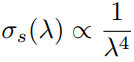
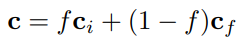

# Chapter 14——Volumetric and Translucency Rendering

<span style="color:yellow;font-size:1.3rem">Participating media</span>是光传输的参与者，它们通过*散射或吸收*来影响穿过它们的光。之前我们讨论的大多是密集介质，而*密度较低的介质*是水、雾、蒸汽，甚至是由稀疏分子组成的空气。

根据其组成的不同，介质与穿过它的光以及*与它的粒子反射*的光之间的相互作用会有所不同，这一事件通常被称为光散射**light scattering**。

如9.1节所示，**漫反射表面着色模型**是光在微观层面上散射的结果。

<span style="color:yellow;font-size:1.3rem">Everything is scattering!</span>


## 1. Light Scattering Theory

在本节中，我们将描述参与介质中*光的模拟和渲染*。辐射传输方程 *radiative transfer equation* 在**多重散射路径追踪**中，被许多作者描述**[479,743,818,1413]**。在这里，我们将专注于*单个散射*，下表:arrow_down:给出了散射方程中参与介质的属性。

> :star:值得注意的是，这里很多的属性都是**波长相关的**，这意味着它们都是RGB值。
>
> 所以，回顾之前的波长相关量，我们也会发现这个道理，确实也是。RGB颜色值本质上也是光的波长，而这些值又都是波长相关的，所以自然而然也是可以考虑成RGB量


### 1.1 Participating Media Material

==有四种类型的事件，可以影响沿光线通过介质传播的辐射量==，可见上表:arrow_up:，也可见：

- **Absorption**（$\sigma_a$）：光子被介质吸收，然后转换为*热能*或其它形式的能量。
- **Out-scattering**（$\sigma_s$）：光子在介质中碰撞粒子而*散射*。这将根据描述*光反弹方向分布*（ **light bounce directions**）的相位函数p发生。（光子离开光路）
- **Emission**：当介质达到高温时，会发出光，例如火的黑体辐射。关于自发光的更多细节可见[**479**]
- **In-scattering**（$\sigma_s$）： 光子在与粒子碰撞后，可以**散射**到当前的光路径中，其值依赖于**相位函数**。（光子进入光路）

往一条光路中*添加光子*是**In-scattering**和自发光的函数。而从光路中*去除光子*，则是**消光函数** $\sigma_t=\sigma_a+\sigma_s$，表示吸收和**Out-scattering**。


散射系数和吸收系数决定介质的**反照率** $\rho$，定义为
$$
\rho=\frac{\sigma_s}{\sigma_s+\sigma_a}
$$

> 牛奶：高散射；红酒：高吸收

这些属性都是**波长相关**的，这意味着不同频率的光，其吸收和散射系数也不同。这就需要在渲染中使用**光谱值**，但事实是，几乎所有情况下，我们都是使用**RGB值**。

之前我们没有考虑==参与介质==（也就是空气），这里进行考虑的话，散射路径的**渲染方程**如下：


其中，$T_r(c,p)$是从给定点x到相机位置c的==透光率==`transmittance`，$L_{scat}(x,v)$是沿着视点的、给定点X的**散射光**。关于上诉方程的更多信息可见F神  [479]。


### 1.2 Transmittance

**透光率**$T_r$表示在一定距离内能通过介质的**光的比率**：


这个关系式也被称为<span style="color:yellow;font-size:1.3rem">Beer-Lambert Law</span>。==透光率需要应用在==：

- 来自不透明表面的辐射度$L_o(p,v)$。
- 在介质中（空气），由**In-scattering**产生的辐射度$L_{scat}(x,v)$。
- each path from a scattering event to the light source

而在视觉上，这些因素分别导致：

- 造成一些*类似雾*的表面遮挡。
- 会导致散射光的遮挡，这是另一种关于**介质厚度**的**视觉提示**。
- 导致参与媒体的**体积自影子**（`volumetric self-shadowing`）


### 1.3 Scattering Events

对 ==in-scattering==进行积分：


其中，$p()$是**相位函数**，$v()$是**可见性函数**，它表示光到达X的比例：


其中，$volShad=T_r$。

> 阴影由两种遮挡产生：不透明和体积遮挡
>
> 关于RayMarching，可见 **[479, 1450, 1908]**


> 左边，介质比较薄，消光系数基本无，所以呈现蓝色（$\sigma_s$的B通道值更大）
>
> 右边，介质变浓变红，颜色不但变红，因为此时消光系数变大，而这个时候$\sigma_s$的B通道也会起大作用，消减的更快。

当太阳高度较高时（例如，穿过大气层的**短距离光路**，垂直于地面），==蓝光散射更多==，使天空呈现出自然的蓝色。但是，当太阳在地平线上时，由于有**很长的光路**穿过大气层，天空会显得更红，因为更多的**红光**被透射出去。这就产生了*美丽日出和日落*。


### 1.4 Phase Functions

参与介质是由*半径不同的粒子*组成的。这些粒子的**大小分布**将影响光在给定方向**散射的概率**。而在**宏观角度**描述这些的就是<span style="color:yellow;font-size:1.3rem">相位函数</span>（积分和为1）。


最简单的相位函数是**各项同性**的，如：


而==基于物理的相位函数==，依赖于粒子的相关大小$s_p$：
$$
s_p=\frac{2\pi r}{\lambda}
$$
其中，r是粒子半径，$\lambda$是**considered wavelength**：

- $s_p<<1$：<span style="color:red;font-size:1.2rem">Rayleigh scattering</span>（例如：空气）
- $s_p \approx 1$： <span style="color:red;font-size:1.2rem">Mie scattering</span>
- $s_p>>1$： <span style="color:red;font-size:1.2rem">geometric scattering</span>


#### Rayleigh Scattering

R神推导出光*在空气中*散射的项。这个相位函数有**两个波瓣**:arrow_down:，被称为`backward and forward scattering`。


Rayleigh Scattering是**高度波长相关**的。当被视作波长$\lambda$的函数时，**Rayleigh Scattering**的散射系数$\sigma_s$和波长有如下相关关系：**{9}**



这种关系意味着：==短波长的蓝光或紫光，比长波长的红光散射得更多==。利用**光谱颜色匹配函数**，可以将上诉公式**{9}**的光谱分布转换为**RGB**：$\sigma_s=(0.490,1.017,2.339)$，


#### Mie Scattering

这种类型的散射**不是波长相关**的，通常有着大的、尖锐的方向波瓣。计算这种散射是昂贵但必要的。

介质通常具有颗粒大小的连续分布。对不同粒子的**Mie相位函数**进行平均，求得整个介质的平均相位函数。

> **MiePlot**软件可以用来模拟这种现象   **[996]**


其中一个常用的相函数是<span style="color:yellow;font-size:1.3rem">Henyey-Greenstein</span>相函数，这个函数不能捕获真实世界散射行为的**复杂性**，但它可以很好地**匹配**朝主方向散射的波瓣。它可以用来表示*烟、雾*等参与介质。计算公式如下：


**g参数**可以用来表示**向后散射**(g < 0)，**各向同性散射**(g = 0)，或**向前散射**(g > 0)。:arrow_down:


对HG进行近似的一个算法是<span style="color:yellow;font-size:1.3rem">Schlick phase function</span>：:arrow_down:  **[157]**


它不包括任何**复杂的幂函数**，只包括一个平方，这样计算起来要快得多。为了将这个函数映射到原来的**HG相位函数**上，==k参数需要从g计算==。

也可以混合多个**HG**或**Schlick相函数 ** **[743]**.，来表示更复杂的**一般相函数**。这使我们能够同时表示正向和反向相位函数。


#### Geometric Scattering

在这种情况下，光在每个粒子中*折射和反射*。这需要一个复杂的散射相位函数，来在**宏观水平**上模拟它。光的偏振也会影响这种类型的散射。


## 2. Specialized Volumetric Rendering

### 2.1 Large-Scale Fog


雾可以拟合成基于深度的效果，**最基本的形式**是根据离镜头的距离，在场景顶部进行雾色的**alpha混合**，通常称为==深度雾==

> 雾的作用：视觉提示；深度提示；剔除的一种形式

一个简单的使用方式，是作为透光率：:arrow_down:



f的计算方式有很多，可以使用如下**线性方式**：:arrow_down:


而更加物理的方式是指数增长， 遵循透过率的**Beer-Lambert Law** ：:arrow_down:


其中，标量$d_f$是用户参数，用来控制**雾的浓度**。透视视角中，雾的一个问题是==深度缓冲值是以非线性方式计算的==。

- **高度雾**代表的是：具有**参数化的高度和厚度**的单一参与介质板块。**[1871]**

- 深度雾和高度雾都是**大尺度雾效应**。我们可能想要渲染更多的==局部现象==，如分离的雾区。 **[1871]**   **[1308]**
- 关于介质是水，而不是空气的情况。**[261]  [1871]**


### 2.2 Simple Volumetric Lighting

介质中的光散射计算是复杂的，但很多情况下，可以使用有效的拟合技术。**获得体积效果**最简单的方法是：在`framebuffer`上渲染混合的透明网格，称之为<span style="color:yellow;font-size:1.3rem">splatting</span>：为了**渲染**穿过窗户、茂密的森林或聚光灯的**光柱**，一个**解决方案**是使用`camera-aligned`的粒子，每个粒子上都有纹理。每个**纹理四边形**在光轴的方向上拉伸，同时总是面对相机。**缺点是**：内存有要求。

为了解决这个问题，人们提出了使用**封闭解**，来处理光的单次散射的**后处理技术**。假设一个==球形均匀相位函数==，就有可能对散射光进行积分，使其具有正确的**透射率**:arrow_down:。


代码如下：（一些扩展，**[1722]，[1364]**， **[359]**，**[1219]**）

```c
float inScattering (vec3 rayStart , vec3 rayDir ,vec3 lightPos , float rayDistance )
{
    // Calculate coefficients .
    vec3 q = rayStart - lightPos ;
    float b = dot( rayDir , q) ;
    float c = dot(q, q) ;
    float s = 1.0f / sqrt (c - b*b) ;
    // Factorize some components .
    float x = s * rayDistance ;
    float y = s * b;
    return s * atan ( (x) / (1.0 + (x + y) * y) ) ;
}
```


## 3. General Volumetric Rendering

在本节中，我们将介绍更多**基于物理的体积渲染技术**，试图表示**介质的材质**及其与光源的相互作用。

### 3.1 Volume Data Visualization

==Volume data visualization==是用于显示和分析体数据的工具。计算机断层扫描(**CT**)和磁共振图像(**MRI**)技术可用于创建**体内结构**的临床诊断图像。

除了*路径追踪和光子映射*，目前已经提出了几种较便宜的方法来实现**实时性能**。对于半透明现象，体积数据集可以由一组垂直于视图方向的**等距切片层**进行取样，来组成:arrow_down:。 **[797]**


关于一维和二维transfer function，可见书 P 606。:arrow_down:


根据半角进行切边的扩展技术。**[797]** :arrow_down:


### 3.2 Participating Media Rendering

已经提出了**Splatting approaches**来处理更一般的**非均匀介质**，即沿着射线对**体积物质**进行取样。在不考虑任何输入照明的情况下，Crane等人**[303]**使用喷溅来渲染*烟、火和水*。在烟和火的情况下，每个像素上都会产生一条射线，==该射线在体积中进行射线搜索，收集颜色和遮挡==。在水的情况下，一旦射线的第一个命中点与水面相遇，**体积采样**就终止。表面法线是采样位置的**密度场梯度**。为了保证平滑的水面，使用**三次插值**来过滤密度值。


关于一些技术的讨论，见 书 P 608-609。**[765]  [1958]  [1812]  [816]**

以上方法的缺点在于，加入其它半透明表面会引发错误。所有这些算法==在透明表面上应用体光照==时都需要一些特殊处理，比如包含 **in-scattering**和透射率的体块`volume`。

以后再详细看。（Wronski[**1917**]提出了一种方法，将场景中来自太阳和光线的**散射辐射度**，像素化为**三维体纹理**V~0~（映射到视图剪辑空间））。

一种基于物理的方法，来定义参与介质的材料。[**742**] [**1802**]（*虚幻引擎*）


体积渲染的==动态GI光照==， **[1917]**，**[1802]** (*虚幻引擎*)

<span style="color:yellow;font-size:1.3rem">volumetric shadows</span>：H神提出了一个统一解决方法 **[742]**。根据 **clipmap**分布，参与介质体积和颗粒被**体素化**成三个体积，围绕着相机层层叠叠，称为**extinction volumes**。**[1777]**。这样的解决方案使粒子和参与介质能够**自阴影**并相互投射阴影。

**体积阴影**可以使用*不透明阴影贴图*来表示。然而，如果捕捉的细节需要**高分辨率**，使用体积纹理可能很快成为限制。因此，已经提出了**替代**来更有效地表示T~r~，例如使用**正交基函数**，如傅里叶**[816]**或离散余弦变换。


## 4. Sky Rendering

渲染世界本身需要*行星天空、大气效果和云层*。蓝天是阳光在大气（参与介质）中散射的结果。关于动态天空的渲染，已经成为3A游戏的标配。

### 4.1 Sky and Aerial Perspective


为了渲染大气效果，我们需要考虑两个方面，如上图:arrow_up:：

- 首先，拟合*阳光和大气粒子*的交互，导致波长相关的**Rayleigh scattering**。这导致了天空的颜色和一层**薄雾**，也被称为**空中透视**`aerial perspective`。
- 第二，需要地面附近**集中的大颗粒**对阳光的影响。颗粒的浓度取决于**天气情况**和**污染**，导致了波长无关的**Mie scattering**。这种现象会导致太阳周围出现明亮的光晕，特别是当粒子浓度很高时。

