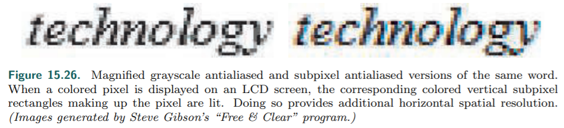

# Chapter 15——Non-Photorealistic Rendering

> 建议使用主题`Fluent`阅读

[toc]

非真实感渲染(**NPR**)，也称为程式化渲染，有广泛的目标。NPR的另一个领域是模拟绘画风格和自然介质，如钢笔和墨水，炭笔和水彩（ pen and ink, charcoal, and watercolor）。两本旧书提供了部分NPR算法 [**563,1719**]。

## 1. Toon Shading

这种风格被认为是**卡通**，它有幻想和童年的内涵。最简单的方法是，==用实线画出不同颜色的区域==。卡通渲染风格已经在计算机图形学中使用了几十年，它将三维模型与二维的`cel`动画结合在一起。与其他NPR风格相比，它很容易定义，因此很适合由计算机自动生成。一些游戏进行了广泛的使用 [**250, 1224, 1761**]。

**物体的轮廓**通常用黑色渲染，这放大了卡通的外观。而对于渲染卡通表面，有许多不同的方法——==两种最常见的方法==是用实色（无光照）填充网格区域（`solid`），或使用`two-tone`方法。

`two-tone`方法也被称为`hard shading`，当渲染法线和光源方向的**点积**高于某个值时，使用**较浅的颜色**，反之则使用**较深的色调**。

当光照比较复杂时，另一种方法是对**最终图像本身**进行量化。这种方法也被称为 ==posterization==:arrow_up:，将一个连续的**值范围**转换为几个`tones`。量化**RGB值**有时是不好的，因为各个通道是不相关的。

使用==HSV==、==HSL==或==Y`CbCr==等保色空间是更好的选择。另外，可以定义一个**一维函数**或纹理来**重新映射**强度级别到特定的`shades or colors`。纹理也可以使用**量化**或其他**过滤器**，进行预处理。

B神通过使用一张二维贴图，代替一维纹理，来产生**视相关**的效果 [**104**]。**第二个维度**是通过表面的深度或方向来访问的，例如，当物体距离较远或快速移动时，它可以**平滑软化**。

## 2. Outline Rendering

有几种不同类型的**边缘**可以在**卡通渲染**中使用：

- ==boundary==或==border==是两个三角形不共用的边，例如：纸的边缘。固体物体没有此类边。
- ==crease,hard or feature edge==（折痕、硬边或特征边）是两个三角形所共用的，但其**夹角**高于某个预设值。一个好的默认**折痕角度**是60度 [**972**]。折痕边缘可以进一步细分为==ridge==和==valley==（脊边和谷边）。
- ==material edge==当共享它的两个三角形在材质上不同，或在其他方面造成渲染变化时，将出现。
- ==contour edge==是指两个相邻的三角形，相对于某个方向向量（通常是view），朝向不同的方向。（**轮廓**）
- ==silhouette edge==是沿着物体轮廓的**轮廓边缘**，即在图像平面上将物体与背景分离开来。

我们在此区分轮廓和轮廓边缘，**S**是**C**（contour edge）的子集，因为**S**将物体和其它部分分离开，而**C**则不需要。暗示轮廓==Suggestive contours== [**335**]是由从原始视点来看，几乎是轮廓的位置形成的。它们提供**额外的边缘**，帮助传达物体的形状:arrow_down:。

我们关注的焦点是**contour edges**。[**132**]

### 2.1 Shading Normal Contour Edges

渲染法线和视线向量之间的**点积**可以用来给出轮廓（contour）。这种方法的一个**缺点**是：等高线的宽度是可变的，取决于表面的曲率。这种方法适用于没有**折痕边缘**的曲面模型

该算法在诸如**立方体**这样的模型上失效，因为**折痕边缘**附近的`surface`不具备这一属性。即使在曲面上，它也会被破坏，看起来很糟糕，因为当物体很远，轮廓（`contour`）附近的一些法线采样可能并不接近垂直。[**565**]

###  2.2 Procedural Geometry Silhouetting

R神提出了第一个实时**轮廓渲染**技术 [**1510**]，并由C神进行优化 [**1460**]。一般的想法是正常渲染正面，然后用某种技术渲染背面，使其轮廓边缘（contour）可见。

渲染轮廓的**一种方法**是只绘制背面的边缘（而不是正面）。一种使这些线**变宽**的方法是将背面本身渲染成黑色，再次向前偏置（biasing forward）。

Raskar和Cohen给出了几种偏置方法，例如固定偏移、an amount that compensates for the nonlinear nature of the z-depths、**深度-斜率偏差调用**（depth-slope bias）——例如**OpenGL**的`glPolygonOffset`。这些方法的一个**共同问题**是创建的线条宽度不一致，因此偏移值不仅取决于背面，还取决于相邻的正面(s)。见下图:arrow_down:。​

> Lengyel[**1022**]讨论了如何通过修改透视矩阵来提供更精细的深度控制

R神 [**1460,1461**]解决了这个**邻接依赖问题**，取而代之的方法是：将每个背面三角形沿其边缘增大，而三角形的**斜率**和到观看者的距离决定了三角形的**扩展量**。

- 一种方法是将每个三角形的三个顶点沿其平面向外展开。:arrow_down:
- 绘制三角形的一种**更安全的方法**是将三角形的每条边向外移动并连接这些边。这样做可以避免顶点远离原始三角形。:arrow_down:

三种方法的结果见下图:arrow_down:。这种增大技术（==fattening==）更加可控和一致，并成功地用于《*波斯王子*》和《*爆炸头*》等电子游戏。

**另一种方法**是通过沿**共享顶点法线**，移动它们的顶点，将背面向外移动，移动量与它们与眼睛的**z距离**成正比 [**671**]。这被称为`shell`或`halo`方法。沿着顶点的法线，向外移动顶点是**顶点着色器**的一个完美任务。这种类型的扩展有时称为==shell映射==。

一个`shell`实现：

==这类算法只呈现轮廓边缘（contour edges）==。Raskar[**1461**]给出了一个巧妙的解决方案，可以在变形模型上绘制==脊折痕边==，而不需要创建和访问**边连通性数据结构**。这个想法是：:arrow_down:

- 沿着被渲染的三角形的每条边，生成一个额外的多边形。
- 这些**边缘多边形**通过用户定义的**临界二面角**，在三角形的平面上进行弯曲，该临界二面角决定了何时应该出现折痕。
- 如果两个相邻的三角形的折痕角大于这个**临界折痕角**，边缘多边形将可见，否则将被三角形隐藏。

###  2.3 Edge Detection by Image Processing

检测和渲染这些边缘包括两个部分。首先，渲染场景的几何形状，像素着色器保存深度，法线，对象id，或其他所需的各种渲染目标的数据。然后以类似12.1节中描述的方式进行后处理。后处理通过采样每个像素周围的邻域，并根据这些采样输出结果。

一旦产生了这些笔画，就可以根据需要，进行进一步的**图像处理**。由于笔画可以在单独的缓冲区中创建，它们可以自行修改，然后在表面上合成。例如，噪声函数可以用于分别**磨损**和**摆动**线条和表面，在两者之间创建**小间隙**，并提供手绘外观。纸张的高度可以用来影响渲染效果，比如在凸起的顶部**沉积**木炭等固体材料，或者在山谷中**堆积**水彩颜料。如图15.16

一种方法被称为**差高斯**(==difference of Gaussians==)，其中图像处理两次，用两个不同的**高斯滤波器**，然后一个从另一个减去。这种边缘检测方法已被发现**为NPR产生特别令人满意的结果**，用于生成各种艺术风格的图像，如**铅笔渲染**和**蜡笔**。 [**949, 1896, 1966**].

Kyprianidis等人[**949**]对NPR领域的图像处理效果进行了全面的回顾和分类。

Montesdeoca等人[**1237**]的作品是一个很好的例子，将一些简单的技术结合到**以交互速率运行**的水彩效果中。下图:arrow_down:显示了一个用水彩风格渲染的模型。

###  2.4 Geometric Contour Edge Detection

以上讨论的技术的**限制**在于：线条的风格是有限的，我们不能构建虚线、手绘线等线条。因此，我们再找到轮廓之后，还要对其进行渲染。

`contour edge`的判断条件是：$(n_o\cdot v)(n_1\cdot v)<0$，直接蛮力搜索太耗时，一个**优化思路**是忽略处于同一平面的两个三角形。

在任何实体模型中，每个单独的轮廓总是由一个封闭的曲线组成，称为`silhouette loop`，或者更准确地说，`contour loop`。对于物体边界内的轮廓，`loop`的某些部分可能会被遮挡。注意，当遵循网格边缘时，在三维空间中，==环通常是锯齿状的==，z深度变化明显。如果希望边缘形成更平滑的曲线，例如通过距离改变厚度[**565**]，则可以进行额外的处理，在三角形的法线之间插值，以近似三角形内的真实轮廓边缘。[**725, 726**]

> 在帧与帧之间，追踪`loop`的位置是快速的，而不是重新创建`loop` [**1125**]

所有这些显式的边缘检测方法都是**CPU密集型**的，并且由于**形成轮廓的边缘**分散在**边缘列表**中，因此**缓存一致性**较差。为了避免这些代价，==顶点着色器可以用来检测和渲染轮廓边缘。==**这个想法**是将模型的每条边沿着管道，发送到两个三角形组成一个**退化四边形**，两个相邻的三角形法线附加到每个顶点。当发现一条边是轮廓的一部分时，四边形的点就会移动，使其不再退化(即**可见**)。然后画出这个薄的四边形`fin`。[**226**]

### 2.5 Hidden Line Removal

明确找到边缘的一个**优点**是：我们可以将其**样式化**为钢笔笔触、绘画笔触或任何其他想要的效果。笔画可以是基本的线条，`textured impostors`(13.6.4)，基本元素的集合等。

确定每个线段的**可见性**被称为hidden line rendering，即对一组线段进行可见性处理，然后返回一组较小的（可能是剪切的）线段。

 Markosian提出了一个解决方法 [**1287**]。

C神提出了一个计算边缘可见性的方法 [**282**]。它们将每个线段存储为**两个世界空间的坐标值**。一系列的`Pass`在整个**片段集**上运行一个片元着色器，**剪裁**并确定每个片段的**像素长度**，然后为这些潜在的像素位置创建一个图谱，并确定可见性，然后使用这个图谱来创建可见的笔触`Strokes`。这个方法在GPU上运行很快。

**==风格化==**通常包括应用一个或多个**预先制作的纹理**到线**四边形**上。[**1516**]

确定轮廓边缘，将它们连接成**连贯的链**，然后确定**每个链的可见性**，来形成一个`stroke`是很难**完全并行**的。另一个问题是，在制作高质量的线条样式时，下一帧的每一笔都将被再次绘制。

时域方法汇总。 [**130**]  [**131**] 

## 3. Stroke Surface Stylization

除了第一节的卡通风，还有很多其他方法，来渲染NPR`surface`。

L神的方法 [**966**]基于**漫反射项**选择不同的纹理:arrow_up:，例如：当**漫反射颜色**变暗时，使用一个带有较暗的纹理。这类算法的一个==主要问题==是`shower door effect`，在动画中，对象看起来就像通过**图案玻璃**看到的一样——物体感觉就像在纹理中游泳。B神提出了一个解决方法 [**196**]。

**更直接的解决方法**是：直接在表面上应用纹理。**挑战**是：基于笔画（ stroke-based）的纹理需要保持一个相对统一的**笔画厚度和密度**。Praun等人 [**1442**] 提出了一种生成笔划纹理的`mip maps`，并以平滑方式将其应用于表面的**实时方法**。

+ 第一步是形成所需的纹理，称为tonal art maps（TAMs）。主要是通过在**mipmap**级别中绘制笔画来实现:arrow_down:。

  

+ 然后实时渲染时，进行插值。:arrow_down:

  

+ W神进行了两个扩展。一个是使用体积纹理，就可以运行颜色的使用；第二个是使用一个阈值，来提升抗锯齿。[**1858**]

Nuebel [**1291**]给出了一种相关的==木炭渲染==方法。他使用了一张噪声图（也是沿着一张轴**从暗到亮**）。Lee[**1009**]使用**TAMs**和其他技术，生成了令人印象深刻的图像，看起来像是用**铅笔**绘制的。

Girshick等人 [**538**] 讨论了沿着曲面上的**主要曲线方向线**绘制笔画。也就是说，从曲面上的任意一点出发，存在一个指向最大曲率方向的**第一主方向切向量**。**第二主方向**是垂直于**第一矢量**的切向量，它给出了曲面弯曲最小的方向。==这些方向线在感知曲面时很重要==。它们还有**一个优点**就是**静态模型**只需要生成一次，因为这样的笔画`strokes`是独立于光照的。

graftals（[**372, 853, 1126**]）的基本想法是：几何或贴花纹理（decal texture）可以根据需要添加到表面，以产生特定的效果。它们可以由所需的==LOD==、表面到眼睛的方向或其他因素来控制。这个技术可以用来模拟**钢笔**或**毛笔**的笔触。:arrow_down:

## 4. Lines

渲染简单的**实心“硬”线**通常是无趣的。然而，它们在==CAD==等领域很重要，用于查看底层模型的面片和识别对象的形状。

### 4.1 Triangle Edge Rendering

### 4.2 Rendering Obscured Lines

在正常的**线框图**中，没有绘制表面，模型的所有边缘都是可见的。为了避免绘制**被表面隐藏的线条**，将所有填充的三角形绘制到z缓冲区中，然后正常地绘制边缘[**1192**]。如果不能在绘制所有的线之前，绘制所有的表面，一个**稍微昂贵的解决方案**是用与背景相匹配的纯色绘制表面。

###  4.3 Haloing

## 5. Text Rendering

本节总结了用于文本渲染的主要算法方法。眼睛对**强度的差异**比对**颜色的差异**更敏感。这一事实很早起就被用来提高**感知空间分辨率**。

液晶显示器上的每个像素都由三个垂直的彩色矩形组成：红、绿、蓝。这个配置提供的**水平分辨率**是像素的三倍。使用不同的`shades`填充不同的子像素，所以这种技术有时被称为==子像素渲染==。眼睛会将这些颜色融合在一起，而红色和蓝色的边缘变得无法察觉。见上图:arrow_up:。项技术于1998年首次宣布，对大型、低dpi液晶显示器有很大帮助。微软在Word 2013中停止使用ClearType，显然是因为在混合不同背景颜色的文本时出现了问题。Excel使用了这项技术，各种网络浏览器，以及FreeType和subblcd等库也使用了这项技术。Shemanarev [**1618**]的一篇文章涵盖了这种方法的各种微妙之处和问题。

详细内容见书 P 677~679。

# Further Reading and Resources

For inspiration about ==non-photorealistic and toon rendering==, read Scott McCloud’s Understanding Comics [**1157**]. 

For a view from a researcher’s perspective, see Hertzmann’s article [**728**] on using NPR techniques to help build ==scientific theories about art and illustration==. 

The book **Advanced Graphics Programming Using OpenGL** [**1192**], despite being written during the era of fixed-function hardware, has worthwhile chapters on a wide range of technical illustration and ==scientific visualization== techniques. 

Though also somewhat dated, the books by the Gooches [**563**] and by Strothotte [**1719**] are good starting places for ==NPR algorithms==. 

Surveys of ==contour edge and stroke rendering== techniques are provided by Isenberg et al. [**799**] and Hertzmann [**727**]. 

The lectures from the **SIGGRAPH 2008** course by Rusinkiewicz et al. [**1521**] also examine ==stroke rendering== in detail, including newer work, and B´enard et al. [**130**] survey frame-to-frame coherence algorithms. 

For artistic ==image-processing effects==, we refer the interested reader to the overview by Kyprianidis et al. [**949**]. 

The proceedings of the International Symposium on Non-Photorealistic Animation and Rendering (NPAR) focus on research in the field. 

Mitchell et al. [**1223**] provide a case study about how engineers and artists collaborated to give a distinctive graphic style to the game ==Team Fortress 2==. 

Shodhan and Willmott [**1632**] discuss the ==post-processing system== in the game Spore and include pixel shaders for ==oil paint, old film==, and other effects. 

The SIGGRAPH 2010 course “==Stylized Rendering in Games==” is another worthwhile source for practical examples. 

In particular, Thibault and Cavanaugh [**1761**] show the evolution of ==the art style for Borderlands== and describe the technical challenges along the way. 

Evans’ presentation [**446**] is a fascinating exploration of a wide range of rendering and modeling techniques to achieve ==a particular media style==. 

Pranckeviˇcius [**1440**] provides a survey of accelerated ==text rendering techniques== filled with links to resources