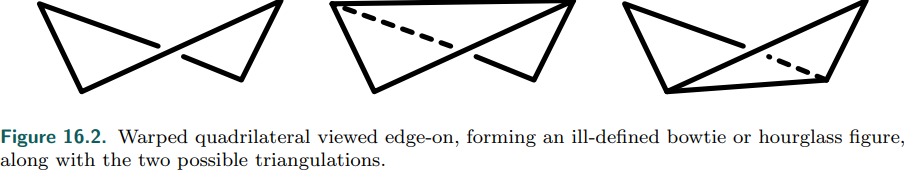
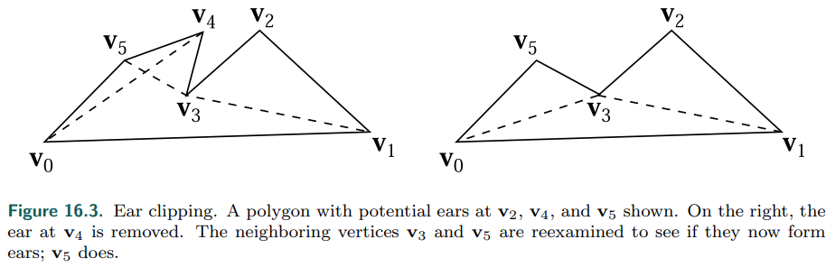
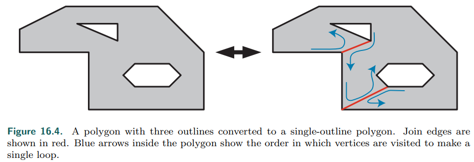
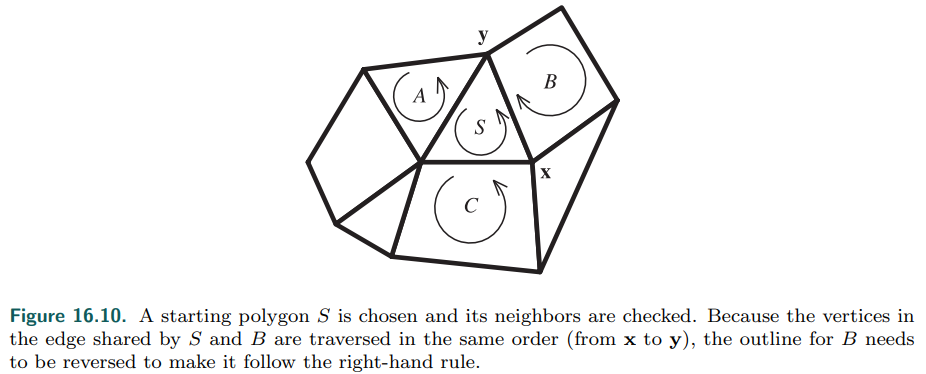
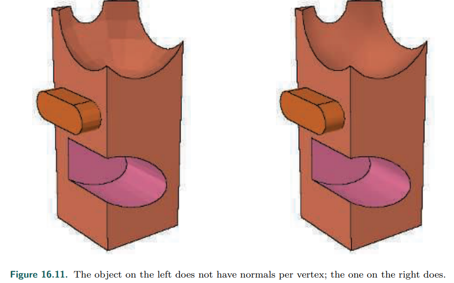
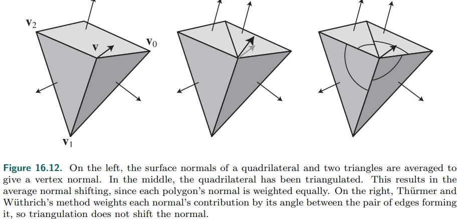
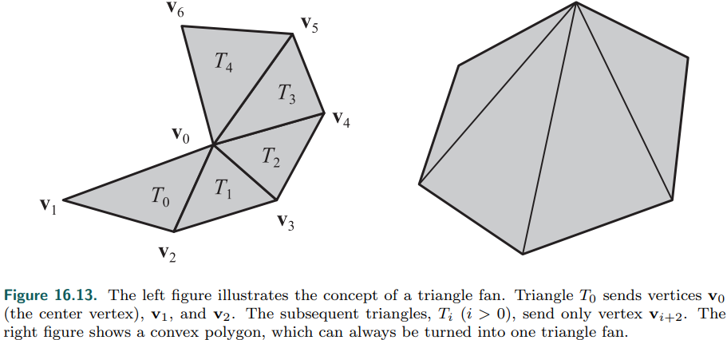
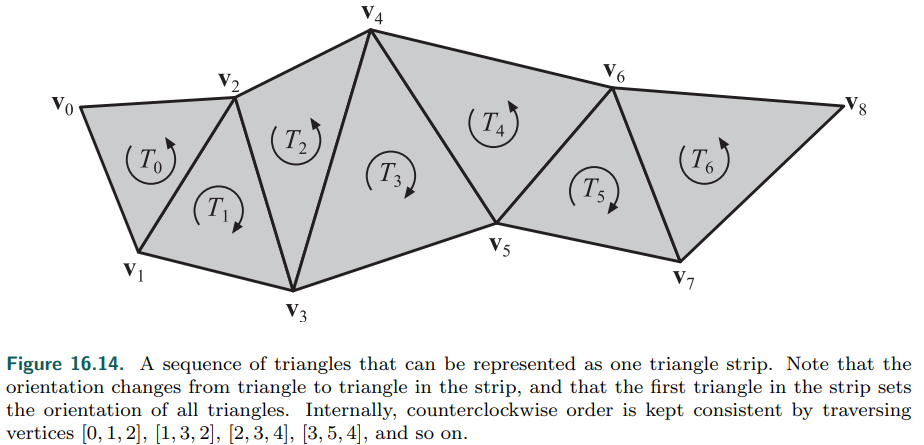

# Chapter 16——Polygonal Techniques

[toc]

到目前为止，我们进行的渲染都是基于**模型格式正确**且细节到位。但实际可能不是如此，在本章中，我们将讨论在**多边形数据集**中遇到的各种问题，以及针对这些问题的一些修复和变通方法。

## 1. Sources of Three-Dimensional Data

几何模型的生成方法如下：

+ 直接输入几何描述
+ 编写程序创建这样的数据。这被称为==过程建模==。
+ 将其他形式的数据转换成`surfaces`或`volumes`。
+ 使用建模程序来构建一个对象。
+ 从同一物体的一张或多张照片重建表面，称为`photogrammetry`。
+ 使用三维扫描仪、数字化仪或其他传感设备对真实模型的各点进行采样。
+ 生成一个等值面，在空间的某些体积中代表相同的值。`CAT`
+ 使用以上技术的混合。

在建模领域中，有两种主要类型的建模人员：基于实体的和基于表面的。前者多使用**CAD**，后者则使用**Maya**等。

## 2. Tessellation and Triangulation

`Tessellation`将一个曲面分割成一组多边形的过程。把一个复杂的多边形转换成三角形叫做三角剖分`triangulation`。==Delaunay triangulation==要求每个三角形的顶点形成的每个圆不包含任何剩余的顶点，这将使**最小角度**最大化。

大多数==镶嵌算法==都适用于二维空间。他们假设多边形的所有点都在同一个平面上。然而，一些模型创建系统可能会产生严重扭曲和**非平面的多边形面**。这一问题的一个常见情况如下:arrow_down:。​

当存在弯曲多边形时，一个快速纠正方法是：将顶点投影到一个垂直于==多边形的近似法线==的平面上。这个平面的法线通常是通过计算xy, xz和yz三个**正交平面**上的**投影面积**来确定的。也就是说，多边形在yz平面上的面积，通过放下x坐标得到的，就是x分量的值，在xz上是y，在xy上是z。这种计算平均法线的方法叫做纽维尔公式。

==最基本的三角剖分算法==是检查任意两点之间的线段，看它是否与多边形边相交。如果相交，则跳过，测试下一对点，否则使用此线段进行剖分。这个方法太慢了，时间复杂度时$O(n^3)$

一个更有效的方法是ear clipping，其时间复杂度是$Q(n^2)$，分为两个步骤： [**1574**].

1. 遍历几何体，寻找可能的`ear`，如下图：

    

2. 移除找到的`ear`，如上图的$v_4$，然后继续测试，下一个可能删除的`ear`是$v_5$

3. 直到找不到`ear`，这个几何体就三角剖分完毕。

将一个多边形分割成==凸区域==比**三角分割**更有效，凸区域的检测可见 [**1576**]。chneider和Eberly [**1574**]给出了两种==凸划分==方法。

多边形并不总是由==单一的轮廓==构成。图16.4:arrow_down:显示了一个由三个轮廓组成的多边形。可以通过连接两个轮廓之间点，将其转化为单个轮廓。

### 2.1 Shading Problems

详细见书 P 687~688

### 2.2 Edge Cracking and T-Vertices

曲面通常被镶嵌到网格中进行渲染，这种镶嵌是通过沿着==样条曲线==来定义曲面，从而计算顶点位置和法线来完成的。当我们使用简单的步进方法时，在样条曲面相交的地方会出现问题。在共享的边缘上，两个表面的点需要重合。由于模型本身的原因，有时可能会出现这种情况，但通常情况下，如果没有足够的注意，为一条样条曲线生成的点将与相邻曲线生成的点不匹配。这种效果被称为==边缘开裂==。

固定这些裂缝的过程叫做**缝边**`edge stitching`。我们的目标是：确保沿着**共享边**的所有顶点都被两个**样条曲面**共享，这样就不会出现裂缝。连接平面时遇到的一个相关问题是：==T-vertices==。这类问题可能出现在两个模型的边相交时，但不共享沿它们的所有顶点。即使边缘理论上应该完美地满足，如果渲染器没有足够的精度来表示屏幕上的顶点位置，裂缝就会出现。现代图形硬件使用**亚像素寻址**[**985**]来避免这个问题。

## 3. Consolidation

一旦模型通过了镶嵌算法，我们就剩下了一组**表示模型**的多边形。有一些操作可能对显示这些数据有用。最简单的是检查多边形本身是否形成正确——它至少有三个不同的顶点位置，并且它们不是共线的。

一个通常应用于多边形的程序是==归并==，即在面之间寻找共享的顶点。另一种操作称为==定向==，即所有**形成一个表面**的多边形都朝向同一个方向。对于不同的算法，如背面剔除，折痕边缘检测，正确的碰撞检测和响应，网格的定向是很重要的。与方向相关的是顶点法线生成，表面看起来很光滑。我们称所有这些类型的技术为==consolidation algorithms.==。

### 3.1 Merging

给定一组不连接的多边形，可以用几种方式进行==合并==。一种方法是使用哈希 [**542,1135**]。初始化顶点计数器为零。对于每个多边形，尝试依次将其每个顶点添加到散列表中，并基于顶点值进行散列。如果一个顶点还没有在表中，将它和顶点计数器的值一起存储在表中，然后将顶点计数器的值递增；也将顶点存储在最终顶点列表中。如果找到匹配的顶点，则检索其存储索引。用指向顶点的索引保存多边形。一旦处理完所有的多边形，顶点和索引列表就完成了。

模型数据有时包含非常接近但不完全相同的独立多边形顶点。==合并这些顶点的过程称为焊接==。有效地焊接顶点可以通过使用一个松散的相等函数的位置排序来完成

### 3.2 Orientation

给定一个合理的模型，下面是一种确定多边形网格方向的方法：

1. 为所有多边形形成==边-面结构==。
2. 对边进行排序或散列，以找到匹配的边。
3. 找到相互接触的多边形组。
4.  对于每组，根据需要`flip faces`，以获得一致性。

第一步是创建一组==半边对象==。半边是多边形的一条边，其指针指向相关的面(多边形)。由于一条边通常由两个多边形共享，因此这种数据结构称为==半边==。使用排序**顺序创建**每个半边，其第一个顶点存储在第二个顶点之前。

目标是找到哪些边是相同的。由于每个边缘都被存储，所以第一顶点比第二顶点少，比较边缘就是比较第一顶点和第二顶点的问题。可以使用一个哈希表来寻找匹配的边[**19，542**]。

一旦边匹配，相邻多边形之间的连接就已知，形成邻接图。对于三角形网格，这可以表示为每个三角形的(最多)三个相邻三角形面的列表。任何没有两个相邻多边形的边称为==边界边==。由边连接的==多边形集合==形成一个连续的群。

**下一步是让网格的方向保持一致**，例如，我们通常希望所有多边形都有逆时针方向的轮廓。对于每一个连续的多边形组，选择一个任意的起始多边形。检查其相邻的每个多边形，并确定其方向是否一致。如果两个多边形的边的遍历方向相同，那么相邻的多边形必须翻转。

尽管此时所有面的方向都是正确的，但它们可以是==向内的==。在大多数情况下，我们希望它们朝外。一个快速测试是否所有的面都应该翻转的方法是：计算组有符号的体积并检查符号。如果它是负的，反转所有的循环和法线。通过计算每个三角形的**带符号体积标量三重积**，并将它们相加来计算这个体积。在realtimerendering.com网站上寻找我们在线性代数附录中的体积计算。

###  3.3 Solidity

非正式地说，一个网格形成一个固体，如果它是有方向的，所有从外部可见的多边形都有相同的方向。换句话说，网格只有一面是可见的。这样的多边形网格称为==封闭的或不透水的==。

最简单的==实度测试==是检查网格中的每个多边形的边是否恰好被两个多边形共享。这个测试对于大多数数据集来说已经足够了。这样的曲面被松散地称为==流形==，具体地说，是两个流形。从技术上讲，多重曲面是没有任何==拓扑不一致性==的曲面，例如有三个或三个以上的多边形共享一条边或两个或两个以上的角相互接触。形成立体的连续曲面是没有边界的流形。

###  3.4 Normal Smoothing and Crease Edges

多边形网格形成曲面，但多边形顶点没有法向量，所以不能用曲率来渲染它们。许多**模型格式**不提供**表面边缘信息**。关于各种类型的边，请参阅15.2节。这些边之所以重要，有几个原因。它们可以突出由一组多边形组成的模型的一个区域，或者有助于NPR。因为它们提供了重要的**视觉提示**，这样的边缘通常避免被**渐进网格算法**简化。

合理的**折痕边**和**顶点法线**通常可以从**定向网格**中成功导出。一旦**方向一致**并导出邻接图，就可以通过平滑技术生成顶点法线。模型的格式可以**通过指定多边形网格的平滑组**提供帮助。==平滑群组==的值用来明确定义群组中哪些多边形属于一起组成一个曲面。不同平滑组之间的边缘被认为是尖锐的。

另一种平滑多边形网格的方法是==指定折痕角==。这个值与==二面角==比较，二面角是两个多边形的平面法线之间的夹角。数值通常在20到50度之间。如果发现两个相邻多边形之间的二面角小于指定的折痕角，则认为这两个多边形属于同一平滑组。这种技术有时被称为边缘保存。

一旦找到一个平滑组，顶点法线可以计算在组内共享的顶点。==寻找顶点法线的解决方案==是：平均共享顶点的多边形的表面法线 [**541,542**]。然而，这种方法可能导致不一致的和较差的加权结果。T神[**1770**]提出了==另一种方法==，其中每个多边形法线的贡献由它在顶点形成的角度加权。该方法具有一个可取的性质，即无论共享一个顶点的多边形是否被三角化，其结果都是相同的。如果镶嵌的多边形变成了共享顶点的两个三角形，==平均法方法==将不正确地施加两倍于原始多边形的两个三角形的影响

## 4. Triangle Fans, Strips, and Meshes

==三角形列表==是存储和显示一组三角形的最简单，但通常效率最低的方法。每个三角形的顶点数据一个接一个地放在一个列表中。每个三角形都有自己独立的三个顶点集，因此三角形之间不存在顶点数据的共享。提高图形性能的一种标准方法是通过图形管道发送一组共享顶点的三角形。共享意味着对顶点着色器的调用更少，所以需要转换的点和法线更少。这里我们描述了共享顶点信息的各种数据结构，从三角形扇形和条形开始，逐步发展到渲染表面的更精细、更高效的形式。

###  4.1 Fans

这个数据结构:arrow_up:展示了我们如何形成三角形，并使每个三角形的存储成本小于三个顶点。所有三角形共享的顶点称为中心顶点，在图中为顶点0。对于起始三角形0，发送顶点0、1和2(按此顺序)。对于后续的三角形，中心顶点总是与先前发送的顶点和当前正在发送的顶点一起使用。注意，一般的凸多边形要表示成==三角形扇形==是很简单的，因为它的任何一点都可以用作起点和中心顶点

### 4.2 Strips

==三角形条==`Strips`:arrow_up:就像==三角扇==一样，之前的顶点会被重用。不是一个中心点和前一个顶点被重用，而是**前一个三角形的两个顶点帮助形成下一个三角形**。

对于第一个三角形(表示为T0)，所有三个顶点（表示为v0、v1和v2）都按照这个顺序发送。对于这个条带中的后续三角形，只需要发送一个顶点，因为其他两个顶点已经与前一个三角形一起发送了。例如，发送三角形T1时，只发送顶点v3，使用三角形T0中的顶点v1和v2来形成三角形T1。对于三角形T2，只发送顶点v4，以此类推通过strip的其余部分。

### 4.3 Triangle Meshes

三角形扇形和条形仍然有它们的用途，但是对于复杂的模型，所有现代==GPU==的标准是：使用带有**单一索引列表**的==三角形网格==(章节16.3.1)[**1135**]。

条带和风扇允许一些数据共享，但**网状存储**允许更多。在一个网格中，一个额外的==索引数组==跟踪哪些顶点形成了三角形。通过这种方式，一个顶点可以与几个三角形相关联。

具体见书 P 699~700。

### 4.4 Cache-Oblivious Mesh Layouts

对于网格中的三角形来说，理想的顺序是最大化地使用顶点缓存。Hoppe[**771**]提出了一种算法，使网格的ACMR最小，但缓存大小必须事先知道。如果假设的缓存大小大于实际的缓存大小，那么生成的网格的好处就会明显减少。解决不同大小的缓存可能会产生不同的最佳排序。

Forsyth[485]和Lin和Yu[1047]提供了使用类似原理的快速贪婪算法。顶点的分数是基于它们在缓存中的位置和未处理的三角形数量。然后处理顶点得分最高的三角形。通过将最近使用的三个顶点的得分降低一点，该算法避免了简单地制作三角形带，而是创建类似希尔伯特曲线的模式。通过给予仍然附着较少三角形的顶点较高的分数，该算法往往避免留下孤立的三角形。所获得的平均缓存失误率可与那些更昂贵和更复杂的算法相媲美。Lin和Yu的方法稍微复杂一些，但使用了相关的思想。对于12个缓存大小，30个未优化模型的平均ACMR为1.522;优化后，平均下降到0.664或更低，这取决于缓存大小

具体见书 P 700~701。

### 4.5 Vertex and Index Buffers/Arrays

提供带有模型数据的==现代图形加速器==的一种方法是使用例如：DirectX调用顶点缓冲区，OpenGL调用顶点缓冲区对象(VBOs)。

本章主要介绍DirectX的原理，具体见书 P 702~705。

## 5. Simplification

==网格简化==，也被称为**数据缩减**或**抽取**，是采取一个详细的模型和减少其三角形数量的过程，同时试图保持其外观。对于实时工作，这个过程是为了减少存储和发送到管道的顶点数量。这对于提高应用程序的可伸缩性非常重要，因为功能较弱的机器可能需要显示较少的三角形。模型数据的接收可能需要更多的镶嵌，而不是合理的表示所必需的。

L神[**92**] 指出了三种网格简化类型：静态、动态和视图相关。

- ==静态简化==是指在呈现开始之前创建单独的详细级别(**LOD**)模型，由呈现程序在其中进行选择。离线简化也可以用于其他任务，例如提供粗糙的网格来细化细分表面[1006,1007]。
- ==动态简化==给出了一个连续的LOD模型谱，而不是几个离散的模型，因此这种方法被称为连续细节级(CLOD)算法。依
- ==赖于视图的技术==指的是模型中细节级别不同的地方。具体地说，地形渲染是指在视图中需要详细表示的附近区域，而远处的区域则处于较低的细节级别。==本节将讨论这两种简化方法==。

具体见书。

## 6. Compression and Precision

## Further Reading and Resources

Meshlab is an open-source mesh visualization and manipulation system that implements a huge number of algorithms, including mesh cleanup, normal derivation, and simplification. Assimp is an open-source library that reads and writes a wide variety of three-dimensional file formats. For more software recommendations, see this book’s website, realtimerendering.com. 

Schneider and Eberly [1574] present a wide variety of algorithms concerning polygons and triangles, along with pseudocode. 

Luebkes practical survey [1091] is old but still a good introduction to simplification algorithms. The book Level of Detail for 3D Graphics [1092] covers simplification and related topics in depth