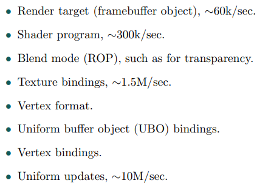

# Chapter 18——Pipeline Optimization

过早的优化是万恶之源

瓶颈检测和优化是重点。从进行**小的、局部的更改**开始，到将应用程序作为一个整体来构建，以利用多处理能力的技术结束。

管道优化是一个过程，我们首先最大化渲染速度，然后允许**没有瓶颈的阶段**，消耗像瓶颈一样多的时间。也就是说，这并不总是一个简单的过程，因为gpu和驱动程序可以有自己的特性和快速路径。读这一章的时候，记住：

KNOW YOUR ARCHITECTURE

## 1. Profiling and Debugging Tools

==分析和调试工具==在发现代码中的性能问题时非常有价值。功能各不相同，可以包括：

- **帧捕捉和可视化**。通常可以使用分步帧重播，显示所使用的状态和资源。
- 分析花费在**CPU**和**GPU**上的时间，包括调用图形**API**的时间。
- **着色器调试**，并可以热编辑，以看到改变的代码的效果。
- 使用在应用程序中设置的**调试标记**，以帮助识别代码区域

==分析和调试工具==因操作系统、图形API和GPU供应商而异。大多数组合都有相应的工具，这就是==**上帝创造谷歌**==的原因。也就是说，我们会提到一些专门用于交互式图形的**包名**，让你开始你的任务：

- ==RenderDoc==是一个高质量的Windows调试器，用于DirectX, OpenGL和Vulkan，最初由Crytek开发，现在开源。:star:
- ==GPU PerfStudio==是AMD为其图形硬件提供的工具套件，适用于Windows和Linux。值得注意的工具是一个==静态着色分析器==，它可以在不运行应用程序的情况下进行性能评估。AMD的Radeon GPU Profiler是一个单独的相关工具。
- ==NVIDIA Nsight==是一个具有广泛功能的性能和调试系统。它集成了Windows上的Visual Studio和Mac OS和Linux上的Eclipse。
- 微软的**GPUView**使用了Windows事件跟踪(ETW)，这是一种高效的事件记录系统。GPUView是ETW会话的消费者程序之一。重点讨论了CPU和GPU之间的交互问题，指出了其中的瓶颈所在。
- ==图形性能分析器==(**GPA**)是英特尔的一个套件，不是专门针对他们的图形芯片，它专注于性能和帧分析。

## 2. Locating the Bottleneck

优化管道的第一步是找到**最大的瓶颈** [**1679**]。找到瓶颈的一种方法是：设置几个测试，每个测试减少特定阶段执行的工作量。如果其中一个测试导致每秒帧数增加，则发现瓶颈阶段。

###  2.1 Testing the Application Stage

如果为使用的平台提供了一个**实用程序**，来测量处理器上的工作负载，那么可以使用该实用程序来查看您的程序是否使用了100%(或接近100%)的CPU处理能力。

测试==CPU限制==的一个更聪明的方法是：发送导致GPU很少工作或不工作的数据。对于一些系统，这可以通过简单地使用一个空驱动来完成。通过做这个测试，可以了解到对于**不在应用程序阶段运行的**、基于gpu的阶段有多大的改进空间。**驱动程序**通常是CPU端瓶颈的原因，我们将在后面深入讨论这个话题。

### 2.2 Testing the Geometry Processing Stage

==几何阶段是最难测试的阶段==。这是因为如果这个阶段的**工作负载**发生了变化，那么其他阶段中的一个或两个工作负载也经常发生变化。为了避免这一问题，Cebenoyan [**240**]给出了一系列从==光栅化阶段==反向运行的测试。

在几何阶段有**两**个主要的领域会出现瓶颈：==顶点获取和处理==。要查看瓶颈是否由对象数据传输引起，可以增加顶点格式的大小。这可以通过每个顶点发送几个额外的纹理坐标来实现。如果性能下降，这个区域就是瓶颈。

### 2.3 Testing the Rasterization Stage

要找出**栅格化**是否真的是瓶颈，可以增加顶点和像素着色器的执行时间（通过增加他们的程序大小）。如果每帧渲染时间没有增加，那么瓶颈就在栅格化阶段。

### 2.4 Testing the Pixel Processing Stage

**像素着色程序**的效果可以通过改变**屏幕分辨率**来测试。如果较低的屏幕分辨率导致帧率明显上升，**像素着色器**可能是瓶颈。更小的屏幕也可能简化显示的模型，减少几何图形阶段的负载。

### 2.5 Testing the Merging Stage

在这一阶段，将进行深度和模板测试、混合，并将幸存的结果写入缓冲区。改变这些**缓冲区的输出位深度**是改变这一阶段**带宽成本**的一种方法，看看它是否会成为瓶颈。为不透明的对象打开**alpha混合**或使用其他**混合模式**也会影响内存访问和栅格操作执行的处理量。

## 3. Performance Measurements

为了优化，我们需要衡量。这里我们讨论**GPU速度**的不同==度量==。**GPU计数器**和**线程跟踪**，如果可用，是重要的诊断工具。如果已知某些给定部分的**峰值性能**，且**计数较低**，则该区域不太可能成为瓶颈。一些供应商将**计数器数据**作为每个阶段的利用率百分比。这些值是在瓶颈可以移动的给定时间段内得出的，因此不是完美的，但对发现瓶颈有很大帮助。

具体见书 P 789~790。

## 4. Optimization

### 4.1 Application Stage

**应用程序阶段**通过使代码更快，或程序的内存访问更快或更少进行优化。

对于代码优化，首先要确定时间主要花费的地方，一个好的**代码分析器**对于发现这些**代码热点**至关重要，而这些热点是花费大量时间的地方。程序中的这些位置通常是**内部循环**，每一帧都要执行多次的代码片段。

第一步是试验编译器的优化标志。通常有许多不同的标志可以尝试。如果可能的话，尝试不同的编译器，因为这些编译器的优化方式不同，有些编译器的优化方式明显更优。

#### Memory Issues

过去，==算术指令的数量==是衡量算法效率的关键指标；现在关键是==内存访问==。在现代的图形处理器上，重要的是**数据传输的距离**。许多快速算法的工作是尽可能地在本地（并且尽可能少地）访问数据。

在分析器中很难直接检测到**坏的内存访问模式**。好的模式需要从一开始就融入到设计中。下面是编程时，应该考虑的指针列表：

- 代码中**按顺序访问的数据**也应该**按顺序存储**在内存中。例如，当渲染一个三角形网格时，存储纹理坐标#0、normal #0、color #0、vertex #0、texture坐标#1和normal #1，如果它们是按这个顺序访问的话，就依次存储在内存中。
- 避免指针间接、跳转和函数调用，因为这些可能会显著降低CPU性能。
- 将经常使用的**数据结构**调整到==缓存线==大小的倍数可以显著提高整体性能。例如，64字节高速缓存线在Intel和AMD处理器上很常见 [**1206**]。
- 尝试不同的数据结构组织。
- 通常更好的做法是：在启动时，为相同大小的对象分配一个大型**内存池**，然后使用自己的分配和自由例程，来处理该池的内存 [**113,736**]。

### 4.2 API Calls

理解**对象缓冲区**的分配和存储是**有效渲染**的基础 [**1679**]。对于带有CPU和单独的GPU的桌面系统，它们通常都有自己的内存。**图形驱动程序**通常控制对象驻留的位置，但它可以给出在哪里最好存储它们的**提示**。一种常见的分类是**静态缓冲区**和**动态缓冲区**。如果缓冲区的数据是改变每一帧，使用动态缓冲区；在正确的资源池中分配资源也很重要。

如果一个对象没有变形，或者变形可以完全通过**着色程序**执行，那么将对象的数据存储在**GPU内存**中是有益的。该对象的不变特性可以通过将其存储为静态缓冲区来表示。通过这种方式，它不必为每一帧渲染而跨总线发送，从而避免了管道的这一阶段的任何瓶颈。**GPU内部内存带宽**通常远高于CPU与GPU之间的总线带宽。

#### State Changes

调用API有几个相关的开销。在应用程序方面，**更多的调用**意味着花费更多的应用程序时间，而不管调用实际做什么。这里，我们将深入优化一个常见的图形操作，==准备管道绘制网格==。这个操作可能涉及到改变状态，例如，设置着色器和`Uniform`，附加纹理，改变的混合状态或使用的颜色缓冲，等等。

应用程序**提高性能**的一个主要方法是：将具有类似呈现状态的对象分组，从而最小化状态更改。因为GPU是一个极其复杂的状态机，也许是计算机科学中最复杂的状态机，==改变状态的代价是昂贵的==。虽然有一小部分开销可能涉及到GPU，但大部分开销来自于CPU上的驱动程序的执行。如果GPU能很好地映射到API上，那么状态改变的代价往往是可预测的。**状态更改成本主要在CPU端，在驱动程序中**。

一个具体的例子是：==PowerVR==架构如何支持混合。在旧的API中，混合是使用固定的**接口函数类型**来指定的。PowerVR的混合是可编程的，这意味着他们的驱动程序必须将当前的混合状态修补到像素着色器[**699**]。

Everitt和McDonald [**451**]注意到不同类型的==状态变化==在成本上有很大差异：

一个**更昂贵的改变**是：在GPU的渲染模式和它的计算着色模式之间切换 [**1971**]。避免状态改变可以通过对要显示的对象进行排序来实现，先按着色器分组，然后按使用的纹理，等等。按状态排序有时称为==批处理==。

另一种策略是：==重组对象数据==，以便出现更多的共享。减少**纹理绑定变化**的常用方法是：将几个纹理图像放入一个大的纹理中，或者更好的是放入一个**纹理数组**中。如果API支持它，无绑定纹理是另一个避免状态改变的选项(章节6.2.5)。与更新==Uniform==相比，改变着色器程序通常是相对昂贵的，所以在一类材料内的变化可以用一个使用if语句的单一着色器更好地表示。你也可以通过共享着色器[**1609**]来制作更大的`batch`。然而，让着色器更复杂也会降低GPU的性能。

#### Consolidating and Instancing