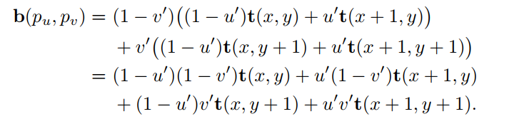

# Chapter 6——Texturing

In computer graphics，texturing is a process that takes a surface and modifies its appearance at each location using some image， function,，or other data source.。本章主要讨论纹理对于物体表面的影响，对于程序化纹理介绍较少。

## 1. The Texturing Pipeline

图像纹理中的像素通常称为`texel`，以区别于屏幕上的像素`pixels`。Texturing可以通过广义的纹理管道进行描述。

空间位置是Texturing process的起点，当然这里的空间位置更多指的是模型坐标系。这一点在空间中，进行投影获得一组数字，称为纹理坐标，将用于访问纹理，这个过程叫做`Texture  Mapping`，有时纹理图像本身被称为纹理贴图`texture map  `，虽然这不是严格正确的。

在使用这些新值访问纹理之前，可以使用一个或多个相应的函数来转换纹理坐标到纹理空间。这些纹理空间位置用于从纹理中获取值，例如，它们可能是图像纹理中检索像素的数组索引。管道复杂的原因是，每一步都为用户提供了一个有用的控件，但并非所有步骤都需要在任何时候都被激活

###  1.1 The Projector Function

==Texture Process中的第一步就是得到物体表面的位置然后将它投影到UV纹理坐标空间==。转化过程中需要`Projector function`，常用的包括：spherical，cylindrical，planar projections   

==纹理坐标也可以从各种不同的参数中生成==，比如视图方向、表面温度或任何可以想象的东西。投影函数的目标是生成纹理坐标。把它们作为位置的函数来推导只是一种方法。

非交互式渲染器通常将这些投影函数当作渲染过程本身的一部分。一个投影函数可能足以满足整个模型的需要，但通常艺术家必须使用工具来细分模型，并分别应用各种投影函数。

在实时工作中，投影函数通常应用于建模阶段，结果也将存储在模型顶点中。但有时也会在顶点或片元着色器中进行应用，这样做可以提高精度，并有助于启用各种效果，包括动画——一些实时算法，例如`environment mapping  `有自己的专门的投影函数。

由于投影方向上的边缘表面有严重的变形，艺术家通常必须手动将模型分解成近平面的碎片。还有一些工具可以通过展开网格来帮助最小化失真，或者创建一组近乎最优的平面投影，或者其他帮助这个过程的工具。我们的目标是让每个多边形在纹理区域中占有更公平的份额，同时保持尽可能多的网格连通性。==连接性是很重要的，因为采样错误会出现在纹理的不同部分相遇的边缘上==。

> This unwrapping process is one facet of a larger field of study, mesh parameterization  。。。具体见书P173

==纹理坐标空间有时候也可以是三维的==，表现为$(u,v,w)$，w是沿着投影方向的深度；也有表现为$(u,v,r,q)$，q作为齐次坐标中的第四个值，它就像一个电影或幻灯片放映机，随着距离的增加，投影纹理的大小也会增加——例如，在舞台或其他表面上投射一个装饰性的聚光灯图案(称为gobo)就很有用。

纹理坐标空间的另外一个主要类型就是==directional==——空间中的每一个点都被一个输入方向所控制。想象这样一个空间的一种方法是：在一个单位球体上的点，每个点的法线表示用于在那个位置访问纹理的方向。代表：`cube map`

==一维纹理==也是有用的：地形建模中通过海拔访问颜色值（绿到白）；雨点的渲染等。

###  1.2 The Corresponder Function

对应函数（Corresponder Function ）将纹理坐标（texture coordinates  ）转化为纹理空间位置（texture-space locations  ），对应函数的一个示例是：使用API选择用于显示的现有纹理的一部分，在后续操作中只使用此子映像。

另外一种类型的对应函数是==矩阵变换==，包括：移动，旋转，缩放，交错等。奇特的是，==纹理的变换顺序必须和我们实际期待的相反==。

==另一类对应函数控制应用图像的方式==。我们知道，当(u, v)在[0,1]范围内时，图像将出现在曲面上。但是在这个范围之外会发生什么呢？对应函数决定了这种行为。在OpenGL中，这种类型的对应函数称为“Wrapping mode”；在DirectX，它被称为“纹理寻址模式”。这类常见的函数有:

- wrap (DirectX), repeat (OpenGL), or tile ：图像在表面重复;算法上，纹理坐标的整数部分被删除。这个功能对于一个材料的图像重复覆盖一个表面非常有用，并且通常是默认的。

- mirror：也是重复，但是每次重新开始之前，会进行翻转。

- clamp (DirectX) or clamp to edge (OpenGL)  ：图像纹理边缘的重复。

- border (DirectX) or clamp to border (OpenGL)  ：自定义纯色。

  

tile模式形成的图像大部分是无法令人信服的，避免这种周期性问题的一个常见解决方案是将纹理值与另一个非平铺纹理相结合。另外一种是：implement specialized corresponder functions that randomly recombine texture patterns or tiles  。

### 1.3 Texture Values

图像纹理构成了实时工作中纹理使用的绝大部分，但是程序纹理也可以使用。在程序纹理的情况下，从纹理空间位置获得纹理值的过程不涉及内存查找，而是计算一个函数。

## 2. Image Texturing

在本章的其余部分，图像纹理将被简单地称为纹理。此外，当我们在这里引用一个像素的单元格时，我们指的是围绕该像素的屏幕网格单元格。在本节中，我们特别关注==快速采样和过滤纹理图像的方法==。纹理也会有采样问题，但是它们发生在被渲染的三角形内部。

像素着色器通过将纹理坐标值传递给调用(如texture2D)来访问纹理，不同API中的纹理坐标系统有两个主要区别。DirectX中左上角是（0，0），右下角是（1.1）；OpenGL中，左下角是（0，0），右上角是（1，1）。texel有整数坐标，但我们经常希望访问texel之间的位置并在它们之间混合——这就产生了一个问题，即一个像素中心的浮点坐标是什么。之前的DX版本有将（0，0）置为像素中心，而现在统一为（0.5，0.5）。

==dependent texture read== ：这是个值得解释的问题，有两个解释。第一个适配的是移动设备，当通过texture2D或类似方式访问纹理时，当像素着色器计算纹理坐标而不是使用从顶点着色器传入的未经修改的纹理坐标时，依赖纹理读取就会发生。当着色器没有依赖纹理读取时，运行效率更高，因为texel数据可以被预取。这个术语的另一个较早的定义对于早期的桌面gpu尤其重要。在这种情况下，当一个纹理的坐标依赖于前一个纹理的值时，就会发生依赖纹理读取。例如，一个纹理可能会改变阴影法线，这反过来会改变用于访问立方体映射的坐标。现在，这类读取可能会对性能产生影响，具体取决于批量计算的像素数以及其他因素。

在GPU中使用的纹理的分辨率一般是$2^m\times 2^n$，被称作 power-of-two（POT）textures。现代GPU也能处理NPOT。

本章讨论的图像采样和滤波方法应用于从每个纹理读取的值。这里的区别是过滤渲染方程的输入，还是过滤它的输出。本来，对于颜色来说，渲染方程一般是线性的，所以filter的位置无所谓，但是对于其它存储在纹理中的数据，如法线，对于最后输出而言是非线性的关系，标准的纹理过滤会导致锯齿。

### 2.1 Magnification

对于纹理放大==最常见的过滤技术==是`nearest neighbor`（实际上是Box Filter）和`bilinear interpolation`（双线性插值）。还有`cubic convolution  `立方卷积，它使用一个4×4或5×5的texels数组的加权和，得到更高的放大质量。虽然本地硬件对立方卷积，也称为`bicubic interpolation  `，的支持目前还不普遍，但它可以在一个着色程序中执行。

使用==最近邻法==这种放大技术的一个特点是，单个的texels可以变得明显。这种效果被称为==像素化==，因为该方法在放大时取每个像素中心最近的texel值，从而导致块状外观。虽然这种方法的质量有时很差，但它只需要取 1Texel/pixel。（下左图）

对于==双线性插值法==：对于每个像素，这种滤波方法找到四个相邻的纹理，并在二维上进行线性插值，从而找到像素的混合值。结果更加模糊了，使用最近邻方法产生的锯齿也消失了。（上中图）任何位置(u′，v′)的双线插值颜色可以通过两步计算：首先，通过u计算两行的插值；最后通过v进行两个计算值的进一步插值。

> Note the symmetry: The upper right’s influence is equal to the area of the rectangle formed by the lower left corner and the sample point. Returning to our example, this means that the value retrieved from this texel will be multiplied by 0.42 × 0.74, specifically 0.3108. Clockwise from this texel the other multipliers are 0.42 × 0.26, 0.58 × 0.26, and 0.58 × 0.74, all four of these weights summing to 1.0.  

 `detail textures`是解决放大导致的模糊的一个常见方法：细节纹理的高频重复图案，结合低频放大的纹理，视觉效果类似于单一高分辨率纹理的使用。

`bicubic filter`相对来说是昂贵的，但使用简单的光滑曲线在$2\times 2$`texels`上进行插值是一个好的方法，两种常见的曲线如下：

$$
s(x)=x^2(3-2x)\quad and\quad q(x)=x^3(6x^2-15x+10)
$$
当然，这些函数也可以用在其它需要光滑插值的场景中（事实上，我们不是在ShaderToy和IQ大神的博客中见识了吗），这两个函数明显在0和1处的导数值为0，而后者更是在二次导数处也为0。方法缺点具体见书P181

### 2.2 Minification

这种情况下，一个像素可能包含多个`texels`，但精确决定每个`texels`对像素的影响是困难的，特别是在实时情况下。在GPU上有以下一些解决方法：

- `nearest neighbor`：方法同上，如图在地平线上，错误`artifacts`会出现，因为许多影响像素的texels中只有一个被选择来代表表面。观察者移动时，这种错误更为明显，是`temporal aliasing`的一种表现形式。

- `billnear interpolation`：方法同上，效果仅仅比上一种好一点，特备是当决定像素的`texels`的数量超过四个的情况下。

更好的方法也是有的，正如上一章所言：解决锯齿的方法主要是采样和过滤技术的优化。纹理的信号频率取决于它的纹理在屏幕上的距离有多近。在奈奎斯特极限下，我们需要确保==纹理的信号频率不大于采样频率的一半==。为了达到这个目标，==采样频率必须增加或者纹理频率必须降低==，，之前的算法都是增加采样频率，但这个是有极限的，所以我们在后者想办法。

> 此时，就是纹理的信号频率远远超过了采样频率，例如：我们在那个像素的位置，有几十个`texels`，但只采样不到10次

**==Mipmapping==**  

纹理抗锯齿最流行的方法就是`mipmapping`，`Mip`代表着multum in parvo （小中见大），拉丁语的意思是——`many things in a small place  `，TM是个好名字，充分体现了——`original texture is filtered down repeatedly into smaller images  `

当使用这个过滤器时，在实际渲染之前，原始纹理产生一组更小的纹理扩展

原始纹理（0级）被向下采样到原始区域的四分之一，每个新texel值通常计算为原始纹理中四个相邻纹理的平均值。一级结构有时被称为subtexture。递归地执行缩减，直到纹理的一个或两个维度等于一个texel。这个纹理族也被称为`mipmao chain`。

高质量MipMap技术的两个关键点是==好的过滤器和伽马校正==。对于过滤器，这里使用的最差的Box（模糊不重要的低频部分，而忽略导致错误的高频），最好是使用`Gaussian, Lanczos, Kaiser  `等过滤器。

> 如前所述，一些纹理与最终的阴影颜色有基本的非线性关系。虽然这通常会给过滤带来问题，但是mipmap生成对这个问题特别敏感，因为要过滤成百上千个像素。为了获得最佳结果，通常需要专门的mipmap生成方法。Such methods are detailed in Section 9.13.  

这里有==两种常见的方法来计算==`d`（OpenGL中称为$\lambda$，也被称为`texture level of detail`），一种是利用像素单元所形成的四边形的较长边缘来近似像素的覆盖范围；another is to use as a measure the largest absolute value of the four differentials   ∂u/∂x, ∂v/∂x,∂u/∂y, and ∂v/∂y  。每个微分都是计算纹理坐标和屏幕轴差异量的工具。例如：For example, ∂u/∂x is the amount of change in the u texture value along the x-screen-axis for one pixel.  （具体可见书P186）

==计算坐标d的目的==是为了确定沿着mipmap的金字塔轴向何处采样。目标是pixel：texel的比率至少为1:1，以实现奈奎斯特率。像素包含越多的`texel`，d越大，使用更小更加模糊的纹理。d是一个浮点数，小数部分用于上下两个纹理的线性插值。这整个过程称为==三线性插值==，按像素执行。

==一个用户控制d值的技术==叫做`level of detail bias (LOD bias)`。这个值加在d 上去影响采样，越大，最终结果越模糊。在像素着色器中，可以为纹理作为一个整体指定偏差，也可以为每个像素指定偏差。为了进行更精细的控制，用户可以提供用于计算它的d坐标或导数。

本技术的一个主要缺点是`overblurring`：设想一个像素单元，它在u方向覆盖大量的texel，而在v方向只覆盖少量的texel。这种情况通常发生在观察者沿着一个纹理表面边缘上看。事实上，可能需要沿着纹理的一个轴进行缩小，而沿着另一个轴进行放大。对mipmap的访问效果是检索到纹理上的正方形区域；恢复矩形区域是不可能的——==为了避免锯齿，我们选择纹理上像素单元的近似覆盖率的最大尺度==。这导致检索样本往往是相对模糊的。

> mipmap图像中看到：向远处移动的线在右边显示过度模糊。

**==Summed-Area Table==**  

一种避免过度模糊的方法是总结区表（summed-area table 、SAT ）。首先，创建一个大小等于纹理的数组，但是包含更大的颜色存储位（16位以上来存储红、黄或蓝）。在这个数组的每一个位置，必须计算并存储这个位置和texel(0，0)(原点)所形成的矩形中所有相应纹理的texels之和。在纹理映射过程中，像素单元在纹理上的投影被一个矩形所约束，然后访问求和面积表来确定这个矩形的平均颜色，并将其作为纹理的颜色传回。

x和y是矩形的texel坐标，s[x, y]是该texel的`summed-area value`，上诉公式的分子是求图中蓝色正方形的`texels`值的SUM，然后除以分母的矩形面积，不久求得平均`texel`值了吗，其实，这个表的思路是很简单的。

就效果而言，右边棋盘的边界没那么模糊了，但是中间线条交叉的区域依然是模糊的。原因是，当沿对角线查看纹理时，会生成一个大的矩形，而许多纹理根本不在被计算的像素附近。（个人理解：就是蓝色矩阵比红色矩阵大太多了）。

SAT是`anisotropic filtering  `算法的==一个例子==，这种算法检索非正方形区域上的texel值。可以在现代gpu上实现面积表，它以合理的总体内存成本提供更高的质量。Hensley等人提供了一个有效的实现方法，并展示了求和面积取样是如何提高了光滑的反射。其他使用区域取样的算法，如景深、阴影图和模糊反射，都可以通过SAT进行改进。

==**Unconstrained Anisotropic Filtering**==  

对于如今的图形硬件，提高纹理过滤最常用的方法是重用Mipmap硬件。其基本思想是像素单元向后投影，然后对纹理上的四边形(四边形)进行多次采样，然后将样本组合在一起。该算法不是使用单个mipmap样本来近似这个四边形的覆盖范围，而是使用几个正方形来覆盖这个四边形。==和常规的Mipmap不同，这里使用最短的边来决定d==，这当然会导致更小的模糊（但是，我们不只采样一个mipmap，而是多个）。用四边形的较长边建立一条平行于较长边的异性线，并通过中间的四边形。当各向异性量在1:1 ~ 2:1之间时，沿该线取2个样品。==在越高的各向异性比率下，沿轴方向取的样品越多。==

该方案允许各向异性线向任意方向运行，因此不受面积求和表的限制。它也不需要比mipmaps更多的纹理内存，因为它使用mipmap算法来进行采样。

> 接近高质量的软件采样算法，如椭圆加权平均(EWA)过滤器，它将像素的影响区域转换为纹理上的椭圆，并通过一个过滤器核来权重椭圆内的纹理

### 2.3 Volume Textures  

Image texture的直接扩展是三维图形纹理，定义为$(u,v,w)or(s,t,r)$。大多数GPU支持体积纹理的Mipmap，采样它需要三次插值，那么在MipMap之间则需要四次插值。

体积纹理的优点：可以跳过为三维网格寻找一个好的二维参数的复杂过程，因为三维位置可以直接用作纹理坐标。体块纹理也可以用来表示木材或大理石等材料的体块结构——具有这种纹理的模型看起来就像是由这种材料雕刻而成的。

Benson和Davis[133]和DeBry等人讨论了以==稀疏八叉树结构==存储纹理数据。这个方案非常适合交互式三维绘制系统，因为表面在创建时不需要明确的纹理坐标，并且八叉树可以将纹理细节保留到任何想要的层次。

### 2.4 Cube Maps

纹理的另外一种类型是`cube texture`或者说`cube map`，有六个二维纹理，每一个对应正方体的一个面。立方体贴图是用一个三分量的纹理坐标向量来访问的，这个坐标向量指定了一条从立方体中心向外的射线的方向。以最大数量级的纹理坐标选择对应的face——the vector (-3.2, 5.1, -8.4) selects the -z face。其余两个坐标除以最大坐标绝对值，即8.4。它们的范围现在从- 1到1，并简单地重新映射到[0,1]，以计算纹理坐标。==最常用于环境映射==

### 2.5 Texture Representation

为了能够为==GPU批处理尽可能多的工作==，==通常倾向于尽可能少地改变状态==。为了达到这个目的，可以把几个图像放在一个更大的纹理中，称为纹理图集`texture atlas`。

对于==纹理图集的研究和优化==详见书P191第一段，有大量链接文献。使用图集的一个困难是重复和镜像模式，这将不会正确地影响一个子贴图，而只是影响整个贴图。另一个问题是在为图集生成mipmap时，一个子贴图可能会渗入到另一个子贴图中。然而，==在将每个子贴图放入大型纹理图集之前，单独生成每个子贴图的mipmap层次结构，并对子贴图使用2的幂级分辨率==，就可以避免这个问题

一个更简单的方法是使用`texture arrays`，可见上图右侧。通过索引访问每个图片，另外，数组中的各个图片应该有着一样的属性：dimensions, format, mipmap hierarchy, and MSAA settings  

另外一个避免状态改变的功能是`bindless textures`。如果没有无绑定纹理，纹理将使用API绑定到特定的纹理单元。一个问题是纹理单元数量的上限，这使得程序员的问题变得复杂。对于无绑定纹理，==纹理的数量没有上限==，因为每个纹理都由一个64位指针(有时称为句柄)关联到它的数据结构。这些句柄可以通过许多不同的方式访问，例如，通过常量，通过变量，从其他纹理，或从一个着色器存储缓冲对象(SSBO)。应用程序需要确保纹理驻留在GPU端。无绑定纹理避免了驱动程序中任何类型的绑定成本，这使得渲染速度更快。

