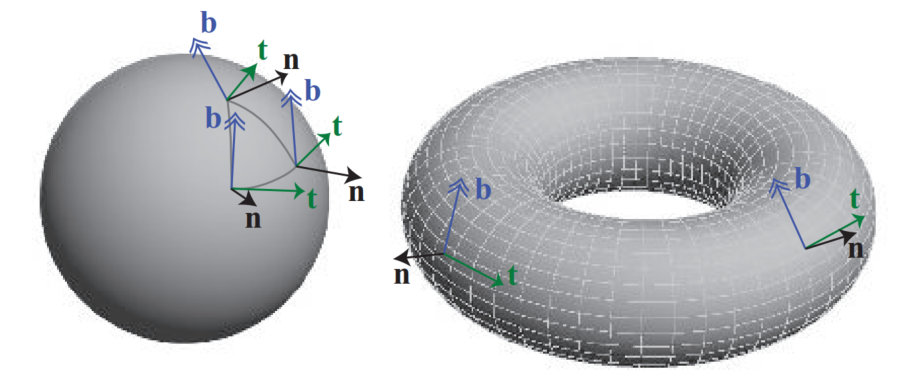
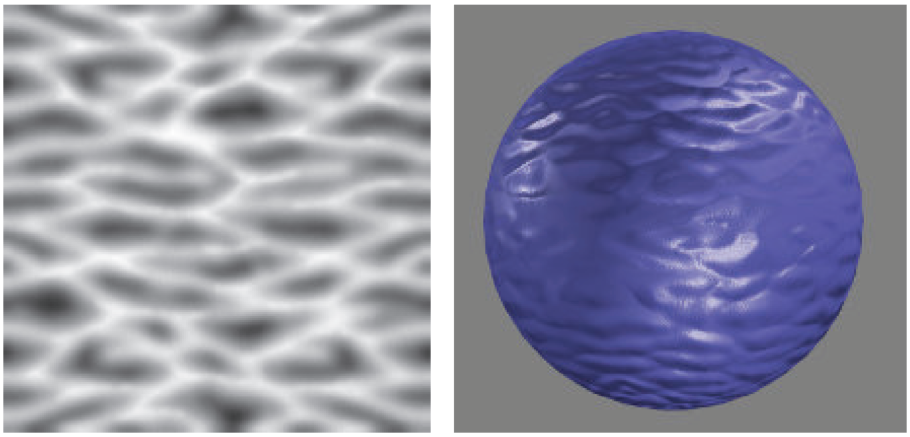
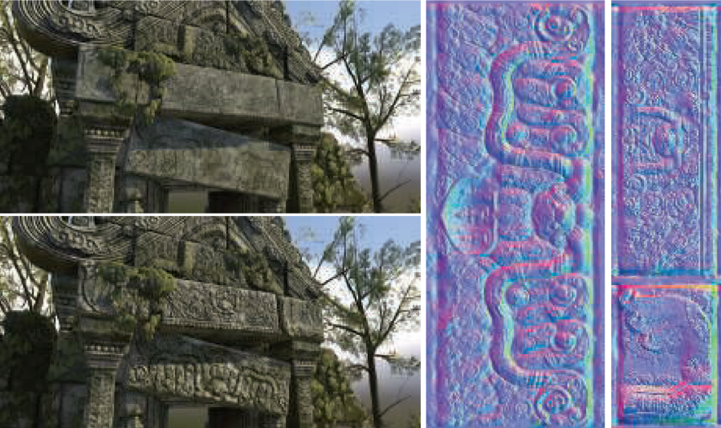
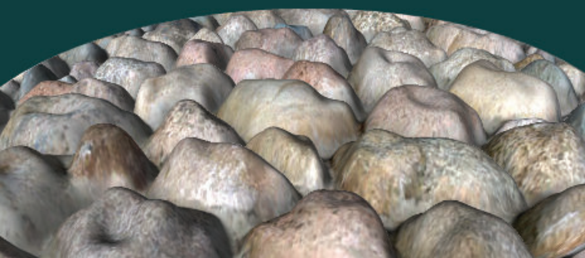

# Chapter 6——Texturing

In computer graphics，texturing is a process that takes a surface and modifies its appearance at each location using some image， function,，or other data source.。本章主要讨论纹理对于物体表面的影响，对于程序化纹理介绍较少。


## 1. The Texturing Pipeline

图像纹理中的像素通常称为`texel`，以区别于屏幕上的像素`pixels`。Texturing可以通过广义的纹理管道进行描述。

空间位置是Texturing process的起点，当然这里的空间位置更多指的是模型坐标系。这一点在空间中，进行投影获得一组数字，称为纹理坐标，将用于访问纹理，这个过程叫做`Texture  Mapping`，有时纹理图像本身被称为纹理贴图`texture map  `，虽然这不是严格正确的。

在使用这些新值访问纹理之前，可以使用一个或多个相应的函数来转换纹理坐标到纹理空间。这些纹理空间位置用于从纹理中获取值，例如，它们可能是图像纹理中检索像素的数组索引。管道复杂的原因是，每一步都为用户提供了一个有用的控件，但并非所有步骤都需要在任何时候被激活


###  1.1 The Projector Function

==Texture Process中的第一步就是得到物体表面的位置，然后将它投影到UV纹理坐标空间==。转化过程中需要`Projector function`，常用的包括：spherical，cylindrical，planar projections   


==纹理坐标也可以从各种不同的参数中生成==，比如视图方向、表面温度或任何可以想象的东西。投影函数的目标是生成纹理坐标。把它们作为位置的函数来推导只是一种方法。

非交互式渲染器通常将这些投影函数当作渲染过程本身的一部分。一个投影函数可能足以满足整个模型的需要，但通常艺术家必须使用工具来细分模型，并分别应用各种投影函数。

在实时工作中，==投影函数通常应用于建模阶段==，结果也将存储在模型顶点中。但有时也会在顶点或片元着色器中进行应用，这样做可以提高精度，并有助于启用各种效果，包括动画——一些实时算法，例如`environment mapping  `有自己的专门的投影函数。

由于投影方向上的边缘表面有严重的变形，艺术家通常必须手动将模型分解成近平面的碎片。还有一些工具可以通过展开网格来帮助最小化失真，或者创建一组近乎最优的平面投影，或者其他帮助这个过程的工具。我们的目标是让每个多边形在纹理区域中占有更公平的份额，同时保持尽可能多的网格连通性。==连接性是很重要的，因为采样错误会出现在纹理的不同部分相遇的边缘上==。

> This unwrapping process is one facet of a larger field of study, mesh parameterization  。。。具体见书P173

==纹理坐标空间有时候也可以是三维的==，表现为$(u,v,w)$，w是沿着投影方向的深度；也有表现为$(u,v,r,q)$，q作为齐次坐标中的第四个值，它就像一个电影或幻灯片放映机——随着距离的增加，投影纹理的大小也会增加——例如，在舞台或其他表面上投射一个装饰性的聚光灯图案(称为gobo)就很有用。

纹理坐标空间的另外一个主要类型就是==directional==——空间中的每一个点都被一个输入方向所控制。想象这样一个空间的一种方法是：在一个单位球体上的点，每个点的法线表示用于在那个位置访问纹理的方向。代表：`cube map`

==一维纹理==也是有用的：地形建模中通过海拔访问颜色值（绿到白）；雨点的渲染等。


###  1.2 The Corresponder Function

对应函数（Corresponder Function ）将纹理坐标（texture coordinates  ）转化为纹理空间位置（texture-space locations  ），对应函数的一个示例是：使用API选择用于显示的现有纹理的一部分，在后续操作中只使用此子映像。

一种类型的对应函数是==矩阵变换==，包括：移动，旋转，缩放，交错等。奇特的是，==纹理的变换顺序必须和我们实际期待的相反==。

==另一类对应函数，控制图像的应用方式==。我们知道，当(u, v)在[0,1]范围内时，图像将出现在曲面上。但是在这个范围之外会发生什么呢？对应函数决定了这种行为。在OpenGL中，这种类型的对应函数称为“Wrapping mode”；在DirectX，它被称为“纹理寻址模式”。这类常见的函数有:

- wrap (DirectX), repeat (OpenGL), or tile ：图像在表面重复;算法上，纹理坐标的整数部分被删除。这个功能对于一个材料的图像重复覆盖一个表面非常有用，并且通常是默认的。

- mirror：也是重复，但是每次重新开始之前，会进行翻转。

- clamp (DirectX) or clamp to edge (OpenGL)  ：图像纹理边缘的重复。

- border (DirectX) or clamp to border (OpenGL)  ：自定义纯色。

  

tile模式形成的图像大部分是无法令人信服的，避免这种周期性问题的一个常见解决方案是将纹理值与另一个非平铺纹理相结合。另外一种是：implement specialized corresponder functions that randomly recombine texture patterns or tiles  。


### 1.3 Texture Values

图像纹理构成了实时工作中纹理使用的绝大部分，但是程序纹理也可以使用。在程序纹理的情况下，从纹理空间位置获得纹理值的过程，不涉及内存查找，而是计算一个函数。


## 2. Image Texturing

在本章的其余部分，图像纹理将被简单地称为纹理。此外，当我们在这里引用一个像素的单元格时，我们指的是围绕该像素的屏幕网格单元格。在本节中，我们特别关注==快速采样和过滤纹理图像的方法==。纹理也会有采样问题，但是它们发生在被渲染的三角形内部。

像素着色器通过将纹理坐标值传递给调用(如texture2D)来访问纹理，不同API中的纹理坐标系统有两个主要区别。DirectX中左上角是（0，0），右下角是（1.1）；OpenGL中，左下角是（0，0），右上角是（1，1）。texel有整数坐标，但我们经常希望访问texel之间的位置并在它们之间混合——这就产生了一个问题，即一个像素中心的浮点坐标是什么。之前的DX版本有将（0，0）置为像素中心，而现在统一为（0.5，0.5）。

==dependent texture read== ：这是个值得解释的问题，有两个解释。第一个适配的是移动设备，当通过texture2D或类似方式访问纹理时，当像素着色器计算纹理坐标而不是使用从顶点着色器传入的未经修改的纹理坐标时，依赖纹理读取就会发生。当着色器没有依赖纹理读取时，运行效率更高，因为texel数据可以被预取。这个术语的另一个较早的定义对于早期的桌面gpu尤其重要。在这种情况下，当一个纹理的坐标依赖于前一个纹理的值时，就会发生依赖纹理读取。例如，一个纹理可能会改变阴影法线，这反过来会改变用于访问立方体映射的坐标。现在，这类读取可能会对性能产生影响，具体取决于批量计算的像素数以及其他因素。

在GPU中使用的纹理的分辨率一般是$2^m\times 2^n$，被称作 power-of-two（POT）textures。现代GPU也能处理NPOT。

本章讨论的图像采样和滤波方法应用于从每个纹理读取的值。这里的区别是过滤渲染方程的输入，还是过滤它的输出。本来，对于颜色来说，渲染方程一般是线性的，所以filter的位置无所谓，但是对于其它存储在纹理中的数据，如法线，对于最后输出而言是非线性的关系，标准的纹理过滤会导致锯齿。


### 2.1 Magnification

对于纹理放大==最常见的过滤技术==是`nearest neighbor`（实际上是Box Filter）和`bilinear interpolation`（双线性插值）。还有`cubic convolution  `立方卷积，它使用一个4×4或5×5的texels数组的加权和，得到更高的放大质量。虽然本地硬件对立方卷积，也称为`bicubic interpolation  `，的支持目前还不普遍，但它可以在一个着色程序中执行。

使用==最近邻法==这种放大技术的一个特点是，单个的texels可以变得明显。这种效果被称为==像素化==，因为该方法在放大时取每个像素中心最近的texel值，从而导致块状外观。虽然这种方法的质量有时很差，但它只需要取 1Texel/pixel。（下左图）


对于==双线性插值法==：对于每个像素，这种滤波方法找到四个相邻的纹理，并在二维上进行线性插值，从而找到像素的混合值。结果更加模糊了，使用最近邻方法产生的锯齿也消失了。（上中图）任何位置(u′，v′)的双线插值颜色可以通过两步计算：首先，通过u计算两行的插值；最后通过v进行两个计算值的进一步插值。


> Note the symmetry: The upper right’s influence is equal to the area of the rectangle formed by the lower left corner and the sample point. Returning to our example, this means that the value retrieved from this texel will be multiplied by 0.42 × 0.74, specifically 0.3108. Clockwise from this texel the other multipliers are 0.42 × 0.26, 0.58 × 0.26, and 0.58 × 0.74, all four of these weights summing to 1.0.  

 `detail textures`是解决放大导致的模糊的一个常见方法：细节纹理的高频重复图案，结合低频放大的纹理，视觉效果类似于单一高分辨率纹理的使用。

`bicubic filter`相对来说是昂贵的，但使用简单的光滑曲线在$2\times 2$`texels`上进行插值是一个好的方法，两种常见的曲线如下：


$$
s(x)=x^2(3-2x)\quad and\quad q(x)=x^3(6x^2-15x+10)
$$
当然，这些函数也可以用在其它需要光滑插值的场景中（事实上，我们不是在ShaderToy和IQ大神的博客中见识了吗），这两个函数明显在0和1处的导数值为0，而后者更是在二次导数处也为0。方法缺点具体见书P181


### 2.2 Minification


这种情况下，一个像素可能包含多个`texels`，但精确决定每个`texels`对像素的影响是困难的，特别是在实时情况下。在GPU上有以下一些解决方法：

- `nearest neighbor`：方法同上，如图在地平线上，错误`artifacts`会出现，因为许多影响像素的texels中只有一个被选择来代表表面。观察者移动时，这种错误更为明显，是`temporal aliasing`的一种表现形式。


- `billnear interpolation`：方法同上，效果仅仅比上一种好一点，特备是当决定像素的`texels`的数量超过四个的情况下。

更好的方法也是有的，正如上一章所言：解决锯齿的方法主要是采样和过滤技术的优化。纹理的信号频率取决于它的纹理在屏幕上的距离有多近。在奈奎斯特极限下，我们需要确保==纹理的信号频率不大于采样频率的一半==。为了达到这个目标，==采样频率必须增加或者纹理频率必须降低==，，之前的算法都是增加采样频率，但这个是有极限的，所以我们在后者想办法。

> 此时，就是纹理的信号频率远远超过了采样频率，例如：我们在那个像素的位置，有几十个`texels`，但只采样不到10次

**==Mipmapping==**  


纹理抗锯齿最流行的方法就是`mipmapping`，`Mip`代表着multum in parvo （小中见大），拉丁语的意思是——`many things in a small place  `，TM是个好名字，充分体现了——`original texture is filtered down repeatedly into smaller images  `

当使用这个过滤器时，在实际渲染之前，原始纹理产生一组更小的纹理扩展


原始纹理（0级）被向下采样到原始区域的四分之一，每个新texel值通常计算为原始纹理中四个相邻纹理的平均值。一级结构有时被称为subtexture。递归地执行缩减，直到纹理的一个或两个维度等于一个texel。这个纹理族也被称为`mipmao chain`。

高质量MipMap技术的两个关键点是==好的过滤器和伽马校正==。对于过滤器，这里使用的最差的Box（模糊不重要的低频部分，而忽略导致错误的高频），最好是使用`Gaussian, Lanczos, Kaiser  `等过滤器。

> 如前所述，一些纹理与最终的阴影颜色有基本的非线性关系。虽然这通常会给过滤带来问题，但是mipmap生成对这个问题特别敏感，因为要过滤成百上千个像素。为了获得最佳结果，通常需要专门的mipmap生成方法。Such methods are detailed in Section 9.13.  

这里有==两种常见的方法来计算==`d`（OpenGL中称为$\lambda$，也被称为`texture level of detail`），一种是利用像素单元所形成的四边形的较长边缘来近似像素的覆盖范围；another is to use as a measure the largest absolute value of the four differentials   ∂u/∂x, ∂v/∂x,∂u/∂y, and ∂v/∂y  。每个微分都是计算纹理坐标和屏幕轴差异量的工具。例如：For example, ∂u/∂x is the amount of change in the u texture value along the x-screen-axis for one pixel.  （具体可见书P186）

==计算坐标d的目的==是为了确定沿着mipmap的金字塔轴向何处采样。目标是pixel：texel的比率至少为1:1，以实现奈奎斯特率。像素包含越多的`texel`，d越大，使用更小更加模糊的纹理。d是一个浮点数，小数部分用于上下两个纹理的线性插值。这整个过程称为==三线性插值==，按像素执行。

==一个用户控制d值的技术==叫做`level of detail bias (LOD bias)`。这个值加在d 上去影响采样，越大，最终结果越模糊。在像素着色器中，可以为纹理作为一个整体指定偏差，也可以为每个像素指定偏差。为了进行更精细的控制，用户可以提供用于计算它的d坐标或导数。

本技术的一个主要缺点是`overblurring`：设想一个像素单元，它在u方向覆盖大量的texel，而在v方向只覆盖少量的texel。这种情况通常发生在观察者沿着一个纹理表面边缘上看。事实上，可能需要沿着纹理的一个轴进行缩小，而沿着另一个轴进行放大。对mipmap的访问效果是检索到纹理上的正方形区域；恢复矩形区域是不可能的——==为了避免锯齿，我们选择纹理上像素单元的近似覆盖率的最大尺度==。这导致检索样本往往是相对模糊的。

> mipmap图像中看到：向远处移动的线在右边显示过度模糊。


**==Summed-Area Table==**  


一种避免过度模糊的方法是总结区表（summed-area table 、SAT ）。首先，创建一个大小等于纹理的数组，但是包含更大的颜色存储位（16位以上来存储红、黄或蓝）。在这个数组的每一个位置，必须计算并存储这个位置和texel(0，0)(原点)所形成的矩形中所有相应纹理的texels之和。在纹理映射过程中，像素单元在纹理上的投影被一个矩形所约束，然后访问求和面积表来确定这个矩形的平均颜色，并将其作为纹理的颜色传回。


x和y是矩形的texel坐标，s[x, y]是该texel的`summed-area value`，上诉公式的分子是求图中蓝色正方形的`texels`值的SUM，然后除以分母的矩形面积，不久求得平均`texel`值了吗，其实，这个表的思路是很简单的。

就效果而言，右边棋盘的边界没那么模糊了，但是中间线条交叉的区域依然是模糊的。原因是，当沿对角线查看纹理时，会生成一个大的矩形，而许多纹理根本不在被计算的像素附近。（个人理解：就是蓝色矩阵比红色矩阵大太多了）。

SAT是`anisotropic filtering  `算法的==一个例子==，这种算法检索非正方形区域上的texel值。可以在现代gpu上实现面积表，它以合理的总体内存成本提供更高的质量。Hensley等人提供了一个有效的实现方法，并展示了求和面积取样是如何提高了光滑的反射。其他使用区域取样的算法，如景深、阴影图和模糊反射，都可以通过SAT进行改进。


==**Unconstrained Anisotropic Filtering**==  

对于如今的图形硬件，提高纹理过滤最常用的方法是重用Mipmap硬件。其基本思想是像素单元向后投影，然后对纹理上的四边形(四边形)进行多次采样，然后将样本组合在一起。该算法不是使用单个mipmap样本来近似这个四边形的覆盖范围，而是使用几个正方形来覆盖这个四边形。==和常规的Mipmap不同，这里使用最短的边来决定d==，这当然会导致更小的模糊（但是，我们不只采样一个mipmap，而是多个）。用四边形的较长边建立一条平行于较长边的异性线，并通过中间的四边形。当各向异性量在1:1 ~ 2:1之间时，沿该线取2个样品。==在越高的各向异性比率下，沿轴方向取的样品越多。==


该方案允许各向异性线向任意方向运行，因此不受面积求和表的限制。它也不需要比mipmaps更多的纹理内存，因为它使用mipmap算法来进行采样。


> 接近高质量的软件采样算法，如椭圆加权平均(EWA)过滤器，它将像素的影响区域转换为纹理上的椭圆，并通过一个过滤器核来权重椭圆内的纹理


### 2.3 Volume Textures  

Image texture的直接扩展是三维图形纹理，定义为$(u,v,w)or(s,t,r)$。大多数GPU支持体积纹理的Mipmap，采样它需要三次插值，那么在MipMap之间则需要四次插值。

体积纹理的优点：可以跳过为三维网格寻找一个好的二维参数的复杂过程，因为三维位置可以直接用作纹理坐标。体块纹理也可以用来表示木材或大理石等材料的体块结构——具有这种纹理的模型看起来就像是由这种材料雕刻而成的。

Benson和Davis[133]和DeBry等人讨论了以==稀疏八叉树结构==存储纹理数据。这个方案非常适合交互式三维绘制系统，因为表面在创建时不需要明确的纹理坐标，并且八叉树可以将纹理细节保留到任何想要的层次。


### 2.4 Cube Maps

纹理的另外一种类型是`cube texture`或者说`cube map`，有六个二维纹理，每一个对应正方体的一个面。立方体贴图是用一个三分量的纹理坐标向量来访问的，这个坐标向量指定了一条从立方体中心向外的射线的方向。以最大数量级的纹理坐标选择对应的face——the vector (-3.2, 5.1, -8.4) selects the -z face。其余两个坐标除以最大坐标绝对值，即8.4。它们的范围现在从- 1到1，并简单地重新映射到[0,1]，以计算纹理坐标。==最常用于环境映射==


### 2.5 Texture Representation

为了能够为==GPU批处理尽可能多的工作==，==通常倾向于尽可能少地改变状态==。为了达到这个目的，可以把几个图像放在一个更大的纹理中，称为纹理图集`texture atlas`。


对于==纹理图集的研究和优化==详见书P191第一段，有大量链接文献。使用图集的一个困难：对于重复和镜像模式，这将不会正确地影响一个子贴图，而只是影响整个贴图。另一个问题是在为图集生成mipmap时，一个子贴图可能会渗入到另一个子贴图中。然而，==在将每个子贴图放入大型纹理图集之前，单独生成每个子贴图的mipmap层次结构，并对子贴图使用2的幂级分辨率==，就可以避免这个问题

一个更简单的方法是使用`texture arrays`，可见上图右侧。通过索引访问每个图片，另外，数组中的各个图片应该有着一样的属性：dimensions, format, mipmap hierarchy, and MSAA settings  

另外一个避免状态改变的功能是`bindless textures`。如果没有无绑定纹理，纹理将使用API绑定到特定的纹理单元。一个问题是纹理单元数量的上限，这使得程序员的问题变得复杂。对于无绑定纹理，==纹理的数量没有上限==，因为每个纹理都由一个64位指针(有时称为句柄)关联到它的数据结构。这些句柄可以通过许多不同的方式访问，例如，通过常量，通过变量，从其他纹理，或从一个着色器存储缓冲对象(SSBO)。应用程序需要确保纹理驻留在GPU端。无绑定纹理避免了驱动程序中任何类型的绑定成本，这使得渲染速度更快。


### 2.6 Texture Compression


一个直接解决内存、带宽问题以及缓存问题的解决方案是==固定速率的纹理压缩==。通过让GPU对压缩后的纹理进行飞速解码，纹理可以需要更少的纹理内存，从而增加有效的缓存大小。

有许多方法对JPEG和PNG等格式的图片进行压缩，但是在硬件上实现解码是比较耗能的。S3实现了一种叫做 ==S3 Texture Compression(S3TC)== 的方法，被DirectX、OpenGL选做标准（也被称作DXTC、BC）。 它的优点是可以创建大小固定的压缩图像，具有独立的编码片段，并且解码简单（因此速度快）。没有共享的查询表或其他依赖关系，这简化了解码。

​	==DXTC/BC压缩方案有七种变体==，它们具有一些共同的属性。在$4\times 4$ 的blocks（tiles）上进行编码，每个blocks进行独立编码。编码基于插值，对于每个编码的数量，存储两个参考值(例如，颜色)。块中的16个texel中的每一个都保存了一个插值因子——根据这个因子在这两个参考值之间进行插值。因此，==压缩的结果：只存储两种颜色以及每个像素的短索引值==。

对于上表的分析，具体可见书P193，==BC6H（for HDR）和BC7==比较高级

明显能想到，这些压缩技术的主要缺点是它们会==丢失信息==。BC1-BC5的一个问题是所有颜色都位于RGB空间中的一条直线上（不会根据R，G，B区分）。BC6H和BC7支持更多的线路，因此可以提供更高的质量。

​	在OpenGL ES中，有另外一种压缩算法==Ericsson texture compression (ETC)==  ，它和之前的算法有着相同的特点和优点。它将$4\times 4$ Texels的block 编码到64bit（每个texel分配4比特），每个2×4块（或4×2，取决于提供最好的质量）存储一个基本颜色；每个块还从一个小型静态查找表中选择一组4个常量，块中的每个texel可以添加其中一个值，这将修改每个像素的亮度。图像质量与DXTC相当。


​	==ETC2==新增了两种模式，四种颜色，衍生出不同的模式，以及最后一种模式，是RGB空间中的一个平面，目的是处理平滑过渡。==EAC==用一个分量（如α）压缩图像，这种压缩类似于基本的ETC压缩，但只针对一个组件，结果：图像存储4位每texel。这个也可以和ETC2组合起来，而EAC剩下的两个通道可以用来存储法线。==ETC1、ETC2和EAC都是OpenGL 4.0核心配置文件==、OpenGL ES 3.0、Vulkan和Metal的一部分。

法线映射的压缩(在第6.7.2节中讨论)需要注意。压缩格式是为RGB颜色设计的，通常不适合法线xyz数据。大多数方法利用法线为单位长度这一事实，并进一步假设其z分量为正（对于切线-空间法线来说，这是一个合理的假设)。这允许只存储法线的x和y。z分量是动态推导出来的：
$$
n_z=\sqrt{1-n_x^2-n_y^2}
$$
由于每个块的参考值划分了x和y分量的最小值和最大值，因此可以将它们视为在xy平面上定义了一个边界框。由于3位插值因子允许在每个轴上选择8个值，因此边界框被划分为8×8的可能法线网格。或者，可以使用EAC的两个通道(对于x和y)，然后按照上面定义的方法计算z


​	==PVRTC==这项技术广泛应用在iPhone和iPad上，2 and 4 bits per texel and compresses blocks of 4 × 4 texels.。核心想法是为图片提供两个低频的变体（和邻居Block进行插值得到），然后在两者之间进行插值（1or 2 bits per texel  ）

​	==Adaptive scalable texture compression (ASTC)==  ：这个方法的不同在于，他不是固定$4\times 4$，而是$n\times m$（最高$12\times 12$）的block（当然最后的压缩大小，都是128比特），ASTC can handle anything from 1–4 channels per texture and both LDR and HDR textures. ASTC is part of OpenGL ES 3.2 and beyond.

因为花更长的时间在压缩上，会达到更好的效果，因此==这个过程通常是离线的==，然后存储起来以后使用。（实时进行，则必然降低质量）解压非常快，因为它是使用固定功能的硬件完成的。这种差异称为==数据压缩不对称，压缩比解压花费的时间要长得多==。

​	Kaplanyan[856]提出了几种==可以提高压缩纹理质量的方法==。对于包含颜色和法线贴图的纹理，建议贴图以每个分量16位的方式进行设计。对于color texture，人们会（在这些16位比特上）执行直方图重归一化（==histogram renormalization== ），然后在着色器中使用比例和偏置常数（每个纹理）对其效果进行反演。直方图归一化是一种技术，它将图像中使用的值分散到整个范围内，这实际上是一种对比度增强。每个分量使用16位确保重归一化后的直方图中没有未使用的槽，这减少了许多纹理压缩方案可能引入的`artifacts  `。


此外，Kaplanyan建议，如果75%的像素都在116/255以上，那么纹理使用线性颜色空间，否则将纹理存储在sRGB中。对于法线贴图，他还注意到BC5/3Dc经常独立于y压缩x，这意味着最好的法线并不总是能找到。相反，他建议对法线使用以下误差度量。其中n为原法线，n~c~为同一法线压缩后再解压。
$$
e=arccos(\frac{n\cdot n_c}{||n||\cdot||n_c||})
$$
​	可以在不同的颜色空间压缩纹理，这可以用来==加速纹理压缩==。一种常用的转换是RGB→YCoCg，其中Y为亮度项，Co和Cg为色度项。逆变换也很便宜。需要注意的是，==这个变换本身是有损的==，这可能有关系，也可能没有关系。


$$
G=(Y+C_g),\quad t=(Y-C_g),\quad R=t+C_o,\quad B=t-C_o
$$
有另一种可逆的RGB→YCoCg变换，总结为：（==具体关于这块。可见书P198==）


> 注意，对于在CPU上动态创建的纹理，最好也压缩CPU上的纹理。当纹理是通过渲染在GPU上创建的时候，通常最好也压缩GPU上的纹理。

一项研究表明，当多个纹理被应用到具有复杂阴影模型的几何模型上时，纹理的质量通常会很低，没有任何可感知的差异。因此，根据用例的不同，质量的降低是可以接受的。


## 3. Procedural Texturing

旧时代，程序纹理大多应用于离线渲染，而图片纹理则是实时渲染，这是由于现代GPU中图像纹理硬件的极高效率，可以在一秒钟内执行数十亿次纹理访问。然而，GPU架构正在朝着更便宜的计算和(相对)更昂贵的内存访问的方向发展。这些趋势使得程序纹理在实时应用程序中得到了更多的应用。

考虑到体积==Volume textures==的高存储成本，体积纹理是程序化纹理的一个特别有吸引力的应用。这种纹理可以通过各种技术来合成。

==一个最常见的方法就是使用一个或者多个噪声函数来生成数值。==，例子：噪声函数通常以连续的2次方频率进行采样，称为倍频程`octaves`。每个倍频程都有一个权重，通常随着频率的增加而下降，这些加权样本的总和称为湍流函数`turbulence function`。


由于噪声函数的花费，三维数组中的格点经常被预先计算并用于插值。有各种方法使用颜色缓冲混合，来快速生成这些数组。具体这些可见书本P199第一段

==cellular texture==  ：是程序纹理的另外一种方法。通过测量每个位置与散布在空间中的一组 "特征点 "之间的距离来形成。以各种方式映射所产生的最接近距离，例如改变颜色或阴影法线，创造出看起来像细胞、石板、蜥蜴皮和其他自然纹理的图案。（具体实现详见IQ大神博客阅读7）


==物理模拟==或其他一些互动过程：另一种类型的程序性纹理，如水波纹或蔓延的裂缝。在这种情况下，程序性纹理可以对动态条件产生有效的无限变化反应。

当生成二维程序纹理时，参数化是更加困难。一个解决方法是在生成图片后，并将其直接应用到表面（完全禁止参数化），当然，在复杂表面进行是困难的，也是研究的热点。See Wei et al. [1861] for an overview of this field.  

相对图片纹理，==程序纹理的抗锯齿==既是困难的，又是简单的。一方面，预计算方法，如MipMapping，是不可用的；另外一方面，设计者知道图像内容的”inside information“，能够tailor it，来抗锯齿。例如：噪声相关的程序纹理，因为组成它的噪声的频率都是已知的，那些可能造成锯齿的频率可以舍弃，所以会导致相关计算花费更少


## 4. Texture Animation

除了将视频文件用作纹理，还可以在帧与帧之间改变纹理坐标。而通过在纹理坐标上应用矩阵，可以得到更加惊奇的效果：==In addition to translation, this allows for linear transformations such as zoom, rotation, and shearing , image warping and morphing transforms ,and generalized projections==   

使用`texture blending`技术，可以得到其它类型的动画效果。例如：by starting with a marble texture and fading in a flesh texture, one can make a statue come to life  。


## 5. Material mapping

==纹理的常见用法是对影响渲染方程的物质属性进行调整==，而物体的物质属性随着表面的不同而不同。一个最常见的属性是`surface color`，而其纹理通常被人称为`albedo color map`或者`diffuse color map`。当然，任何属性都能用一张纹理来修饰：直接替代、相乘、或者其它改变它的方法。


除了修改属性值外，纹理还可以用来==控制pixel shader自身==。例如：一块纹理上有着两种以上的不同表皮，需要采取不同的渲染方程，这个时候可以直接使用另一个纹理，来制定区域的种类。

对于那些和最终结果呈线性关系的属性，例如：Surface Color，来说，标准的==抗锯齿方法==就能带来很好的效果，但是对于那些非线性关系，例如粗糙度纹理和法线纹理来说，需要更加小心。将渲染方程考虑进过滤技术会提升抗锯齿的质量（具体见Section 9.13）


## 6. Alpha Mapping

alpha值可以用于许多使用alpha混合或alpha测试的场景，比如有效地渲染树叶、爆炸和远处的物体等等。

`decaling`：贴花是纹理相关的一个应用。通常情况下，`clamp corresponder function`与透明边框一起使用，以将贴花的单个副本（与重复的纹理）应用到表面。下图是应用贴花的一个例子：


另外一种应用是==making cutout==。假设你制作了一个灌木的贴花图像，并将其应用到场景中的一个矩形上。原理和贴花是一样的，但不是与底层表面平齐，灌木将绘制在任何几何图形的顶部。通过这种方式，使用一个单一的矩形，你可以渲染一个具有复杂轮廓的对象。但是，如果视点移动，则很明显会发现灌木的"真相"，一个解决方案是：复制这个矩形，并将复制体旋转90度，产生一个廉价的三维灌木`cross tree`。


但依然存在问题，当视点离开地面，从上空俯视灌木的时候，就会发现"真相"。为了解决这个问题，更多的`cutouts`用不同的方式添加进来——slices, branches, layers。Section 13.6.5 iscusses one approach for generating such models; 


结合alpha map和纹理动画可以产生令人信服的特效，如闪烁的火把、植物生长、爆炸和大气效果。

对于使用Alpha Map的渲染对象，==我们有几个不同的选择==。`Alpha Blending`==透明度混合==允许使用部分透明度值，可以对边缘进行抗锯齿处理，也可以对部分透明的对象进行抗锯齿处理。但是，它要求必须先渲染不透明物体，而且透明物体的面片必须按照从前往后的顺序进行渲染。而就上面的`cross tree`来说，两个面片都有部分在对方的后面，这样根本不能排序，就算可以排序，也是代价不菲的（想想草地）。

在渲染时，这个问题可以通过几种不同的方式加以改善。一种是使用==alpha测试==`alpha testing`:

```c
if(texture.a<alphaThreshold) discard;
```

这个二进制可见性测试允许三角形面片以任何顺序呈现，因为透明片段会被丢弃。我们通常将阈值设为0，来去除完全透明的部分，这样作会有很多好处。而对于`Cutout`，我们通常将阈值设为0.5（或更高），然后忽略所有的alpha值，不使用混合。这样做可以避免` out-of-order artifacts`。然而，由于只有两层透明度(完全不透明和完全透明)，所以质量很低。

> Another solution is to perform two passes for each model—one for solid cutouts, which are written to the z-buffffer, and the other for semitransparent samples, which are not.

==透明度测试的另外两个问题==是`too much magnification  and too much minification`。下图是一个例子，其中树木的叶子比预期的更加透明。


举个例子来解释：假设我们有个一维纹理来表示Alpha值，（0.0，1.0，1.0，1.0）。平均之后，下一个MipMap变为（0.5，0.5）。我们假设测试阈值时0.75，原图可以通过一部分，但下一级的MipMap则全部没有通过。

在MipMap生成期间，生效的==简单解决方案==：对于mipmap级别k，将覆盖度ck定义为：
$$
c_k=\frac{1}{n_k}\sum_{i}{(\alpha(k,i)>\alpha_t)}
$$
其中，n~k~是Mipmap的Texel数量。对于每一个mipmap级别，我们找到一个新的mipmap阈值α~k~，使得c~k~等于c~0~（或尽可能的接近）——这可以使用二进制搜索来完成。最后，mipmap level k中所有texel的alpha值都用$\alpha_t/\alpha_k$来进行缩放。结果如下图：


另外一种==解决方案==将会替代一开始的测试方程：

```c
if(texture.a<random()) discard;
```

为什么可以这样呢？试想一下，一个面元的Alpha值是0.3，那么对于随机返回一个0到1的数的随机函数而言，有0.3的概率让它通过测试，多么巧妙啊。在实际中，用==哈希函数==替代随机函数，避免高频噪声。（ 需要进一步注意的是，获得z方向运动的稳定性，该方法最好与时间抗锯齿技术相结合）

```c
float hash2D(x,y)
{
	return fract(1.0e4*sin(17.0*x+0.1*y)*(0.1+abs(sin(13.0*y+x))));
}
```

通过对上述函数的嵌套调用形成三维哈希函数：

```c
float hash3D(x,y,z)
{
	return hash2D(hash2D(x,y),z);
}
```

> The input to the hash is object-space coordinates divided by the maximum screen-space derivatives (x and y) of the object-space coordinates, followed by clamping.
>
> Alpha testing displays ripple artifacts ==under magnifification==, which can be avoided by precomputing the alpha map as a distance fifield

`Alpha to coverage`( the similar feature ==transparency adaptive antialiasing==)：获取片段的透明度值，并将其转换为一个像素内被覆盖的样本数量。这个想法就像`screen-door transparency`，但在亚像素级。假设每个像素有四个样本位置，并且一个片段覆盖了一个像素，但是由于剪切纹理的原因，它是25%透明(75%不透明)的。`Alpha to coverage`模式使得片段变得完全不透明，但是它只覆盖了四个样本中的三个。（This mode is useful for cutout textures for overlapping grassy fronds）

对于`alpha map`的使用，重要的理解color value之间的双线性插值。在某些情况下，例如（255，0，0，255）和（0，255，0，2）之间直接进行插值，会得到（127，127，0，128）——红色和浅浅的绿色产生了黄色？，这不符合常识。所以我们需要在插值之前，根据Alpha对颜色进行调整，例如将（0，255，0，2）调整为（0，2，0，2），这样混合就会产生正确的结果（127，1，0，127）。==所以核心是——根据Alpha对color进行预计算==

==如果忽视双线性插值的结果是预计算得到的，会导致decal和cutout对象出现黑边。==（不懂啥意思，具体以后可见P208）(个人理解是：读取纹理的过程中已经边缘使用Alpha进行预计算颜色，但Alpha Blend阶段不知道这个结果是预计算的，在边缘出依然进行混合，导致边缘处颜色太暗了，即使使用深度测试，依然会有种情况（预处理时已经变暗了），所以我们的一个常见的方法是在边缘处挨着的透明texel由（0，0，0，0）改成（R,G,B,0）,这样边缘处进行线性插值时，就不会导致颜色变黑了）


## 7. Bump Mapping

本节介绍了诸多小规模细节表示技术，我们统称为`bump mapping`。所有这些方法通常都是通过修改像素着色例程（`per-pixel shading routine`）来实现的。它们比单独的纹理映射提供了更三维的外观，但没有添加任何额外的几何图形。

==一个物体的细节可以从三个角度来看==：覆盖许多像素的宏特性`macro-features`、跨几个像素的中观特性`meso-features`和实质上小于一个像素的微特性`micro-features`。（并不固定，毕竟存在观察距离）

宏观就不用多说，就是顶点、三角形片元这些几何原语。微观被封装在Shader Model中，它通常在pixel着色器中实现，并使用纹理映射作为参数。渲染模型用来模拟一个表面微观几何的相互作用，例如，发光的物体在显微镜下是光滑的，而漫反射的表面在显微镜下是粗糙的。

`meso-features`则描述这两者之间的所有东西，它包含的那些由于细节过于复杂，无法有效地使用单个三角形渲染，但又足够大，足以让观察者在几个像素上区分表面曲率的变化，如：人物脸上的皱纹，肌肉组织的细节，褶皱和衣服的接缝，都是中尺度的。而==凹凸贴图==（`Bump map`）则通常用于此类建模。基本思路是修改渲染参数，在基础模型上产生足以让人注意到的细微扰动。不同种类的凹凸贴图之间的主要区别在于它们如何表示细节特征。

> 核心观点：就像给每个顶点一个法线会让表面在三角形之间变得光滑一样，修改每个像素的法线会改变三角形表面本身的感知，而不需要修改它的几何形状

对于凹凸贴图，法线必须根据某些参考系改变方向。为此，在每个顶点上存储一个`tangent frame`，也称为`tangent-space basis`。主要功能是：转换光线到表面位置的空间(反之亦然)来计算法线扰动的效果。对于一个有法线贴图的多边形表面，除了顶点法线外，我们还存储切线`tangent`和`bitangent`（也叫`binormal`）——这两者代表了物体空间中法线贴图本身的轴。（==右手定理，手指指向t，弯向b，大拇指朝向就是n==）



三者组成如下的==TBN矩阵==，将指定向量从世界空间转换到切线空间（这些向量不必真正地相互垂直，因为法线贴图本身可能会被扭曲以适应表面。），接下来，就如何节省存储空间，进行了一些讨论（只存储TB），具体见书P209，而下一页则包含了很多关于==无额外存储计算TBN==的算法。


`Offset vector bump map`or`offset map`：对于每个法线，存储了两个值$(b_u,b_v)$，这两个值分别是图像坐标(u,v)的数值，然后加在n上，改变n的值，大致公式如下：(n,u,v都是向量)
$$
n_{new}=n+b_u*u+b_v*v
$$


`heightfield`：每个单色纹理值代表一个高度，所以在纹理中，白色是高区域，黑色是低区域(反之亦然)。heightfield用于推导u和v符号值，类似于在第一种方法中使用的值。



`NormalMap`：算法和结果在数学上与Blinn方法（上面的两种方法）一致，只有存储格式和像素着色计算方式改变。这种我们也最熟悉，使用的最多嘛。



==过滤法线贴图==是一个困难的问题。一般来说，法线和最后渲染结果之间的关系不是线性的，所以标准的滤波方法可能会导致令人讨厌的锯齿。例如，高光会由于法线在某个角度范围陡升，而过滤不好导致average后的法线与整体表面差别太大的话，就会导致我们在奇怪的方向看到高光。`Lambertian surfaces`是一个特殊情况（就是咱们求经典局部光照模型中的漫反射），因为它近乎就是一个线性的点积，此时，法线过滤基本无影响（但不会完全正确，因为在点积外面套了一个Clamp）

==在非朗伯曲面的情况下==，通过将阴影方程的输入作为一个组来过滤，而不是单独过滤法线贴图，可以产生更好的结果（ discussed in Section 9.13.）。最后，从高度图h(x, y)得到的法线图可能是有用的。


`Horizon Mapping`：通过让凸起能够在它们自己的表面上投射阴影来进一步增强法线贴图。这是通过预计算附加纹理来完成的，==每个纹理都与表面平面的方向相关==，并存储每个纹理在那个方向上的horizon（地平线）的角度。（不管怎么想，都应该存储的是物体平面和世界地平线的夹角）


## 8. Parallax Mapping

凹凸贴图和法线贴图的一个问题是，凹凸贴图不会随着视角的变化而改变位置，也不会相互遮挡。由此在2001年提出了`Parallax Mapping`，==视差==指的是物体的位置随着观察者的移动而相对移动。当观察者移动时，凸起应该看起来有高度。==视差映射的关键思想==是通过检查可见物体的高度，对一个像素中应该看到的东西进行有根据的猜测。(假定：像素的高度和其邻居是近似的)

对于视差贴图，凹凸点被存储在一个高度纹理中。当以给定像素查看表面时，该位置的高度场值将被检索，并用于移动纹理坐标以检索表面的不同部分。移动量是基于获取的高度和眼睛到表面的角度。高度场值在用于移动坐标之前被缩放`scaled`和偏移`bias`。`scaled`决定了高度场在地表以上或以下的延伸程度，而`bias`则给出了不会发生移动的“海平面”高度。


给定纹理坐标位置p，调整高度场高度h，归一化视点向量v（高度值v~z~，水平分量v~xy~），新的视差调整纹理坐标p~adj~为：（需要注意的是，此时的视线向量v要转换到切线空间中参与计算）
$$
p_{adj}=p+\frac{h\cdot v_{xy}}{v_z}
$$
这样简单的模拟在高度变换缓慢的情况下表现良好，然而当我们从接近平面平行的方向观看时，一个小的高度变化会带来大的坐标偏移——由于重新获得的位置与原始的地面位置高度相关性很小或没有相关性，所以这种近似方法失败了。

为了解决这个问题，提出了==限制偏移的观点==。主要是限制偏移不能大于表面原始高度。公式如下：(从几何学上讲，这个是定义了一个半径（r~max~=1），超过这个半径位置就不能移动。)
$$
p_{adj}=p+h\cdot v_{xy}
$$


当视图改变时，纹理的变化也存在问题，或者对于立体渲染来说，观察者同时感知到两个视点，而这两个视点必须提供一致的深度线索。但无论怎样，加上限制的视差贴图在表现上依然由于单独的法线贴图。


### 8.1 Parallax Occlusion Mapping

到目前为止讨论的方法都不会导致遮挡、阴影。我们想要的是在像素处可见的东西，也就是说，在视图向量第一次与高度场相交的地方。目前，主要的研究方向是使用==RayMarching==（将高度数据存在纹理里，这个方法可以在pixel shader中实现）。这些算法统称为`Parallax occlusion mapping`（==POM==）or `relief mapping`。关键思想是：

+ 首先，沿着投影向量，测试固定数量的高度纹理Samples。为了避免错过最近的交点，掠射角（grazing）下的视点射线通常会生成更多的样本。
+ RayMarching：沿着光线前进，每个位置被检索，转换到纹理空间，并进行处理以确定它是在高场之上还是之下。
+ 一旦找到了低于该高度场的样本，则使用下一个和上一个的高度值来计算交叉位置。
+ 然后根据得到的位置，使用附加的法线贴图、颜色贴图和其他纹理，给表面着色。


> Multiple layered heightfifields can be used to produce overhangs, independent overlapping surfaces, and two-sided relief mapped impostors; see Section 13.7.

高度场追踪方法也可以用来使凹凸不平的表面，投射阴影到自身上。关于这个话题有大量的文献，虽然所有这些方法都沿着一条射线行进，但有几个不同之处（关于Ray Marching，在ShaderToy上可有太多应用了）。确定两个常规样本之间的实际交点是一个寻根问题（具体可见书P218）。==对高度场进行足够频繁的采样是至关重要的==（如更高分辨率的高度纹理，或者直接放弃凹凸贴图——而是在实际运行时通过高度纹理进行叉乘计算得到），关于这些探讨也可见书P218。然后有关这方面的拓展技术（主要是为了提升性能和精度，核心思想都是：不要定期的对高度纹理`heightfield`进行采样，跳过那些空白部分），如`cone step mapping`和`quadtree relief mapping`也在之后进行了简单的介绍。

上述所有方法的一个问题是——==沿着物体轮廓边缘的渲染效果无法令人信服，因为它显示的是原始表面的光滑轮廓==。核心原因是：渲染时，我们决定的是，哪个像素使用算法被渲染，而不是实际在那个地方。此外，对于曲面，这个问题更加明显。==解决方法首先由Hirche提出==，其基本思想是将网格中的每个三角形向外挤压，形成一个棱镜`prism`，渲染这个棱镜来评估所有像素高度场可能出现的概率（Rendering this prism forces evaluation of all pixels in which the heightfifield could possibly appear）。当扩展网格在原始模型上形成一个独立的外壳时，这种技术被称为==Shell Map==，当棱镜与光线相交时，通过保持棱镜`prism`的非线性特性，可以实现`heightfield`的无`artifact`渲染，尽管计算起来很昂贵。(图上：单纯的浮雕贴图，图下：shell map)




## 9. Textured lights

在任意类型的光源上应用`projective mapping  `，来达到如下的效果，称为`Cookie`或者`gobo`light。


## 扩展阅读

Heckbert has written a good survey of the theory of ==texture mapping== [690] and a more
in-depth report on the topic [691]. 

Szirmay-Kalos and Umenhoffer [1731] have an excellent, thorough survey of ==parallax occlusion mapping and displacement methods.==

The book Advanced Graphics Programming Using OpenGL [1192] has extensive
coverage of ==various visualization techniques== using texturing algorithms. 

For extensive coverage of ==three-dimensional procedural textures==, see Texturing and Modeling: A Procedural Approach [407]. 

The book Advanced Game Development with Programmable Graphics Hardware [1850] has many details about ==implementing parallax occlusion mapping== techniques, as do Tatarchuk’s presentations [1742, 1743] and Szirmay-Kalos and Umenhoffer’s survey [1731]  

