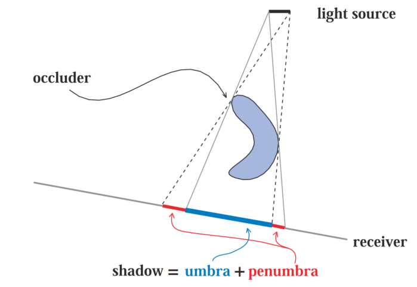
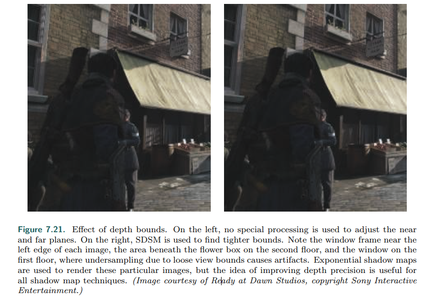

# Chapter 7——Shadow

[toc]

本章聚焦于阴影计算的基础和经典算法，对于如今实时领域流行的算法会做个介绍。本章的一些术语进行介绍：投射阴影的叫做`occluders`，接受阴影的叫做`receivers`。`Punctual light`（非区域光）产生的阴影叫做硬阴影，区域光则会产生软阴影；完全阴影的地区叫做`umbra`，部分阴影的地区叫做`penumbra`。值得注意的是，软阴影虽然在表现形式上是模糊的阴影边缘，但是不可以直接通过低频滤波器对硬阴影边缘进行模糊获得。

投射的几何阴影区域越接近接收者，一个正确的软阴影应该越清晰。而光源越大，软阴影的`umbra`越小。本章的行文思路：平面（地面）投影，任意平面投影，投影优化。

## 1. Planar Shadow

### 1.1 Projection Shadows

这项技术主要是，将三维物体渲染第二次来产生Shadow——计算一个矩阵，将物体的点投影到平面上。首先我们考虑特殊情况，既平面为Y=0（下图左）

我们先考虑其X坐标的关系，可以得到如下公式：
$$
\frac{p_x-l_x}{v_x-l_x}=\frac{l_y}{l_y-v_y}\rightarrow p_x=\frac{l_yv_x-l_xv_y}{l_y-v_y}
$$
Z坐标同上推导，而Y坐标则为常数0。，因此可以由此得到变换矩阵如下：

更常规的情况是投影到任意平面$\pi:n\cdot x+d=0$（其中n，x都是向量），此时，推得：
$$
p=l-\frac{d+n\cdot l}{n\cdot (v-l)}(v-l)
$$
使得$Mv=p$的投影矩阵为：

然后，实际使用的过程中，为了避免阴影渲染在平面以下，我们还需要给投影的平面加上一点偏移。当然也可以通过关闭深度测试来避免。

### 1.2 Soft Shadow

==投影阴影也可以产生软阴影==，这里介绍了一种实现技术——低精度但是快速。软阴影产生于区域光，而区域光可以通过在它表面采样几个`Punctal lights`来近似，然后对它们每一个进行单独渲染，并将结果存储到一个BUFFER中，最后进行平均，来产生软阴影。

这里的技术基于`frustum`的方法来产生他们的阴影。这个想法是把光当作观察者，地面就成了`frustum`的剪切面。然后使用之前描述过的采样平均方法。这种方法给出了一个精确但昂贵的解决方案，但更多是作为其他快速方法的指标。

一种更有效的方法是使用==卷积，即滤波==。模糊一个单点生成的硬阴影在某些情况下是足够的，可以产生一个半透明的纹理，与真实世界的内容结合。参见下图。然而，在物体与地面接触的地方，均匀模糊是难以令人信服的。

还有一些==其他更好的方法==，虽然有额外的花销。从一个投影的硬阴影开始，然后用梯度渲染边缘，从中心的黑暗到边缘的白色；利用球面谐波的想法，用椭球体近似，给予柔和的阴影。

## 2. Shadows on Curved Surfaces

将平面投影扩展到曲面投影的一个简单方法：使用一张生成的`shadow map`来作为投影纹理`projective texture`。以光的位置为视点，能看到的区域就要被渲染，否则就是阴影区。这里，首先将`Occluder`渲染进一张白色图，他所在的像素渲染成黑色，这个纹理被投射到`Receiver`上

纹理投影方法存在着一些严重的缺陷。首先，应用程序必须识别哪些对象是`Occluders`，哪些对象是`Receivers`。接收者与光的高度距离要大于和遮挡者的，否则阴影就会“向后投射”。同时，遮挡对象不能遮挡自己。

而纹理投影也可以应用到其他地方，比如说：条纹状阴影可以产生百叶窗效果。这也是C6.9提到过的`Cookie`。

## 3. Shadow Volumes

`Crow shadow volumes`通过使用`stencil buffer`可以在任意物体上投射阴影。它不是基于图像的(不像下面描述的`shadow maps`算法)，这样就避免了采样问题，从而在任何地方产生正确的锐利阴影。由于其不可预测的成本，阴影体积现在很少被使用。本文对算法进行了简要的描述，说明了算法的一些重要原理，并在此基础上进行了进一步的研究。

==大致思想==：首先，想象一个点光源和一个三角形，形成如上图。然后从视点处，进行Ray Marching过程，射线在打中物体之前，每和`Shadow Volume`的正面相交一次，计数器加一，背面则减一，如果最后打中物体时，计数器大于0，则说明该物体处于阴影区内。

直接这样做耗时持久，更聪明的实现方式是：使用`stencil buffer`进行计数：1.`stencil Buffer`清零。2. 常规渲染（需要光参与的不进行计算），更新color和Z buffer。3. color和z停止更新，绘制`shadow volume`的`front face`，所有能绘制的地方（通过深度测试），`stencil Buffer`的值加一。4. 背面也来一遍，不过是减一。5. 所有`stencil Buffer`的值为0的地方进行光参与的计算。关于==Z-Fail==，具体见书P 232

除了资源消耗（每个三角形片元都需要三个四边形来组成`Shadow volumes`）,然而，阴影体算法仍然有一个可怕的缺点:极端的可变性——随着视点或者光源的移动，`Shadow Volume`不断发生改变，导致更多的计算成本。

## 4. Shadow Maps

==阴影映射==有着可预测的成本，且非常适合GPU，因此在许多应用中得到使用。基本思想：使用z-buffer，从投射阴影的光源位置来渲染场景。光“看到”的是被照亮的，其余的都在阴影中。在生成此Image时，只需要Z Buffer。此时，Z-Buffer中每个像素存储了离光源最近的物体的深度值，它也被称为`shadow map`或者`shadow depth map`、`shadow buffer`。然后正常视角进行第二次渲染，每个像素的深度值转到光源视点空间后，和之前的`shadow map`对应的深度值进行比较（通过转化后的（x,y）坐标进行索引），大于它，则说明其位于阴影处。

但目前的使用域比较狭窄，考虑光源周围是物体的情况？这个时候传统的解决方法是建立一个`six-view cube`，类似于之前的`cubic environment mapping`，因此称为`omnidirectional shadow maps`。这项技术的主要问题在两个图片连接处。一些拓展文献详见书P 234。根据视点的`volumes`，调整light-view的视锥体，使其==自动剔除一些不在视点视锥体内的Occluders==，提高算法的性能，降低消耗，详见书P 235。

阴影贴图技术的==主要缺点==是：实现效果依赖于阴影图的分辨率和`Z-buffer`的数值精度。离物体交接的地方越近，锯齿问题越容易出现，一个常见的问题就是`self-shadow aliasing`——a triangle is incorrectly considered to shadow itself 。出现这个问题有两个主要原因：1.存储精度，2.几何原因，阴影贴图的采样位置和该点的位置并不完全对应，一般偏小。

一个常见的解决方法就是引入`bias`——从物体到视点的距离中减去它。除了使用常量，一种更有效的方法是使用<与**接收者对光的角度**成比例>的偏差——==倾斜角度越大，偏置就越大==。这种技术被称为`slope scale bias`

`Normal offset bias`：沿表面法线方向移动接收器的空间位置，移动距离与$sin(n\cdot l)$成正比。这种方法可以想象为：移动到接收器上方的“虚拟表面”进行采样。这个偏移量是一个世界空间距离。（==形象化可见上图右==）

过多的偏置会导致所谓的==光泄漏==或light leaks or Peter Panning的问题，即物体似乎漂浮在底层表面之上（上上图：右）。这种伪影的出现是因为物体接触点下方的区域，例如脚下的地面，向前移动太远（地面深度反而小于脚的深度），所以没有阴影。

`second-depth shadow mapping`：==核心观点==是渲染物体的背面`backfaces`深度到`ZBuffer`中。当物体是双面的、薄的或相互接触的时候，就会出现问题——因为此时，背面和正面的深度一致或接近。选择哪种方案取决于具体情况——例如，Sousa等人[1679]发现，使用正面作为太阳阴影，使用背面作为室内灯光，效果最好。

请注意，对于阴影贴图，对象必须是`water tight`(多面体和封闭的)，或者正面和背面必须都呈现在贴图上，否则对象可能无法完全投射阴影。吴志明[1900]提出了一种通用方法，即试图在只使用正面或背面进行阴影处理之间找到折衷的方法。他的想法是将solid物体渲染到阴影贴图上，并跟踪两个离光最近的表面。这个过程可以通过`depth peeling`（OIT）或其他与透明相关的技术来完成。两个物体表面之间的平均深度形成一个中间层，其深度被用作阴影图，==有时称为==`dual shadow map`

关于视点移动情况下，光源的视锥体改变size来修改Occluder set，导致阴影在帧与帧之间发生轻微的变化，这是因为light的阴影贴图从light中采样了一组不同的方向，而这些方向与前一组不一致。对于定向光，解决方案是在：世界空间中，强制每个后续生成的阴影贴图，保持相同的、相对==texel beam locations== 。见书P 239。

### 4.1 Resolution Enhancement

光的方向一旦改变，像素的比例就会改变（即一个阴影贴图像素包含多少个视点像素），这就会造成`artifacts`。如下图组左：阴影是块状的，定义很差，因为前景中的大量像素都与阴影贴图的一个texel相关联（a large number of pixels in the foreground are associated with each texel of the shadow map  ）。==这种叫做==`perspective aliasing  `。如果一个表面与光线接近平行，但面向观察者，也会导致这种现象，但这个被称为==射影混叠==`projective aliasing  `。可以通过==增加阴影贴图的分辨率==来减少块度，但是要以额外的内存和处理为代价。

##### Matrix-Warping

还有==另一种方法==来创建光线采样模式，使其更接近相机模式——改变场景向光线投射的方式。通常我们认为视图是对称的，视图向量在截锥体`frustum  `的中心。然而，视图方向仅仅定义了一个视图平面，而不是哪个像素被采样。定义圆锥台`frustum  `的窗口可以在这个平面上移动、倾斜或旋转，从而创建一个四边形，==为视图空间提供一个不同的映射(world to view space)==。The quadrilateral is still sampled at regular intervals, as this is the nature of a linear transform matrix and its use by the GPU。采样率可以通过改变光的视图方向和视图窗口的边界来修改，如下图：

There are ==22 degrees of freedom== in mapping the light’s view to the eye’s 。因此为了更好地让光地采样频率（阴影贴图）匹配人眼，发展了许多技术，如：`perspective shadow maps ` ==(PSM)== ，`trapezoidal shadow maps  `==(TSM)==，`light space perspective shadow maps  `==（LiSPSM ）==。这类技术被统称为`perspective warping  `方法。

这些`matrix-warping  `算法的一个优点是：除了这个矩阵，不需要额外的工作。通过分析这些技术，就采样和锯齿问题来说，==最好的解决方案是让View和Light垂直==。（因为透视变换可以进行偏移，使更多的样本更靠近眼睛）

当光源在摄像机的正前方时， 上诉`matrix-warping  `方法是无效的，这种场景被称作`dueling frusta`或者说`deer in the headlights  `。

> More shadow-map samples are needed nearer the eye, but linear warping can only make the situation worse  

==在视点所在的位置添加更多的采样==是一个不错的想法，这会导致算法为给定的视图生成多个`shadow maps  `，这个想法是很简单的：生成一系列`shadow maps  `（可能会有不同的分辨率），这些图覆盖了场景的不同区域。在==Blow的系统==中，四个`shadow maps  `被嵌套在视点周围。高分辨率的`shadow maps  `对应附近的物体，较低分辨率的`shadow maps  `则服务于远处的物体（没有解决的是：处于两个`shadow maps  `之间的物体）。==Flag Studio发展了一个新的系统==：一个`shadow maps  `处理近处的动态物体；another is for a grid section of the static objects near the viewer  ；a third is for the static objects in the scene as a whole.。z总结来说：第一个`shadow maps`需要每帧更新，第二，三个则只需要生成一次。虽然这些系统都过时了，==但这种为不同的物体和场景建立多个图的思想，成为了目前算法开发的主流==。

##### Cascaded Shadow Maps

==另外一个想法是==：将视点的`frustum volume `按照`view direction  `分解成几部分（如上图）。随着深度增加，每个块的深度范围都是上一个的2到3倍。对于每一个`frustum volume`，光源都会生成一个`frustum`来绑定它，然后生成`shadow map`，这些贴图可以通过C6提到的几个纹理压缩技术，最小化缓存访问延迟。==这个算法也被称作==`cascaded shadow maps`==（CSM）==或者说`parallel-split shadow maps  `。（优化效果如下）这个算法没有什么明显的缺点，又具有很高的鲁棒性，因此广泛应用。

对于这个算法，关键是：如何在场景内划分`z-depths  `的范围——这项任务称为==z分区==`z-partitioning  `。一种实现方法是对数分布`logarithmic partitionin`。n和f是整个场景的近平面和远平面，c是阴影贴图的数量，r是比值（resulting ratio  ）。在实践中，这样的分割给近平面附件的区域提供了相当大的分辨率，如果这个区域没有物体，那么这个分辨率就被浪费了。一种解决方法是：对数分布和等距分布的加权混合。
$$
r=\sqrt[c]{\frac{f}{n}}
$$

==这个算法的难点==在于怎么设置`near plane  `——设置的太远会导致物体被Clipped。一个好的解决方法是`sample distribution shadow maps  `（==SDSM==）——,which use the z-depth values from the previous frame to determine a better partitioning by one of ==two methods==  ：

- 第一种方法：通过z-depth查找最小值和最大值，并使用它们来设置近平面和远平面。这是用GPU上的`reduce`操作来实现的，在这个操作中，一系列越来越小的缓冲区被Compute着色器（或者其它着色器）分析，直到剩下一个1×1的缓冲区。通常情况下，==这些值会被推出一点，以调整场景中物体的移动速度（the values are pushed out a bit to adjust for the speed of movement of objects in the scene.==）。除非采取纠正措施，否则从屏幕边缘进入的近物体可能会造成问题，不过会在下一帧中得到纠正。
- 第二种方法依然对`Depth Buffer`的值进行分析，产生一个叫做`histogram  `的图，来记录the distribution of the z-depths along the range  。（具体见书）

在实际应用中，第一种方法通用性强，速度快（一般在1毫秒/帧范围内），效果好，已得到广泛应用。

==这个算法的另外一个问题是：保存采样的稳定性==（帧间，以及移动物体）。当物体穿越两个阴影贴图是，阴影会发生突变，一个解决思路是：让两张阴影贴图有轻微的重叠，在重叠处进行混合采样。

对于该算法，==效率和质量方面的优化==。1. 使用一个低模作为代理，来实际投射阴影；2. 忽略微小的阴影投射体（谨慎使用，因为大型移动物体可能会导致`artifacts  `）；3. Day [329] presents the idea of “scrolling” distant maps from frame to frame。其想法是`static shadow map`的大部分可以在帧之间重复使用，只有边缘可能会改变（需要渲染）；4. 像《毁灭战士》(2016)这样的游戏保留了大量的`shadow map`，只在物体移动过的地方重新生成——远处则可以直接忽略动态物体的影响；5. 也可以用一张高分辨率的`static shadow map`直接替代远处的`cascades  `。更多的细节可以看书P 246。

Creating several separate shadow maps means a run through some set of geometry for each。在single pass中，对于渲染`occluders`到一组阴影图上，已经建立了许多提高效率的方法。几何着色器`geometry shader`可用于复制对象数据并将其发送到多个视图。实例几何着色器` Instanced geometry shaders `允许将一个对象输出到（最多32个）深度纹理中。

==多光源场景的优化==：如果一个区域在视野内，但不可见，则不需要考虑其它物体对它的遮挡。Bittner等人使用`occlusion culling`(19.7节），从视点处找到所有可见的`shadow receivers`，然后从光的角度，将所有潜在的`shadow receivers`渲染到一个`stencil buffer mask`中。为了==生成阴影贴图==，他们从光源处使用`occlusion culling`来渲染物体，并使用`Mask`剔除没有接收器的物体。==l另一种常见的技术==：在一定的阈值距离后，对光源进行剔除。例如，19.5节中的`portal culling`技术可以找到which lights affect which cells。==这是一个活跃的研究领域，因为可以极大解放性能==。

## 5. Percentage-Closer Filtering

对`Shadow Maps`进行简单拓展，不仅可以产生软阴影，还可以改善7.4.1的分辨率问题。这个扩展和6.2.1的`texture magnification`相似。但这里并不是直接对深度值进行插值，而是对深度比较的结果进行插值（周围四个最近的`Samples`），这会导致an artificially soft shadow。这种*多采样混合*的方法被称为`percentage-closer filtering`（==PCF==）。换句话说，这种方法相当于在`punctal light`的情况下，来模拟区域光的效应（如下图）

> In PCF, locations are generated nearby to a surface location, at about the same depth, but at different texel locations on the shadow map。 Note that this process is non-physical: Instead of sampling the light source directly, this process relies on the idea of sampling over the surface itself. The distance to the occluder does not affect the result, so shadows have similar-sized penumbrae.

当采样区域的范围被确定之后，接下来需要考虑的重点就是：==采取更好的采样方法和过滤方法==，来避免锯齿问题。这些方法多种多样，主要在采样区域、采样的使用方法、采样方式、采样权重上有差别。==DirectX 10使用了一种单指令双线性插值技术==，来支持`PCF`，这提高了视觉质量，但仍没有解决常规采样的`artifacts`。一种解决方案是：使用预计算的泊松分布对区域进行采样（如下图），但仅仅这样，依然不够，最好是再给分布加上一个随机旋转（围绕中心）。另外： Gaussian-weighted sampling scheme based on bilinear sampling.

在PCF的情况下，Self-shadowing等问题更加明显，而`Slope scale bias`等技术效果变差，由此提出了新的技术`bias cone`）——每个样本向光移动，其移动距离与***离原始样本的距离***成正比。（Burley推荐2.0的斜率，加上一个小的恒定偏差，如下图左）

又有三个大佬认为：应该使用阴影接收者自己的斜率，来调整采样点（非原始）的深度值。Dual进一步细化和扩展了这个概念， ==accounting for how the z-depth varies in a nonlinear fashion==。这些方法假设采样点（非原始）在三角形构成的同一平面上，被称为`receiver plane depth bias`（如上图中）

> Combinations of constant, slope scale, receiver plane, view bias, and normal offset biasing have been used to combat the problem of self-shadowing, though hand-tweaking for each environment can still be necessary

==PCF算法最明显的局限是==：采样区域是固定的——软阴影的范围是固定的（the same penumbra width）。==特别是在物体间接触的情况下，这种处理是不对的。==

## 6. Percentage-Closer Soft Shadows

2005年。F神提出了==PCSS技术==`Percentage-Closer Soft Shadows`。具体思路：在`shadow map`上搜索附近区域（原始采样点对应的texel为中心），来寻找所有可能的`occluders`，然后根据这些`occluders`到光源的平均距离，来更新采样区域`Sample area`：(d~r~是接受者到光的距离，d~o~是投影者的平均距离)
$$
w_{sample}=w_{light}\frac{d_r-d_o}{d_r}
$$
需要采样较大区域来寻找`occulders`是本算法一个明显的缺点。使用随机旋转的泊松分布可以隐藏`undersampling artifacts`（采样不足引发的错误？）。（==运动的情况下，泊松分布的结果是不稳定的==）

> Poisson sampling can be unstable under motion and finds that a spiral pattern formed by using a function halfway between dithering and random gives a better result frame to frame.

通过使用AMD SM 5.0的特点，可以得的一个PCSS的快速实现`contact hardening shadows`（==CHS==），同时也解决了原有技术的一个问题：软阴影区域的大小受`shadow map`的分辨率影响。（F 7.25 右 ）通过生成阴影映射的mip maps，然后选择最接近` user-defifined world-space kernel size`的mip级别，可以最小化这个问题。具体来说：一旦确定了软阴影区域的估计值，在硬阴影区使用更高一级分辨率的mip map，而软阴影区则使用更低一级的。扩展技术：`separable soft shadow mapping` (==SSSM==)

一个已经被证实具有==加速效果的算法==是 分层的`min/max shadow map`。生成两个mip maps ，分别记录（每个mip map）每个区域的最大值和最小值深度。这样可以快速判断每个区域是否在无或硬阴影区，避免无作用的软阴影计算。

> A major assumption behind PCSS is that the average blocker is a reasonable estimate of the penumbra size.

PCSS的一些问题和优化（如：`backprojection`，单像素成本高，而不常见于实时）

> The idea is to treat each receiver’s location as a viewpoint and the area light source as part of a view plane, and to project occluders onto this plane. 

## 7. Filtered Shadow Maps

One algorithm that allows filtering of the shadow maps generated is `variance shadow map` (==VSM==) 。原理：存储深度值及其平方在两个图中（生成这些图时，MSAA等抗锯齿算法可以使用），These maps can be blurred, mip mapped, put in summed area tables , or any other method。==将这些Maps视为可过滤纹理是一个巨大的优点==：从它们那里检索数据时，可以使用整个采样和过滤阵列（the entire array of sampling and filtering）。

> 关于VSM的具体细节，可以看Eisemann的书 `Real-Time Shadows`

具体流程：

- 首先，计算离接收者最近的`light occluder`的平均距离M~1~（通过接收者的位置对`shadow map`进行采样得到，被称为`first moment`），如果M~1~大于接收者t的深度，则该接收者处于完全光照区；否则，进行如下公式：
    $$
    p_{max}(t)=\frac{\sigma^2 }{\sigma^2+(t-M_1)^2}
    $$
    p~max~是光照下采样的最大百分比，t是接收者的深度，M1 is the average expected depth in the shadow map，$\sigma^2$是方差，其计算如下（使用之前提到的，存储深度值平方（二阶中心矩）的map的采样M~2~，称为`second moment`）
    $$
    \sigma^2=M_2-M_1^2
    $$

- p~max~是==接受者对于光源可见性的最大百分比==，实际情况下，不能大于这个值。==这个上界来自切比雪夫不等式的单边变式（one-sided variant）==。这个方程试图用概率论来估计：在表面位置的遮挡物有多少分布超出了表面与光线的距离（how much of the distribution of occluders at the surface location is beyond the surface’s distance from the light）。有研究表明，对于固定深度的`planar occluder`和`planar receiver`，p = p~max~，因此上诉方程可以用作*许多真实阴影情况的*一个良好近似。

- 理解公式：一个区域的方差在阴影边界处变大，深度值差别越大，方差越大。$(t-M_1)^2$项在可见性百分比上举足轻重，如果它的值略高于于0，则说明`occulders`的平均深度比接收器更接近光源，而p~max~则趋近于1（完全照亮）。不断深入软阴影区，`occulder`的平均深度更加接近光源，此项变大，p~max~则减小，同时，方差也随之变化，从0开始变大，直到 where the occluders differ in depth and equally share the area。这些项相互平衡，产生线性变化的软阴影。（下图依次：标准SM、矩阵变化（透视）SM、PCSM、VSM）

方差阴影映射的一个显著特点：优雅地处理由几何形状引起的表面偏置问题（ surface bias problems）。Lauritzen给出了如何利用表面的斜率来修改二阶矩值的推导。（话说，没搞懂这段的核心思想是啥，感觉东一榔头，西一棒槌）

总的来说，由于==GPU的优化纹理功能==得到了有效的利用，VSM在处理时间上显著提高了。相对PCF技术对采样的高要求，VSM只需要一次高质量的采样，就可以产生平滑的软阴影。

VSM失败的情况：沿着半阴影区，两个以上`occluder`遮挡一个物体，且一个`Occulder`离物体很近——概率论中的切比雪夫不等式将产生一个与正确的*光百分比*无关的最大光值。最近的遮挡器只部分地遮挡了光线，从而脱离了方程的近似。这导致了`light bleeding`(又名` light leaks`)，即==完全被遮挡的区域仍然接收到光==。解决方案：==在更小的区域上采集更多的样本，将VSM转化为PCF的形式==。另一个大佬提出了由艺术家控制的方法：较低光百分比的区域直接当作硬阴影区，重定义软阴影的范围，使光泄露的区域变暗。

虽然`light bleeding`是一个严重的限制，==VSM很适合为地形（terrian）产生阴影==，因为这种情况下的阴影很少涉及多个遮挡物。

总的来说，这种过滤产生软阴影的技术逐渐流行，主要挑战依旧是上诉所言的`light bleeding`。`convolution shadow map`==卷积阴影贴图==：在傅里叶展开中编码阴影深度。与VSM一样，这样的映射可以被过滤。该方法收敛于正确的解，从而减少了bleeding问题。==这项技术的缺点是==：有几个额外的操作需要计算和处理，提高了运算和存储成本。由此，提出了仅使用一个基于指数的项的技术，`exponential shadow map`(==ESM==) 或者说`exponential variance shadow map (EVSM)`：这种方法将深度的指数值及其二阶矩（`second moment`）保存到两个缓冲区中。这项技术解决了CSM的一个问题`Ringing`。（书 p 256）

> An exponential function more closely approximates the step function that a shadow map performs (in light or not), so this works to significantly reduce bleeding artifacts

==存储指数值的一个问题==是精度问题，特别是`Second moment`。一个解决方法：z-depths can be generated so that they are linear。==在VSM、CSM、ESM中，ESM拔得头筹。==

最近的一个技术是`moment shadow mapping`（扩展还包括光散射和透明度效果）；也可以将ESM和之前的`Cascaded shadow-map`结合起来。

## 8. Volumetric Shadow Techniques

当场景中存在透明物体时，生成的`shadow map`有点不一样，除了深度值之外，还会存储颜色或者`alpha`的coverage。如果场景中的物体没有接收不透明物体的阴影（ not blocked by the opaque shadow map），那么则进行透明阴影测试，，通过则使用之前存储的颜色值或`alpha`。这项技术不能应用于透明物体本身。

`Self-shadowing`==自阴影对于真实感渲染中的头发和云雾渲染（很小，或者半透明）是很重要的==，但单个深度贴图达不到这种渲染要求。`deep shadow maps`（==深度阴影贴图==），其中每个`texel`都存储了一个函数，用来计算随着深度增加，光的衰减程度。通过在不同的深度值进行一系列采样（each sample having an opacity value）可以对这个函数进行拟合。此算法的一些问题和挑战。

K神和N神提出了第一个基于GPU的算法` opacity shadow maps`（==OSM==）。只存储不透明值的贴图依据一个固定的深度集生成。(详见书P 258)。However, the depth slices are all parallel and uniform, so many slices are needed to hide in-between slice opacity artifacts due to linear interpolation。（ ==fixed slice setups==）

为了避免上诉问题（固定切片），S神提出了`adaptive volumetric shadow maps`（==AVSM==），每个`texel`不仅存储不透明深度值（opacities），还存储深度的层级（layer depths）。

>  Pixel shades operations are used to lossily compress the stream of data (surface opacities) as it is rasterized. This avoids needing an unbounded amount of memory to gather all samples and process them in a set. The technique is similar to deep shadow maps [1066], but with the compression step done on the fly in the pixel shader. Limiting the function representation to a small, fixed number of stored opacity/depth pairs makes both compression and retrieval on the GPU more efficient 

阴影算法的探索仍在继续，各种算法和技术的综合变得越来越普遍。

## 9. Irregular Z-Buffer Shadows

深度贴图的优点很多，但不是没有缺点，特别是在光采样的频率小于视点的采样时（即使比例合适，表面采样的位置和人眼看到的不一定相同），artifacts的发生概率增加。==阴影体==`Shadow volumes`提供了一个精确、可解析的方案——因为光线与表面的相互作用，产生了一组三角形来定义：给定的位置是被照亮，还是在阴影中。但很可惜，其成本是不可预测的。，难以实际使用。

另外一个可解析的方法就是熟知的`Ray tracing`。==另一种方法是使用GPU的光栅化硬件来查看场景==，但不只是Z深度，而是在光的每个网格单元中存储有关遮挡物边缘的信息。例如，想象一下，在每个阴影映射的texel中，存储一系列覆盖网格单元格的三角形==。这样的列表可以通过保守栅格化==`conservative rasterization`生成。在保守栅格化中，如果三角形的任何部分与像素（而不仅仅是像素的中心）重叠，则三角形将生成一个` fragment`。==缺点也很明显==：内存不要钱吗，而且这个方法产生太多线程，很大可能引发线程阻塞。（构造着色器时，避免由动态的“if”语句和循环引起的线程发散`thread divergence`，对于性能是至关重要的）

解决方法：翻转这个问题（遮挡三角形列表$\rightarrow$接收者位置），直接存储接收器位置，然后 testing triangles against each。以J神为首的三人提出了这个算法`irregular z-buffer`（==IZB==）。为啥叫这个名字呢？==缓冲区的内容是不规则的，因为阴影贴图中，一个texel可能将有一个或多个接收器位置存储在里面，或者可能根本没有。==

IZB的测试方法、` frustum tracing`、优化问题（避免不必要的渲染，GPU相关的结构优化）。（详见P 261）

这种方法避免了其他方法的采样和偏差问题，并提供了非常清晰的阴影。S神和W神探索了混合阴影技术，其核心思想是：使用遮挡距离来混合IZB和PCSS+，当遮挡距离较近时使用硬阴影结果，当距离较远时使用软阴影结果（如下图）

## 10. Other Application

Treating the shadow map as defining a volume of space, separating light from dark, can also help in determining what parts of objects to shadow. （如下图，实现的话，简单来说，存储每个位置的高度，和太阳角度产生的高度图进行比较）

另外一个值得提及的技术是==屏幕空间阴影==`screen-space shadows`。受限于分辨率，阴影贴图在小特征的阴影生成（比如：人脸）上是不成功的。当然，可以使用更加高分辨率的贴图或者阴影分级，而另一种方法是使用已经存在的数据。==在大多数现代渲染引擎中，在渲染过程中都可以使用来自早期prepass的深度缓冲（摄像机视角）==。存储其中的数据可以被看做`heightField`，通过迭代地采样这个深度缓冲区，我们可以执行Ray Marching，来判断是否被遮挡。

一个好的总结：

> To summarize this whole chapter, shadow mapping in some form is by far the most common algorithm used for shadows cast onto arbitrary surface shapes. Cascaded shadow maps improve sampling quality when shadows are cast in a large area, such as an outdoor scene. Finding a good maximum distance for the near plane via SDSM can further improve precision. Percentage-closer filtering (PCF) gives some softness to the shadows, percentage-closer soft shadows (PCSS) and its variants give contact hardening, and the irregular z-buffer can provide precise hard shadows. Filtered shadow maps provide rapid soft-shadow computation and work particularly well when the occluder is far from the receiver, as with terrain. Finally, screen-space techniques can be used for additional precision, though at a noticeable cost.

## Further Reading and Resources

The book ==Real-Time Shadows== by Eisemann et al. [412] focuses directly on ==interactive rendering techniques==, discussing a wide range of algorithms along with their strengths and costs. 

A SIGGRAPH 2012 course provides an excerpt of this book, while also adding references to newer work [413]. 

Presentations from their SIGGRAPH 2013 course are available at their website, www.realtimeshadows.com. 

Woo and Poulin’s book ==Shadow Algorithms Data Miner== [1902] provides an overview of ==a wide range of shadow algorithms for interactive and batch rendering==.  Both books supply references to hundreds of research articles in the field. 

Tuft’s pair of articles [1791, 1792] are an excellent overview of commonly used ==shadow-mapping techniques== and the issues involved. 

Bjørge [154] presents a range of popular shadow ==algorithms suitable for mobile devices==, along with images comparing various algorithms. 

Lilley’s presentation [1046] gives a solid and extensive overview of ==practical shadow algorithms, with a focus on terrain rendering for GIS systems.== 

Blog articles by Pettineo [1403, 1404] and Casta˜no [235] are particularly valuable for their practical tips and solutions, as well as a demo code base. 

See Scherzer et al. [1558] for a shorter summary of work specifically focused on ==hard shadows==. 

The survey of algorithms for ==soft shadows== by Hasenfratz et al. [675] is dated, but covers a wide range of early work in some depth.

