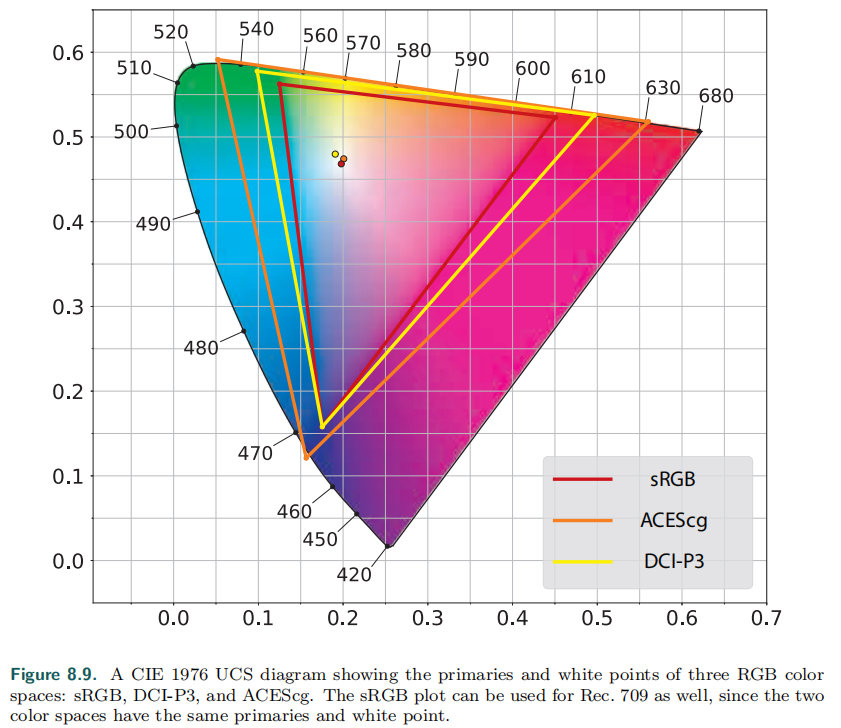

# Chapter 8 ——Light and Color

## 1. Light  Quantities（光的量化）

任何基于物理的渲染的第一步都是==精确地量化光==。首先介绍==辐射法==`Radiometry`，因为这是与光的物理传输有关的核心领域。接下来我们将讨论光度学`photometry`，它处理由==人眼的灵敏度加权==的光值（which deals with light values that are weighted by the sensitivity of the human eye）。我们对颜色的感知是一种==心理物理现象==（psychophysical phenomenon）——对物理刺激的心理感知。最后讨论：用RGB颜色值进行渲染的有效性。

### 1.1 Radiometry

辐射法`Radiometry`研究的是电磁辐射的测量。这种辐射以波的形式传播，不同波长的电磁波往往具有不同的性质。在现实中，波长的范围极广（从长度小于百分之一纳米的伽马波到数万公里长的极低频(ELF)无线电波）。

辐射度量（Radiometric quantities）包括电磁辐射的各个方面：总体能量、功率以及功率密度（与面积、方向或两者都相关的）。在辐射学中，==最基本的是辐射通量Φ==（ the flow of radiant energy over time—power）——测量单位是瓦(W)。==辐照度E==是辐射通量的密度（相对于面积）——$d\Phi/dA$。辐照度是根据一个区域来定义的，这个区域可以是空间中的一个假想区域，但通常是物体的表面——它的单位是$W/m^2$。

在我们讨论下一个量之前，我们需要先介绍一个==立体角==的概念，它是角度的三维扩展。角度被认为是平面上连续方向集大小的度量，单位是弧度`radians`（equal to the length of the arc this set of directions intersects on an enclosing circle with radius 1），所以范围是$[0,2\pi]$。同样，立体角测量三维空间中连续方向集的大小，单位为`steradians`(sr)——==等于和半径为1的封闭球体相交的面积==。立体角由符号ω表示。二维中，一个$2\pi$弧度的角会覆盖整个单位圆。扩展到三维，一个4 sr的立体角将覆盖整个单位球。

现在我们可以开始讨论==辐射强度I==`radiant intensity`。I是辐射通量相对于方向的密度，$d\Phi/dw$，测量单位是$W/sr$。最后，==辐射率L==`radiance`， is a measure of electromagnetic radiation in a single ray。更精确的说，它考虑的是辐射度的综合密度（面积+方向），$d^2\Phi/dAdw$，这个面积是在垂直于射线的平面上测量的。如果在其他方向上进行，则必须使用余弦校正系数。

Radiance is what sensors, such as eyes or cameras, measure, so it is of prime importance for rendering。计算渲染方程就是为了：得到沿着一条给定的射线，从渲染的表面点，到照相机的辐射率。在物理上，L的值等价于第五章渲染方程的c~shaded~。环境中的辐射率`radiance`可以看作是五个变量的函数(或六个，包括波长)，称为辐射分布`radiance distribution`。其中，三个参数指定位置，两个参数指定方向。这个函数描述了空间中任何地方的光。

在渲染方程中，辐射率通常以L~o~(x, d)或L~i~(x, d)的形式出现，分别表示从x点出发或进入x点的辐射率。辐射率`radiance`的一个重要特性是：它不受距离的影响，忽略了雾等大气效应。The surface covers fewer pixels when more distant, but the radiance from the surface at each pixel is constant。

大多数光包含不同波长的光波，这可以可视化为光谱功率分布` spectral power distribution`(SPD)——显示光的能量的分布情况（如下图）。==所有的辐射量都有光谱分布==。由于这些分布是波长上的密度，它们的单位是原始量除以纳米。例如，辐照度的光谱分布的单位是$W/(m^2*nm)$

==由于在渲染中使用全SPD很困难，特别是在交互速率下，所以在实践中辐射量是用RGB表示的。==

### 1.2 Photometry

==辐射测量法只处理物理量，而不考虑人类的感知。==与之相关的一个领域，`photometry`，就像辐射测量法一样，只不过它是以人眼的灵敏度来衡量一切。通过乘以`CIE  photometric curve`曲线（如下图），==辐射计算的结果可以转换为photometric的结果==。这个曲线代表眼睛对不同波长光线的反应。

==转换曲线和测量单位是这两个理论的区别所在==。每个辐射量都有一个等效的`photometric`度量。亮度`Luminance `通常用来描述平面的亮度，例如，高动态范围(HDR)屏幕的峰值亮度通常在500到1000 nit之间。相比之下，晴空的亮度约为8000 nits，60瓦的灯泡亮度约为12万 nits，地平线上的太阳亮度为60万 nits。（具体见书 P 271）

###  1.3 Colorimetry

之前已经提到了，人对光的颜色感知与光的SPD（光谱功率分布）联系密切。我们还看到，这不是简单的一对一关系——图8.3中，底部和中间的SPDs是完全不同的，但是被感知为完全相同的颜色。`Colorimetry`==研究的是光谱功率分布SPD和颜色感知之间的关系==。

人类大概可以分辨1000万种颜色，对于颜色感知，==视网膜上有三种不同类型的锥体感受器==`cone receptors`，每一种感受器对不同的波长有不同的反应。==所以，对于一个给定的SPD，我们的大脑只通过这些感受器接收三种不同的信号==。这就是为什么只用三个数字就可以精确地表示任何颜色 。

那么这三个数字是什么呢？CIE（Commission Internationale d’Eclairage）提出了一系列标准，其中一个就是RGB（具体的匹配测试见书 P 272）。将每组匹配权重 和 测试的匹配颜色 相关联的函数是`color-matching functions`。==这些函数的具体功能是：将SPD转换为三个数字==。Spectral distributions that give matching weights are called ==metamers==。R,G,B的颜色匹配函数如下：

==RGB不能表示所有可见光==，这是由于它的颜色匹配函数存在负权重（a R+b G+c B，(a,b,c) in range[-1,1]）（负权重什么情况呢？一般来说，都是RGB进行混合来匹配，那么负权重就是，==将其对应的光加在要匹配的光上，来进行匹配，有些难以想象==，那么，这种情况就是无法匹配的情况，也是RGB色域限制的本因）。CIE提出了三个不同的假想光来替代RGB，由于它不存在负权重，所以它可以表示所有光。==为什么说这三个光是假想的呢==？因为要求这三个光源的SPD在某些波长是负值，所以这些光是无法实现的数学抽象。他们的颜色匹配函数如下：

可以注意到，颜色匹配函数$\overline{y}(\lambda)$和之前说过的`photometric curve`是一样的（$radiance \rightarrow luminance$）。与前面的一组颜色匹配函数一样，使用x、y和z能将任意的SPD s($\lambda$)通过乘法和积分的方式简化为三个数字：

X，Y，Z三色值就是定义CIE XYZ颜色空间的三个权重。这项技术很容易的将颜色分成亮度`luminance `和色度`chromaticity`。==色度是一种与亮度无关的颜色特性==。例如，两种蓝色，一种深蓝色和一种浅蓝色，可以具有相同的色度，但亮度不同。

通过将这个颜色标准投影到$X+Y+Z=1$平面，可以定义一个==二维色度空间，保持亮度恒定==（如下图）。新空间的坐标是x和y，具体计算如下：

The plot of the chromaticity coordinates x and y values is known as the CIE 1931 ==chromaticity diagram==（如下图）。图中曲线的轮廓显示了可见光谱的颜色所在，而连接光谱两端的直线称为==紫色线==。

> The black dot shows the chromaticity of illuminant D 65, which is a frequently used white point—a chromaticity used to define the white or achromatic (colorless) stimulus.

在CIE色度图上，选择一个点(x,y)，从白点到它画一条线，直到边界（或紫色线）。点的相对距离（应该是点到白点的距离）与到区域边缘的距离的比是颜色的激发纯度`excitation purity `。边缘的点确定了主波长`dominant wavelength`，这些colorimetric术语在图形学中很少遇到。相反，我们使用==饱和度和色相==，它们分别与激发纯度和主波长有松散的关联。

> More precise definitions of saturation and hue can be found in books by Stone [1706] and others 

在这个基础上，在考虑默认是常数的亮度`luminance`，可以得到==xyY==坐标系统。这个色度图对于理解渲染中颜色的使用，以及渲染系统的限制是很重要的。色度图中的三角形就是现在显示器流行的sRGB彩色系统，三角形的三个角是三原色，即屏幕所能显示的最饱和的红、绿、蓝。

==感知一致的色彩空间==：渲染中有几个RGB空间，每个空间由三原色和一个白点定义。为了比较它们，我们将使用一种不同类型的色度图，称为==CIE 1976 UCS==(统一色度图)。此图是CIE LUV颜色空间的一部分，CIE（以及另一个颜色空间CIE LAB）采用了这个颜色空间，目的是为XYZ空间提供更直观、统一的替代方案。在CIE XYZ空间中，感知上相差相同的颜色对，其距离可以相差20倍。CIELUV在此基础上进行了改进，使比例降低到最多四倍。这种增加的感知一致性使得1976年的图表比1931年，更好用于比较RGB空间的色域。对感知一致的色彩空间的研究最近产生了IC~T~C~P~和J~z~a~z~b~z~空间。这些色彩空间在感知上比CIELUV更均匀，然而，基于这些颜色空间的色度图还没有被广泛采用，所以我们在本章中使用CIE 1976 UCS图，如下图：

