# Chapter 8 ——Light and Color

[toc]

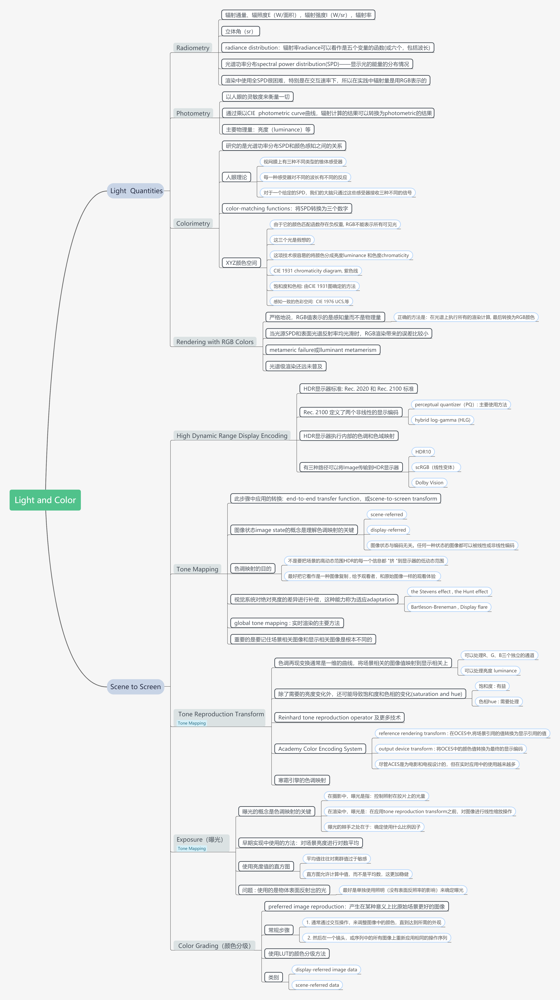

## 1. Light  Quantities（光的量化）

任何基于物理的渲染的第一步都是==精确地量化光==。首先介绍==辐射法==`Radiometry`，因为这是与光的物理传输有关的核心领域。接下来我们将讨论光度学`photometry`，它处理由==人眼的灵敏度加权==的光值（which deals with light values that are weighted by the sensitivity of the human eye）。我们对颜色的感知是一种==心理物理现象==（psychophysical phenomenon）——对物理刺激的心理感知。最后讨论：用RGB颜色值进行渲染的有效性。

### 1.1 Radiometry

辐射法`Radiometry`研究的是电磁辐射的测量。这种辐射以波的形式传播，不同波长的电磁波往往具有不同的性质。在现实中，波长的范围极广（从长度小于百分之一纳米的伽马波到数万公里长的极低频(ELF)无线电波）。

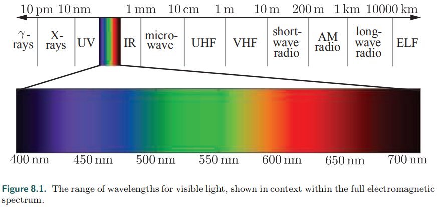

辐射度量（Radiometric quantities）包括电磁辐射的各个方面：总体能量、功率以及功率密度（与面积、方向或两者都相关的）。在辐射学中，==最基本的是辐射通量Φ==（ the flow of radiant energy over time—power）——测量单位是瓦(W)。==辐照度E==是辐射通量的密度（相对于面积）——$d\Phi/dA$。辐照度是根据一个区域来定义的，这个区域可以是空间中的一个假想区域，但通常是物体的表面——它的单位是$W/m^2$。

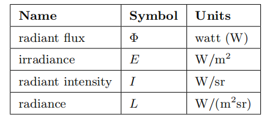

在我们讨论下一个量之前，我们需要先介绍一个==立体角==的概念，它是角度的三维扩展。角度被认为是平面上连续方向集大小的度量，单位是弧度`radians`（equal to the length of the arc this set of directions intersects on an enclosing circle with radius 1），所以范围是$[0,2\pi]$。同样，立体角测量三维空间中连续方向集的大小，单位为`steradians`(sr)——==等于和半径为1的封闭球体相交的面积==。立体角由符号ω表示。二维中，一个$2\pi$弧度的角会覆盖整个单位圆。扩展到三维，一个4 sr的立体角将覆盖整个单位球。

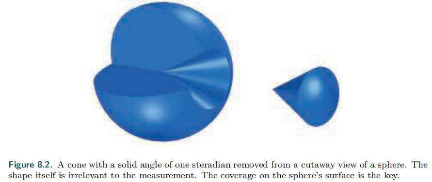

现在我们可以开始讨论==辐射强度I==`radiant intensity`。I是辐射通量相对于方向的密度，$d\Phi/dw$，测量单位是$W/sr$。最后，==辐射率L==`radiance`， is a measure of electromagnetic radiation in a single ray。更精确的说，它考虑的是辐射度的综合密度（面积+方向），$d^2\Phi/dAdw$，这个面积是在垂直于射线的平面上测量的。如果在其他方向上进行，则必须使用余弦校正系数。

Radiance is what sensors, such as eyes or cameras, measure, so it is of prime importance for rendering。计算渲染方程就是为了：得到沿着一条给定的射线，从渲染的表面点，到照相机的辐射率。在物理上，L的值等价于第五章渲染方程的c~shaded~。环境中的辐射率`radiance`可以看作是五个变量的函数(或六个，包括波长)，称为辐射分布`radiance distribution`。其中，三个参数指定位置，两个参数指定方向。这个函数描述了空间中任何地方的光。

在渲染方程中，辐射率通常以L~o~(x, d)或L~i~(x, d)的形式出现，分别表示从x点出发或进入x点的辐射率。辐射率`radiance`的一个重要特性是：它不受距离的影响，忽略了雾等大气效应。The surface covers fewer pixels when more distant, but the radiance from the surface at each pixel is constant。

大多数光包含不同波长的光波，这可以可视化为光谱功率分布` spectral power distribution`(SPD)——显示光的能量的分布情况（如下图）。==所有的辐射量都有光谱分布==。由于这些分布是波长上的密度，它们的单位是原始量除以纳米。例如，辐照度的光谱分布的单位是$W/(m^2*nm)$

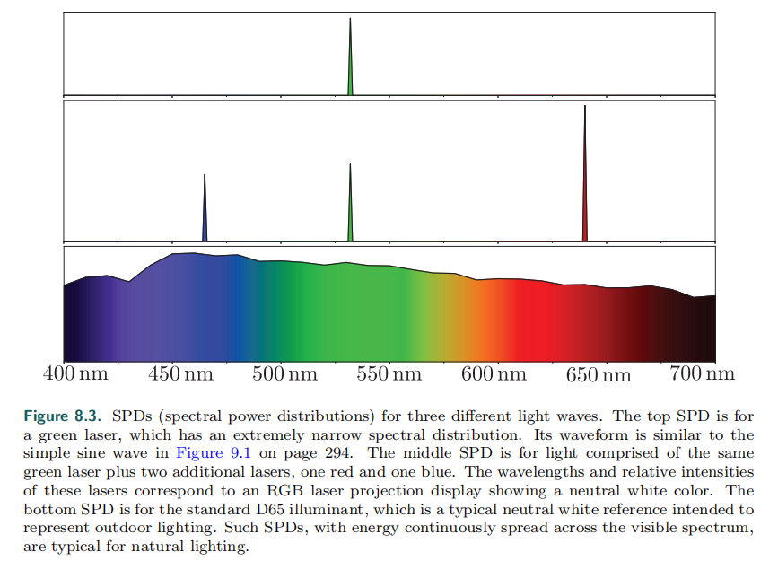

==由于在渲染中使用全SPD很困难，特别是在交互速率下，所以在实践中辐射量是用RGB表示的。==

### 1.2 Photometr

==辐射测量法只处理物理量，而不考虑人类的感知。==与之相关的一个领域，`photometry`，就像辐射测量法一样，只不过它是以人眼的灵敏度来衡量一切。通过乘以`CIE  photometric curve`曲线（如下图），==辐射计算的结果可以转换为photometric的结果==。这个曲线代表眼睛对不同波长光线的反应。

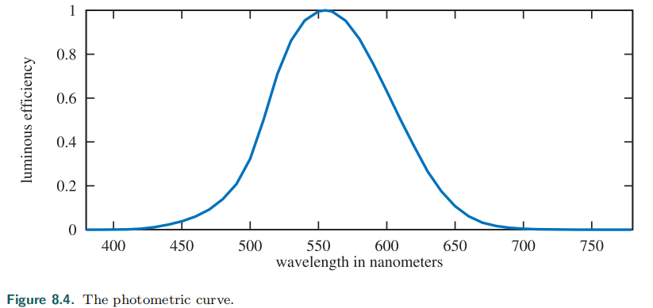

==转换曲线和测量单位是这两个理论的区别所在==。每个辐射量都有一个等效的`photometric`度量。亮度`Luminance `通常用来描述平面的亮度，例如，高动态范围(HDR)屏幕的峰值亮度通常在500到1000 nit之间。相比之下，晴空的亮度约为8000 nits，60瓦的灯泡亮度约为12万 nits，地平线上的太阳亮度为60万 nits。（具体见书 P 271）

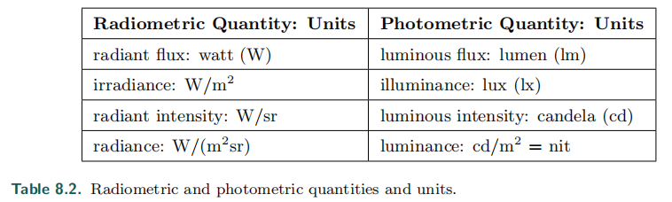

###  1.3 Colorimetry

之前已经提到了，人对光的颜色感知与光的SPD（光谱功率分布）联系密切。我们还看到，这不是简单的一对一关系——图8.3中，底部和中间的SPDs是完全不同的，但是被感知为完全相同的颜色（白色）。`Colorimetry`==研究的是光谱功率分布SPD和颜色感知之间的关系==。

人类大概可以分辨1000万种颜色，对于颜色感知，==视网膜上有三种不同类型的锥体感受器==`cone receptors`，每一种感受器对不同的波长有不同的反应。==所以，对于一个给定的SPD，我们的大脑只通过这些感受器接收三种不同的信号==。这就是为什么只用三个数字就可以精确地表示任何颜色 。

那么这三个数字是什么呢？CIE（Commission Internationale d’Eclairage）提出了一系列标准，其中一个就是RGB（具体的匹配测试见书 P 272）。将每组匹配权重 和 测试的匹配颜色 相关联的函数是`color-matching functions`。==这些函数的具体功能是：将SPD转换为三个数字==。Spectral distributions that give matching weights are called ==metamers==。R,G,B的颜色匹配函数如下：

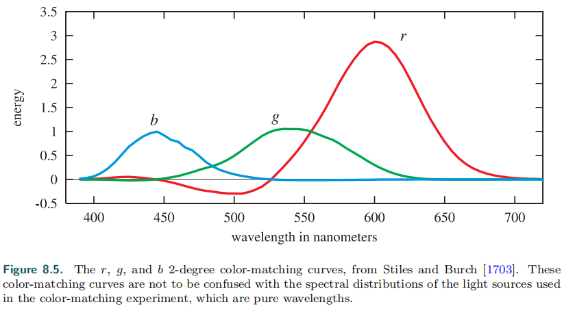

==RGB不能表示所有可见光==，这是由于它的颜色匹配函数存在负权重（a R+b G+c B，(a,b,c) in range[-1,1]）（负权重什么情况呢？一般来说，都是RGB进行混合来匹配，那么负权重就是，==将其对应的光加在要匹配的光上，来进行匹配，有些难以想象==，那么，这种情况就是无法匹配的情况，也是RGB色域限制的本因）。CIE提出了三个不同的假想光来替代RGB，由于它不存在负权重，所以它可以表示所有光。==为什么说这三个光是假想的呢==？因为要求这三个光源的SPD在某些波长是负值，所以这些光是无法实现的数学抽象。他们的颜色匹配函数如下：

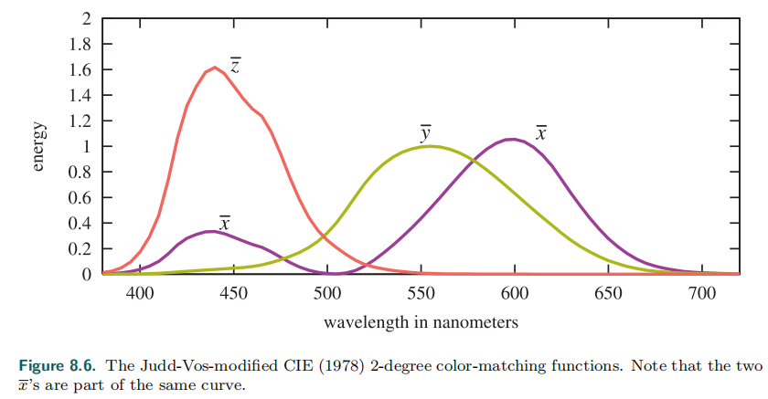

可以注意到，颜色匹配函数$\overline{y}(\lambda)$和之前说过的`photometric curve`是一样的（$radiance \rightarrow luminance$）。与前面的一组颜色匹配函数一样，使用x、y和z能将任意的SPD s($\lambda$)通过乘法和积分的方式简化为三个数字：

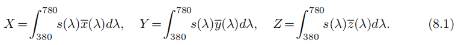

X，Y，Z三色值就是定义CIE XYZ颜色空间的三个权重。这项技术很容易的将颜色分成亮度`luminance `和色度`chromaticity`。==色度是一种与亮度无关的颜色特性==。例如，两种蓝色，一种dark 蓝色和一种white 蓝色，可以具有相同的色度，但亮度不同。

通过将这个颜色标准投影到$X+Y+Z=1$平面，可以定义一个==二维色度空间，保持亮度恒定==（如下图）。新空间的坐标是x和y，具体计算如下：

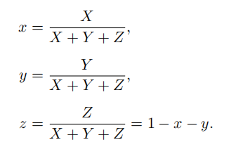

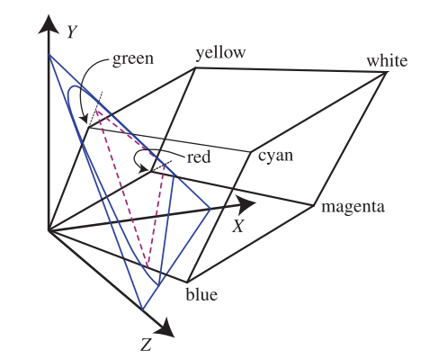

The plot of the chromaticity coordinates x and y values is known as the CIE 1931 ==chromaticity diagram==（如下图）。图中曲线的轮廓显示了可见光谱的颜色所在，而连接光谱两端的直线称为==紫色线==。

> The black dot shows the chromaticity of illuminant D 65, which is a frequently used white point—a chromaticity used to define the white or achromatic (colorless) stimulus.

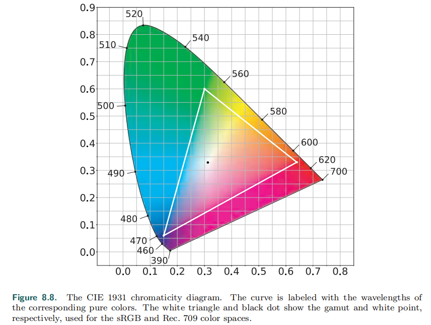

在CIE色度图上，选择一个点(x,y)，从白点到它画一条线，直到边界（或紫色线）。点的相对距离（应该是点到白点的距离）与到区域边缘的距离的比是颜色的激发纯度`excitation purity `。边缘的点确定了主波长`dominant wavelength`，这些colorimetric术语在图形学中很少遇到。相反，我们使用==饱和度和色相==，它们分别与激发纯度和主波长有松散的关联。

> More precise definitions of saturation and hue can be found in books by Stone [1706] and others 

在这个基础上，在考虑默认是常数的亮度`luminance`，可以得到==xyY==坐标系统。这个色度图对于理解渲染中颜色的使用，以及渲染系统的限制是很重要的。色度图中的三角形就是现在显示器流行的sRGB彩色系统，三角形的三个角是三原色，即屏幕所能显示的最饱和的红、绿、蓝。

==感知一致的色彩空间==：渲染中有几个RGB空间，每个空间由三原色和一个白点定义。为了比较它们，我们将使用一种不同类型的色度图，称为==CIE 1976 UCS==(统一色度图)。此图是CIE LUV颜色空间的一部分，CIE（以及另一个颜色空间CIE LAB）采用了这个颜色空间，目的是为XYZ空间提供更直观、统一的替代方案。在CIE XYZ空间中，感知上相差相同的颜色对，其距离可以相差20倍。CIELUV在此基础上进行了改进，使比例降低到最多四倍。这种增加的感知一致性使得1976年比1931年，更好用于比较RGB空间的色域。对感知一致的色彩空间的研究最近产生了IC~T~C~P~和J~z~a~z~b~z~空间。这些色彩空间在感知上比CIELUV更均匀，然而，基于这些颜色空间的色度图还没有被广泛采用，所以我们在本章中使用CIE 1976 UCS图，如下图：

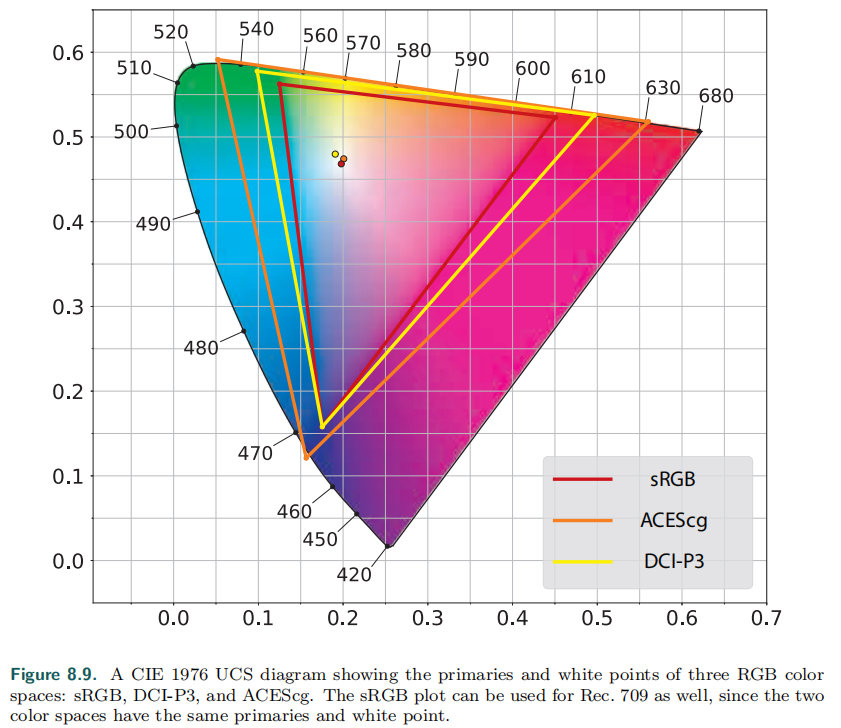

==sRGB==毫无疑问是实时渲染领域使用最广泛的颜色空间。然而，越来越多的显示器使用更宽的色域。一些用于照片编辑的显示器使用Adobe 1998色彩空间(未显示)。==DCI-P3色彩空间最初是为故事片制作而开发的，现在已经有了更广泛的用途——从iphone到mac==，苹果公司的产品线都采用了这种颜色空间，其他制造商也纷纷效仿。尽管==超高清(UHD)显示器==被指定使用极宽的色域==Rec. 2020颜色空间==，然而在许多情况下，DCI-P3也被用作超高清色彩空间。==ACEScg彩色空间==是由美国电影艺术与科学学院(AMPAS)开发的，用于故事片的计算机图形渲染。它不打算用作显示色彩，而是用作渲染的工作色彩，在渲染后将颜色转换为适当的显示色彩。

有很多方法可以从RGB色彩空间转化到XYZ色彩空间（或其他色彩空间），其中一个常用的就是：转化一个RGB颜色到一个灰度亮度值。因为亮度值等于XYZ中的Y（前面说过），所以实际上这个操作就是$RGB\rightarrow XYZ$的Y部分。这个转化如下：
$$
Y=0.2126R+0.7152G+0.0722B
$$
比色法`Colorimetry`能告诉我们两种颜色刺激是否匹配，但不能预测它们的`appearance`。一个XYZ下的颜色刺激很大程度上取决于光线、周围的颜色等因素。==颜色外观模型(CAM)==`Color appearance models`，如CIECAM02试图处理这些问题，并预测最终的颜色外观。（具体见 书 P 278）

### 1.4 Rendering with RGB Colors

==严格地说，RGB值表示的是感知量而不是物理量==。从技术上讲，使用它们进行基于物理的渲染是一种分类错误。正确的方法是：在光谱` spectral quantities`上执行所有的渲染计算（通过密集采样或投影到合适的基础上），并在最后转换为RGB颜色

例如，渲染中最常见的操作是计算物体表面反射的光，一般来说，该表面会着重反射某些波段的光（用它的光谱反射曲线`spectral reflflectance curve`来描述）。严格、正确的计算反射光的方法是：==将入射光的SPD乘以每个波长的光谱反射率，得到反射光的SPD，然后转换成RGB颜色==。而将灯光的RGB颜色和表面的进行相乘，得到的RGB结果往往是不正确的，如下图（给出了一个极端的例子）（最上面是材质的光谱反射曲线，下面两个是两个色彩表现相同的光源，但标准不一样，一个是RGB，一个是D65，但明显，对于该材质，两个光源在其上的反射光是不一样的——RGB的80%成功反射，而D65只有不到20%被反射）

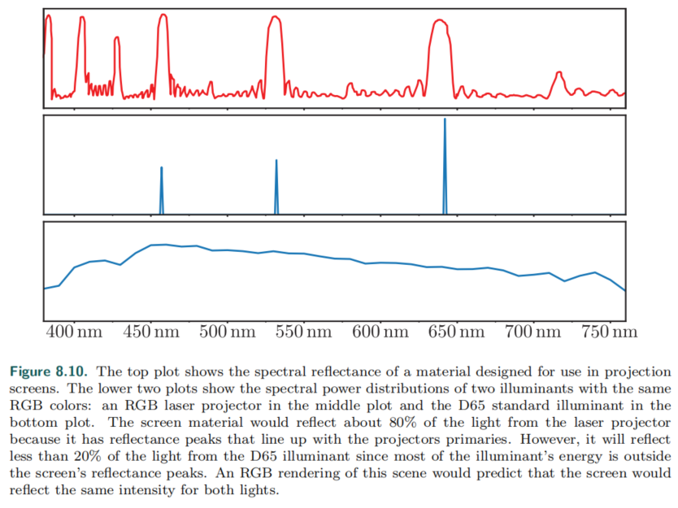

==当光源SPD和表面光谱反射率均光滑时，RGB渲染带来的误差比较小==。但在`predictive rendering `应用中，这种错误是不能忽略的，例如，两种不同的材质可能在同一个光源下显示成同一颜色，但在其它光源下自然是不同的， 这个错误叫做`metameric failure`或`lluminant metamerism`。（这种情况下，RGB渲染是不合适的）然而，对于目前的交互应用来说，RGB渲染表现不错；即使是电影的离线渲染也只是最近才开始使用光谱渲染，而且还远未普及。

本节仅涉及色彩科学的基础知识，主要是使人们认识到光谱与三原色的关系，并讨论设备的局限性。下一节将讨论的主题，是渲染场景的颜色到显示值的转换。

## 2. Scene to Screen

这本书的余下部分主要讨论基于物理的渲染，但就算计算出符合现实的辐射率，工作也没有结束——最终结果（framebuffer中的像素值）仍然需要决定（ determined）。在本节中，我们将讨论此决定中涉及的一些考虑事项。

### 2.1 High Dynamic Range Display Encoding

首先我们需要考虑到之前提到（C 5.6）场景编码（display encoding）,本节将在其基础上考虑色域`color gamuts`的问题，由此引入HDR`high dynamic range`。

传统的显示器的标准，具体见书 P281。HDR显示器使用的是 Rec. 2020 和 Rec. 2100 标准。Rec. 2020的颜色空间色域很广，白点的位置和sRGB的一样。 Rec. 2100 定义了两个非线性的显示编码`display encodings`：`perceptual quantizer`（==PQ==）和`hybrid log-gamma`(==HLG==)，后者在渲染中使用较少，所以我们主要讨论前者——定义了一个峰值亮度值为10000 $cd/m^2$的峰值亮度。

At the time of writing，很少有消费级的HDR显示器有亮度超过1500$cd/m^2$的，在实际应用中，其显示色域更接近于DCI-P3，而不是Rec. 2020。因此，==HDR显示器执行内部的色调和色域映射==` tone and gamut mapping`，从标准规格到实际显示能力。This mapping can be affected by metadata（元数据） passed by the application to indicate the actual dynamic range and gamut of the content。

在应用程序方面，==有三种路径可以将Image传输到HDR显示器==，但根据显示器和操作系统的不同，并不是所有三种路径都可用：

- HDR10：广泛支持HDR显示器以及PC和控制台操作系统。framebuffer格式是：32位/像素，每个RGB通道有10位无符号整数位，alpha通道有2位。使用PQ非线性编码和Rec. 2020颜色空间。每个HDR10 显示器执行自己的色调映射（tone mapping），而不是标准化的或文档化的。
-  scRGB（线性变体）：仅仅支持Windows操作系统，名义上，使用sRGB原色和white level，不过支持值小于0和大于1。framebuffer格式为每个通道16位，并存储线性RGB值。它可以与任何HDR10显示器一起工作，因为有转换为HDR10的驱动程序。它的作用主要是为了便利性和向后兼容sRGB。
- Dolby Vision：私有格式，在显示器或控制台上还没有得到广泛支持。使用自定义的12位每通道framebuffer格式，并使用PQ非线性编码和Rec. 2020颜色空间。内部的色调映射（ tone mapping）是跨模型标准化的。

在使用scRGB以外的其他选项时，作为显示编码步骤的一部分，应用程序需要==将渲染工作空间中的像素RGB值转换为Rec.2020==——这需要进行3×3矩阵转换，并应用PQ编码，这比Rec.709或sRGB编码函数更昂贵。==P神给出了PQ曲线的廉价近似值==。在HDR显示器上使用UI时需要特别注意，以确保用户界面清晰易读，并具有舒适的亮度水平。

### 2.2 Tone Mapping

前面的讨论忽略了渲染和display Encoding之间的一个重要步骤，现在我们准备探讨这个步骤——==色调映射==`Tone mapping`、`tone reproduction`。在此步骤中应用的转换称为==端到端传递函数==`end-to-end transfer function`，或`scene-to-screen transform`。

==图像状态==`image state`的概念是理解色调映射的关键。有两个基本的图形状态，场景相关`Scene-referred`图像是根据场景亮度值定义的，显示相关`display-referred`图像是根据显示亮度值定义的。==图像状态与编码无关。任何一种状态的图像都可以被线性或非线性编码==。下图是`imaging pipeline`——将渲染的原始结果转化到最终的显示器上：

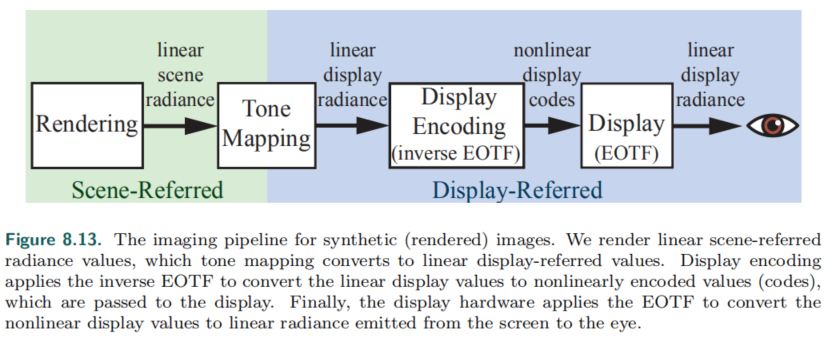

==关于色调映射的目的有几个常见的误解==。它并不是要确保：场景到屏幕的变换是一种身份变换`identity transform`，在显示器上完美地再现场景辐射值`radiance values`。它也不是要把场景的高动态范围HDR的每一个信息都 "挤 "到显示器的低动态范围，尽管考虑场景和显示器动态范围之间的差异确实起到了重要作用。

==为了理解色调映射的目的==，最好把它看作是一种图像复制。The goal of image reproduction is to create a display-referred image that reproduces—as closely as possible, given the display properties and viewing conditions—the perceptual impression that the viewer would have if they were observing the original scene。（个人总结：图像复制的结果应该给予观看者，和原始图像一样的观看体验），如下图：

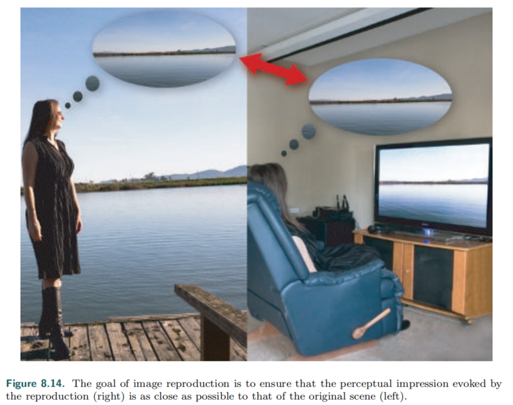

但考虑到场景的亮度范围要超过显示器几个数量级，所以完美的复制是困难的；此外，场景中一些颜色的饱和度也可能远远超过硬件显示能力。尽管如此，摄影、电视和电影确实能够像文艺复兴时期的画家一样，制作出令人信服的原始场景的画像。通过利用人类视觉系统的某些特性，这一目标成为了可能。

==视觉系统对绝对亮度的差异进行补偿，这种能力称为适应==`adaptation`。由于这种能力，在昏暗的房间里，屏幕上室外场景的再现，可以产生与原始场景相似的感觉——尽管再现的亮度不到原始场景的1%。然而，==适应所提供的补偿是不完善的==。亮度较低时，可感知的对比度会降低（史蒂文斯效应`the Stevens effect`），正如感知到的“色彩 colorfulness”一样（`the Hunt effect`）。

> 对比度指的是一幅图像中明暗区域**最亮的白和最暗的黑**之间不同亮度层级的测量，差异范围越大代表对比越大，差异范围越小代表对比越小

其他因素也会影响实际感知到的重现对比度。显示屏的周围（显示外的亮度，例如，房间的亮度）可能会增加或减少感知的对比度（`Bartleson-Breneman`效应）。==Display flare==是指添加到显示图像上的不需要的光 via display imperfections or screen reflections，相当程度上降低了图像的实际对比度。这些效果意味着，如果我们想要保持与原始场景相似的感知效果，==我们必须提高显示图像的对比度和饱和度==.。

然而，==对比度的提高恶化了一个已经存在的问题==。由于场景的动态范围通常比显示的范围大得多，我们必须选择一个狭窄的亮度值窗口来重现，该窗口的above和below被设为black和white。==提高对比度进一步缩小了这个窗口==。为了部分抵消暗部和亮部的裁剪，使用柔和的滚屏`roll-off`来恢复一些阴影和高光细节。

==所有这些都导致了一个sigmoid（S型）的色调再现曲线==` tone-reproduction`，类似于`photochemical film`中的。这并非偶然，柯达公司的研究人员精心调整了`photochemical film emulsion`的特性，来产生有效的和令人愉悦的影像再现。由于这些原因，"filmic "这个形容词经常在讨论色调映射时出现。

==曝光的概念是色调映射的关键==。在摄影中，曝光是指：控制照射在胶片上的光量。然而，在渲染中，曝光是：在应用**色调还原变换**`tone reproduction transform`之前，对图像进行线性缩放操作。曝光的棘手之处在于：确定使用什么比例因子。

> Tone transforms are typically designed with the expectation that they will be applied to scene-referred images that have been exposed a certain way.

==全局色调映射==`global tone mapping`：通过曝光缩放，然后进行色调再现变换，其中映射应用于所有像素。相反，局部色调映射根据周围像素和其他因素，在像素之间使用不同的映射。==实时应用几乎只使用全局色调映射==（有少数例外），所以我们将重点讨论这种类型，先讨论色调再现变换，然后讨论曝光问题。

重要的是要记住场景相关图像和显示相关图像是根本不同的。==物理操作仅在对场景相关执行时有效。由于显示的色域限制和我们所讨论的各种感知效果，总是需要在两种图像状态之间进行非线性变换。==

#### Tone Reproduction Transform

色调再现变换通常是一维的曲线，将场景相关的图像值映射到显示相关上。这些曲线既可以处理R、G、B三个独立的通道，也可以处理亮度 `luminance`。在前一种情况下，结果将自动在显示色域内，因为每个显示相关的RGB通道值都在0到1之间。然而，在RGB通道上执行非线性操作（尤其是裁剪），==除了需要的亮度变化外，还可能导致饱和度和色相的变化==`saturation and hue`。（为什么会有？明显，==这三者是之前的XYZ系统==）

==饱和度的变化==是有益的，然而，==色相偏移==`hue shifts`通常被认为是不可取的，现代色调变换` tone transforms`试图通过在色调曲线之后，应用额外的RGB调整来减少它们。通过将色调曲线应用于亮度，可以避免色相和饱和度的偏移（至少减少了）。但是，显示引用的颜色可能超出了显示的RGB色域，在这种情况下，需要将其映射回去。

==Reinhard tone reproduction operator==是早期用于实时渲染的色调变换之一。它留下大部分较暗的值不变，而较亮的值渐近到白色。Drago等人提出了一种有点类似的色调映射算子，它可以调节输出显示的亮度，这使其更适合HDR显示。后续更多相关技术，详见 书 P287。

==ACES==`Academy Color Encoding System`是一项建议标准，用于管理电影和电视行业的color。ACES将转换分为两个部分。第一个是参考渲染转换`reference rendering transform`(==RRT==)——在设备中立输出空间``output color encoding specification`（OCES）中，将场景引用的值转换为显示引用的值。第二部分是输出设备转换`output device transform`==ODT==，它将OCES中的颜色值转换为最终的显示编码。有许多不同的ODT，每一个都为特定的显示设备和查看条件而设计。H神建议：为同时支持SDR和HDR显示的应用程序使用ACES`tone mapping transforms`。

尽管ACES是为电影和电视设计的，但在实时应用中的使用越来越多。ACE色调映射在Unreal引擎中是默认启用的，Unity引擎也支持它。==HDR显示器使用色调映射需要小心，因为它可能有内置的色调映射==。有关寒霜引擎的色调映射，详见书 P 287。

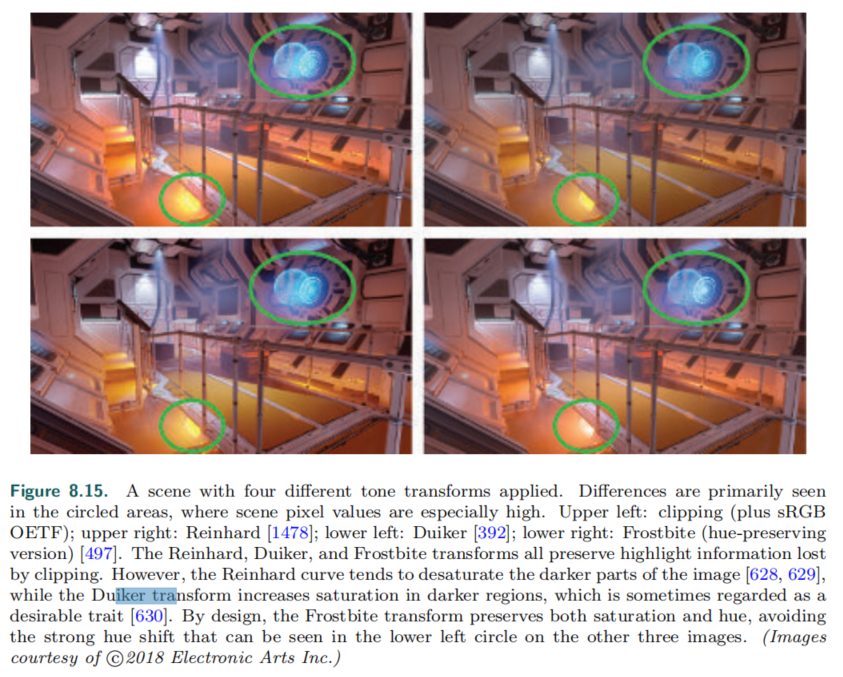

#### Exposure（曝光）

A commonly used family of techniques for computing exposure relies on ==analyzing the scene-referred luminance values.== To avoid introducing stalls, this analysis is typically done by sampling the previous frame.

根据R神的建议，早期实现中使用的一个指标是：==对场景亮度进行对数平均==。通常，曝光量是通过计算帧的对数平均值来确定的。这个对数平均值通过执行一系列的 down-sampling post-process来计算，直到计算出最终值。

==平均值往往对离群值过于敏感==，例如，少量的明亮像素可能会影响整个帧的曝光。==使用亮度值的直方图改善了这个问题==。直方图允许计算中值，而不是平均数，这更加稳健。

目前计算曝光得一个问题是：使用的是物体表面反射出的光。在摄影中，使用入射光` incident light meters`来设置曝光，很明显，最好是==单独使用照明（没有表面反照率的影响）来确定曝光==。这样做是可行的，因为在最初的近似情况下，==摄影曝光是用来抵消光的==——其结果是：打印出的主要是物体表面的颜色，这与人类视觉系统的颜色稳定性`color constancy`相一致

虽然这种方法在实时应用程序中还不常见，但已经开始使用了。例如，游戏《合金装备5:Ground zero》就有一个基于光照强度的曝光系统。大部分游戏的曝光都是根据已知的场景灯光手工设置的。

#### Color Grading（颜色分级）

preferred image reproduction（更好的图像重建）：产生在某种意义上比原始场景更好的图像。通常，这涉及图像色彩的创造性处理，这一过程称为==色彩分级==`Color Grading`。

数字色彩分级`Digital color grading`在电影行业已经应用一段时间了，色彩分级通常通过交互操作，来调整图像中的颜色，直到达到所需的外观。然后在一个镜头，或序列中的所有图像上重新应用相同的操作序列。

==具体的一个使用流程==：S神 shows how to “bake” arbitrary color transformations from ==a color grading== or image editing application into a three-dimensional color lookup table (==LUT==，颜色查找表)。这个表的使用方法——用颜色的RGB作为XYZ坐标，在表中获取对应位置的颜色。最初，是一个单位LUT（输入和输出，颜色一致），然后切割它来创造一个二维表；之后，在这张二维LUT中载入`color grading`程序，将一系列产生目标图像的操作应用在它身上。唯一需要注意的是：==在LUT上应用颜色操作时，避免空间操作，比如模糊==。最后，将LUT打包到一个三维的GPU纹理中，并在渲染应用程序中，对渲染的像素应用相同的颜色转换。（减少采样错误的方法： least-squares minimization最小二乘法）

在最近的应用中，S神将颜色分级划分成了两类，一类是在display-referred image data上应用，一类是在 scene-referred data上应用。前者更加容易实现，但后者产生的图像质量更高。而且对于后者（场景相关），我们还可以将色调映射也烘焙到LUT中，减少计算成本。

在LUT查找之前，场景参考数据`scene-referred data`必须重新映射到[0，1]的范围。在Frostbite引擎中，感知量化器` perceptual quantizer`OETF被用于这个目的。Duiker使用对数曲线，Hable推荐使用一次或两次的平方根算子。Hable对常见的颜色分级操作和实现注意事项进行了很好的概述。

## Further Reading and Resources

For ==colorimetry and color science==, the “bible” is Color Science by Wyszecki andStiles [1934]. Other ==good colorimetry references== include Measuring Colour by Hunt [789] and Color Appearance Models by Fairchild [456].

Selan’s white paper [1602] gives a good overview of ==image reproduction== and the==“scene to screen” problem==. Readers who want to learn still more about this topic will find The Reproduction of Colour by Hunt [788] and Digital Color Management by Giorgianni and Madden [537] to be excellent references. 

The three books in the Ansel Adams Photography Series [9, 10, 11], especially The Negative, provide an understanding of how ==the art and science of film photography== has influenced the theory and practice of image reproduction to this day. 

Finally, the book Color Imaging: Fundamentals and Applications by Reinhard and others [1480] gives a thorough overview of ==the whole area of study==