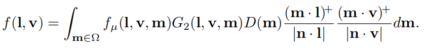
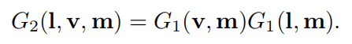
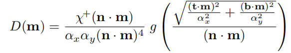
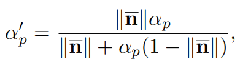

# Chapter 9——Physically Based Shading

[toc]

## 1.  Physics of Light

==光和物质的相互作用形成了PBS的基础==。为了理解这些相互作用，对光的本质有一个基本的理解是有帮助的。在==物理光学==中，光被建模为电磁横波`transverse wave`——一种使电场和磁场垂直于其传播方向的波。这两个场的振荡是耦合的（ coupled）。磁场和电场矢量相互垂直，它们的长度之比是固定的（这个比值等于相速度` phase velocity`，==通常称其为光速c==）

下图是一个最简单的光波——一个完美的Sin曲线。这种波只有一个波长，用$\lambda$表示。单波长的光叫做单色光`monochromatic light`。然而，实际中遇到的大多数光波是多色的，包含许多不同的波长。在另一方面，单色光也是非常简单——它是`linearly polarized`的（偏振的）。这意味着，在空间的一个固定点上，电场和磁场都沿着一条线来回移动。相反，在这本书中，我们关注的是==更普遍的非偏振光==——在非偏振光中，场振荡` the field oscillations`均匀地分布在所有方向（垂直于传播轴的）上。尽管它们很简单，但==理解单色线性偏振波的行为是有用的，因为任何光波都可以分解成这些波的组合==。

波长`wavelength`通常多大呢？可以拿蜘蛛丝和头发来对比：

光波携带能量，能量流的密度等于电场和磁场的乘积，由于磁场和电场成比例，所以也就是与电场的平方成比例。==我们关注电场==，因为它对物质的影响比磁场强得多。==在渲染中，我们关注的是随时间的变化的平均能量流，这与波振幅的平方成比例==。==这个平均能量流的密度就是辐照度E==。==光波线性结合==——总波是各分量波的和。然而，由于辐照度与振幅的平方成比例，这似乎会导致一个==悖论==。两个相等的波相加，不会导致“1 + 1 = 4”的情况吗？既然辐照度E度量的是能量流，这不会破坏能量守恒吗？这两个问题的答案是：分别是==“有时”和“不”==。

为了说明，举一个简单的例子：n个单色波的加法，除了相位相同之外。每n波的振幅为a。如前所述，每一波的辐照度E~1~与$a^2$成正比，换句话说：$E_1 = ka^2$。见下图，n个单色波相加的三种情况，左边的情况是`constructive interference`，中间是`destructive interference`。这两个都是`coherent addition`（相干叠加）的特殊情况，所以第一个问题的答案是"有时"。

但大多数情况（上图右），波的叠加是不相干的`incoherent`，在这种情况下，组合波的振幅是√n，每个波的辐照度加起来，线性地等于初始辐照度的n倍。但只按照上图左、中，似乎不满足能量守恒，但是上诉是知识空间某个位置的情况，随着位置移动，相位会发生变化，如下图：（这并不违反能量守恒定律，因为通过相长干涉获得的能量和通过相长干涉损失的能量总是可以抵消掉）

光离开光源后，在空间中遨游，直到遇到和其交互的物质。==光-物交互的核心理论是简单的==：振荡的电场对物质中的电荷进行推拉，使它们依次振荡；振荡的电荷发射出新的光波，使入射光波的部分能量定向到新的方向。==这也就是各种渲染理论的基础——散射==`scattering`。

散射的光波与原波的频率相同。通常情况下，当原波包含多个频率的光波时，每个频率的光波都会分别与物质发生作用（也只会对相同频率的出射光产生影响），除了荧光和磷光，我们在本书中不会介绍。

在渲染中，我们关注的是分子的集合。集合体的相互作用与孤立分子的相互作用不一样。从附近的分子散射出来的波通常是相干的，因此表现出干扰，因为它们来源于同一个入射波。The rest of this section is devoted to several important special cases of light scattering from multiple molecules。

### 1.1 Particles

==在理想的气体中，分子通常不会相互影响==，它们的相关位置是完全随机和无关的。在这种情况下，不同分子散射的波之间的相位差是随机的，并且不断变化。因此，它们的能量线性增加，如图9.3的右部。相反，如果分子紧密地挤在比光的波长小得多的团簇中，散射光的波长是同相位的，此时，能量平方增加，如图9.3的左部。

这个解释了为什么云和雾如此强烈地散射光线。它们都是由凝结产生的——空气中的水分子聚集成越来越大的团簇，这大大增加了光的散射。

当讨论光散射时，粒子`particles`用于指孤立的分子和多分子团簇。由于来自多分子聚簇（直径小于波长）的散射是来自孤立分子的散射的放大，它表现出相同的方向变化和波长依赖性。这种类型的散射在大气粒子中称为`Rayleigh scattering`，在固体颗粒中称为`Tyndall scattering`。当粒子越来越大，散射光的波长依赖性越来越低，这种类型的散射称为`Mie scattering`。

### 1.2 Media

另一个重要的情况是==光通过均匀介质传播==，均匀介质包括：晶体，不含杂质、无缝隙的液体和其它固体。在均质介质中，散射波在除原传播方向外的所有方向上都发生破坏性干扰`interfere destructively`。原始波与各个分子散射的波结合后。除了相位速度和（在某些情况下）振幅之外，==最终结果与原始波相同，不表现出任何散射效应==。

旧波和新波的相速度之比，构成了介质的一个光学属性，`index of refraction`（==IOR==、折射率，用n表示）。有些介质具有吸收性，其中的光，随着距离的不断深入，强度逐渐衰减——下降的速率被称为`attenuation index`（用 $\kappa$ 表示）。这两者通常组合起来，$n+i\kappa$，称之为==复折射率==`complex index of refraction`。折射率将分子层面上，光与介质相互作用的细节抽象出来，and enables treating the medium as a continuous volume, which is much simpler。

==非均匀介质通常可以被模拟为：在均匀介质中嵌入散射粒子==。 Such a localized change can be a cluster of a different molecule type, an air gap, a bubble, or density variation。在任何情况下，就像前面讨论的粒子一样散射光，其特性同样依赖于聚簇团的大小，甚至气体也可以用这种方法建模。下图是几个散射`scattering`的例子：

散射和吸收`absorption`都是大小相关的。小场景中，某些介质（水、空气）的视觉效果不明显，但在大场景中就特别重要（如下图所示）

介质的亮度是这两种现象的综合结果。特别是白色——高散射和低吸收结合的结果

###  1.3 Surface

相比介质内部的缝隙和密度不均匀，物体表面（不同介质的交界处）是一种特殊的、导致散射的“不连续”情况。边界条件要求平行于表面的电场是连续的，换句话说：the projection of the electric field vector to the surface plane must match on either side of the surface。==这有几个含义==：

- 在表面上，散射波的波峰必须与入射波的波峰或波谷对齐。这就限制了散射波只能向两个可能的方向传播，一个继续进入表面（折射光），另一个离开表面（反射光）。
- 散射波必须与入射波具有相同的频率。
- 相速度`phase velocity`和相对折射率(n1 / n2)成比例变化。由于频率是固定的，所以波长也按比例变化为(n1/n2)。

折射光的角度和入射光的角度之间的关系：(==Snell’s law==)
$$
sin(\theta_t)=\frac{n_1}{n_2}sin(\theta_i)
$$

==不透明物体也存在光的折射==。比如：对于金属而言，内部包含很多自由电子，它们会吸收折射光，并将光重定向到反射光上，所以，金属同时具有和高吸收性和高反射性。

目前我们讨论的折射内容，都是在IOR上进行突变（发生在小于一个波长的距离上的）。而==一个渐变的IOR== ，不会切割光的传播路径，但是会扭曲它的传播。这个效果通常见于空气密度会因温度而变化的情况，例如：海市蜃楼和热变形（如下图）

如果一个物体的表面没有IOR的变化，那么折射和反射都不发生，它就是不具有` visible surface`（下图书中的小球具备一定的可见性，是由于它对光的吸收性）

​	除了表面的IOR区别，==另外一个影响表面的因素==是` geometry`。比波长小得多的表面不规则性` irregularities`对光没有影响，而比波长大得多的不规则性倾斜表面，而不影响其局部平整度；只有波长在1-100范围内的不规则现象，才会通过一种叫做衍射`diffraction`的现象使表面表现出与平面不同的行为。我们将在后面进一步讨论这种现象（C 9.11）

在渲染中，我们通常使用==几何光学==（以上都是物理光学），忽略了波的影响，如干涉和衍射。在几何光学中，光被建模成光线`Ray`，而不是波`wave`。回到本章和上一段提到的情况，也就是所谓的微观几何`microgeometry`，在渲染中，我们是直接处理的，例如BRDF中的几何项G——表面具有随机分布的微观法线，因此，我们沿连续方向扩散反射（和折射）光。扩展的宽度，以及反射和折射细节的模糊程度，==取决于微观几何法向矢量的统计方差==——换句话说，表面的微尺度粗糙度`roughness`。

###  1.4 Subsurface Scattering

正如之前所言，金属反射大部分光，并快速吸收剩下的光；而非金属物体则在这两方面表现各不相同。在这一章中，将集中讨论不透明的物体，在这些物体中，透射光经过多次散射和吸收，直到最后一部分光从表面重新发射回来。

距离（出点和入点间的）和阴影尺度（像素的大小，或采样之间的距离）之间的关系很重要。==如果这个entry-exit距离小于后者==，表面下的散射与表面反射结合成一个局部着色模型，在一个点上发出的光只依赖于同一点上的入射光。 The `specular term` = models surface reflection, and the `diffuse term` models = local subsurface scattering；否则，就需要考虑，其它点的散射对某点的影响了——也就是所谓的`global subsurface scattering `。（至于次表面散射是使用局部，还是全局，则取决于物体的材质和观察尺度，更多技术见书 C 14）。

## 2. The Camera

渲染的图像系统包含一个由许多离散的小传感器组成的传感器表面。辐照度传感器本身不能产生图像，因为它们平均来自所有入射方向的光线。因此，一个完整的成像系统包括：带有==光圈==`aperture`的防光==外壳==`enclosure`，用来限制光线进入和撞击传感器的方向。放置在光圈处的==透镜==`lens`可使光线聚焦，从而使每个传感器只接收一小部分方向的光线。外壳、光圈和透镜的共同作用，使传感器具有`directionally specific`（特定的方向性）。因此，==相机只对一小部分区域的一部分入射光进行平均处理==。

渲染中模拟的简单图像传感器，叫做==针孔相机==`pinhole camera`。这种相机有着理想化的光圈，近似一个没有尺寸概念的点，而且没有透镜。当然，渲染实际使用还要对其进行修改——设定一个`camera position`来代表针孔相机的位置，如下图中:arrow_down:

尽管针孔相机的建模较为成功，但效果相对人眼，是不够好的，上图下:arrow_up:，加了一个透镜，这样采样了更多的光，且允许增大光圈，但这会对相机的深度造成限制——过近、过远的物体都会被模糊，当然，大部分情况，我们就是需要这种效果，也就是常说的==景深==。

## 3. The BRDF

==根本上，基于物理的渲染是为了计算沿着一组ray到达相机的辐射率==`radiance`，对于每一个Ray，我们需要计算$L_i(c,-v)$，其中，c是相机的位置，v是相机指向渲染点的向量。我们在渲染中，对于物体所处环境的介质 ，常见的考虑是对光无影响的纯净空气；当然也可以考虑那种会散射或吸收光的介质`participating media`，这种情况的考虑，见书 P C 14。因此在本章的考虑下，有如下关系：(p是视线和最近物体的交点)
$$
L_i(c,-v)=L_o(p,v)
$$
 首先，我们不考虑透明物体和全局次表面散射，而专注于局部反射现象，包括：==表面反射和局部次表面散射==，且只依赖于入射光方向l，出射视线方向v。这些可以通过`bidirectional reflectance distribution function`（BRDF）进行量化，公式中写为$f(l,v)$。

早期的实现中，由于物体的表面通常被设定成参数一致的，所以BRDF是常数，但是真实世界中，则很少有这种物体。技术上，基于空间位置的BRDF变体，称为`spatially varying BRDF` (==SVBRDF==) or spatial BRDF (SBRDF)，However, this case is so prevalent in practice that the shorter term BRDF is often used and implicitly assumed to depend on surface location。

出射和入射方向通常都是双自由度的：相对表面方线的仰角`elevation `，方位角` azimuth`。==一般情况下，BRDF包含四个标量变量==。各向同性BRDFs`Isotropic BRDFs`是其中一个重要的特例，其特点是：入射方向和射出方向绕表面法线旋转时，这种BRDFs保持不变，保持它们之间的相对角度相同。因此，这种BRDF只有三个变量，因为光线和相机之间只有一个角度$\phi$需要。（不需要$\phi_i或\phi_o$）

> What this means is that if a uniform isotropic material is placed on a turntable and rotated, it will appear the same for all rotation angles, given a fixed light and camera.

因为我们忽略荧光和磷光，可以假设出射光和入射光的波长是一致的。反射光量可以根据波长的不同而变化，这==可以用两种方式来建模==：波长被当作BRDF的一个额外输入变量，或者BRDF返回一个频谱分布的值。第一种方法常见于离线渲染，而第二种则是实时渲染。此时，可以有反射方程：
$$
L_o(p,v)=\int_{I\in \Omega}{f(l,v)L_i(p,l)(n\cdot l)dl}
$$
我们可以将进行采样的半L_o(\theta_o)球参数化，用球坐标表示上诉公式：
$$
L_o(\theta_o,\phi_o)=\int_{\phi_i=0}^{2\pi}{\int_{\theta_i=0}^{\pi/2}{f(\theta_i,\phi_i,\theta_o,\phi_o)L(\theta_i,\phi_i)cos\theta_isin\theta_id\theta_id\phi_i}}
$$
也可以使用更加不同的参数化，使用$\mu_i=cos\theta_i,\mu_o=cos\theta_o$

跟Phong模型一样，我们需要考虑，视点在表面以下的情况，即$n\cdot v<0$（主要由法线引起）。简单的clamp会导致`artifacts`，寒霜引擎的解决思路是加上一个小值（0.00001），来避免除零错误。另一个解决思路是`soft clamp`。==物理定律对任何BRDF都有两个限制==：

- `Helmholtz reciprocity`：即使输入和输出角度切换，函数值也是相同的——$f(l,v)=f(v,l)$。在实践中，用于渲染的BRDFs通常会违反这个限制，但不会出现明显的`artifacts`，除了特别需要互易性`reciprocity`的离线渲染算法，如双向路径跟踪`bidirectional path tracing`。
- `energy`：第二个限制是能量守恒，出射光的能量不能大于入射光，无需像离线渲染（如：路径追踪）那么精确，==对于实时渲染，精确的能量守恒是不必要的，但是近似的能量守恒是重要的==。用BRDF渲染的表面明显违反了能源节约，会太亮，导致看起来不现实。

`directional-hemispherical reflectance`==R(l)是一个和BRDF有关的函数，用来测量BRDF的节能程度==。本质上，它测量的是，从指定方向来的入射光，在表面法线的半圆上朝各个方向反射的光量。定义如下：
$$
R(l)=\int_{v\in \Omega}f(l,n)(n\cdot v)dv
$$
`hemispherical-directional reflflectance`，类似但在某种意义上相反的功能，其定义R(v)如下：
$$
R(v)=\int_{l\in \Omega}f(l,n)(n\cdot l)dl
$$
If the BRDF is reciprocal，这两者是相等的。在这两种反射率可互换使用的情况下，==方向反照率==`Directional albedo `可作为这两种反射率的总称。==BRDF节能的要求是，对于l的所有可能值，R(l)不大于1==。

朗伯模型`Lambertian shading model`是最简单的BRDF（常数），常用来计算` local subsurface scattering`，这时，可以计算得到：
$$
R(l)=\pi f(l,v)
$$
郎伯BRDF的恒定反射率值通常称为`diffuse color`$c_{diff}$或者`albedo`$\rho$。本节为了体现和次表面散射的相关性，将其称为`subsurface albedo`$\rho_{ss}$。所以：
$$
f(l,v)=\frac{\rho_{ss}}{\pi}
$$
==在半球上对cos求积分得到$\pi$，这解释了分母==。这些因素经常出现在BRDFs中。理解BRDF的一种方法是：在保持输入方向不变的情况下可视化它，如下图（几个模型的可视化结果，==经典==）。

## 4. Illumination

全局关照算法`Global illumination`（==GI==）通过模拟光在整个场景的传播和反射来计算$L_i(l)$。这些算法使用渲染方程，其中反射方程是一种特例。GI将在后面介绍，这里主要讨论`local illumination`。在局部光照中，$L_i(l)$直接给出，而不需要计算。同时，这里只考虑` punctual lights`，不考虑区域光

考虑光源` directional light`(区域光的面积无限小)，其光线为l~c~，颜色为正对着光源的白色郎伯平面的反射辐射率。那么可以得到如下公式：
$$
L_o(v)=\pi f(l_c,v)c_{light}(n\cdot l_c)^+
$$
对于`Punctual lights`，唯一的区别是：不能考虑无限远的情况，c~light~随着距离平方的倒数下降。
$$
L_o(v)=\pi\sum_{i=1}^n{f(l_{c_i},v)c_{light_i}(n\cdot l_{c_i})^+}
$$
结合之前的公式，$\pi$可以消掉，这样就从渲染方程中删去了除法操作。然而，必须注意的是，在论文向实际商业使用的过渡中，一般情况下，BRDF在使用前需要与$\pi$相乘。

## 5. Fresnel Reflectance

==光与平面（两种物质之间的）的相互作用遵循菲涅尔方程==`Fresnel equations`。根据几何光学的假设，菲涅耳方程需要一个平面界面，且不考虑会影响光的` irregularities`。

:arrow_up:反射光的量（作为入射光的一部分）由==菲涅耳反射率==`Fresnel reflectance`F描述，它取决于入射角$\theta_i$。==菲涅耳方程描述了F对$\theta_i$、n~1~和n~2~的依赖关系==。我们将描述它们的重要特征，而不是给出复杂的方程。

### 5.1  External Reflection

`External reflection`，从折射率较低的物质，传播到折射率ROI较大的物质。`internal reflection`则相反。对于给定的物质，菲涅耳方程可以解释为：一个只与入射光角度有关的反射函数F。原则上，==F的值在可见光谱上是连续变化的==。出于渲染目的，它的值被视为RGB向量。函数F具有以下特征：

- 当$\theta_i=0^o$时，F~0~被认为是该物质的特殊高光颜色，这种情况被称为`normal incidence`。
- 随着$\theta_i$变大， the light strikes the surface at increasingly glancing angles，$F(\theta_i)$也变大。当$\theta_i=90^o$时， reaching a value of 1 for all frequencies。

如下图:arrow_down:。这是几个物质（玻璃、铜和铝）的菲涅尔可视化。可以看出是高度非线性化的——前期几乎没有变化，直到75^o^左右，突增到1。

==容易想到，反射最强烈的部分在物体边缘，而从摄像机的角度来说，这个部分则占据了相对较少的像素==。此外，我们可以看到，上诉曲线图:arrow_up:使用的是Sin值作为横坐标（讲真，没看出来），而不是直接的角度。而下图:arrow_down:解释了为什么：

渲染程序中，在掠射角附近，反射率增加的现象叫做`Fresnel effect`。而在渲染中，直接使用菲涅尔方程是困难的（方面有很多，比如：它要求我们对可见光谱进行采样，获得折射率）。==Schlick给出了菲涅耳反射系数的近似==：（这个函数明显是：在F~0~和white间进行插值，简单但精确）
$$
F(n,l)=F_0+(1-F_0)(1-(n\cdot l)^+)^5
$$
下图:arrow_down:是近似的拟合效果，一共测了六个物质。 Gulbrandsen提出的方法在金属上表现效果极佳；Lagarde对各个近似技术做了个总结；对Schlick方法最简单的扩展，就是允许5以上的次幂。

F~0~可以通过折射率来进行计算，在考虑环境介质是空气的情况（物体的IOR为n），则可通过下述公式进行计算:arrow_down:
$$
F_0=(\frac{n-1}{n+1})^2
$$
==更一般的菲涅尔近似方程如下==：
$$
F(n,l)\approx F_0+(F_{90}-F_0)(1-(n\cdot l)^+)^{\frac{1}{p}}
$$
分析可知，这个公式具有更多的可控性，比如菲尼尔效应颜色的控制（F~90~）和“sharpness” of the transition（1/p的次幂）。

### 5.2 Typical Fresnel Reflectance Values

介质主要分为三类：电介质（绝缘体）、金属（导体）、半导体（性质介于前两者之间）。

##### Fresnel Reflectance Values for Dielectrics

==电介质的F~0~通常比较低，一般不大于0.06（未知材料，默认取0.04）==。其光学性质在可见光谱上很少有大的变化，resulting in colorless reflectance values。下表:arrow_down:给出了常见电介质的F~0~，其值是标量而不是RGB——因为这些材料的RGB通道没有显著差异。

##### Fresnel Reflectance Values for Metals

金属则拥有较高的F~0~，一般不小于0.5。其光学性质在可见光谱上，一般会有大的变化，resulting in colored reflectance values。下表:arrow_down:给出了常见金属的F~0~。

金属会立即吸收任何透射光，因此它们不会表现出次表面散射或透明的效果。金属的所有可见颜色都来自F~0~。

##### Fresnel Reflectance Values for Semiconductors

==出于实际目的，F~0~应该避免取0.2到0.45之间，除非要建模一个不现实的材料。==

##### Parameterizing Fresnel Values

这里进行的参数化，要考虑两个方面，一个是这里的高光颜色F~0~，一个是之前提到的漫反射颜色$\rho_{ss}$。具体的参数化：设定一个`surfce color`& c~surf~ 和 金属度`metallic`& m，然后：

+ 如果m=1，c~surf~=F~0~，$\rho_{ss}$=black
+ 如果m=0，c~surf~=$\rho_{ss}$，F~0~=black

==这种参数化技术的缺点==在于：特殊材料无法体现（拥有彩色F~0~的电介质）；电介质和金属的交界处可能会出现`artifacts`。

==另外一种参数化技术==（书上也没说叫啥），主要依据的事实是：除了特殊的抗反射材料，几乎所有材料的F~0~都不低于0.02。The trick is used to suppress specular highlights in surface areas that represent cavities or voids。具体：不是使用单独的`specular occlusion texture`，而是设置低于0.02的F~0~，来"关闭 "菲涅尔效应。这项技术已经应用在虚幻和寒霜上。

###  5.3 Internal Reflection

以上讨论的都是渲染中常用的`External Reflection`，但`Internal Reflection`有时也很重要。这种情况，具体来说是：当光线在透明物体内部传播时，就会“从内部”接触到物体表面，从而发生内部反射。

由于折射角始终大于反射角，所有就会产生一个临界值$\theta_c$——大于它之后，所有光都被反射，折射为0。（$\theta _i=\theta_c\rightarrow sin\theta_t=1\rightarrow\theta_i>\theta_c,sin\theta_t>1,error $）此时的现象被称为==全反射==`total internal reflection`。

而对于内部反射的菲涅尔方程，根据其对称性，应该和外部反射的情况类似，更具体的说，是外部方程的压缩——==在$\theta_c$，而不是90^o^上达到最大值==，如下图:arrow_down:。换一个角度考虑，内部反射的平均反射率更高（毕竟更早到达极大值），这解释了：为什么在水下看到的气泡具有高度反光的银色外观。

内部反射通常发生在电解质中，毕竟金属和半导体具有极高的吸收特性。其临界角可以如此计算：

## 6. Microgeometry（微观几何）

我们仍停留在几何光学领域——假设这些不规则性要么小于光的波长（因此对光的行为没有影响），要么要大得多。

> 两个微观尺度：
>
> + 基于光波的大小。物体表面的不规则变化相对光波的尺寸，主要考虑的是光的干扰和衍射，区分的是物理光学和几何光学。（表面不规则性的尺寸大于一个`wave lenghth`，小于100倍的`wave length`）
> + 基于像素的大小。散射入口和出口的距离大于一个像素，主要考虑的是全局次表面散射。
> + 微平面理论。基于像素，考虑小于一个像素的不规则性——法线和自遮挡。

每个可见表面点包含许多==微表面法线==，这些微表面法线将光反射到不同的方向。对于大多数表面，微观几何的表面法线分布是连续的，在宏观表面法线处有一个峰值。这种分布的“紧密性”由表面粗糙度` roughness`决定。==表面越粗糙，微观几何法线就会越“铺开”==

==对于大多数表面，微表面法线的分布是各向同性的==`isotropic`，这意味着它是旋转对称的，缺乏任何内在的方向性。也有些表面是各向异性`anisotropic`，如下图:arrow_down:

==高度结构化的微表面法线分布会导致一些奇特的渲染效果，例如：织物效果==`Fabrics`（具体见本节 10）。虽然多重表面法线`multiple surface normals `是微几何对反射率的主要影响，但其他作用也可能是重要的。（例如：下图左、右的`shadow`、`masking`）

==如果微观几何高度与表面法线有一定的相关性，那么阴影shadow和掩蔽Masking可以有效地改变表面的正态分布==。例如:arrow_down:，想象一个表面，凸起的部分由于风化而变得光滑，而较低的部分仍然是粗糙的。在掠视角度，表面较低的部分将趋向于被阴影或遮蔽，从而产生一个有效的光滑表面。

==对于所有的表面类型，表面不规则的可见尺寸随着入射角度的增加而减小==。目前为止，我们已经讨论了微观几何对镜面反射率的影响。在某些情况下，微表面细节也会影响`subsurface reflectance`。如果微观几何不规则性大于`subsurface reflectance distance`，==那么阴影和掩蔽会导致逆光反射效果==`retroreflection`，光线会优先反射回入射方向。

## 7. Microfacet Theory（微平面理论）

大多数BRDF模型都是基于微表面对反射的影响的数学分析，进行建模的。这种数学分析就是微平面理论`Microfacet Theory`。 The theory is based on the modeling of microgeometry as a collection of microfacets。

==主要原理：表面由很多微面元组成，每一个微面元都是平面，都有一个单独的微法线==；微表面根据micro-BRDF f~u~(l, v, m)反射光线，所有微面元的反射系数加在一起，就构成了整个表面的BRDF。通常的选择是：每个微面都是一个完美的菲涅尔镜面`Fresnel mirror`，从而产生一个==specular微面BRDF==，来对反射进行建模。

> However, other choices are possible. ==Diffuse micro-BRDFs== have been used to create several local subsurface scattering models . A ==diffraction micro-BRDF== was used to create a shading model combining geometrical and wave optics effects。

##### NDF

微平面理论的一个重要性质就是：==微观法线的统计分布== [over the microgeometry surface area ]。这种分布可以通过==normal distribution function==（NDF，D(m) ）进行描述。仅对D(m)求球面积分，可以得到微表面区域的面积；对D(m)(n*m)求球面积分，可以得到投影面积，一般默认等于1:arrow_down:。需要注意的是，这里求积分都是在整个球域上，而不是之前的半球。

更一般地说，在垂直于视线方向v的平面上，微观表面和宏观表面的投影是相等的:arrow_down:。

直观地说，==NDF就像是微面法线的直方图==。==它在微面法线更可能指向的方向上具有高值。大部分表面都有NDFs==。

##### Masking Function

可见微面的投影面积之和等于宏观表面的投影面积。我们可以通过定义masking函数G~1~(m, v)来数学地表达这一点。結合上面的NDF，求球面积分，可得到：可见微表面在视线垂直平面上的投影面积。$G_1(m,v)\cdot D(m)$就是所谓的`distribution of visible normals `。

Masking函数是NDF的一个约束。对于NDF而言，这种约束有很多。本质上，它告诉我们有多少法线指向方向m的微平面，但不会告诉我们：它们是如何排列的。

H神提出了==Smith Masking==函数，该函数最初是为高斯正态分布推导的，后来推广到任意NDFs。他指出，只有==Smith Function和Torrance-Sparrow “V-cavity” function==满足上诉球积分公式，而史密斯公式更接近于随机微表面的行为，且具备`normal-masking independence`——G1(m, v)的值不依赖于m的方向。下面是 Smith G1 function：（不同NDF的$\Lambda(v)$是不同的，具体求法见Walter 、Heitz 的相关文章）

Smith的缺点：从理论角度来看，其要求与实际表面的结构不一致，甚至在物理上是不可能实现的。从实际的角度来看，虽然它对于随机表面来说，是相当精确的，但是对于法线方向和Masking之间有较强依赖性的表面（特别是表面有一些重复的结构的情况，如毛皮），其精度会降低。

给定一个微观几何描述，包括：micro_BRDF f~u~(l,v,m)，NDF D(m)，Masking Function G~1~(m,v)，==宏观表面的BRDF可以推导如下==：

此时，就不能对表面以下的半球进行采样，所以我们只对上半球进行积分。当然，最引人注目的是替代了G~1~(m,v)的`joint masking-shadowing function`G~2~(l,v,m)。这个函数由G~1~导出，给出了两个`fraction of microfacets`：从视线向量v和光向量l两个角度。通过包含G~2~函数，上诉公式使BRDF能够考虑`Masking`和`Shadow`，但==不能考虑微观面之间的相互反射==（这是所有BRDFs的限制）。

Heitz讨论了G~2~函数的几个版本。==最简单的是可分离的形式==，即：使用G~1~分别评估遮挡和阴影——G~1~(v,m)和G~2~(l,m)，然后乘在一起。

==这种形式相当于：假设掩蔽和阴影是不相关的==。实际上，它们不是这样的，而且这种假设会导致BRDFs过度暗化`over-darkening`。作为一个极端的例子，考虑v=l，合理的情况应该是G~2~=G~1~，而这个公式会导致G~2~=G~1~^2^。

考虑l和v的相对方位角$\phi$，当$\phi=0$时，G~2~=min(G~1~(l,m),  G(v,m))。==这一关系提供了一种通用的方式来解释掩蔽和阴影之间的关系：==

随着$\phi$不断增大，$\lambda(\phi)$从0逼近到1。Ashikhmin等人提出了一个标准差为15^o^的高斯分布(约为0.26弧度)：

范·辛内肯提出了一种不同的拟合函数：

阴影和遮蔽的相关性，可以体现在另外一方面：低处的点，阴影和遮蔽的概率都增大。这种关系用`Smith height-correlated masking-shadowing function`进行描述：

==Heitz还提出了一种结合了方向和高度相关性的Smith G~2~:==

在这些选择中，Heitz推荐了`Smith height-correlated masking-shadowing function`，因为它与不相关形式的成本相似，而且精度更高。==这种形式在实践中使用最广泛==。

一般的micro BRDF并不直接用于渲染。在给定的micro-BRDF参数后，给出一个closed-form解。下一节将展示此类派生的第一个示例。

## 8. BRDF Models for Surface Reflection

当微表面是理想的菲涅尔平面时（一个入射线，只产生一个反射线），容易想到，只有反射方向与视线方向一致时，此入射光线才有贡献（可以理解为`h=m`），如下图，只有红色区域才能被人眼感知到：

此时，对于之前的积分项，可以解的如下结果：（m变成了h，这是因为m=h时，才有贡献）

### 8.1 Normal Distribution Functions

法线分布函数是很重要的。在微平面的法线球面上，==NDF决定了反射光线锥的宽度和形状==`the specular lobe`。NDF影响表面粗糙度的整体感知，以及更细微的方面，如高光是否有明显的边缘或 are surrounded by haze。

然而，高光波瓣`the specular lobe`==并不是NDF形状的简单复制==，通常需要需要依据表面曲度、视点角度等进行一定程度的扭曲。掠射角角下，这个特点很明显:arrow_down:。

##### Isotropic Normal Distribution Functions

Beckmann NDF是第一批微表面模型中使用的法线分布。它至今仍广泛使用，也是Cook-Torrance BRDF选择的NDF。标准化的形式如下：

:arrow_up:这个NDF，和将要讨论的NDF一样，都描述了一个高度场微表面` heightfield microsurface`。$\alpha_b$控制表面粗糙度，正比于微表面的方差RMS。Beckmann NDF 是形状不变的，并简化了Λ的推导。根据Heitz的定义，==如果其粗糙度参数的影响等同于缩放(拉伸)微表面，则各向同性NDF是形状不变的==。Shape-invariant NDFs可以写成以下形式：

:arrow_up:其中，g是任意单变量函数。对于一个任意的各向同性的NDF==，$\Lambda$函数的推导依赖两个变量：一个是粗糙度$\alpha$==，一个是 incidence angle of the vector (v or l）。而对于形状不变的NDF，如Beckmann NDF来说，只依赖于参数a，起计算如下：

其中，s是l或v，更进一步，Beckmann NDF的$\Lambda$函数的计算如下：

由于计算高昂（包含erf计算），所以，可以使用以下近似值：

Blinn-Phong NDF在移动设备上依然广泛使用（计算成本低），是对Phong模型的修改：

$\alpha_p$就是粗糙度，高值代表光滑的平面，低值代表粗糙的平面。==但由于它的视觉表现不均匀（非线性），所以对它进行直接操作是不方便的==。因此，通过对一个用户设定的参数进行非线性映射，来推导，例如：$a_p=m^s$，s是一个[0,1]之间的数，而m是$a_p$的上界。

> Such “==interface mappings==” are generally useful when the behavior of a BRDF parameter is not perceptually uniform. These mappings are used to interpret parameters set via sliders or painted in textures

以上两个方法的粗糙度可以通过公式$\alpha_p=2\alpha_b^{-2}-2$进行匹配，此时两者的曲线是很接近的（尤其是光滑平面:arrow_down:）

此外，Phong方法的NDF不是形状不变的，所以不存在$\Lambda$函数的解析方法。==W神建议使用Beckmann $\Lambda$方程，其中$\alpha_p$使用上诉匹配公式计算==。

GGX distribution及其变体，是如今电影和游戏种，使用==最为广泛的方法==（也叫`Trowbridge-Reitz distribution`）:

==在Disney BRDF中，建议对$\alpha_g$进行如下非线性映射：$\alpha_g=r^2$，==其中r就是用户直接操作的粗糙度（[0,1]）——大多数GGX都使用了这种映射。而GGX是形状不变的` shape-invariant`，所以$\Lambda$函数的解析形式如下：（a的值在Beckmann中讲过计算方法）

==the height-correlated Smith G~2~ for GGX==  has terms that cancel out when combined with the denominator of the specular microfacet BRDF (Equation 9.34). The combined term can be simplified thusly：

其中：$\mu_i=(n\cdot l)^+,\mu_o=(n\cdot v)^+$，K神为GGX提出了对Smith G~1~的近似:arrow_down:：

其中s可以被l或v替代，这种拟合进一步产生了一种对`the height-correlated Smith G2 function`G~2~和BRDF的有效拟合方法:arrow_down:：(其中：$lerp(x,y,s)=x(1-s)+ys$)

GGX和Beckmann方法在形状上的差别如下:arrow_down:。实际渲染差别，也可见图:arrow_down:，由于GGX的尾部信息更多，更广，所以在高光的周围产生了一种模糊的辉光`glow`效果。

GTR：许多真实世界的材料显示出类似的模糊亮点，且尾部通常比GGX分布更长，这是GGX日益流行的一个重要因素。Burley提出了``generalized Trowbridge-Reitz `(==GTR==) NDF，其目标是：==对NDF的形状进行更多的控制，特别是尾部==。

其中，$\gamma$控制尾部形状（值为2时，就是GGX）。$\gamma$减小，尾部变长；$\gamma$变大，尾部变短。$k(\alpha,\gamma)$项是归一化项：

由于GTR是形状变化的，这导致寻找它的Smith G~2~变得困难，==GTR的另一个问题==是：参数$\alpha$和参数$\gamma$以一种非直观的方式影响感知粗糙度和“辉光”。

> 一直看到这里，我似乎知道了$\Lambda$函数前后参数的差别，为什么前面是$\Lambda(l)、\Lambda(v)$，而后面是$\Lambda(a)$？其实，我们可以看到，a的求解就是使用l,v得到的，所以我们具体的流程是：使用l或v，求得a，然后计算$\Lambda$。

最新的一些形状不变技术：`Student’s t-distribution`（STD），`exponential power distribution`（EPD）NDFs。除了使用更加复杂的NDF，==一个替代方案是使用复合高光波瓣，来更好的拟合材质==。N神发现对于大多数材质，添加第二个高光波瓣会极大提升匹配质量（例如：皮克斯的`PxrSurface`）；还有一种方法是：两个GGX进行混合。

##### Anisotropic Normal Distribution Functions

各向异性的NDF，除了参数$\theta_m$（n和m之间的夹角——注意的是，之前说过，我们这里考虑的是理想平面，所以这里实际上就是$\theta_m=0\rightarrow m=h$的情况），我们需要朝向信息。通常，微平面法线需要转化到切线空间`tangent space `，通过TBN矩阵。

把` normal mapping`与各向异性BRDFs结合起来后，重要的是：要确保`normal map`==对切向量T和位切向量B以及法线N进行扰动==。这个过程通常是：通过对扰动后的法线n，和插值后的顶点正切和位切向量t~0~和b~0~，应用`modified Gram-Schmidt`过程来完成（假设n已经被归一化了）:arrow_down:：（关于这个施密特，可以见谷歌收藏的博客）

或者，在第一行之后，通过对n和t做叉乘，可以得到正交向量b。

==对于像金属拉丝或卷发这样的效果，对每个像素的切线方向进行修改是必需的==，这个修改通常由切线贴图提供。切线贴图通常存储切向量在垂直于法线的平面上的二维投影。

==生成各向异性NDF的一个常见方法：是在一个已经存在的各向同性NDF上进行扩展==。这种方法通常基于形状不变的NDF，这也是它流行的另外一个原因。回顾之前，形状不变的各向同性的一般形式如下：

g是一维函数，来表示NDF的形状。各向异性的版本是：

其中，参数$\alpha_x,\alpha_y$是T，B方向的粗糙度。G~2~并没有发生变化，但是$\Lambda$的参数a发生了变化：

用这种方法，==已推导出Beckmann NDF的各向异性版本==：

以及GGX NDF的：

各个技术的渲染效果如下：

对于各向异性技术而言，进行参数化最直接的方式是：使用各向同性的粗糙度两次。而在==迪士尼模型中==，结合粗糙度$\gamma$，加入了新的标量参数$k_{aniso}$（[0,1]）。这个时候，可以计算两个粗糙度：

==Imageworks使用了不同的参数化，允许任意程度的各向异性==：

###  8.2 Multiple-Bounce Surface Reflection

==正如前面提到的，微平面BRDF框架不考虑：微表面反射("bounced")多次的光==。这种简化会造成能量损失和过度暗化，特别是对于粗糙的金属。==Imageworks使用了一项技术==，结合了之前工作，创建了一个可以添加到BRDF中的术语，以模拟多次微表面反射。

关于这个技术，具体见书P 346。应用效果:arrow_down:，主要差别见右上角。

## 9. BRDF Models for Subsurface Scattering

本章主要讨论电解质中的局部次表面散射，也就是我们常说的`diffuse`项。

### 9.1 Subsurface Albedo

==不透明电解质的次表面反射率$\rho_{ss}$是离开表面和进入表面的光能的比例==。其值依赖于波长，可以建模为RGB向量，对于我们创造者而言，==$\rho_{ss}$通常被我们认为是表面surface的diffuse color，就像F~0~通常被认为是表面的specular color==。

`subsurface albedo`可以被认为是吸收和散射之间 "竞赛 "的结果——光在散射出来之前，会不会被吸收干净。这就是为什么液体上的泡沫比液体本身更亮。初雪的albedo可以达到0.8以上，而生活中大部分物质都在0.15到0.4之间，煤是一个特例，接近于0。而生活中物体打湿会变黑，就是因为吸收变多，散射减少（具体分析见书 P 349）。

==一个常见的误区==：在创建真实材料时，$\rho_{ss}$的值不该低于大概[0.015, 0.03]的下界。然而这个下界是基于高光和漫反射一起计算的，所以太高了，现实材料的下界其实更低。

关于使用RGB值来表达albedo $\rho_{ss}$，主要是：很多RGB值无法代表合理的albedo。具体见书 P  349。否则会降低真实性，以及导致GI中过亮的二次反射。

### 9.2  Scale of Subsurface Scattering and Roughness

一些用于局部次表面散射的BRDF模型考虑了表面粗糙度，具有代表性的是：使用微平面理论，结合diffuse micro-BRDF  $f_\mu$（或不使用）。==具体使用哪种模型的决定因素是==：表面不规则性`irregularities`的尺寸大小、次表面散射距离`the subsurface scattering distances`。

+ 如果微观几何不规则性大于次表面散射距离（图的左上方:arrow_up:），那么==次表面散射将会表现出微观几何相关的效应==，如逆光反射`retroreflection `。对于这样的表面，应该使用==粗糙表面扩散模型==——` rough-surface diffuse model`。如上所述，此类模型通常基于微面理论，将` subsurface scattering`视为每个微面的局部。

+ 如果次表面散射距离大于所有的微观几何不规则性（图右上方:arrow_up:），然后，为了模拟次表面散射，表面应该被认为是平坦的，这样就不会出现`retroreflection`这样的效果。不能通过微观面理论来建模，在这种情况下，应该使用==光滑表面扩散模型==——` smooth-surface diffuse model`。

+ 在中间情况下，表面不规则性在尺度上比散射距离大或小，那么粗糙表面扩散模型应该被使用，但有效表面只包括那些不规则性比散射距离大的。漫反射和镜面反射都可以用微面理论建模，但每个都有不同的粗糙度值。镜面项将使用一个基于实际表面粗糙度的值，而漫反射项将使用一个较低的值（基于有效表面的粗糙度）。

观察的尺度也是一个主要因素，例如：月亮，我们能观察到明显的逆光效应。

### 9.3  Smooth-Surface Subsurface Models

漫反射渲染不直接受到粗糙度的影响，如果漫反射项和镜面项是耦合的`coupled`，那么表面粗糙度可能会间接影响漫反射渲染。正如之前所说的，实时渲染程序经常使用如下==Lambertian漫反射项==：
$$
f_{diff}(l.v)=\frac{\rho_{ss}}{\pi}
$$
这个模型不考虑微表面理论，提升的思路是：高光和漫反射项之间的`trade-off`。如果镜面项是平面镜情况下的，则产生的漫射项为：
$$
f_{diff}(l.v)=(1-F(n,l))\frac{\rho_{ss}}{\pi}
$$
如果镜面项是微面BRDF情况下的，则产生的漫反射项为：
$$
f_{diff}(l.v)=(1-F(h,l))\frac{\rho_{ss}}{\pi}
$$
由于BRDF值不依赖于出射方向v，所以出射光的分布是均匀的，然而，==有两个原因质疑了均匀的合理性==：

+  First, since the diffuse BRDF term in Equation 9.62 varies by incoming direction, Helmholtz reciprocity implies that it  must change by outgoing direction as well.
+ The light must undergo refraction on the way out, which will impose some directional preference on the outgoing light.

Shirley等人提出了平坦表面` flat surfaces`的==耦合漫射项==，解决了菲涅尔效应和`surface-subsurface`反射的权衡问题，同时支持能量守恒和赫尔姆霍兹互易性` Helmholtz reciprocity`：
$$
f_{diff}(l,v)=\frac{21}{20\pi}(1-F_0)\rho_{ss}(1-(1-(n\cdot l)^+)^5)(1-(1-(n\cdot v)^+)^5)
$$
这个公式只适用于镜面反射率为完美菲涅尔镜的表面。而一个可以计算导数的通用版本是：
$$
f_{diff}(l,v)=\rho_{ss}\frac{(1-R_{spec}(l))(1-R_{spec}(v))}{\pi(1-\overline{R_{spec}})}
$$
其中，$R_{spec}$是高光项`specular`的方向化反照率` directional albedo`（Sec 3的R(l)），$\overline{R_{spec}}$项是在半球上的余弦加权平均值。前者可以通过之前Sec 3的公式预计算，然后存储在LUT中；后者可以通过之前在Sec 8.2中的计算$\overline{R_{sF1}}$的方法来计算。Imageworks的多次反射镜面项是由Kelemen-Szirmay-Kalos耦合扩散项导出的。==R~spec~查找表的维数是三维的，因为它不仅依赖于粗糙度和仰角，而且还依赖于菲涅尔反射率==。

关于其他大神的拓展和研究，具体见书 P 352。

无论是完全基于物理，还是这里漫反射和高光的权衡，这些模型中的许多都依赖于Subrahmanyan Chandrasekhar的研究，但他并没有考虑折射——这限制了场景，表面两边的折射率应该一致。

### 9.4 Rough-Surface Subsurface Models

As part of the Disney principled shading model, Burley  included a diffuse BRDF term designed to include roughness effects and match measured materials：（这个方程通常被称为==迪斯尼漫反射模型==）

其中，次表面项$f_{ss}$用来作为远处物体上的全局次表面散射的替代项；通过k~ss~项进行混合。完整的迪士尼漫反射BRDF模型还包括一个光泽`sheen`术语，主要用于建模织物`fabrics`，也有助于减弱由于缺乏`multiple-bounce specular`而造成的能量损失。

而大多数其他的漫反射模型，使用的是之前说过的微平面理论（NDF D，micro-BRDF f~u~，G~2~），最著名的就是 ==Oren-Nayar BRDF==。

> The Oren-Nayar BRDF uses a Lambertian micro-BRDF, a spherical Gaussian NDF, and the Torrance-Sparrow “V-cavity” masking-shadowing function

此模型假设的微表面具有与当前高光模型中完全不同的NDF和G~2~函数。接下来介绍两种漫反射微平面模型：第一个是==Gotanta模型==，具体见书 P 355；第二个==Hammon模型==在第一个的基础上，考虑了平面互反射。他指出，互反射对于微表面结构很重要，特别是对于粗糙的表面，其反射率高达总反射率的一半。（==这里还是要看书==）

其中，$\alpha_g$是GGX高光项的粗糙度。

==简单的Lambertian项仍然被许多实时渲染应用程序使用==。除了Lambertian的低计算成本之外，它比其他漫射模型更容易用于间接照明和烘烤照明`baked lighting`，而且它与更复杂的模型之间的差异是很小的。然而，对现实主义的持续追求，正在推动研究更精确的模型。

## 10. BRDF Models for Cloth

衣物`cloth`有着和其他材质不同的微表面结构，它可能有高度重复的编织`woven`微结构，垂直表面的突起圆柱体（线），或者两者都有。因此，这种材质要求特定的渲染模型，例如：各向异性的高光、粗糙散射`asperity scattering`[919](光通过突出的半透明纤维散射引起的亮边效应)，甚至颜色会随着视线方向的变化而变化（由穿过织物的不同颜色的线引起）。除了BRDF，==大多数面料都具有高频的空间变化==`high-frequency spatial variation `，这也是创造出真实的布料外观的关键:arrow_down:：

==布料BRDF模型主要分为三类==：基于观察建立的经验模型、基于微面理论的模型和微柱面模型` micro-cylinder models`。

###  10.1 Empirical Cloth Models（经验模型）

在游戏`Uncharted 2`中，衣物表面主要使用如下的漫反射BRDF项：

其中，$k_{rim},k_{inner},k_{diff}$三者是用户控制的缩放因子——分别是a rim lighting term、a term to brighten forward-facing (inner) surfaces, and a Lambertian term。

Uncharted 4中的布料也使用了微面或微圆柱体模型，这取决于布料类型。 ==a “wrap lighting” empirical subsurface scattering approximation== for the diffuse term：

其中，用户指定的参数`cscatter`是散射颜色，w(范围为[0,1])控制缠绕照明宽度`wrap lighting width`。

==迪士尼模型==，正如之前所言，使用了`sheen`项来模拟粗糙面散射：

其中：$k_{sheen}$来调节光泽项`sheen`的强度；光泽颜色项c~sheen~用来混合白色和$\rho_{ss}$的` luminance-normalized value`。

###  10.2 Microfacet Cloth Models（微面模型）

A神提出使用倒高斯NDF`inverted Gaussian NDF`来模拟天鹅绒。在随后的工作中对这个NDF进行了轻微的修改，提出了用于一般材料建模的微面BRDF的变体形式，没有masking-shadow，分母也进行了修改。

游戏`The Order：1886`中使用的布料BRDF，结合了A神调整后的BRDF和布料NDF的广义形式。其中，布料BRDF的广义形式如下：

其中，$\alpha$控制反向高斯的宽度，k~amp~控制它的幅度，因此，==完整的布料BRDF==如下：

Imageworks使用不同的`inverted NDF`来表示光泽`sheen`，可以添加到任何BRDF中：

当然，对于这种NDF，是没有一个得到史密斯Masking-shadowing的`close-form`方案，而ImageWorks使用解析函数得到了一个近似解，具体一些细节可以看*[442]*。目前我们所看到的每种布料模型都仅限于特定类型的布料。下一节讨论的模型试图以更一般的方式建模布料。

### 10.3 Micro-Cylinder Cloth Models

布料的渲染和毛发的渲染是相似的，因此14章的一些讨论可以为我们提供额外的思路。本节模型隐含的想法就是：这些表面都被一维的线覆盖着。

- `Kajiya-Kay BRDF`，其核心思想是：由一维线组成的曲面，在任何给定的位置上都有无限多的法线，这些法线由垂直于该位置的切向量t的法线面定义。
- 梦工厂的模型。
- Sadeghi模型（采样织物，内部线的遮挡，线间的阴影）。
- 毛发渲染模型的使用。

## 11. Wave Optics BRDF Models

我们之前讨论的都是[几何光学](表面的不规则性小于波长，或者大于波长的100倍)中的模型，但现实中，我们也会遇到物理光学的情况，这时我们将不规则性的大小，称为`nanogeometry`，用波动光学的波动性质来为它们建模。

> 厚度接近于光波长的表面或薄膜也会产生与光的波动性质有关的光学现象。

### 11.1 Diffraction Models

`nanogeometry`会导致衍射现象（之前也说过）。为了解释这种现象，我们使用惠更斯-菲涅耳原理`Huygens-Fresnel principle`，该原理表明：波前的每一个点（具有相同相位的点集）都可以作为新的球面波的来源。

见上图:arrow_up:：当波碰到障碍物时（图中），HF原理表明它们在角落的位置轻微的混合`blend`，这就是衍射的情况之一。而考虑图右的情况，几何光学给出了正确的结果，但HF定理赋予了更深的理解——它表明，表面上的球面波正好排成一条线，形成反射波面，其他方向的波通过破坏性干扰` destructive interference`被消除。当我们观察一个具有`nanometer irregularities`的表面时，这种见解就变得很重要。由于表面点的高度不同，表面上的球面波不再那么整齐地排列在一起

> 需要注意。衍射光一般分布在反射光的周围

在这种情况下，只有一部分光波朝反射方向传播，剩下的光以一种定向模式衍射出来。==反射光和衍射光的区分，取决于纳米几何凸起的高度，或者更精确地说，取决于高度分布的方差==。The angular spread of diffracted light around the specular reflection direction depends on the width of the nanogeometry bumps relative to the light wavelength（不规则性与光波的相对大小，决定了反射光周围的衍射光的扩散范围，成反比关系）。

周期性的 `nanogeometry`（纳米级不规则性）表面，产生的衍射最为明显，因为重复行为通过构造干涉`constructive interference`增强了衍射光，从而产生彩虹。==最明显的例子：光盘==。而非周期性表面的衍射，学术界认为其衍射效果是轻微的，一般也不予考虑。

然而，最近由Holzschuch*[762]*对测量材料的分析表明：==许多材料中存在显著的衍射效应==，这可能解释了——为什么用当前模型拟合这些材料是困难的，因为这些模型没有考虑衍射。

- H神同时提出了自己的衍射BRDF。
- Toisoul and Ghosh 实时衍射模型 **[1772, 1773]**

### 11.2 Models for Thin-Film Interference

薄膜干涉`Thin-film interference`是一种波动光学现象，当薄电解质层的顶部和底部，产生的反射光路相互干扰时，就会出现这种现象。

==具体表现是：an iridescent color shift==，具体分析见书P 362。

为什么要足够薄才能出现这种现象呢？这和`coherence length`（相干长度）有关。将一个光波的复制，不断移动（ displaced？），直到两者不再<u>相互干涉</u>`interfere coherently`。这个长度与光的带宽成反比，==带宽是光的光谱功率分布(SPD)延伸的波长范围==。所以关于光的带宽和相干长度，有很多分析，具体见书P 362（其实，分析也很简单）

> 激光的相干长度非常长，带宽非常窄
>
> 由于人的可见光波的范围是[400,700]nm，所以可以产生薄膜干涉的表面大概厚度是1微米，例如：==肥皂泡和油渍==

和衍射一样，薄膜干涉之前也不受重视。然而，A神指出**[27]**此效果能够提升许多日常表面的真实性:arrow_down:。

此效果一些实现与研究：

- Smits and Meyer算法。产生的颜色主要是路径长度差的函数；一维LUT；dense spectral sampling；实时；**[1667]**
- GAME :Call of Duty: Infinite Warfare。fast thin-film approximation；part of a layered material system。**[386]**
-  Belcour and Barla。模拟光在薄膜中的多次反射，以及其他物理现象；非实时。**[129]**

## 12. Layered Materials

在现实中，材质通常覆盖在另一个材质上面。最简单也是最有视觉效果的layering案例之一是清漆`clear coat`——在不同材料上涂上一层光滑的透明层。许多公司，如：迪士尼、虚幻、梦工厂、皮克斯，都在自家的模型中提供了这项支持。

`clear coat`最明显的视觉效果就是：双层反射（透明-空气层、基底-透明层）。一般来说，基底是金属，效果比较明显，因为基底和透明层的IOR相差较大，第二次反射比较明显。

`clear coat`也可以是有颜色的，而这取决于视点和光源的角度，以及材质的IOR（本质上是光在透明层中[传播的距离](而更为本质的是，距离影响光的吸收，而光的吸收导致颜色的变化)）。而这些因素决定了不同公司模型的不同和复杂度。

==在现实中，不同的层往往拥有不同的法线分布，这个实时通常不考虑（虚幻提供，作为可选项），但个人觉得是以后必须攻克的难点。==

- 双W神提出了一种<u>分层微表面模型</u>` layered microfacet model`，其假设是：和微表面的大小相比，层的厚度是小的。他们的模型支持任意数量的层，并跟踪从顶层到底层的反射和折射事件，然后再返回。它对于==实时==实现来说足够简单的**[420,573]**，但是没有考虑到层之间的多重反射。  **[1862，1863]**
- J神提出了一个全面和准确的框架，来模拟层次材料，包括多次反射。虽然==不适合实时实现==，但所使用的思想可以启发未来的实时技术。 **[811, 812]**
- Game: Call of Duty: Infinite Warfare。任意层；支持每层不同的Normal Map；支持实时的超复杂材料:arrow_down:。**[386]**

## 13. Blending and Filtering Material

<u>材料混合</u>`Material blending`是将多种材料的属性，即BRDF参数，结合在一起的过程。例如，为带有锈斑的金属片建模，我们可以绘制一个Mask纹理来控制锈斑的位置，并使用它来混合材料属性(高光颜色F~0~，漫反射颜色$\rho_{ss}$和粗糙度$\alpha$)。混合可以作为创建新纹理的预处理过程，通常被称为“烘焙”`baking`。此外，==混合的参数，一般也包括法线n==。

大多数材料混合都是离线完成的，但也可以根据需要延迟到实时运行。在运行中混合纹理元素，提供了一套多样化的效果，同时也节省了内存。游戏为了各种目的而采用材质混合，比如：

- Displaying dynamic damage on buildings, vehicles, and living (or undead) creatures
- 用户自定义服装。
- 增加场景和人物的视觉变化。

==混合法线贴图需要特别小心==。通常，通过将处理过程视为[高度图](法线图是从高度图中导出的)之间的混合，可以获得良好的结果**[1086,1087]**。在某些情况下，例如在一个基本表面上覆盖一个细节法线贴图时，其他形式的混合是可取的。

<u>材质过滤</u>`Material filtering`是一个和材质混合密切相关的话题。材质存储在纹理中，而纹理在被机器读取的过程中，会自动进行双线性插值、Mip Map等过滤操作，==而这些操作基于假设：被过滤的量(着色方程的输入)与最终颜色(着色方程的输出)具有线性关系。==而在法线贴图或包含非线性值的纹理上，使用线性mip mapping方法可能产生`artifacts`——闪烁高光`flickering highlights`、表面光泽度或亮度随表面与相机距离的变化而发生变化。由于闪烁高光更加明显，所以其解决方法称为<u>高光抗锯齿</u>`specular antialiasing`。

### 13.1 Filtering Normals and Normal Distributions

关于错误产生的分析，具体见书 P 367~368。为了获得最佳结果，过滤操作（如mipmapping）应该应用于法线分布`normal distributions`，而不是法线或粗糙度值。这样做意味着用一种稍微不同的方式来思考NDFs和法线之间的关系。通常NDF是在，由法线贴图的每像素法线所决定的局部切线空间中定义的。然而，当在不同的法线上过滤NDFs时，将法线贴图和粗糙度贴图的组合考虑为在切空间中定义的一个倾斜的NDF（one that does not average to a normal pointing straight up）会更有用。

==目前使用的大多数技术都是通过计算法线分布的方差来实现的==。

- T神的一个有趣的观察结果：如果法线分布平均后，不进行重新归一化，那么平均法线的长度与法线分布的宽度成反比。也就是说，原始法线在不同方向上的点越多，它们的平均法线就越短。==他提出了一种基于法线长度，来修正NDF粗糙度的方法==。用修正的粗糙度计算BRDF$\approx$对法线进行滤波。（以下公式基于Blinn-Phong NDF）**[1774]**

​		此方法可以扩展到Beckmann NDF，但是GGX却不能这么直接，因为它和前两者不是明显等价的。更麻烦的是，GGX分布的				方差没有定义，这使得基于方差的技术族在与GGX一起使用时，其理论基础是不可靠的。但在实际中，对GGX扩展使用，却				效果不错。总而言之，==这种方法适合动态法线贴图，而不适合静态法线贴图==（不能与纹理压缩技术完美合作）。 **[1774]** 

- `LEAN mapping`，基于对法线分布的协方差矩阵进行映射。与T神的技术一样，它可以很好地与GPU纹理过滤和线性mip mapping相结合。它还支持各向异性的正态分布，在动态生成的法线上表现不错，但在使用静态法线时需要大量的存储空间。不考虑各向异性的简化版`CLEAN mapping` **[93]**；`LEADR mapping`**[395,396]**扩展了LEAN映射，考虑了位移映射的可见性效果。 **[1320]**
- `variance mapping`技术族。在实时领域，更多的还是使用静态法线。在这些技术中，当生成法线图的mip map链时，计算因为平均而损失的方差——以上技术都可以这个方法来克服它们的缺点。通常，==这些值用于修改现有粗糙度映射的mip map链==。具体计算方法：计算原始粗糙度的方差，加上法线方差，再转回粗糙度。 **[1266, 1267] 、[998]**

> 以额外的存储为代价来改进结果：可以计算x和y方向的方差，并存储在各向异性的粗糙度映射中。尽管结果不自然，比较像人为设计的

​		==方差映射技术不考虑GPU纹理过滤引入的方差==。为了弥补这一点，方差映射实现时，经常使用一个小的过滤器对法线映射的				顶层mip进行卷积**[740,998]**。在组合多个法线贴图时，例如细节法线贴图[106]，需要注意正确组合法线贴图的方差。

​		方差映射使用高斯波瓣来近似法线分布。这是合理的，但在某些情况下有问题——闪烁的高光（具体见书 P 371）

在电影工业中，这通常是通过大量的超采样来解决的（上面的方差映射的问题：闪烁的高光），但这在实时渲染中是不可行的，甚至在离线渲染中也是不可取的。目前已经开发了一些技术来解决这个问题——有些不适合实时使用，但为未来的研究指明了方向**[84,810,1941,1942]**。已经设计了两种实时实现技术：

- W神和B神提出了一种技术，用于渲染游戏《迪士尼无限3.0》中闪闪发光的雪。这项技术的目的是产生一个似是而非的闪光外观，而不是模拟一个特定的NDF。**[187,1837]**
- Z神和K神开发的技术在多个尺度上模拟法线分布，在空间和时间上是稳定的，并允许多变的外观。 **[1974]** 

==一些值得注意的参考文献==：

- Bruneton等提出了一种处理海洋表面的变化的技术，该技术跨越了几何学到BRDF的尺度，包括环境照明。**[204]**
- Schilling讨论了一种类似于方差映射的技术，该技术支持带有环境映射`environment maps`的各向异性渲染。**[1565]**
- 此领域的早期工作的全面概述。 **[205]** 

## Further Reading and Resources

McGuire’s Graphics Codexand Glassner ’s Principles of ==Digital Image Synthesis== are good references for many of the topics covered in this chapter.  **[1188]  [543, 544]** 

Some parts of Dutr´e’s ==Global Illumination Compendium==  are a bit dated (the BRDF models section in particular), but it is a good reference for ==rendering mathematics== (e.g., spherical and hemispherical integrals). **[399]**

> Glassner ’s and Dutr´e’s references are both freely available online.

For the reader curious to learn more about the ==interactions of light and matter==, we recommend Feynman’s incomparable lectures  (available online), which were invaluable to our own understanding when writing the physics parts of this chapter. **[469]**

Other useful references include Introduction to Modern Optics by Fowles , which is a short and accessible introductory text,  and Principles of Optics by Born and Wolf, a heavier (figuratively and literally) book that provides a more in-depth overview. **[492]  [177]**

==The Physics and Chemistry of Color== by Nassau [1262] describes the physical phenomena behind the ==colors of objects== in great thoroughness and detail.

