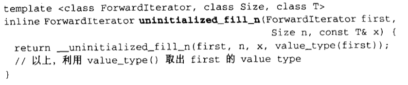

[toc]


# 1. STL概论


> GNU源代码开放精神


# 2. 空间配置器`allocator`

## 1. 空间配置器的标准接口

根据STL的规范，以下是`allocator`的必要接口：


### 1.1 设计一个简单的空间配置器，JJ:allocator

```c++
#include <limits>
#include <iostream>

namespace JJ {
   template <class T>
   class MyAlloc {
     public:
       // type definitions
       typedef T        value_type;
       typedef T*       pointer;
       typedef const T* const_pointer;
       typedef T&       reference;
       typedef const T& const_reference;
       typedef std::size_t    size_type;
       typedef std::ptrdiff_t difference_type;

       // rebind allocator to type U
       template <class U>
       struct rebind {
           typedef MyAlloc<U> other;
       };

       // return address of values
       pointer address (reference value) const {
           return &value;
       }
       const_pointer address (const_reference value) const {
           return &value;
       }

       /* constructors and destructor
        * - nothing to do because the allocator has no state
        */
       MyAlloc() throw() {
       }
       
       MyAlloc(const MyAlloc&) throw() {
       }
       
       template <class U>
         MyAlloc (const MyAlloc<U>&) throw() {
       }
       
       ~MyAlloc() throw() {
       }

       // return maximum number of elements that can be allocated
       size_type max_size () const throw() {
           return std::numeric_limits<std::size_t>::max() / sizeof(T);
       }

       // allocate but don't initialize num elements of type T
       pointer allocate (size_type num, const void* = 0) {
           // print message and allocate memory with global new
           std::cerr << "allocate " << num << " element(s)"
                     << " of size " << sizeof(T) << std::endl;
           pointer ret = (pointer)(::operator new(num*sizeof(T)));
           std::cerr << " allocated at: " << (void*)ret << std::endl;
           return ret;
       }

       // initialize elements of allocated storage p with value value
       void construct (pointer p, const T& value) {
           // initialize memory with placement new
           new((void*)p)T(value);
       }

       // destroy elements of initialized storage p
       void destroy (pointer p) {
           // destroy objects by calling their destructor
           p->~T();
       }

       // deallocate storage p of deleted elements
       void deallocate (pointer p, size_type num) {
           // print message and deallocate memory with global delete
           std::cerr << "deallocate " << num << " element(s)"
                     << " of size " << sizeof(T)
                     << " at: " << (void*)p << std::endl;
           ::operator delete((void*)p);
       }
   };

   // return that all specializations of this allocator are interchangeable
   template <class T1, class T2>
   bool operator== (const MyAlloc<T1>&,
                    const MyAlloc<T2>&) throw() {
       return true;
   }
   template <class T1, class T2>
   bool operator!= (const MyAlloc<T1>&,
                    const MyAlloc<T2>&) throw() {
       return false;
   }
}
```

这里是一个大佬写的代码，但实际和书中的差不多。这里就直接贴了。这个算是最基础的分配器吧。


## 2. 具备次配置力的SGI空间配置器

`Sgi stl` 的配置器与众不同，也与**标准规范**不同，其名称是`a1loc`而非`a1locator` ，而且不接受任何参数。换句话说，如果要在程序中采用**sgi配置器**，则不能采用标准写法：

```c++
vector<int, std::al1ocator<int>> iv;
```

必须这么写：

```c++
vector<int, std::alloc> iv;
```


### 2.1 SGI标准的空间配置器，std::allocator

虽然`SGI`也定义有一个符合部分标准、名为`allocator`的配置器，但`SGI`自己从未用过它，也不建议我们使用。主要原因是效率不佳，只把C++的`::Operator New`和`::Operator delete`做一层薄薄的包装而已。下面是`SGI`的`std::allocator`全貌：

```
//具体见书，没什么好说的
```


### 2.2 SGI特殊的空间配置器，std:alloc

关于c++内存配置，可以去看`C++ more effective `的条款`8`。

**Stl标准规格**告诉我们，配置器定义于`<Memory>`之中，`<Memory>`内含以下两个文件：

```c++
#include <stl_alloc.h>			//负责内存空间的配置与释放
#include <stl_construct.h>  	//负责对象内容的构造与析构
```


### 2.3 构造和析构基本工具: construct()和destroy()

==平凡析构函数==是不进行任何动作的析构函数。有平凡析构函数的对象不要求 `delete `表达式，并可以通过简单地**解分配其存储**进行释放。所有与 C 语言兼容的数据类型（POD 类型）都是**可平凡析构的**。

```c++
#include<new.h>  //想使用placement new,需要包含此文件

template <class _T1, class _T2>
inline void _Construct(_T1* __p, const _T2& __value) {
  new ((void*) __p) _T1(__value);
}


//版本1
template <class _Tp>
inline void _Destroy(_Tp* __pointer) {
  __pointer->~_Tp();
}

//以下是第二版本，接受两个迭代器。此函数设法找出元素的数值型别，
//进而利用求取最适当措施
//__VALUE_TYPE返回_first的类型，返回T*
template <class _ForwardIterator>
inline void _Destroy(_ForwardIterator __first, _ForwardIterator __last) {
  __destroy(__first, __last, __VALUE_TYPE(__first));
}

//判断元素的数值型别(值类型)是否有平凡析构函数
template <class _ForwardIterator, class _Tp>
inline void 
__destroy(_ForwardIterator __first, _ForwardIterator __last, _Tp*)
{
  typedef typename __type_traits<_Tp>::has_trivial_destructor
          _Trivial_destructor;
  __destroy_aux(__first, __last, _Trivial_destructor());
}

//如果元素的数值型别(值类型)有非平凡析构函数
template <class _ForwardIterator>
void
__destroy_aux(_ForwardIterator __first, _ForwardIterator __last, __false_type)
{
  for ( ; __first != __last; ++__first)
    destroy(&*__first);
}

//如果元素的数值型别(值类型)有平凡析构函数…。
template <class _ForwardIterator> 
inline void __destroy_aux(_ForwardIterator, _ForwardIterator, __true_type) {}

//old name
template <class _Tp>
inline void destroy(_Tp* __pointer) {
  _Destroy(__pointer);
}

template <class _ForwardIterator>
inline void destroy(_ForwardIterator __first, _ForwardIterator __last) {
  _Destroy(__first, __last);
}

```


上述`construct()`接受一个指针`p`和一个初值` value`，该函数的用途就是将初值设定到指针所指的空间上。C++的`placement new`运算子可用来完成这一任务。

`destroy()`有两个版本，第一版本接受一个指针，准备将**该指针所指之物**析构掉。这很简单，直接调用该对象的析构函数即可。第二版本接受`first `和` last`两个迭代器，准备将范围内的对象析构掉。

我们不知道这个范围有多大，万一很大，而每个对象的析构函数都无关痛痒（所谓`trivial destructor`)，那么一次次调用这些无关痛痒的析构函数，对效率是一种伤害。因此，这里首先利用`value_type()`获得迭代器所指对象的型别，再利用`_type_traits<T>`判断**该型别的析构函数是否无关痛痒**。若是，则什么也不做就结束。


### 2.4 空间的配置与释放，std:alloc

对象构造前的空间配置，和对象析构后的空间释放，由`<stl_alloc.h>`负责，`SGI`对此的设计哲学如下：

- 向`system heap`要求空间。
- 考虑**多线程（multi-threads）状态**。
- 考虑内存不足时的应变措施。
- 考虑**过多“小型区块”**可能造成的**内存碎片( fragment）问题**。
  

> 为了代码复杂度不要太高，我们忽略多线程问题

SGI正是以`malloc()`和`free ()`完成**内存的配置与释放**。考虑到**小型区块**所可能造成的**内存破碎问题**，SGI设计了==双层级配置器==，**第一级配置器**直接使用`malloc()`和`free()`，**第二级配置器**则视情况采用不同的策略：

- 当配置区块超过`128` bytes 时，视之为“**足够大**”，便调用**第一级配置器**；
- 当配置区块小于`128` bytes 时，视之为“**过小**”，为了降低额外负担，便采用复杂的`memory pool`整理方式，而不再求助于**第一级配置器**。

整个设计究竟只开放第一级配置器，或是同时开放第二级配置器，取决于`__USE_MALLOC`是否被定义。


其中`__malloc_alloc_template`就是第一级配置器，`__default_alloc_template `就是第二级配置器。再次提醒你注意，`alloc` 并不接受任何**template型别参数**。

无论`alloc`被定义为第一级或第二级配置器，`SGI `还为它再包装一个接口如下，使**配置器的接口**能够符合**STL规格**：

```c++
template<class _Tp, class _Alloc>
class simple_alloc {

public:
    static _Tp* allocate(size_t __n)
    { 
        return 0 == __n ? 0 : (_Tp*) _Alloc::allocate(__n * sizeof (_Tp)); 
    }
    
    static _Tp* allocate(void)
    { 
        return (_Tp*) _Alloc::allocate(sizeof (_Tp)); 
    }
    
    static void deallocate(_Tp* __p, size_t __n)
    { 
        if (0 != __n) _Alloc::deallocate(__p, __n * sizeof (_Tp)); 
    }
    
    static void deallocate(_Tp* __p)
    { 
        _Alloc::deallocate(__p, sizeof (_Tp)); 
    }
};
```

其内部`4`个成员函数其实都是**单纯的转调用**，调用传递给配置器（可能是第一级也可能是第二级）的成员函数。


### 2.5 第一级配置器__m alloc_alloc_template剖析

```c++
template <int __inst>
class __malloc_alloc_template {

private:

  //以下都是函数指针，所代表的函数将用来处理内存不足的情况
  static void* _S_oom_malloc(size_t);
  static void* _S_oom_realloc(void*, size_t);
  
  //处理例程，企图释放内存
#ifndef __STL_STATIC_TEMPLATE_MEMBER_BUG
  static void (* __malloc_alloc_oom_handler)();
#endif

public:

  static void* allocate(size_t __n)
  {
    void* __result = malloc(__n);
    if (0 == __result) __result = _S_oom_malloc(__n);
    return __result;
  }

  static void deallocate(void* __p, size_t /* __n */)
  {
    free(__p);
  }

  static void* reallocate(void* __p, size_t /* old_sz */, size_t __new_sz)
  {
    void* __result = realloc(__p, __new_sz);
    if (0 == __result) __result = _S_oom_realloc(__p, __new_sz);
    return __result;
  }

  //以下仿真C++的set_new_handler( )。换句话说，你可以通过它
  //指定你自己的out-of-memory handler
  //这个函数有点复杂，但本质是：接受一个void(*)()函数指针的参数，返回一个void(*)()函数指针
  //而且这个函数指针是旧的那个
  static void (* __set_malloc_handler(void (*__f)()))()
  {
    void (* __old)() = __malloc_alloc_oom_handler;
    __malloc_alloc_oom_handler = __f;
    return(__old);
  }

};


// malloc_alloc out-of-memory handling
//初值为0。有待客端设定
#ifndef __STL_STATIC_TEMPLATE_MEMBER_BUG
template <int __inst>
void (* __malloc_alloc_template<__inst>::__malloc_alloc_oom_handler)() = 0;
#endif


template <int __inst>
void* __malloc_alloc_template<__inst>::_S_oom_malloc(size_t __n)
{
    void (* __my_malloc_handler)();
    void* __result;

    for (;;) {			//不断尝试释放、配置、再释放、再配置…
        __my_malloc_handler = __malloc_alloc_oom_handler;
        if (0 == __my_malloc_handler) { __THROW_BAD_ALLOC; }
        (*__my_malloc_handler)();  //调用处理例程，企图释放内存
        __result = malloc(__n);	   //再次尝试配置内存
        if (__result) return(__result);
    }
}

template <int __inst>
void* __malloc_alloc_template<__inst>::_S_oom_realloc(void* __p, size_t __n)
{
    void (* __my_malloc_handler)();
    void* __result;

    for (;;) {			//不断尝试释放、配置、再释放、再配置…
        __my_malloc_handler = __malloc_alloc_oom_handler;
        if (0 == __my_malloc_handler) { __THROW_BAD_ALLOC; }
        (*__my_malloc_handler)();		//调用处理例程，企图释放内存
        __result = realloc(__p, __n);	//再次尝试配置内存
        if (__result) return(__result);
    }
}

//注意，以下直接将参数inst指定为О
typedef __malloc_alloc_template<0> malloc_alloc;
```

**第一级配置器**以`malloc()` ，`free() `，`realloc()`等C函数执行实际的内存配置、释放、重配置操作，并实现出类似`C++ new-handler`的机制。是的，它不能直接运用`C++ new-handler`机制，因为它并非使用`:: operator new`来配置内存。

所谓`C++ new-handler`机制是，你可以要求系统在**内存配置需求**无法被满足时，调用一个你所指定的函数。换句话说，一旦`:: operator new`无法完成任务，在丢出`std::bad_alloc`异常状态之前，会先调用由客端指定的**处理例程**。该处理例程通常即被称为`new-handler`。


### 2.6 第二级配置器__default_alloc_template剖析

:one:**SGI第二级配置器**的做法是，如果区块够大，超过`128`个字节时，就移交第一级配置器处理。当区块小于`128`个字节时，则以**内存池**管理，此法又称为==次层配置==：每次配置一大块内存，并维护**对应之自由链表**（`free-list`）。下次若再有相同大小的内存需求，就直接从`free-list`中拨出。如果客端释还**小额区块**，就由配置器回收到`free-list`中。

为了方便管理，**sgi第二级配置器**会主动将任何**小额区块的内存需求量**上调至**8的倍数**（例如客端要求**30字节**，就自动调整为**32字节**)，并维护`16`个`free-list`，各自管理大小分别为8，16，24，32，40，48，56，64，72，80，88，96，104，112，120，128字节的小额区块。`free-list`的节点结构如下：

```c++
union _Obj {
    union _Obj* _M_free_list_link;
    char _M_client_data[1];    /* The client sees this. */
};
```

注意，上述`obj`所用的是`Union`，从其第一字段观之，`obj`可被视为一个指针，指向相同形式的另一个`obj`。从其第二字段观之，可被视为一个指针，**指向实际区块**。


下面是第二级配置器的部分实现内容：

```c++
// 以下是第二级配置器
// 注意，第二参数完全没派上用场
// 第一参数用于多线程环境下.本书不讨论多线程环境
template <bool threads, int inst>
class __default_alloc_template 
{
private:
  // Really we should use static const int x = N
  // instead of enum { x = N }, but few compilers accept the former.
#if ! (defined(__SUNPRO_CC) || defined(__GNUC__))
    enum {_ALIGN = 8};			// 小型区块的上调边界
    enum {_MAX_BYTES = 128};	// 小型区块的上限
    enum {_NFREELISTS = 16}; 	// _MAX_BYTES/_ALIGN free-lists的个数
#endif
    
    // ROUND_UP()将bytes上调至8的倍数
    static size_t _S_round_up(size_t __bytes) 
    { 
        return (((__bytes) + (size_t) _ALIGN - 1) & ~((size_t) _ALIGN - 1));
    }

__PRIVATE:
    
    // free-lists的节点构造
    union _Obj {
        union _Obj* _M_free_list_link;
        char _M_client_data[1];    /* The client sees this.*/
    };

private:
#if defined(__SUNPRO_CC) || defined(__GNUC__) || defined(__HP_aCC)
    static _Obj* __STL_VOLATILE _S_free_list[]; 
        // Specifying a size results in duplicate def for 4.1
#else
    // 16个free-lists
    static _Obj* __STL_VOLATILE _S_free_list[_NFREELISTS]; 
#endif
    
    // 以下函数根据区块大小，决定使用第n号free-list。n从1起算
    static  size_t _S_freelist_index(size_t __bytes) {
        return (((__bytes) + (size_t)_ALIGN-1) / (size_t)_ALIGN - 1);
    }
    
	// 返回一个大小为n的对象，并可能加入大小为n的其它区块到free-list
    // Returns an object of size __n, and optionally adds to size __n free list.
    static void* _S_refill(size_t __n);
    
    // 配置一大块空间，可容纳nobjs个大小为`size`的区块,
    // 如果配置nobjs个区块有所不便，nobjs可能会降低
    // Allocates a chunk for nobjs of size size.  nobjs may be reduced
    // if it is inconvenient to allocate the requested number.
    static char* _S_chunk_alloc(size_t __size, int& __nobjs);

    // Chunk allocation state.
    static char* _S_start_free; 	//内存池起始位置。只在chunk_alloc()中变化
    static char* _S_end_free;		//内存池结束位置。只在chunk_alloc()中变化
    static size_t _S_heap_size;

public:

    /* __n must be > 0      */
    static void* allocate(size_t __n)
    {
        void* __ret = 0;

        if (__n > (size_t) _MAX_BYTES) {
            __ret = malloc_alloc::allocate(__n);
        }
        else {
            _Obj* __STL_VOLATILE* __my_free_list
                = _S_free_list + _S_freelist_index(__n);
            // Acquire the lock here with a constructor call.
            // This ensures that it is released in exit or during stack
            // unwinding.
            #ifndef _NOTHREADS
            /*REFERENCED*/
            _Lock __lock_instance;
            #endif
            _Obj* __RESTRICT __result = *__my_free_list;
            if (__result == 0)
                __ret = _S_refill(_S_round_up(__n));
            else {
                *__my_free_list = __result -> _M_free_list_link;
                __ret = __result;
            }
        }

        return __ret;
    };

    /* __p may not be 0 */
    static void deallocate(void* __p, size_t __n)
    {
        if (__n > (size_t) _MAX_BYTES)
            malloc_alloc::deallocate(__p, __n);
        else {
            _Obj* __STL_VOLATILE*  __my_free_list
                = _S_free_list + _S_freelist_index(__n);
            _Obj* __q = (_Obj*)__p;

            // acquire lock
            #ifndef _NOTHREADS
            /*REFERENCED*/
            _Lock __lock_instance;
            #endif /* _NOTHREADS */
            __q -> _M_free_list_link = *__my_free_list;
            *__my_free_list = __q;
            // lock is released here
        }
    }

    static void* reallocate(void* __p, size_t __old_sz, size_t __new_sz);
} ;

template <bool __threads, int __inst>
char* __default_alloc_template<__threads, __inst>::_S_start_free = 0;

template <bool __threads, int __inst>
char* __default_alloc_template<__threads, __inst>::_S_end_free = 0;

template <bool __threads, int __inst>
size_t __default_alloc_template<__threads, __inst>::_S_heap_size = 0;
```


### 2.6 空间配置函数allocate()

身为一个配置器，`__default_alloc_template`拥有**配置器的标准接口函数**`allocate()`。此函数首先判断区块大小，大于`128`个字节就调用**第一级配置器**，小于`128`个字节就检查对应的`free-list`。如果`free-list`之内有可用的区块，就直接拿来用，如果没有可用区块，就将区块大小上调至**8倍数边界**，然后调用`refill()`，准备为`free-list`重新填充空间。`refill()`将于稍后介绍。

```c++
/* __n must be > 0 */
static void* allocate(size_t __n)
{
    void* __ret = 0;

    if (__n > (size_t) _MAX_BYTES) 
    {
        __ret = malloc_alloc::allocate(__n);
    }
    else
    {
        //寻找16个free-list中适当的一个
        _Obj* __STL_VOLATILE* __my_free_list
            = _S_free_list + _S_freelist_index(__n);
        
        _Obj* __RESTRICT __result = *__my_free_list;
        
        if (__result == 0)
            __ret = _S_refill(_S_round_up(__n)); //没找到可用的空闲列表，准备重新填充空闲列表
        else 
        {
            //调整free list
            *__my_free_list = __result -> _M_free_list_link;
            __ret = __result;
        }
    }

    return __ret;
};
```


### 2.7 空间释放函数deallocate()

```c++
/* __p may not be 0 */
static void deallocate(void* __p, size_t __n)
{
    if (__n > (size_t) _MAX_BYTES)
        malloc_alloc::deallocate(__p, __n);
    else 
    {
        _Obj* __STL_VOLATILE*  __my_free_list
            = _S_free_list + _S_freelist_index(__n);
        
        _Obj* __q = (_Obj*)__p;

        __q -> _M_free_list_link = *__my_free_list;
        *__my_free_list = __q;

    }
}
```


### 2.8 重新填充free lists

回头讨论先前说过的`allocate()`。当它发现`free-list`中没有可用区块了时，就调用`refill()`，准备为`free-list`重新填充空间。新的空间将取自**内存池**（经由`chunk_alloc`完成）。缺省取得`20`个新节点，但万一内存池空间不足，获得的节点数（区块数）可能小于`20`：

```c++
// 返回一个大小为n的对象，并且有时候会为适当的空闲列表增加节点
// 假设n已经适当上调至8的倍数
template <bool __threads, int __inst>
void* __default_alloc_template<__threads, __inst>::_S_refill(size_t __n)
{
    int __nobjs = 20;
    
    // 调用chunk_alloc()，尝试取得nobjs个区块作为free-list的新节点,
    // 注意参数nobjs是pass by reference
    char* __chunk = _S_chunk_alloc(__n, __nobjs);
    _Obj* __STL_VOLATILE* __my_free_list;
    _Obj* __result;
    _Obj* __current_obj;
    _Obj* __next_obj;
    int __i;
 
    // 如果只获得一个区块，这个区块就分配给调用者用，free-list无新节点
    if (1 == __nobjs) return(__chunk);

    // 否则准备调整free-list，纳入新节点
    __my_free_list = _S_free_list + _S_freelist_index(__n);

    // 以下在chunk空间内建立free-list
    __result = (_Obj*)__chunk;
    
    // 以下导引free-list指向新配置的空间（取自内存池)
    *__my_free_list = __next_obj = (_Obj*)(__chunk + __n);

    // 以下将free-list的各节点串接起来
    // 从1开始，因为第0个将返回绐客端
    for (__i = 1;; __i++) 
    {
        __current_obj = __next_obj;
        __next_obj = (_Obj*)((char*)__next_obj + __n);
        if (__nobjs - 1 == __i) {
            __current_obj -> _M_free_list_link = 0;
            break;
        } 
        else 
        {
            __current_obj -> _M_free_list_link = __next_obj;
        }
    }
    return(__result);
}
```

### 2.9 内存池

```c++
/* We allocate memory in large chunks in order to avoid fragmenting     */
/* the malloc heap too much.                                            */
/* We assume that size is properly aligned.                             */
/* We hold the allocation lock.                                         */
template <bool __threads, int __inst>
char* __default_alloc_template<__threads, __inst>::_S_chunk_alloc(size_t __size, int& __nobjs)
{
    char* __result;
    size_t __total_bytes = __size * __nobjs;
    size_t __bytes_left = _S_end_free - _S_start_free; 	// 内存池剩余空间

    // 内存池剩余空间完全满足需求量
    if (__bytes_left >= __total_bytes) 
    {
        __result = _S_start_free;
        _S_start_free += __total_bytes;
        return(__result);
    } 
    // 内存池剩余空间不能完全满足需求量，但足够供应一个(含)以上的区块
    else if (__bytes_left >= __size) 
    {
        __nobjs = (int)(__bytes_left/__size);
        __total_bytes = __size * __nobjs;
        __result = _S_start_free;
        _S_start_free += __total_bytes;
        return(__result);
    }
    // 内存池剩余空间连一个区块的大小都无法提供
    else 
    {
        size_t __bytes_to_get = 
            2 * __total_bytes + _S_round_up(_S_heap_size >> 4);
        
        // 以下试着让内存池中的残余零头还有利用价值
        if (__bytes_left > 0) {
            
            // 内存池内还有一些零头，先配给适当的free-list
            // 首先寻找适当的free-list
            _Obj* __STL_VOLATILE* __my_free_list =
                _S_free_list + _S_freelist_index(__bytes_left);
            
			// 调整free-list，将内存池中的残余空间编入
            ((_Obj*)_S_start_free) -> _M_free_list_link = *__my_free_list;
            *__my_free_list = (_Obj*)_S_start_free;
        }
        
        // 配置堆空间，用来补充内存池
        _S_start_free = (char*)malloc(__bytes_to_get);
        
        // heap空间不足，malloc()失败
        if (0 == _S_start_free) {
            size_t __i;
            _Obj* __STL_VOLATILE* __my_free_list;
            _Obj* __p;
            
            //试着检视我们手上拥有的东西.这不会造成伤害。我们不打算配置
            //较小的区块，因为那在多进程机器上容易导致灾难。
            //以下搜寻适当的free list:
            //所谓适当是指“尚有未用区块，且区块够大”之free list
            for (__i = __size;
                 __i <= (size_t) _MAX_BYTES;
                 __i += (size_t) _ALIGN) 
            {
                __my_free_list = _S_free_list + _S_freelist_index(__i);
                __p = *__my_free_list;
                
                // free list内尚有未用区块
                if (0 != __p) {
                    //调整空闲列表以释出未用区块
                    *__my_free_list = __p -> _M_free_list_link;
                    _S_start_free = (char*)__p;
                    _S_end_free = _S_start_free + __i;
                    
                    // 递归调用自己，为了修正nobjs 
                    return(_S_chunk_alloc(__size, __nobjs));
                }
            }
            
            // 如果出现意外(山穷水尽，到处都没内存可用了)
            // 调用第一级配置器，看看内存不足机制能否尽点力
            _S_end_free = 0;	// In case of exception.
            _S_start_free = (char*)malloc_alloc::allocate(__bytes_to_get);
        }
        
        _S_heap_size += __bytes_to_get;
        _S_end_free = _S_start_free + __bytes_to_get;
        
        // 递归调用自己，为了修正nobjs 
        return(_S_chunk_alloc(__size, __nobjs));
    }
}
```

上述的`chunk_alloc()`函数以`end_free - start_free`来判断**内存池的水量**。如果水量充足，就直接调出`20`个区块返回给`free list`。如果水量不足以提供`20`个区块，但还足够供应`1`个以上的区块，就拨出这不足`20`个区块的空间出去。这时候其` pass by reference`的 `nobjs`参数将被修改为**实际能够供应的区块数**。如果内存池连一个区块空间都无法供应，对客端显然无法交待，此时便需利用`malloc()`从`heap `中配置内存，为**内存池**注入**活水源头**以应付需求。新水量的大小为**需求量的两倍**，再加上一个随着配置次数增加、而愈来愈大的**附加量**。


## 3. 内存基本处理工具

`STL`定义有**五个全局函数**，作用于**未初始化空间**上。

### 3.1 uninitialized _copy


:one:`uninitialized_copy()`使我们能够将**内存的配置**与**对象的构造行为**分离开来。如果作为输出目的地的 $[result, result+( last-first)]$范围内的每一个迭代器都指向**未初始化区域**，则`uninitialized_copy()`会使用`copy constructor`，给身为输入来源之$[first ,last]$范围内的每一个对象产生**一份复制品**，放进输出范围中。换句话说，针对输入范围内的每一个迭代器`i`，该函数会调用`construct (&*(result+(i-first ))，*i)`，产生 `*i`的复制品，放进输出范围中。

如果你需要实现一个容器，`uninitialized_copy()`这样的函数会为你带来很大的帮助，因为容器的**全区间构造函数**（`range constructor`）通常以两个步骤完成：

- 配置内存区块，足以包含范围内的所有元素.
- 使用`uninitialized_copy()`，在该内存区块上构造元素。

### 3.2 uninitialized_fill


:one:针对输入范围内的每一个迭代器`i`，该函数会调用`construct (&*i，x)`，产生 `x`的复制品。

> 与`uninitialized_copy()`一样，`uninitialized_fill()`必须具备==“commitor rollback”语意==，换句话说，它要么产生出所有必要元素，要么不产生任何元素。

### 3.3 uninitialized_fill_n


针对范围$[first,first+n]$内的每一个迭代器`i`，该函数会调用`construct (&*i，x)`，产生 `x`的复制品。

### 3.4 三个函数的实现方法

:one:首先是`uninitialized_fill_n`。



这个函数的进行逻辑是，首先萃取出**迭代器first** 的` value type `（详见第`3`章），然后判断该型别是否为 **POD 型别**：

> POD意指Plain Old Data，也就是标量型别（scalar types）或传统的C struct型别。POD 型别必然拥有trivial ctor /dtor/ copy/assignment函数。


:two:其他两个具体看书。


# 3. 迭代器概念与`traits`编程技法

迭代器（`iterators`）是一种抽象的设计概念，现实程序语言中并没有直接对应于这个概念的实物。《Design Patterns》一书提供有`23`个设计模式的完整描述，其中==iterator模式==定义如下：提供一种方法，使之能够依序巡访某个聚合物（容器）所含的各个元素，而又无需暴露该聚合物的内部表述方式。

## 1. 迭代器设计思维——STL关键所在

不论是泛型思维或STL的实际运用，**迭代器（iterators）**都扮演着重要的角色。STL的中心思想在于：将数据容器（containers）和算法（ algorithms）分开，彼此独立设计，最后再以一帖胶着剂将它们撮合在一起。容器和算法的泛型化，从技术角度来看并不困难，C++的`class templates`和` function templates`可分别达成目标。如何设计出两者之间的良好胶着剂，才是大难题。

以下是容器、算法、==迭代器（ iterator，扮演粘胶角色）==的合作展示。以算法`find()`为例，它接受两个迭代器和一个“搜寻目标”：

```c++
template <class _InputIter, class _Tp>
inline _InputIter find(_InputIter __first, _InputIter __last,
                       const _Tp& __val,
                       input_iterator_tag)
{
    while (__first != __last && !(*__first == __val))
        ++__first;
    return __first;
}
```


## 2. 迭代器是一种智能指针

:one:**迭代器**是一种**行为类似指针的对象**，而指针的各种行为中最常见也最重要的便是**内容提领**（`dereference`）和**成员访问**（`member access`）。因此，==迭代器最重要的编程工作==就是对`operator*`和 `operator->`进行重载（ `overloading`）工作。关于智能指针的实现细节，可以去看`more eff c++`。


现在我们来为链表`list`设计一个迭代器，假设`list`及其节点的结构如下：

```c++
template <typename T>
class List {
// 定义public以供访问
public:
    void insert_front(T value);
    void insert_end(T value);
    void display(std::ostream &os = std::cout) const;
    ListItem<T> * front() {
        return _front;
    }
    List();

private:
    ListItem<T> *_end;
    ListItem<T> *_front;
    long _size;
};

template <typename T>
class ListItem {
public:
    T value() const {
        return _value;
    }

    ListItem* next() const {
        return _next;
    }

private:
    T _value;
    ListItem *_next;
};
```

为了让该迭代器适用于任何型态的节点，而不只限于`ListItem`，我们可以将它设计为一个`class template`：

```c++
template <class Item>
struct ListIter {
    Item *ptr; // 保持与容器的联系

    // default ctor
    ListIter(Item* p =0) : ptr(p) {}

    // 解引用 dereference
    Item& operator*() const {
        return *ptr;
    }

    // member access
    Item* operator->() const {
        return ptr;
    }

    // prefix increment, 返回对象
    ListIter& operator++() {
        ptr = ptr->next();
        return *this;
    }

    // postfix increment, 返回值（新对象）
    // int为占位符，提示编译器这是后自增
    ListIter operator++(int) {
        ListIter temp = *this;
        ++*this; // 调用前面的前自增
        return temp;
    }

    bool operator==(const ListIter& i) const {
        return ptr == i.ptr;
    }

    bool operator!=(const ListIter& i) const {
        return ptr != i.ptr;
    }
};
```

现在我们可以将`List`和`find()`藉由`ListIter`粘合起来：

```c++
// 如果不写全局比较函数，则需要更改find函数判定
template <typename T> bool operator!=(const ListItem<T>& item, T n) { 
    return item.value() != n; 
} 

int main() {
    List<int> mylist;
    
    for (int i = 0; i < 5; ++i) {
        mylist.insert_front(i);
        mylist.insert_end(i + 2);
    }

    mylist.display();

    ListIter<ListItem<int>> begin(mylist.front());
    ListIter<ListItem<int>> end;
    ListIter<ListItem<int>> iter;
    iter = find(begin, end, 3);
    if (iter == end)
        cout << "not found" << endl;
    else
        cout << "found. " << iter->value() << endl;

    iter = find(begin, end, 7);
    if (iter == end)
        cout << "not found" << endl;
    else
        cout << "found. " << iter->value() << endl;
}
```

为了完成一个针对 List而设计的迭代器，我们无可避免曝露了太多 List细节：在 `main()`为了制作 begin和 end两个迭代器，我们曝露了` ListItem`；在` ListIter class` 为了达成` operator++`的目的，我们曝露了 `ListItem`的操作函式 `next()`。如果不是为了迭代器，`ListItem `原本应该完全隐藏起来不曝光的。 换句话说，要设计出 `ListIter`，首先必须对 `List `的细节有非常丰富的了解。

既然这无可避免，干脆就把迭代器的开发工作交给 List的设计者好了，如此一来所有细节反而得以封装起来不被使用者看到。这正是为什么每一种 **STL 容器**都提供有**专属迭代器**的缘故。


## 3. 迭代器相应类型

:one:在算法中运用迭代器时，很可能会用到其==相应型别==（关联类型）。什么是**相应型别**？迭代器所指之物的型别便是其一。解决办法是：利用`function template`的==参数推导机制==。

根据经验，**最常用的相应型别有五种**，然而并非任何情况下任何一种都可利用上述的 **template参数推导机制**来取得。我们需要**更全面的解法**。


## 4. Traits编程技法——STL源代码门钥

:one:对于上节的问题，==声明内嵌型别==似乎是个好主意，像这样：


看起来不错。但是有个**隐晦的陷阱**：并不是所有迭代器都是`class type`，原生指针就不是！如果不是`class type`，就无法为它定义**内嵌型别**。但stl绝对必须接受**原生指针**作为一种迭代器，所以上面这样还不够。

:two:任何完整的C++语法书籍都应该对==模板偏特化==有所说明。大致的意义是：如果类模板拥有一个以上的模板参数，我们可以针对其中某个（或数个，但非全部）模板参数进行特化。

有了这项利器，我们便可以解决前述**“内嵌型别”未能解决的问题**。先前的问题是，原生指针并非类，因此无法为它们定义内嵌型别。现在，我们可以针对指针，设计**特化版的迭代器**。

提高警觉，我们进入关键地带了！下面这个`class template`专门用来**“萃取”迭代器的特性**，而`value type`正是迭代器的特性之一：

```c++
// 萃取机 traits
template <class _Iterator>
struct iterator_traits {
  typedef typename _Iterator::iterator_category iterator_category;
  typedef typename _Iterator::value_type        value_type;
  typedef typename _Iterator::difference_type   difference_type;
  typedef typename _Iterator::pointer           pointer;
  typedef typename _Iterator::reference         reference;
};

// 原生指针的traits 偏特化
template <class _Tp>
struct iterator_traits<_Tp*> {
  typedef random_access_iterator_tag iterator_category;
  typedef _Tp                         value_type;
  typedef ptrdiff_t                   difference_type;
  typedef _Tp*                        pointer;
  typedef _Tp&                        reference;
};

// 原生常量指针 pointer-to-const 的traits 偏特化
template <class _Tp>
struct iterator_traits<const _Tp*> {
  typedef random_access_iterator_tag iterator_category;
  typedef _Tp                         value_type;
  typedef ptrdiff_t                   difference_type;
  typedef const _Tp*                  pointer;
  typedef const _Tp&                  reference;
};
```


根据经验，最常用到的迭代器相应型别有五种：`value type`，`dlfference type`，`pointer`，`reference` ，`iterator catagoly`。如果你希望你所开发的容器能与STL水乳交融，一定要为你的容器的迭代器定义这五种相应型别。

:three:

所谓`value type`，是指迭代器所指对象的型别。任何一个打算与**STL 算法**有完美搭配的` class`，都应该定义自己的 `value type`内嵌型别，做法就像上节所述。

`difference type`用来表示**两个迭代器之间的距离**，因此它也可以用来表示一·个容器的==最大容量==，因为对于连续空间的容器而言，头尾之间的距离就是其最大容量。

所谓`reference type`。在C++中，函数如果要传回左值，都是以 `by reference `的方式进行，所以当`p`是个`mutable iterators`时，如果其`value type`是` T`，那么`*p `的型别应该是`T&`。将此道理扩充，如果`p`是一个`constant iterators`，其`value type`是`T`，那么`*p`的型别应该是`const T&`。

### 4.1 迭代器类型

:one:`iterator_category`会引发较大规模的写代码工程，我必须先讨论迭代器的分类，可以分为以下五类：

1. `input Iterator`：这种迭代器所指的对象，不允许外界改变。
2. `output Iterator`：只读（read only）
3. `Forward Iterator`：允许“写入型”算法在此种迭代器所形成的区间上进行**读写操作**。
4. `Bidirectional Iterator`：可双向移动。
5. `Random Access lterator`：前四种迭代器都只供应**一部分指针算术能力**（前三种支持`operator++`，第四种再加上 `operator--`），第五种则涵盖**所有指针算术能力**，包括$p+n,p-n, p[n],p1-p2,p1<p2$。


> 箭头虽然是代表继承，也是这么编码的，但实际含义是所谓概念和强化的关系

设计算法时，如果可能，我们尽量针对上图中的某种迭代器提供一个明确定义，并针对更强化的某种迭代器提供另一种定义，这样才能在不同情况下提供最大效率。

:two:拿`advance()`来说（这是许多算法内部常用的一个函数)，该函数有两个参数，迭代器`p`和数值`n`；函数内部将`p`累进`n`次。下面有三份定义，一份针对`Input Iterator`，一份针对`Bidirectional Iterator`，另一份针对`Random Access Iterator`：


一种选择方法是：


但是像这样在**执行时期**才决定使用哪一个版本，会影响**程序效率**。最好能够在编译期就选择正确的版本。**重载函数机制**可以达成这个目标。

:three:设计考虑如下：如果`traits`有能力萃取出**迭代器的种类**，我们便可利用**这个“迭代器类型”相应型别**作为`advanced()`的第三参数。这个相应型别一定必须是一个`class type`，不能只是数值号码类的东西，因为编译器需仰赖它（一·个型别）来进行==重载决议==（` overloaded resolution`）。下面定义五个`classes`，代表五种迭代器类型：

```c++
// 五种迭代器类型
struct input_iterator_tag {};
struct output_iterator_tag {};
struct forward_iterator_tag : public input_iterator_tag {};
struct bidirectional_iterator_tag : public forward_iterator_tag {};
struct random_access_iterator_tag : public bidirectional_iterator_tag {};
```

现在重新设计`_advance()`：


注意上述语法，每个`_advance()`的最后一个参数都只声明型别，并未指定参数名称，因为==它纯粹只是用来激活重载机制==，函数之中根本不使用该参数。如果硬要加上参数名称也可以，画蛇添足罢了。

行进至此，还需要一个**对外开放的上层控制接口**，调用上述各个**重载的advance( )**。这一上层接口只需两个参数，当它准备将工作转给上述的advance ( )时，才自行加上第三参数：**迭代器类型**。因此，这个上层函数必须有能力从它所获得的迭代器中推导出其类型——这份工作自然是交给**traits机制**：


> **任何一个迭代器，其类型永远应该落在“该迭代器所隶属之各种类型中，最强化的那个**。例如，`int*`既是`Random Access lterator`，又是`Bidirectional Iterator`，同时也是`Foward Iterator`，那么，其类型应该归属为`random_access_iterator_tag`。

:four:通过继承，我们可以不必再写“单纯只做传递调用”的函数，例如，我们重载了`input iterator`和`random`版本的算法，当我们传入`forward`时（其行为和`input`一样），这个时候，我们就无须重载一个对应版本，并在其中传输调用`input`版本的，而是编译器自动调用。


## 5. `std::iterator`的保证

:one:STL提供了一个**迭代器类**如下，如果每个新设计的迭代器都继承自它，就可保证符合STL所需之规范：


## 6. iterator源代码重列

具体见书。


## 7. SGI STL的私房菜：__type_traits

`traits`编程技法很棒，适度弥补了C++语言本身的不足。STL只对迭代器加以规范，制定出`iterator_traits`这样的东西。`SGI` 把这种技法进一步扩大到迭代器以外的世界，于是有了所谓的`_type_traits`。`__`前缀词意指这是`SGI STL`内部所用的东西，不在**STL标准规范**之内。

