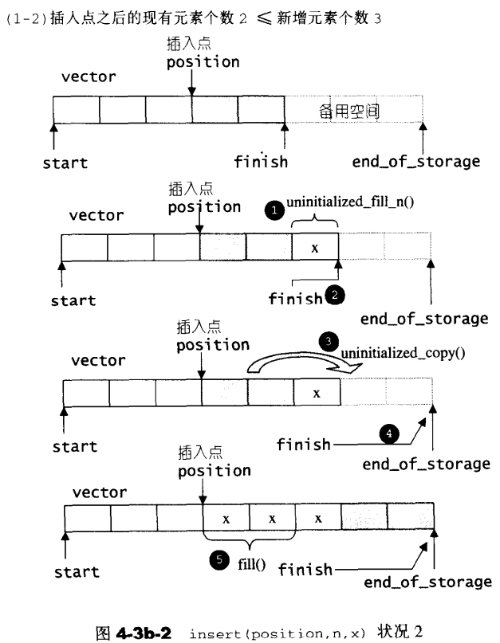

[toc]


# 1. 序列式容器

## 1. 容器概览​


这里所谓的衍生，并非**派生（ inheritance）关系**，而是**内含（containment）关系**。例如heap内含一个vector、priority-queue内含一个heap、stack 和 queue都含一个deque，set/map/multiset/multimap都内含一个 RB-tree，hast_x都内含一个hashtable。


## 2. Vector

### 2.1 概述

`vector`的实现技术，关键在于其**对大小的控制**，以及重新配置时的**数据移动效率**。一旦`vector `旧有空间满载，如果客户端每新增一个元素，`vector`内部只是扩充`1`个元素的空间，实为不智。稍后我们便可看到SGI vector的**空间配置策略**。


### 2.2 vector定义摘要

SGI STL将`vector`实现于更底层的``<stl_vector.h>``。

```c++
emplate <class _Tp, class _Alloc> 
class _Vector_base {
public:
    
  typedef _Alloc allocator_type;
    
  allocator_type get_allocator() const { return allocator_type(); }

  _Vector_base(const _Alloc&)
    : _M_start(0), _M_finish(0), _M_end_of_storage(0) {}
    
  _Vector_base(size_t __n, const _Alloc&)
    : _M_start(0), _M_finish(0), _M_end_of_storage(0) 
  {
    _M_start = _M_allocate(__n);
    _M_finish = _M_start;
    _M_end_of_storage = _M_start + __n;
  }

  ~_Vector_base() { _M_deallocate(_M_start, _M_end_of_storage - _M_start); }

protected:
  _Tp* _M_start;
  _Tp* _M_finish;
  _Tp* _M_end_of_storage;

  typedef simple_alloc<_Tp, _Alloc> _M_data_allocator;
    
  _Tp* _M_allocate(size_t __n)
    { return _M_data_allocator::allocate(__n); }
    
  void _M_deallocate(_Tp* __p, size_t __n) 
    { _M_data_allocator::deallocate(__p, __n); }
};

template <class _Tp, class _Alloc = __STL_DEFAULT_ALLOCATOR(_Tp) >
class vector : protected _Vector_base<_Tp, _Alloc> 
{
  // requirements:

  __STL_CLASS_REQUIRES(_Tp, _Assignable);

private:
  typedef _Vector_base<_Tp, _Alloc> _Base;
    
public:
  // vector 的嵌套类型定义
  typedef _Tp value_type;
  typedef value_type* pointer;
  typedef const value_type* const_pointer;
  typedef value_type* iterator;   // vector的迭代器是普通指针
  typedef const value_type* const_iterator;
  typedef value_type& reference;
  typedef const value_type& const_reference;
  typedef size_t size_type;
  typedef ptrdiff_t difference_type;

public:
  iterator begin() { return _M_start; }
  const_iterator begin() const { return _M_start; }
  iterator end() { return _M_finish; }
  const_iterator end() const { return _M_finish; }
  ...
  explicit vector(const allocator_type& __a = allocator_type())
    : _Base(__a) {}	

  vector(size_type __n, const _Tp& __value,
         const allocator_type& __a = allocator_type()) 
    : _Base(__n, __a)
    { _M_finish = uninitialized_fill_n(_M_start, __n, __value); }

  explicit vector(size_type __n)
    : _Base(__n, allocator_type())
    { _M_finish = uninitialized_fill_n(_M_start, __n, _Tp()); }

  vector(const vector<_Tp, _Alloc>& __x) 
    : _Base(__x.size(), __x.get_allocator())
    { _M_finish = uninitialized_copy(__x.begin(), __x.end(), _M_start); }
  
  ...
      
  iterator erase(iterator __position) {
    if (__position + 1 != end())
      copy(__position + 1, _M_finish, __position);
    --_M_finish;
    destroy(_M_finish);
    return __position;
  }
  iterator erase(iterator __first, iterator __last) {
    iterator __i = copy(__last, _M_finish, __first);
    destroy(__i, _M_finish);
    _M_finish = _M_finish - (__last - __first);
    return __first;
  }

  void resize(size_type __new_size, const _Tp& __x) {
    if (__new_size < size()) 
      erase(begin() + __new_size, end());
    else
      insert(end(), __new_size - size(), __x);
  }
  void resize(size_type __new_size) { resize(__new_size, _Tp()); }
  void clear() { erase(begin(), end()); }
  ...
}
```


### 2.3 vector的迭代器

:one:`vector`维护的是一个**连续线性空间**，所以不论其元素型别为何，==普通指针==都可以作为**vector的迭代器**，而满足所有必要条件。`vector`支持**随机存取**，而普通指针正有着这样的能力。所以，`vector`提供的是`Random Access lterators`：

```c++
typedef value_type* iterator;  
```


### 2.4 vector的数据结构

:one:`vector`所采用的数据结构非常简单：**线性连续空间**。它以两个迭代器`start`和`finish`分别指向**配置得来的连续空间**中已经被使用的范围。

```c++
_Tp* _M_start;
_Tp* _M_finish;
_Tp* _M_end_of_storage;
```

运用start， finish，end_of_storage 三个迭代器，便可轻易地提供首尾标示、大小、容量、空容器判断、注标（`` []``）运算子、最前端元素值、最后端元素值等功能。


### 2.5 vector的构造与内存管理：constructor，push_back

:one:`vector`缺省使用`alloc`（第二章）作为**空间配置器**，并据此另外定义了一个`data_allocator`，为的是更方便以元素大小为配置单位：

```c++
template <class _Tp, class _Alloc = __STL_DEFAULT_ALLOCATOR(_Tp) >
class vector : protected _Vector_base<_Tp, _Alloc> 
{
    ...
    typedef simple_alloc<_Tp, _Alloc> _M_data_allocator;
    ...
}
```

`vector`提供许多`constructors`，其中一个允许我们指定**空间大小**及**初值**：

```c++
vector(size_type __n, const _Tp& __value,
         const allocator_type& __a = allocator_type()) 
    : _Base(__n, __a)
    { _M_finish = uninitialized_fill_n(_M_start, __n, __value); }
```

:two:当我们以``push_back()``将新元素插人于**vector尾端**时，该函数首先检查是否还有备用空间，如果有就直接在备用空间上构造元素，并调整迭代器`finish`，使`vector`变大。如果没有备用空间了，就**扩充空间**（重新配置、移动数据、释放原空间）：

```c++
void push_back(const _Tp& __x) {
    if (_M_finish != _M_end_of_storage) {
        construct(_M_finish, __x);
        ++_M_finish;
    }
    else
        _M_insert_aux(end(), __x);
}

template <class _Tp, class _Alloc>
void vector<_Tp, _Alloc>::_M_insert_aux(iterator __position, const _Tp& __x)
{
    if (_M_finish != _M_end_of_storage) {
        // 在备用空间起始处构造一个元素，并以vector最后一个元素值为其初值
        construct(_M_finish, *(_M_finish - 1));
        // 调整水位
        ++_M_finish;
        _Tp __x_copy = __x;
        copy_backward(__position, _M_finish - 2, _M_finish - 1);
        *__position = __x_copy;
    }
    // 已无备用空间
    else {
        const size_type __old_size = size();
        const size_type __len = __old_size != 0 ? 2 * __old_size : 1;
        // 以上配置原则:如果原大小为0，则配置1（个元素大小);
        // 如果原大小不为0，则配置原大小的两倍，
        // 前半段用来放置原数据,后半段准备用来放置新数据
        
        // 实际配置
        iterator __new_start = _M_allocate(__len);
        iterator __new_finish = __new_start;
        __STL_TRY {
            // 将原vector 的内容拷贝到新vector
            __new_finish = uninitialized_copy(_M_start, __position, __new_start);
            construct(__new_finish, __x);
        	// 调整水位
            ++__new_finish;
            __new_finish = uninitialized_copy(__position, _M_finish, __new_finish);
        }
        __STL_UNWIND((destroy(__new_start,__new_finish), 
                      _M_deallocate(__new_start,__len)));
        //析构并释放原vector
        destroy(begin(), end());
        _M_deallocate(_M_start, _M_end_of_storage - _M_start);
        
        //调整迭代器，指向新vector
        _M_start = __new_start;
        _M_finish = __new_finish;
        _M_end_of_storage = __new_start + __len;
    }
}
```

注意，所谓**动态增加大小**，并不是在原空间之后接续新空间——因为无法保证原空间之后尚有可供配置的空间，而是以**原大小的两倍**另外配置一块较大空间，然后将原内容拷贝过来，然后才开始在原内容之后构造新元素，并释放原空间。因此，对``vector`的任何操作，一旦引起空间重新配置，**指向原vector的所有迭代器就都失效了**。这是程序员易犯的一个错误，务需小心。


### 2.5 vector的元素操作：pop_back，erase，clear，insert

:one:代码如下：

```c++
void pop_back() 
{
    --_M_finish;
    destroy(_M_finish);
}

iterator erase(iterator __first, iterator __last) 
{
    iterator __i = copy(__last, _M_finish, __first);
    destroy(__i, _M_finish);
    _M_finish = _M_finish - (__last - __first);
    return __first;
}

iterator erase(iterator __position) {
    if (__position + 1 != end())
        copy(__position + 1, _M_finish, __position);
    --_M_finish;
    destroy(_M_finish);
    return __position;
}

void clear() 
{ 
    erase(begin(), end()); 
}
```

 

:two:关于insert的代码，具体见书，这里只有图解：





## 3. list

### 3.1 概述

:one:相较于`vector`的连续线性空间，`list`就显得复杂许多，它的好处是**每次插人或删除一个元素，就配置或释放一个元素空间**。因此，`list`对于空间的运用有绝对的精准，一点也不浪费。而且，对于任何位置的**元素插人或元素移除**，`list`永远是==常数时间==。


### 3.2 list的节点

:one:每一个设计过`list`的人都知道，`list`本身和**list的节点**是不同的结构，需要分开设计。以下是 STL list的**节点结构**：

```c++
struct _List_node_base {
  _List_node_base* _M_next;
  _List_node_base* _M_prev;
};

template <class _Tp>
struct _List_node : public _List_node_base {
  _Tp _M_data;
};
```


### 3.3 list的迭代器

:one:`list`不再能够像`vector` 一样以普通指针作为迭代器，**因为其节点不保证在储存空间中连续存在**。**list迭代器**必须有能力指向`list` 的节点，并有能力进行正确的**递增、递减、取值、成员存取等操作**。递增时指向下一个节点，递减时指向上一个节点，取值时取的是节点的数据值，成员取用时取用的是节点的成员。由于`STL list`是一个==双向链表==，迭代器必须具备前移、后移的能力，所以`list`提供的是`Bidirectional tterators` 。

`list`有一个重要性质：插入操作（insert）和接合操作（splice）都不会造成原有的**list迭代器**失效。以下是List迭代器的设计：

```c++
struct _List_iterator_base {
    typedef size_t                     size_type;
    typedef ptrdiff_t                  difference_type;
    typedef bidirectional_iterator_tag iterator_category;

    _List_node_base* _M_node;

    _List_iterator_base(_List_node_base* __x) : _M_node(__x) {}
    _List_iterator_base() {}

    void _M_incr() { _M_node = _M_node->_M_next; }
    void _M_decr() { _M_node = _M_node->_M_prev; }

    bool operator==(const _List_iterator_base& __x) const {
        return _M_node == __x._M_node;
    }
    bool operator!=(const _List_iterator_base& __x) const {
        return _M_node != __x._M_node;
    }
}; 

template<class _Tp, class _Ref, class _Ptr>
struct _List_iterator : public _List_iterator_base 
{
    typedef _List_iterator<_Tp, _Tp&, _Tp*>             iterator;
    typedef _List_iterator<_Tp, const _Tp&, const _Tp*> const_iterator;
    typedef _List_iterator<_Tp, _Ref, _Ptr>             _Self;

    typedef _Tp value_type;
    typedef _Ptr pointer;
    typedef _Ref reference;
    typedef _List_node<_Tp> _Node;

    _List_iterator(_Node* __x) : _List_iterator_base(__x) {}
    _List_iterator() {}
    _List_iterator(const iterator& __x) : _List_iterator_base(__x._M_node) {}

    reference operator*() const { return ((_Node*) _M_node)->_M_data; }

    #ifndef __SGI_STL_NO_ARROW_OPERATOR
    pointer operator->() const { return &(operator*()); }
    #endif /* __SGI_STL_NO_ARROW_OPERATOR */

    _Self& operator++() { 
        this->_M_incr();
        return *this;
    }
    _Self operator++(int) { 
        _Self __tmp = *this;
        this->_M_incr();
        return __tmp;
    }
    _Self& operator--() { 
        this->_M_decr();
        return *this;
    }
    _Self operator--(int) { 
        _Self __tmp = *this;
        this->_M_decr();
        return __tmp;
    }
};
```


### 3.4 list的数据结构

:one:SGl list不仅是一个**双向链表**，而且还是一个**环状双向链表**。所以它只需要一个指针，便可以完整表现整个链表：

```c++
template <class _Tp, class _Alloc>
class _List_base 
{
public:
    typedef _Alloc allocator_type;
    allocator_type get_allocator() const { return allocator_type(); }

    _List_base(const allocator_type&) {
        _M_node = _M_get_node();
        _M_node->_M_next = _M_node;
        _M_node->_M_prev = _M_node;
    }
    ~_List_base() {
        clear();
        _M_put_node(_M_node);
    }

    void clear();

protected:
    typedef simple_alloc<_List_node<_Tp>, _Alloc> _Alloc_type;
    
    _List_node<_Tp>* _M_get_node() { return _Alloc_type::allocate(1); }
    
    void _M_put_node(_List_node<_Tp>* __p) { _Alloc_type::deallocate(__p, 1); } 

protected:
    _List_node<_Tp>* _M_node;
};

template <class _Tp, class _Alloc = __STL_DEFAULT_ALLOCATOR(_Tp) >
class list : protected _List_base<_Tp, _Alloc> 
{
    // requirements:

    __STL_CLASS_REQUIRES(_Tp, _Assignable);

    typedef _List_base<_Tp, _Alloc> _Base;
    
protected:
    
    typedef void* _Void_pointer;

public:      
    typedef _Tp value_type;
    typedef value_type* pointer;
    typedef const value_type* const_pointer;
    typedef value_type& reference;
    typedef const value_type& const_reference;
    
    typedef _List_node<_Tp> _Node;
    typedef size_t size_type;
    typedef ptrdiff_t difference_type;

    typedef typename _Base::allocator_type allocator_type;
    allocator_type get_allocator() const { return _Base::get_allocator(); }

public:
    typedef _List_iterator<_Tp,_Tp&,_Tp*>             iterator;
    typedef _List_iterator<_Tp,const _Tp&,const _Tp*> const_iterator;
    ...
}
```

:two:如果让**指针node**指向刻意置于尾端的-一个空白节点，`node`便能符合STL对于**“前闭后开”区间**的要求，成为**last迭代器**，如图4-5所示。这么一来，以下几个函数便都可以轻易完成：


```c++
iterator begin()
{ return (_Node*)(_M_node->_M_next); }

iterator end()             
{ return _M_node; }

bool empty() const 
{ return _M_node->_M_next == _M_node; }

size_type size() const {
    size_type __result = 0;
    distance(begin(), end(), __result);
    return __result;
}

reference front() 
{ return *begin(); }

reference back() 
{ return *(--end()); }
```


### 3.5 list的构造和内存管理

:one:具体分析见书，这里只列出几个关键函数：（实际上就是双向链表的规则）

```c++
_Node* _M_create_node(const _Tp& __x)
{
    _Node* __p = _M_get_node();
    __STL_TRY {
        _Construct(&__p->_M_data, __x);
    }
    __STL_UNWIND(_M_put_node(__p));
    return __p;
}

iterator insert(iterator __position, const _Tp& __x) {
    _Node* __tmp = _M_create_node(__x);
    __tmp->_M_next = __position._M_node;
    __tmp->_M_prev = __position._M_node->_M_prev;
    __position._M_node->_M_prev->_M_next = __tmp;
    __position._M_node->_M_prev = __tmp;
    return __tmp;
}
```


### 3.6 list的元素操作

具体见书。

//todo


## 4. deque


