## 专业词汇

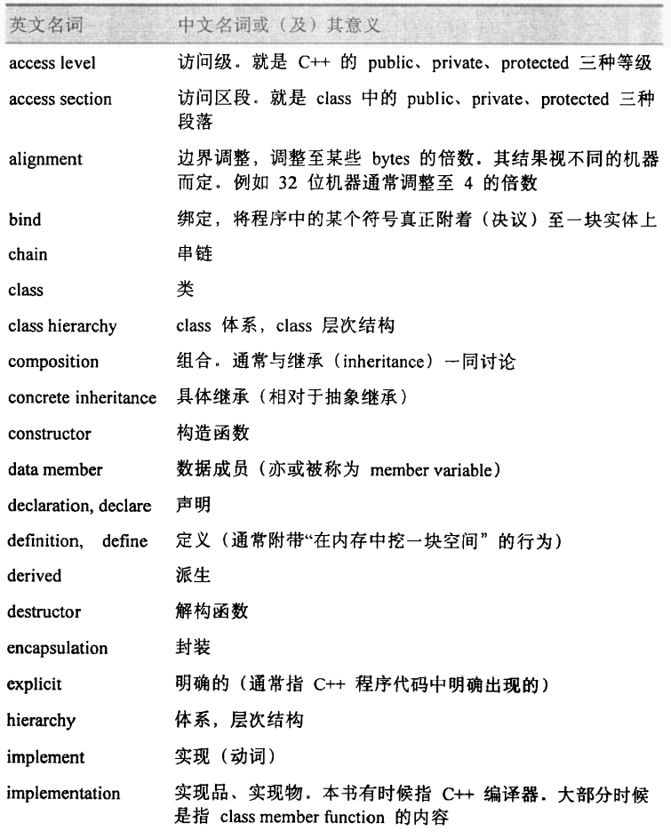

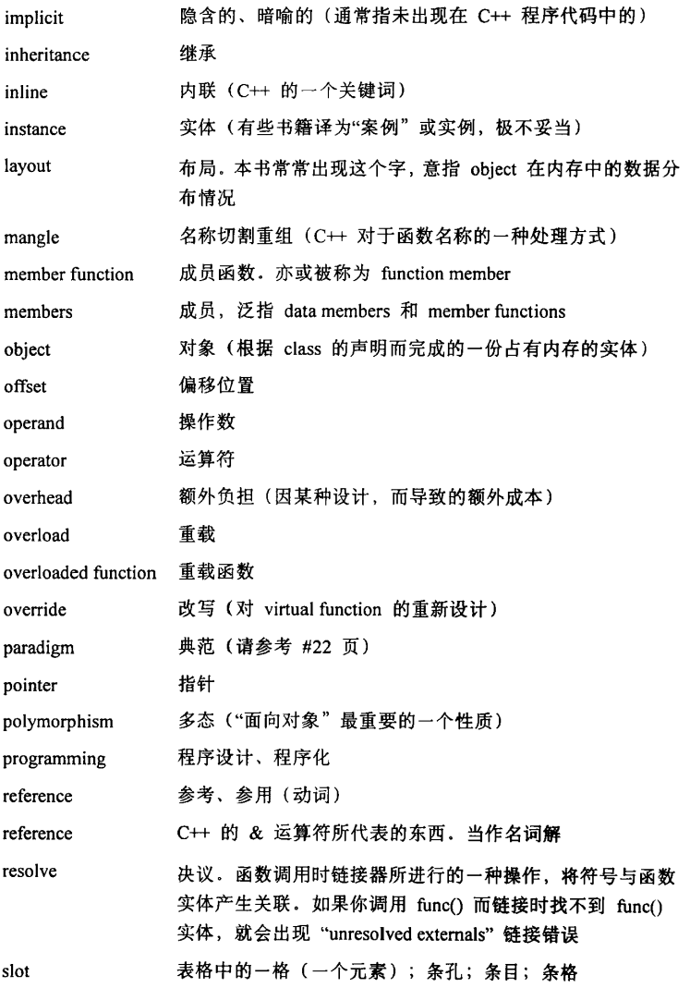

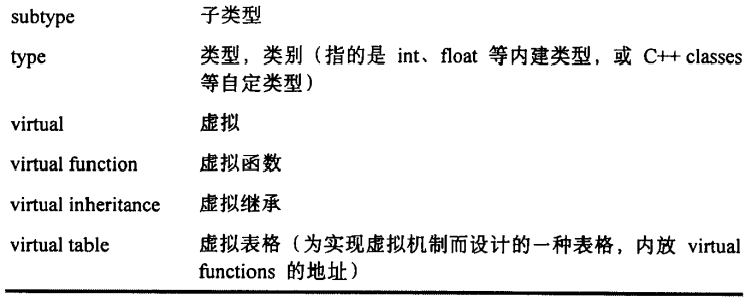


## Chapter1：关于对象

### 1.1 基础知识

:one:`C++`在布局以及存取时间上**主要的额外负担**是由`virtual`引起，包括：

+ 虚函数机制
+ 虚基类机制

### 1.2 C++对象模型:star:

#### 简单对象模型

:one:如图：

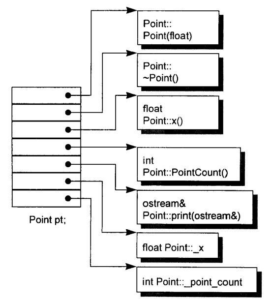

:two:`class object`的大小：指针大小，乘以`class`中所声明的`members`数目。


#### 表格驱动对象模型

:one:如图：

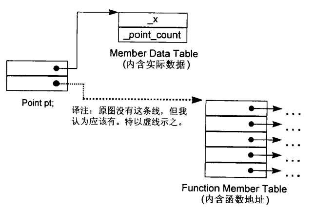

:two:虽然这个模型也没有实际应用于**真正的C++编译器**身上，但`member function table`这个观念却成为支持**虚函数**的一个有效方案。


#### C++对象模型:star:

:one:如图：

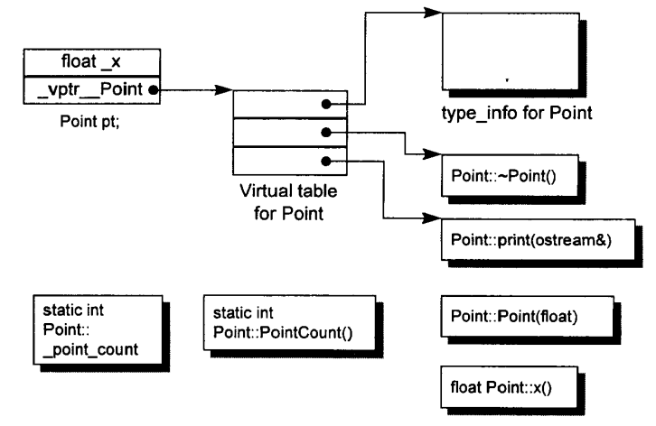

:two:C++对象模型：对象内只有==非静态数据成员==、指向虚函数表的`vptr`、slot集。这些slot集就指向了静态数据成员、静态成员函数、普通成员函数。

这个模型的主要优点在于它的空间和存取时间的效率，主要缺点则是：哪怕程序代码本身没有改变，但是`nonstatic data members`有所修改（增加、移除或更改），那么那些应用程序代码同样得重新编译。


### 1.3 对象的差异

#### 指针的类型

:one:“**指向不同类型的各指针**”间的差异，既不在其指针表示法不同，也不在其内容（代表一个地址）不同，而是在其所寻址出来的Object类型不同。也就是说，“**指针类型**”会教导编译器==**如何解释某个特定地址中的内存内容及其大小**==。

例如，包含一个`string`成员变量的类`ZooAnimal`的对象布局可能如下：

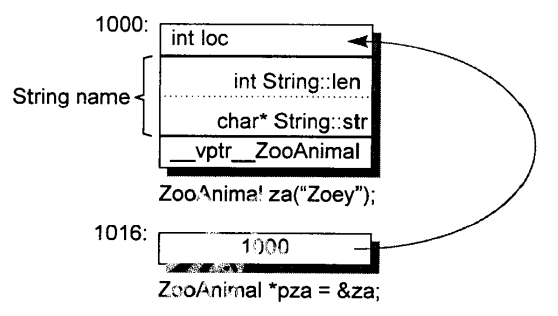

所以，**转型（CAST）**其实是一种编译器指令。大部分情况下它并**不改变一个指针所含的真正地址**，它只影响“指定内存的大小和其内容”的==解释方式==。

:two:如果`ZooAmimal`类派生出了`Bear`类，然后我们写出如下代码：

```c++
Bear b("Yogi");
Bear *pb = &b;
Bear &rb = *rb;
```

以上代码可能的内存布局如下：

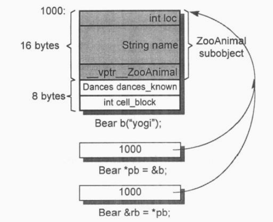

如果一个`ZooAnimal`的指针指向地址`1000`，它和`Bear`指针又有什么差别？答案是：前者所涵盖的地址只包含`Bear Object`中的`ZooAnimal subobject`。


#### OO和OB

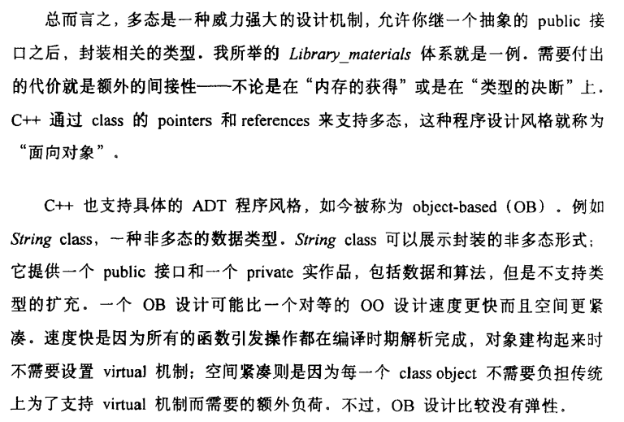


## Chapter2：构造函数语义学

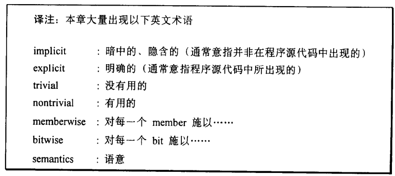

### 2.1 Default Construct的建构操作

:one:学习`C++`的时候，我们知道，**默认构造函数**会在需要的时候被**编译器**构造出来。问题在哪里呢？这句话有什么不对吗？看看如下代码：

```c++
class Foo { public: int val; Foo *next; };

void foo_bar()
{
    Foo bar;
    if(bar.val || bar.next)
    {
        ...
    }
    ...
}
```

似乎没什么问题，编译器会给我们生成默认构造函数，但事实呢？

为什么会这样？问题在于 "**在需要的时候**" ，上面难道不是需要一个默认构造函数吗？差别在于：一个是程序的需要，一个是编译器的需要。程序如果有需要，那是程序员的责任。==而只有当编译器需要的时候，才会合成默认构造函数==！

> 这段暂时跳过，因为我用编译器测试，似乎会生成（指针也会初始化为地址0）？这里给出原文的总结，但当前时代是否正确，暂时未知：
>
> 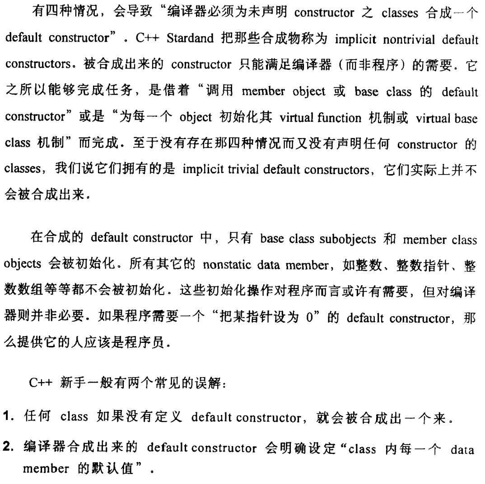


### 2.2 Copy Construct的建构操作

#### Default Memberwise Initialization

:one:当我们没有提供**拷贝构造函数**，却又需要它时，其内部是以所谓的`Default Memberwise Initialization`手法完成的。

> ==Default Memberwise Initialization==：把每一个内建的或派生的`data member`的值，从某个`object`拷贝一份到另一个`object`身上。不过它并不会拷贝其中的`member class object`，而是以递归的方式实施`Memberwise Initialization`。


#### bitwise copy semantics（位逐次拷贝）

> 以下是个人理解！

:one:如果这个`class`里面的成员只有**内置类型**、**没有拷贝构造函数的自定义类**，那么就符合`bitwise copy semantics`，也就不会生成拷贝构造函数！这种情况下，就会依次对成员进行**位逐次拷贝**，包括指针！（自定义类成员则在其内部进行**迭代的位逐次拷贝**）。例如：

```c++
class word
{
public:
    Word(const char*);
    ...
private:
    int cnt;
    char* str;
}
```

:two:反过来，如果类不符合**位逐次拷贝**，那么编译器就会合成**拷贝构造函数**。


#### 如何不符合位逐次拷贝？:star:

:one:以下四种情况不符合：

1. `class`中某一个成员对象，其类声明有一个**拷贝构造函数**（无论是自定义，还是编译器合成的）。

   ```c++
   class word
   {
   public:
       Word(const string&);
       ...
   private:
       int cnt;
       string str;
   }
   ```

2. 此`class`继承自一个`base class`，且`base class`存在一个**拷贝构造函数**。

3. 此`class`声明了一个或多个虚函数。

4. 此`class`派生自一个继承串链，其中一个或多个虚基类。

:two:第三点和第四点不太好理解，这里我们给出第三点的分析。

如果一个类拥有虚函数，那么它就会包含一个指向虚函数表的`vptr`，如果这个时候，没有拷贝构造函数，编译器还是使用**位逐次拷贝**，那么`vptr`就会导致问题：

```c++
// class Bear : public class ZooAnimal
Bear yogi;
ZooAnimal franny = yogi;
```

`franny`的`vptr`指向了错误的地址：

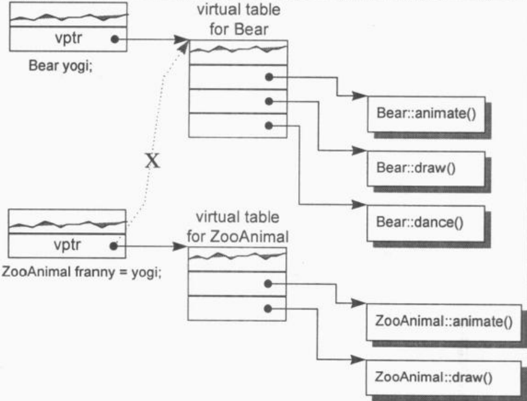

所以，编译器需要合成一个拷贝构造函数，来让`franny`的`vptr`指向正确的虚函数表！


### 2.3 程序转换语意学

#### 参数的初始化

:one:把一个`class object`当作参数传给一个函数：

```c++
void foo(X arg);
...
X xx;
foo(xx);
```

相当于以下形式的初始化操作：

```c++
X _temp0;

_temp0.X::X( xx ); // 拷贝构造

foo( _temp0 );
```

以上似乎是**脱裤子放屁**（传入`_temp0`不是还要复制？）？那是因为我们的转换只做了一半，我们还需要修改`foo`，形参得从**值传递**，变成**引用传递**：

```c++
void foo(X& arg)
{
    ...
    arg.X::~X(); //别忘记析构这个临时变量
}
```

这样就没有问题了。


#### 返回值的初始化

:one:已知下面这个函数：

```c++
X bar()
{
	X xx;
    ...
    return xx;
}
```

返回值如何从局部对象`xx`中拷贝出来？一个解决方法是：

1. 首先，也要修改函数定义，增加一个额外的引用参数，用来放置返回值：

   ```c++
   void bar(X& _result)
   {...}
   ```

2. `return`之前，安插一个**拷贝构造**的调用操作：

   ```c++
   void bar(X& _result)
   {
   	X xx;
   	xx.X::X();
   	... //处理xx
   	
   	_result.X::XX(xx);
   	return;
   }
   ```

3. 最后，别忘了，函数的使用代码也要重写：

   ```c++
   X xx = bar();
   // 修改成
   X xx;
   bar(xx);
   ```

   

#### 在编译器层面做优化:star:

:one:参考上一节的**返回值优化**，既然我们会有一个**隐藏的引用参数**，那么似乎函数内部产生的局部变量就有点浪费了，我们可以直接在函数内部使用这个引用参数，进行各种操作：

```c++
void bar(X& _result)
{
	// X xx;
	// xx.X::X();
    _result.X::X();
	... //直接处理_result
	return;
}
```

现在，我们就不需要产生一个局部变量`xx`，也不需要进行一次拷贝构造。这种编译器优化操作，被称为 `Name Return Value`（NRV）优化——这个优化已经是标准C++编译器必带的操作！

==注意：`NRV`需要这个类实现了**拷贝构造函数**（无论是编译器合成，还是自定义）==！我认为这个前提的原因是：`NRV`之前的代码，需要**引用参数**调用拷贝构造函数，编译器需要根据这个过程，来安排代码。

:two:关于`NRV`有很多争议：

+ 优化是否会发生，情况很复杂，程序员很难判断。
+ 优化有时也不是必要的。

关于第二点，看书没看懂，暂时跳过。但有一点可以提一嘴：字面上，我们应该会调用拷贝构造函数，来初始化对象，但由于`NRV`，我们实际上调用的是默认构造函数，所以得出结论：==由于`NRV`，我们会对**拷贝构造的调用与否**产生误判！==


#### 拷贝构造：Yes还是No :star:

:one:首先，我们总结上诉的各个内容：

+ 拷贝构造函数，只有当类==不符合==**位逐次拷贝**时，才会由编译器生成。
+ `NRV`优化需要类实现了**拷贝构造函数**。

看不懂，暂时跳过。


### 2.4 成员的初始化队伍

:one:首先，==初始化队列==指的是：

```c++
Word(): _name(0), _cnt(0) {}
```

这个写法相对于直接在构造函数中写显式代码，效率要高很多，因为**显式代码**会产生**临时对象**：

```c++
Word()
{
    _name = 0;
    _cnt = 0;
}

// 编译器扩张

word(/* this pointer goes here */)
{
    _name.String::String();
    
    String temp = String(0);
    
    _name.String::operator=(temp);
    
    temp.String::~String();
    
    _cnt = 0;
}
```

而**初始化队列**则简单很多：

```c++
_name(0), _cnt(0) {} 

// 编译器扩张

word(/* this pointer goes here */)
{
	_name.String::String(0);
    _cnt = 0;
}
```


:two:**初始化队列**也会插入代码，那么顺序如何？编译器会一一操作**初始化队列**，以适当次序在构造函数之内插入初始化操作，并且在任何**显式的用户代码**之前。

注意：初始化队列中的排列顺序实际没有作用，**代码的执行顺序**是由`class`中的**成员声明顺序**决定的：

```c++
class X{
    int i;
    int j;
public:
    
    X(int val) : j(val), i(j) {}
    ...
}

// 实际上
X(int val)
{
    i = j;
    j = val;
}
```

所以，上诉代码实际是错的，这是个很难发现的`BUG`。

:three:**初始化队列**中可以使用**类的成员函数**进行初始化。

:four:**派生类的初始化队列**中会调用**基类的构造函数**，那如果基类的构造里面，使用**派生类的成员**，可以吗？

```
// 基类：X
// 派生类：Y
// 派生类成员：a

Y(int cnt): a(cnt), X(a) {} // X(a)S是调用基类的构造函数
```

关于这一点，后续章节进行讨论。


## Chapter3：Data语意学

:one:考虑有如下代码：

```c++
class A {};
class B : public virtual A {};
class C : public virtual A{};
class D : public B, public C {};

void ClassSizeTest1()
{
	A a;
	B b;
	C c;
	D d;
	cout << sizeof(a) << endl;
	cout << sizeof(b) << endl;
	cout << sizeof(c) << endl;
	cout << sizeof(d) << endl;
}
```

结果是：

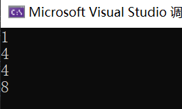

为什么？

:two:我们依次进行分析：

1. 类`A`事实上并不是空的，它有一个隐晦的`1 byte`，那是被编译器安插进去的一个`char`，让这个类的对象都可以在内存中配置一个独一无二的地址。所以`A`的大小是`1`。

2. 类`B`和类`C`最基本情况下，其大小应该是`8`，如下图，开头存储**指向虚基类（或与其相关的表格）的指针**（占据`4`字节），然后是本体（由于也是空类，所以这部分大小也是`1`字节），最后是对齐的开销（`3`字节，凑齐`8`）。

   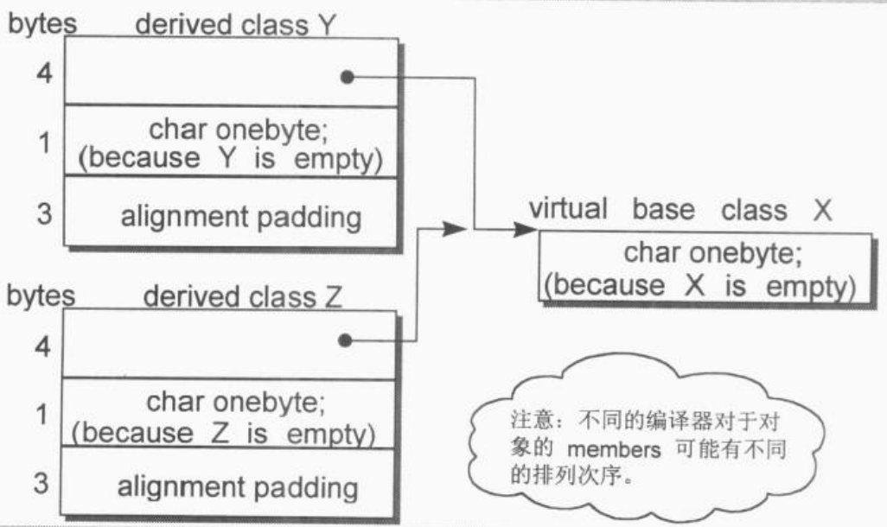

   由于我们的虚基类是空的，所以可以进行优化：**一个空的虚基类**被视为**派生类对象**最开头的一部分，具体分析见书：

   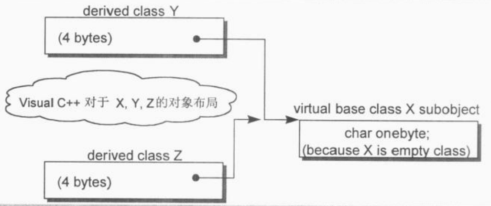


### 3.1 Data Member的绑定

```c++
using length = int;
extern int val;
class BindA {
	void Func1(length a) { length cc = val; } //length = int, length = float，val = BindA::val
	length Func2(int b) { return val; }
public:
	using length = float;
	length val;
};
```

:one:具体分析见书，这里给出精炼总结：

+ 对于成员函数的分析，会在`class`的声明都出现了才开始，因此，在一个内联成员函数的内部进行**数据成员的绑定操作**，会在整个`class`的声明完成之后才发生。所以上诉代码中，第四行的第二个`length`实际上是`float`，而`val`也是类的数据成员，而不是`extern int x`。
+ 但**成员函数的参数列表**则不一样，会在遇到时，立马进行分析（`resolve`）。所以，代码的第四行的第一个`length`是`int`，第五行的函数返回值也是`int`。

:two:因为有上诉第二点的存在，我们在类内部使用**别名**的时候，要把**别名**放在类最开始，不然某些情况（函数外部使用别名的情况）会报错的：

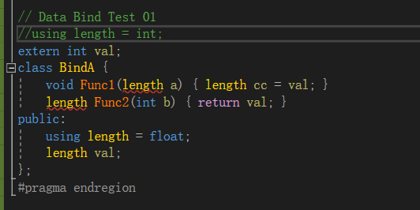


### 3.2 Data member的布局

:one:一般来说，编译器都会根据**成员的声明顺序**，来安排它在`class object`中的顺序。当然，静态成员变量除外，他们都位于程序的`data segment`中，不影响`nostatic`成员的布局。

:two:**成员的布局**会按照`access section`（也就是`public`、`private`等）进行区分。只有这些分区内部的成员变量，才会按照**声明顺序**布局。而这些分区的顺序，则随编译器的不同而不同。

:three:技法：接受两个`data members`，然后判断谁先出现在`class object`之中。如果两个`members`都是不同的`access section`中第一个被声明者，那么就可以来判断哪一个`section`先出现：

```c++
template<class class_type, class data_type1, class data_type2>
char* access_order(data_type1 class_type::* mem1, data_type2 class_type::* mem2)
{
	assert(mem1 != mem2);
	return mem1 < mem2 ? "member 1 occurs first" : "member 2 occurs first";
}
```


### 3.3 Data Member的存取

:one:已知下面这段程序代码：

```c++
Point3d origin;
origin.x = 0.0;
```

`x`的存取成本是什么？答案视`x`和`Point3d`如何声明而定：`x`是`static`还是`nostatic`；`Point3d`是否是派生类，是否有虚拟继承。接下来，我们会依次研究。

:two:在开始之前，抛出一个问题。如果我们有两个定义`origin`和`pt`：

```c++
Point3d origin, *pt = &origin;
```

我用他们来存取`data members`：

```c++
origin.x = 0.0;
pt->x = 0.0;
```

以上两者有什么差异吗？后续进行解释。


#### Static Data Member

:one:由于`Static Data Member`与类无关，只有一个存在于`data segment`的实体，所以它的存取都是一致的——无论`Point3d`的形式（是否有虚拟继承），又或者上诉的问题（直接存取，还是通过指针）：

```c++
origin.x = 0.0; 
// == Point3d::x = 0.0
pt->x = 0.0;
// == Point3d::x = 0.0
```

:two:如果两个`classes`都声明了一个`static member freeList`，那么它们都会存放在程序的`data segment`，似乎会导致**命名冲突**？编译器的解决方法是：暗中对每一个`Static Data Member`编码（这种手法被命名为`name-mangling`），以获得一个独一无二的程序识别代码。


#### Nonstatic Data Member:star:

:one:直接存放在每一个`class object`之中。除非经由明确的或暗喻的`class object`，否则没有办法直接存取它们。

关于暗喻的`class object`，比较简单，具体见书。

:two:欲对一个`Nonstatic Data Member`进行存取操作，编译器需要把`class object`的起始地址加上`data member`的偏移量。举个例子，如果：

```c++
origin.y = 0.0;
```

那么地址`&origin.y`将等于：

```c++
&origin + (&Point3d::y - 1);
```

:star:请注意其中的`-1`操作。指向`data member`的指针，其`offset`值总是被加上`1`，这样可以使**编译系统**区分出：

+ 一个指向`data member`的指针，用以指出`class`的第一个`member`
+ 一个指向`data member`的指针，没有指出任何`member`。

以上内容在3.6节进行详细讨论。

:three:对于`Nonstatic Data Member`，哪怕它是派生类中基类模块的成员，其偏移量也可以在编译时期可知。所以效率不变。

==但虚拟继承会让下面这种情况慢一点==：

```c++
Point3d *pt3d;
pt3d->x = 0.0;
```

:four:那么，我们来回答一开始提出的问题：

```
origin.x = 0.0;
pt->x = 0.0;
```

以上两者有什么差异吗？当`Point3d`是一个派生类，而且存在虚拟继承，并且`x`是一个从该虚拟基类继承而来时，通过指针存取`pt->x`，效率会变低。


### 3.4 继承与Data Member

:one:在继承体系中，虽然没有规定，但一般都是先排列基类成员，然后才是派生类的部分。

> 如果是虚拟继承，则另说。事实上，任何一条规则一旦碰上虚拟继承，就没辙了。

:two:接下来，分各个情况来进行详细讨论。主要以`Point2d`、`Point3d`进行举例。基本的实现方式就是，这两者都是单独的一个类，没有继承关系。


#### 只要继承不要多态:star:

:one:`Point3d`直接继承`Point2d`，没有虚函数（多态）。

首先，根据`3.3`节，我们知道：**成员的存取成本没有区别**。其数据布局如下：

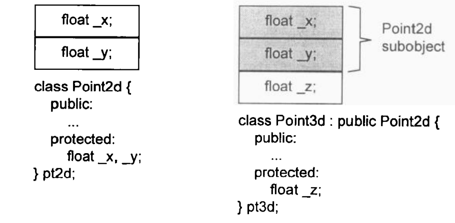

:two:随意把两个不相关的类，设计成**继承关系**，又或者不考虑**内存分布**，这些都会导致很多问题。书上关于这一点的讨论，非常好！详情见书。


#### 加上多态

:one:这个时候，我们在`Point2d`中加入了几个虚函数。为了支持**多态的弹性**，编译器带来了**空间和存取时间的额外负担**：

+ 导入一个和`Point2d`有关的`virtual table`，用来存放它所声明的每一个`virtual functions`的地址。这个`table`的元素数目一般是**被声明的虚函数的数目**，再加上一个或两个`slots`（用以支持`RTTI`——运行时类型识别）。
+ 每一个`class object`中导入一个`vptr`，提供执行期的链接。使每一个`object`能够找到相应的`virtual table`。
+ 加强`constructor`，使它能够为`vptr`设定初值。
+ 加强`destructor`，使它能够抹消`vptr`。

:two:成员的存取成本没变，但**变成虚函数的那些函数**的调用成本都变了。

:three:关于多态，一个重要的讨论问题是：`vptr`应该放在`class object`的哪里？

+ 放在对象的尾端：可以保留`base class`的对象布局。

  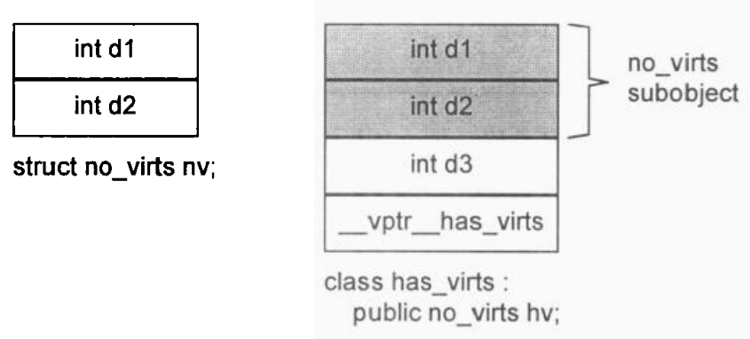

+ 放在起头处。

  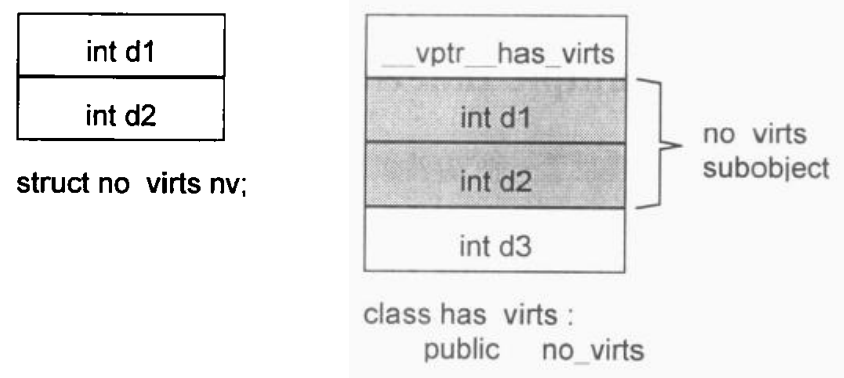

而我们这里的例子，其布局应该是：

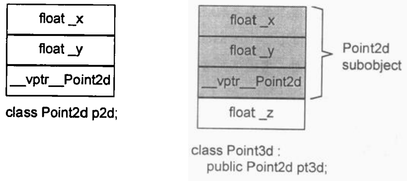


#### 多重继承

:one:考虑上图的布局，我们把一个派生类对象指定给**基类的指针或引用**，该操作不需要编译器去修改地址，可以很自然地发生，并且效率最佳：

```c++
Point3d p3d;
Point2d *p = &p3d;
```

> 如果存在多态，且`vptr`是放在对象起始处，基类没有虚函数，派生类有虚函数，那么就需要编译器介入，来调整地址。

:two:举一个**多重继承**的例子：

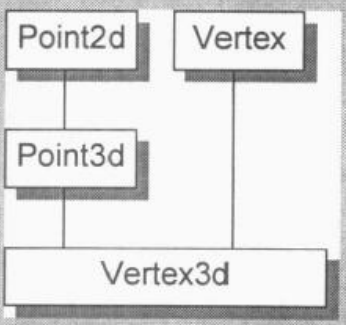

==多重继承的问题==主要发生于**派生类对象**和其**第二或后继的基类对象**之间的转换：

+ 对于一个**多重派生对象**，将其地址指定给**最左端基类的指针**，情况和单一继承相同。
+ 至于第二个或后继的基类对象，则需要修改地址。

例如：

```c++
Vertex3d v3d;
Vertex *pv;
Point2d *p2d;
Point3d *p3d;

//
pv = &v3d;
```

需要这样的内部转化：

```c++
pv = (Vertex*)(((char*)&v3d) + sizeof(Point3d));
```

:three:下面给出上诉**多重继承的内存布局**：

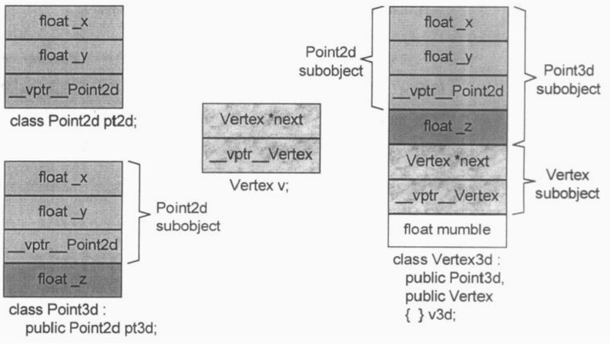

:four:和之前说的一样。`members`的位置在编译时就固定了，因此，存取`members`的成本依然没有变化。


#### 虚拟继承

:one:棱形继承的解决方法就是==虚拟继承==：

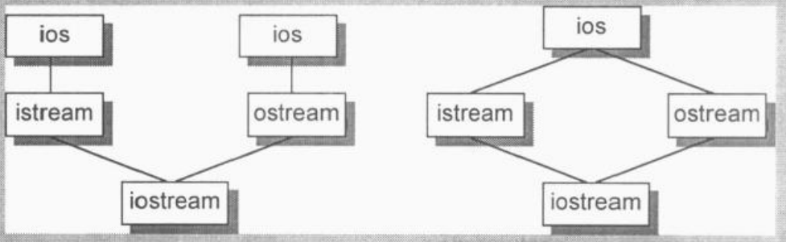

```c++
class ios {...};
class istream : public virtual ios {...};
class ostream : public virtual ios {...};
class iostream : public istream, public ostream {...};
```

`Class`如果内含一个或多个`virtual base class subobjects`，像`istream`那些，将被分割为两部分：

+ 一个不变局部：拥有固定的`offset`（从`object`的开头算起），所以这部分数据可以被直接存取。
+ 一个共享局部：所表现的就是`virtual base class subobject`。这一部分数据，其位置会因为每次的派生操作而有变化，所以它们只能被==间接存取==。

各家编译器的技术差异就在于**间接存取**，下面给出==几个主流策略==。这里先给出例子中用到的层次结构：

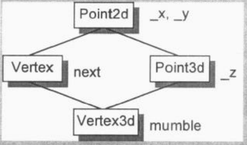

:two:`cfront`的实现方式是：==编译器会在每一个派生类对象中安插一些指针==。每个指针指向一个虚基类，例如：

```c++
void Point3d::operator+=(const Point3d &rhs)
{
	_x += rhs._x;
	_y += rhs._y;
	_z += rhs._z;
}
```

这个运算符会被内部转换成：

```c++
_vbcPoint2d->_x += rhs._vbcPoint2d->_x;
_vbcPoint2d->_y += rhs._vbcPoint2d->_y;
_z += rhs._z;
```

这种模型的缺点在于：

+ 每一个对象，必须针对每一个虚基类背负一个额外的指针。
+ 由于虚拟继承串链的加长，导致间接存取层次的增加。

此模型的内存布局如下图：

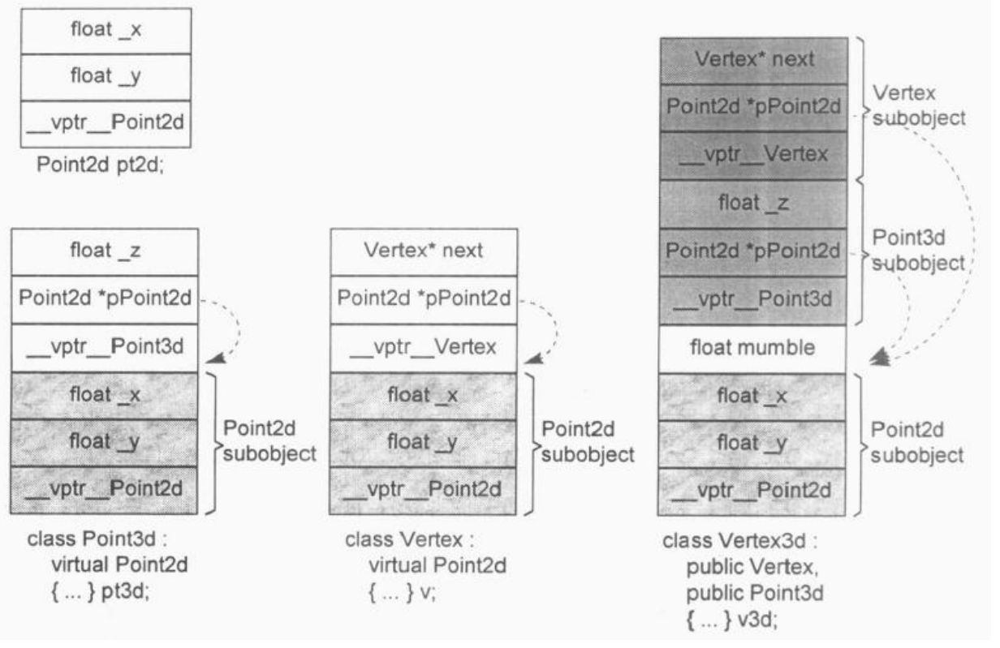

:two:第二个解决方法是在`virtual function table`中放置`virtual base class`的`offset`。下图给出了它的实现模型：

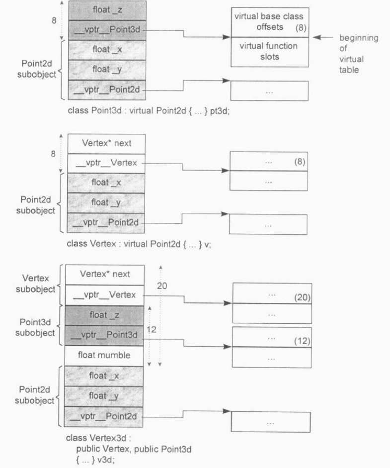


### 3.5 对象成员的效率

ToDo。


### 3.6 指向Data Members的指针

:one:指向`data members`的指针，是一个有点神秘但颇有用处的语言特性。我们可以使用它来确定编译器的设计：`class`中的`access sections`的顺序，`vptr`的存放位置等。考虑下面的声明：

```c++
class  Point3d {
public:
	virtual ~Point3d();

protected:
	static Point3d origin;
	float x, y, z;
};
```

取某个成员的地址，代表取得它在`class object`中的偏移量：

```
& Point3d::z;
```

而下面这个写法就是得到该`member`在内存中的真正地址：

```
Point3d origin;
& origin.z;
```

所以：origin起始地址 = (& origin.z) - (& Point3d::z) + 1;

> 为什么加一？<只要继承不要多态>解释了为什么。


## Chapter4：Function语意学

### 4.1 Member的各种调用方式

#### 非静态成员函数

:one:`c++`的设计准则之一：**非静态成员函数**至少必须和**一般的非成员函数**有相同的效率。实际上，成员函数会内化为非成员的形式，下面是**转化步骤**：

> 以下面这个函数为例子：
>
> ```c++
> Point3d magnitude3d()const {...}
> ```
>

1. 改写函数的`signature`，以安插一个额外的参数到`member function`中。该额外参数为`this`指针：

   ```c++
   Point3d magnitude3d(Point3d const* this) 
   ```

   如果成员函数是`const`，则变成：

   ```c++
   Point3d magnitude3d(const Point3d const* this) 
   ```

2. 将每一个“对非静态数据成员的存取操作”，改为经由`this`指针来存取：

   ```c++
   Point3d magnitude3d(Point3d const* this) 
   {
   	return sqrt{this->x * this->x +
   				this->y * this->y +
   				this->z * this->z};
   }
   ```

3. 将成员函数重新写成一个外部函数，对函数名称进行`mangling`处理：

   ```c++
   extern magnitude_7Point3dFv(register Point3d* const this);
   ```

现在，这个函数已经被转换好了，而其每一个调用操作都必须转换，于是：

```c++
obj.magnitude();
//变成了
magnitude_7Point3dFv(&obj);
```


#### name mangling:star:

具体见书。

#### 虚拟成员函数

:one:如果`normalize()`是一个虚拟成员函数，那么以下的调用：

```c++
ptr->normalize();
```

将会被内部转化为：

```c++
( * ptr->vptr[ 1 ] )( ptr );
```

其中：

+ `vptr`是指向虚函数表的指针。事实上，其名称也会被`mangled`，因为在一个复杂的`class`派生体系中，可能存在多个`vptrs`。
+ `1`是`virtual table slot`的索引值，关联到`normalize`函数。
+ 第二个`ptr`表示`this`指针。

:two:如果**虚拟函数**已经由**虚拟机制**决议妥当，例如，我们在虚拟函数`normalize`中调用`magnitude`，那么实际上，`magnitude`已经决议好了，那么可以明确调用，这样更有效率：

```c++
Point3d normalize(Point3d const* this) 
{
    ...
	float mag = this->magnitude();
    // 直觉，但没有考虑决议与否
    float mag = ( *this->vptr[ 2 ] )( this );
    // 考虑在虚拟函数内部，肯定已经决议完了，更有效率的转化
    float mag = Point3d::magnitude();
}
```

:three:考虑对象直接调用虚函数：

```c++
obj.normalize();
```

如果编译器把它变成：

```c++
( * obj.vptr[ 1 ] )( &obj );
```

语意正确，却没有必要，实时上，这时候，我们实际上并没有依赖多态，或者说，==虚函数都已经决议完了==，所以我们这里**更有效率的转换**是：像对待**一般的非静态成员函数**一样：

```c++
normalize_7Point3dFv( &obj );
```

:four:综上所述，哪怕我们使用虚函数，但实际上在调用虚函数时，编译器会使用`vptr`进行转换的情况是少数。


#### 静态成员函数

:one:静态成员函数和一般的成员函数不同，它不需要访问**非静态数据成员**。它的**主要特性**就是：没有`this`指针。还有以下的次要特性：

+ 不能够直接存取`class`中的非静态成员
+ 不能被声明为`const`、`volatile`或`virtual`
+ 不需要经由`class object`才被调用。

:two:一个`static member function`会被提出于`class`声明之外，并给予一个经过`mangled`的适当名称。

:three:如果取一个`static member function`的地址，其地址类型是一个"nonmember 函数指针"，也就是说：

```c++
&Point3d::object_count();
//其类型是
unsigned int (*)();
//而不是
unsigned int (Point3d::*)();
```


### 4.2 虚拟成员函数

:one:为了支持虚函数机制，必须首先能够对于多态对象有某种形式的==执行期类型判断法==。

```c++
ptr->z();
```

并不是所有类都需要**执行期信息**，来进行判断。具体分析见书，最后的结论是：通过是否有任何虚函数，来判断这个类是否需要**额外的执行期信息**。

:two:那么，第二个问题就是**额外的执行期信息**是什么？显然，我们需要知道：

+ `ptr`所指对象的真实类型
+ `z()`的实体位置

实现上，我们需要在多态类上增加两个`members`：

+ 一个字符串或数字，表示`class`的类型
+ 一个指针，指向某表格，表格中带有程序的**虚函数的执行期地址**。

这个表格就是所谓的**虚函数表**，它在编译期就可以完全备妥，不需要执行期的任何介入。每一个虚函数都被指派了一个表格索引值。

:three:一个`class`只会有一个虚函数表，内部包括：

+ 这个类所定义的函数实体，它会改写一个可能存在的基类虚函数。
+ 继承自基类的函数实体——派生类没有进行改写
+ 一个`pure_virtual_called()`函数实体，它即可以扮演`pure virtual function`的空间保卫者角色，也可以当作执行期异常处理函数。

以我们一直举例的`Point class`体系来看：

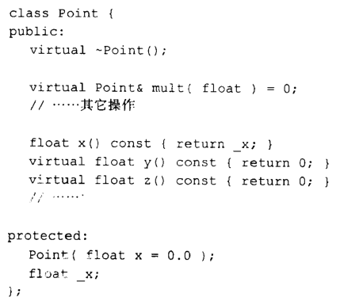

析构函数被赋值`slot 1`，而`mult()`被赋值`slot 2`，这里由于它是纯虚函数，没有函数定义，所以`pure_virtual_called()`的函数地址会被放在`slot 2`中。整个体系的内存布局如下图：

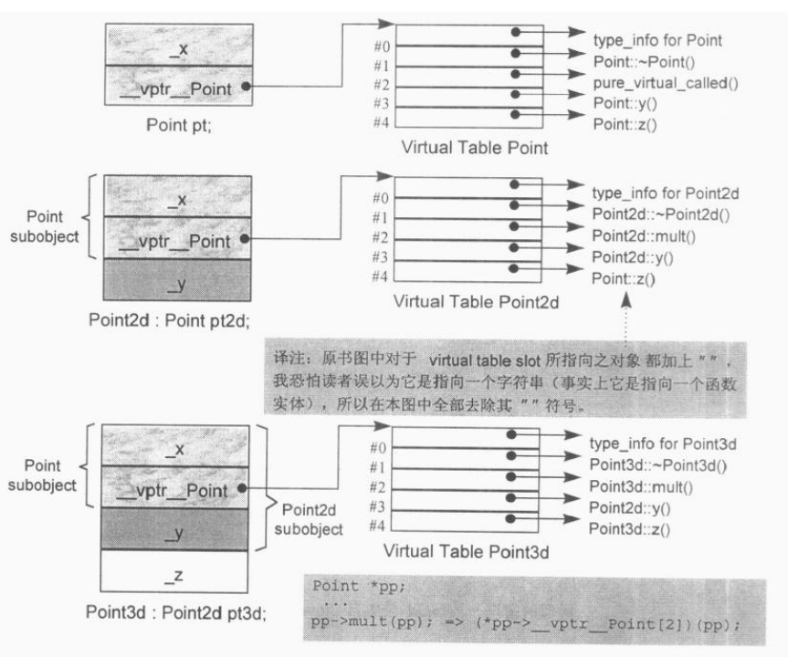

> 书中会对上诉图进行详细说明，具体见书。

:four:现在，回到最初，如果我有这样的式子：

```c++
ptr->z();
```

那么，虽然我不知道`ptr`所指对象的真正类型，但是我知道经由`ptr`可以存取到该对象的虚函数表，然后我知道每一个`z()`函数地址都会被放在`slot 4`，这样，该调用就转化为：

```c++
(*ptr->vptr[4])(ptr);
```


#### 多重继承下的虚函数

:one:在多重继承中支持虚函数，其**复杂度**围绕在第二个以及后继的`base classes`身上，以及“必须在执行期调整`this`指针”这一点。以下面的`class`体系为例：

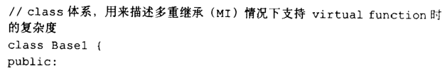

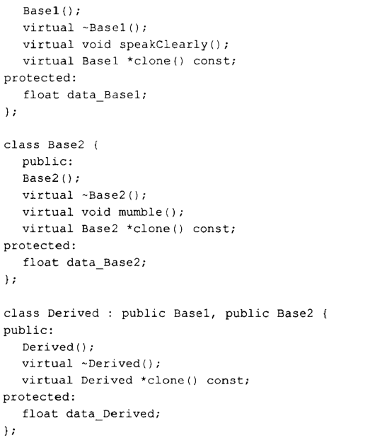

`Derived`支持虚函数的难度主要在于`base2 subobject`，它有三个问题需要解决：

+ 虚析构函数
+ 被继承下来的`Base2::mumble()`
+ 一组`clone`函数实体

:two:对于这三个问题，其实主要核心就是：调整`this`指针。考虑如下代码：

```c++
Base2 *pbase2 = new Derived();
```

新的`Derived`对象的地址必须调整，以指向其`base2 subobject`。但调整地址所需的`offset`，以及对应的操作，则需要由编译器在某个地方插入，关于这点，具体见书。个人感觉，过于硬核，无需了解。

==我们更加需要理解的是==：在多重继承下，一个派生类含有`n-1`个额外的虚函数表，由于本例只有2层，所以会有一个额外的虚函数表，总计两个虚函数表被生成出来：

+ 一个主要实体，与`Base1`（最左端base class）共享
+ 一个次要实体，与`Base2`（第二个`base class`）有关

针对每一个虚函数表，派生类对象中有对应的`vptr`，下图说明了这一点：

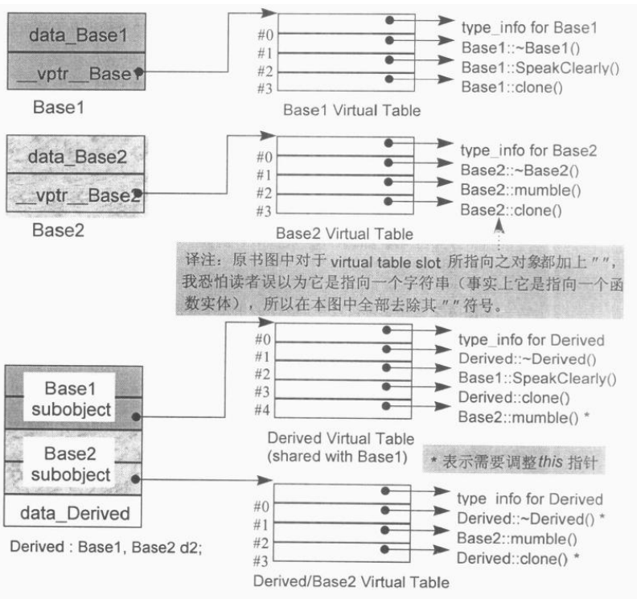

```c++
vtbl_Derived;  //主要表格
vtbl_Base2_Derived;  // 次要表格
```

当我们将`Derived`对象地址指定给一个`Base1`指针或`Derived`指针时，处理**主要表格**；而指定给一个`Base2`指针，则处理**次要表格**。

:three:上面似乎并没有解决那三个问题——尽管我们指出了核心所在。看看如下代码：

```c++
Base2* ptr = new Derived;

delete ptr;
```

似乎有个疑问？我们之前说过，这三个问题的核心都是：`this`指针的调整。以上诉展示的第一个问题为例：`ptr`的指针类型是`Base2`，所以它会加一个`offset`，以指向`Base2`部分。这个地方没有问题。但是`delete`的时候，书上说要再次利用`offset`，以指向对象的开头，但似乎没有必要，因为`Base2`所对应的次要表格中，**析构函数**已经被`Derived`的改写了——我们可以找到**正确的析构函数**！

但别忘了，实际上，所有的**非静态成员函数**都要由编译器进行改写，它们会有一个默认的参数：`this`！所以我们需要传入正确的`this`给**析构函数**，而如果我们不进行`this`的调整，让它指向`Derived`对象的开头，那么就会析构错误！

后续两个问题也是一致的分析方式，具体见书。


#### 虚拟继承下的虚函数

:one:考虑下面的`virtual base class`派生体系：

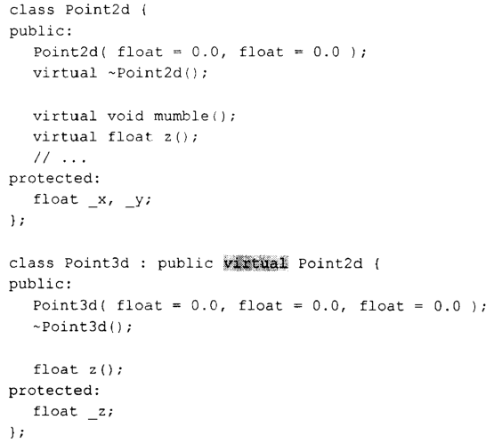

这个时候，虽然也是单一继承的情况，但是内存布局却大为不同，见下图：

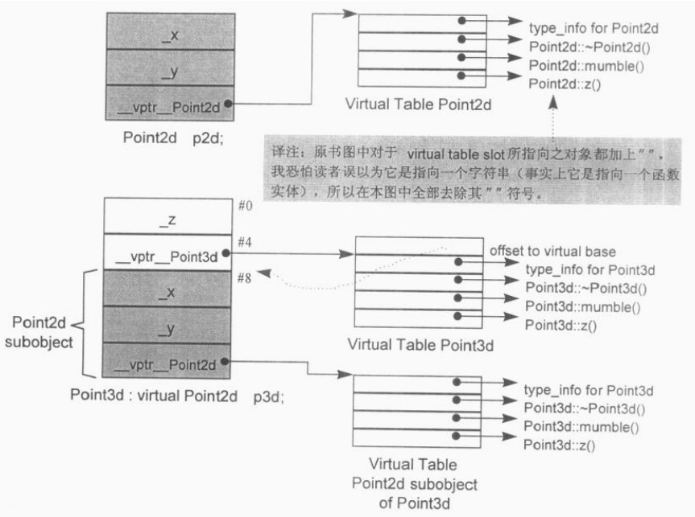

以上情况太过诡谲，作者没有进行过多解释和探讨，==他唯一的建议是：不要在一个`virtual base class`中声明`nonstatic data members`！==


### 4.3 函数的效能

具体见书。


### 4.4 指向Member Function的指针

:one:取一个**非静态成员函数**的地址，如果该函数是**非虚的**，则得到它在内存中真正的地址。然而这个值是不完全的，需要被绑定到某个`class object`的地址上，才能通过它调用该函数。其声明语法如下：

```c++
double (Point::*pmf) ();
```

然后，我们可以这样定义，并初始化该指针：

```c++
double (Point::*coord)() = &Point::x;
```

也可以这样指定其值：

```c++
coord = &Point::y;
```

想调用它，可以这样做：

```c++
(origin.*coord)();
//或
(ptr->*coord)();
```

这些操作会被**编译器**转化为：

```c++
(coord)(&origin);
//或
(coord)(ptr);
```

:two:使用一个**成员函数指针**，如果并不用于虚函数、多重继承、虚拟继承，那么并不会比使用一个**非成员函数指针**的成本更高。


#### 支持指向虚成员函数的指针

:one:考虑下面的程序：

```c++
float (Point::*pmf)() = &Point::z;
Point *ptr = new Point3d;
```

如果，我们直接使用：

```c++
ptr->z();
```

则被调用的是：`Point3d::z()`，但如果我们从`pmf`间接调用`z()`呢？

```c++
(ptr->*pmf)();
```

仍然是`Point3d::z()`被调用吗？答案是`Yes`，为什么？怎么做到的？

:two:对一个虚函数取地址，我们不会得到其真实的内存地址，而是其相关的**虚函数表**中的索引值。所以：

```c++
&Point::z();
```

得到的结果是`2`。通过`pmf`来调用`z()`会被内部转化为一个编译时期的式子，一般形式如下：

```c++
(*ptr->vptr[ (int)pmf ]) (ptr)
```

:three:现在的问题的是，怎么做才可以让`pmf`能够：

+ 含有两种数值
+ 其数值可以被区别代表内存地址，还是虚函数表中的索引值。

书中给出了一个技巧，具体见书。


#### 在多重继承之下，指向成员函数的指针

:one:为了支持**多重继承**和**虚拟继承**，需要一个如下的结构体：

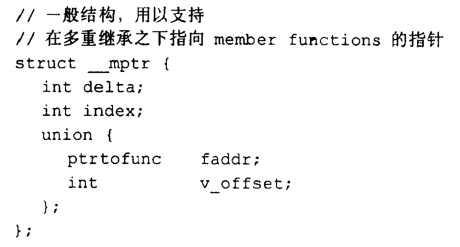

`index`和`faddr`分别带有**虚函数表索引**和**非虚函数地址**（为了方便，当`index`索引不指向虚函数表时，会被设为`-1`）。在该模型下，调用操作：

```c++
(ptr->*pmf)();
```

会变成：

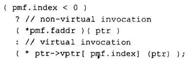

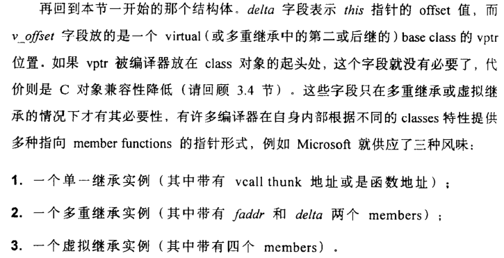


#### 指向成员函数的指针的效率

具体见书


### 4.5 内联函数

具体见书。

这里只给出总结：`inline`函数中的局部变量，再加上有副作用的参数，可能会导致大量临时性对象的产生，特别是如果它以单一表达式的形式被扩展多次的话。


## Chapter5： 构造、析构、拷贝语意学

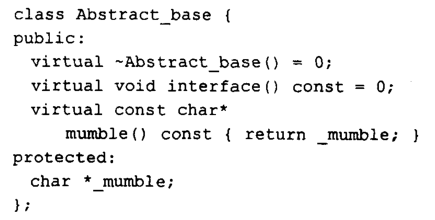

:one:我们可以定义和调用一个==纯虚函数==！不过它只能被静态的调用，不能经由虚拟机制调用。

```c++
// 纯虚函数的定义
inline void Abstract_base::interface() const
{
	...
}

// 调用
Abstract_base::interface();
```

我们要不要定义纯虚函数，由我们自己决定，但我们一定要定义==纯虚析构函数==。所以，最好的方法就是：不要把==虚析构函数==定义为`pure`。

:two:虚拟机制中是否使用`const`是个头痛的问题，一个简单的避免方法：不使用`const`。

:three:以下重新定义，才是比较适当的一种设计：

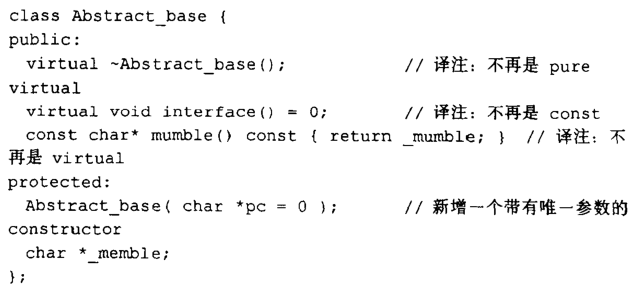


### 5.1 ”无继承“情况下的对象构造

:one:具体见书。


### 5.2 继承体系下的对象构造

:one:
