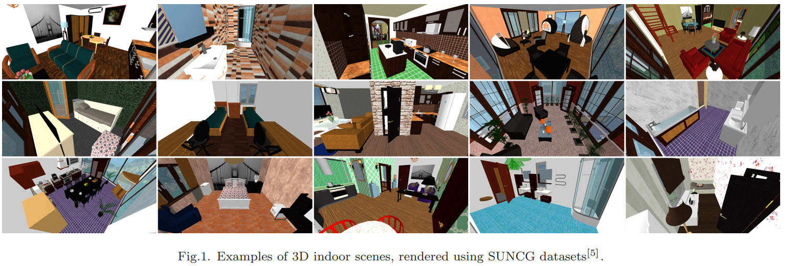
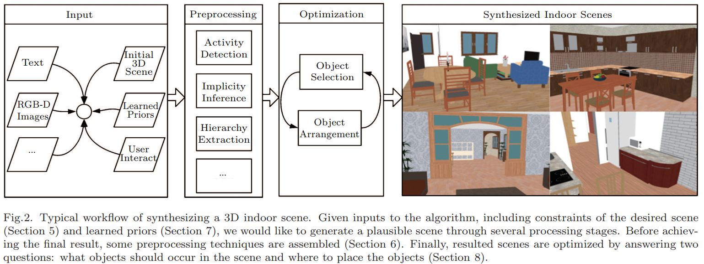
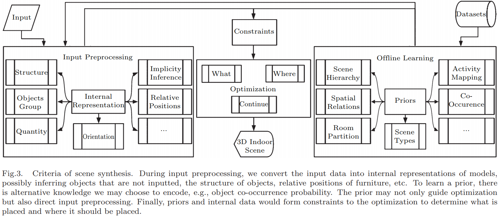
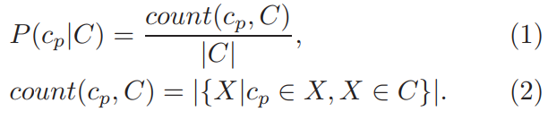
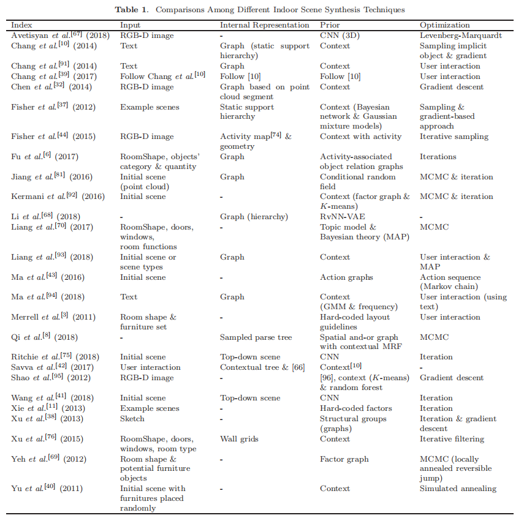

# A Survey of 3D Indoor Scene Synthesis

在这篇总结中，作者提出了四个标准，根据不同的方面（具体来说，有四组类别）对各种3D（三维）室内场景合成技术进行了归类。全面比较所有技术来展示它们的优点和缺点，并讨论潜在的遗留问题。

### 1. Introduction

合成3D(三维)室内场景是困难的。==首先==，不同的房间通常提供不同的功能，如睡觉、看电视或吃饭，但有时一个房间可能有多种用途，例如，我们可以客厅在做饭。==其次==，室内场景的设计(具体来说就是对象的选择、定位和定向)要考虑很多方面。例如：物体之间的排列，应该允许简单明了的行走路线，以及，所有物体都可以被访问。==此外==，房间设计也可能需要满足非功能性需求，例如，视觉上的愉悦。接下来，一个室内场景的状态，即在房间里有什么物体，它们在哪里，存在于一个极其复杂的高维空间中，包括物体数量的离散类别，物体位置和方向的连续值等。在这种情况下，很难定义处理`measures`和优化算法

约束`constraints  `，即在哪里摆放什么，既有单个场景的，也有复合场景的（“bed-sit” is a single room that combines a kitchen, a bedroom, and a sitting room all into one space. ）。约束应该是具有一定审美的（符合现实在很多时候就符合审美）。同时，不同的用户，例如场景设计师和游戏设计师，对于场景约束有着不同的要求。

下图为自动生成室内三维场景的一般工作流程。理想情况下，任何格式的输入都是可以接受的，并且大多数工作都将包含学习过的先验知识（learned priors  ）（包含人类对布局和功能的认知）。接下来，要对输入进行重新格式化，因为有时候输入不是结构性的。例如，考虑到二元关系和对象的属性，可以将文本输入转化为一张图。最后，"是什么 "和 "在哪里 "的问题，通常是通过优化一个给定上面所有因素的场景来回答。

建立该问题模型的一般方法是：将其看作 a search through a space of labelled graphs 。在这种情况下，图形的节点对应于对象，而弧表示它们之间的关系。这个空间非常大，也非常复杂，这使得这个问题看起来很困难。理想情况下，在这个空间定义的功能将衡量审美和应用价值，但这些是主观的，很难明确。

文献形成了四种划分工作的标准，具体为四组类别。每一个维度都是分类的，==包含几类。这些标准是：==

• ==输入==，包括显式初始化场景、草图（sketch）、文本等;
		• ==internal representation==, including graph, activity-based representation and projection;  （内部表示，包括图形、基于活动的表示和投影;）

• ==prior==, including hard-coded priors, context, activity-driven priors, examples and neural networks;（先验，包括硬编码的先验、上下文、活		动驱动的先验、示例和神经网络）
		• ==optimization==, including interactions, explicit iterations, gradient-based approach and Markov Chain Monte Carlo (MCMC).  （优化，包括交		互，显式迭代，基于梯度的方法和基于蒙特卡罗的马尔可夫链）

我们之所以遵循这四个标准，是因为它们形成了一个完整的综合过程。直观地说，这四个标准对于一种合成技术是完全充分的。大量的工作依赖于更少的方面，例如：没有先验。（==交互性==可能被一些人认为是一个有效的维度。我们将人机交互作为一个类包含在==优化维==中）

本文的主要贡献如下：

+ 制定了全面的生成准则。
+ 我们比较了生成室内场景的最先进技术，期间讨论了优点和缺点。因此，利益相关者，如研究人员、工程师或设计师，考虑到他们的自己的要求。可以很容易地选择其最合适的算法。
+ 提出了大多数工作忽略的潜在的遗留问题。

### 2. Related Topics

==场景理解==是将现有场景解析成语义部分。场景可以是单眼图像、RGB-D图像、3D模型等。一些作者对输入的RGB-D扫描中的物体进行聚类点云分割（Some authors clustered point clouds to segment objects in input RGB-D scans）。场景理解有很多用途，但它是场景合成的逆任务。与场景理解相比，场景合成试图在给定的复杂输入（噪点较多）下生成新的场景

==聚类==（Clustering）将共享语义内容的场景进行分组。Xu等[22]对一个3D室内场景资源库进行聚类，仅仅是对物体进行了标注，每个聚类都包含几个焦点，这些焦点是场景的子结构，即场景中的物体。所有的焦点都可以表征一个聚类，因为它们对不同的聚类具有辨识性，对自己的聚类具有频繁性。还需要对场景之间进行定量比较，这是一种基于==图比较==，来衡量  ==不同的异构场景== 之间相似性的方法。

==三维模型检索==可以检索给定描述（如上下文、变形、正交视图，甚至是草图）的三维对象。Chen等利用轮廓匹配技术检索三维模型，利用形状恢复技术完成部分模型，以基于RGB-D图像合成室内场景。==Model retrieval is an essential technique to construct indoor scene dataset for priors==   

==图模型（Graph models）和概率推理（probabilistic inference）==是场景合成中最常见的两种方法。单纯的几何识别对整个场景来说，是低效的，因为卷积等操作效率较低，并忽略了结构。因此，大多数工作选择结构和层次图（structural and hierarchical graphs），操作是在图上而不是几何上进行的。为了对图或模型进行抽样，需要装配许多统计策略，特别是马尔科夫链蒙特卡洛。

### 3. Overview

三维室内场景合成是在一组约束条件下，给定隐式或显式的输入，用适当前验`priors`指定场景，优化一个合理的、功能的甚至是美观的室内场景的过程。在本节中，我们提出了3D室内场景合成的总体标准，并对每个标准进行了演示。

上图给出了场景的合成准则，该准则可分为几个耦合子过程。==算法的输入==可以是任何格式，我们可以选择将输入编码成更适应的形式。在==输入预处理==（内部表示）期间，输入被解析、转换或抽象为适应之后操作的其他形式。==线下学习==（offline Learning）是一个训练模型的过程，能够掌握美学、人体工程学等常识。==将输入、预处理过的输入(内部表示)和先验集合成一组约束后，生成算法会试图优化3D场景，以使其可信==。在本文中，“输入”具体是指直接输入到输入预处理或优化算法中的数据，而用于离线训练先验的数据是指数据集或存储库中的。

### 4. Datasets

先验训练需要大量的数据，特别是对于像神经网络这样需要大量数据的模型。因此，在介绍标准之前，我们首先讨论几个流行的数据集——研究人员用来训练他们的先验`priors`。

#### 4.1 Model Collection and Scene Construction

构建一个巨大的三维室内场景数据集是一项复杂而繁琐的任务。==众包(Crowd-Sourcing)==是收集场景配置最常见的方式之一，比如谷歌3D warehouse或Planner 5D。将模型放入场景中实际上不是一项简单的任务。例如，3D模型可以有不同的尺寸，如米或英尺。模型上的标签也值得关注，因为没有适当的标签，用户无法搜索所需的模型。为了解决这些困难，人们提出了许多技术。

#### 4.2 Public Datasets

基于RGB-D数据的数据集很多，包括NYUv2、SUN RGB-D、Cornel RGB-D、Washington RGB-D和UZH。尽管它们对各种任务都很有用，但由于原始深度图像的低质量或人为错误，噪声和误标记仍然可能发生。解决这个问题的另一种方法是重建场景[59]的三角形网格，或者使用一个完全注释的三维室内场景来生成任意透视的图像

SUN3D[60] and ScanNet[61] focus on 3D-based indoor scene datasets instead of limited viewpoints 。==SUNCG==[5]由超过45000个室内场景组成，其中包括人工设计的房间和物体排列。

在SceneNet[62]的基础上，==SceneNet RGB-D==[63]提出了另一种基于3D的方法来生成逼真准确的图像。与SUN3D相比, SceneNet RGB-D是由人类设计师创建，而不是3D重建。与SUNCG相比，它的布局较少，但渲染和视频非常逼真。

最近的一个数据集是==InteriorNet==[7]，它包含近2200万个具有真实感渲染的室内场景。与SceneNet RGB-D相比，它提供了三种带有摄像机抖动的轨迹（trajectories）。

除了场景数据集，还需要3D模型库，例如==ShapeNet==[65,66]。它们对每个三维模型都有注释，包括类别、变换、前向等。

### 5. Input Data

通常，合成一个室内场景需要一些输入作为约束或“提示“（hints）来指导算法，即给定一个约束c，我们希望找到满足以下条件的场景s：（p(·)就是我们的模型）
$$
s=argmax(p(s|c))
$$
通常，但并不总是，需要一个输入来固定特定家具的位置，或者确定一些物体存在于场景中，等等。而一些纯自动算法不需要输入。==也可以将“先验”视为“输入”==，由于本调查将先验提取为一个独立的阶段，因此我们将先验视为算法的子过程，而不是输入。

#### 5.1 Explicitly Initial Scene（显示初始化场景）

==对场景合成进行约束，最直观和最常见的方法之一是：输入初始3D场景。==通常要求：房间的形状和面积，或者家具的位置。这些研究中，很少有论文考虑房间的形状是任意的。

#### 5.2 Implicit Input

==隐式输入并不是直接呈现一个初始的3D场景，这为场景合成增加了更多的组合和灵活的思路==。在接下来的阶段中，隐性输入应该被处理成更有结构或意义的格式。因此，通常进行内部表示（第6节）。==一个有趣的研究[38]==：输入人类创造的3D场景的草图，并将其转换为结构组。我们也可以使用人类语言作为输入来指导合成，[10，39]是两个连续的研究。

### 6. Internal Representation

内部表示：将输入数据预处理为之后算法能够处理的格式。由于对象和布局的不同，室内场景的表示很复杂。内部表示有两个重要目标。首先，它应该是结构化的，即对象的属性和对象之间的关系要显式地、一致地表达。其次，它应该推断出输入数据没有提供的属性，例如对象类别。在本节中，我们将介绍几种用于内部表示的技术。表示稍微依赖于输入数据，因此，我们将组合不同类型的输入数据，以引入表示模式：

#### 6.1 Graph-Based Representation

很明显，用纯几何机制建模室内场景是困难的。室内场景的一个内在属性是：不同对象之间的关系，包括语义和空间意义。室内场景本身通常由支撑其他物体的物体组成[71]。例如，一个房间可以支撑一张桌子，而桌子可以支撑几个盘子。图是表示这种关系最直观的方法之一

Chang等人[10,39]将输入文本预处理成一个名为“==场景模板==”`scene template  `的静态支持层次结构，其中节点为房间中的物体，边缘为“支持”或“向左”等关系。对于一个场景模板$T=(O,C,C_S)$，O是物体集合，C是约束集合，C~s~是场景主题。对象也有它们自己的属性，包括颜色、材质等。因此，一个单独的场景模板包含了关于房间的相当多的细节。==场景模板最初只包含从输入文本中提取的显式信息，但是在预处理期间使用先验进行扩展。==最后，在优化过程中，使用场景模板迭代地将对象添加到待处理的室内场景中。

Li等人[68]利用基于神经网络的先验将输入（高斯分布采样的向量）预处理为层次编码`hierarchical encoding`(第7节)。这个方法的图和上一个不一样：所有非叶节点都包含几个指向其子节点的指针，以及表示子节点相对位置的对应向量。非叶节点的子节点可以是叶节点(对象类别)，也可以是另一个非叶节点。

> Some work uses particular forms of graph. Qi  learned an attributed spatial And-Or graph (SAOG)[73], which encodes distributions about indoor scenes. Each scene hierarchy (specifically, a parse tree) is derived from the overall S-AOG through sampling. Compared with the aforementioned work, this work enables that the representation and the prior share the same semantic and format, i.e., the representation of graph is interpretatively and explicitly extracted from the entire graph model which is the prior.  

图表也适用于非上下文情况。Chen等人[32]利用图从嘈杂的点云中推断物体，形成了每个场景的图，其中顶点代表点云，边缘代表两个云属于同一物体的可能性。

#### 6.2 Activity-Based Representation

==基于图形的表示通常只关注场景本身，而没有以人为中心进行推理==。例如，每个室内场景都会提供一些语义功能，比如在卧室睡觉或使用电脑，在厨房做饭或吃饭。也就是说，在一个室内场景中可能会发生一些特定的活动。活动可以为推断对象的类别和排列提供重要的知识。

Fu 要求每个室内场景有一个或多个场景类型，表示活动应在房间内执行。因此，他们将输入对象类别转换为图形。因此，更多的潜在对象类别可以添加到待处理的室内场景中。给定一个房间区域和几个类别，他们使用一个称为==活动关联对象关系图==（activity-associated object relation graphs ）的==先验==来研究需要哪些对象类别，来匹配特定的房间类型。

Ma等人[43]将==每个初始场景与一个动作序列相关联==，在这个序列中，每个动作引入一些对象类别和与之交互的人。这些操作用于在优化过程中，迭代地添加和排列3D场景中的对象。动作序列从作为先验的动作图中采样

#### 6.3 Projection-Based Representation

以往的表示方法对输入进行语义编码，而==基于投影的方法则是将输入投射到二维平面的几何图形中==。Wang等[41]将3D场景转换为平面视图，这与Ritchie等[75]的工作类似，Wang等[41]使用卷积神经网络在俯视图上生成暗示物体存在和位置的概率分布。

> Fu et al.[6] calculated orthogonal layout masks, which are the weighted sum of similar exemplary layouts from a 2D floor plan database. Xu et al.[76] used wall grids to facilitate arrangement. Projecting indoor scenes into 2D views can simplify problems, e.g., convolution becomes feasible. However, synthesis discards 3D information.  

### 7. Priors

==大多数场景合成技术都使用前验，前验通常是离线学习的，基于概率模型。引入priors的目的是将人工编码的美学、功能知识融入到待定的室内场景中，从而大大提高了室内场景的可信度。====先验的两个常用结果是对象选择和对象放置==。然而，同样的结果可能会导致完全独立的先验模式。例如，为了自动选择对象类别，我们可以利用人与对象的关系来提供活动关联建议，同时我们也可以根据二元的、对象与对象的关系来推断对象出现的概率。==注意，一个先验并不需要产生包括对象类别发生和排列的完整建议==，也就是说，一个先验可能仅仅产生关于对象发生的概率。

#### 7.1 Hard Coded Priors

Merrell等人[3]开发了一个交互式系统，当用户修复一个实例时，该系统可以为每次迭代生成设计建议。他们将之前的设计准则分割成一组设计准则，每个准则对应一个公式，衡量当前布局满足准则的程度。==有两组标准==：功能约束和审美约束。对于每一组，都给出了一组数学公式。每个公式都是严格的，因为他们考虑了室内场景的许多方面，如间隙(可达性)、成对关系和对话支持（conversation support  ）。然而，许多标准仍未使用。此外，仅考虑到排列，它们的公式只能支持少数对象类别。

==固定约束可以部分组装。==Yeh等人[69]将几个因素编码成一个因素图[77]。例如，一个因素可以是盘子的总面积不能超过桌子面积的70%。因此，虽然固定先决条件的灵活性较低，但仍发挥着重要作用

#### 7.2 Contextual Priors

上下文前验是最常用的一种前置。上下文的典型形式是学习一组数学模型（一个频率统计）。上下文priors关注的是：室内场景中实体之间的关系。集合先验`assembled priors `通常有二值的对象-对象关系、具有场景类型关系的对象等。场景合成中没有首先研究基于上下文的关系。Fisher和Hanrahan[28]==将对象共现和空间关系编码为上下文先验==，以便检索所需的3D模型

Chang等人[10,39]学习了一组==直接的上下文先验==。在给出上下文提示后，他们测量了输入模式在场景中出现的(可能)频率，如(1)和(2)所示，其中c~p~和c分别表示模式和上下文。他们使用这个模型来推断一个物体在特定场景类型中发生的可能性，一个物体被其他物体支持的可能性，以及一个物体被放置在另一个物体的特定表面的可能性。他们还计算了对象的位置和方向的概率——给定对象类别，参考对象类别，场景类型，以及对象的层次关系。

==共现先验==（co-occurrence prior）是上下文先验的一种特殊形式。它探索两个对象o~a~和o~b~之间的二元关系，即p(o~a~，o~b~，e)，其中e代表一种特定的关系。Chen等人[32]使用贝叶斯网络[78]对每个对象对的关系的概率进行编码。因此，上下文先验的一个明显缺点是，信息只是利用场景本身，而房间可能只有几个语义功能。虽然Chen等人的[32]包含了地板、墙壁和天花板作为例子，但是知识仍然是基于纯粹的对象关系来学习的

除了共现先验外，Xu等人[38]还提出了先验，称为==结构群 structural groups  (SG)==，它对物体共现和共置（co-placement）进行编码。SG G = (V, E)是一个完整的图，顶点(V)表示对象类别，边(E)表示关系，如a -support - b和相对位置。

#### 7.3 Activity-Driven Priors

物体与人的姿势和活动自然相关。==与上下文前置相比，利用活动进行场景合成可以自适应地增强场景==，例如，一个活动可以判断一个室内场景是否满足它。Liang等人[70]提出了一种将房间功能与物体结合起来的直接方式。Fu等人[6]训练了==活动关联对象关系图==，给定唯一的大小和最初指定的对象类别，这些图能够表示隐含的对象类别。==Ma等人[43]学习了一个动作模型来为每个输入场景生成马尔可夫链==，他们将每个输入场景与一个动作序列相结合，这个动作序列可以调整具有更多对象类别或更精细对象排列的3D场景。

#### 7.4 Example-Based Priors

==直接从提供的场景实例中学习知识是一种直观的室内场景合成方法==。Xie等人[11]在一小组输入的室内场景中对对象进行了重新洗牌，这并不基于学习过程。Fu et al.[6]选择了相同场景类型的top K个相似房间布局作为布置提示。

Fisher等人[37]从少量输入的示例场景和数据库中提取知识，从而生成一个与输入场景相类似的室内场景。他们学习了两个先验：发生模型和排列模型，这两个先验都是通过输入和数据库进行训练的。权重是作为超参数添加的，表示我们希望对数据库施加多大偏差的影响。例如，如果我们设置λ~arrange~=0，则合成场景的排列只符合输入。如果我们设置更高的λ~arrange~，即把数据库中的知识加入到合成中，合成的场景会有更多的方差。由于其发生模型是用输入场景和数据库同时训练的，所以时间消耗可能是一个问题。

#### 7.5 Neural Network Priors

神经网络已成为近年来最热门的研究方向之一。卷积神经网络(CNN)是一种包含特定层的神经网络，包括卷积层、池化层等。Wang et al.[41]使用ResNet架构将三个卷积神经网络训练为单独的先验。==在每次迭代中，第一个CNN将被组装起来，根据当前场景，建议是否继续添加对象。如果继续，则使用第二个CNN计算下一个要添加的对象的类别c和位置(x, y)，最后通过第三个CNN将对象实例检索到当前场景中，作为下一次迭代的输入。==Avetisyan等人[67]训练了一个不同的CNN，它接受体素并输出：CAD模型和RGB-D扫描之间的匹配概率。

然而，Li等[68]认为CNN不适合用于室内场景合成，因为传统的卷积方法不太适合室内场景的潜在结构。因此，他们将递归神经网络(RvNN)[82]和变分递归自编码器（variational recursive autoencoder，VAE）[83]结合起来，构建了RvNN-VAE，该生成模型包含一个编码器和一个解码器。经过训练后，编译解码器，将从高斯分布采样的随机向量解析为室内场景的层次表示，然后重建三维场景。

### 8. Optimization

==优化是将输入的表示和经过训练的先验相结合来合成最终的3D室内场景的阶段==。通常，现有的工作利用迭代方法来调整待处理的3D场景以满足一组约束条件。==如第3节所述，优化是可选的==。例如，Fu等人[6]使用相关场景的加权和来生成最终安排。Li等人[68]训练了一个先验，来生成关于一个房间的整个层次结构，这意味着生成的图中都包含了类别和安排的细节，因此，Li等人只需要按照图构建室内场景。

#### 8.1 Human Interaction

手动优化putative 3D场景需要人与系统的交互，导致半自动过程，但不再需要关于合理、美学和功能安排的先决条件。有些工作甚至关注交互，例如[84]。Merrell等人[3]建立了一个辅助室内场景合成的系统。通过最初输入一个形状和一组物体，系统可以按照几个室内设计约束条件提供一系列建议。用户可以反复选择建议来自动安排室内场景。对于每个迭代，用户可以在特定的位置固定条目，这将进一步增加生成建议的约束。

Chang等人[39]建立了一个系统，允许用户使用自然语言细化室内场景。他们首先进入一个句子来产生一个初始场景。在此之后，他们在每个迭代中使用自然语言修改场景中的对象类别和位置。

Savva等人开发了另一个系统。给定一个初始场景，用户可以通过每次迭代时，单击屏幕上所需的位置来添加一个对象实例。当点击时，系统可以根据上下文以及估计的位置和方向自动列出一组可能的对象。这与[4]非常相似，[4]侧重于推荐小尺寸的物品，如盘子、书籍或鞋子。

#### 8.2 Explicitly Iterative Methods

一些技术在几个显式规则下对室内场景进行优化。Wang等人[41]训练了继续、对象放置和对象实例选择三个先验。在优化过程中，他们用第一个先验来判断是否继续修改室内场景。如果第一个先验建议继续，则集合其余两个先验来添加新的对象实例。否则，合成结束

Xie等人[11]提出了一种基于非学习的方法。在提取出物体之间的关系后，他们在不同的场景中对物体进行重新组合，尝试所有可能的位置。接下来，根据一个大小因子和一个环境因子，他们对每个候选者进行打分，丢弃失败的场景。Fisher等人[44]也生成了一组候选场景，还定义了一个得分函数，他们使用以活动为中心的代理对候选场景进行采样。

#### 8.3 Gradient-Based Optimizer

给定几个学习的先验和其他约束条件，我们可以用代价函数(或分数函数)来衡量待处理的室内场景的合理性。然后，利用基于梯度的方法来最大化(或最小化)成本函数。Chang等人[10,39]根据25%的学习先验和75%的人机工程学设计策略定义了他们的成本函数。

> Fisher et al.[37] optimized a total arrangement score function based on a learned arrangement model and other penalty measurement based on hill climbing optimizer. Xu et al.[38] optimized a score function for object arrangements based on gradient descent. Using gradient-based approaches is straight-forward and effective, but cost functions do not guarantee convexity.

#### 8.4 Markov Chain Monte Carlo

基于蒙特卡罗的马尔科夫链(MCMC)是一种广泛应用于三维内容生成的随机优化方法[85]。用数学方法表达室内场景的状态是极其复杂的，因为一个相对简单的场景可以包括一组作为离散值的对象类别和作为连续值的它们的位置，从而产生一个非常高维的假想空间[9]。因此，MCMC被用来逼近这些多维空间。

具体来说，对于场景，用一个状态$S=\{(p_i,\theta_i)|i=1,...,n\}$，其中p~i~，$\theta_i$分别是第i个物体的位置和角度，对于每一次迭代，生成新状态S1，如果S和S1满足函数a(S|S1)，则这个状态转移成立。这个函数表示是先验之外的设计规则，比如：“功能性物品应该能够被人拿到“。与Yu等[40]相比，Qi等[8]根据马尔可夫随机场先验（Markov random field prior）将位置和方向一起考虑。因此，对于每一次迭代，如果下一个样本与当前样本相比能量相对较低，或者使用基于能量的概率来判断是否移动，他们就会尝试接受采样的场景。

Yeh等人[69]提出了==可逆跳跃MCMC (RJ-MCMC)的改进版本==，即局部Annealed可逆跳跃MCMC (LARJ-MCMC)。单纯的RJ-MCMC对空间变化的兼容性较差，插入或移除室内场景中的物体的发生概率较低。为了解决这个问题，他们在维度之间的跳跃过程中增加了一个中间序列，这被命名为局部Annealed跳跃。因此，他们的工作在没有固定数量的物体的情况下非常成功地生成场景。他们的工作对于许多open world生成任务也很灵活，比如合成高尔夫球场。然而，在场景合成方面，LARJ-MCMC要求用户提供潜在对象。此外，它只能合成一种固定类型的场景。如果我们想要一个新的类型，需要另一个因素图[77]作为约束。

> Markov chain can also be assembled separately. Ma et al.[43] learned an action graph suggesting action transitions, and they used the prior to generating an instance of Markov chain, which is also an action sequence. During optimization, they iteratively placed and replaced objects according to the sequence.

==然而，MCMC存在计算代价问题。==

### 9. Conclusions

在这个调查中，我们提出了：分解室内三维场景合成文献的一般标准。对于输入数据，我们讨论了数据的显式格式（基本上是初始的3D场景配置）和数据的隐式格式（需要进一步的内部表示）。内部表示通常在结构图和层次图或树中进行，而基于投影的表示是一种替代解决方案。先验统计编码了人类关于房间美学和功能的知识。我们将先决条件分为五类。根据本次调查，最受欢迎的两个priors是上下文priors和活动驱动priors，它们可以是基本准则。少量的工作使用了其余三个前导。虽然层次信息不太可能通过卷积来保存，而且3D卷积的效率也不高，但神经网络先验仍有潜在的用途，这将在后面讨论。基于实例的先验需要大量的输入和重新运行整个算法，包括训练，因此时间是一个问题。除非确切地知道合成规则的行为，否则我们应该避免使用硬编码的先验。最后，利用输入数据或内部表示，以及学习的先验，进行优化以生成最终的似景。表1列出了本次调研的室内三维场景合成相关工作。

==目前还有许多问题没有解决==。首先，一个明显的限制是：现有的作品通常把每个房间都当作一个单一的场景类型，例如厨房、卧室或客厅。但一个房间可能被划分成几个分区，每个分区都提供更连贯的功能。

其次，大多数基于上下文的工作考虑一对一的关系，但是涉及两个以上对象的关系在某些特定情况下是有用的。例如，在摆放叉子、盘子和刀时，非常具体的顺序应该是从左到右，而如果是一对一的关系，叉子可以放在任何相对于盘子的位置。这意味着使用(a, b, c)而不是(a, b)，这是超图的一个例子[97]。另外，local字段也是一个选项

三，许多现有的技术不够灵活。它们只提供一个“集成”的算法，即给定输入，该算法只生成最终的合成房间。学习过的先验可以完成更多的任务，比如完善一个已经被充分安排好的现有场景，这对于整合来自不同先验的知识是非常有用的

四，虽然场景合成考虑的是简单规则的形状，而不是复杂的地形，但是很少有作品考虑任意形状的房间，例如，很多现有的作品仍然考虑矩形的房间，而不是L型的房间。其次，通常忽略对房间物品(如插座)的可访问性。此外，家具之间的风格一致性很少考虑对象-对象关系

随着人工智能的发展，人工神经网络(ANN)已成为最强大的学习技术之一。因此，装配人工神经网络作为先验可能是潜在的有用的，这在目前的工作很少探索。传统上，我们可以使用CNN来处理空间实体，但卷积忽略了场景的整体层次，对于复杂的室内布局效率较低[68]。因此，需要考虑人工神经网络用于场景合成的具体架构，这可能成为其突破点。