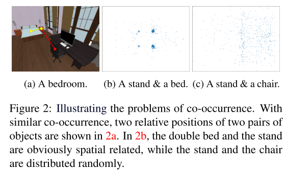
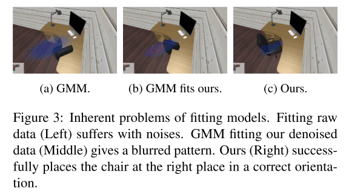
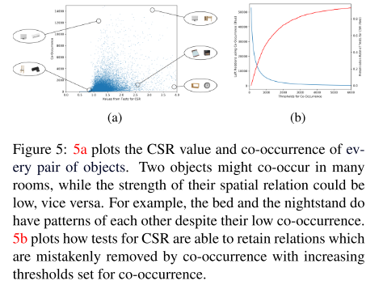
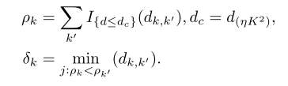
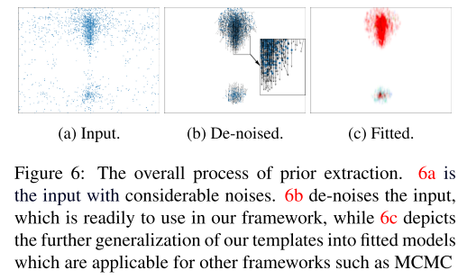
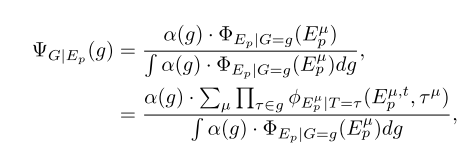
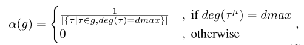
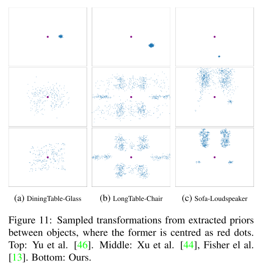
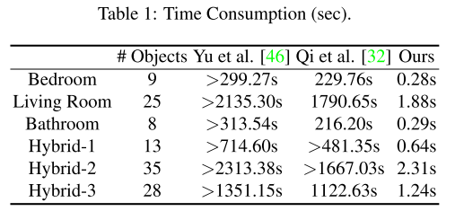
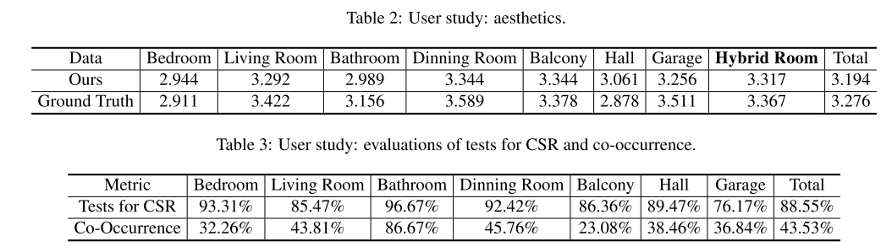

# Fast 3D Indoor Scene Synthesis with Discrete and Exact Layout Pattern Extraction

我们提出了一个室内场景合成的快速框架，给定一个房间几何形状和与学习的先验的对象列表。现有的数据驱动解决方案通常通过共现分析和统计模型拟合来提取先验，与此不同的是，我们的方法通过测试完全空间随机性(CSR)来度量空间关系的强度，并基于能够准确表示离散布局模式的样本提取复杂先验。在提取先验的基础上，将输入对象划分为不相交的组，从而达到加速和合理的目的

## 1. Introduction

随着各种室内三维场景数据集的出现，技术转向数据驱动的方法。然而，室内三维场景合成在各个方面仍然存在固有的困难。

首先，不可避免地要处理连续或离散参数化的家具布局，这些布局分布在复杂的高维空间中[24]。一些工作（例如[15，32，13，30]）试图将布局简化为独立的小团体或子集，例如[13，32]。然而，==他们的基本度量依赖于 "共现"，这仅仅是计算共存的频率，而不是结合空间知识==。以图2中的一个例子为例，共现频率高并不一定意味着空间关系强。换句话说，单纯基于共现的场景合成可能会产生奇怪的结果。

其次，由于排列策略数不胜数，很难详尽地列出物体之间所有可能的空间关系[5,6,31,45,22]，也难以在数学上为它们建立统一而精确的模型。为了对多种模式的关系进行建模，一种常见的方法是用模型拟合观察到的布局。然而，"拟合模型 "可能会潜在地引入噪声，并受到噪声的影响，特别是当基础模式不满足与模型的假设时，例如，常用的高斯混合模型（GMM）。图3显示了一个失败的案例。我们认为，当观察到的数据有足够的大小时，正确的情况下，在观察到的数据或样本内进行拟合已经提供了精确的布局策略与变种。

为了解决上述困难，==本文提出了一种利用完全空间随机性(CSR)测试来衡量物体之间空间关系强度的方法。==对CSR的测试（第4节）描述了一组事件产生w.r.t同质泊松过程`homogeneous Poisson process`的可能性。直观地说，它衡量了一组点中存在的某些模式的可能程度。因此，具有高测量值的对象往往会被分组并安排在一起。未能通过CSR测试的对象会被忽略，即使它们有很高的共存度。

此外，我们提出了一种利用==密度峰聚类==` density peak clustering`来提取不同形状布局策略的离散表示的方法（ we present an approach for extracting discrete representation of various shapes of layout strategies, incorporating density peak clustering ）。最后，我们==提出了一个框架，用于自动合成给定对象的各种排列方式==——输入房间的几何形状，根据提取的前验值将输入对象划分为不相干的组，然后基于`Hausdorff metric`进行优化，以应对离散的前验值` discrete priors`。整个过程可以在几秒钟内完成。

## 2. Related Works

##### 3D Indoor Scene Synthesis

布局策略的表示在三维室内场景合成中扮演着重要的角色。例如：利用诸如左、右、前等语义建立对象之间的空间关系模型。采用高斯混合模型(GMMs)来拟合物体的观测分布；图结构；为对象建模上下文，如对象之间的平均角度和距离，朝向（比如：最近的墙），等等。然而，尽管有各种各样的代表，基本的度量仍然局限于共现、模型拟合甚至是直观的语义，例如，边的概率是通过共存的频率计算的。==我们的目标是从现有的场景合成布局示例中学习成对物体排列的一般模式==

##### Tests for Complete Spatial Randomness (CSR)

这是个经典的课题。给定一系列分布在平面上的点，CSR测试通常用来回答这些点被随机放置的可能性有多大。从形式上讲，它描述了一组事件产生w.r.t同质泊松过程（平面泊松过程）的可能性有多大。此前，CSR的应用大多局限于生态学[，例如，研究一组观察到的植物是否按照某个模式放置。Rosin可能是第一个将CSR的概念带入计算机视觉中——如何检测图像内部的白色噪声。CSR的典型测试方法包括使用Diggle函数、基于距离的方法等。在本文中，我们按照[2]的方法，通过角度来测试CSR（第4节）。

## 3. Overview

流水线分为离线阶段和在线阶段。在==离线阶段==，我们首先学习空间强度图Gss——用来表示对象之间的空间关系。这比计数共现更强大。我们还提取布局策略的通用模式作为离散的 "模板"，并减少数据集内的噪声。给定学习到的前值、一个空房间和一组用户指定的对象，在在线阶段，首先将空间相干的对象分组（例如，一张床和两个床头柜）。接下来，启发式地使用学习到的模板对每个组进行即时布置。最后，通过优化一致的损失函数来调整整体布局。

在形式上，离线输入是一个多图`multigraph`G~in~(V~in~, E~in~)，它是原始数据集的直接数学表示，也就是说，每个顶点对应一个物体，每条边对应两个对象之间的位移。一个顶点$v_{in}^i\in V_{in}$包含了一组属性$\{(d_{wall}^{i,w},\theta_{wall}^{i,w},t_{wall}^{i,w})|w=1,2,3....\}$——离它最近的墙为参照物的位置、方向、translations。给定一个物体o~i~，从$v_{in}^i$到$v_{in}^j$的第k条边$e_{in}^{i,j,k}$，由$(p_x,p_y,p_z,p_{\theta})$来定义，表示两个物体之间的位置和方向变化。

我们从SUNCG数据集中的52万多个房间中构建了2266个顶点、200多万条边的G~in~，并在第4节中测量它们的空间关系强度，在第4节中提取布局先导。

## 4. Spatial Strength Graph

在实际从数据集中提取每对对象的模板之前，一个问题自然而然地出现了：我们是否需要为所有的对象对提供模板？如图 2 所示，两个对象可能有非常混乱的布局策略，它们之间的转换相当独立，即使它们可能有很高的共现性。这促使我们学习一个空间强度图（SSG），以便在安排房间时忽略众多空间强度关系较低的对象对。这将帮助我们合成更多可信的场景，同时也加快了合成过程。

从形式上看，SSG是一个加权图，定义为G~ss~=(V~ss~，E~ss~)，其中G~ss~表示整个图，V~ss~=V~in~代表数据集中的所有对象，E~ss~是带有权重的边，用来编码对象之间的空间强度。在完全空间随机性（CSR）的检验领域内，我们通过公式1即 "d值"[2]来衡量E~ss~的权重：
$$
d=\sqrt{m}sup|F_c(\theta)-F_e(\theta)|
$$
F~c~和F~e~分别是累积分布函数（CDF）和经验分布函数（EDF）——角θ，受均匀分布的影响。m是形成F~e~的点数（ m is the number of points formulating the Fe）。对于每一对对象o~i~和o，以着10%的概率对$E^{i,j}_{in}$进行随机采样，将权重$E^{i,j}_{ss}$。如图四（a)，衣柜和茶几是独立的，所以它们的d值很低。虽然图4b中存在相当大的噪声，但餐桌和椅子的d值仍然很高。最后，图4c显示了床和床头柜之间的清晰模式。

图5表明了CSR和共现之间的差异。在图5a中，我们绘制了所有对象对的测试结果（纵坐标是共生value，横坐标是CSR的value），其中：空调的物体在共生的情况下分数很高，但空调更多来说是独立放置的；床和床头柜确实有彼此的模式，尽管他们的低共现。图5b说明了CSR怎么保留被共生技术错误删除的关系

## 5. Prior Extraction

`Patterns`是指示我们在现实生活中如何安排对象的先验`priors`。Since relative translations are incorporated，模式本身就可以避免一些不合理的情况，比如碰撞`collisions`。但是很明显，我们不能对所有的`Patterns`都建立一个统一的模型，因为Patterns可以有任意的形状

为了提取离散表示中任意形状的模式，我们采用[34]中的方法，根据ρ（式2）和δ（式3）对点进行聚类（clusters points ），其中指示函数I{d≤dc}在d≤dc时返回1，否则返回0。where the indicating function I {d≤d~c~}  returns 1 if d ≤ d~c~ and 0 otherwise

给定G~in~中从$v_{in}^i$到$v^j_{in}$的一组边$E_{in}^{i,j}$，如图6a所示，我们首先利用平移计算它们之间成对的欧几里得距离。对于每条边$e^{i,j,k}_{in}$， $\rho_k$==用来计算距离小于d~c~的其他边的数量==。取K个点，d~c~是$\eta K^2$，所有成对距离中最大的值，以及$\eta$取建议值0.015。$\delta_k$表示$e^{i,j,k^/}$==集合中的最小距离== with $\rho_k^/$ than $\rho_k$。因此，尽管形状是任意的，高ρ~k~和高δ~k~的每个边都索引到一个潜在模式，这类似于[34]中的簇中心`cluster center`。相比之下，噪声往往具有较高的δ值，而其局部密度明显偏低。因此，我们减少噪音，并突出模式$E^{i,j}_p$，如图6b所示。

其余的精确模式形成的一个离散模板$E_{i,j}^k$已经完全可用于我们的框架。为了将我们的模型纳入到之前的工作中，例如MCMC，我们的先验可以很容易地拟合到分布中，例如使用基于高斯核的非参数核密度估计，如图6c和8所示。我们也对单个对象执行类似的先验提取任务，考虑到它们的方向和到最近墙壁的距离，其中$d_{k.k^/}$成为标量的差异。在这样做的时候，我们保留了t~w~，$\theta_w$，和高值的$\rho$，和高值的$\delta$，来索引模式。然后我们将墙的平移和旋转先验，表示为多项分布，并在G~in~中分配到相应的顶点。

接下来，进一步一般化模板，使其可重用和可扩展。我们观察到：具有相同语义和相似几何图形的对象共享布局方式。如图7所示，给定一个没有相应先验的新对象，我们通过比较模型的3D形状来寻找它的相似模型，该方法使用$s^k_{shed}$来衡量相似度。我们选择了前K个结果$\{(o_k,s^k_{shed})|s^K_{shed}=\beta,k=1,2,3,...,k\}$，将K个模板的组合作为新对象的模版。根据实验，将$\beta$置为0.1。

图8显示了一些学习先验的结果。我们应用色相、饱和度和值（HSV）系统来表示方向，其中角度在（0，2π）内归一化为色相，概率密度表示为饱和度，值均设为1。由于大多数物体的高度差异没有显著变化，我们绘制了三个通道（$p_x^{i,j,k},p_z^{i,j,k},p_{\theta}^{i,j,k}$）使其更直观.

## 6. Scene Synthesis

在本节中，我们结合学习的SSG和先验来合成房间布局。一个综合过程通常包括两个步骤：一个启发式的安排，然后是一个优化（a heuristic arrangement, followed by an optimization）。给定一组输入对象O，我们首先将它们按照SSG分解成若干组，然后在每组中安排物体——相对的变换立即被模板索引。最后，我们应用全局优化来满足O中对象的布局策略。

##### 6.1 Heuristic Layouts with Formulated Groups（启发式布局与公式化组）

我们首先构造一个由邻接矩阵描述的无权图，每个顶点对应一个场景物体。邻接矩阵由G~ss~产生。然后迭代地构造不相交群（如下图）。可以看到有些组只包含一个对象，如衣柜、柜子或架子，因为它们的放置通常不需要考虑其他对象，这样的单对象组极大地简化了后续优化过程。

基于给定的房间形状、分组和学习模板，我们然后生成待处理场景的建议——物体根据它们的组和墙壁的位置被摆放和旋转。对于每个组g，其布局是通过对后置概率分布（下面的公式）进行取样，启发式生成的：

a(g)表示每个对象是组中主导对象的概率。让deg(τ)表示τ的度数`degree`，即根据CSR的检验(第4节)，与之相联系的对象数，dmax为物体集中最大的物体关联数。$\Phi$是多项式分布

在实际操作中，如果一个对象对d值比较低，我们会进一步分解组，并给它分配一个新的主导对象。在某些情况下，这种启发式策略即使在没有进一步操作的情况下，也能采样出足够可信的布局。然而，启发式策略仍然可能导致不合理的情况，如组之间的碰撞、物体超出房间边界等。接下来我们将展示我们如何调整对象，使对象的合理布局最终呈现。

##### 6.5  Template Matching

## 7.  Experiments

##### 7.1 Tests for CSR

图10显示了使用共生和使用CSR测试，来测量对象之间关系强度的比较。由于尺度不同，结果被归一化。上方三角形部分描述了共同发生，下方填充了CSR的测试结果。架子与计算机在空间上的关系很弱，但共发生表明关系很强。很明显，灰色书桌的摆放与棕色书架的摆放是独立的，但它们在不同类型的房间中共存的频率很高，可能会影响整体的性能。对它们应用CSR测试，这对在空间上解耦。对于与大多数东西进行独立布局的物品，比如白色的烘干机、衣柜和棕色的架子，情况也是如此。

##### 7.2 Prior Sampling Figure

图11比较了我们的工作与其他工作的前验`priors`。由于priors建模的布局在对象之间有很高的可信概率，我们应该通过采样得到可能的变换。根据实验，如果数据集中存在噪声，[46]和GMM都会失败，所以所有priors的输入都是我们去噪声的数据（第5节）。图11显示了==给定去噪声数据==的前值的采样变换。==红点表示中心对象==。最上面一行是[46]使用的前值，他们对相对距离和方向进行了平均。我们用一个高斯核κ ∼ N(0, 0.1)来干扰它们的平均距离和方向。中间一行是 [44, 13] 使用的 GMM. 虽然我们进一步手动为每个图案设置了合适的阈值，以减少潜在的噪声以及集合[1]来协助探索峰的数量，但结果仍然局限于椭圆形状，如图11a，或引入的离群值，如11b。底行显示了我们的结果。我们的能够检测各种布局模式，而不引入离群值。例如，图11c显示了沙发和扬声器之间的两种模式（四种对称模式）

##### 7.3 Efficiency

##### 7.4 User Study

如图12所示：使用CSR制定功能组使我们能够生成混合房间。对三维室内场景的评价是主观的，因此我们进行了两次用户研究来评价我们的方法。首先要对生成布局在视觉上进行评分，成绩从1级：差到5级：好。如表2所示，我们生成的结果与原始布局相当。另一个用户研究是用来衡量CSR测试和学习模板如何满足人类的直觉。

另一个用户研究是用来衡量CSR测试和学习模板如何满足人类的直觉。我们分别通过CSR和共现检验对成对关系进行排序。对于每个已排序的对列表，我们从最高值开始，依次取120。然后，被试判断所呈现的模板是否符合现实生活中的布局策略。表3中，共现的结果包含相当多的空间独立的对。共生成63个场景和500个模板。我们邀请了97个社团的受试者，他们只是被告知要对布局和和判断模式进行分级。

