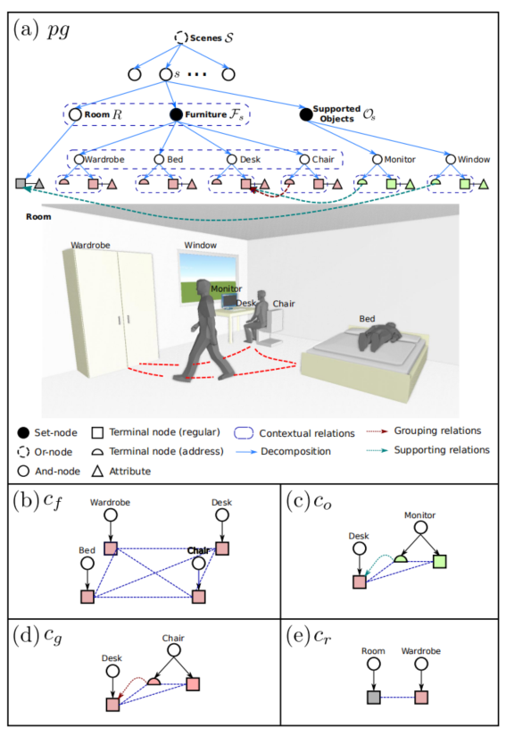
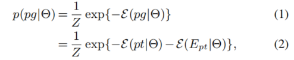
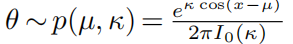

# Human-centric Indoor Scene Synthesis Using Stochastic Grammar

### Abstract

本文提出了一种以人为中心的方法来生成三维场景。使用属性化的空间`And-Or Graph`来表示室内场景。==S-AOG==是一种概率文法模型`probabilistic grammar model`，其中终端节点是对象实体，包括房间、家具和受支持的对象。我们通过数据库学习分布` distributions`，然后使用马尔可夫链来生成新的场景（采样新的布局）。实验表明，基于以下三个标准，该方法可以稳健地对各种真实的房间布局进行采样：

+ 视觉逼真的方法与最先进的房间布置方法的比较
+  accuracy of the affordance maps with respect to ground-truth
+ 受试者评估下，房间的功能性和自然性。

## 1. Introduction

传统的2D/3D图像数据采集和`ground-truth`标注方法存在明显的局限性：

+ 获取高质量的`ground truths`是困难的
+ 有些信息无法正确的标注出来，比如：2D图像中3D物体的大小
+ 手工标注，工作庞大且乏味，还容易出错

因此，为了给模型提供高质量的数据，我们需要一个这样的方法。在本文中，我们提出了一种算法，以自动生成一个大规模的3D室内场景数据集，我们可以从这个数据集中，渲染出包含表面法线、深度和分割信息的、像素级的真实2D图像。本算法适用于，但不仅限于以下任务:

+ 各种计算机视觉任务的学习和推理
+ 为3D建模和游戏生成3D内容
+ 三维重建和机器人映射问题`robot mappings problems`
+ 机器人技术中低级和高级任务规划问题的基准测试

智能生成场景的四个挑战：

+ 在一组功能部件中，如一套餐具，其数量可能有所不同。（数量不确定）
+ 即使我们只考虑成对关系，对象-对象关系也已经是二次方。（关系多）
+ 更糟糕的是，大多数对象-对象关系都没有明显的意义。例如，即使钢笔和显示器都放在桌子上，也没有必要对它们之间的关系进行建模。（关系无意义）
+ 由于之前的困难，产生了过多的约束。许多约束包含循环，使得最终的布局很难抽样和优化。（抽样困难，难以优化）

为了解决这些挑战，我们提出了一种以人为中心的室内场景生成方法。它整合了人的活动` human activities`和功能性的*分组/支持*关系`functional grouping/supporting relations`。==这种方法不仅捕捉了人的语境，而且简化了场景结构==。具体地说，我们使用图像和场景的概率语法模型——S-AOG，包括垂直的层次结构和水平的上下文关系` contextual relations`。

上下文关系`contextual relations`对 分组和支持 进行编码，由`object affordances`建模。对于每一个对象，我们都会学习其`object affordances`的分布，即对象与人的关系，这样就可以根据该对象对人进行采样。除了静态的`object affordances`，我们还考虑了场景中人的动态活动，通过规划从一件家具到另一件家具的轨迹来约束布局（constraining the layout by planning trajectories from one piece of furniture to another.）

本文有三大贡献：

+ 将对象建模，负担能力和活动规划`activity planning`组合起来，来生成室内场景。
+ 提供了一个通用的学习和采样框架，用于室内场景建模。
+ 通过大量的对比实验证明了这种结构化联合采样的有效性。

###  1.1 Related Works

**3D content generation** is one of the largest communities in the game industry and we refer readers to a ==recent survey [13] and book== 。大部分三维场景重建算法通过使用给定的一组对象约束，来生成新的房间布局。具体的各种相关技术，见论文。

**Synthetic data**：合成数据已经吸引了越来越多的兴趣，来增强训练数据，甚至直接作为训练数据。

**Stochastic grammar model**：随机语法模型已经被用于==解析==室内和室外场景的图像，和涉及人类的图像的==层次结构==。在本文中，我们没有使用随机语法来进行解析，而是转发`forward`语法模型中的样本来生成大量不同的室内场景。

## 2. Representation of Indoor Scenes

我们使用参数化的S-AOG来表示场景。属性化的S-AOG是在终端节点上具有属性的概率语法模型，它包含：

+ ==一个概率性的上下文无关文法（PCFG）==
+ 马尔可夫随机场==(MRF)==上定义的上下文关系`contextual relations`，例如：节点之间的水平连接。

PCFG通过一组终端节点和非终端节点来表示：从场景(顶层)到对象(底层)的层次分解；而上下文关系通过水平链接对空间关系和功能关系进行编码。S-AOG结构如图所示：

形式上，S-AOG被定义为一个5元组：$G=<S,V,R,P,E> $。我们使用符号S$\rightarrow$场景语法的根节点，V$\rightarrow$顶点集，R$\rightarrow$产生的规则`the production rules`，P$\rightarrow$定义在S-AOG上的概率模型，和E$\rightarrow$上下文关系，用来表示同一层节点的水平连接。

==顶点集V==可以分解为非终端节点和终端节点的有限集：$V = V_{NT}∪V_T$：

+ $V_{NT}=V^{And}\bigcup V^{Or}\bigcup V^{set}$。非终端节点由三部分组成。1，And-Nodes，其中，每个节点表示将一个较大的实体（如卧室）分解为较小的组件（如墙壁、家具和支撑对象）。2，Or-Nodes，其中每个节点分枝可选择性的分解（例如，一个室内场景可以是卧室或客厅），使算法能够重新配置一个场景。3，Set Nodes，一组Or节点作为子分支，由一个And节点分组，每个子分支可以包括不同数量的对象。
+ $V_T=V_T^a\bigcup V_T^r$。终端节点由两个子节点组成：常规节点和地址节点。1，常规节点表示场景中的带有属性的空间实体（例如：一把椅子），在本文中，属性包括：a.内部属性A~int~，物体大小(w,l,h)；b.外部属性A~ext~，物体位置(x,y,z)和朝向(x-y平面)$\theta$，以及采样到的人的位置A~h~。2，为了避免图过于稠密，增加了地址节点，编码那些只在特定上下文`context`出现的交互作用`interactions`。它是一个指向常规终端节点的指针，取集合$V_T^r∪\{nil\}$中的值，表示支持或分组关系，如图2所示。

==Contextual Relations== E：节点之间的上下文关系由S-AOG中的水平链接表示，形成终端节点上的MRF。为了对上下文关系进行编码，我们为不同的派系`clique`定义了不同类型的潜在函数。$E=E_f\bigcup E_o\bigcup E_g\bigcup E_r$，上下文关系分为四个子集：1，家具间的关系E~f~。2，支持物体与被支持物体间的关系E~o~。3，功能对之间的关系E~g~（例如：一个桌子和一把椅子）4，房间和家具间的关系E~R~ 。据此，终端层中形成的派系`clique`也可分为四个子集：$C=C_f\bigcup C_o\bigcup C_g\bigcup C_r$。Instead of directly capturing the object-object relations, we compute the potentials using affordances as a bridge to characterize the object-human-object relations（我们不直接捕捉物体间关系，而是以负担能力`affordancer`为桥梁来计算势能`potentials`，以表征物-人-物的关系。）

==层次解析树pt（hierarchical parse tree）通过为Or节点选择一个子节点以及为Set节点确定每个子节点的状态来实现SAOG的实例化==。一个解析图`pg`由一个解析树`pt`和解析树上的一些上下文关系E组成：pg=（pt，E~pt~）。图3展示了一个简单的解析图和终端层形成的四种类型的小团体的例子。

## 3. Probabilistic Formulation of S-AOG

场景配置由一个解析图`pg`表示，包括场景中的对象和相关属性。$\theta$参数化的S-AOG产生的pg的先验概率被表述为吉布斯分布`Gibbs distribution`。

其中，$\varepsilon(pg|\Theta)$是解析图的能量函，$\varepsilon(pt|\Theta)$是解析树的能量函数 ，$\varepsilon(E_{pt}|\Theta)$是上下文关系的能量函数。

$\varepsilon(pt|\Theta)$可进一步分解为不同类型的非终端节点的能量函数，以及规则终端节点和地址终端节点的内部属性的能量函数:arrow_down:。其中，Or节点的子节点和Set节点的子分支，这两者的选择遵循不同的多项分布。由于And节点展开明确，所以没有能量项。终端节点的内部属性遵循<u>核密度估计</u>`kernel density estimation`学习到的无参化概率分布`non-parametric probability distribution`

$\varepsilon(E_{pt}|\Theta)$结合了终端层形成的四种派系`cliques`的势能`potentials`，来整合常规终端节点的人属性`human attributes `和外部属性:

### Human Centric Potential Functions

- Potential function $\phi_f(c)$定义了家具间的关系，$c={f_i}\in C_f$包含了所有家具节点

​		其中，$\lambda_f$是权重向量，<.,.>表示一个向量，成本函数$l_{col}(f_i,f_j)$代表两个家具的重叠面积，用来作为碰撞的惩罚。成本函数				$l_{ent}(c)=-H(\Gamma)=\sum_{i}p(\gamma_i)\log p(\gamma_i)$，通过采样人体轨迹，可以更好地利用房间空间，$\Gamma$是房间中计划好的轨迹集合，	 				$H(\Gamma)$是熵` entropy`。通过使用<u>双向快速探索随机树</u>` bi-directional rapidly-exploring random tree`，来规				划任意一个家具的中心到另一个家具的轨迹$\gamma_i$，我们可以获得<u>轨迹概率图</u>`trajectory probability map`——构成了				热度图`heatmap`。

- Potential function $\phi_o(c)$定义了支持物体与被支持物体间的关系，每一个集合元素$c=\{f,a,0\}\in C_o$包含了：受支持的物体终端节点o，地址节点a ，以及它指向的家具终端节点f：

    

    其中，成本函数$l_{hum}$定义了`human usability cost`——一个好的人类位置应该允许一个代理去访问或使用家具和它支持的物体。$l_{hum}(f,o)=\max_ip(h_i^o|f)$，其中h~i~^o^是根据被支持对象的位置、方向和`affordance map`进行的第一次采样。

    成本函数$l_{add}(a)$是指地址节点v ，视作某一个遵循多项式分布的常规终端节点的负对数概率。

- Potential function $\phi_g(c)$定义了家具之间的功能分组关系，任意一个元素$c=\{f_i,a,f_j\}\in C_g$，包括了：核心功能家具的终端节点f~i~，指向关联家具的地址节点a，以及关联节点。其计算方式类似上一个。

### Other Potential Functions

- Potential function $\phi_r(c)$定义房间和家具间的关系，任意一个元素$c=\{f,r\}\in C_r$，包含了一个家具节点和一个房间节点

​		其中，$l_{dis}(f,r)=-log(p(d|\Theta))$是距离成本函数。d的分布属于$\ln N(\mu,\sigma^2)$，是家具离最近的墙的距离modeled by a log normal distribution。$l_{ori}(f,r)=-\log p(\theta|\Theta)$是朝向成本函数，其中$\theta$是模型和最近的墙之间的朝向，==modeled by a von Mises distribution.==

## 4. Learning S-AOG

我们使用SUNCG数据集作为训练数据。它包含了超过45K不同的场景和手工创建的逼真的房间和家具布局。我们收集房间类型、房间大小、家具出现情况、家具大小、家具和墙壁之间的朝向和相对距离、家具的可视性、分组出现情况和支持关系的统计数据。概率模型P的参数$\Theta$可以通过最大似然估计（MLE），以着监督的方式学习。