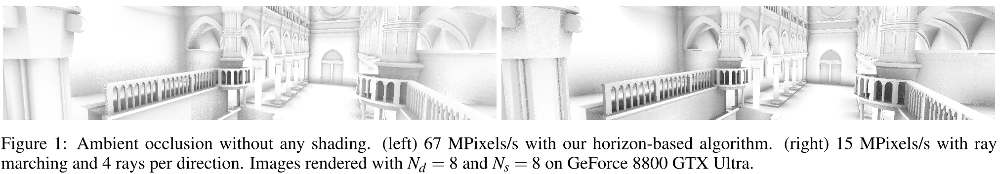

# Image-Space Horizon-Based Ambient Occlusion

***Bavoil, Louis    Sainz, Miguel***

## 1. 介绍

作者在一个给定的表面点`P`上，使用以下形式的`ambient occlusion illumination` $A$：

 其中，$V$ 是法线半球 $\Omega$ 上的**可见度函数**，如果从`P`出发的射线与遮挡者相交，则返回`1`，否则返回`0`；$W$ 是一个**线性衰减函数**。

## 2. Horizon-Based Ambient Occlusion

作者使用一个**球面坐标系**，**天顶轴**对准**视线方向**，方位角 $\theta$ 和仰角 $\alpha$（见图`2a`）。与地平线映射类似，我们通过一条由**带符号的地平角** $h(\theta)$ 定义的地平线，来分割**单位球体**（见图`2b`）。假设**P的邻域**是一个连续的高度场，在地平线以下射线通常会与遮挡者相交，所以**这些射线的相交测试可以省略**。在连续高度场的假设下，方程`1`可以改写为：

使用**线性衰减函数 **$W(\theta)=max(0,1-r(\theta)/R)$，其中 $r(\theta)$ 是 $P$ 和 $\overline{w}$方向上地平线点之间的距离，$R$ 是影响半径。在这种情况下：

## 3. Image-Space Integration

算法将每个像素的**线性深度**和**视图空间法线**作为输入。对于每个像素，计算它的视图空间位置`P`，并通过对图像空间方向进行采样（深度图像中的高度场），用**蒙特卡洛方法**计算方程`3`。我们在当前像素周围的图像空间中挑选$N_d$个方向 $\theta$。对于每个角度 $theta$，通过沿图像空间的线段，对**深度图像**进行采样来计算地平线角度 $h(\theta)$。视图空间的影响半径`R`被投射到图像平面上，并被细分为 $N_s$ 个**等长的步骤**。

为了找到 $\theta$ 方向的**地平线角度**，首先计算**切角** $t(\theta)$，并将**视线**与**由P和表面法线定义的切平面**相交。然后，我们在**深度图像**中沿 $\theta$ 方向步入，计算 $D=S_i-P$，其中 $S_i$ 是给定样本的**重建视图空间位置**。基于仰角 $\alpha(S_i)=atan(-D.z/||D.xy||)$，地平线角 $h(\theta)$ 为 $max(t(\theta),\alpha(S_i),i=1..N_s)$。由于$D.z$必须是与偏移量$D.xy$相关的确切深度，我们确保总是在**texel中心**取样。为此，将每个方向上的**样本的纹理坐标**与最近的**texel中心**相扣（见图`2c`）。

