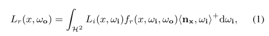
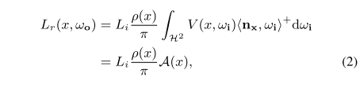
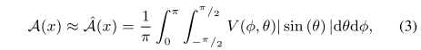
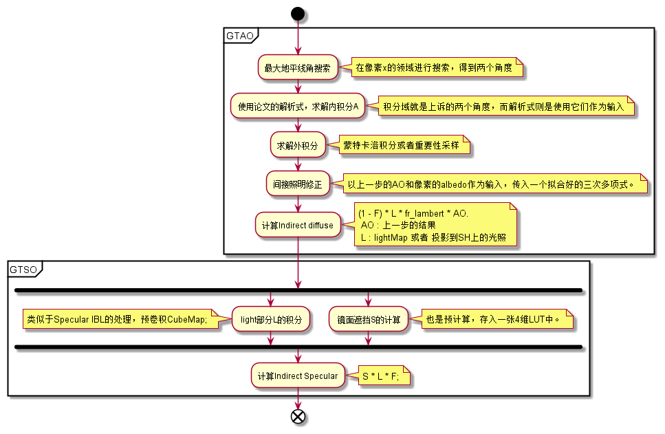

# Practical Real-Time Strategies for Accurate Indirect Occlusion

***Jorge Jimenez， Xian-Chun Wu***

***Siggraph 2016***

## 1. 介绍

在对`GI`的近似中，==环境光遮蔽==（`AO`）是最受欢迎的一种，因为它改善了**对物体形状（对比度）的感知**，并且捕捉到了`GI`中一些最重要的效果，特别是**由近距离遮挡物引起的柔和阴影**。环境遮挡在与其他全局照明算法结合时也很有用。不幸的是，求解**环境遮挡积分**仍然很昂贵，所以许多人开发了近似的方法，来获得**足够快的性能**。

本文介绍了一种新的`SSAO`技术，称之为 ==ground-truth ambient occlusion==（`GTAO`）。这项技术的主要目标是正如其名，且速度足够快。本文技术以`horizon-based approach`为基础，但使用了**另一种表述**。这种表述方式使我们能够大大**降低成本**，并且在假设场景被表示为**高度场（深度缓冲区）**的情况下，仍然可以精确地解决**环境遮挡的积分问题**。通过使用**时间重投影和空间滤波**有效地实现了此技术，在每帧仅`0.5`毫秒的时间内计算出**无噪音的环境遮挡解决方案**。

在这个表述的基础上，作者扩展了其**环境遮挡方案**。一方面，引入了一种近似的技术，计算出一个**非常快速的修正系数**，来考虑==近场的全局照明==——基于这样的观察：`local surface albedo`、**环境遮蔽项**与**多`bounces`的近场照明**之间存在一种关系。根据这一观察，作者开发了一种有效的、简单的技术，来说明在单独计算环境遮挡时**损失的局部照度**。

最后，作者提出了一种新的技术，对任意的镜面材料来说是通用的，称之为==ground-truth specular occlusion==（`GTSO`）。

## 2. 背景和相关工作

***Horizon-Based Ambient Occlusion***

Bavoil等人[BSD08]提出根据**光可以到达的最大地平线角度**，来计算**非遮挡区**。他们将**积分域**转化为一组以$\phi$为参数的方向（$\phi$：和`surface`相切），并在每个方向上计算**总的非遮挡实体角**，将公式`2`转化为：

其中，$1/\pi$项用于**归一化**。

## 3. 前瞻

在这项工作中，有**两个主要目标**：

- 一方面，目标是拥有一个**与真实结果相匹配的环境遮蔽技术**，同时要能用于要求严格的实时应用。
- 另一方面，希望**扩大可以有效近似的全局光照效应的数量**。

第一个目标在**输入数据**、**`pass`数量**和**指令数量**方面有严重的限制。受这些限制的约束，本技术将在**屏幕空间**工作，只把**深度缓冲区**和**表面法线**作为输入。为了实现第二个目标，作者放宽了对**传统环境遮蔽**所做的一些假设：虽然**保留了==白色（或单色）穹顶照明==的假设**，但`relax`了**pure Lambertian表面**的假设，还包括了近场遮挡物的漫反射。因此，方程`2`变成了：

其中，$F$是菲涅尔反射率项，$A(x)$是我们的==环境遮蔽项==——称之为`GTAO`，$G(x)$是**基于环境遮蔽项的函数**（引入**漫反射近场间接照明**），$S(x)$是**镜面遮蔽项**，与**BRDF预卷积**$L$相乘。

## 4. GTAO: Ground-Truth Ambient Occlusion

本文对**环境遮挡**的表述沿用了Bavoil的==基于地平线的方法==，但做出了很多改变。首先，重新制定了**计算地平线的参考框架**，因此也重新制定了**积分域**：

- 遵循Timonen的做法，计算相对于**视图矢量$w_o$**的地平线角度（见图`2`）。这意味着地平线是在`x`周围的整个球体中搜索的，并且**球面积分轴**被设置为$w_o$。在实践中，这能够简化表述，并减少所需的`transcendental functions`（超限函数？）的数量。

  

第二个主要区别是，与Bavoil的工作相比，本文的可见度项$V(\phi,\theta)$只是一个**二值函数**。以这种方式表述`AO`，可以简单地将**方程`3`的内部积分**计算为：方向$\phi$的两个**最大地平线角**$\theta_1(\phi)$和$\theta_2(\phi)$之间的**弧线的积分**（其他区域会遮挡，$V(\phi,\theta)=0$，所以不考虑咯）。方程`3`转化为：

其中，$\gamma$是**法线**$n_x$和**视图矢量**$w_o$之间的角度，$cos^+=max(cos,0)$。==这个公式非常重要==，因为它允许直接计算**内积分** $\hat{a}$。这意味着只有**最外层的积分**需要通过**蒙特卡洛积分**来进行数值计算。 在下文中，将详细介绍如何计算==地平线角==和**内积分** $\hat{a}$。

***Computing maximum horizon angles***

解方程`5`的核心是：找到图像平面$\hat{t}(\phi)$某一个方向的**最大地平线角** $\theta_1(\phi)$ 和 $\theta_2(\phi)$。为此，作者在像素$\hat{x}$的$n\times n$邻域中，在屏幕空间方向 $\hat{t}(\phi)$ 和 $-\hat{t}(\phi)$ 上搜索，然后根据以下公式，得到相对于**视图矢量 $w_o$ **的最大地平线角度：

> 论文中有些符号，有戴帽和不戴帽两个版本：
>
> - 戴帽：屏幕空间
> - 不戴帽：世界空间

其中，$w_s=\frac{s-x}{||s-x||}$，s是像素在**图像平面上像素**（$\hat{s}=\hat{x}+\hat{t}(\phi)\cdot s$）的世界空间投影 。角度$\theta_2$的计算方法则是$\hat{s}=\hat{x}-\hat{t}(\phi)\cdot s$。邻域`n`的大小是根据**与摄像机的距离**缩放的。

> 原文公式写的啥东西？打错了？我觉得应该是：
>
> $$s=PositionMapFetch(\hat{x}+\hat{t}(\phi)\cdot n_s)\quad,\quad n_s\in[0,n/2)$$

***Solving the inner integral***

Timonen通过在运行时访问**查找表**，来解这个积分。然而，本文技术的一个关键特点是：给定地平线角度 $\theta_1$ 和 $\theta_2$，可以直接求解方程`5`中的内积分$\hat{a}$，即：

 需要注意的是，这种求积分的方法要求：法线 $n_x$ 位于由 $\hat{t}(\phi)$ 和 $w_o$ 定义的平面 $P$ 内，这在一般情况下并不成立。按照Timonen的说法，将**角度** $\gamma$ 计算为：**归一化投影法线** $\frac{\overline{n_x}}{||\overline{n_x}||} \in P$ 和 $w_o$ 之间的角度，即 $\gamma=\arccos{(<\frac{\overline{n_x}}{||\overline{n_x}||},w_o>)}$。然后，我们通过乘以$|| \overline{n_x}||$，来修正点积上的变化，这使得方程`5`成为：

> 假定，当前方向$\phi$对应的图形平面直线是 $M_t$，那么有点乘结果：$\overline{n_x}=cross(M_t,n_x)$。
>
> 注意：上诉方程默认考虑了：点乘结果和法线的余弦大于0

> 作者发现，这个解析方案非常快，特别是使用**快速的acos和sqrt指令**。在三阶函数方面，经过优化，得到的代码只有**2个cos**和**1个sin**，外加**三个额外的acos函数**用于设置整数域。这使着色器内存有了约束，所以**所需的ALU操作**在性能上几乎没有区别。

### 4.1 Implementation Details

本文技术是**受内存约束的**，所以**对内存的访问数量**决定了**目标平台的最终性能**。鉴于性能目标是将该技术整合到以每秒60帧的速度运行的游戏中，我们只有==大约半毫秒的时间==来进行计算，这使得我们必须实施优化。

一方面，在**半分辨率**上计算**环境遮蔽**，然后将其`upScaling`为**全分辨率**。此外，为了在不影响性能的情况下，尽可能多地计算样本，作者在**空间和时间**上都进行了**遮挡积分**：在每个像素上只对地平线的一个方向进行采样，但使用**双边滤波器**在$4\times 4$的邻域上收集信息**进行重建**。此外，作者积极利用**时间上的一致性**，在`6`个不同的旋转之间交替进行，并使用**指数累积缓冲器**对结果进行**再投影**。所有这些使每个像素共有 $4×4×6=96$ 个有效采样方向。

与`ambient obscurance techniques`相反，本算法不考虑任何**衰减函数**，这可能导致**遮挡的断裂**。为了尽量减少伪影，作者采用了一种**保守的衰减策略**：确保近场遮挡的真实性；而对于远场遮挡，则将其衰减为零——因为在一般情况下，远场遮挡与间接照明一起被烘焙。本算法的衰减函数是**一个从`1`到`0`的线性混合**——从一个给定的、足够大的距离，到最大搜索半径。

最后，由于我们不能从**深度缓冲区**中推断出**厚度**，**薄的特征**往往会产生过多的遮挡而不真实。作者引入了一个保守的**启发式方法**：假设来自于**物体的厚度与它们的屏幕空间大小相似**。这个启发方法对==地平线搜索==（公式`6`）进行了修改，因此，对于搜索的每个迭代 $s∈[1,n/2]$，更新地平线 $\theta$ 为：

其中，`blend`是基于**指数移动平均数**的混合算子。

## 5. Approximated Occlusion-Based Indirect Illumination

`AO`的一个主要假设是：到达点`x`的唯一`light`直接来自**均匀的照明环境**。这意味着，**不考虑多次弹射**。这种能量损失会造成**边缘和角落的过暗**：这些区域是`AO`影响最大的地方，但这些地方也是**近场互反射**主要发生的地方。

为了解决这个问题，同时保持高效，作者提出了一个关键的观点：==即在一个**反照率恒定的区域**内，一个点的**近场间接照明**与它的**AO值**表现出**强关系**==。反照率恒顶的假设也是因为：我们不想在每个遮挡物表面对反照率进行采样，来保持**算法的高性能**。

基于这一关键观察，并假设`x`周围所有点`s`的反照率：$\rho(s)=\rho(x)$，要设计一个**`x`处的反照率和环境遮挡**与**`x`处的反射全局照度**之间的映射。为了建立这个函数 $G(A(x),\rho(x))$，作者在一组**不同类型遮挡条件的场景**中计算了七个不同反照率的模拟（$ρ = [0.1, 0.2, 0.3, 0.4, 0.5, 0.7, 0.9]$）（见下图）。作者同时计算了**环境遮挡**和多Bounce间接照明（最多`3`次`bounce`）。通过对所有的点进行组合，对每个反照率使用**三次多项式**，来拟合这个映射，为每个场景的反照率产生**一组多项式系数**。然后作者观察到，这些系数可以很好的近似为**输入反照率的线性函数**（图7）。最后的观察在反照率 $\rho$ 和环境遮蔽度 $A$ 之间建立一个**二维映射**：

这个方法的优点是明显的：

- 一方面，可以无缝地集成到任何**环境遮挡框架**中。
- 另一方面，**非常高效**，因为它基于已经计算过的信息，而且**不需要昂贵的光传输模拟**，同时给出**视觉上可信的结果**。

## 6. : Specular Occlusion

这里介绍==镜面遮挡的解决方案==。作者希望开发一个照明模型，其中**近场遮挡**可以调节**基于探针的照明**，同时支持**任意BRDFs**。此外，对于恒定探针照明的特定情况，能提供`ground truth`。

如第`4`节所述，假设所有的光都来自**一个无限远的照明环境**（`light probe`），将公式`1`表示为：

使用`Cook-Torrance microfacet BRDFs`，并假定 $∀ω_i|V(x, ω_i) = 1$。使用分割近似法：

其中，$C_L=\int_{H^2}{D(x,w_h)<n_x,w_i>^+dw_i}$ 是归一化系数，$D(x, ω_h)$是表面的**正态分布函数**，$w_h$是半角向量。第二个积分是**均匀白色照明环境**下像素处的全微面BRDF，可以存储在一个`LUT`中。而**第一个积分**是实际照明环境$L_i(x, ω_i)$与**一个圆形对称叶**的卷积，该叶近似于`Cook-Torrance BRDF`中的分布函数。当我们将光照环境表示为`irradiance cubemap`时，这个第一个积分这样计算：根据 不同的粗糙度，对这个`cube`进行**预卷积**。

为了计算`specular occluded ligthing`，作者选择了一种类似于**分割积分近似**的方法，并将**可见度项**作为常数从第一个积分中分开。本质上，这个想法是计算一个遮挡项，来调节**达到`x`的光照量**。方程`12`变成了**三个函数的点乘**：

其中，$S$ 就是==高光遮挡项==：

其中，$C_V=\int_{H^2}f_r(x,w_i,w_o)<n_x,w_i>^+dw_i$ 是归一化项。可以看到，作者对**镜面遮挡的定义**是由`BRDF`加权的，因此与方向有关。有趣的是，归一化系数$C_v$与 $F$ 相同，因此它在方程`13`中被抵消：

把它与原来的分割积分近似（公式`12`）进行比较，主要的区别是：==可见度项被移到BRDF积分中，不再假定为常数==。

### 6.1 Computing Specular Occlusion

计算**镜面遮挡** $S(x,w_o)$ 的关键思想是：==为**可见度**和**BRDF lobes**建立一个近似的模型==，然后计算这**两者的交集**作为**镜面遮挡**。考虑到这一点，问题就简化为：

- 如何紧凑地表示**可见度**和`BRDF`
- 如何计算**两者的交集**。

对于==可见度==，我们假设它可以被近似为**一个圆锥体**，由`bent normal`和**环境遮挡项**计算而成。这两个项可以在实时中计算（见第4节），也可以预计算。本文选择实时计算。`bent normal` $b$ 作为**锥体的方向**。为了计算圆锥体的`amplitude` $\alpha_v$，我们依赖于**环境遮挡**：假设**可见度**在`bent normal`周围是**均匀的**，那么$\alpha_v$就是所有方向$\phi$的最大地平线角 $\theta_1(\phi)=\theta_2(\phi)=\alpha_v$。在这些假设下，环境遮挡$\hat{A}(x)$可以计算为：

> `bent normal`：平均未遮挡方向
>
> 

与能见度类似，作者将**镜面lobes**建模为：以反射方向$w_r$为中心的圆锥体。这就提出了几个假设：

- BRDF lobes在$w_r$上==旋转对称==
- 将实际的BRDF近似为一个**单一的常数**。

此时，计算==镜面遮挡==为：

实际是：可见度的锥体实体角和`specular lobe`的锥体实体角之比。这个比率可以解析计算，并给出一个很好的结果。图8（左）是一个例子（详情参考附录B）。

然而，这些计算仍然是昂贵的，所以还是使用了`LUT`：参数是`bent normal`和反射矢量之间的角度，$\beta=\arccos{<b,w_r>}$ ；以及两个锥体的`amplitude`，$\alpha_v$和$\alpha_s$。然后，作者选择了一种更准确的、基于预计算的近似方法，将镜面遮挡$S$ 计算为**可见度锥体**$\Delta_V$和**实际BRDF** $F$的乘积（图8右）：

$\Delta_V(\alpha_v,\beta)$是一个**二元函数**：如果 $\beta\leq \alpha_v$，返回`1`，否则返回`0`。假设一个**各向同性的基于微面的BRDF**，其`GGX NDF`由**粗糙度值**`r`参数化，我们将反射方向$w_r$建模为：相对于法线$n_x$的角度 $\theta_o=\arccos{(<n_x,w_r>)}$。有了这些假设，可以把 $S$ 表示为一个**四维函数**（$\alpha_v$，$\beta$，$\theta_0$，$r$）：

这个函数可以烘焙成一个**四维表**。此外，通过假设 $n_x=b$（`bent normal`），那么$\theta_0=\beta$，这将使表的维度减少到三维，代价是引入一点误差。鉴于该函数相对平滑，作者将其编码为一个四维$32^4$ BC4 8位查找表。

## 7. 总结

