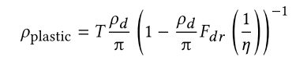
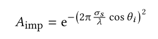
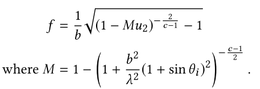

# A Two-Scale Microfacet Reflectance Model Combining Reflection and Diffraction

基于微面模型的方法大多数情况下，可以很好的匹配现实材质，但是有时候通过微面模型预测的结果，却与现实测量值大相径庭。本文对其进行了折射扩展，提出了一种双尺度反射模型，在较大尺度下（大于波长）使用`Cook-Torrance`模型，而在较低尺度下（约等于波长），则负责产生衍射效果。

## 1. INTRODUCTION

最常用的微表面模型是`Cook-Torrance`模型，它假设每一个微表面都是一个完美的反射平面，其尺寸远大于光的波长——so that the surface response is defined by optical geometry。而衍射效应则由光程长度的变化引起。这两个技术都不错，但是有时候预测的结果，却和实际相矛盾。首先，`Cook-Torrance`模型对于高光峰值波瓣能够进行很好的拟合，但有些材质，其波瓣会随着入射光的波长变化（波瓣宽度的变化）。另外一方面，衍射模型可以很好的拟合，但是需要从模型中去除对波长的依赖性，才能得到更好的拟合。因此结合两个模型，可以得到更好的拟合，但这也与物理模型相矛盾，因为单一微观几何结构不可能有两个正态分布

本文主要基于如下假设：1，在所有尺度上，都存在表面集合信息。本文则主要考虑两个尺度：`microgeometry`和`nano-geometry`。物质响应上则是：`Cook-Torrance`和`Cook-Torrance-Diffractio`，后者是`Cook-Torrance`和衍射的卷积。这个模型可以解释一些以前无法解释的现象，比如：在掠射角度下的波长依赖性。

## 2. PREVIOUS WORK

### 2.1 Microfacet Model

标准的分布模型（NDF，微平面核心），包括：Gaussian、rational fraction、Shifted-Gamma和exponential of a power function。H神认为一个好的法线分布应该是形状不变的，以适应线性变换。在微面模型中，Shadow、Masking是能量守恒的关键。H神也提出了一个多尺度模型BRDF，也是不同的尺度，但考虑的都只是反射效应。

### 2.2 Diffraction Models

衍射效应主要由表面高度的变化引起，几种模型表达了高度分布与反射率特性之间的关系：`Rayleigh-Rice vector perturbation theory`是为光滑表面和广角散射设计的；`Harvey-Shack`模型通过表面传递函数`surface transfer function`来拟合衍射；进一步扩展，得到`Krywonos`模型。在本文中，我们使用了改进的`Harvey-Shack`模型，用单个项代替积分来模拟衍射效应。

### 2.3 Comparison with Measured Reflectances

这两种模型的参数不同，对入射面的反射叶的预测也不同。结果表明，被测材料的反射波瓣形状符合衍射理论的预测，简化后的衍射模型与被测材料的反射波瓣形状拟合较好。

N神发现，哪怕模型拟合的再好，在掠射角处计算得到的结果仍与实际值有差别，而且对于高光材质，单个波瓣进行拟合是不够的，而多个波瓣在提高质量的同时，其拟合过程也变得不稳定。

B神在2016年提出的方法，将Shadow项G~1~从Smith中分离了出来。

==而对于本文最为重要的是==：H神通过进行经验方法的研究，认为反射一般由两个部分组成：广角散射导致的衍射（diffraction for wide-angle scattering），靠近镜面方向的微面反射。

## 3. BACKGROUND

对于每一个微面，其反射率是一个`Dirac delta function`，乘上一个菲涅尔项：

其中，F取决于材质的IOR，而折射率依赖光的波长$\lambda$。对于电解质，折射率$\eta$是一个实数，与材料内部的光速有关。对于导体（金属），$\eta$是一个虚数。所有微面之和，得到的`Cook-Torrance`模型如下：

在F、D、G中，唯一依赖波长的是菲涅尔项，对于非偏振光，F定义为：

#### Diffraction: Modified Harvey-Shack Theory

该理论基于光在表面上的传播距离，如上图，这种光路长度（`optical path length`，OPD）的差异可表示如下：

导致光波发生相位变化：$(2\pi / \lambda )(cos\theta_i+cos\theta_o)h(x,y)$，对这些相位变化进行平均可以得到反射方程。此时，对于反射项$\rho_{diff}$，可以得到如下的计算公式：

其中，A是根据相位差得到的权重因子，$S_{HS}(f)$是散射方程，$Q(i,o)$是衍射的颜色项，$\sigma_s$是表面粗糙度。由这个公式也可解释，为什么越接近掠射角，衍射效应越明显。==控制衍射的主要参数是二维向量f==（如下图:arrow_down:）。f是出射光（视线向量v）和入射光的反射向量。之间差异，投影在切平面上，最后除上波长。

#####  Color and Polarization

$Q(i,o)$是衍射波瓣的颜色项，依赖于IOR，但和菲涅尔项不同，它来自针对光滑表面衍射的`Rayleigh-Rice theory`——此理论是一种`scalar theory`，但其无法解释偏振效应。K神建议将其预测值乘以相同的Q因子，来解释偏振效应。

> 在拍摄表面光滑的物体，如玻璃器皿、水面、陈列橱柜、油漆表面、塑料表面等，==常常会出现耀斑或反光，这是由于光线的偏振而引起的==。在拍摄时加用偏振镜，并适当地旋转偏振镜面，能够阻挡这些[偏振光](https://baike.baidu.com/item/偏振光)，借以消除或减弱这些光滑物体表面的反光或亮斑。要通过取景器一边观察一边转动镜面，以便观察消除偏振光的效果。当观察到被摄物体的反光消失时，既可以停止转动镜面。

Q依赖于出射方向和入射的反射向量之间的方位角$\phi$，Q的定义如下：

Q包括`cross-polarization transfer`：部分横向偏振光被视为垂直偏振光，并相互转移，用Q~sp~和Q~ps~表示。

##### Smooth Surface Linearization

作者这里使用的是指数形式的A，而有些研究者则使用光滑表面的拟合：

这个公式有如此变化的原因在于，我们做出了假设：微表面的几何信息远小于波长。使用一个线性拟合：

衍射波瓣变成了：

散射函数可以表达成PSD（`Power Spectral Density`）的缩放版本。（应该是我所知道的SPD）早期的`Harvey-Shack`模型对于OPD有不同的计算方法：$OPD=2cos\theta_ih(x,y)$。它们都在两个地方依赖波长：衍射强度与$\frac{1}{\lambda^4}$（反比）；波瓣的宽度与$\lambda$（正比）——这是由于f包含$1/\lambda$。（这个正比关系不够直观，还需看看）

> 在一定程度上，粗糙度可以看成微表面的尺度等级

#####  K-correlation Model

如果表面高度的空间<u>自协方差函数</u>` autocovariance function`是高斯型函数，那么$S_{HS}$也是高斯型的，然而，大多数光学表面没有高斯自协方差函数，在大的空间频率下，它们往往有一个逆幂律的衰落。对于这些表面，最广泛使用的是**K-correlation Model**：

其中，$\Gamma$是Gamma函数，对这个分布进行积分，得到表面粗糙度σ~s~^2^。它只有在c>1的情况下才是有限的，并且等于：

此时，简化的形式如下：

> B. J. Hoenders, E. Jakeman, H. P. Baltes, and B . Steinle. 1979. K Correlations and Facet Models in Diffuse Scattering. *Optica Acta: International Journal of Optics* 26, 10 (1979), 1307–1319. DOI:https://doi.org/10.1080/713819894

#####  Renormalization

为了能量守恒，$S_{HS}$必须重新归一化，通过除以$f$的积分：（f的变化是有限的，受限于单位圆盘内）

这个重归一化确保了衍射波瓣的能量是恒定的，$\sigma_{rel}$也可用在衍射和反射的分配上：

在实验中，作者预先计算了归一化因子$\frac{\sigma_s}{\sigma_{rel}}$，取了大量的$\theta$、b、c的值来进行计算。

##  4. OUR TWO-SCALE BRDF MODEL

正如上文所言，作者将表面信息分为两部分，`micro-geometry`和`nano-geometry`，但是两者还是相关的：

### 4.1 Generic Two-Scale Model

整个表面的反射率的积分求解如下：（可以看出就是宏观BRDF的一般推导公式）

一般情况下，这个公式并没有封闭形式的解，

将公式展开，左边：我们考虑微表面是理想镜面的情况，即$refl(i)=o$，（也就是m=h）此时：

###  4.2 Evaluating the Cook-Torrance Diffraction Lobe

对于衍射波瓣项$\rho_{CTD}$，也不存在封闭形式的解，因此，我们需要忽略积分中某些值得变化，来进行拟合。首先：

然后用上诉公式对A进行近似：

在极值处，拟合效果不错，更具体地说，$2\pi(2cos\theta_d)\sigma_{rel}/\lambda<1/2$成立时，表现不错。如下图:arrow_down:

被积的两个函数，$S_{NS}$、D，变化急剧，在大部分积分域中为0。当两者处于最大值时（无论是m=n还是f=0），我们来拟合其它变化较慢的函数：

最后一个积分是球面上定义的两个函数之间的卷积：$S(\theta)=S_{HS}(2cos\theta_dsin\theta)cos^2\theta$ and $D(\theta)$。形式如下：

大致就是微面法线分布和衍射波瓣函数的球形卷积，再乘上一个平方余弦项。为了计算这个卷积，作者计算了每个函数的`Spherical Harmonics`系数，将它们相乘并计算逆变换（见Appendix A）——两者都是旋转对称的。

### 4.3 Exponential Power Distribution NDF

本文的法线分布函数使用的是`Exponential Power Distribution`——在高光峰值周围急剧下降（这里的$\theta$是m和n间的夹角）

主要有两个参数：$\beta$控制波峰的宽度，p控制峰度`kurtosis`，也就是它是否在原点急剧下降。这个分布类似于2014年的`BRDF model A`。这个模型是形状不变的，而形状不变性允许我们使用史密斯阴影和重要采样。

我们使用Smith的方法，计算阴影项G:（这里的$\theta$依据情况，是m和v，m和l的夹角）

由于形状不变性，$\Lambda$可以表示成$\beta,tan\theta,p$的函数，作者就可以预计算$\Lambda$，然后存储在表中（使用那三个参数作为索引，390kb的表）。

### 4.4 Practical Convolution Computations

使用`K-correlation model`进行拟合：

拟合结果：

其中，s和g是我们预计算的函数，存储了参数的所有值。低于一个阈值，$g(u)\approx u$：与D的卷积是一个缩放；高于另一个阈值，$g(u)$则是常数：(S*D)仅仅是$\theta_h$的函数，而独立于$\theta_d、\lambda$。这个阈值则依赖于$(c,\beta,p)$。这四个参数就预计算存储在表中（2.5MB的表）

在实际中，如果D相对于S，有一个急剧的波峰，那么D就相当于一个脉冲函数。接近镜面的方向，θ~d~很小，所以g是常数，ρ~CTD~是只依赖于θ~h~，没有基于波长的效果。而在远离镜面的方向，$\theta_d$越大，g是线性的，我们接近标准衍射波瓣（依赖波长）。

### 4.5 Multi-Layer Models

我们的BRDF模型只在`top material interface`上建立交互模型。我们将其与多层模型结合起来，如塑料，即在扩散层上覆盖一层透明清漆。（or subsurface (see Figure 7), a BRDF approximation of subsurface scattering by participating media）

作者使用双尺度模型在`top interface`上建模反射，使用高光折射在多层材质上建模折射。进入较低层的能量是：

其中，F就是菲涅尔项，对于塑料，反射率取决于漫反射层的反射率$\rho_d$：

其中$F_{dr}$是菲涅尔漫反射率，具体来说是：菲涅尔反射率的积分$*$入射方向的余弦角。

对于次表面，则取决于散射材质的反射率albedo：

其中$ \theta_i^,,\theta_o^,$是折射光线和表面法线的夹角。

### 4.6 Importance Sampling

本文模型的重要性采样，仅依赖于入射方向i，忽略卷积效应和重归一化：

我们取一个范围在$[0,1)$内的随机变量$u_1$，如果$u_1<A_{imp}$，则采样`Cook-Torrance`模型，反之，则是衍射模型。

对前者进行采样时，取两个范围同为$[0,1)$随机变量$(u_2,u_3)$，然后使用$(\theta_m,\phi_m)$来建立微面法线m：

其中$\gamma_u^{-1}$是归一化上不完全伽马函数的倒数（the inverse of the normalized upper incomplete gamma function），$\beta$控制波峰的宽度，p控制峰度`kurtosis`（就是之前指数NDF中的参数）

对衍射波瓣进行采样，是相似的，不过是对向量差f进行构建：

其中，$f\in [0,(1+sin\theta_i)/\lambda]$，我们选择$\phi_f$，使o~p~保持在单位圆盘内：

每个采样必须乘上权重$\phi_{max}/\pi$。这个模型的PDF是：

重要性权重，定义为PDF的逆，在掠食角度时可能变得非常大。

## 5. VALIDATION WITH MEASURED MATERIALS

作者使用了MERL的100中材质来进行拟合，使用`Levenberg-Marquadt`优化来搜索最优的参数

> M. I. A. Lourakis. 2004. levmar: Levenberg-Marquardt nonlinear least squares algorithms in C/C++. http://www.ics.forth.gr/~lourakis/levmar/. (July 2004)

作者在整个参数域$(\theta_i,\theta_o,\phi_o-\phi_i)$上进行拟合，使用$L^2$范数：

作者做了两个改动：==一是==使用Bagher等人[2016]的压缩权重$w_C$。它极大地提高了拟合过程的稳定性，防止了过拟合：

其中，中值$median$是被测数据的中值，乘上一个权重$cos\theta_i$，而p则取1.4。

==其次==，我们用p(i,o)补偿MERL采集设备在掠射角度引入的误差，M神使用`spheres`加速获取过程:

