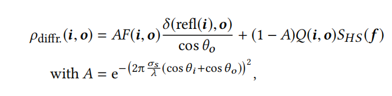

# A Two-Scale Microfacet Reflectance Model Combining Reflection and Diffraction

基于微面模型的方法大多数情况下，可以很好的匹配现实材质，但是有时候通过微面模型预测的结果，却与现实测量值大相径庭。本文对其进行了折射扩展，提出了一种双尺度反射模型，在较大尺度下（大于波长）使用`Cook-Torrance`模型，而在较低尺度下（约等于波长），则负责产生衍射效果。

## 1. INTRODUCTION

最常用的微表面模型是`Cook-Torrance`模型，它假设每一个微表面都是一个完美的反射平面，其尺寸远大于光的波长——so that the surface response is defined by optical geometry。而衍射效应则由光程长度的变化引起。这两个技术都不错，但是有时候预测的结果，却和实际相矛盾。首先，`Cook-Torrance`模型对于高光峰值波瓣能够进行很好的拟合，但有些材质，其波瓣会随着入射光的波长变化（波瓣宽度的变化）。另外一方面，衍射模型可以很好的拟合，但是需要从模型中去除对波长的依赖性，才能得到更好的拟合。因此结合两个模型，可以得到更好的拟合，但这也与物理模型相矛盾，因为单一微观几何结构不可能有两个正态分布

本文主要基于如下假设：1，在所有尺度上，都存在表面集合信息。本文则主要考虑两个尺度：`microgeometry`和`nano-geometry`。物质响应上则是：`Cook-Torrance`和`Cook-Torrance-Diffractio`，后者是`Cook-Torrance`和衍射的卷积。这个模型可以解释一些以前无法解释的现象，比如：在掠射角度下的波长依赖性。

## 2. PREVIOUS WORK

### 2.1 Microfacet Model

标准的分布模型（NDF，微平面核心），包括：Gaussian、rational fraction、Shifted-Gamma和exponential of a power function。H神认为一个好的法线分布应该是形状不变的，以适应线性变换。在微面模型中，Shadow、Masking是能量守恒的关键。H神也提出了一个多尺度模型BRDF，也是不同的尺度，但考虑的都只是反射效应。

### 2.2 Diffraction Models

衍射效应主要由表面高度的变化引起，几种模型表达了高度分布与反射率特性之间的关系：`Rayleigh-Rice vector perturbation theory`是为光滑表面和广角散射设计的；`Harvey-Shack`模型通过表面传递函数`surface transfer function`来拟合衍射；进一步扩展，得到`Krywonos`模型。在本文中，我们使用了改进的`Harvey-Shack`模型，用单个项代替积分来模拟衍射效应。

### 2.3 Comparison with Measured Reflectances

这两种模型的参数不同，对入射面的反射叶的预测也不同。结果表明，被测材料的反射波瓣形状符合衍射理论的预测，简化后的衍射模型与被测材料的反射波瓣形状拟合较好。

N神发现，哪怕模型拟合的再好，在掠射角处计算得到的结果仍与实际值有差别，而且对于高光材质，单个波瓣进行拟合是不够的，而多个波瓣在提高质量的同时，其拟合过程也变得不稳定。

B神在2016年提出的方法，将Shadow项G~1~从Smith中分离了出来。

==而对于本文最为重要的是==：H神通过进行经验方法的研究，认为反射一般由两个部分组成：广角散射导致的衍射（diffraction for wide-angle scattering），靠近镜面方向的微面反射。

## 3. BACKGROUND

对于每一个微面，其反射率是一个`Dirac delta function`，乘上一个菲涅尔项：

其中，F取决于材质的IOR，而折射率依赖光的波长$\lambda$。对于电解质，折射率$\eta$是一个实数，与材料内部的光速有关。对于导体（金属），$\eta$是一个虚数。所有微面之和，得到的`Cook-Torrance`模型如下：

在F、D、G中，唯一依赖波长的是菲涅尔项，对于非偏振光，F定义为：

#### Diffraction: Modified Harvey-Shack Theory

该理论基于光在表面上的传播距离，如上图，这种光路长度（`optical path length`，OPD）的差异可表示如下：

导致光波发生相位变化：$(2\pi / \lambda )(cos\theta_i+cos\theta_o)h(x,y)$，对这些相位变化进行平均可以得到反射方程。此时，对于反射项$\rho_{diff}$，可以得到如下的计算公式：

其中，A是根据相位差得到的权重因子，$S_{HS}(f)$是散射方程，$Q(i,o)$是衍射的颜色项，$\sigma_s$是表面粗糙度。由这个公式也可解释，为什么越接近掠射角，衍射效应越明显。==控制衍射的主要参数是二维向量f==（如下图:arrow_down:）。f是出射光（视线向量v）和入射光的反射向量。之间差异，投影在切平面上，最后除上波长。

#####  Color and Polarization

$Q(i,o)$是衍射波瓣的颜色项，依赖于IOR，但和菲涅尔项不同，它来自针对光滑表面衍射的`Rayleigh-Rice theory`——此理论是一种`scalar theory`，但其无法解释偏振效应。K神建议将其预测值乘以相同的Q因子，来解释偏振效应。

> 在拍摄表面光滑的物体，如玻璃器皿、水面、陈列橱柜、油漆表面、塑料表面等，==常常会出现耀斑或反光，这是由于光线的偏振而引起的==。在拍摄时加用偏振镜，并适当地旋转偏振镜面，能够阻挡这些[偏振光](https://baike.baidu.com/item/偏振光)，借以消除或减弱这些光滑物体表面的反光或亮斑。要通过取景器一边观察一边转动镜面，以便观察消除偏振光的效果。当观察到被摄物体的反光消失时，既可以停止转动镜面。

Q依赖于出射方向和入射的反射向量之间的方位角$\phi$，Q的定义如下：

Q包括`cross-polarization transfer`：部分横向偏振光被视为垂直偏振光，并相互转移，用Q~sp~和Q~ps~表示。

##### Smooth Surface Linearization

作者这里使用的是指数形式的A，而有些研究者则使用光滑表面的拟合：

这个公式有如此变化的原因在于，我们做出了假设：微表面的几何信息远小于波长。使用一个线性拟合：

衍射波瓣变成了：

散射函数可以表达成PSD（`Power Spectral Density`）的缩放版本。（应该是我所知道的SPD）早期的`Harvey-Shack`模型对于OPD有不同的计算方法：$OPD=2cos\theta_ih(x,y)$。它们都在两个地方依赖波长：衍射强度与$\frac{1}{\lambda^4}$（反比）；波瓣的宽度与$\lambda$（正比）——这是由于f包含$1/\lambda$。（这个正比关系不够直观，还需看看）

> 在一定程度上，粗糙度可以看成微表面的尺度等级

#####  K-correlation Model

如果表面高度的空间<u>自协方差函数</u>` autocovariance function`是高斯型函数，那么$S_{HS}$也是高斯型的，然而，大多数光学表面没有高斯自协方差函数，在大的空间频率下，它们往往有一个逆幂律的衰落。对于这些表面，最广泛使用的是**K-correlation Model**：

其中，$\Gamma$是Gamma函数，对这个分布进行积分，得到表面粗糙度σ~s~^2^。它只有在c>1的情况下才是有限的，并且等于：

此时，简化的形式如下：

> B. J. Hoenders, E. Jakeman, H. P. Baltes, and B . Steinle. 1979. K Correlations and Facet Models in Diffuse Scattering. *Optica Acta: International Journal of Optics* 26, 10 (1979), 1307–1319. DOI:https://doi.org/10.1080/713819894

#####  Renormalization

为了能量守恒，$S_{HS}$必须重新归一化，通过除以$f$的积分：（f的变化是有限的，受限于单位圆盘内）

这个重归一化确保了衍射波瓣的能量是恒定的，$\sigma_{rel}$也可用在衍射和反射的分配上：

在实验中，作者预先计算了归一化因子$\frac{\sigma_s}{\sigma_{rel}}$，取了大量的$\theta$、b、c的值来进行计算。

##  4. OUR TWO-SCALE BRDF MODEL

正如上文所言，作者将表面信息分为两部分，`micro-geometry`和`nano-geometry`，但是两者还是相关的：

### 4.1 Generic Two-Scale Model

整个表面的反射率的积分求解如下：（可以看出就是宏观BRDF的一般推导公式）

一般情况下，这个公式并没有封闭形式的解，

将公式展开，左边：我们考虑微表面是理想镜面的情况，即$refl(i)=o$，（也就是m=h）此时：

###  4.2 Evaluating the Cook-Torrance Diffraction Lobe

对于衍射波瓣项$\rho_{CTD}$，也不存在封闭形式的解，因此，我们需要忽略积分中某些值得变化，来进行拟合。首先：

然后用上诉公式对A进行近似：

在极值处，拟合效果不错，更具体地说，$2\pi(2cos\theta_d)\sigma_{rel}/\lambda<1/2$成立时，表现不错。如下图:arrow_down:

