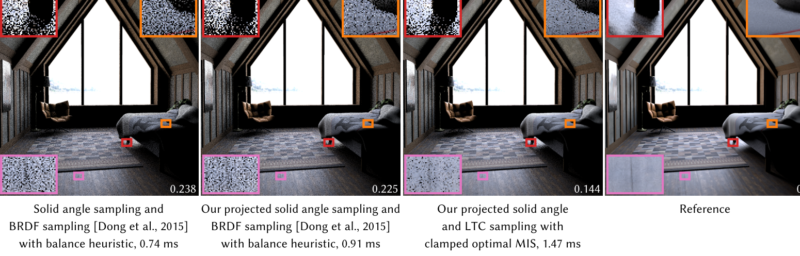
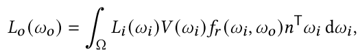
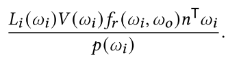

# BRDF Importance Sampling for Polygonal Lights

## 1. 介绍

蒙特卡洛估计器从$Ω$中抽取一个与已知密度 $p(w_i)$成正比的**随机样本** `w`，并估计积分为：

随机性表现为**噪声**。**重要性抽样**通过构建一个能很好地**接近积分的密度**$p(w_i)$来减少**方差**。

在`solid angle sampling`的情况下，密度在**区域光的实角范围**内是**恒定的**，而在其他地方是`0`。这种方法适用于所有常见类型的区域光。如果区域光是**Lambertian发射器**，即$L_i$是常数，蒙特卡洛估计器与$V(w_i)f_r(w_i,w_o)n^Tw_i$成正比。存在**BRDF重要性采样**的高效策略，但它们在整个半球产生的样本，往往会错过区域光。==多重重要性采样==（`MIS`）提供了一个强大的方法来结合这两种方法，但仍然存在相当大的方差。我们的方法产生的样本几乎与`BRDF * cos`成正比，但只在多边形光的实体角度内。它对漫反射和镜面渲染都有效。如果光线是Lambertian的，就能获得无偏的渲染。

## 2. 相关工作

具体见论文

