# Discrete Stochastic Microfacet Models

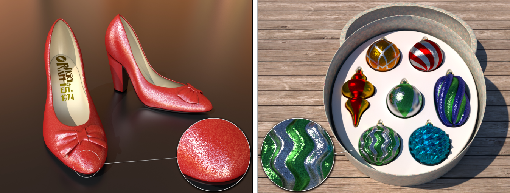

本文研究了==闪烁表面==的绘制，即随着表面或观看者的移动，显示出随机变化的闪烁。在本文中，作者提出了受==随机亚像素结构==影响的随机模型，这些**随机亚像素结构**在不同的光照条件和观看距离下，正确地产生闪光和空间噪声，同时还具有时间相干性，使它们在运动中看起来正确。

该模型基于微平面理论，但它用散射粒子在表面的==离散分布==取代了连续分布。

## 1. Introduction

闪光特征与观看距离、粒子位置的区域密度（越少，闪光特征越明显），和`flake`法线的密度（更多对齐片，看起来平滑)）。==时间外观==是闪光的另一个非常重要的方面：随着相机或物体的平滑运动，闪光出现，持续一段时间（取决于照明和运动的速度），然后消失。

一个实现方法是之前论文提及的高质量法线贴图，但亚像素结构是它的盲区。而另外==一个简单的实现方法==是：生成一个集合，每个`flake`的法线和随机位置都存储在集合中，然后对于渲染时每一个像素，去访问这张表，看看有多少亮片位于像素中且法线位置合适。

本文的模型不是假设一个无限的微面集合，导致一个==光滑和不变的BRDF==，而是使用一个固定的有限集合，导致一个==非光滑和空间变化的BRDF==。在每个像素处可以看到不同的特定薄片，从而产生特有的闪烁。

我们的模型很容易使用，因为它通过添加一个直观的参数--`单位面积的粒子数`--概括了广泛使用的微面反射模型，从而提供了一系列的外观，从微妙的闪光到显著的闪烁，同时保持相同的平均BRDF。

## 2. Discrete Stochastic Reflection Models

### 2.1 Multiscale BRDFs

 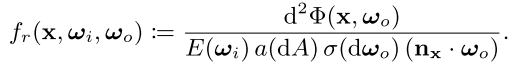
$$
dL_o(w_o)=\frac{d\Phi_o}{dw_ocos\theta_odA}=\frac{F_r(w_o)L_i(w_i)dw_icos\theta_hD(w_h)dw_hdA}{dw_ocos\theta_odA}
$$
​	其中，$a(dA)$是微分$dA$的面积；$\sigma(dw_o)$是单位球上$dw_o$的面积。

==多尺度BRDF==则表示x周围的`有限区域A`，散射到ωo周围的`有限固角`$\Omega_o$的功率：{**2**}

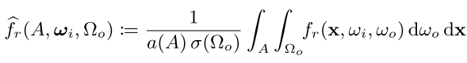

经典的BRDF如下：{**3**}

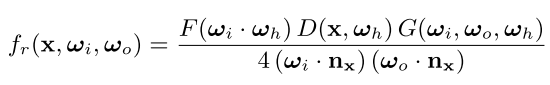

我们的新模型将表面视为：由有限、多个随机定向`facet`组成的特定集合，因此我们将==离散微面分布==定义为：

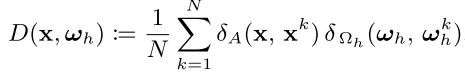

其中，$x^k$和$w^k_h$是`facets`列表的位置和法线，接下来，将此定义插入方程(3)，并将结果表达式代入方程(2)，此时，位置和出射方向的**积分**简化为**面的和**：{**4**}

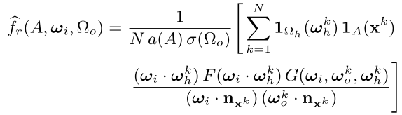

其中，$l_X$表示集合X上的==指标函数==，其决定了在一个给定的空间区域中，哪些面能将光反射到出射方向的固角`solid angle`上。当只有少数几个面参与时，不同像素之间有相当大的变化，产生强烈的闪光外观；当许多面参与时，变化不那么剧烈，表面反射率显得更平滑，更像传统的BRDF。

集合A和Ωo的大小一般都很小。A与一个像素的`footprint`有关，而我们使用的Ωo集不大于0.034 `steradians`。因此，各种项（菲涅尔项、几何项和前缩短项）在不同面之间的变化很小，主导效应是由==指标函数==引起的。

出于这个原因，作者引入了一种近似方法，这将导致后面的有效实现：我们从方程(4)的第二行分数项中，删除所有涉及==k==的上标。没有上标的==对应量==被定义为它们各自集合的中心点。接下来，这一项可以移到和之外，从而得到==BRDF==的最终形式：{**5**}

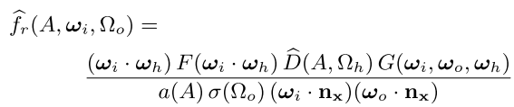

其中：（之后的论文主要是如何计算这个函数）

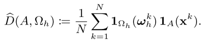

#### Usage in a rendering system

作者定义了一个有限的立体角，在这个立体角中，表面的`microfacet`可以把光反射成一个半径γ，以ωo为中心的圆锥体。γ角越小，粒子数越少，尽管$\sigma(\Omega_o)=\pi(1-cos\gamma)$项通过增加每个粒子的权重来补偿这一点。这样，γ参数提供了一些对于==被积函数的方差==的控制。对其效果的==另一种解释==是**平滑内核**，将**照明**与**圆形单位阶跃函数**卷积。在本文场景中，作者使用一个介于0.5到6度之间的常数γ。

### 2.2 Reflection Geometry

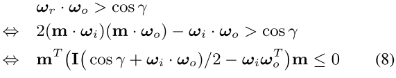

等式(**8**)指定了一个二阶圆锥，集$\Omega_h$是一个圆锥与单位球面的交点（图五的蓝色）。为了直观地了解它的形状，作者用$w_i$和$w_o$的**半向量**和**差向量**来表示一个更自然的坐标系：

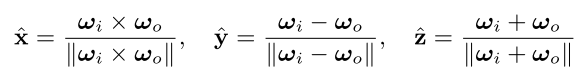

在这个框架中，对公式(8)进行缩放以**归一化**第三个特征值后，我们得到圆锥截面的标准形式：{**9**}

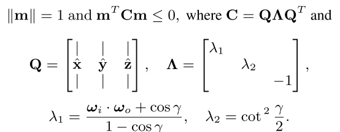

> 这节主要是分析得到$\Omega_h$域

### 2.3 Hierarchical Traversal

回想一下，==搜索查询==由一个**球面圆锥**h和一个纹理空间中的平行四边形的**笛卡尔积**组成。目前，我们假设粒子在**空间方向域**中的位置提前已知，并将它们组织在一个==四维空间细分加速数据结构==中。简单地忽略第11行和第12行，**算法1**实现了标准的**广度优先搜索遍历**。在每次迭代中，该算法从**队列**中弹出一个四维树节点，并检查是否重叠。如果该节点不包含任何粒子或不与查询重叠，则会立即丢弃该节点。如果**查询区域**中包含完整的节点，则将其 |node| 的粒子数添加到运行计数器中。否则，将通过split()操作获得节点的子节点，并将其推入队列以便稍后处理。最后一行返回被检测粒子的数量除以它们在整个域上的总数。

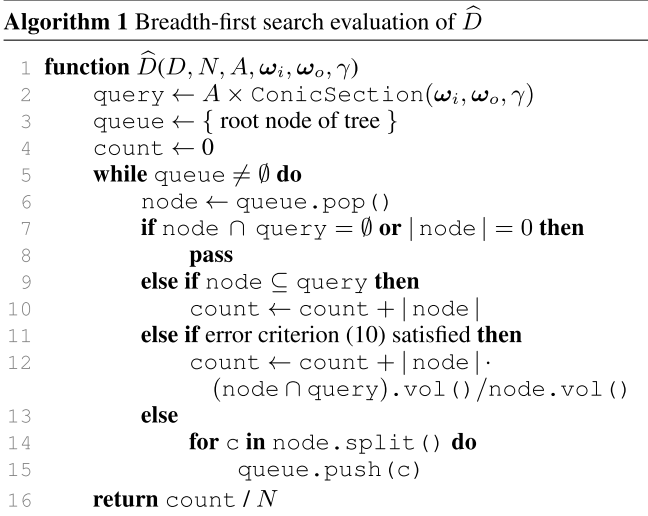

#### Adaptive error criterion

自适应误差准则：在上面描述的形式中，计数算法将遍历**分层数据结构**，直到获得准确的答案。然而，这种级别的精度通常是不必要的，并且在**总体呈现时间方面**会带来沉重的成本：当**查询**覆盖成千上万甚至数百万个粒子时，精确**解析结果**到最后一个粒子是过分的。因此，我们在==算法1==的第12行中使用一个近似，当相对于当前粒子计数的**预期误差**很小时，停止节点的**递归扩展**。在这种情况下，一个节点中包含的粒子的**一部分**将根据它与查询的**重叠程度**添加到运行的粒子计数中，其中.vol()计算集合的4D体积。

让我们把**重叠度**表示为p∈[0，1]，让n为节点中的粒子数。在单元内均匀分布的假设下，单个粒子落在查询内的概率等于p，由于有n个粒子，所以查询中包含的**粒子数**遵循参数为p、**采样数**为n的==二项分布==。我们的近似是用**预期数**代替交集中的**实际粒子数**，这就引入了一个**预期误差**，等于分布的标准差，并导致了一个简单的自适应误差准则：只有当底层平滑的**微面分布**在节点内接近均匀时，我们才会使用该近似，而且当

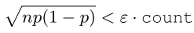

其中ε是一个==相对误差阈值==。作者发现，可以使用高达10%的值，而不会出现明显的误差。因此，所有的结果都使用ε= 10%。

#### Data structure

具体见论文。

### Intersection and overlap computations

具体见论文。

### 2.4 Stochastic Process

到目前为止，我们已经将模型描述为：输入是在**分层数据结构**中组织的、显式枚举的`facet`集。为了避免这些巨大的空间和时间需求，我们从不显式地存储==单个微面==，而是使用一个随机过程，在遍历**层次结构**时评估它们。为了确保时间上的一致性，我们以确定性的方式对该过程进行处理，这样**重复查询**就会得到一致的结果。

我们新的**随机过程**的主要思想是：自上而下地生成粒子数，始终尊重树上较高处的选择。这个过程在二维空间中最容易可视化；四维的情况完全类似。假设我们从一个已知包含n个均匀分布的点的矩形开始。将矩形分割成四个相等的子矩形会导致点被分割成四个子集，每个子集的预期大小为n/4。在没有进一步信息的情况下，可以看出，可能的分区集X=(X1，......，X4)遵循概率向量p=(1/4，1/4，1/4，1/4)和n次试验的**多项分布**。所以在遍历层次结构时，我们从这个多项分布中抽取一个样本，这时四个子节点的点数或计数就会变得已知。

这个过程递归地应用于**子节点**，因此**程序集合**为(无限)树中的每个节点定义一个计数，从根节点N开始。使用多项分布，可以确保：子结点的总数总是和父结点的总数一样，因此，在树中任意的切线都能找到相同的点数。通过进一步细分，计数最终将为1或0，并且每个点都可以按照需要精确地定位，因为递归可以任意地持续很远，将点困在越来越小的区域中。由此可见，该算法定义了一组N个均匀分布的点，同时允许在不生成点的情况下，找到任何节点中包含的数量。遍历过程完全是**程序性**的；层次结构中的节点永远不需要存储。

另一种==思考方式==是，根节点内的初始N个粒子是 "模糊 "的，即它们的位置和方向还没有被单独解决；我们对它们的唯一了解是它们的总数量。每一次拆分操作都会减少一个位数的不确定性，我们的遍历算法会继续拆分节点，直到落在查询区域内的粒子数量确定。

作者采取==数值方法==。在渲染过程之前，函数integration(==算法2==)被调用。该函数使用**中点**和基于角的**正交规则**，对微面分布进行积分。当这两个结果相差超过一个指定的**误差阈值**时，我们的算法将返回三角形的四个**子三角形**的积分之和。

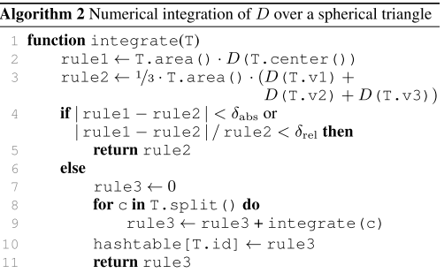

#### Optimizations

具体见论文

#### Importance sampling

为了在**现代渲染系统**中有效地使用我们的新BRDF模型，我们需要一种从接近BRDF的分布中采样方向的方法。我们尝试了通过另一种树遍历的方式直接对**离散积分**进行采样的方法，但最终发现，在我们考虑的场景中，基于不同**平滑密度函数**的简单技术具有更好的效率。这样的方法在**蒙特卡洛采样背景**下是允许的，只要我们在基础统计估计器中考虑到目标BRDF和使用的密度函数之间的差异即可。

为了根据给定的入射方向ωi，进行采样ωo，我们首先使用相应的**光滑微面模型**的采样方法（详见Walter等人[2007]），产生一个方向$w_o^`$。与Walter等人一样，我们也使用了一个**尺度粗糙度参数**来降低所得采样方法的方差。在我们的情况下，由于我们模型的离散性，一个相对较大的尺度因子（α~sample~ = 2α）是必要的：在**低概率**的情况下，一些粒子可能最终会出现在**积分D**非常低的球形三角形中，导致高光边缘偶尔出现但非常明显的高方差像素。缩放扩大了波瓣，使这些方向以足够高的概率进行采样。

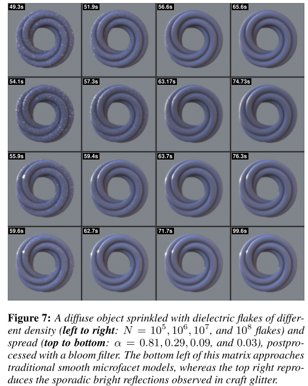

#### Additional state

我们的方法可以扩展到：允许额外的==粒子状态==，如表面积，或反照率，或干扰涂层的不同颜色。每个粒子的附加状态被建模为来自状态分布的一个样本，然后**节点分割操作**从衍生分布中抽取一个样本。

