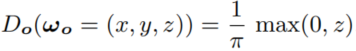

# Real-Time Polygonal-Light Shading with Linearly Transformed Cosines

论文首页：https://eheitzresearch.wordpress.com/415-2/

论文地址：https://drive.google.com/file/d/0BzvWIdpUpRx_d09ndGVjNVJzZjA/view

实时代码地址：https://blog.selfshadow.com/sandbox/ltc.html


本文证明了：将一个3×3矩阵表示的线性变换，应用于球面分布的方向向量，得到了另一个球面分布，并推导了该球面分布的闭合表达式。有了这个想法，我们可以使用任何球面分布作为基本形状，以创建一个新的球面分布族，这产生了一个参数化，允许我们修改原始分布的形状，如粗糙度、椭圆各向异性和偏斜度`skewness`。

如果原始分布具有解析表达式、归一化、` integration over spherical polygons`，重要性抽样，==那么这些特性都会被线性变换后的分布所继承==。

通过设置原始分布为`clamped cosine`，得到了一个分布族，称之为线性变换余弦（==LTCs==），它为基于物理的BRDF提供了一个很好的近似，并且可以在任意球面多边形上进行积分（可解析的）。

最终效果:arrow_up:


## 1. Introduction

在本文中，作者主要对来自多边形灯光的渲染感兴趣，这意味着在球形多边形上计算BRDF的积分。尽管多边形灯光在理论上是最简单的灯光模型之一，但由于两个主要原因，它们在实时渲染中具有挑战性。

- 在球面多边形上，对参数化的球面分布进行积分，一般来说是很困难的，即使是最简单的分布。
- 最先进的、基于物理的材料模型不是简单的分布：它们具有复杂的形状，具有各向异性的拉伸和偏斜度` stretching and skewness`。

第3节中，我们引入了<u>线性变换球面分布</u>` Linearly Transformed Spherical Distributions`（==LTSDs==），一种解决这两个问题的新的球型分布。我们从一个原始的球形分布开始，对其方向向量应用一个3×3矩阵表示的线性变换。这产生了一个参数化，允许我们修改原始分布的形状，如粗糙度、椭圆各向异性和偏斜度，如图2所示。


多亏了这个参数化，我们可以使用任何球面分布，来创建一个新的参数球面分布族，如图3所示。这些分布的主要特征是：它们继承了原始分布的一些性质，如归一化、对任意球面多边形的积分和重要性采样。


## 2. Previous Work

### 2.1 Polygonal-Light Shading

多边形光源的解析解目前受限于类余弦分布。之前的实时游戏（200x）一般使用的都是使用`most-representative-point`方法。而最近的技术，是2015年的Lecocq方法，它们提供了对 Phong-polygon  integration的$O(n)$复杂度的近似。尽管这个技术是满足实时的，但依然受限于旋转对称。

> ==[论文]== LECOCQ, P., SOURIMANT, G., AND MARVIE, J.-E. 2015. Accurate analytic approximations for real-time specular area lighting. In *ACM SIGGRAPH 2015 Talks*, 68:1–68:1.

虽然我们的积分，其技术的复杂性也是$O(n)$，但结果是精确的，而且包含了椭圆各向异性和偏斜度。我们的技术实现起来也简单得多：它可以归结为用一个矩阵乘以n个多边形的顶点，然后用经典的Lambert公式计算它的辐照度。


### 2.2 Spherical Distributions

很少有球面分布可以代表复杂的形状，同时提供有用的积分特性。


##  3. Linearly Transformed Spherical Distributions

在这一节中，我们将介绍`Linearly Transformed Spherical Distributions` ==（LTSDs）==。我们展示了如何通过对其方向向量应用线性变换，来重塑原始分布（图2），我们定义了用这种方式获得的新分布(图3)，并讨论了它们的性质。


###  3.1 Definition

==初始分布==：$D_o$是我们用线性变换来<u>重新参数化</u>`reparameterize`的原始分布。$D_o$的选择控制了变换后分布的基本形状。

线性变换：用$3\times 3$矩阵表示的线性变换，应用到原始分布$D_o$的方向向量组$w_o$上（如上图2:arrow_up:）。进行归一化后，结果向量为：$w=Mw_o/||Mw_o||$，反过来，我们通过逆变换恢复原来的方向：$w_o=M^{-1}w/||M^{-1}w||$。

==<u>解析表达式</u>==`Closed-Form Expression`：LSTD的大小，等于：原分布$D_o$的大小（原始方向$w_o$方向上的） $\times$  立体角的变化（由于球面变换的变形`distortion`引起的），它有解析表达式：


 其中，$\frac{\partial{w_0}}{\partial{w}}=\frac{|M^{-1}|}{||M^{-1}w||^3}$是归一化方向向量$w=Mw_o/||Mw_o||$的雅可比矩阵。具体证明见附录A。

==形状不变性==：如果是缩放或者旋转，则雅可比矩阵是一个常数：$\frac{\partial{w_o}}{\part{w}}=1$，其分布是形状不变的。

==中值向量==：对于几个经典的初始分布$D_o$，Z向量$(0 ,0,1)^T$是中值向量——任何包含此向量的平面，将分布切成两部分。经过同样变换的中值向量也是新分布的中值向量。在图2的所有构型中，M的右列为$(0 ,0 ,1)^T$，即：中值向量保持与z轴对齐。


### 3.2 Properties

变换后的分布继承了原始分布的几个属性： **{2}**

- **Normalization**：模不变

    

- **Integration over Polygons**： **{3}**

    

    直观上，上式中的积分是：在D中采样的一个方向与多边形P相交的概率。而任何线性变换都不会改变这些交点，所以积分的值不会变。


- **Importance Sampling** ：原分布能够进行重要性采样，新分布也能进行。因为公式(1)中定义的LTSD乘以了这个变换的雅可比矩阵， 样本ω的概率密度函数（PDF）正好是D(ω)。

    


## 4. Approximating Physically Based BRDFs with Linearly Transformed Cosines

在本节中，我们选择一个`clamped`余弦分布作为初始分布，创建一系列线性变换分布，产生一个对==基于物理BRDFs==很好的近似。

**Linearly Transformed Cosines**：对于原始分布$D_o$，我们选择了一个 ==方向Z给定的半球上== 的归一化的余弦分布：**{4}**



将$D_o$传入公式1得到`Linearly Transformed Cosines` (LTCs)。

**Fitting** ：我们选择近似的GGX微面BRDF，目前被认为是最真实的参数化BRDF。我们近似带有余弦权重BRDF（光线方向$w_l$上的）给出的球面函数。**{5}**


对于各项同性的材料，BRDF依赖于入射方向$w_v=(sin\theta_v,0,cos\theta_v)$和粗糙度$\alpha$。对于任意组合$(\theta_v,\alpha)$，作者用一个线性变换余弦 (LTCs)来拟合带有余弦权重的BRDF。我们找到矩阵M来得到最合适的结果。==由于各向同性BRDFs的平面对称性==，并且由于LCTS是尺度不变的，所以M可以表示为：**{6}**


所以只需要拟合4个参数。根据经验，我们发现最小化$L^3$误差，可以获得最佳的渲染效果。图5:arrow_down:为我们的拟合结果。


> HILL, S., MCAULEY, S., BURLEY, B., CHAN, D., FASCIONE, L., IWANICKI, M., HOFFMAN, N., JAKOB, W., NEUBELT, D.,PESCE, A., AND PETTINEO, M. 2015. ==Physically based shading in theory and practice==. In *ACM SIGGRAPH Courses 2015*.

**Representation and Storage**：根据公式3，拟合后，我们将逆矩阵存储在一个预先计算的表中。根据矩阵{6}，逆矩阵由四个参数表示。此外，我们为拟合后的BRDF的$\int_{\Omega}\rho(w_v,w_l)cos\theta_ldw_l$的模，提供一个额外参数。我们在一张$64\times 64$的2D纹理中存储了五个参数，


## 5. Real-Time Polygonal-Light Shading with Linearly Transformed Cosines

对diffuse多边形灯进行渲染，意味着计算多边形区域上的光照积分：**{7}**


其中，$w_v$是视线方向v，$\rho$是BRDF，P就是多边形区域，L是多边形区域发出的，在方向$w_l$上接收到的辐射度。为了使用LTCs的性质，在运行时，获取和当前BRDF相关的矩阵$M^{-1}$。此时，公式简化如下：**{8}**


###  5.1 Shading with Constant Polygonal Lights

如果多边形发出的辐射度是常数，则：**{9}**


由于公式(3)的多边形积分性质，我们可以简化：**{10}**


其中，E是多边形区域$P_o=M^{-1}P$的辐照度`irradiance`。由于D~o~是一个夹紧`clamped`的余弦分布，它在一个多边形上的积分是这个多边形的辐照度，这个积分具有解析解： **{11}**


其中，$j=(i+1)\mod{n}$，请注意，该公式假设了一个位于上半球的球形多边形。在实践中，将其贡献加到公式（11）的和之前，我们将多边形的每条边剪下`clip`。


### 5.2 Shading with Textured Polygonal Lights

在本节中，灯光是用一张二维的颜色纹理表示，在这种情况下，它不能与积分分离。重写公式8： **{12} {13} {14}**


这个公式的优点是：它允许我们将问题分解为两个子问题——计算$I_D$和$I_L$——它们具有不同的属性。

**The Shape of the Highlight**：$I_D$的值是多边形域上分布的积分——D中的光线与P相交的比例。我们用式(3)计算其精确值。

**The Color of the Highlight**：相比之下，$I_L$可以被看作是：D中和P相交的光线，求和后的平均颜色，它决定了高光的颜色。它可以被表述为一个纹理空间滤波器，我们建议用预先过滤的纹理来近似这个滤波器。==下面，我们将描述如何使用LODs预过滤纹理，以及如何参数化纹理获取（ how to parameterize a texture fetch）==。


### 5.3 Texture Prefiltering

根据公式14，$I_L$==可以看作纹理L通过滤波器$F(w_l)=\frac{D(w_l)}{\int_P{D(w_l)dw_l}}$（投影在纹理空间）后的值==。在预过滤的步骤中，作者用一个纹理空间的高斯滤波器来拟合F，==近似滤波器==保留了F的两个属性：1，F is clamped to the polygon，也就是说$\int_PF(w_l)dw_l=1$，在实际应用中，这意味着近似的纹理空间过滤器不能应用到纹理之外。为了实现这一点，我们对纹理内部的**纹理空间高斯分布**进行`clamp`和`renormalize `。此外，预过滤纹理的值必须定义在纹理空间的每个地方，甚至在纹理之外，如下图:arrow_down:。我们在纹理周围引入一个边缘，在这个区域，我们增加了滤镜的半径，使其与纹理相交。


### 5.4 Texture Fetching

**On the Difficulty of Fetching Prefiltered Area-Light Textures**：参数化一个纹理获取`Parameterizing a texture fetch`需要两个量：==纹理坐标和LOD==。一种朴素的方法是：计算（纹理空间中）**分布的平均方向**的交点坐标（如图7a:arrow_down:）。这种方法不稳定，有时还不明确。==另一个困难是合适的LOD取决于几个参数==：分布的锐度`sharpness`、纹理平面的倾角和距离。


**Simplifying the Problem with the Cosine Confifiguration**：为了简化这个问题，我们用与D相关的余弦构型来表示它。


==这种配置的优点是，对近似余弦分布D~o~的纹理空间滤波器进行参数化，比对任意分布D进行参数化，要简单和稳健得多。==

**Fetching the Prefifiltered Texture in the Cosine Confifiguration**：在余弦配置中，我们使用正交投影将渲染点投影到纹理平面上（如图7b:arrow_up:），此外，由于是正交投影，此时的纹理平面倾斜度正好是90◦，因此不会给纹理空间` filter shape`引入各向异性。作者忽略了多边形变换后，余弦分布的低频变化和纹理参数化的各向异性失真。==LOD的选择简化为一个一维函数==，即纹理平面的平方距离$r^2$与多边形的面积a之比。我们选择了==具有高斯标准差（$\sigma=\sqrt{\frac{r^2}{2A}}$）的==LOD预滤波（纹理空间中）。


##  6. Results

图8显示了在视频游戏引擎中使用我们的技术计算灯光的场景。场景包含8个矩形光源，在NVIDIA GeForce GTX 980 GPU上，每帧总渲染时间为15ms，分辨率为1280×720。


### 实际使用和个人理解

结合代码来看，我们需要知道的是：首先在表中存储的是用来修改分布的矩阵的逆。核心理解是下面的公式：


因为是区域灯，所以在计算时，需要对灯光区域P进行积分，如下：


此时，$\rho(w_v,w_l)$ 是变形后的分布，如下图。


而对这个分布进行积分是困难的（或者说，对$D(w)=\rho(w_v,w_l)cos\theta_l$进行积分是困难的），哪怕此时的区域P是webGL实例里面的正方形区域:arrow_down:，这个时候怎么办呢？，我们可以通过存储好的矩阵的逆，将分布转化为原始分布，也就是：


这个时候，==编程关键来了，我们需要对区域P也进行相应的转化，或者说，实际代码内，就只会对区域进行转化，因为我们已经知道分布变化的结果，而我们根本不关心原始分布有多奇怪，然后进行如下近似==：


总结：我们在计算之前，只知道$D_o$和$P$，而不知道$D$和$P_o$，那么此时根据积分的简易性，我们选择使用矩阵，通过$P$得到$P_o$，再进行积分拟合。

# Code

首先，大部分函数都是简单的工具函数，但依然有许多需要分析的：

- 首先，`ClipQuadToHorizon`是裁剪函数，当长方形灯源和平面相交时，用来更新多边形（四边形或五边形）。
- 而核心是函数`LTC_Evaluate`。

```c
vec3 LTC_Evaluate(
    vec3 N, vec3 V, vec3 P, mat3 Minv, vec3 points[4], bool twoSided)
{
    // construct orthonormal basis around N
    vec3 T1, T2;
    T1 = normalize(V - N*dot(V, N));
    T2 = cross(N, T1);

    // rotate area light in (T1, T2, N) basis
    Minv = mul(Minv, transpose(mat3(T1, T2, N)));

    // polygon (allocate 5 vertices for clipping)
    vec3 L[5];
    L[0] = mul(Minv, points[0] - P);
    L[1] = mul(Minv, points[1] - P);
    L[2] = mul(Minv, points[2] - P);
    L[3] = mul(Minv, points[3] - P);

    int n;
    ClipQuadToHorizon(L, n);
    
    if (n == 0)
        return vec3(0, 0, 0);

    // project onto sphere
    L[0] = normalize(L[0]);
    L[1] = normalize(L[1]);
    L[2] = normalize(L[2]);
    L[3] = normalize(L[3]);
    L[4] = normalize(L[4]);

    // integrate
    float sum = 0.0;

    sum += IntegrateEdge(L[0], L[1]);
    sum += IntegrateEdge(L[1], L[2]);
    sum += IntegrateEdge(L[2], L[3]);
    if (n >= 4)
        sum += IntegrateEdge(L[3], L[4]);
    if (n == 5)
        sum += IntegrateEdge(L[4], L[0]);

    sum = twoSided ? abs(sum) : max(0.0, sum);

    vec3 Lo_i = vec3(sum, sum, sum);

    return Lo_i;
}
```

首先，围绕法线N构建正交基

```c
 // construct orthonormal basis around N
 vec3 T1, T2;
 T1 = normalize(V - N*dot(V, N));
 T2 = cross(N, T1);
```


```c
// bind roughness   {label:"Roughness", default:0.25, min:0.01, max:1, step:0.001}
// bind dcolor      {label:"Diffuse Color",  r:1.0, g:1.0, b:1.0}
// bind scolor      {label:"Specular Color", r:1.0, g:1.0, b:1.0}
// bind intensity   {label:"Light Intensity", default:4, min:0, max:10}
// bind width       {label:"Width",  default: 8, min:0.1, max:15, step:0.1}
// bind height      {label:"Height", default: 8, min:0.1, max:15, step:0.1}
// bind roty        {label:"Rotation Y", default: 0, min:0, max:1, step:0.001}
// bind rotz        {label:"Rotation Z", default: 0, min:0, max:1, step:0.001}
// bind twoSided    {label:"Two-sided", default:false}

uniform float roughness;
uniform vec3  dcolor;
uniform vec3  scolor;

uniform float intensity;
uniform float width;
uniform float height;
uniform float roty;
uniform float rotz;

uniform bool twoSided;

uniform sampler2D ltc_mat;
uniform sampler2D ltc_mag;

uniform mat4  view;
uniform vec2  resolution;
uniform int   sampleCount;

const float LUT_SIZE  = 64.0;
const float LUT_SCALE = (LUT_SIZE - 1.0)/LUT_SIZE;
const float LUT_BIAS  = 0.5/LUT_SIZE;

const float pi = 3.14159265;

// Tracing and intersection
///////////////////////////

struct Ray
{
    vec3 origin;
    vec3 dir;
};

struct Rect
{
    vec3  center;
    vec3  dirx;
    vec3  diry;
    float halfx;
    float halfy;

    vec4  plane;
};

bool RayPlaneIntersect(Ray ray, vec4 plane, out float t)
{
    t = -dot(plane, vec4(ray.origin, 1.0))/dot(plane.xyz, ray.dir);
    return t > 0.0;
}

bool RayRectIntersect(Ray ray, Rect rect, out float t)
{
    bool intersect = RayPlaneIntersect(ray, rect.plane, t);
    if (intersect)
    {
        vec3 pos  = ray.origin + ray.dir*t;
        vec3 lpos = pos - rect.center;
        
        float x = dot(lpos, rect.dirx);
        float y = dot(lpos, rect.diry);    

        if (abs(x) > rect.halfx || abs(y) > rect.halfy)
            intersect = false;
    }

    return intersect;
}

// Camera functions
///////////////////

Ray GenerateCameraRay(float u1, float u2)
{
    Ray ray;

    // Random jitter within pixel for AA
    vec2 xy = 2.0*(gl_FragCoord.xy)/resolution - vec2(1.0);

    ray.dir = normalize(vec3(xy, 2.0));

    float focalDistance = 2.0;
    float ft = focalDistance/ray.dir.z;
    vec3 pFocus = ray.dir*ft;

    ray.origin = vec3(0);
    ray.dir    = normalize(pFocus - ray.origin);

    // Apply camera transform
    ray.origin = (view*vec4(ray.origin, 1)).xyz;
    ray.dir    = (view*vec4(ray.dir,    0)).xyz;

    return ray;
}

vec3 mul(mat3 m, vec3 v)
{
    return m * v;
}

mat3 mul(mat3 m1, mat3 m2)
{
    return m1 * m2;
}

vec3 rotation_y(vec3 v, float a)
{
    vec3 r;
    r.x =  v.x*cos(a) + v.z*sin(a);
    r.y =  v.y;
    r.z = -v.x*sin(a) + v.z*cos(a);
    return r;
}

vec3 rotation_z(vec3 v, float a)
{
    vec3 r;
    r.x =  v.x*cos(a) - v.y*sin(a);
    r.y =  v.x*sin(a) + v.y*cos(a);
    r.z =  v.z;
    return r;
}

vec3 rotation_yz(vec3 v, float ay, float az)
{
    return rotation_z(rotation_y(v, ay), az);
}

mat3 transpose(mat3 v)
{
    mat3 tmp;
    tmp[0] = vec3(v[0].x, v[1].x, v[2].x);
    tmp[1] = vec3(v[0].y, v[1].y, v[2].y);
    tmp[2] = vec3(v[0].z, v[1].z, v[2].z);

    return tmp;
}

// Linearly Transformed Cosines
///////////////////////////////

float IntegrateEdge(vec3 v1, vec3 v2)
{
    float cosTheta = dot(v1, v2);
    float theta = acos(cosTheta);    
    float res = cross(v1, v2).z * ((theta > 0.001) ? theta/sin(theta) : 1.0);

    return res;
}

void ClipQuadToHorizon(inout vec3 L[5], out int n)
{
    // detect clipping config
    int config = 0;
    if (L[0].z > 0.0) config += 1;
    if (L[1].z > 0.0) config += 2;
    if (L[2].z > 0.0) config += 4;
    if (L[3].z > 0.0) config += 8;

    // clip
    n = 0;

    if (config == 0)
    {
        // clip all
    }
    else if (config == 1) // V1 clip V2 V3 V4
    {
        n = 3;
        L[1] = -L[1].z * L[0] + L[0].z * L[1];
        L[2] = -L[3].z * L[0] + L[0].z * L[3];
    }
    else if (config == 2) // V2 clip V1 V3 V4
    {
        n = 3;
        L[0] = -L[0].z * L[1] + L[1].z * L[0];
        L[2] = -L[2].z * L[1] + L[1].z * L[2];
    }
    else if (config == 3) // V1 V2 clip V3 V4
    {
        n = 4;
        L[2] = -L[2].z * L[1] + L[1].z * L[2];
        L[3] = -L[3].z * L[0] + L[0].z * L[3];
    }
    else if (config == 4) // V3 clip V1 V2 V4
    {
        n = 3;
        L[0] = -L[3].z * L[2] + L[2].z * L[3];
        L[1] = -L[1].z * L[2] + L[2].z * L[1];
    }
    else if (config == 5) // V1 V3 clip V2 V4) impossible
    {
        n = 0;
    }
    else if (config == 6) // V2 V3 clip V1 V4
    {
        n = 4;
        L[0] = -L[0].z * L[1] + L[1].z * L[0];
        L[3] = -L[3].z * L[2] + L[2].z * L[3];
    }
    else if (config == 7) // V1 V2 V3 clip V4
    {
        n = 5;
        L[4] = -L[3].z * L[0] + L[0].z * L[3];
        L[3] = -L[3].z * L[2] + L[2].z * L[3];
    }
    else if (config == 8) // V4 clip V1 V2 V3
    {
        n = 3;
        L[0] = -L[0].z * L[3] + L[3].z * L[0];
        L[1] = -L[2].z * L[3] + L[3].z * L[2];
        L[2] =  L[3];
    }
    else if (config == 9) // V1 V4 clip V2 V3
    {
        n = 4;
        L[1] = -L[1].z * L[0] + L[0].z * L[1];
        L[2] = -L[2].z * L[3] + L[3].z * L[2];
    }
    else if (config == 10) // V2 V4 clip V1 V3) impossible
    {
        n = 0;
    }
    else if (config == 11) // V1 V2 V4 clip V3
    {
        n = 5;
        L[4] = L[3];
        L[3] = -L[2].z * L[3] + L[3].z * L[2];
        L[2] = -L[2].z * L[1] + L[1].z * L[2];
    }
    else if (config == 12) // V3 V4 clip V1 V2
    {
        n = 4;
        L[1] = -L[1].z * L[2] + L[2].z * L[1];
        L[0] = -L[0].z * L[3] + L[3].z * L[0];
    }
    else if (config == 13) // V1 V3 V4 clip V2
    {
        n = 5;
        L[4] = L[3];
        L[3] = L[2];
        L[2] = -L[1].z * L[2] + L[2].z * L[1];
        L[1] = -L[1].z * L[0] + L[0].z * L[1];
    }
    else if (config == 14) // V2 V3 V4 clip V1
    {
        n = 5;
        L[4] = -L[0].z * L[3] + L[3].z * L[0];
        L[0] = -L[0].z * L[1] + L[1].z * L[0];
    }
    else if (config == 15) // V1 V2 V3 V4
    {
        n = 4;
    }
    
    if (n == 3)
        L[3] = L[0];
    if (n == 4)
        L[4] = L[0];
}


vec3 LTC_Evaluate(
    vec3 N, vec3 V, vec3 P, mat3 Minv, vec3 points[4], bool twoSided)
{
    // construct orthonormal basis around N
    vec3 T1, T2;
    T1 = normalize(V - N*dot(V, N));
    T2 = cross(N, T1);

    // rotate area light in (T1, T2, N) basis
    Minv = mul(Minv, transpose(mat3(T1, T2, N)));

    // polygon (allocate 5 vertices for clipping)
    vec3 L[5];
    L[0] = mul(Minv, points[0] - P);
    L[1] = mul(Minv, points[1] - P);
    L[2] = mul(Minv, points[2] - P);
    L[3] = mul(Minv, points[3] - P);

    int n;
    ClipQuadToHorizon(L, n);
    
    if (n == 0)
        return vec3(0, 0, 0);

    // project onto sphere
    L[0] = normalize(L[0]);
    L[1] = normalize(L[1]);
    L[2] = normalize(L[2]);
    L[3] = normalize(L[3]);
    L[4] = normalize(L[4]);

    // integrate
    float sum = 0.0;

    sum += IntegrateEdge(L[0], L[1]);
    sum += IntegrateEdge(L[1], L[2]);
    sum += IntegrateEdge(L[2], L[3]);
    if (n >= 4)
        sum += IntegrateEdge(L[3], L[4]);
    if (n == 5)
        sum += IntegrateEdge(L[4], L[0]);

    sum = twoSided ? abs(sum) : max(0.0, sum);

    vec3 Lo_i = vec3(sum, sum, sum);

    return Lo_i;
}

// Scene helpers
////////////////

void InitRect(out Rect rect)
{
    rect.dirx = rotation_yz(vec3(1, 0, 0), roty*2.0*pi, rotz*2.0*pi);
    rect.diry = rotation_yz(vec3(0, 1, 0), roty*2.0*pi, rotz*2.0*pi);

    rect.center = vec3(0, 6, 32);
    rect.halfx  = 0.5*width;
    rect.halfy  = 0.5*height;

    vec3 rectNormal = cross(rect.dirx, rect.diry);
    rect.plane = vec4(rectNormal, -dot(rectNormal, rect.center));
}

void InitRectPoints(Rect rect, out vec3 points[4])
{
    vec3 ex = rect.halfx*rect.dirx;
    vec3 ey = rect.halfy*rect.diry;

    points[0] = rect.center - ex - ey;
    points[1] = rect.center + ex - ey;
    points[2] = rect.center + ex + ey;
    points[3] = rect.center - ex + ey;
}

// Misc. helpers
////////////////

float saturate(float v)
{
    return clamp(v, 0.0, 1.0);
}

vec3 PowVec3(vec3 v, float p)
{
    return vec3(pow(v.x, p), pow(v.y, p), pow(v.z, p));
}

const float gamma = 2.2;

vec3 ToLinear(vec3 v) { return PowVec3(v,     gamma); }
vec3 ToSRGB(vec3 v)   { return PowVec3(v, 1.0/gamma); }

void main()
{
    Rect rect;
    InitRect(rect);

    vec3 points[4];
    InitRectPoints(rect, points);

    vec4 floorPlane = vec4(0, 1, 0, 0);

    vec3 lcol = vec3(intensity);
    vec3 dcol = ToLinear(dcolor);
    vec3 scol = ToLinear(scolor);
    
    vec3 col = vec3(0);

    Ray ray = GenerateCameraRay(0.0, 0.0);

    float distToFloor;
    bool hitFloor = RayPlaneIntersect(ray, floorPlane, distToFloor);
    if (hitFloor)
    {
        vec3 pos = ray.origin + ray.dir*distToFloor;

        vec3 N = floorPlane.xyz;
        vec3 V = -ray.dir;
        
        float theta = acos(dot(N, V));
        vec2 uv = vec2(roughness, theta/(0.5*pi));
        uv = uv*LUT_SCALE + LUT_BIAS;
        
        vec4 t = texture2D(ltc_mat, uv);
        mat3 Minv = mat3(
            vec3(  1,   0, t.y),
            vec3(  0, t.z,   0),
            vec3(t.w,   0, t.x)
        );
        
        vec3 spec = LTC_Evaluate(N, V, pos, Minv, points, twoSided);
        spec *= texture2D(ltc_mag, uv).w;
        
        vec3 diff = LTC_Evaluate(N, V, pos, mat3(1), points, twoSided); 
        
        col  = lcol*(scol*spec + dcol*diff);
        col /= 2.0*pi;
    }

    float distToRect;
    if (RayRectIntersect(ray, rect, distToRect))
        if ((distToRect < distToFloor) || !hitFloor)
            col = lcol;

    gl_FragColor = vec4(col, 1.0);
}
```

