# Rendering Glints on High-Resolution Normal-Mapped Specular Surfaces

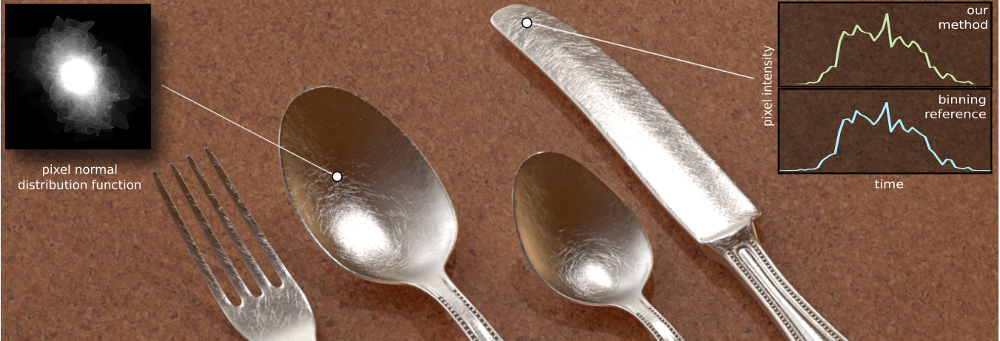

复杂镜面在**尖锐点光源下**呈现出令人眼花缭乱的**闪烁外观**，但其渲染是一个尚未解决的问题。使用==蒙特卡罗像素采样==来达到这个目的是不切实际的：能量集中在很小的亮点上，而这些亮点只占像素的极小部分。

相反，本文使用一种完全不同的确定性方法，来计算一个精确的解决方案。此方法考虑了通过**单个像素**看到的表面patch上的==法线的真实分布==，这可能是非常复杂的。==Gaussian pixel footprint== and ==Gaussian intrinsic roughness==

> 本文的核心什么呢？核心是NDF和P-NDF的区别，两者虽然都是估计的微表面的法线的分布，但是NDF是一个平滑的曲线，带有均值的意味，或者说就是均值，而P-NDF则直接与概率相关，所以很陡峭，可以这样理解，NDF是P-NDF的过滤结果，而本文的算法核心就是：通过高精度的法线贴图，结合高斯分布，积分求得P-NDF，这种积分过程，要将积分域（像素）划分成一个个三角形，在三角形域上进行积分，然后求和。
>

## 1. Introduction

咱们传统的BRDF都是基于微平面模型，考虑的是==微米级==的表面几何（论文中说无限小，不太认同）。正如之前看过的论文，几何细节达到==纳米级==，就可以产生光的相干效果，如衍射。但本文不走寻常路，考虑的是==毫米级==的几何细节，这种材质（刮花的金属）就会产生肉眼可见的高光闪烁。

> 事实上，可能这种材质才更加符合现实

用足够的**分辨率**来表示几何体，以揭示**导致闪光的特征**并不困难：使用高分辨率的法线贴图。**更难的挑战**是在强光下，渲染一个复杂的镜面。

用于直接照明的**标准均匀像素采样技术**有非常大的方差，使用它们来达到这个目的是不切实际的。原因是**大部分能量**集中在很小的高光上，而这些高光只占像素的极小部分。在某种意义上，我们需要在曲面上搜索与**半向量对齐的法线**，这不能通过蛮力采样来完成。

==Normal map filtering techniques==不能够解决这个问题，虽然这些方法可以**抗锯齿**，但它们不能再现高频照明下的**闪烁现象**。

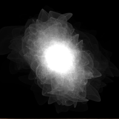

作者考虑的是通过单个像素，观察表面$patch~p$得到的==实际未简化的NDF==:arrow_up:。这个==P-NDF==可以通过**分形**来估计：反复选择**patch**上的一个点，取它的法线，使用**内在表面粗糙度**进行扰动，并将其放入==bin==中。**关键问题是**，对于直接照明，我们需要计算单个半矢量$h$的==P-NDF==。这相当于一个**标准渲染器**所做的事情——trying to hit a tiny light source by chance。

相反，我们需要评估来自==Patch==上任何位置的**法线密度**。此外，==P-NDF==对于每个像素都是不同的，所以计算不能重复使用。在我们的方法中，==P-NDF==只是一个数学工具，**用来推导出正确的像素亮度应该是什么**；它从来没有被完全构造出来，只对单个向量进行评估。

## 2. Related work

==Normal map filtering techniques==：可以通过将像素的NDF近似为**单个瓣**或少量几个波瓣，来提供**artifact-free**渲染。然而，这些方法都不能正确地捕捉到闪烁的外观。**问题的核心在于**，真正的==NDFs==可能是高度复杂的，而且其**尖锐特征**会直接转化为空间和时间的**闪烁**。用**宽叶瓣**近似只适用于低频照明，因为低频照明无论如何都会过滤掉复杂的特征。

==Single-point evaluation of caustics==：==焦散==与本文的工作有关，因为闪烁可以解释为“**定向焦散点**”。大多数方法对路径进行采样，并将它们积累到一个数据结构中。然而，这对于本文来说是不够的：**we require point evaluation, which is much harder**。

## 3. Preliminaries

要解决本文的问题，需要考虑通过一个像素而可见的表面$Patch~P$，而不是一个点。这样的区域具有$P-BRDF s$来描述这块像素的全部照明贡献。**渲染详细的法线贴图**需要一个高效的方法，来计算==P-BRDF==的区域积分，而不是让**片元滤波器**通过**点采样**隐式地完成。

对于一个**镜面法线映射**的表面，这个区域积分==BRDF==主要是由**表面法线**在相关表面==Patch==上的分布决定的：我们需要能够询问一个给定的**法线矢量**在==Patch==中出现的 "频率 "是多少？这个分布就是==P-NDF==吗，与传统NDF的区别在于，它描述的不是区域平均值，而是具体的法线分布。见下图:arrow_down:，这个分布不是一个简单的函数，反而具有极其复杂的结构。

它能有效地保留这种**详细的空间角度结构**，同时在整个表面上也有很大的变化。评估==P-NDF==是准确捕捉闪烁的**关键**。

**Pixel footprint**：假设了一个**高斯像素重建滤波器**。这在法线贴图的**uv参数化**上投影了一个近似==Gaussian footprint== P，其**协方差矩阵**很容易通过向表面传播**射线微分**来计算。实际中，作者将像素分割为$4\times4$的子像素，使得==footprint==更加小。

> 可以是更小的内存使用，存储，就像脚印一样，占用空间少，暴露的信息也少，具体要看语境。
>
> 直接翻译的话，意思大概是：像素的占据空间，可以理解为pixel/texel比，当然，这里并不是两者实际的分辨率之比，考虑到高斯分布的话，应该指的是高斯函数的半径，正如上图所言。

**Projected hemisphere**：将用**单位圆盘**D来表示半球面的单位向量。作者也定义了==扩展单位盘==，由单位盘和一个特殊符号⊥组成，它允许**法线分布**能返回无效的法线。**这比使用半球更不常见，但它很快就会有用**。

**Normal maps**：可以直接给出，或者通过高度图推导。$n(u)$的**雅可比矩阵**$J(u)$，在决定高光亮度上发挥了重要作用。（$J(u)=0$会导致问题）

**Intrinsic roughness**：可以将表面处理为==完全镜面化==，然而，作者发现，考虑少量未解决的**细微粗糙度**是有用的。

**NDFs**：在半球的情况下，像==Beckmann==和==GGX==这样的**NDF**需要一个额外的**余弦项**来集成到1，它们相关的采样例程也会产生余弦。在本文的公式，则无需考虑**余弦项**。此外，本文在NDF中有了**更多的自由**：任何合适的**平面函数**都可以被限制在单位磁盘上，并完全规范化。特别地，==高斯函数是非常好的NDFs==，它具有各向异性和且是**非中心NDFs**。**最后**，像“==高斯模糊NDF==”这样的状态有了一个非常精确的含义。

**The P-NDF**：是==被采样footprint P定义==的随机变量的**概率分布**，评估了采样位置的法线，且通过**Intrinsic roughness核**进行扰动。最后一步有时会导致**a normal outside of the unit disk**；这些事件是由⊥的概率收集的，并且在实践中常常接近于零。当footprint 不断变大，P-NDF越接近传统的NDF。

## 4. P-NDF evaluation in flatland and 3D

核心挑战是：在给定==footprint==后（通过给定的法线贴图，和一个Intrinsic roughness），找到一个好的评估算法，来计算$NDF~D(s)$，**s是半向量**。计算好后，直接代入传统BRDF公式即可。

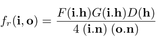

接下来，首先考虑平坦表面的处理，然后再扩展到复杂模型。

**The flatland situation**：这种情况是简单的：只有一个纹理坐标$u$。法线映射可以写成一个函数$n(u)$，返回范围为$(-1,1)$的法线值。完整的法线形式是$(n(u),\sqrt{1-n(u)^2})$。==Pixel footprint==将转化为高斯重构核==$G_p(u)$==。设X是一个**随机变量**，遵循$G_p(u)$分布，**核心问题**是：随机变量$n(X)$的分布是什么？这并不是$G_p$和法线贴图间的**简单相乘**和**卷积**，而是一个**因果随机变量**的==pdf==。这种情况如图6:arrow_down:所示。

我们可以将==P-NDF==写成：

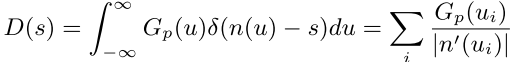

其中，$u_i$是公式$n(u)=s$的根==roots==。**delta函数**将**积分**限制在$n(u) = s$的点上，第二个方程直观地描述了**穿越根的“速度”**，它只有在**存在有限根集时**才有效（当然咯，无限怎么求）。

我们可以看到，==P-NDF==在$n^/(u)=0$的点集上有奇点`singularities`，这些对应于原始高度场的==拐点==，这一分析表明，==P-NDF==可以有无穷大的值。如果我们使用**针孔照相机**和点光源，这可以产生**无限亮的像素**。此外，在法线图中可能存在常数区域，所以我们得到$n^/(u)=0$的整个区间，以及对应的==P-NDF==中的**delta函数**。

 为了解决奇异点等问题，作者将少量有限粗糙度引入了法线映射后的平面。可以直接进行卷积：

最后一步，将两个一维高斯函数合并成一个二维高斯函数：**{4}**

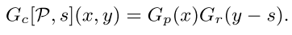

在==flatland==中，G~c~是一个**二维高斯函数**，因此我们可以将图细分为许多线段，并沿着线段对合并后的核进行积分。这就引出了线段上**一维高斯函数**的积分，可以很容易地用==erf(·)==计算。**这说明了选择高斯滤波器的好处**。（其它形式可能会导致没有解析解）。

> erf：在数学中，误差函数（也称之为[高斯误差函数](https://baike.baidu.com/item/高斯误差函数/12674021)，error function or Gauss error function）是一个非基本函数（即不是[初等函数](https://baike.baidu.com/item/初等函数/846442)），其在[概率论](https://baike.baidu.com/item/概率论/829122)、[统计学](https://baike.baidu.com/item/统计学/1175)以及偏[微分](https://baike.baidu.com/item/微分)方程和[半导体物理](https://baike.baidu.com/item/半导体物理/2997510)中都有广泛的应用。

**3D analysis**：我们可以将上述思路拓展到三维空间。**{5}**

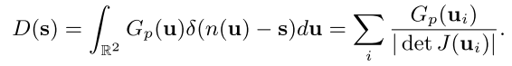

这与平面推导是直接相似的。在==flatland==情况下，**初始一维高度场**在拐点处有奇点，而3维情况下，在==det J(u) = 0==处有奇点，这是一组在**uv空间**中的曲线，其中原高度场的**曲率**在椭圆和双曲之间翻转。这些曲线直接对应我们经常在==P-NDF==可视化中看到的“**折叠**”。

因此，就像在==flatland==中一样，我们引入了**内在粗糙度**。这是通过一个二维高斯核==Gr(s)==来实现的，它与P-NDF卷积：**{6} {7}**

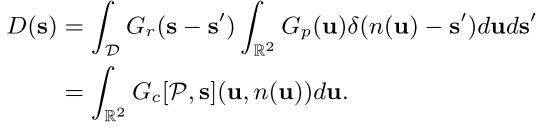

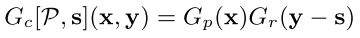

总之，我们观察到==P-NDF D(s)==不是简单地在单个点(方向)上进行评估。通过`Gaussian pixel` 和`roughness kernels`，我们把这个计算看作是一个**积分问题**，它可以通过把**法线**离散映射成小==affine patches==来解决。

> 请注意，高光仍然比Patches小得多。

## 5. Analytic integration

为了数值计算(6)，作者选择将==法线贴图n(u, v)==离散成**三角形**，并在三角形上进行**线性插值**。更准确地说，对**s**和**t**进行线性插值（第三个坐标是隐含的）。

最简单的解决方案是将每个法线贴图==texel==分割成两个三角形，但会导致`artifacts`，所以可以进行进一步的细分。

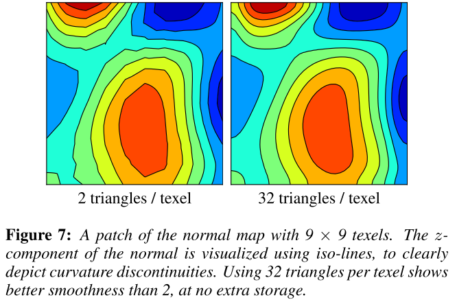

在三角形上进行积分：**{8}**

由于我们对法线进行了**线性插值**，n是一个三角形域上的==affine function==。这使得我们可以将4维**组合的高斯**G~c~折叠成另一些二维高斯G。怎么折叠已经研究了，但这里没有细说。

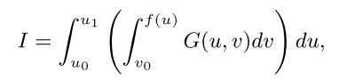

f(u)得到一个三角积分域：

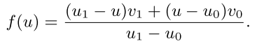

通过进行内积分消去v，并将x代入erf函数，这样就得到了如下积分：

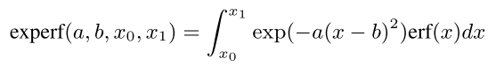

这个积分没有初等解，但我们可以近似它。我们选择在[-3，3]区间上，用6个子区间上的**二次函数**来近似函数==erf(x)==，并且在|x|≥3时为-1和1。因此，问题被分离为以下形式的积分：

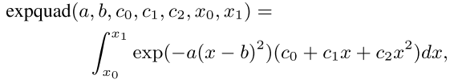

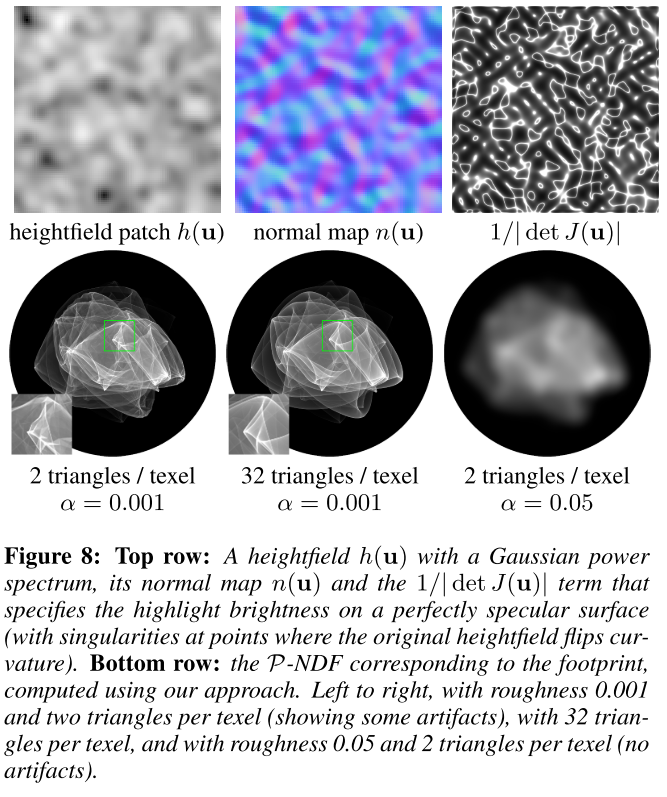

**Comparison against reference**

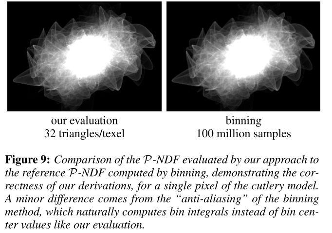

## 6. Implementation

**Hierarchical pruning of texels**：为了提高性能，我们限制==Gaussians==仅在**5σ**之内非零。因此，许多texel都可以被删除，因为G~p~或G~r~在整个texel上都是0。对于G~r~，我们在法线贴图上使用min-max hierarchy。更准确地说，对于每个texel，我们预先计算s(u, v)和t(u, v)的最小值和最大值，并在这些边界上构建一个**四叉树层次结构**。

**Adding other light paths**：在第一次反弹中，使用全法线贴图进行**重要采样**。第二次bounce中，使用全局==P-NDF==近似。

## 7. Results

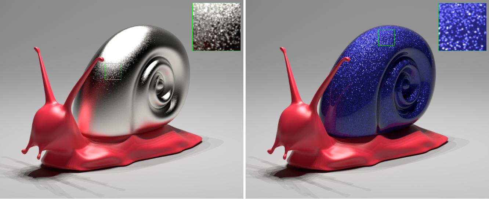

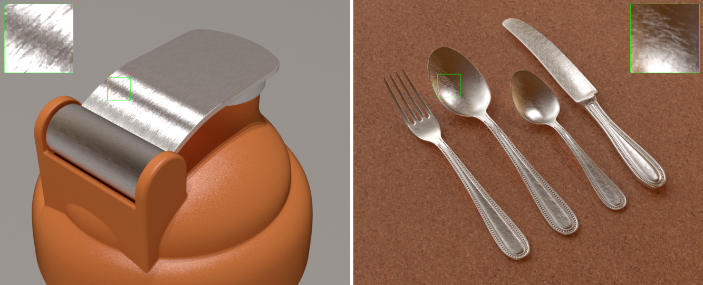

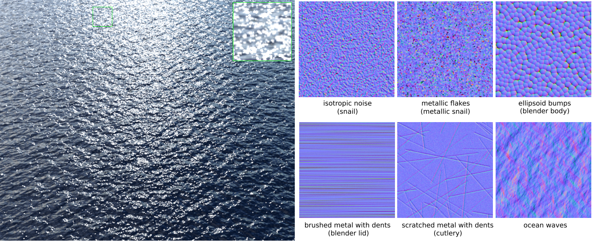

## 8. Conclusion and future work

**高分辨率镜面**与小光源、**复杂法线分布**和闪烁之间的基本关系是以往研究中很少关注的一个重要的材料外观现象。我们解释了传统蒙特卡罗方法在这一方面的失败，**并介绍了一种新的确定性方法来计算潜在的积分**。我们的关键思想是通过评估单个正态分布的==patch==的**真实正态分布函数**，来对通过像素看到的表面==patch==进行渲染处理，这可以在**高斯核**假设下完成。这个问题导致二元高斯函数在三角形上的积分，这可以有效逼近。