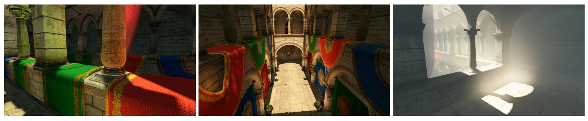
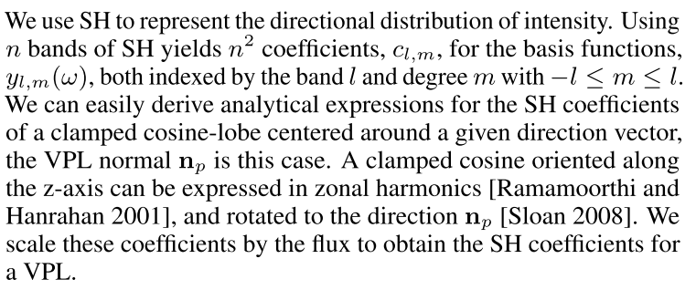
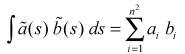
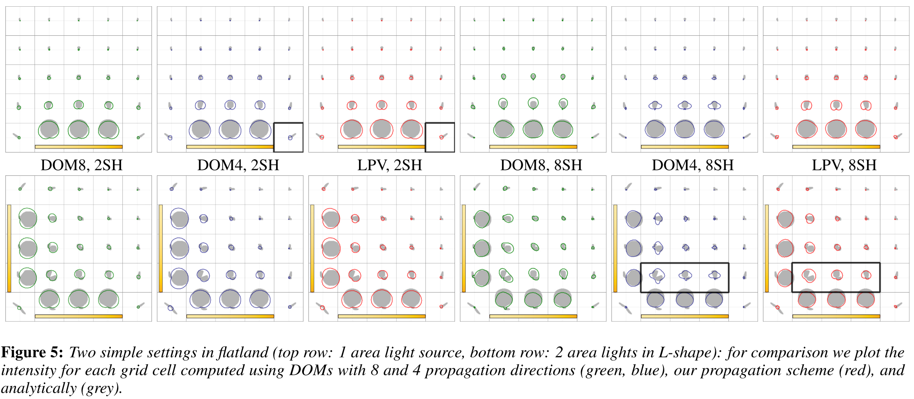
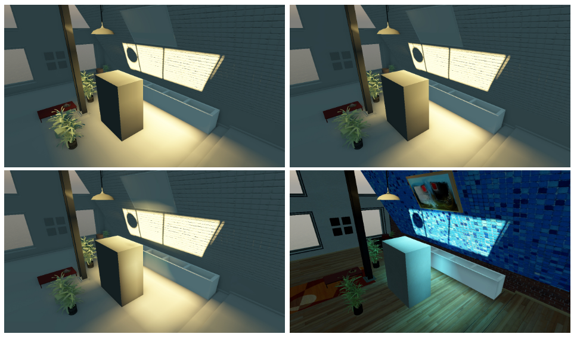
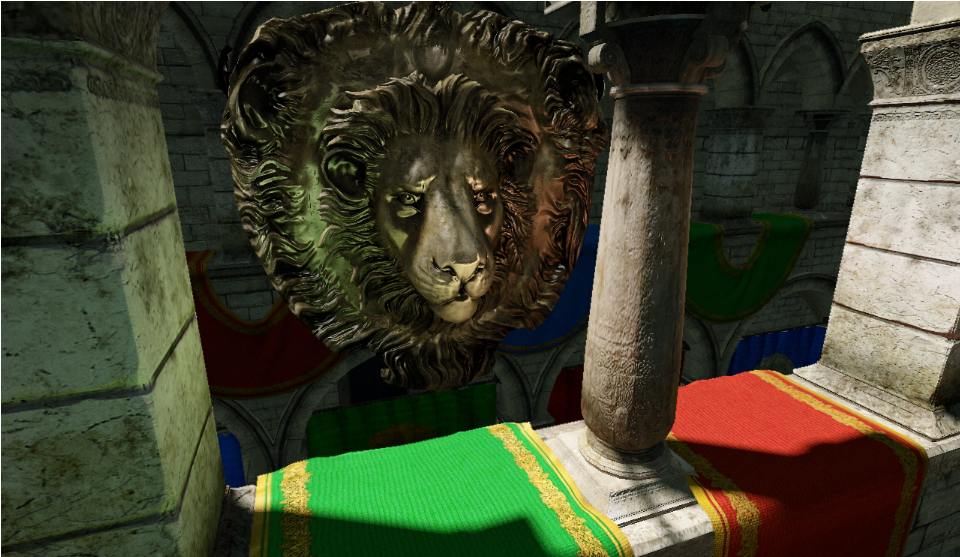

# Cascaded Light Propagation Volumes for Real-Time Indirect Illumination

## 1. 介绍

在本文中，我们提出了一种新的方法，用于为**完全动态的场景**渲染**可信的间接照明**，而这种方法不需要进行预计算。本文方法是对**SIGGRAPH'09课程计划**中提出的基本技术的进一步发展，即使计算时间有限，也能产生可信的、视觉上令人愉悦的结果——没有闪烁，而且具有强时间一致性。

通过使用一个存储**场景中的光线和几何图形**的==网格==来实现这一点。光的方向分布用**低阶球面谐波**表示。我们使用`reflective shadow maps`（==RSM==）对表面进行采样，并使用这些信息在**每一帧中从头初始化网格**。基于这种表示方法，我们开发了一种**数据平行的光线传播方案**，能够快速地、合理地近似**低频直接和间接照明**。我们的**传播方案**（`propagation scheme`）来自==离散坐标法==（`Discrete Ordinates Method`）。来自点光源或小面积光源的直接照明是使用标准技术计算的。本文方法已被整合到**CryENGINE 3**，并通过不同分辨率的嵌套网格来处理**大型全动态场景**。

## 2. Light Propagation Volumes

我们的工作受到了`discrete ordinate methods`和**`Lattice- Boltzmann`照明技术**的启发。与这些方法类似，我们在一个网格上采样的场景中表示照明。这使我们能够使用**简单的、局部的操作**来模拟**光的传输**，而这些操作又可以很容易**并行化**。本文的计算基于存储在网格的每个**单元**（`cell`）的强度。我们的贡献包括：

+ 快速初始化用于光传播的网格，可以为每一帧从头开始计算一个新的传播方案。（着主轴方向传播，与其他方案中的`26`个方向相反）
+ 仍然为**低频照明**提供**良好的结果**。
+ 一个处理大场景的**分层方法**。

在下文中，将描述此方法的**基本步骤**。为此，假设场景被嵌入到一个**固定分辨率的三维网格**中（后文通过引入**级联网格**消除这一限制）。我们有**两个网格**，一个存储了==强度==（造成低频间接照明）；另一个网格存储了==场景几何形状的体积近似值==——当光线穿过场景时用于**模糊遮挡**（`fuzzy blocking`）。这两个网格都存储了一个**球谐函数**，表示为**低频的SH近似值**。

用此技术计算**间接照明**包括**四个后续步骤**：

- 用引起**间接照明和低频直射光**（区域光源）的表面初始化==光传播体==（`LPV`）。
- 利用摄像机的**深度剥离**（`depth peeling`）和多个`RSM`对场景的表面进行采样。这些信息被用来创建一个粗略的**遮挡几何体的体积表示**。
- 从**最初的LPV**开始进行**光的传播**，并积累中间结果（产生最终的**光分布**）。
- 使用**传播的光**照亮**场景中的几何体**。除了直接将`LPV`用于**漫反射照明**外，还提出了对**光泽间接照明**和**参与介质**的合理近似。

### 2.1 LPV Initialization

使用**光传播体（`LPV`）**来计算场景中的低频照明。第一步是将**造成这种光照的表面**转化为**方向性强度表示**，并相应地**初始化LPV**。

初始化是基于这样的想法：即可以按照[Keller 1997]的精神，将**低频照明**转换成**一组虚拟点光源**（`VPLs`）。然而，我们使用的**VPLs数量**明显多于**即时辐射度方法**，因为不单独计算它们的贡献，而只是用它们来**初始化LPV**。

***Indirect* light**

我们首先通过为每个光源渲染`RSM`，来创建间接照明的`VPLs`。`RSM`的每个`texel`可以解释为一个**小面积的光源**——它的方向强度分布（`radiant intensity`）$I_p(w)$，由方向$n_p$和反射通量$\Phi_p$决定：

> $<|>_+$是`clamp dot`。

为了简单起见，在这里省略了**光谱的依赖性**。下一步是将**所有的VPLs**转化为**SH表示**，并将**它们的贡献**存储在`LPV Cell`中。我们可以很容易地确定**VPL所在的单元**。如果**VPL的指向**远离该单元的中心，我们就不想把它的贡献加到这个单元，而是加到**下一个单元**，以避免`self lighting`和阴影。为此，在确定单元之前，将每个`VPL`在其**法线方向**上移动**一半的单元间距**。在该单元中，只考虑**VPL的方向**，忽略它在该单元中的确切位置。

我们用`SH`来表示**强度的方向分布**。

> 

请2注意，**VPL的通量**已经包含了**创建VPL的像素的面积**。因此不需要进一步的缩放，就可以在网格单元中**积累强度**，即**SH近似的系数**。事实上，我们用**`3`个系数向量**来表示**RGB数据**；然而，为了解释方法，我们只显示了**一个组成部分**。

每个`VPL`都以这种方式处理，然后 "**注入 "LPV**中。在确定网格单元后，简单地**累积SH系数**。请注意，这个过程引入了**照明的空间离散性**，并且内在地假定：**导致间接照明的表面**在一个单元内**不会相互遮挡**。

***Low-frequency direct light***

==第二种VPL==是指来自区域灯光、环境贴图和较大的点光源组的**低频直接照明**。同样，我们为这些光源创建一个**密集的采样**——几百到几千个`VPLs`，并以与`RSMs`完全相同的方式将它们**注入`LPV`中**。**来自环境图的VPLs**被注入到**LPV单元的外**层；网格外的其他VPLs被省略。

### 2.2 Scene Geometry Injection

除了**初始强度分布**之外，我们还创建了一个**场景表面的体积表示法**。这种**几何形状的粗略近似**被用来在传播过程中**阻挡光线**，从而计算**间接阴影**。

我们的目标是完全动态的场景，**不需要预计算**，因此，这些信息也必须在运行中创建。为此，==重新使用==存储在**摄像机视图的深度和法线缓冲区**（使用延迟渲染器）以及`RSM`中的==场景表面采样==。如果需要，我们可以通过为**RSMs或摄像机视图**添加`depth-peeling passes`，来收集更多信息。也可以使用**预计算的表面点采样**，类似于[Ritschel等人，2008]，但这意味着**额外的存储和转换成本**。

***Fuzzy occlusion***

每个采样代表一个**小的表面元素**（`surfel`），具有特定的**位置、方向和大小**。我们按照[Sillion 1995]的精神建立**遮挡模型**，并假设可以使用网格单元中`surfel`的==累积阻挡值（`blocking potential`）==作为阻挡<*从某个方向通过该单元的光线的*>概率。通过这个方法，可以渲染出**柔和的阴影**，但是小于网格大小的表面，例如树叶，不会产生阴影。

`surfel`的阻挡量取决于**它的大小**，以及法线与光线方向之间的**余弦**。因此，在网格大小为$s$的单元中，面积为$A_s$、法线为$n_s$的单个`surfel`的==遮挡概率==为$B(w)=A_ss^{-2}<\vec{n}_s|w>_+$。

***Injection***

与**VPL注入**类似，我们将`blocking potential`的**SH投影**累积到**几何体（`GV`）**中（一个单元内的表面样本的相互遮挡不能被解决，后续解决）。`GV`的分辨率与`LPV`相同，但`LPV`**移了半个单元**，这样**它的单元中心就位于LPV单元的角上**，以便在**光传播过程**中实现更好的**`blocking potential`插值**。

一个表面可能在**相机视图**和`RSM`中被采样，我们需要确保其**遮挡不会被多次累积**。为此，**每个缓冲区**被累积到**一个单独的`GV`**中，在注入后，使用**SH-vectors上的最大操作**将`GV`合并成一个。作为一种优化，还可以重复使用**以前帧的表面样本**（对于**静态几何**），这可以减少**当前视图**或`RSMs`没有捕获到表面的情况。

### 2.3 Propagation Scheme

***Intensity propagation***

**第一个迭代步骤**的输入是：**来自注入阶段的初始`LPV`**；随后的迭代将**前一个迭代的`LPV`**作为输入。每个单元将**强度**（`intensity`）存储为一个`SH-vector`，然后`light`沿轴传播到它的`6`个邻居（图`2`左）。在下文中，只描述了**从源到一个目标单元的传播**——沿其他方向的传播是以类似方式计算的。

把源单元的`intensity`的**SH-近似值**表示为：$I(w)\approx \sum_{l,m}{c_{l,m}y_{l,m}(w)}$。接下来，计算到相邻目标单元的**通量**。为此，我们定义一个面 $f$ 相对于**源单元中心**的可见度函数：$V(w)$。如果**从源单元中心出发的射线**沿$w$方向与该面相交，则$V(w)=1$，否则$V(w)=0$。 **图`2`中**显示了目标单元**顶部面**的$V(w)$。==到达该面的总通量==可以通过**方向积分**来计算：$\Phi_f=\int_{\Omega}{I(w)V(w)} dw$。

**面的可见度函数**可以投射到`SH`中，产生一个==系数向量== $v_{l,m}$，$V(w)\approx \sum_{l,m}{v_{l,m}y_{l,m}(w)}$。然后，使用**SH向量** $c_{l,m}$和$v_{l,m}$的点积就可以很容易地计算出**强度乘以可见度的积分**。**“传输向量“** $v_{l,m}$可以预计算，并存储在**传播方案**（`propagation scheme`）中。但问题是，对于**低阶SH近似**，积分值可能非常不准确，因此我们建议对这种情况采用==不同的策略==：不使用**传输向量**，而是计算**目标单元每个面的实体角** $\Delta{w_f}=\int_{\Omega}{V(w)dw}$，并确定可见度锥体的中心方向 $w_c$。然后，**到达该面的通量**被计算为 $\Phi_f=\Delta{w_f}/(4\cdot \pi)\cdot I(w_c)$ —— 实际上，这意味着将$w_c$方向的强度作为**平均强度**。

> **Projection and Reconstruction**：因为**SH基**是正交的，所以**定义在S上的标量函数**$f$可以通过如下积分:arrow_down:，**投影**`Projection`得到系数：:arrow_down:
> $$
> f_l^m=\int{f(s)y_l^m(s)\mathrm{d}s}
> $$
> 这些系数提供了n阶**重建**`Reconstruction`函数：:arrow_down:
> $$
> \overline{f}(s)=\sum_{l=0}^{n-1}\sum_{m=-l}^{l}{f_l^my_l^m(s)}
> $$
> ==低频信号（低频光）可以仅用少数几个SH系数进行重建，而高频光则是频带无限==。
>
> **SH基的正交性**提供了一个**有用的性质**，即给定任意两个球上的函数$a$和$b$，它们的投影满足：:star:
>
> 
>
> 换句话说，==对带限函数的乘积进行积分，可将其简化为投影系数的点积和==。

***Reprojection***

利用这种传播方式，我们得到**目标单元每个面的入射光通量**，然后将其转化为**出射强度**，再进行**后续的传播**。为此，我们计算一个新的**点光源强度**（具有与`VPLs`相同的发射特性），它位于**目标单元的中心**，指向该面，并造成与收到的通量完全相同的强度。也就是说，`face`的通量，$\Phi_f$，等于**点光源的总发射通量**：$\Phi_f=\int_{\Omega}{\Phi_l<n_l,w>_+dw}$，然后 $\Phi_l=\Phi_f/\pi$。与**光注入阶段**类似，用**clamp余弦**缩放通量：$I_l(w)=\Phi_f<n_l,w>_+$，并累积**SH系数**。对于位于单元中心的新点光，在目标单元进行**下一次迭代**。

**传播**（`propagation`）是针对每个源单元和其相邻单元的每个面计算的（**图2**中显示为黄色）。请注意，**传播与重投影**一起引入了**空间和方向上的离散性**——这是所有**基于网格的方法**所共有的。

***Blocking***

还需要在`propagation step`中对**由于场景几何形状造成的光线遮挡**进行积分。在**几何注入阶段**，我们从场景中的表面计算出`GV`，它存储了**各向异性的遮挡概率**，正是为了这个目的。相对于`LPV`，`GV`移动了一半单元格。这样一来，`GV`的单元中心就位于LPV单元的角上。每当从**源单元**传播到**目的单元**时，在**传播面的中心**对`GV`的**SH系数**进行**双线性插值**，并计算传播方向的**遮挡度**。注意，在注入后的第一个传播步骤中不考虑这种遮挡，以防止**自遮挡**。

***Iterations***

每次迭代后，`LPV`中**传播后的结果**被累积到**一个单独的三维网格**中：**中间结果的总和**就是场景中的**最终光分布**。==所需的迭代次数取决于网格的分辨率==。与[Geist等人，2004]类似，我们使用**LPV迭代的最长边的2倍**作为上述方案的**启发式方法**。第`3`节介绍的**多分辨率方案**以较少的迭代产生了类似的结果。

### 2.4 Using the Light Propagation Volume for Rendering

**迭代的累积结果**代表了**场景中的光分布**。在最简单的形式下，通过对SH系数的**三线性插值**（`tri-linearly interpolated`）来查询强度。然后计算**表面负向的强度函数**，类似于`irradiance volumes`。然而，由于存储了强度，需要将其转换为**入射辐射度**（`incident radiance`），并且由于**空间离散性**，我们假设**单元中心**与**被照表面**之间的距离是**网格大小`s`的一半**。

**粗略的体积**与**低频近似照明**搭配的一个问题是**自发光**和`light-bleeding`。我们发现，基于强度分布的方向导数的==抑制因子==可以大大减少这些伪影。对于一个位置`x`和法线`n`的表面，确定**三线性插值的SH系数**$c_{l,m}$和**法线方向的方向导数** $\nabla_nc_{l,m}$（通过**差分**计算）。当导数很大，并且$c_{l,m}$和 $\nabla_nc_{l,m}$有偏差时，在计算光照之前对$c_{l,m}$进行**抑制**`dampen`（图`3`显示了两个这样的典型情况）。

## 3. Cascaded Light Propagation Volumes

使用**单个LPV**来计算**整个场景中的光线传播**将需要**一个非常大的网格**。相反，我们使用**一组随观察者移动的嵌套网格**（图`4`），类似于`geometry clipmaps` 。==这些网格并不完全以观看者为中心，而是向观看者的方向移动。==这为靠近摄像机的场景部分提供了**高空间分辨率**，同时也覆盖了分辨率较低的远处部分。**嵌套网格方法**能够使用**较小的网格**（通常为$32^3$个单元），从而减少**所需的传播迭代次数**。

### 3.1 Nested Grid Propagation

和之前所述的方法基本一致。`VPLs`和**几何体**被注入**嵌套网格**中。然而，如果一个物体的尺寸（其边界框确定）小于**网格的单元尺寸**，我们通过**不渲染它到RSM**，而**不从这个物体中创建VPLs**。这是为了防止**锯齿伪影**。

**光的传播**是对所有网格独立计算的。请注意，**细网格中的VPLs也被注入到较粗的网格中**（图`4`中的绿色单元）。这确保了**来自附近物体的间接光**能够渗入到**场景的远处**。当使用`LPVs`进行照明时，**在相应的位置上查找最细的网格**。在网格的边界，在两级网格之间插值创造一个**平滑的过渡**。

### 3.2 Coherent Solutions in Dynamic Scenes

在物体、摄像机和光线移动的情况下提供一个**稳定的解决方案**对于**交互式应用**非常重要。**光线传播不一致**的主要原因是==LPV的空间离散性==。To prevent this, we snap the cascaded LPVs ——that move with the camera —— to multiples of the grid size. By this “one-cell grid snapping” we maintain a consistent VPL and geometry injection under camera movement.

不一致（导致闪烁）的第二个来源：**对发光和反射表面的采样**。由于可以负担得起**对这些表面的过度采样**和注入大量的VPL（几十万），**所以LPV中的发光体有很高的冗余度**。与其他方法相比，这种冗余度允许对**移动的、复杂的、详细的物体**进行间接照明的渲染，也不会出现闪烁。

然而，**小的移动物体**（低于网格单元的尺寸）会造成**不稳定的间接照明**。在这种情况下，**LPVs的空间离散性**变得很明显。作为一个临时的解决方案，我们淡化了这些物体的`VPLs`。这个解决方案是可以容忍的，因为较低的网格分辨率离摄像机较远。

## 4. Qualitative Evaluation of the Propagation

ToDo

## 5. Result

