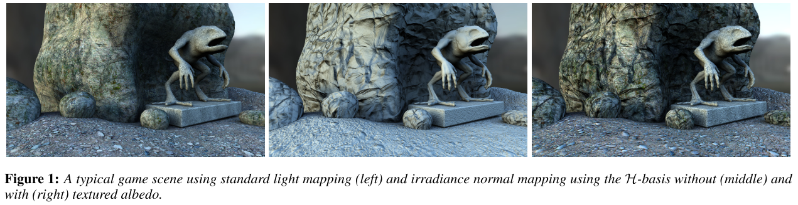

# Efficient Irradiance Normal Mapping

*The 2010 ACM SIGGRAPH Symposium on Interactive 3D Graphics and Games*

> 推荐使用主题Barfi

==辐照度法线映射==是一种将两种流行技术，`light mapping`和`normal mapping`，结合起来的方法，在半条命2中得到了充分使用。这种组合允许在表面上使用低分辨率的**光缓存**`light caching`，只有几个系数，这些系数由法线图评估，来渲染照明的**空间高频变化**。尽管有些专门用于此目的的基，如：Half-Life 2 basis、高阶的球谐函数等。然而，一个完整的球基是不需要的，因为辐照度存储在场景的表面上，需要的是半球基。

为了有效地表示辐照度信号，==本文提出了一种新的多项式、半球形正交基函数集==，专门用于在半球形上，携带`carry`**方向辐照度**`directional irradiance `信号，并且**优化**系数的数量。为了创造必要的辐照度信号，本文使用**SH**作为中间基——因为它们的**快速滤波**能力。

## 1. Introduction

`light mapping`和`normal mapping`是商业游戏中使用最为成功的两个技术，因为它们仅要求少量资源，却对视觉效果有极大的提升。光照映射`light mapping`在场景的稀疏采样点上，存储全局低频光照。结合这两种方法的**问题**是：`light maps`只存储一个法线方向（基本表面法线）的光照信息，因此不能使用法线贴图中法线来评估。为了**解决这个问题**，==必须计算出所有法线贴图方向的辐照度（即在半球上对入射辐射率进行积分），并存储在表面的每个照明采样点上==。

由于辐照度信号在**方向性上**属于低频，因此**低阶基函数**就可以很好的表示。但之前的方法采用的基都是**球基**，这是种浪费，因为只用到法线半球。

在本文中，作者提出了一种新的半球基，称为==`H_basis`，h基==，用来表示法线半球上的辐照度信号。其**主要优点**是：使用同等数量的参数的情况下，保留了SH的优点，并且比其它半球基误差更小。

- 是多项式，能快速求解
- 可以通过一个稀疏矩阵，转到SH上
- 它是标准正交的，因此任何一般函数都可以很容易投影到基中，而不需要最小二乘拟合。
- 它保证了系数的线性插值结果，是对基的评估`evaluation`进行线性插值，如果辐照度被稀疏存储，如在每个顶点基础上或非常小的系数图上，这一点尤为重要。

## 2. Previous Work

