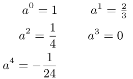

# Efficient Irradiance Normal Mapping

*The 2010 ACM SIGGRAPH Symposium on Interactive 3D Graphics and Games*

> 推荐使用主题Barfi

==辐照度法线映射==是一种将两种流行技术，`light mapping`和`normal mapping`，结合起来的方法，在半条命2中得到了充分使用。这种组合允许在表面上使用低分辨率的**光缓存**`light caching`，只有几个系数，这些系数由法线图评估，来渲染照明的**空间高频变化**。尽管有些专门用于此目的的基，如：Half-Life 2 basis、高阶的球谐函数等。然而，一个完整的球基是不需要的，因为辐照度存储在场景的表面上，需要的是半球基。

为了有效地表示辐照度信号，==本文提出了一种新的多项式、半球形正交基函数集==，专门用于在半球形上，携带`carry`**方向辐照度**`directional irradiance `信号，并且**优化**系数的数量。为了创造必要的辐照度信号，本文使用**SH**作为中间基——因为它们的**快速滤波**能力。

## 1. Introduction

`light mapping`和`normal mapping`是商业游戏中使用最为成功的两个技术，因为它们仅要求少量资源，却对视觉效果有极大的提升。光照映射`light mapping`在场景的稀疏采样点上，存储全局低频光照。结合这两种方法的**问题**是：`light maps`只存储一个法线方向（基本表面法线）的光照信息，因此不能使用法线贴图中法线来评估。为了**解决这个问题**，==必须计算出所有法线贴图方向的辐照度（即在半球上对入射辐射率进行积分），并存储在表面的每个照明采样点上==。

由于辐照度信号在**方向性上**属于低频，因此**低阶基函数**就可以很好的表示。但之前的方法采用的基都是**球基**，这是种浪费，因为只用到法线半球。

在本文中，作者提出了一种新的半球基，称为==`H_basis`，h基==，用来表示法线半球上的辐照度信号。其**主要优点**是：使用同等数量的参数的情况下，保留了SH的优点，并且比其它半球基误差更小。

- 是多项式，能快速求解
- 可以通过一个稀疏矩阵，转到SH上
- 它是标准正交的，因此任何一般函数都可以很容易投影到基中，而不需要最小二乘拟合。
- 它保证了系数的线性插值结果，是对基的评估`evaluation`进行线性插值，如果辐照度被稀疏存储，如在每个顶点基础上或非常小的系数图上，这一点尤为重要。

## 2. Previous Work

几种基系统已被提出，来表示一般的半球函数，以及专门用于辐照度法向映射。

最终，精度与系数数量的比值，决定了基函数集的**有效性**。

###  2.1 Half-Life 2 Basis and Directional Occlusion

`Half-Life 2`函数集，在正向的单位半球上是正交的，由三个余弦波瓣$h_i$组成:arrow_down:：**{1}**

计算方式如下:arrow_down:：**{2}**

其中，$h_i$是基向量，$c_i$是对应的系数，$n$是评估方向。实际上，由于线性，==任意三个相互正交的向量都定义了一个等价的基==，尽管给定的配置会导致大部分系数是正值，如果系数以8位颜色保存，则可以规避**范围压缩**`range compression`的问题。

将x视为常量，则公式可简化为:arrow_down:：**{3}**

这个公式也称为**方向遮挡**`Directional Occlusion`。不幸的是，如果表示一个三色信号，每个颜色都需要一个$o$。然而，方向遮挡`DO`表明，**半条命2基**完全等价于方向遮挡，并且两个基都能传输一个一般的**余弦波瓣**。

### 2.2 Hemispherical Harmonics and Makhotkin Basis

半球谐基和`Makhotkin`基都是半球正交基。构造原理：映射球面在$(0,0,-1)$处的负极到半球的边界，在不破坏其正交性的情况下，使用**shift**操作，将球面标准正交函数**压缩到**半球函数。shift操作就是用$2\cos{\theta}-1$替代$\cos{\theta}$。

`Makhotkin`基的雅可比多项式也要进行`shift`操作。

缺点：计算昂贵；边界处效果不佳（因为这两个基在半球的边界处，其值是固定的，计算得到的颜色也是固定的）。

### 2.3 Zernike Basis

特点：也包含开根号和除法，计算不菲；参数较少；边界处非固定，所以不会有边界问题。

## 3. Creating the Directional Irradiance

其法线为$n$的表面点$x$处，其辐照度定义如下：**{4}**

信号$E(x,n)$的表示是存储在稀疏的采样点$x$处，例如：物体**顶点**处，或低分辨率纹理贴图的`texel`中，

> The signal is defined for all normal vectors n in the upper hemisphere of the point x

与`light mapping`类似，我们**首先**在预计算步骤中，计算辐射率`radiance`，然后得出物体表面辐照度。==任何计算辐射率的方法==，如阴影映射、光子映射或路径跟踪都可以使用。

给定辐射率$L$，得到$E(x,n)$相当于用一个**漫反射核**对$L$进行**过滤**，但在欧几里得坐标或球坐标下，这种操作是昂贵的（卷积以及大规模的采样点）。因此，这里使用SH基进行计算，且只需要三个频带（9个参数），就可以得到不错的拟合结果。将辐射率信号投影到SH基上，得到系数$S_m^l$，有如下常见公式：**{5}**

关于漫反射核，可以使用不同的，来消除潜在的振铃现象。一开始，我还以为是直接点积，没有注意到：拟合使用的是用核进行卷积，所以，还需要一个缩放因子，如下：**{6}**

> :star:关于这个缩放因子，论文这里感觉没讲清楚 。考虑过滤，公式4中的积分，变成了卷积，直接计算不行，太贵了，所以左右两边都投影到SH上，此时，根据SH的卷积投影性质，对于每个系数，我们得到三个量的点乘：所求函数的SH系数、漫反射核的SH系数（按频带不变，$h^l_0$）、缩放因子（按频带不变），所以公式7的$s^l_m$，应该是调整过后的：$s_m^l=a*s^l_m*h_0^l$。最后求辐射度，就是公式7了。

此时，辐照度可以定义如下：**{7}**

这是之前的方法，缺点也说过了。

## 4. H-Basis

球谐函数基如此牛逼，所以作者在设计新的半球基时，尽量向其靠拢。同时，避免任何非多项式基（考虑实时消耗，毕竟要在在片元着色器中使用，而**GPU不善于开根号等计算**）。

本文的目标是在<u>多项式希尔伯特空间</u>`polynomial Hilbert space`选择一组半球正交基，来最好的表达半球辐照度信号。首先，半球基依然保持了**正交性**（依旧对于Z=0平面来说，是对称的），观察下图左:arrow_down:，**注意到**：在球面谐波的欧氏表示中，这些函数都不明确依赖于z值。

对于维度，和半球基进行一样的`shift`操作，所以H基的$H_0^1$和半球基的一样。将所有函数**归一化**到半球上，可得到如下基函数：:arrow_down:

只使用前4个系数对应于常数基和线性基函数。仔细观察$H^3$，为什么有个**红色托盘**？因为shift，不是截断，而是压缩，下面那个球被压缩成了这样（其它也有，只是被上半部分固有的体积盖住了）。**更有意思的是**，$Y_0^2$也被压缩成了$H^3$，==这解释了为什么较少的函数可以提供更精确的拟合==，

### 4.1 Expansion into the H-Basis

然后，回到第三节的最后，为了将辐照度信号从SH基变换到H基，只需要对SH系数向量（频带为2，9个系数）乘以如下矩阵：

$$
H=T_h*SH
$$
当SH用频带4进行表示（l=3的系数为0），则也可以投影到H基上（见附录A），但实际没必要。

### 4.2 Run-Time Evaluation

到目前为之，我们已经在切线空间创建了方向辐照度，系数可以存储在顶点中，通过顶点着色器传入片元着色器，也可以通过纹理，直接在片元着色器中读取，计算公式如下：

然后，$E_h$可以乘以材质系数，或读取纹理得到的`albedo`。

### 4.3 Directional Irradiance Tangent Space

使用纹理贴图时，第二组纹理坐标，被用来访问系数纹理。利用第二个纹理坐标集的切线空间（使用该纹理坐标集的UV方向计算）来表示辐照度，==会导致法线映射与系数映射位于不同的切线空间==。

幸运的是，==这两个纹理坐标集共享相同的顶点和法线以及渲染管道中的插值==。在辐照度的预计算过程中，只需在辐照度纹理坐标中使用法线图切线空间的切线和副法线，就可以定义一个使用辐照度纹理坐标集的切线空间，该空间在对象空间中与法线图切线空间完全对齐。查找到的法线可以直接用于计算，而不需要任何额外的数据或变换。

实际上，辐照度纹理坐标集只用于定义计算和缓存辐照度的表面点，而法线图切线空间则定义了两个空间的切线和位切线，从而使辐照度信号相对于查找的法线正确对齐。

> 这节没看懂啥意思？如果是如下我理解的意思，感觉真是，不讲人话？
>
> 其实，很简单，因为我们在预计算时，都是在物体的切线空间进行计算，但问题是，此时的物体没有考虑法线贴图，所以其切线空间是不对的，因此说两个贴图处于不同的切线空间内。解决方法也很简单，就是在预计算时，读入法线贴图的切线和副法线，获得正确的切线空间，就没问题了。
>
> 还是理解不够，个人感觉有点脱了裤子放屁的感觉。

## 5. Error Analysis and Results

对于误差度量，我们使用积分均方误差`MSE`：**{16}**

## 6. Conclusion and Future Work

不能直接推导，需要SH作为中间基，说明在半球上有一个未被发现的多项式正交基，它直接等同于球面谐波，分享了它的大部分属性。

## Appendix A Transformation

