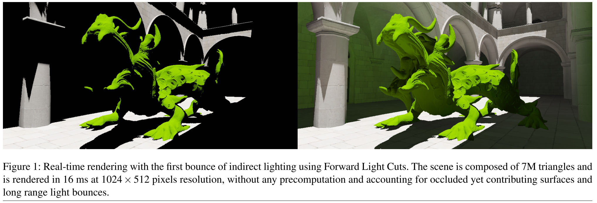

# Forward Light Cuts：A Scalable Approach to Real-Time Global Illumination

## 1. 介绍

对于`VPLs`这类方法来说，涉及大型物体的全动态场景至少有两个限制：

- 首先，**缓存结构**需要在每一帧重新计算——在**完全动态**条件下，重新计算整个缓存**特别昂贵**。
- 其次，**最初的VPLs集可能太大**，无法应对**实时的限制**，特别是当它们的生成不能在一段时间内摊销。

在本文中，作者采用了一种==**前瞻性的策略**==，来解决这些问题。

1. 首先，作者观察到**场景几何**本身可以触发**VPL的生成过程**，并提出了一个GPU管道，该管道使用**几何着色器**和**`tesselator unit`单元**来生成一组**初始的VPL**（第`4`节）——在场景的几何形状**过于粗糙**，而无法准确捕获辐射度的地方对其**进行细化**，并在几何分布**过于密集**的地方对其**进行简化**。
2. 其次，作者提出了一个==随机聚类方案==，将所得到的**VPLs子集**与有界的**影响区域**（**辐射度代表**）联系起来。这产生了一个==间接照明的多尺度表示==，而不需要**明确的树状结构**。

## 2. 算法前瞻

算法如图2所示，具有典型的**基于VPL的管道结构**，由三个主要阶段组成：VPL的生成，间接光缓存和VPL的照明。作者的贡献主要集中在**VPL的生成**及其在**照明过程中的使用**，可以总结为以下几点：

- Todo
- ...

## 3. VPLs生成

本文算法只需要对几何体进行**一次绘制**，使其能够用于**具有高三角面片的场景**。为此，作者将`regular triangles`与`divergent ones`区分开来——`divergent ones`：即表面积 ${A(t_i)}$ 大于某个阈值 $S_0$ 的三角形 ${t_i}$ 的集合。设定：

这是一个启发式的方法，目的是：大概有 $N_{avg}$ 栈`VPLs`来点亮此像素，而且距离此像素至少 $D_{near}$。$R_{scene}$为场景半径，通常设置：$D_{near}=0.2\times R_{scene} $，$N_{avg}$ 在`64`和`1024`之间——取决于**速度和质量的权衡**。 作者在第6节中讨论了如何处理`divergent triangles`，在本节的其余部分假设**三角形是规则的**。

### 3.1 Triangle decimation

**小三角形**对**漫反射间接照明**的贡献很小，作者倾向于在管道中**移除它们**。然而，不能直接丢弃每一个小于给定阈值的三角形，因为**小三角形==群==**可能对**到达远处的光传输**有重要影响。作者通过采用**随机抽取的方法**，来解决这个问题：对每个三角形计算一个介于0和1之间的随机值 $u_{t_i}$，来保留`heavily tesselated geometry`的贡献。如果$A(t_i)>u_{t_i}S_0$，则保留该三角形。因为每个三角形都被假定为是`regular`，三角形被保留的概率可以归结为：

其中，$L$ 表示**三角形集合（全集）**，$L^*$表示**保留三角形的集合**。这意味着一个三角形越小，它被丢弃的机会就越大。同时，这种划分转化为整个场景表面的**样本的均匀分布**，这样**幸存三角形数量的期望值**为 $E[N_{sample}]=\frac{A_{Scene}}{S_0}$，其中 $A_{Scene}$ 为**总场景面积**。

### 3.2 Triangle multiscale partitioning

一旦小三角形被丢弃，将剩余的三角形（$L^*$）随机分配到一个分区（$L^0,...,L^N$）中——当`k`越来越接近`0`时，$L^k$ 的数量越来越多。为此，作者引入了 $N+1$ 个增加值的序列 $\{S_0<\dots<S_N\}$，代表**所需的VPL分区**。通过进一步定义`Alg.1`：

从抽取策略中出现了代表性场景三角形的**多尺度分区**（图`3`），一个三角形位于**子集** $L^k$ 中的==概率==为：

> 请注意，根据这个定义，如果一个三角形的面积大于$S_N$，就被认为是发散的。
>

在这种情况下，这个阶段的关键属性是：==我们不产生、维护或管理任何一种明确的层次结构==。这显然有利于**并行执行**，然而，这也意味着位于**特定子集的特定三角形**并没有捕捉到**更精细的三角形所携带的信息**。这个问题将在第`5`节讨论并部分解决。

## 4. Lighting with VPLs

在多光照框架中，法线为$n_x$的点的**间接出射辐射度** $L(x,n_x)$是由 $L^{ML}(x,n_x)$ 近似的——它被定义为来自一组`VPLs`的**辐射度的离散和**：

其中，$H$ 代表从$t_i$开始向接收器`x`方向的==入射辐射转移函数==。对于具有反照率 $\rho_x$ 的**漫反射接收器**来说，这个函数被定义为：

其中 $\overline{u}=\frac{u^{\rightarrow}}{||u^{\rightarrow}||}$ ， $<u^{\rightarrow},v^{\rightarrow}>^+=max(0,<u^{\rightarrow},v^{\rightarrow}>)$，$L(t_i,y_i^-x)$是以 $y_i \in t_i$ 为中心的`VPL`的、射向$y_i^-x$的**辐射度**，$d_i=max(\varepsilon,||x^{\rightarrow}y_i||)$是 $y_i$ 和 $x$ 之间的距离。作者用以下**`VPL`出射辐射度表达式**来模拟**第一次漫反射**：

$\frac{3}{2\pi}$ 是为了确保==能量守恒==，辐射度$B(t_i)$和辐照度$E(t_i)$的关系为：

### 4.1 Approximating VPL lighting

作者建议通过总结**VPLs子集的贡献**，来近似计算 $L^{ML}(x,n_x)$。因此，作者定义$K(x,n^{\rightarrow}_x)$为 $L^{ML}(x,n_x)$的 近似：

$F^k(t_i,x)$是位置`x`、发射器$t_i$和索引`k`的未知函数。通过计算 $K(x,n^{\rightarrow}_x)$ 在每个可能的分区（$L^0,...,L^N$）集合上的**期望值**，可以得到：

其中$1_{[t_i \in L^k]}$是**指标函数**，如果$t_i \in L^k$则等于`1`，否则等于`0`。如果想让$K(x,n^{\rightarrow}_x)$代表入射辐射度$L^{ML}(x,n_x)$的**无偏估计**，必须在$F^k$上验证以下函数方程：

根据==VPL分区策略==（见公式`3`），作者将 $F^k$ 定义为：

它将**无偏条件（公式9）**转化为一个**统一的分割问题**，寻求一组函数 $(f^k)_k$，从而使：

### 4.2 Choice of partition of unity

受**PPGI树形切割策略**的启发，作者引入了一个以 $h>0$ 为特征的**嵌套球族** $B_h(t_i)$。对于给定的 $h$，$B_h(t_i)$代表**点集合**（对VPL的贡献是重要的）。这意味着对于$B_h(t_i)$之外的每个点`x`，无论接收器的方向如何，函数 $H(t_i,x,n^{\rightarrow}_x)$ 的值都小于 $h$ : 

此外，$H(t_i,x,n^{\rightarrow}_x)$（公式`5`）在接收者正面朝向发射者时是最大的，即 $n^{\rightarrow}=x^-y_i$。因此：

因此，由于$D(h)$不依赖于`x`，$(B_h(t_i))_{h\in R^*}$ 是一个**嵌套球族**——中心位于线$(y_i,n_i)$上。作者规定：三维单位分区 $(f^k)_k$ 在作为$B_h(t_i)$的前沿球体上是**恒定的**。然后，通过定义以下从$R^3$到$R$的映射：

由于 $(f^k)_k$ 将在渲染过程中被用作**拼接函数**，作者的目标是使它们**尽可能平滑**，同时保持它们**易于计算**，并将它们定义为以下一组**连续片状仿射函数**：

其中 $\{D_k\}$ 允许指定每个级别的**影响距离**。

### 4.3 Parameters setting

为了模仿传统的**用于光场的层次表征**，作者用**子集大小的期望值**生成分区，该期望值以**几何级数**递减。此外，虽然$S_k$可以被理解为位于$L^k$层的三角形的平均表面，但作者通过以下方式定义它们：

其中$\mu>1$是一个用户定义的实数。根据**场景和层次的数量**，通常将$\mu$设置在`1.4`到`5`之间。此外，仍然通过模仿**分层方法**，作者建议定义**`VPLs`的影响距离**，使空间中的每个点的**可以到达的VPLs的数量**是可控的，这可以被转化为：

