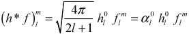

# Precomputed Radiance Transfer for Real-Time Rendering in Dynamic, Low-Frequency Lighting Environments

本文提出一种新的实时方法，用于在低频照明环境中渲染漫反射和光泽`Glossy`物体，以捕捉软阴影、相互反射`interreflections`和焦散。作为==预处理==，在物体表面创建函数，==用来将任意的低频入射光转换为传输光==，包括自阴影和相互反射等全局效应。

在实时程序中，动态的局部照明是通过==在对象附近采样==来处理的（每一帧）。照明和传递函数用低阶球面谐波表示，这避免了锯齿，并通过9到25个向量的点积，来拟合渲染积分——`Glossy`材质通过矩阵而不是向量，来进行处理。

我们进一步介绍了从一个**经过预处理的动态光照环境**，到**空间中邻近点**的辐射传输函数。这些函数允许将刚性移动物体的**柔和阴影和焦散**，投射到任意动态接收器上。

> 经过预处理的动态光照环境$\rightarrow$空间中邻近点

> 推荐使用主题`Barfi`进行观看

## 1. Introduction

实时产生真实感的==三个难点==：BRDF complexity、light integration、light transport complexity。进行简化的几个**常见思路**：

- 扩展BRDF格式，并将入射光表示成几个点或方向光；
- 采样辐射度`radiance`，并用不同的核进行预卷积——但卷积基于假设：入射光没有被散射或遮挡；
- 最后，还有一些技术可以用来模拟更复杂的光传输，尤其是阴影。

但积分成为问题，也就不能处理大区域光源。==我们的目标是更好地考虑光积分和光传输的复杂性==，所付出的妥协是：使用低序的球谐函数来表示低频环境光。==主要的想法是：一个物体怎样散射光到它自己或它的邻近空间==。

为了描述我们的技术，假设：有一个漫反射凸物体，被一个无限远的环境贴图照亮。这个物体对环境贴图的渲染响应，可以视作一个`transfer function`，将入射光映射到出射光，在这种情况下简单地执行余弦加权积分。

本文的方法是：为给定对象计算**昂贵光传输**所需的**复杂传递函数**。最终的传递函数其形式为密集的向量组或矩阵。通过在**线性基**（SH）上表示入射辐射率和传递函数，利用光传输的线性，将光积分**转化为**：两者的系数`coefficient`矢量之间的简单点积（漫反射接收者），或通过一个传递矩阵（`Glossy`接收者），对照明系数矢量进行线性变换。

与MC方法不同，本文方法在运行时，无论有多少或多大的光源，其计算保持不变。事实上，此方法依赖于大规模的平滑照明，来限制SH系数的数量。

除了自传递之外，本文还将该技术推广到：从刚体到其邻近空间的传递，允许在动态接收器上投射**软阴影、光滑反射和焦散**，见图7:arrow_down:

**具体实现前瞻**：入射光首先投影到SH基上，然后乘以转移向量（漫反射）或矩阵（Glossy）。而对于Glossy对象，还要将结果和BRDF进行卷积，最后在视图依赖的反射方向R上进行计算，以产生最终的渲染结果。:arrow_down:

## 2. Related Work

没什么值得注意的。

### 3. Review of Spherical Harmonics

==球谐函数==在球$S$上定义了一个**正交基**。使用如下参数化：:arrow_down:
$$
s=(x,y,z)=(\sin{\theta}\cos(\phi),\sin{\theta}\cos{\phi},\cos{\phi})
$$
基函数定义为：:arrow_down:
$$
Y_l^m(\theta,\phi)=K_l^me^{im\phi}P_l^{|m|}(\cos{\theta}),l\in N，-l\leq m\leq l
$$
其中，$P_l^{|m|}$是相关的勒让德多项式，$K_l^m$是归一化常数：:arrow_down:
$$
K_l^m=\sqrt{\frac{(2l+1)}{4\pi}\frac{(l-|m|)!}{(l+|m|)!}}
$$
上述定义形成了一个<u>复基</u>`complex basis`，实值基是由简单的变换给出的：:arrow_down:

$l$的低值（称为<u>频带指数</u>`band index`）表示球上的低频基函数，频带$l$的基函数在x、y、z上化为$l$阶多项式。可以用简单的递推公式进行计算。

**Projection and Reconstruction**：因为**SH基**是正交的，所以**定义在S上的标量函数**$f$可以通过如下积分:arrow_down:，**投影**`Projection`得到系数：:arrow_down:
$$
f_l^m=\int{f(s)y_l^m(s)\mathrm{d}s}
$$
这些系数提供了n阶**重建**`Reconstruction`函数：:arrow_down:
$$
\overline{f}(s)=\sum_{l=0}^{n-1}\sum_{m=-l}^{l}{f_l^my_l^m(s)}
$$
==低频信号（低频光）可以仅用少数几个SH系数进行重建，而高频光则是频带无限==。

**Properties**： SH投影的一个重要性质是它的旋转不变性，例如：给定$g(s)=f(Q(s))$，$Q$是S上的一个任意的旋转函数，则：:arrow_down:（这类似于一维傅里叶变换的位移不变性）
$$
\overline{g}(s)=\overline{f}(Q(s))
$$
这个不变性意味着，当在一组旋转的样本处采样f时，SH投影不会产生任何锯齿。

**SH基的正交性**提供了一个**有用的性质**，即给定任意两个球上的函数$a$和$b$，它们的投影满足：:star:

换句话说，==对带限函数的乘积进行积分，可将其简化为投影系数的点积和==。

**Convolution**：我们将一个圆对称核函数 $h(z)$（$z$是z坐标），与函数 $f$ 的卷积表示为：$h*f$。请注意，h必须是圆对称的（因此可以定义为**z的简单函数**，而不是s的简单函数），以便将结果定义在`S`，而不是定义在**高维旋转群**`higher-dimensional rotation group`**SO(3)**上。==卷积的投影满足==：

换句话说，==卷积的投影系数是：各自投影函数的缩放乘积==:arrow_up:。由于h是围绕Z球对称的，所以只有当$m=0$时，它的投影系数非0。这个卷积性质提供了一个快速方法:star:：在一个环境贴图上，使用半球余弦核$h(z)=max(z,0)$进行卷积，来得到一个**辐照度贴图**`irradiance map`。这个性质也可以用来生成 使用**狭窄内核**预过滤而来的 **环境贴图**。

**Product Projection**：如果球函数a已知，b未知，那么两者乘积的投影可以看作：投影系数$b_j$通过矩阵$\overline{a}$进行了线性变换：:arrow_down:

其中，对重复的$j$和$k$指数进行求和。$\overline{a}$是对称矩阵。a的分量可以通过使用从著名的**Clebsch-Gordan**数列导出的**递归**，对基函数的**三次乘积**进行积分来计算。**[13] [44]**

**Rotation**：见论文。

## 4. Radiance Self-Transfer

辐射度自转移`Radiance Self-Transfer`解释了一个物体如何对自身投阴影和散射光。首先在物体表面点$p$处，使用SH基，对入射光进行参数化，定义为$L_p(s)$——由$n^2$个SH参数$(L_p)_i$组成的向量。我们对光线进行**动态采样**（稀疏分布在表面附近，也许只有一个点）。

> the assumption is that lighting variation over O not due to its own presence is small
>
> 这个假设是：在物体上的、不是由于它本身的存在导致的照明变化是小的。

我们预计算，并**密集存储**物体$O$上的传输向量或矩阵。转移向量$(M_p)_i$对漫反射面很有用，它表示了照明向量的线性变换，通过内积产生**标量出口辐射度**，表示为$L_p^/$。:arrow_down:

换句话说，$(M_p)_i$的每个组成部分代表了：一个照明基函数$(L_p)_i$在$p$处对渲染的线性影响。而对于$Glossy$材质而言，则有如下公式：（这里是转移矩阵$(M_p)_{ij}$）

下一节，根据物体$O$的**自散射**`self-scattering`，推导相应材质的**转移向量**和**转移矩阵**。

### 4.1 Diffuse Transfer [transfer vector for known normal]

方法1，首先假设物体$O$是漫反射的，$p$处最简单的**转移函数**是<u>无阴影扩散传输</u>`unshadowed diffuse transfer`，定义如下:arrow_down:：
$$
T_{DU}(L_p)=(\rho_p/\pi)\int{L_p(s)H_{Np}(s)\mathrm{d}s}
$$
为漫反射表面产生随视角不变的出口辐射`radiance`。其中，$\rho_p$是物体在点$p$处的反射率`albedo`，$L_p$为p点的入射辐射度（假设O从场景中移除时），$N_p$是p处的物体法线，$H_{N_p}(s)=\max{(N_p\cdot s,0)}$是关于$N_p$的余弦权重的半球核。通过单独将两者投影到SH上，再使用之前的SH性质（公式5），可以将积分简化为两者**参数向量的内积**。

本文将结果因子称为`light function`，$L_p$和`transfer function`，$M_p$。在这第个简单例子中，$M_p^{DU}(s)=H_{NP}(s)$。

方法2，包含了阴影，定义`shadowed diffuse transfer`为：:arrow_down:
$$
T_{DS}(L_p)=(\rho_p/\pi)\int{L_p(s)H_{Np}(s)V_p(s)\mathrm{d}s}
$$
这里的$V_p(s)$是二值可见性函数。转移$M_p^{DS}=H_{N_p}(s)V_p(s)$现在**不是无关紧要**的，我们使用<u>传输模拟器</u>`transport simulator`预计算（第5节）。和上一个方法不同，这里只是要二阶SH参数是不够的，因为$V_p$会产生**高频照明细节**。而在光滑光照环境下，使用四阶或五阶SH系数会产生不错的结果。

方法3，包含漫分射下的自反射，定义`interreflected diffuse transfer`为：:arrow_down:
$$
T_{DI}(L_p)=T_{DS}(L_p)+(\rho_p/\pi)\int{\overline{L}_p(s)H_{Np}(s)(1-V_p(s))\mathrm{d}s}
$$
其中，$\overline{L}_p(s)$是来自物体$O$自身的、方向s的辐射度`radiance`。**困难在于**，除非入射光来自无限远的光源，否则我们实际上不知道$\overline{L}_p(s)$，因为$\overline{L}_p(s)$取决于：离p任意远的点的**出射辐射度**，以及随$O$不断变化的**局部光照**。

> If lighting variation is small over O then $\overline{L}_p(s)$ is well-approximated as if O were everywhere illuminated by $L_p$

$T_{DI}$线性依赖于$L_p$，并且可以像前面两种情况一样分解成**两个投影函数的乘积**：一个依赖于光，另一个依赖于几何。虽然预计算的自反射必须假设入射光在**空间上不变**，但简单的阴影转移就不必这样做了。**不同之处**在于：阴影转移只依赖于点$p$，而自反射还依赖于物体$O$的其它点。

总而言之，这种情况的转移函数最难计算，具体可见第五节。

### 4.2 Glossy Transfer [transfer matrix for unknown direction]

而对于`Glossy`材质，推导方法相似，但核函数的生成依赖于视线的**反射向量**R，而不是法线N。相似的，我们定义**核函数**为$G(s,R,r)$，其中$r$是`Glossiness`​（​例如，一个简单的类`Phong`模型）:arrow_down:。我们相信可以使用它们的SH投影系数来处理任意BRDFs，但是这需要进一步的研究。

由于转移不再是$s$的函数，所以它不能再被简化成SH系数向量。与用$R$和$r$参数化<u>标量转移</u>`scalar transfer`不同，一个更有用的**分解方法**是：将入射光$L_p(S)$转移到一个完整的、转移辐照度`transferred radiance`的球中（a whole sphere of transferred radiance），定义为$L_p^/(s)$。

假设这个`Glossy`核G是以R为轴，**圆对称**的。$L_p^/(s)$和$G_r^*(z)=G(s,(0,0,1),r)$进行卷积，在方向R上进行计算，来得到最终结果。

`glossy shadowed transfer`如下：
$$
M_p^{GS}(L_p,s)=L_p(s)V_p(s)
$$

> 所以说，为什么Glossy材质会包含$L_p(s)$呢？G又哪去了。这里我的理解是，G在这里应该是BRDF项（由于它依赖于视线反射向量R），所以前文才会说任意BRDF的使用需要进一步的验证，其次，也可以解释后面的BRDF核函数；至于此时的转移函数包含了$L_p$，则可以解释为什么转移函数是矩阵，而$L_p$又是未知数，也解释了为什么要使用**Product Projection**公式。

$L_p$上的线性算子，其SH投影可以通过等式（7）表示为对称矩阵$V_p^`$。即使在光滑的灯光下，由于物体的光泽度增加，必须使用更多的SH波段。在这些条件下，**非方阵**（如25×9）映射低频照明到**高频转移辐射度**是有用的。

### 4.3 Limitations and Discussion

**预计算传输**`transfer`的一个重要限制是，影响$T_{DI}$和$T_{GI}$中自反射的**材料属性**（如反照率或光泽度）必须`baked`到预处理传输中，并且不能在运行时更改。具体的其它限制见论文，简单来说，是光源或其他物体和渲染体相交？，以及不同材质下，传输函数的结果含义并不一样。

> 在漫反射材质下，转移函数的结果是出射辐射度，直接使用就行；而glossy材质，函数得到的是表面的入射辐射度，需要和local BRDF进行卷积，来得到最终的出射辐射度。

## 5. Precomputing Radiance Self-Transfer

作为预处理，我们使用无穷球体`infinite sphere`上的SH基作为发射器，对对象执行全局照明模拟。 我们的**聚光解决方案**是对现有方法的直接适应，并且可以通过多种方式加速。 它的**新颖之处**在于：它如何对照明进行参数设置，并收集所产生的积分传输。 注意，所有**积分传递系数**均为有符号数。

> 原始PRT假设的都是无限远环境光的情景（==不确定照明的初始来源==）

在运行时，将无限远的球体L**替换**为O周围的实际入射辐射度，$L_p$。

> 这里的一系列操作具体是什么含义呢？我们首先在预计算时，假设一个无限远的环境贴图光源（感觉也可以不用假设），然后预计算物体的转移向量或矩阵，然后实时运行时，使用具体的环境光源来进行计算

**初始通道**`initial pass`模拟直接阴影，在**随后的通道**`pass`中，interreflections被添加，表示从L到达p之前，在物体$O$上反弹多次的路径（Lp，LDp，LDDp等）。作者对于点$p$，采样随机生成的**大规模方向集**$\{s_d\}$，然后对每一个方向，预计算它的SH基函数。

> :star:关于采样点的层次分布，具体见论文。大概是将一个等二十面体，不断$1\rightarrow2$细分，大概细分个5到8次，形成512到2048个`bins`，每个`bins`（不管是哪个level上的bins），都包含一个方向组。

预计算的第一个Pass：在**第一个`pass`**中，对于每个点p，在它法线形成的半圆上，投射阴影射线，并使用层次结构剔除半球外的方向。我们用一个**遮挡位**，$1-V_p(s_d)$，来标记每个方向$s_d$，表示方向在半球域中，且重复和$O$相交（自阴影）。自遮挡的方向和**bins**被标记，以便我们可以在它们上执行的自反射传递；完全没有遮挡的采样只接收来自环境的**直接光**。

对于漫反射表面，对于物体的每个点$p$，我们由**公式**$M_p^{DS}=H_{N_p}(s)V_p(s)$，通过SH投影$M_p$计算转移向量（就是求SH系数呗）；而对于Glossy表面，则是通过**公式**$M_p^{GS}(L_p,s)=L_p(s)V_p(s)$，计算转移矩阵$M_p$。

SH投影计算：根据采样点，对其进行数值积分，并按照如下规则求和，来得到SH投影：:arrow_down:

这里，上标0表示迭代数；计算方式，则是使用采样来拟合积分

预计算的第二个Pass：这个是自反射`pass`，只处理在上一个Pass中被设置遮挡位的点。它们从$s_d$方向射出光线，如果和物体$O$的另一点$q$相交，我们对该点在$-s_d$方向的出射光**进行采样**。（云里雾里，直接看图:arrow_down:）

使用以下**更新规则**，上标b是Bounce pass迭代数：

在阴影Pass中，我们首先将传输向量或矩阵初始化为0，然后再累积方向$s_d$上的传输。

Glossy中间项分析：lossy转移定义中的**中间因子**代表：从q回传到p的、前一个bounce pass所发出的辐射度。首先我们知道的，对于Glossy而言，转移矩阵的结果是入射辐射度，所以需要和BRDF核进行卷积，所以中间项中包含$G_{r_q}$。而两个函数的卷积的SH投影，根据公式6，可以得知$\alpha_k$的来历和值（缩放因子）。

我们观察到式(7)表示$(M_p)_{ij}$是`shadowed glossy transfer`的**对称矩阵**，因为它是由两个球函数的乘积形成的；这对于`interreflected glossy transfer`来说是不正确的。

明显，要**重复**此Pass，直到给定Pass的总能量低于某个阈值，对于典型的材料，它衰减得相当快。最后的，对每个Pass的值进行求和，来实现自反射。

> ==注意Glossy情况，矩阵的J是实时运行时采样的入射光的系数数量==

最后，此模型的一个**简单扩展**，是考虑镜面。对于镜面，不考虑传输`transfer`。

## 6. Run-time Rendering of Radiance Transfer

实时渲染$O$要求如下步骤：

- 根据SH基，计算在O附近的一个或多个采样点$P_i$处的入射光$\{L_{pi}\}$
- 将这些$L_{pi}$旋转到O的坐标系中，并混合它们，以产生一个在O上的**入射光场**，$L_P$。
- 对$O$上的每一点进行**线性变换**，来得到出射辐射率，要进行$(L_P)_i$和转移矩阵（或向量）的点积。
- Glossy表面则需要和**BRDF**进行卷积，再在方向R上进行计算`evaluate`。（评估？）

**第1步**可以加载预计算的环境贴图，在软件中评估分析照明模型，或使用图形硬件采样辐射度。如果O是**刚性移动**的，那么旋转$L_{pi}$中的几个辐射度采样，来与O对齐，比旋转O的传递函数更有效。目前我们在软件中进行这种旋转。

对于彩色图，我们需要为每个通道（RGB）执行一次Pass。对于Glossy，结果如下：（一般**n=5**）

### 6.1 Spatial Sampling of the Incident Radiance Field

单次采样；**ICP采样**（iterated closest point，可作为预处理过程）；或者环境贴图（个人理解，但是非动态了，==而PRT技术的亮点就在于动态光==）。

### 6.2 Sampling SH Radiance on Graphics Hardware

图形硬件对于在动态场景中，采样辐射率$\{L_{pi}\}$是**有用**的。需要做到这一点，要生成场景的`cube map`，立方体映射贴图可以使用方程(1)中的积分，投影到它们的SH系数，就像[4]中所做的那样。

个人理解:star:：

- 首先在6.1节中，在物体周围进行采样，混合后形成入射光场。
- 利用图形硬件，生成此光场的cube map。
- 由于硬件的精度和内积问题，重新读回程序，进行SH投影
- 关于读回的贴图，其分辨率不用多高，本文使用的六张$16\times 16$就足够需求。
- 关于抗锯齿的一些问题。
- 根据采样的结果，进行之后的操作。

## 7. Self-Transfer for Volumetric Models

对于体积模型，思路基本一致。与表面传输一样，预处理步骤使用==SH基函数作为发射器==，在体积上模拟光照。此时，我们只需要考虑体积模型内部的**光衰减问题**，所以，计算方式如下：:arrow_down:

为了包含自反射，遍历每个体素p，并沿着随机方向$s_d$将其传输`transfer`，**向前散射**。在退出体积之前，使用该规则将传输存储到沿着s~d~的所有体素q中：

==渲染是以传统的方式进行的==：通过使用`alpha blend`技术从后到前的顺序绘制3D体积的**切片**，以考虑透明度。每个切片都是一个包含**传输矢量**的2D图像。像素着色器计算==照明系数==和==转移矢量==之间的点积，以便对每个切片进行着色。

> 目前，体积模型只考虑漫反射材质

## 8. Radiance Neighborhood-Transfer

==邻域传输==`Neighborhood-Transfer`预计算：对象O在参数化低频照明条件下，对其周边环境的影响。传输模拟与第5节中的自传输模拟相同，但是考虑的不再是O自身的点，而是周围其它对象的点。

在运行时，==任意的接收器R可以被放置在这个体积中==，来捕获由O投射到R上的**阴影、反射和焦散**，而不需要事先知道R:arrow_up:。

==由于R在预计算步骤中是未知的，O的邻域体积必须存储一个转移矩阵而不是一个向量==。且对于空间中每一个点（3维网格）都要计算。然后在片元着色器中，这个转移辐射度被用来照亮接收器。漫射接收器使用公式(6)，将辐射率与**余弦加权半球**H*进行卷积，然后在R的法向量处，评估所产生的SH投影。

关于这种情况，有各种待解决的问题（其实也可不解决，用其它技术嘛），具体见论文。

## 9. Results

> [振铃](https://baike.baidu.com/item/振铃)效应（Ringing effect）是影响复原[图像质量](https://baike.baidu.com/item/图像质量/5133364)的众多因素之一，其典型表现是在[图像灰度](https://baike.baidu.com/item/图像灰度/2983459)剧烈变化的[邻域](https://baike.baidu.com/item/邻域/6323269)出现类[吉布斯](https://baike.baidu.com/item/吉布斯/1039203)（[Gibbs](https://baike.baidu.com/item/Gibbs/10014764)）分布--(满足给定约束条件且[熵](https://baike.baidu.com/item/熵/101181)最大的分布)的振荡。在图像盲复原中，振铃效应是一个不可忽视的问题，其严重降低了复原图像的质量，并且使得难于对复原图像进行后续处理。

## 10. Conclusions and Future Work

- 将PRT应用到更复杂的领域，如次表面散射。
- 将现有的阴影技术与我们的技术结合起来也是很有价值的
- 传输场的压缩
- 扩展到可变性物体