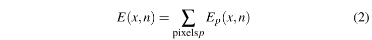

# Reflective Shadow Maps

## 1. 介绍

在本文中，作者基于阴影图的想法，描述了一种计算场景中**`one-bounce`间接光**的粗略近似法。在第一个`pass`中，从光源的角度渲染场景，渲染**深度缓冲区**，称为阴影贴图。在`reflective shadow map`中，每一个像素点都额外存储了从被击中的表面**反射的光线**。作者将每个像素解释为一个**小面积光源**。在本文中，作者描述了如何有效和连贯地计算**由这一大组光源引起的照明**，从而产生近似的、可信的和连贯的间接光。

## 2. Reflective Shadow Maps

### 2.1 Data

作者假设场景中的所有表面都是**漫反射体**。`RSM`为每个像素`p`存储**深度值**$d_p$、**世界空间位置**$x_p$、**法线**$n_p$和可见表面点的**反射辐射通量**$\phi_p$（见图1）。每个像素都被解释为一个间接照亮场景的像素光。**通量$\phi_p$**定义了其亮度，见图2。如果作者假设光源是**无限小的**，作者可以把==发射到`ω`方向的辐射强度==描述为：

因此，法线为`n`的表面点`x`因像素光`p`而产生的辐照度为：

请注意，作者有意决定==存储辐射通量==而不是辐射度或辐照度。这样一来，就不必关心**光的反射面积**，这使得**生成和计算**更加简单。

### 2.2 Generation

**`RSM`的生成**类似阴影贴图，但是有**多个渲染目标**（`MRT`）：除了存储深度值$d_p$的**深度缓冲区**，还生成了一个**法线缓冲区**和一个存储$n_p$和$x_p$的**世界空间位置缓冲区**，以及一个存储$\phi_p$的**通量缓冲区**。由于$\phi_p$存储的是**反射通量**，它的计算很简单。

首先，必须计算出**通过每个像素点发射的通量**。对于一个**均匀的平行光**，这是一个==常数==。对于一个**均匀的聚光灯**来说，由于**实体角的减少**，这个通量随着**聚光灯方向余弦**而减少。==反射光通量==是**像素的光通量**乘以**表面的反射系数**。**距离衰减**或**接收器余弦**不是必须被计算。因此，**通量缓冲区**看起来像一个**没有阴影的图像**（图`1`第`4`列）。

和许多全局照明算法的典型情况一样，问题出现在**两面墙的共同边界**上。在这种情况下，**光照积分有一个奇点**，很难进行**数值积分**。作者发现，如果将**像素灯**在**负法线方向**移动**恒定的偏移量**，这些问题可以在很大程度上减少。

### 2.3 Evaluation

表面点`x`的**间接辐照度**可以通过`sum`所有像素的光照度来近似：

以图`2`为例，**一盏聚光灯**从左上方照亮了一个有桌子的房间。对于一个特定的**`light view`像素**`p`，在位置$x_p$有一个**像素光源**，沿其法线$n_p$照亮场景。根据公式`2`，地板上的点`x`接收来自$x_p$的光。对于像素`q`，像素光位于桌子上，因此不会照亮`x`。

请注意，作者不考虑**间接光源的遮挡**，因此在图`2`中，`y`被$x_p$间接照亮，尽管从`y`看不到$x_p$。这可能导致非常错误的结果。然而，在许多情况下，为了GI的效果，这种错误是可以接受的。

对于一个**典型的阴影图**来说，像素的数量是很大的（$512\times 512$），所以上述`sum`计算是非常昂贵的，在实时情况下不实用。相反，作者必须将总和减少到**有限的光源数量**，例如`400`个。作者使用**重要性驱动的方法**来做到这一点，试图将采样集中到相关像素灯上。这个想法可以用图`3`的例子来描述。`x`没有被直接照亮，所以它在**阴影图**中是不可见的。如果将`x`投射到**阴影图**中，在世界空间中**最接近的像素灯**在阴影图中也很接近。$x_{-2}$和$x_{-1}$相对较近，但由于它们的`normal points`远离`x`，它们不贡献间接照明。$x_1$非常接近，但与$x$位于**同一平面**上，所以它也**没有贡献**。最相关的像素光是 $x_2$。

一般来说，可以说`x`和**阴影图中的像素光**$x_p$之间的距离是它们在**世界空间中的距离**的合理近似值。如果**相对于光源的深度值**差别很大，世界空间的距离就会大得多，因此会高估其影响。然而，**重要的间接光源**总是很接近，这些光源在阴影图中也必须是接近的。

所以作者决定按以下方式获得**像素光的样本**：

+ 首先，作者将`x`投影到阴影图$(→(s,t))$中。

+ 然后，作者选择$(s,t)$周围的像素光，**样本密度**随着与$(s,t)$距离的平方而减少。这可以通过选择**相对于$(s,t)$的极坐标样本**轻松实现，也就是说，如果$ξ_1$和$ξ_2$是**均匀分布的随机数**，作者选择位置：

  

+ 然后，作者必须通过用$ξ^2_1$对实现的样本进行加权，来补偿**不同的采样密度**（以及**最后的归一化**）。图4中显示了一个**采样模式的例子**。

  

+ 在实现中，预先计算这样一个采样模式，并在**所有的间接光计算**中重复使用它，这带来了一致性。这种时间上的一致性减少了**动态场景中的闪烁**，但是如果采样数量不够大，**空间上的一致性会导致带状伪影**。在例子场景中，`400`个样本已经足够了。作者可以使用**泊松采样**，来获得**更均匀的样本分布**。

## 3. Screen-Space Interpolation

作者使用`per-pixel`照明来计算**直接照明**，其中`RSM`被绑定为**标准阴影图**。如上所述的间接照明计算仍然过于昂贵，无法在交互式应用中为每个像素执行。然而，通过一个**简单的插值方案**，可以大大减少计算的数量，并对大多数像素使用**廉价的插值**。

在第一个`pass`中，作者计算摄像机视图的、低分辨率图像的间接照明。然后渲染**全分辨率的摄像机视图**，并检查每个像素的间接光是否可以从**周围的四个低分辨率样本**中插值出来。如果样本的法线与像素的法线相似，并且其世界空间的位置与像素的位置接近，这样的低分辨率样本就被视为**适合插值**。

//Todo

## 4. 实现

Todo

